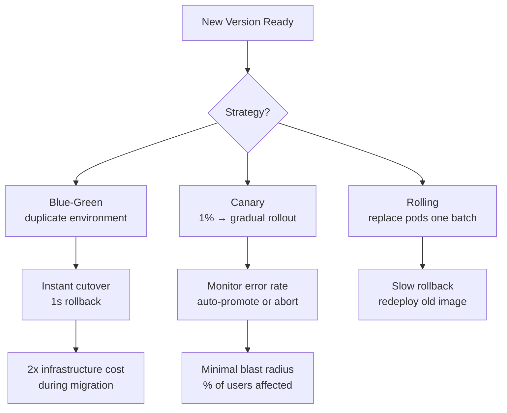
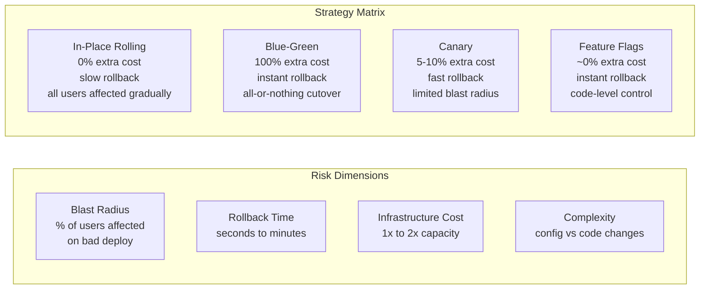
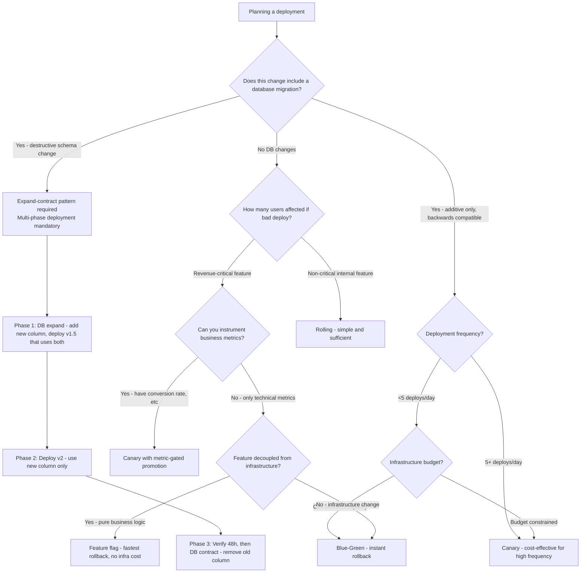

# Deployment Strategies: Blue-Green, Canary, and Feature-Flag Rollouts

## 🗺️ Quick Overview


*Normal path: deploy → validate → promote. Trigger: errors detected after rollout. Recovery speed and blast radius vary drastically by strategy — blue-green wins on rollback speed, canary wins on blast radius.*

**Every deployment is a bet that the new version is better. The strategy you choose determines how much you lose when the bet is wrong — and you will be wrong eventually. The difference between a 1-second rollback and a 30-minute rollback is pure architecture.**

---

## The Problem Class `[Mid]`

Deployment carries risk: runtime errors that testing missed, performance regressions, database migrations that corrupt data, dependency changes that break downstream. The naive deployment model — stop old version, start new version — has 100% blast radius. Every user is affected simultaneously.

The deployment strategy question is: how do you reduce blast radius, maintain rollback capability, and still move fast?



**The four strategies form a spectrum**: each trades infrastructure cost for blast radius control and rollback speed. No single strategy is universally correct.

---

## Why the Obvious Solution Fails `[Senior]`

**Why not just deploy everything in-place (rolling updates)?**

Rolling updates are the Kubernetes default (`strategy: RollingUpdate`). During the rollout, old and new pods coexist. Problems:

1. API compatibility: if v2 has breaking API changes (renamed field, different auth header), old pods and new pods respond differently to the same request — users randomly hit either version
2. Database migrations: if v2 requires a new column, v1 errors on queries that don't include it. v2 errors if it runs before migration. Rolling update + schema migration is a coordination problem.
3. Rollback speed: rolling back a 50-pod deployment takes as long as the original rollout. If your rollout takes 10 minutes, rollback takes 10 minutes.

**Why not always use blue-green?**

Blue-green requires 2x infrastructure capacity during the deployment window. For a 1000-pod service, you need 2000 pods worth of capacity for the duration of every deployment. If you deploy 10 services per day across a 100-pod fleet, you're paying for 100 extra pods constantly. At $0.05/pod-hour on spot instances, that's $120/day in waste just for deployment headroom.

Blue-green also has a database problem: the green environment uses the same database as blue. If v2 runs a destructive migration (dropping a column), you can't roll back — the database is already modified.

**Why not just use feature flags for everything?**

Feature flags solve the user-impact problem (toggle off for affected users) but don't solve the infrastructure problem (bad code is still deployed and consuming resources). A feature flag can't help if the bad code causes OOM crashes at startup before the flag is even evaluated.

---

## The Solution Landscape `[Senior]`

### Solution 1: Blue-Green Deployment

**What it is**

Run two identical environments (blue = current production, green = new version). Deploy to green, test it, switch traffic from blue to green via a DNS change or load balancer rule. Blue remains idle as an instant rollback target.

**How it actually works at depth**

```
Initial state:    LB → Blue (v1, 100% traffic)  |  Green (idle)
Deploy:           LB → Blue (v1, 100% traffic)  |  Green (v2, deployed, tested)
Cutover:          LB → Green (v2, 100% traffic) |  Blue (v1, idle, rollback target)
Cleanup:          LB → Green (v2, 100% traffic) |  Blue (decommission after 24h)
Rollback:         LB → Blue (v1, 100% traffic)  |  Green (v2, rolled back from)
```

Load balancer switching time:
- AWS ALB weighted target groups: < 1 second
- DNS-based switching: 60-300 seconds (DNS TTL dependent) — don't use DNS for blue-green
- Kubernetes Service selector update: < 5 seconds

**Sizing guidance** `[Staff+]`

Blue-green infrastructure cost multiplier:
```
steady_state_capacity = N pods
blue-green_capacity = 2N pods during deployment window

Deployment window duration: typically 30 minutes (deploy + smoke test + cutover)
If you deploy 5 times/day, 30 min each:
Cost overhead = 2.5 hours × N pods × hourly_cost / 24 hours = ~10% overhead

If you deploy 20 times/day (continuous delivery):
Cost overhead = 10 hours × N pods × hourly_cost / 24 hours = ~42% overhead
```

Blue-green is most cost-efficient for low-deployment-frequency services. For high-frequency deployments, canary or rolling updates are more economical.

**Database migration coordination** `[Staff+]`

Blue-green with database changes requires expand-contract pattern:
1. **Expand** (deploy v1.5): Add new column, keep old column. Both v1 and v2 work.
2. **Deploy v2** (blue-green): v2 reads new column, writes both old and new.
3. **Verify** v2 is stable for 24-48 hours.
4. **Contract** (deploy v2.1): Remove old column. Now v1 can't roll back — accept this.

Never run a destructive database migration during the same deployment as application code changes.

**Failure modes** `[Staff+]`

1. **Warm-up gap**: Green environment is cold when it receives 100% traffic. JVM JIT compilation, connection pool warming, cache population all happen after cutover. P99 latency spikes for 2-5 minutes post-cutover. Mitigation: synthetic load testing of green before cutover; health check with realistic traffic patterns.

2. **Session stickiness**: Users authenticated against blue lose sessions when cut to green (if sessions are in-memory). Mitigation: externalize sessions to Redis before deployment.

3. **Long-running blue connections**: WebSocket connections, long-polls, streaming responses — these stay connected to blue after cutover. They need to be drained, not killed. Set connection draining timeout (ALB: `deregistration_delay.timeout_seconds`) to 60-300 seconds.

---

### Solution 2: Canary Deployment

**What it is**

Deploy the new version to a small subset of instances. Route a percentage of traffic to canary. Monitor metrics. If metrics are healthy, progressively increase traffic. If metrics degrade, roll back by routing all traffic back to stable.

**How it actually works at depth**

```
Stage 1: 5% canary
  - Deploy 5 canary pods alongside 95 stable pods
  - Monitor: error rate, p99 latency, business metrics (order completion rate)
  - Duration: 30 minutes to 2 hours depending on traffic volume

Stage 2: 25% canary  (if Stage 1 passed)
  - Scale canary to 25 pods, scale stable to 75 pods
  - Metrics must maintain SLO for full duration

Stage 3: 100% (cutover)
  - All traffic to canary; stable pods stand by for 15 minutes
  - Decommission stable after confirmation
```

**Metric-gated promotion** is the key mechanism — humans don't decide when to progress; metrics do:

```yaml
# Argo Rollouts metric analysis
apiVersion: argoproj.io/v1alpha1
kind: AnalysisTemplate
metadata:
  name: success-rate
spec:
  metrics:
  - name: success-rate
    successCondition: result[0] >= 0.95    # 95% success rate required
    failureCondition: result[0] < 0.90     # <90% = automatic rollback
    provider:
      prometheus:
        address: http://prometheus:9090
        query: |
          sum(rate(http_requests_total{job="order-service",status!~"5.."}[5m]))
          /
          sum(rate(http_requests_total{job="order-service"}[5m]))
```

**Sizing guidance** `[Staff+]`

Canary pod count for statistical significance:
```
To detect a 1% increase in error rate (from 0.5% to 1.5%) with 95% confidence:
Required sample size ≈ 10,000 requests

At 100 RPS to canary: need 100 seconds of data — 2 minutes
At 10 RPS to canary (5% of 200 RPS total): need 1000 seconds — 17 minutes

Practical rule: canary stage should receive at least 10,000 requests before promotion.
Time to pass = 10,000 / (total_RPS × canary_percentage)
```

Infrastructure overhead: 5% canary requires 5% extra capacity = ~5% infrastructure cost. Far more economical than blue-green's 100% overhead.

**Failure modes** `[Staff+]`

1. **Low-traffic services with insufficient canary data**: A service handling 10 RPS total, with 5% canary = 0.5 RPS. Getting 10,000 requests for statistical significance takes 5.5 hours. Either accept lower confidence or use traffic shadowing (dark launch) to amplify canary data.

2. **Slow error regression**: Some errors only appear after extended run time (memory leaks manifest over hours, not minutes). Stage 1's 30-minute window won't catch a 4-hour memory leak. Add canary stages with longer durations for high-risk changes.

3. **User experience inconsistency**: With 5% canary, a user's repeated requests may hit different versions (unless you shard by user ID). Shopping cart state, UI changes, and session-dependent features are broken by random version mixing. Use consistent hashing by user ID for routing.

---

### Solution 3: Rolling Deployment

**What it is**

Replace pods incrementally: take down 10% of old pods, start new pods, wait for health checks, repeat. All traffic is served throughout; some users hit old pods, some hit new.

**Sizing guidance** `[Staff+]`

```yaml
# Kubernetes rolling update configuration
strategy:
  type: RollingUpdate
  rollingUpdate:
    maxUnavailable: 10%    # At most 10% of pods unavailable at once
    maxSurge: 10%          # At most 10% extra pods above desired count
```

At 100 desired pods, 10% surge: 110 pods maximum capacity during rollout = 10% infrastructure overhead during deployment only (not a steady-state cost).

Rollout duration at 10% per step:
```
100 pods, maxUnavailable=10, maxSurge=10
Steps: 10 (each replacing 10 pods)
If health check = 30s and pod startup = 60s:
Total rollout = 10 steps × 90s = 15 minutes
Rollback: same 15 minutes
```

**When rolling works**: Services with backwards-compatible API changes and no schema migrations. The safest class of change for rolling deployment is a pure logic change with no API surface changes.

---

### Solution 4: Feature Flag Deployment (Code-Level Toggle)

**What it is**

Deploy code with new behavior disabled by a runtime flag. Enable the flag for a percentage of users, user segments, or geographic regions. The deployment and the rollout are decoupled — you deploy once, control blast radius via flags.

**How it actually works at depth**

```typescript
// Flag evaluation at request time
const newCheckoutEnabled = await featureFlags.isEnabled(
  'new-checkout-flow',
  {
    userId: req.user.id,
    userSegment: req.user.plan,    // 'free' | 'pro' | 'enterprise'
    region: req.geoip.region,
  }
);

if (newCheckoutEnabled) {
  return await newCheckoutService.process(order);
} else {
  return await legacyCheckoutService.process(order);
}
```

Flag rollout stages:
1. Deploy code with flag off (0% rollout) — verify no startup issues
2. Enable for internal users (1 user segment)
3. Enable for beta users (1% of total)
4. Enable for 5% → 25% → 50% → 100%
5. Remove flag and dead code (critical — see flag debt section)

---

## Trade-off Matrix `[Senior]` → `[Staff+]`

| Dimension | Rolling | Blue-Green | Canary | Feature Flags |
|---|---|---|---|---|
| **Infrastructure cost overhead** | ~10% (during rollout) | 100% (during window) | 5-10% | ~0% |
| **Rollback time** | Same as rollout (minutes) | < 5 seconds | < 30 seconds | < 1 second |
| **Blast radius at peak** | 100% (all pods eventually) | 100% (hard cutover) | 5-25% (controlled) | 0-100% (controlled) |
| **API compatibility required** | Yes (old+new coexist) | No (full cutover) | Yes (during stages) | Yes (both paths live) |
| **DB migration support** | Very hard | Expand-contract | Expand-contract | Code handles both |
| **Observability complexity** | Low | Low | High (dual metrics) | High (flag-dimension metrics) |
| **Cold start problem** | No (gradual) | Yes (cutover spike) | No (gradual) | No |
| **Session consistency** | Varies | Broken on cutover | Varies by routing | Flag-evaluated per request |

---

## Decision Framework `[Senior]` → `[Staff+]`



---

## Production Failure Story `[Staff+]`

**The Canary That Wasn't Measuring the Right Thing**

An e-commerce platform deployed a canary for a new checkout redesign. They configured metric-gated promotion based on HTTP 5xx error rate. Canary stage 1 (5% traffic, 30 minutes): error rate 0.3% — healthy. Stage 2 (25% traffic, 1 hour): error rate 0.4% — healthy. Full cutover: error rate 0.5% — within SLO.

24 hours later: revenue ops flagged a 12% drop in checkout completion rate (conversion). The new checkout design had a confusing UX change on step 3 of 5 — users were abandoning, not erroring. HTTP 200 responses with users navigating away.

The canary metrics were technically correct — no errors. But the business metric (checkout completion rate) was missing from the promotion criteria.

**Fix**: Add business metric gates to canary analysis:
```yaml
metrics:
- name: checkout-completion-rate
  successCondition: result[0] >= 0.68    # 68% completion rate baseline
  failureCondition: result[0] < 0.62     # 8% relative drop = rollback
  provider:
    prometheus:
      query: |
        sum(rate(checkout_completed_total[15m]))
        /
        sum(rate(checkout_started_total[15m]))
```

**Lesson**: Canary promotion criteria must include business metrics, not just infrastructure metrics. A successful 5xx rate with degraded conversion is a failed deployment.

---

## Observability Playbook `[Staff+]`

**Deployment-window metrics to track**:

- `deployment_progress{version, stage}` — percentage of traffic on new version
- `error_rate{version}` — compare old vs new version error rates during canary
- `p99_latency{version}` — compare latency profiles side-by-side
- `business_metric{version}` — conversion rate, order completion, etc.

**Golden signals split by version** (Kubernetes labels):
```yaml
# Add version label to all pods for metric segmentation
labels:
  app: order-service
  version: "v2.3.1"    # makes version available as Prometheus label
```

**Rollback triggers** (automated):
- Error rate on new version > 2× baseline: trigger automatic rollback
- P99 latency on new version > 150% of baseline: page on-call + consider rollback
- Business metric drops > 5% relative: immediate escalation

---

## Architectural Evolution `[Staff+]`

**2026 perspective**:

**Progressive delivery platforms** (Argo Rollouts, Flagger) have standardized canary automation in Kubernetes. Flagger integrates natively with Istio, Linkerd, and NGINX Ingress, providing automated analysis and rollback based on Prometheus metrics with minimal YAML configuration.

**Deployment observability**: Grafana's Deployment Insights plugin (2025) automatically marks deployment events on all dashboards. When a metric spike correlates with a deployment timestamp, the correlation is surfaced automatically — reducing time-to-diagnosis for deployment regressions.

**Feature flag consolidation**: The OpenFeature standard (CNCF project, GA in 2024) provides a vendor-neutral SDK for feature flags. Teams can switch between LaunchDarkly, Flagsmith, and Unleash without changing application code. This reduces feature flag vendor lock-in, a growing concern as flag platforms have become deeply embedded in deployment workflows.

**Blue-green via GitOps**: Argo CD supports blue-green deployments at the GitOps layer. The green environment is a separate Kustomize overlay or Helm values file; promotion is a git commit. This provides audit trail, peer review, and automated rollback as first-class git operations.

---

## Decision Framework Checklist `[All Levels]`

- [ ] Identified whether deployment includes database migrations (changes strategy selection)
- [ ] Calculated blast radius for each strategy option given expected traffic
- [ ] Determined rollback time requirement based on revenue impact per minute of downtime
- [ ] Sized infrastructure overhead for blue-green against deployment frequency
- [ ] Defined promotion criteria for canary (include business metrics, not just error rate)
- [ ] Configured health checks that reflect real service readiness (not just process startup)
- [ ] Tested rollback procedure in staging — rollback that has never been tested will fail in crisis
- [ ] For blue-green: externalized session state to shared store before attempting
- [ ] For canary: configured consistent user routing (same user hits same version)
- [ ] For feature flags: created ticket for flag cleanup with 90-day expiry
- [ ] Deployment runbook accessible to on-call team with rollback commands
- [ ] Metrics split by version label for side-by-side comparison during deployment

*Written by Gaurav Porwal — 10+ Year Engineer | Tech Lead | Product Owner | Business-Minded Builder*
*Last updated: 2026-03-18*
