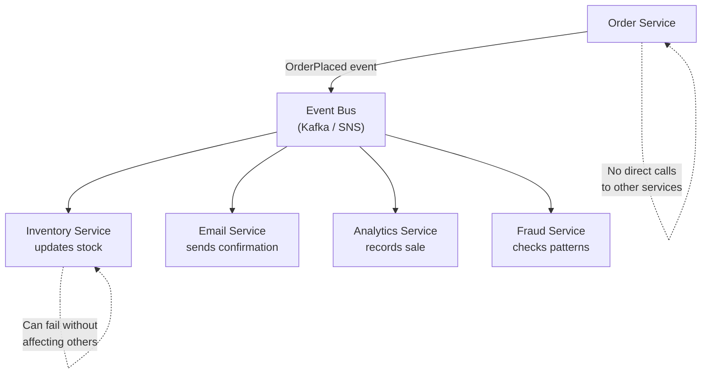

# Event-Driven Architecture - Loose Coupling at Scale

> **Reading Time:** 22 minutes
> **Difficulty:** Advanced
> **Impact:** Build systems where services evolve independently and failures don't cascade

## 🗺️ Quick Overview



*Event-driven architecture replaces direct service-to-service calls with a shared event bus — producers publish events without knowing who consumes them, enabling loose coupling and independent scaling.*

## The Coupling Problem

**Your services are too friendly with each other.**

```
Tightly coupled (request-driven):

OrderService:
  async createOrder(data) {
    const order = await db.save(data);
    await paymentService.charge(order);       // Direct call
    await inventoryService.reserve(order);    // Direct call
    await emailService.sendConfirmation(order);// Direct call
    await analyticsService.trackOrder(order); // Direct call
    await loyaltyService.addPoints(order);    // Direct call
    return order;
  }

Problems:
  1. OrderService KNOWS about 5 other services
  2. Add notification service → change OrderService code
  3. PaymentService slow → OrderService slow
  4. AnalyticsService down → OrderService fails
  5. Can't deploy OrderService without testing all 5 services
  6. Circular dependencies emerge over time
```

```
Loosely coupled (event-driven):

OrderService:
  async createOrder(data) {
    const order = await db.save(data);
    await eventBus.publish('OrderCreated', order);  // That's it
    return order;
  }

  OrderService doesn't know WHO listens.
  Add a new service? Just subscribe to the event.
  Payment service slow? OrderService doesn't notice.
  Analytics down? Orders keep working.
```

---

## Core Concepts

### Events vs Commands vs Queries

```
EVENT: "Something happened" (past tense)
  OrderCreated, PaymentProcessed, UserRegistered
  → Publisher doesn't care who listens
  → Zero, one, or many subscribers
  → Immutable fact

COMMAND: "Do something" (imperative)
  ProcessPayment, SendEmail, ReserveInventory
  → Sender expects a specific handler
  → Exactly one handler
  → Can be rejected

QUERY: "Tell me something" (question)
  GetOrder, FindUser, ListProducts
  → Synchronous request-response
  → Returns data
  → Side-effect free

In practice:
  ┌──────────────────────────────────────────────┐
  │                                              │
  │  Event: "OrderCreated"                       │
  │    → Payment subscribes: Process payment     │
  │    → Inventory subscribes: Reserve stock     │
  │    → Email subscribes: Send confirmation     │
  │    → Analytics subscribes: Track metrics     │
  │    → Loyalty subscribes: Add points          │
  │                                              │
  │  OrderService published ONE event.           │
  │  5 services reacted independently.           │
  │  OrderService has ZERO knowledge of them.    │
  │                                              │
  └──────────────────────────────────────────────┘
```

### Event Types

```
1. Domain Events (business facts)
   OrderPlaced, PaymentReceived, ItemShipped
   → Business meaning, consumed by business services

2. Integration Events (cross-service)
   UserCreated → sync user data to search index
   PriceChanged → update cached prices
   → Technical integration between systems

3. Notification Events (side effects)
   OrderPlaced → send email, push notification
   → Trigger side effects, non-critical

4. Change Data Capture Events (data changes)
   INSERT into orders table → OrderRowInserted
   → Database-level events, used for data sync
```

---

## Architecture Patterns

### Pattern 1: Event Bus (Simple Pub/Sub)

```
Central event bus (Kafka, RabbitMQ, SNS):

┌──────────┐
│  Order   │──▶ OrderCreated ──┐
│ Service  │                   │
└──────────┘                   ▼
                         ┌───────────┐
┌──────────┐             │  Event    │
│ Payment  │◀────────────│   Bus     │
│ Service  │             │  (Kafka)  │
└──────────┘             │           │
                         │           │
┌──────────┐             │           │
│ Email    │◀────────────│           │
│ Service  │             │           │
└──────────┘             │           │
                         │           │
┌──────────┐             │           │
│Analytics │◀────────────│           │
│ Service  │             └───────────┘
└──────────┘

Each service:
  - Publishes events about things IT did
  - Subscribes to events from OTHER services
  - Processes events independently
  - Fails independently (no cascading)
```

### Pattern 2: Event Sourcing

```
Instead of storing current state, store all events:

Traditional (state-based):
  orders table:
    id: 123, status: "shipped", total: $99.99

Event sourcing:
  order_events table:
    1. OrderCreated    { id: 123, items: [...], total: $99.99 }
    2. PaymentReceived { id: 123, amount: $99.99 }
    3. OrderConfirmed  { id: 123 }
    4. ItemPicked      { id: 123, warehouse: "WH-5" }
    5. OrderShipped    { id: 123, tracking: "FX123" }

  Current state = replay all events
  Like a bank account: balance = sum of all transactions

Benefits:
  ✅ Complete audit trail (every change recorded)
  ✅ Time travel (rebuild state at any point in time)
  ✅ Debug issues (replay events to reproduce bugs)
  ✅ New projections (build new views from existing events)

Costs:
  ❌ More complex to query (need projections)
  ❌ Event schema evolution is tricky
  ❌ Storage grows indefinitely (snapshots help)
  ❌ Eventual consistency (projections lag behind)
```

```
Event Store + Projections:

Events (write side):
  ┌─────────────────────────────────┐
  │ Event Store (append-only log)   │
  │                                 │
  │ [OrderCreated] [PaymentDone]    │
  │ [OrderShipped] [ItemReturned]   │
  └─────────────┬───────────────────┘
                │
        ┌───────┼───────────┐
        ▼       ▼           ▼
  ┌──────────┐ ┌──────────┐ ┌──────────┐
  │ Orders   │ │ Revenue  │ │ Search   │
  │ View     │ │Dashboard │ │ Index    │
  │ (read)   │ │ (read)   │ │ (read)   │
  └──────────┘ └──────────┘ └──────────┘

  Each projection subscribes to events
  Builds its own optimized read model
  Can be rebuilt from scratch anytime
```

### Pattern 3: Choreography vs Orchestration

```
CHOREOGRAPHY: Services react to events independently
  (No central coordinator - like a jazz band)

  OrderCreated ──▶ PaymentService ──▶ PaymentProcessed
  PaymentProcessed ──▶ InventoryService ──▶ InventoryReserved
  InventoryReserved ──▶ ShippingService ──▶ OrderShipped

  Pros: Loose coupling, services are autonomous
  Cons: Hard to track flow, difficult error handling

ORCHESTRATION: Central coordinator manages the flow
  (Like a conductor leading an orchestra)

  ┌─────────────────────────┐
  │    Order Saga           │
  │    (Orchestrator)       │
  │                         │
  │ 1. → PaymentService     │
  │    ← PaymentDone        │
  │                         │
  │ 2. → InventoryService   │
  │    ← InventoryReserved  │
  │                         │
  │ 3. → ShippingService    │
  │    ← ShipmentCreated    │
  │                         │
  │ Error? Run compensations│
  └─────────────────────────┘

  Pros: Clear flow, easy error handling, visible state
  Cons: Orchestrator is a single point of control

When to use which:
  Simple flows (3-4 steps): Choreography
  Complex flows (5+ steps, error handling): Orchestration
  Mix: Choreography between bounded contexts,
       Orchestration within a bounded context
```

---

## Implementing Event-Driven Architecture

### Event Schema Design

```json
// Event envelope (standard wrapper)
{
  "eventId": "evt-a1b2c3d4",
  "eventType": "OrderCreated",
  "aggregateId": "order-123",
  "aggregateType": "Order",
  "timestamp": "2026-01-15T10:30:00Z",
  "version": 1,
  "source": "order-service",
  "correlationId": "req-x1y2z3",
  "metadata": {
    "userId": "user-456",
    "traceId": "trace-abc",
    "environment": "production"
  },
  "data": {
    "orderId": "order-123",
    "customerId": "cust-789",
    "items": [
      { "productId": "prod-1", "quantity": 2, "price": 29.99 }
    ],
    "total": 59.98,
    "currency": "USD"
  }
}
```

```
Event schema best practices:

1. Use past tense for event names
   ✅ OrderCreated, PaymentProcessed
   ❌ CreateOrder, ProcessPayment

2. Include all data needed by consumers
   Consumer shouldn't need to call back to the publisher
   ✅ { orderId, customerId, items, total }
   ❌ { orderId } (forces consumer to call Order API)

3. Version your events
   v1: { total: 59.98 }
   v2: { total: 59.98, currency: "USD", tax: 4.50 }
   Consumers handle both versions during migration

4. Use correlation IDs for tracing
   Same correlationId across the entire order flow
   OrderCreated → PaymentProcessed → InventoryReserved
   All share the same correlationId for debugging
```

### Event Consumer Patterns

```javascript
// Idempotent consumer (processes each event AT MOST once)
class PaymentConsumer {
  async handle(event) {
    // 1. Check if already processed
    const processed = await this.db.processedEvents.findOne({
      eventId: event.eventId
    });
    if (processed) {
      return; // Already handled, skip
    }

    // 2. Process the event
    if (event.eventType === 'OrderCreated') {
      const payment = await this.stripe.charge({
        amount: event.data.total,
        currency: event.data.currency,
        customerId: event.data.customerId
      });

      // 3. Record processing (same transaction as business logic)
      await this.db.transaction(async (tx) => {
        await tx.payments.create({
          orderId: event.data.orderId,
          stripeId: payment.id,
          amount: event.data.total
        });
        await tx.processedEvents.create({
          eventId: event.eventId,
          processedAt: new Date()
        });
      });

      // 4. Publish result event
      await this.eventBus.publish({
        eventType: 'PaymentProcessed',
        aggregateId: event.data.orderId,
        correlationId: event.correlationId,
        data: {
          orderId: event.data.orderId,
          paymentId: payment.id,
          amount: event.data.total
        }
      });
    }
  }
}
```

### Saga Pattern (Distributed Transactions)

```javascript
// Orchestration saga for order processing
class OrderSaga {
  constructor() {
    this.steps = [
      {
        action: 'processPayment',
        compensation: 'refundPayment'
      },
      {
        action: 'reserveInventory',
        compensation: 'releaseInventory'
      },
      {
        action: 'createShipment',
        compensation: 'cancelShipment'
      }
    ];
  }

  async execute(order) {
    const completedSteps = [];

    for (const step of this.steps) {
      try {
        const result = await this[step.action](order);
        completedSteps.push({ step, result });
      } catch (error) {
        // Step failed → compensate all completed steps (reverse order)
        for (const completed of completedSteps.reverse()) {
          try {
            await this[completed.step.compensation](order, completed.result);
          } catch (compError) {
            // Log compensation failure for manual intervention
            await this.alertOps(order, completed.step, compError);
          }
        }
        throw new SagaFailedError(step.action, error);
      }
    }

    await this.eventBus.publish({
      eventType: 'OrderCompleted',
      data: { orderId: order.id }
    });
  }

  async processPayment(order) {
    return await this.paymentService.charge(order);
  }

  async refundPayment(order, paymentResult) {
    return await this.paymentService.refund(paymentResult.paymentId);
  }

  async reserveInventory(order) {
    return await this.inventoryService.reserve(order.items);
  }

  async releaseInventory(order, reserveResult) {
    return await this.inventoryService.release(reserveResult.reservationId);
  }
}
```

---

## Event Infrastructure

### Event Store Options

```
Apache Kafka:
  - De facto standard for event streaming
  - Durable, ordered, replayable
  - High throughput (millions/sec)
  - Consumer groups for parallel processing
  Best for: Event streaming, high volume

EventStoreDB:
  - Purpose-built for event sourcing
  - Projections built-in
  - Subscriptions and catch-up
  - Optimistic concurrency
  Best for: Event sourcing, domain events

AWS EventBridge:
  - Serverless event bus
  - Schema registry built-in
  - Rule-based routing
  - Cross-account events
  Best for: AWS-native, serverless architectures

NATS / NATS JetStream:
  - Lightweight, high performance
  - JetStream adds persistence
  - Simple protocol
  Best for: Edge computing, IoT, microservices
```

### Schema Registry

```
Problem: Event schema changes break consumers

v1: { "orderId": "123", "amount": 99.99 }
v2: { "orderId": "123", "amount": 99.99, "currency": "USD" }
v3: { "orderId": "123", "total": { "amount": 99.99, "currency": "USD" } }

Schema Registry enforces compatibility:

┌──────────┐     ┌────────────────┐     ┌──────────┐
│ Producer │────▶│Schema Registry │────▶│  Kafka   │
│          │     │                │     │          │
│ Validates│     │ Checks:        │     │ Stores   │
│ schema   │     │ - Compatible?  │     │ events   │
│ before   │     │ - Valid format?│     │          │
│ publish  │     │ - Registered?  │     │          │
└──────────┘     └────────────────┘     └──────────┘

Compatibility modes:
  BACKWARD: New schema can read old events ✅
  FORWARD: Old consumers can read new events ✅
  FULL: Both directions compatible ✅ (recommended)

Rules:
  ✅ Add optional fields (backward compatible)
  ✅ Add fields with defaults (backward compatible)
  ❌ Remove required fields (breaks old consumers)
  ❌ Rename fields (breaks everything)
  ❌ Change field types (breaks everything)
```

---

## Eventual Consistency

### Embracing Eventual Consistency

```
Event-driven systems are eventually consistent by nature:

1. OrderService saves order (status: PENDING)
2. Publishes OrderCreated event
3. PaymentService processes payment (takes 2 seconds)
4. PaymentService publishes PaymentProcessed
5. OrderService receives event, updates status: CONFIRMED

Between step 2 and 5 (2+ seconds):
  OrderService: status = PENDING
  PaymentService: payment = COMPLETE
  State is INCONSISTENT (but temporarily)

This is fine! Users see: "Processing your order..."
Then: "Order confirmed!" (once consistent)
```

### Patterns for Handling Eventual Consistency

```
1. Optimistic UI
   Show success immediately, update if it fails
   "Order placed!" → background processing → "Confirmed!"

2. Polling / WebSocket
   Client polls for status updates
   Or server pushes via WebSocket when state changes

3. Read Your Own Writes
   After writing, read from same source (not replica)
   Ensures user sees their own changes immediately

4. Compensation
   If eventual state is wrong, fix it
   Double charge? Issue automatic refund
   Oversold? Cancel and notify customer
```

---

## Real-World Example: Uber

```
Uber's Event-Driven Architecture:

Trip lifecycle as events:

  DriverAvailable → RideRequested → DriverMatched
  → DriverEnRoute → DriverArrived → TripStarted
  → TripCompleted → PaymentProcessed → DriverPaid

Each event triggers multiple reactions:

TripCompleted:
  ├── PaymentService → charges rider
  ├── PricingService → calculates surge
  ├── ETAService → updates ETA model
  ├── FraudService → checks for anomalies
  ├── AnalyticsService → updates metrics
  ├── NotificationService → notifies rider+driver
  └── ReceiptService → generates receipt

Infrastructure:
  - Apache Kafka: 1 trillion+ messages/day
  - 4,000+ topics
  - Event sourcing for trip state
  - Choreography between services
  - Saga for payment flow (orchestrated)
```

---

## Common Mistakes

### 1. Event as Remote Procedure Call

```
❌ Publishing events that are actually commands:
   Event: "SendEmailToUser123"
   → This is a command disguised as an event
   → Creates hidden coupling

✅ Publish facts, let consumers decide what to do:
   Event: "OrderShipped"
   → EmailService decides to send a shipping notification
   → SMSService decides to send tracking link
   → Publisher doesn't know or care
```

### 2. Putting Too Much in One Event

```
❌ Giant events with everything:
   OrderCreated: { order, customer, products, pricing,
     inventory, shipping, recommendations, ... }
   10KB per event × 1M events = 10GB/day of bloat

✅ Include what consumers need, reference the rest:
   OrderCreated: { orderId, customerId, items, total }
   Consumer needs customer details? Call Customer API
   (Or subscribe to CustomerCreated events for local cache)
```

### 3. No Dead Letter Queue

```
❌ Consumer fails → message lost or retried forever

✅ Max retries → Dead Letter Queue → alert → manual fix
   Every event consumer needs a DLQ strategy
```

### 4. Ignoring Event Ordering

```
❌ Processing OrderShipped before OrderCreated
   Out-of-order events break business logic

✅ Use partition keys (same entity → same partition)
   Order events partitioned by orderId
   All events for order-123 are in order
```

---

## 🎯 Interview Questions

### Common Interview Questions on Event-Driven Architecture

#### Q1: How does event-driven architecture differ from request-response?
**What interviewers look for**: A clear mental model distinguishing push-based async communication from pull-based synchronous coupling, and knowing when each applies.

**Answer framework**:
1. **Request-response** is synchronous and tightly coupled — the caller blocks waiting for the response; if the called service is slow or down, the caller fails. OrderService calling PaymentService directly means both must be up for either to work.
2. **Event-driven** is asynchronous and loosely coupled — the publisher emits an event ("OrderCreated") and moves on; consumers react independently. OrderService doesn't know how many consumers exist or what they do.
3. **Trade-off**: EDA gains resilience and scalability but loses synchronous consistency — you get eventual consistency instead of immediate confirmation.

**Key numbers to mention**: Uber processes 1 trillion+ messages/day on Kafka; a tightly-coupled OrderService calling 5 services synchronously adds 2,400ms latency vs 865ms with async events for the non-critical path.

---

#### Q2: How do you handle event ordering in a distributed event-driven system?
**What interviewers look for**: Understanding of partition keys, the limits of ordering guarantees, and practical patterns for order-sensitive workflows.

**Answer framework**:
1. **Partition by entity ID**: In Kafka, route all events for the same entity (e.g., same `orderId`) to the same partition by using `orderId` as the partition key — ordering is guaranteed within a partition.
2. **Consumer-side sequencing**: Store an `eventVersion` or `sequence` field on each event; consumer checks if it's receiving events in order and defers out-of-order events to a retry queue.
3. **Accept partial ordering**: Between different entities (order-123 vs order-456), ordering is NOT guaranteed — design consumers to be stateless per entity or tolerant of cross-entity out-of-order delivery.

**Key numbers to mention**: Kafka guarantees ordering per partition; across partitions there is no ordering. A topic with 12 partitions can have 12 consumers in parallel, each seeing ordered events for their partition subset.

---

#### Q3: What are the trade-offs between event sourcing and traditional CRUD?
**What interviewers look for**: Understanding of when event sourcing is worth the complexity, what you gain (audit trail, replay), and what you give up (query complexity).

**Answer framework**:
1. **Event sourcing stores the history** (all events that happened), not current state. Current state is derived by replaying events. Like a bank account: balance = sum of all transactions, not a single `balance` column.
2. **Benefits**: Complete audit trail (compliance, debugging), time travel (rebuild state at any past point), new read projections can be built by replaying existing events with no data migration.
3. **Costs**: Querying is harder (you need projections/read models, not direct SQL); event schema evolution is risky (changing old events breaks replay); storage grows indefinitely (snapshots help); ~5-10x more infrastructure complexity than simple CRUD.

**Key numbers to mention**: Event sourcing makes sense for financial systems, healthcare records, or legal audit trails — anywhere the full history is valuable. For a blog or user profile service, it's over-engineering.

---

#### Q4: When should you use choreography vs orchestration in distributed workflows?
**What interviewers look for**: A nuanced answer that doesn't treat either pattern as universally superior, with concrete examples and failure handling awareness.

**Answer framework**:
1. **Choreography**: Each service reacts to events independently — OrderCreated → PaymentService processes → PaymentProcessed → InventoryService reserves. Simple to add new steps (just subscribe to events), but hard to trace the overall flow and handle partial failures.
2. **Orchestration (Saga)**: A central coordinator calls each service in sequence, tracks progress, and runs compensating transactions on failure. Harder to add new steps but the flow is explicit, traceable, and failure handling is centralized.
3. **Decision rule**: 3–4 linear steps → choreography. 5+ steps with branching, error handling, or compensation logic → orchestration. Mix both: choreography between bounded contexts, orchestration within a context.

**Key numbers to mention**: Netflix uses both — choreography for event propagation between 700+ microservices, but orchestration (Conductor) for complex workflows like content ingestion pipelines with 15+ steps.

---

#### Q5: How do you ensure exactly-once processing in an event-driven system?
**What interviewers look for**: Understanding of idempotency keys, at-least-once delivery semantics, and the database pattern that makes de-duplication reliable.

**Answer framework**:
1. **Most systems guarantee at-least-once delivery** (Kafka, SQS, SNS) — the broker will re-deliver if the consumer doesn't acknowledge. "Exactly-once" at the infrastructure layer requires transactions across the broker and the consumer state, which is complex.
2. **Practical solution: idempotent consumers**. Store the `eventId` in a `processed_events` table inside the same database transaction as the business operation. Before processing, check if `eventId` already exists. This makes the consumer safe to retry.
3. **The outbox pattern**: When writing to your DB, write the event to an `outbox` table in the same transaction. A separate process reads from the outbox and publishes to Kafka. This prevents the "charge happened but event not published" race condition.

**Key numbers to mention**: Kafka supports exactly-once semantics (EOS) within a single Kafka cluster using transactions, but cross-system exactly-once still requires application-level idempotency. The overhead of idempotency checks is typically < 1ms with indexed lookups.

---

#### Q6: How do you handle schema evolution in a long-running event-driven system?
**What interviewers look for**: Knowledge of schema registries, backward/forward compatibility rules, and practical migration patterns.

**Answer framework**:
1. **Use a schema registry** (Confluent Schema Registry, AWS Glue) — producers validate against a registered schema before publishing; consumers reject events with incompatible schemas.
2. **Backward-compatible changes only**: Adding optional fields is safe (old consumers ignore them). Removing required fields or renaming fields breaks existing consumers.
3. **Version your events**: Include `"version": 1` in event metadata. Consumers implement a migration function: `if (event.version === 1) { /* old handling */ } else { /* new handling */ }`. During migration, both versions coexist; old consumers keep working while new consumers handle both.

**Key numbers to mention**: With FULL compatibility mode (schema registry), new schemas must be readable by old consumers AND new consumers must be able to read old events — this is the gold standard. Plan for at least 2 schema versions running simultaneously during any migration.

---

## Key Takeaways

```
1. Events decouple services
   Publishers don't know about subscribers
   Add new services without changing existing ones

2. Use events for facts, commands for requests
   "OrderCreated" (event) vs "ProcessPayment" (command)
   Events = past tense, Commands = imperative

3. Event sourcing is powerful but complex
   Complete audit trail and time travel
   Use it where audit trails matter (finance, healthcare)
   Don't use it everywhere

4. Choreography for simple flows, orchestration for complex
   3-4 steps: let services react to events
   5+ steps with error handling: use a saga orchestrator

5. Every consumer must be idempotent
   Events will be delivered at least once
   Design for duplicate processing

6. Schema evolution requires planning
   Use a schema registry
   Only make backward-compatible changes
   Version your events

7. Eventual consistency is a feature, not a bug
   Design UIs for optimistic updates
   Use polling/WebSocket for status updates
   Compensation for error correction
```
