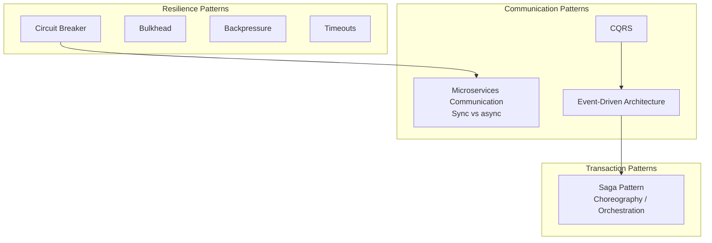

# Architecture Concepts

Patterns for building resilient, scalable distributed systems.

```mermaid
graph TD
    subgraph "Resilience Patterns"
        CB[Circuit Breaker]
        BB[Bulkhead]
        BP[Backpressure]
        TO[Timeouts]
    end
    subgraph "Communication Patterns"
        MC[Microservices Communication\nSync vs async]
        EDA[Event-Driven Architecture]
        CQRS[CQRS]
    end
    subgraph "Transaction Patterns"
        SAGA[Saga Pattern\nChoreography / Orchestration]
    end
    CB --> MC
    EDA --> SAGA
    CQRS --> EDA
```
