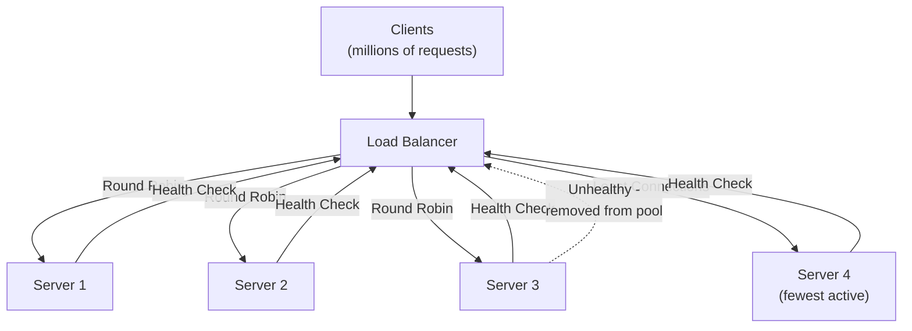

# Load Balancing Strategies - Distribute Traffic Like Netflix

> **Reading Time:** 18 minutes
> **Difficulty:** 🟡 Intermediate
> **Impact:** Handle 10x traffic without adding 10x servers

## 🗺️ Quick Overview



*A load balancer sits in front of a server pool and routes each incoming request to a backend using a chosen algorithm (round-robin, least-connections, consistent hashing) while continuously monitoring server health.*

## The Netflix Problem: 15% of Global Internet Traffic

**How Netflix distributes 400M hours of streaming daily:**

```
Netflix's Load Balancing Stack:
├── DNS Load Balancing (Global)
│   └── Route users to nearest region
├── Edge Load Balancing (Regional)
│   └── NGINX Plus across 20+ edge locations
├── Service Mesh (Internal)
│   └── Zuul gateway + Eureka service discovery
└── Client-Side Load Balancing
    └── Ribbon for microservice calls

Result:
├── 230M subscribers worldwide
├── 99.99% uptime during peak hours
├── Seamless failover between regions
└── Auto-scaling based on traffic patterns
```

**The lesson:** At scale, load balancing isn't optional—it's the foundation of reliability.

---

## The Problem: Single Servers Don't Scale

### Without Load Balancing

```
Single server architecture:

Users ───────► [Single Server] ───────► Database
                    │
                    ▼
             Bottlenecks:
             ├── CPU at 100%
             ├── Memory exhausted
             ├── Network saturated
             └── One failure = total outage

Capacity: ~1,000 requests/second
Availability: 99% (single point of failure)
```

### With Load Balancing

```
Load balanced architecture:

             ┌──► [Server 1] ──┐
             │                  │
Users ──► [LB] ──► [Server 2] ──┼──► Database
             │                  │
             └──► [Server 3] ──┘

Benefits:
├── Horizontal scaling (add more servers)
├── No single point of failure
├── Health checks remove bad servers
└── Traffic distribution optimizes utilization

Capacity: 10,000+ requests/second (scalable)
Availability: 99.99% (redundancy)
```

---

## Load Balancing Algorithms

### 1. Round Robin (Simplest)

```
Distributes requests sequentially across servers

Request 1 → Server A
Request 2 → Server B
Request 3 → Server C
Request 4 → Server A (cycle repeats)
...

Pros: Simple, fair distribution
Cons: Ignores server capacity differences

server_index = request_count % number_of_servers
```

```javascript
class RoundRobinBalancer {
  constructor(servers) {
    this.servers = servers;
    this.current = 0;
  }

  getNext() {
    const server = this.servers[this.current];
    this.current = (this.current + 1) % this.servers.length;
    return server;
  }
}

// Usage
const balancer = new RoundRobinBalancer(['server1', 'server2', 'server3']);
balancer.getNext(); // server1
balancer.getNext(); // server2
balancer.getNext(); // server3
balancer.getNext(); // server1 (cycles)
```

### 2. Weighted Round Robin

```
Servers with higher weight receive more requests

Weights:
├── Server A: weight 5 (powerful)
├── Server B: weight 3 (medium)
├── Server C: weight 2 (smaller)

Distribution per 10 requests:
├── Server A: 5 requests (50%)
├── Server B: 3 requests (30%)
├── Server C: 2 requests (20%)
```

```javascript
class WeightedRoundRobin {
  constructor(servers) {
    // servers: [{ host: 'a', weight: 5 }, { host: 'b', weight: 3 }]
    this.servers = servers;
    this.weights = servers.map(s => s.weight);
    this.totalWeight = this.weights.reduce((a, b) => a + b, 0);
    this.currentWeight = 0;
    this.currentIndex = 0;
  }

  getNext() {
    while (true) {
      this.currentIndex = (this.currentIndex + 1) % this.servers.length;

      if (this.currentIndex === 0) {
        this.currentWeight = this.currentWeight - this.gcd();
        if (this.currentWeight <= 0) {
          this.currentWeight = this.maxWeight();
        }
      }

      if (this.weights[this.currentIndex] >= this.currentWeight) {
        return this.servers[this.currentIndex].host;
      }
    }
  }

  gcd() {
    // Greatest common divisor of all weights
    return this.weights.reduce((a, b) => this.gcdTwo(a, b));
  }

  gcdTwo(a, b) {
    return b === 0 ? a : this.gcdTwo(b, a % b);
  }

  maxWeight() {
    return Math.max(...this.weights);
  }
}
```

### 3. Least Connections

```
Route to server with fewest active connections

Current state:
├── Server A: 10 active connections
├── Server B: 25 active connections
├── Server C: 5 active connections ← next request goes here

Best for:
├── Long-lived connections (WebSockets)
├── Varying request durations
├── Servers with different capacities
```

```javascript
class LeastConnectionsBalancer {
  constructor(servers) {
    this.servers = servers.map(s => ({
      host: s,
      connections: 0
    }));
  }

  getNext() {
    // Find server with minimum connections
    const server = this.servers.reduce((min, s) =>
      s.connections < min.connections ? s : min
    );

    server.connections++;
    return {
      host: server.host,
      release: () => server.connections--
    };
  }
}

// Usage
const balancer = new LeastConnectionsBalancer(['a', 'b', 'c']);

async function handleRequest(req) {
  const { host, release } = balancer.getNext();
  try {
    return await forwardToServer(host, req);
  } finally {
    release(); // Decrement connection count
  }
}
```

### 4. Weighted Least Connections

```
Combines weights with connection count

Score = connections / weight
Route to server with lowest score

Server A: 10 connections, weight 5 → score = 2.0
Server B: 8 connections, weight 2 → score = 4.0
Server C: 3 connections, weight 1 → score = 3.0

Next request → Server A (lowest score)
```

```javascript
class WeightedLeastConnections {
  constructor(servers) {
    this.servers = servers.map(s => ({
      host: s.host,
      weight: s.weight,
      connections: 0
    }));
  }

  getNext() {
    const server = this.servers.reduce((best, s) => {
      const score = s.connections / s.weight;
      const bestScore = best.connections / best.weight;
      return score < bestScore ? s : best;
    });

    server.connections++;
    return {
      host: server.host,
      release: () => server.connections--
    };
  }
}
```

### 5. IP Hash (Session Affinity)

```
Same client IP always routes to same server

hash(client_ip) % number_of_servers = server_index

Client 192.168.1.1 → hash → Server A
Client 192.168.1.2 → hash → Server C
Client 192.168.1.1 → hash → Server A (same as before)

Best for:
├── Stateful applications
├── Session-based authentication
├── Server-side caching benefits
```

```javascript
class IPHashBalancer {
  constructor(servers) {
    this.servers = servers;
  }

  hash(ip) {
    let hash = 0;
    for (let i = 0; i < ip.length; i++) {
      hash = ((hash << 5) - hash) + ip.charCodeAt(i);
      hash = hash & hash; // Convert to 32-bit integer
    }
    return Math.abs(hash);
  }

  getServer(clientIP) {
    const index = this.hash(clientIP) % this.servers.length;
    return this.servers[index];
  }
}
```

### 6. Consistent Hashing

```
Minimizes redistribution when servers change

Hash Ring:
        Server A
           │
    ┌──────┼──────┐
    │      │      │
Server D ──┼── Server B
    │      │      │
    └──────┼──────┘
           │
        Server C

Adding/removing server only affects adjacent portion
Not the entire system like regular hashing
```

```javascript
class ConsistentHashRing {
  constructor(servers, virtualNodes = 100) {
    this.ring = new Map(); // position → server
    this.sortedPositions = [];
    this.virtualNodes = virtualNodes;

    servers.forEach(server => this.addServer(server));
  }

  hash(key) {
    // Simple hash - use crypto in production
    let hash = 0;
    for (let i = 0; i < key.length; i++) {
      hash = ((hash << 5) - hash) + key.charCodeAt(i);
    }
    return Math.abs(hash) % 360;
  }

  addServer(server) {
    for (let i = 0; i < this.virtualNodes; i++) {
      const position = this.hash(`${server}:${i}`);
      this.ring.set(position, server);
      this.sortedPositions.push(position);
    }
    this.sortedPositions.sort((a, b) => a - b);
  }

  removeServer(server) {
    for (let i = 0; i < this.virtualNodes; i++) {
      const position = this.hash(`${server}:${i}`);
      this.ring.delete(position);
      this.sortedPositions = this.sortedPositions.filter(p => p !== position);
    }
  }

  getServer(key) {
    const position = this.hash(key);

    // Find first position >= key's position
    for (const pos of this.sortedPositions) {
      if (pos >= position) {
        return this.ring.get(pos);
      }
    }

    // Wrap around to first position
    return this.ring.get(this.sortedPositions[0]);
  }
}
```

### Algorithm Comparison

| Algorithm | Use Case | Pros | Cons |
|-----------|----------|------|------|
| Round Robin | Stateless, equal servers | Simple, fair | Ignores load |
| Weighted RR | Heterogeneous servers | Capacity-aware | Static weights |
| Least Connections | Long requests | Adapts to load | Overhead tracking |
| IP Hash | Session affinity | Sticky sessions | Uneven if IPs cluster |
| Consistent Hash | Distributed caching | Minimal redistribution | Complex |

---

## Layer 4 vs Layer 7 Load Balancing

### Layer 4 (Transport Layer)

```
Operates on TCP/UDP packets

Client → [L4 LB] → Server
           │
           ├── Sees: IP, Port, Protocol
           ├── Cannot see: HTTP headers, cookies, content
           └── Very fast (no packet inspection)

Example: AWS NLB, HAProxy (TCP mode)

Use cases:
├── High throughput (millions of connections)
├── Non-HTTP protocols (database, gaming)
├── TLS passthrough
└── Simple port-based routing
```

### Layer 7 (Application Layer)

```
Operates on HTTP/HTTPS

Client → [L7 LB] → Server
           │
           ├── Sees: URL, headers, cookies, body
           ├── Can: Route by path, modify headers, cache
           └── Slower (full HTTP parsing)

Example: AWS ALB, NGINX, HAProxy (HTTP mode)

Use cases:
├── URL-based routing (/api → backend, /static → CDN)
├── A/B testing (route by cookie)
├── Authentication/authorization
├── Request/response manipulation
└── WebSocket support with sticky sessions
```

### Configuration Examples

```nginx
# NGINX Layer 7 Load Balancer
upstream backend {
    least_conn;  # Use least connections algorithm

    server backend1.example.com:8080 weight=5;
    server backend2.example.com:8080 weight=3;
    server backend3.example.com:8080 weight=2;

    # Health checks
    keepalive 32;
}

server {
    listen 80;

    location /api {
        proxy_pass http://backend;
        proxy_set_header Host $host;
        proxy_set_header X-Real-IP $remote_addr;

        # Connection pooling
        proxy_http_version 1.1;
        proxy_set_header Connection "";
    }

    location /static {
        # Route to CDN or static server
        proxy_pass http://static-servers;
        proxy_cache_valid 200 1d;
    }
}
```

---

## Health Checks

### Active Health Checks

```javascript
class HealthChecker {
  constructor(servers, options = {}) {
    this.servers = servers.map(s => ({
      ...s,
      healthy: true,
      failCount: 0
    }));
    this.interval = options.interval || 5000;
    this.threshold = options.unhealthyThreshold || 3;
    this.healthyThreshold = options.healthyThreshold || 2;
    this.timeout = options.timeout || 3000;
  }

  async checkHealth(server) {
    try {
      const controller = new AbortController();
      const timeoutId = setTimeout(() => controller.abort(), this.timeout);

      const response = await fetch(`http://${server.host}/health`, {
        signal: controller.signal
      });

      clearTimeout(timeoutId);

      if (response.ok) {
        return { healthy: true };
      }
      return { healthy: false, reason: `Status: ${response.status}` };
    } catch (error) {
      return { healthy: false, reason: error.message };
    }
  }

  async runChecks() {
    for (const server of this.servers) {
      const result = await this.checkHealth(server);

      if (result.healthy) {
        server.failCount = 0;
        if (!server.healthy) {
          server.successCount = (server.successCount || 0) + 1;
          if (server.successCount >= this.healthyThreshold) {
            server.healthy = true;
            console.log(`Server ${server.host} is now healthy`);
          }
        }
      } else {
        server.successCount = 0;
        server.failCount++;
        if (server.failCount >= this.threshold && server.healthy) {
          server.healthy = false;
          console.log(`Server ${server.host} marked unhealthy: ${result.reason}`);
        }
      }
    }
  }

  getHealthyServers() {
    return this.servers.filter(s => s.healthy);
  }

  start() {
    this.timer = setInterval(() => this.runChecks(), this.interval);
    this.runChecks(); // Initial check
  }

  stop() {
    clearInterval(this.timer);
  }
}
```

### Health Check Types

```yaml
# Different health check strategies

# 1. TCP Check (fastest, least accurate)
- type: tcp
  port: 8080
  interval: 5s
  timeout: 2s

# 2. HTTP Check (common)
- type: http
  path: /health
  expectedStatus: 200
  interval: 10s
  timeout: 5s

# 3. Deep Health Check (comprehensive)
- type: http
  path: /health/deep
  expectedBody: '{"status":"healthy","db":"ok","cache":"ok"}'
  interval: 30s
  timeout: 10s
```

---

## Real-World Architectures

### How AWS ELB Works

```
AWS Load Balancing Options:

ALB (Application Load Balancer):
├── Layer 7 (HTTP/HTTPS)
├── Path-based routing
├── Host-based routing
├── Native WebSocket support
├── Integration with WAF
└── Target groups for microservices

NLB (Network Load Balancer):
├── Layer 4 (TCP/UDP)
├── Millions of requests per second
├── Ultra-low latency (~100µs)
├── Static IP per AZ
├── TLS passthrough
└── Best for non-HTTP workloads

GLB (Gateway Load Balancer):
├── Layer 3 (Network)
├── For security appliances
├── Transparent to clients
└── Inline packet inspection
```

### How Cloudflare Load Balances

```
Cloudflare's Global Load Balancing:

1. DNS-based routing
   └── Anycast to nearest PoP

2. Origin health monitoring
   └── Active checks from multiple locations

3. Traffic steering policies:
   ├── Proximity (nearest healthy origin)
   ├── Latency (lowest RTT)
   ├── Geo (region-specific)
   └── Random (even distribution)

4. Failover
   └── Automatic rerouting on origin failure
```

---

## Quick Win: Add Load Balancing Today

```nginx
# Simple NGINX load balancer configuration

upstream app_servers {
    # Least connections with health checks
    least_conn;

    server app1.internal:3000 weight=10 max_fails=3 fail_timeout=30s;
    server app2.internal:3000 weight=10 max_fails=3 fail_timeout=30s;
    server app3.internal:3000 weight=5 max_fails=3 fail_timeout=30s;

    # Keep connections alive for performance
    keepalive 64;
}

server {
    listen 80;
    server_name api.example.com;

    location / {
        proxy_pass http://app_servers;

        # Headers for backend
        proxy_set_header Host $host;
        proxy_set_header X-Real-IP $remote_addr;
        proxy_set_header X-Forwarded-For $proxy_add_x_forwarded_for;
        proxy_set_header X-Forwarded-Proto $scheme;

        # Timeouts
        proxy_connect_timeout 5s;
        proxy_read_timeout 60s;
        proxy_send_timeout 60s;

        # Connection reuse
        proxy_http_version 1.1;
        proxy_set_header Connection "";
    }

    # Health check endpoint (for LB health)
    location /health {
        return 200 'healthy';
        add_header Content-Type text/plain;
    }
}
```

---

## Key Takeaways

### Load Balancing Decision Framework

```
1. WHAT protocol?
   ├── HTTP/HTTPS → Layer 7 (ALB, NGINX)
   ├── TCP/UDP → Layer 4 (NLB, HAProxy)
   └── Any IP traffic → Layer 3 (GLB)

2. WHAT algorithm?
   ├── Equal servers, short requests → Round Robin
   ├── Different capacities → Weighted Round Robin
   ├── Long-lived connections → Least Connections
   ├── Session affinity needed → IP Hash
   └── Distributed cache → Consistent Hashing

3. WHAT health checks?
   ├── Fast detection → TCP (5s interval)
   ├── Application health → HTTP /health (10s)
   └── Deep checks → HTTP /health/deep (30s)
```

### The Rules

| Traffic Pattern | Algorithm | Layer |
|-----------------|-----------|-------|
| Stateless API | Round Robin | L7 |
| WebSocket | Least Connections + Sticky | L7 |
| Microservices | Weighted Least Conn | L7 |
| Gaming/Real-time | IP Hash | L4 |
| Database proxy | Least Connections | L4 |

---

## Related Content

- [Thundering Herd Problem](/problems-at-scale/availability/thundering-herd)
- [Cascading Failures](/problems-at-scale/availability/cascading-failures)
- [Rate Limiting Strategies](/07-api-design/concepts/rate-limiting)
- [Connection Pool Management](/09-observability/concepts/connection-pool-management)

---

**Remember:** The best load balancer is invisible to users—they just experience fast, reliable service. Start with Round Robin, add health checks, then optimize algorithms based on your traffic patterns.
