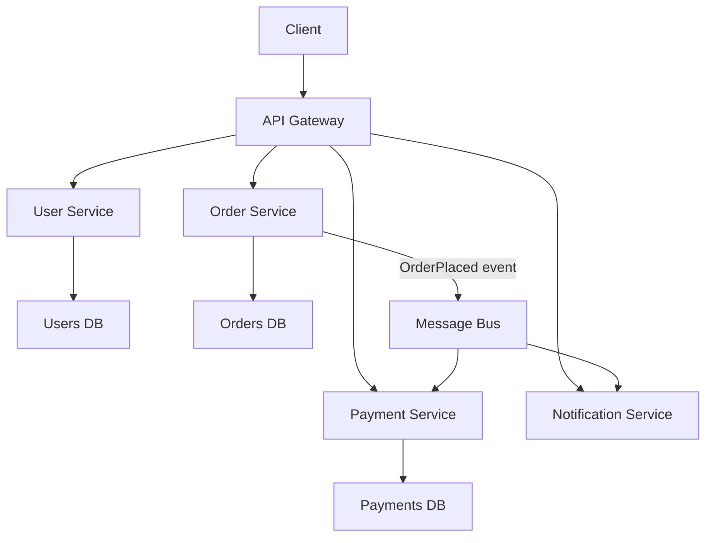

# Microservices Architecture - Breaking the Monolith

> **Reading Time:** 25 minutes
> **Difficulty:** Intermediate
> **Impact:** The architecture pattern behind Netflix, Uber, and Amazon at scale

## 🗺️ Quick Overview



*Microservices decompose a monolith into small, independently deployable services — each owns its own database, communicates over APIs or events, and can be scaled and deployed on its own schedule.*

## The Monolith Problem

**Your startup built a monolith. It worked great. Until it didn't.**

```
Year 1 (5 engineers):
┌─────────────────────────────────┐
│          Monolith               │
│  Auth + Orders + Payments +     │
│  Notifications + Search +       │
│  Recommendations                │
│                                 │
│  Deploy: 5 minutes              │
│  Team: Everyone knows everything│
│  Bugs: Easy to trace            │
└─────────────────────────────────┘
Status: ✅ Perfect choice

Year 3 (50 engineers):
┌─────────────────────────────────┐
│          MEGA Monolith          │
│  2M lines of code               │
│  45 minute builds               │
│  Deploy: 4 hours (with prayer)  │
│  Merge conflicts: Daily         │
│  "Who owns this code?": Nobody  │
│  One bug crashes everything     │
└─────────────────────────────────┘
Status: ❌ Burning dumpster fire
```

**Real numbers from companies that hit this wall:**

```
Amazon (2002): Monolith → 2-pizza teams with services
  - Deployment time: Hours → Minutes
  - Team autonomy: Zero → Full ownership

Netflix (2009): Monolith → 700+ microservices
  - Outage frequency: Weekly → Rare
  - Deploy frequency: Weekly → Thousands/day

Uber (2014): Monolith → 2,200+ microservices
  - Team count: 1 → 200+ independent teams
  - Feature velocity: 10x increase
```

---

## What Are Microservices (Really)?

### It's NOT Just "Small Services"

```
Common misconception:
"Microservices = breaking code into smaller pieces"

Reality:
"Microservices = organizing teams and systems around
 business capabilities with independent deployment"
```

### The Key Properties

```
1. Single Responsibility
   Each service owns ONE business capability
   ✅ OrderService - manages orders
   ❌ OrderAndPaymentAndNotificationService

2. Independent Deployment
   Deploy OrderService without touching PaymentService
   ✅ "I deployed 3 times today, nobody noticed"
   ❌ "We need to coordinate with 5 teams to deploy"

3. Own Their Data
   Each service has its own database
   ✅ OrderService → orders_db
   ❌ All services → shared_mega_db

4. Technology Agnostic
   OrderService (Java) talks to PaymentService (Go)
   via well-defined APIs

5. Failure Isolation
   PaymentService down ≠ Search is down
   (Unlike a monolith where everything crashes together)
```

---

## Service Decomposition: How to Split

### Strategy 1: Decompose by Business Capability

```
E-commerce platform:

┌──────────────┐  ┌──────────────┐  ┌──────────────┐
│   Product    │  │    Order     │  │   Payment    │
│   Catalog    │  │  Management  │  │  Processing  │
│              │  │              │  │              │
│ - Search     │  │ - Cart       │  │ - Checkout   │
│ - Browse     │  │ - Checkout   │  │ - Refunds    │
│ - Reviews    │  │ - History    │  │ - Invoices   │
│ - Inventory  │  │ - Tracking   │  │ - Fraud      │
└──────┬───────┘  └──────┬───────┘  └──────┬───────┘
       │                 │                  │
  product_db         orders_db         payments_db
```

### Strategy 2: Decompose by Subdomain (DDD)

```
Domain-Driven Design approach:

Core Domain (competitive advantage):
├── Recommendation Engine
├── Search & Personalization
└── Pricing Strategy

Supporting Domain (necessary but not differentiating):
├── Order Management
├── Inventory
└── Shipping

Generic Domain (buy, don't build):
├── Authentication (Auth0)
├── Email (SendGrid)
└── Payment Processing (Stripe)
```

### Strategy 3: Strangler Fig Pattern (Migration)

```
Gradual migration from monolith:

Phase 1: Identify boundaries
┌─────────────────────────────┐
│         Monolith            │
│  [Auth] [Orders] [Payments] │
│  [Search] [Notifications]   │
└─────────────────────────────┘

Phase 2: Extract one service
┌─────────────────────────┐     ┌──────────────┐
│       Monolith          │     │ Notification │
│  [Auth] [Orders]        │────▶│   Service    │
│  [Payments] [Search]    │     │  (extracted) │
└─────────────────────────┘     └──────────────┘

Phase 3: Continue extracting
┌───────────────┐  ┌──────────┐  ┌──────────────┐
│   Monolith    │  │ Payment  │  │ Notification │
│  [Auth]       │  │ Service  │  │   Service    │
│  [Orders]     │  │          │  │              │
│  [Search]     │  │          │  │              │
└───────────────┘  └──────────┘  └──────────────┘

Phase 4: Monolith becomes just another service
┌──────────┐ ┌──────────┐ ┌──────────┐ ┌──────────┐
│  Auth    │ │  Order   │ │ Payment  │ │ Notify   │
│ Service  │ │ Service  │ │ Service  │ │ Service  │
└──────────┘ └──────────┘ └──────────┘ └──────────┘
```

**Netflix used this exact approach over 7 years (2009-2016).**

---

## Communication Patterns

### Synchronous: REST / gRPC

```
REST (HTTP/JSON):
┌──────────┐   GET /users/123    ┌──────────┐
│  Order   │ ──────────────────▶ │   User   │
│ Service  │ ◀────────────────── │ Service  │
└──────────┘   { "name": "..." } └──────────┘

Pros: Simple, widely understood, great for CRUD
Cons: Tight coupling, cascading failures, latency chains

gRPC (HTTP/2 + Protobuf):
┌──────────┐   Binary protobuf   ┌──────────┐
│  Order   │ ══════════════════▶ │   User   │
│ Service  │ ◀══════════════════ │ Service  │
└──────────┘   10x faster        └──────────┘

Pros: Fast (binary), type-safe, streaming, code generation
Cons: Harder to debug, browser support limited
```

**When to use which:**

```
REST:  Public APIs, simple CRUD, browser-facing
gRPC:  Internal service-to-service, high throughput,
       streaming (real-time feeds, file transfer)

Netflix: gRPC internally, REST for public API
Google:  gRPC everywhere (they invented it)
```

### Asynchronous: Events / Messages

```
Event-Driven:
┌──────────┐                      ┌──────────┐
│  Order   │──▶ OrderPlaced ──────│ Payment  │
│ Service  │   (event to Kafka)   │ Service  │
└──────────┘         │            └──────────┘
                     │
                     ├────────────┌──────────┐
                     │            │ Inventory │
                     │            │ Service   │
                     │            └──────────┘
                     │
                     └────────────┌──────────┐
                                  │  Email   │
                                  │ Service  │
                                  └──────────┘

Pros: Loose coupling, resilient, scalable
Cons: Complex debugging, eventual consistency
```

### The Communication Matrix

```
                    Sync (REST/gRPC)    Async (Events)
─────────────────   ────────────────    ──────────────
Need response now?  ✅ Yes              ❌ No
Can tolerate delay? ❌ No               ✅ Yes
Fan-out needed?     ❌ Point-to-point   ✅ One-to-many
Failure tolerance?  ❌ Cascading risk   ✅ Decoupled
Debugging?          ✅ Easy to trace    ❌ Hard to trace
Data consistency?   ✅ Immediate        ❌ Eventual
```

---

## Service Discovery

### The Problem

```
In a monolith:
  OrderModule.processPayment()  // Just a function call

In microservices:
  Where is PaymentService running?
  - Which IP?
  - Which port?
  - Is it healthy?
  - There are 12 instances, which one?
```

### Solution: Service Registry

```
                    ┌──────────────────┐
                    │ Service Registry │
                    │ (Consul / Eureka)│
                    │                  │
                    │ PaymentService:  │
                    │  - 10.0.1.5:8080│
                    │  - 10.0.1.6:8080│
                    │  - 10.0.1.7:8080│
                    └───────┬──────────┘
                     ▲      │
          Register   │      │  Discover
          (heartbeat)│      ▼
┌──────────┐    ┌──────────┐    ┌──────────┐
│ Payment  │    │  Order   │    │ Payment  │
│ Svc (1)  │    │ Service  │───▶│ Svc (2)  │
└──────────┘    └──────────┘    └──────────┘
```

### Kubernetes Service Discovery (Modern Approach)

```yaml
# PaymentService deployment
apiVersion: v1
kind: Service
metadata:
  name: payment-service
spec:
  selector:
    app: payment
  ports:
    - port: 80
      targetPort: 8080

# OrderService just calls:
# http://payment-service/api/charge
# Kubernetes DNS resolves it automatically
```

```
Most teams today: Use Kubernetes DNS
  - No separate service registry needed
  - Built-in health checks
  - Automatic load balancing

Legacy systems: Consul, Eureka, ZooKeeper
  - Still valid for non-K8s environments
  - More configuration overhead
```

---

## Data Management: The Hardest Part

### Database Per Service

```
Rule #1: Each service owns its data

❌ WRONG: Shared database
┌──────────┐  ┌──────────┐  ┌──────────┐
│  Order   │  │ Payment  │  │ Shipping │
│ Service  │  │ Service  │  │ Service  │
└────┬─────┘  └────┬─────┘  └────┬─────┘
     │             │              │
     └─────────────┼──────────────┘
                   │
            ┌──────┴──────┐
            │  SHARED DB  │ ← Schema changes break everyone
            └─────────────┘

✅ RIGHT: Separate databases
┌──────────┐  ┌──────────┐  ┌──────────┐
│  Order   │  │ Payment  │  │ Shipping │
│ Service  │  │ Service  │  │ Service  │
└────┬─────┘  └────┬─────┘  └────┬─────┘
     │              │              │
┌────┴────┐  ┌─────┴────┐  ┌─────┴────┐
│orders_db│  │payments_db│  │shipping_db│
└─────────┘  └──────────┘  └──────────┘
```

### The Join Problem

```
Monolith:
  SELECT o.*, u.name, p.status
  FROM orders o
  JOIN users u ON o.user_id = u.id
  JOIN payments p ON o.id = p.order_id
  -- Easy! One query!

Microservices:
  1. OrderService.getOrder(123)
  2. UserService.getUser(order.userId)     // Separate call
  3. PaymentService.getStatus(order.id)     // Another call
  4. Merge results in application code

  -- 3 network calls instead of 1 SQL query
```

### Saga Pattern: Distributed Transactions

```
Problem: Order requires payment AND inventory deduction
  In a monolith: BEGIN TRANSACTION ... COMMIT
  In microservices: No distributed transactions!

Solution: Saga (sequence of local transactions + compensations)

Choreography Saga (event-driven):
┌──────────┐    OrderCreated    ┌──────────┐
│  Order   │ ─────────────────▶ │ Payment  │
│ Service  │                    │ Service  │
└──────────┘                    └─────┬────┘
     ▲                                │
     │          PaymentCompleted      │
     │  ◀─────────────────────────────┘
     │                                │
     │                          ┌─────▼────┐
     │                          │Inventory │
     │  InventoryReserved       │ Service  │
     │  ◀───────────────────────│          │
     │                          └──────────┘

If Payment fails:
  → OrderService receives PaymentFailed
  → OrderService sets order status = CANCELLED
  → No inventory was reserved (it waits for payment first)

If Inventory fails:
  → PaymentService receives InventoryFailed
  → PaymentService issues refund (compensation)
  → OrderService sets order status = CANCELLED
```

### CQRS: Separate Read and Write Models

```
Problem: Need to join data across services for reads

Solution: Maintain a denormalized read model

Write Side:                    Read Side:
┌──────────┐                   ┌──────────────┐
│  Order   │──OrderCreated───▶│ Order View   │
│ Service  │                   │ Service      │
└──────────┘                   │              │
┌──────────┐                   │ Contains:    │
│ Payment  │──PaymentDone───▶ │ - Order data │
│ Service  │                   │ - User name  │
└──────────┘                   │ - Payment    │
┌──────────┐                   │   status     │
│  User    │──UserUpdated───▶ │ - All joined │
│ Service  │                   └──────────────┘
└──────────┘
                               API reads from here
                               (single query, fast!)
```

---

## Resilience Patterns

### Circuit Breaker

```
Problem: PaymentService is slow/down
  → OrderService waits 30s for response
  → OrderService threads exhausted
  → OrderService goes down too
  → Cascade failure!

Solution: Circuit Breaker (like electrical fuse)

States:
┌────────┐  failures > threshold  ┌────────┐
│ CLOSED │ ─────────────────────▶ │  OPEN  │
│(normal)│                        │ (fail  │
│        │ ◀───────────────────── │  fast) │
└────────┘  timeout expires       └────┬───┘
                                       │
                                  ┌────▼───┐
                                  │  HALF  │
                                  │  OPEN  │ test one request
                                  └────────┘
                                  success → CLOSED
                                  failure → OPEN
```

```javascript
// Pseudocode: Circuit Breaker
class CircuitBreaker {
  constructor(service, options = {}) {
    this.failureThreshold = options.failureThreshold || 5;
    this.resetTimeout = options.resetTimeout || 30000; // 30s
    this.state = 'CLOSED';
    this.failures = 0;
  }

  async call(request) {
    if (this.state === 'OPEN') {
      if (Date.now() - this.lastFailure > this.resetTimeout) {
        this.state = 'HALF_OPEN';
      } else {
        throw new Error('Circuit is OPEN - failing fast');
        // Return cached/default response instead
      }
    }

    try {
      const response = await this.service.call(request);
      this.onSuccess();
      return response;
    } catch (error) {
      this.onFailure();
      throw error;
    }
  }

  onSuccess() {
    this.failures = 0;
    this.state = 'CLOSED';
  }

  onFailure() {
    this.failures++;
    if (this.failures >= this.failureThreshold) {
      this.state = 'OPEN';
      this.lastFailure = Date.now();
    }
  }
}
```

### Bulkhead Pattern

```
Problem: One slow dependency uses all threads

Without Bulkhead:
┌──────────────────────────────────┐
│         Thread Pool (100)        │
│                                  │
│  PaymentService calls: 95       │ ← Slow service eating all threads
│  UserService calls: 3           │
│  InventoryService calls: 2      │
│  Available: 0                   │ ← Nothing left!
└──────────────────────────────────┘

With Bulkhead (isolated pools):
┌──────────────┐ ┌────────────┐ ┌──────────────┐
│ Payment Pool │ │ User Pool  │ │ Inventory    │
│   (40 max)   │ │ (30 max)   │ │ Pool (30 max)│
│              │ │            │ │              │
│ Using: 40    │ │ Using: 5   │ │ Using: 3     │
│ (maxed out)  │ │ (healthy)  │ │ (healthy)    │
└──────────────┘ └────────────┘ └──────────────┘
Payment is slow but others are unaffected!
```

### Retry with Exponential Backoff

```
Attempt 1: Wait 100ms  → Fail
Attempt 2: Wait 200ms  → Fail
Attempt 3: Wait 400ms  → Fail
Attempt 4: Wait 800ms  → Success!

With jitter (randomness to prevent thundering herd):
Attempt 1: Wait 100ms + random(0-50ms)
Attempt 2: Wait 200ms + random(0-100ms)
Attempt 3: Wait 400ms + random(0-200ms)
```

---

## API Gateway Pattern

```
Without API Gateway:
┌────────┐
│ Mobile │──▶ UserService (auth check)
│  App   │──▶ OrderService (auth check)
│        │──▶ PaymentService (auth check)
│        │──▶ ProductService (auth check)
└────────┘
Problems: Multiple calls, auth duplication, CORS mess

With API Gateway:
┌────────┐     ┌─────────────┐     ┌──────────┐
│ Mobile │────▶│ API Gateway │────▶│  User    │
│  App   │     │             │────▶│  Order   │
│        │     │ - Auth      │────▶│  Payment │
│  Web   │────▶│ - Rate limit│────▶│  Product │
│  App   │     │ - Routing   │     └──────────┘
└────────┘     │ - Caching   │
               │ - Transform │
               └─────────────┘

Popular choices:
- Kong (open source, Lua plugins)
- AWS API Gateway (serverless)
- Envoy (service mesh, C++ performance)
- NGINX (reverse proxy + more)
```

### Backend for Frontend (BFF)

```
Different clients need different data:

Mobile: Small payload, minimal data
Web: Rich data, full details
Internal: Raw data, admin fields

┌────────┐    ┌───────────┐
│ Mobile │───▶│ Mobile BFF│──▶ Services
└────────┘    └───────────┘    (compact responses)

┌────────┐    ┌───────────┐
│  Web   │───▶│  Web BFF  │──▶ Services
└────────┘    └───────────┘    (rich responses)

┌────────┐    ┌───────────┐
│ Admin  │───▶│ Admin BFF │──▶ Services
└────────┘    └───────────┘    (full access)
```

---

## Observability: You Can't Debug What You Can't See

### The Three Pillars

```
1. LOGGING (What happened)
   - Structured JSON logs
   - Centralized (ELK Stack / Datadog)
   - Correlation IDs across services

2. METRICS (How is it performing)
   - Request rate, error rate, duration (RED)
   - Saturation, utilization (USE)
   - Business metrics (orders/sec)

3. TRACING (Where did time go)
   - Distributed tracing (Jaeger / Zipkin)
   - Request flow across services
   - Latency breakdown per service
```

### Distributed Tracing Example

```
User Request: GET /order/123

Trace ID: abc-def-123
├── API Gateway (2ms)
│   └── Auth check (1ms)
├── OrderService (15ms)
│   ├── DB query (5ms)
│   ├── UserService call (45ms)    ← Bottleneck!
│   │   └── DB query (40ms)        ← Slow query!
│   └── PaymentService call (8ms)
│       └── Stripe API (6ms)
└── Total: 70ms

Without tracing: "The order page is slow"
With tracing: "UserService DB query takes 40ms, needs an index"
```

### Correlation IDs

```
Every request gets a unique ID that flows through all services:

Request → API Gateway
  X-Correlation-ID: req-abc-123

API Gateway → OrderService
  X-Correlation-ID: req-abc-123

OrderService → PaymentService
  X-Correlation-ID: req-abc-123

All logs include this ID:
[req-abc-123] OrderService: Processing order 456
[req-abc-123] PaymentService: Charging $99.99
[req-abc-123] PaymentService: Payment successful

Now you can grep ONE ID and see the entire request flow!
```

---

## Real-World Architecture: Netflix

```
Netflix Microservices Architecture (simplified):

┌──────────────────────────────────────────────────────┐
│                    CDN (Open Connect)                 │
│              95% of traffic served from edge          │
└───────────────────────┬──────────────────────────────┘
                        │
┌───────────────────────▼──────────────────────────────┐
│                   Zuul (API Gateway)                 │
│            Authentication, routing, filtering         │
└───────┬───────────┬──────────┬──────────┬────────────┘
        │           │          │          │
   ┌────▼────┐ ┌────▼────┐ ┌──▼──┐ ┌────▼────────┐
   │ Browse  │ │ Play    │ │ My  │ │Recommendation│
   │ Service │ │ Service │ │List │ │   Service    │
   └────┬────┘ └────┬────┘ └──┬──┘ └────┬────────┘
        │           │         │          │
   ┌────▼──────────▼─────────▼──────────▼────┐
   │           Eureka (Service Discovery)     │
   └────────────────────┬────────────────────┘
                        │
   ┌────────────────────▼────────────────────┐
   │        Cassandra + EVCache + S3         │
   │    (Distributed storage + caching)      │
   └─────────────────────────────────────────┘

Key numbers:
- 700+ microservices
- 10,000+ deployments per day
- Eureka handles 30M+ service lookups/min
- EVCache serves 30M+ requests/sec
- Zuul processes 50B+ requests/day
```

---

## When NOT to Use Microservices

### The Decision Framework

```
Team size < 10?                    → Monolith
Product not yet proven?            → Monolith
Simple CRUD application?           → Monolith
Just starting out?                 → Monolith
Team has no DevOps culture?        → Monolith

Team size > 20?                    → Consider microservices
Multiple teams own different areas?→ Consider microservices
Need independent scaling?          → Consider microservices
Need technology diversity?         → Consider microservices
Deploy frequency > daily?          → Consider microservices
```

### The Modular Monolith (Best of Both Worlds)

```
Instead of jumping to microservices:

┌─────────────────────────────────────┐
│          Modular Monolith           │
│                                     │
│  ┌─────────┐  ┌─────────┐          │
│  │  Auth   │  │ Orders  │          │
│  │ Module  │  │ Module  │          │
│  │         │  │         │          │
│  │ Own DB  │  │ Own DB  │          │
│  │ schema  │  │ schema  │          │
│  └────┬────┘  └────┬────┘          │
│       │ API         │ API           │
│  ┌────▼────┐  ┌────▼────┐          │
│  │Payment │  │Shipping │          │
│  │ Module  │  │ Module  │          │
│  └─────────┘  └─────────┘          │
│                                     │
│  Single deployment, clear boundaries│
│  Extract to microservice when needed│
└─────────────────────────────────────┘

Benefits:
- Simple deployment (single artifact)
- Clear module boundaries
- Easy to extract later
- No network latency between modules
- Shopify runs this way at massive scale
```

---

## Migration Checklist

```
Before migrating to microservices, ensure you have:

Infrastructure:
□ Container orchestration (Kubernetes)
□ CI/CD pipeline per service
□ Service mesh or API gateway
□ Centralized logging (ELK/Datadog)
□ Distributed tracing (Jaeger/Zipkin)
□ Container registry

Team & Process:
□ Team owns service end-to-end (you build it, you run it)
□ Clear service ownership boundaries
□ On-call rotation per service
□ Documented API contracts
□ Automated testing per service

Architecture:
□ Service discovery mechanism
□ Circuit breakers implemented
□ Retry + backoff policies
□ Health check endpoints
□ Graceful degradation strategy
□ Data consistency approach (sagas/events)
```

---

## Common Mistakes

### 1. Too Many Services Too Soon

```
❌ Day 1: "Let's have 50 microservices!"
   Result: Distributed monolith (worst of both worlds)

✅ Start with modular monolith
   Extract services as team/scale demands
   Rule of thumb: 1 service per 5-8 engineers
```

### 2. Shared Database

```
❌ All services use the same PostgreSQL instance
   Result: Coupled deployments, schema lock-in

✅ Each service owns its data
   Use events to sync data between services
```

### 3. Synchronous Everything

```
❌ Order → Payment → Inventory → Shipping → Email
   All synchronous REST calls in sequence
   Total latency: Sum of all services
   One failure = entire chain fails

✅ Order → Event Bus → Services react independently
   Latency: Only critical path
   One failure = graceful degradation
```

### 4. No Observability

```
❌ "Something is slow but I don't know which service"
   50 services, no tracing = nightmare debugging

✅ Implement tracing, logging, metrics BEFORE
   extracting services. Not after.
```

---

## 🎯 Interview Questions

### Common Interview Questions on Microservices Architecture

#### Q1: When would you choose microservices over a monolith, and when would you not?
**What interviewers look for**: Balanced thinking — candidates who only advocate for microservices without acknowledging the costs fail this question at top companies.

**Answer framework**:
1. **Monolith first**: For teams under 10 engineers, unproven products, or simple CRUD apps — deployment simplicity, no network latency, easy debugging; Shopify runs a modular monolith at massive scale.
2. **Switch signals**: Team > 20 engineers with distinct ownership areas, deployment bottlenecks (>1 hour releases), need to scale specific components independently, or different tech stacks required per domain.
3. **Modular monolith as middle ground**: Clear internal module boundaries with separate DB schemas, but single deployment artifact — this is what most successful companies operate at $1M–$50M ARR.

**Key numbers to mention**: Amazon switched at 200+ engineers in 2002; Netflix migrated over 7 years (2009–2016); typical microservices overhead adds 20–30% operational complexity; rule of thumb: 1 service per 5–8 engineers.

---

#### Q2: How do you handle data consistency across microservices? Explain the Saga pattern.
**What interviewers look for**: Understanding that distributed transactions (2PC) are dangerous in microservices and that sagas with compensating transactions are the correct approach.

**Answer framework**:
1. **Why no distributed transactions**: 2PC requires all participants to hold locks simultaneously — in a distributed system, one slow or failed service blocks all others, killing availability (CAP theorem trade-off).
2. **Saga pattern**: Break the transaction into a sequence of local transactions, each publishing an event; if a step fails, run compensating transactions in reverse order (e.g., refund payment if inventory reservation fails).
3. **Choreography vs. Orchestration**: Choreography (event-driven, no central coordinator) is simpler but harder to debug; Orchestration (central saga orchestrator) is more complex but easier to track and reason about — prefer orchestration for >3-step sagas.

**Key numbers to mention**: Saga compensating transactions must be idempotent; choreography works for ≤3 steps; Amazon uses orchestrated sagas for order processing across 10+ services; eventual consistency window is typically 100ms–2 seconds; Netflix Conductor handles millions of workflow executions per day.

---

#### Q3: Walk me through the Strangler Fig migration pattern — how would you migrate a monolith to microservices?
**What interviewers look for**: Practical migration knowledge, not just theory. Interviewers want risk-awareness and an incremental approach.

**Answer framework**:
1. **Extract the edges first**: Start with services that have the clearest boundaries and fewest dependencies — notification service, email service, analytics — these have well-defined inputs and no write dependencies on the core.
2. **Proxy/facade layer**: Add an API gateway or routing layer in front of the monolith that can progressively route traffic to new services; the monolith handles what it always did until each feature is extracted.
3. **Data migration last**: Run dual writes (write to both monolith DB and new service DB) during transition; once reads migrate to the new service, cut the monolith's data path; avoid sharing the database schema.

**Key numbers to mention**: Netflix's migration took 7 years with 700+ services extracted; Uber's took 4 years; typical "safe extraction" takes 2–4 sprints per service; dual write phase should run for ≥2 weeks before cutting over; rollback window of 48 hours minimum.

---

#### Q4: How does service discovery work in a Kubernetes-based microservices architecture?
**What interviewers look for**: Modern, practical knowledge — most teams use Kubernetes now, not Consul/Eureka; understanding DNS-based discovery and its limitations.

**Answer framework**:
1. **Kubernetes DNS**: Each Service object gets a DNS name (`payment-service.namespace.svc.cluster.local`); kube-proxy load-balances across healthy pod endpoints automatically — no client-side discovery needed.
2. **Health checks drive routing**: Kubernetes removes pods from Service endpoints when readiness probes fail; this means your circuit breaker and Kubernetes health checks must be aligned — if a pod is slow, mark it unready.
3. **Service mesh for advanced needs**: Istio/Linkerd adds mTLS, traffic splitting, retries, and circuit breaking at the sidecar level — useful when you need cross-cluster discovery, canary releases, or fine-grained traffic control.

**Key numbers to mention**: Kubernetes DNS resolves in <1ms within a cluster; Netflix's Eureka handles 30M+ service lookups/minute; Istio adds ~5ms latency per hop (sidecar overhead); Consul is still used for multi-cloud and hybrid environments; default kube-proxy endpoint update latency is ~100ms.

---

#### Q5: How do you design API versioning and backward compatibility in a microservices environment?
**What interviewers look for**: Understanding that independent deployability requires consumer-driven contract management, not just URL versioning.

**Answer framework**:
1. **Never break existing consumers**: Add fields, don't remove them; use optional fields for new behavior; make consumers tolerate unknown fields (Postel's Law); version only when breaking changes are unavoidable.
2. **URL versioning for major breaks**: `/api/v2/orders` alongside `/api/v1/orders` — support both for a deprecation window (minimum 6 months with migration notice); API gateway routes to the right service version.
3. **Consumer-driven contract testing**: Use Pact or similar — each consumer defines what it needs from the provider; the provider's CI runs all consumer contracts; prevents accidental breaking changes before deployment.

**Key numbers to mention**: Stripe supports API versions for 5+ years; Twitter deprecated v1 API over 18 months; Pact tests run in <30 seconds for 50 consumer contracts; Semver: major version = breaking, minor = new features, patch = fixes; Google deprecation policy is 12 months minimum.

---

#### Q6: How do you implement observability in a microservices architecture? What are the three pillars?
**What interviewers look for**: Concrete knowledge of logs, metrics, and traces — with tool names and how they work together to debug distributed systems.

**Answer framework**:
1. **Structured Logging + Correlation IDs**: JSON logs with a `traceId` that flows through every service via HTTP headers (`X-Correlation-ID`); centralize in ELK or Datadog; `grep` one trace ID to see the entire request flow across 10 services.
2. **Metrics (RED method)**: Rate (requests/sec), Errors (5xx rate), Duration (P50/P95/P99 latency) per service and endpoint; emit to Prometheus/Datadog; alert on error rate >1% or P99 >500ms.
3. **Distributed Tracing**: Instrument with OpenTelemetry; visualize in Jaeger or Zipkin; a single trace shows the call tree across all services with per-span latency — turns "the order page is slow" into "UserService DB query missing index, 40ms vs expected 2ms".

**Key numbers to mention**: Netflix processes 1TB+ of logs per day; Jaeger handles 100K+ traces/sec at Uber; P99 latency is the right SLO metric (not average); typical SLO targets: 99.9% availability, P99 <200ms; OpenTelemetry adds ~1% CPU overhead for tracing.

---

#### Q7: What is Conway's Law and how does it affect microservices design in practice?
**What interviewers look for**: Understanding that technology architecture mirrors organizational structure — and that ignoring this causes "distributed monoliths".

**Answer framework**:
1. **Conway's Law**: "Organizations design systems that mirror their communication structures" — if three teams share ownership of one service, that service will have three poorly-integrated modules fighting over the schema.
2. **Inverse Conway Maneuver**: Design the desired architecture first, then reorganize teams to match — Amazon's "two-pizza team" rule ensures each service has one clear owner with full autonomy; no shared services without explicit team ownership.
3. **Distributed monolith anti-pattern**: When teams resist breaking apart a shared codebase, services end up calling each other synchronously in long chains, sharing databases, and requiring coordinated deployments — worst of both worlds.

**Key numbers to mention**: Amazon reorganized 200+ engineers into two-pizza teams (6–8 people) in 2002; Netflix has ~700 services owned by ~2,000 engineers (~3 engineers per service on average); teams with shared ownership >2 take 3x longer to ship features; Google's Borg team has 1:1 service-to-team ratio for all critical services.

---

## Key Takeaways

```
1. Microservices solve ORGANIZATIONAL problems
   (team independence, deployment speed)
   NOT technical problems (speed, simplicity)

2. Start with a modular monolith
   Extract services when team size/scale demands

3. Communication choices matter:
   Sync (REST/gRPC) for queries
   Async (events) for commands/notifications

4. Data management is the hardest part
   Database per service + Saga pattern + CQRS

5. Resilience is not optional
   Circuit breakers, bulkheads, retries, timeouts

6. Observability comes FIRST
   Logging + Metrics + Tracing before microservices

7. Conway's Law is real
   Your architecture will mirror your org structure
   Design teams around services, not the other way
```

## 🔗 Next Steps

- [Microservices Communication](/10-architecture/concepts/microservices-communication) - REST vs gRPC vs Events decision guide
- [Circuit Breaker Pattern](/10-architecture/concepts/circuit-breaker) - Prevent cascading failures
- [Monolith to Microservices Interview Prep](/12-interview-prep/system-design/scale-and-reliability/monolith-to-microservices) - Deep-dive Q&A for system design interviews
- [API Gateway Pattern Interview Prep](/12-interview-prep/system-design/fundamentals/api-gateway-pattern) - API Gateway and BFF patterns
