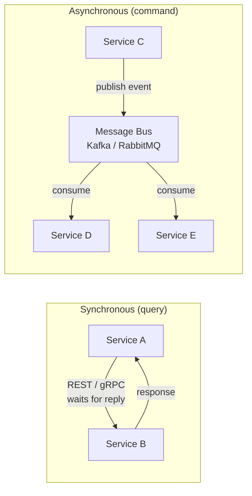

# Microservices Communication - Choose Wrong, Pay Forever

> **TL;DR:** Synchronous (REST/gRPC) for queries, asynchronous (events) for commands. Mix them wrong and watch your system crumble at 3 AM.

## 🗺️ Quick Overview



*Microservices communicate synchronously (REST/gRPC) when the caller needs an immediate answer, and asynchronously (events) when the caller only needs to trigger work — choosing wrong couples services and turns one slowdown into a site-wide outage.*

## The $50M Architecture Mistake

**2019, Major E-commerce Platform:**

```
Original architecture: 200 microservices, ALL synchronous REST
Black Friday result:
├── 10:00 AM: Traffic 5x normal
├── 10:15 AM: Payment service slow (3s → 30s)
├── 10:20 AM: Checkout blocked waiting for payment
├── 10:25 AM: Cart service blocked waiting for checkout
├── 10:30 AM: Product service blocked waiting for cart
├── 10:35 AM: ENTIRE SITE DOWN (cascading failure)
├── Recovery time: 4 hours
└── Estimated loss: $50M+ in sales

Root cause: Synchronous chain of 8 services
One slow service = everything fails
```

**The fix that saved next Black Friday:**
```
After re-architecture:
├── Queries: Synchronous (read product, check price)
├── Commands: Asynchronous (place order, process payment)
├── Result: Payment delays don't block browsing
└── Black Friday 2020: Zero downtime
```

---

## Communication Patterns Overview

```
SYNCHRONOUS (Request-Response):
┌─────────┐    Request    ┌─────────┐
│Service A│──────────────▶│Service B│
│         │◀──────────────│         │
└─────────┘    Response   └─────────┘

Characteristics:
- Caller waits for response
- Tight coupling
- Simple to understand
- Cascading failures risk

ASYNCHRONOUS (Event-Driven):
┌─────────┐    Event     ┌─────────────┐    Event    ┌─────────┐
│Service A│─────────────▶│Message Queue│────────────▶│Service B│
└─────────┘              └─────────────┘             └─────────┘
     │                                                    │
     └── Continues immediately                 Processes when ready

Characteristics:
- Fire and forget
- Loose coupling
- Complex to debug
- Resilient to failures
```

---

## Pattern 1: REST (Synchronous)

### When to Use
- Simple CRUD operations
- Real-time data requirements
- Public APIs
- Small-scale systems

### Implementation

```javascript
// ❌ WRONG: Long synchronous chain
async function placeOrder(order) {
  // Each call blocks until response
  const inventory = await fetch('http://inventory/check', { body: order });
  const payment = await fetch('http://payment/charge', { body: order });
  const shipping = await fetch('http://shipping/schedule', { body: order });
  const notification = await fetch('http://notification/send', { body: order });

  // If ANY service is slow, entire request is slow
  // If ANY service fails, entire request fails
  return { success: true };
}

// ✅ CORRECT: Parallel where possible + timeouts
async function placeOrderBetter(order) {
  const controller = new AbortController();
  const timeout = setTimeout(() => controller.abort(), 5000);

  try {
    // Parallel independent calls
    const [inventory, userCredit] = await Promise.all([
      fetchWithTimeout('http://inventory/check', order, 2000),
      fetchWithTimeout('http://payment/verify', order, 2000)
    ]);

    if (!inventory.available || !userCredit.sufficient) {
      return { success: false, reason: 'Validation failed' };
    }

    // Only essential sync call
    const payment = await fetchWithTimeout('http://payment/charge', order, 5000);

    // Non-essential async (fire and forget)
    fetch('http://notification/send', { body: order }).catch(() => {});

    return { success: true, orderId: payment.orderId };
  } finally {
    clearTimeout(timeout);
  }
}
```

### REST Best Practices

```yaml
Design principles:
  - Timeout everything: 2-5 seconds max
  - Circuit breakers: Fail fast when downstream is unhealthy
  - Retry with backoff: Don't hammer failing services
  - Bulkheads: Isolate failure domains

Anti-patterns to avoid:
  - Long synchronous chains (> 3 services)
  - No timeouts (waiting forever)
  - Retry storms (immediate retries)
  - Shared databases (defeats microservices purpose)
```

---

## Pattern 2: gRPC (Synchronous, High Performance)

### When to Use
- Internal service-to-service communication
- High throughput requirements
- Streaming data
- Polyglot environments

### Comparison: REST vs gRPC

| Aspect | REST | gRPC |
|--------|------|------|
| Protocol | HTTP/1.1 (text) | HTTP/2 (binary) |
| Payload | JSON | Protocol Buffers |
| Performance | Slower | 2-10x faster |
| Streaming | Limited | Native support |
| Browser support | Native | Requires proxy |
| Schema | Optional (OpenAPI) | Required (protobuf) |

### Implementation

```protobuf
// order.proto
syntax = "proto3";

service OrderService {
  rpc PlaceOrder(OrderRequest) returns (OrderResponse);
  rpc StreamOrderUpdates(OrderId) returns (stream OrderUpdate);
}

message OrderRequest {
  string user_id = 1;
  repeated OrderItem items = 2;
}

message OrderResponse {
  string order_id = 1;
  OrderStatus status = 2;
}
```

```javascript
// gRPC client with deadline
const client = new OrderServiceClient('orders:50051');

async function placeOrder(order) {
  const deadline = new Date();
  deadline.setSeconds(deadline.getSeconds() + 5); // 5 second timeout

  return new Promise((resolve, reject) => {
    client.placeOrder(order, { deadline }, (err, response) => {
      if (err) reject(err);
      else resolve(response);
    });
  });
}
```

---

## Pattern 3: Event-Driven (Asynchronous)

### When to Use
- Commands that don't need immediate response
- Decoupled services
- High scalability requirements
- Event sourcing / CQRS

### The Event-Driven Mental Model

```
CHOREOGRAPHY (Events):
┌─────────────┐
│ Order       │──OrderPlaced──▶┌──────────────┐
│ Service     │                │ Message Bus  │
└─────────────┘                └──────┬───────┘
                                      │
        ┌─────────────────────────────┼─────────────────────────────┐
        ▼                             ▼                             ▼
┌──────────────┐             ┌──────────────┐             ┌──────────────┐
│   Inventory  │             │   Payment    │             │ Notification │
│   Service    │             │   Service    │             │   Service    │
└──────────────┘             └──────────────┘             └──────────────┘
        │                             │                             │
        ▼                             ▼                             ▼
 InventoryReserved              PaymentCharged               EmailSent

Benefits:
- Services don't know about each other
- Add new consumers without changing producers
- Failure isolation
```

### Implementation

```javascript
// Publisher (Order Service)
async function placeOrder(order) {
  // 1. Save order locally (immediate)
  const savedOrder = await db.orders.create({
    ...order,
    status: 'PENDING'
  });

  // 2. Publish event (async, fire-and-forget)
  await kafka.send({
    topic: 'orders',
    messages: [{
      key: savedOrder.id,
      value: JSON.stringify({
        type: 'ORDER_PLACED',
        orderId: savedOrder.id,
        userId: order.userId,
        items: order.items,
        timestamp: Date.now()
      })
    }]
  });

  // 3. Return immediately (don't wait for downstream)
  return { orderId: savedOrder.id, status: 'PENDING' };
}

// Consumer (Inventory Service)
async function handleOrderPlaced(event) {
  const { orderId, items } = event;

  try {
    // Reserve inventory
    await db.transaction(async (trx) => {
      for (const item of items) {
        await trx.inventory
          .where('product_id', item.productId)
          .decrement('available', item.quantity);
      }
    });

    // Emit success event
    await kafka.send({
      topic: 'inventory',
      messages: [{
        key: orderId,
        value: JSON.stringify({
          type: 'INVENTORY_RESERVED',
          orderId,
          timestamp: Date.now()
        })
      }]
    });
  } catch (error) {
    // Emit failure event
    await kafka.send({
      topic: 'inventory',
      messages: [{
        key: orderId,
        value: JSON.stringify({
          type: 'INVENTORY_FAILED',
          orderId,
          reason: error.message,
          timestamp: Date.now()
        })
      }]
    });
  }
}
```

---

## Pattern 4: Saga Pattern (Distributed Transactions)

### The Problem

```
Traditional transaction (single DB):
BEGIN TRANSACTION
  debit_account(A, $100)
  credit_account(B, $100)
COMMIT  -- All or nothing

Microservices (multiple DBs):
Order Service DB     Payment Service DB     Inventory Service DB
      │                      │                       │
      └──────── No single transaction possible ──────┘

What if payment succeeds but inventory fails?
```

### Saga Solution

```
SAGA: Sequence of local transactions with compensating actions

Happy path:
┌─────────┐    ┌─────────┐    ┌─────────┐    ┌─────────┐
│ Create  │───▶│ Reserve │───▶│ Charge  │───▶│  Ship   │
│ Order   │    │Inventory│    │ Payment │    │ Order   │
└─────────┘    └─────────┘    └─────────┘    └─────────┘

Failure path (payment fails):
┌─────────┐    ┌─────────┐    ┌─────────┐
│ Create  │───▶│ Reserve │───▶│ Charge  │──X (fails)
│ Order   │    │Inventory│    │ Payment │
└─────────┘    └─────────┘    └─────────┘
                    │                │
                    ▼                │
            ┌──────────────┐        │
            │   Release    │◀───────┘ (compensate)
            │  Inventory   │
            └──────────────┘
```

### Implementation (Orchestrator Pattern)

```javascript
// Saga Orchestrator
class OrderSaga {
  constructor(orderId) {
    this.orderId = orderId;
    this.steps = [];
  }

  async execute() {
    const completedSteps = [];

    try {
      // Step 1: Reserve Inventory
      await this.reserveInventory();
      completedSteps.push('inventory');

      // Step 2: Charge Payment
      await this.chargePayment();
      completedSteps.push('payment');

      // Step 3: Schedule Shipping
      await this.scheduleShipping();
      completedSteps.push('shipping');

      // Step 4: Confirm Order
      await this.confirmOrder();

      return { success: true };

    } catch (error) {
      // Compensate in reverse order
      await this.compensate(completedSteps);
      return { success: false, error: error.message };
    }
  }

  async compensate(completedSteps) {
    for (const step of completedSteps.reverse()) {
      try {
        switch (step) {
          case 'shipping':
            await this.cancelShipping();
            break;
          case 'payment':
            await this.refundPayment();
            break;
          case 'inventory':
            await this.releaseInventory();
            break;
        }
      } catch (compensationError) {
        // Log for manual intervention
        console.error(`Compensation failed for ${step}:`, compensationError);
        await this.alertOps(step, compensationError);
      }
    }
  }
}
```

---

## Decision Framework

### When to Use What

```
┌────────────────────────────────────────────────────────────┐
│                  COMMUNICATION PATTERN SELECTION           │
├────────────────────────────────────────────────────────────┤
│                                                            │
│  Need immediate response?                                  │
│       │                                                    │
│       ├── YES ──▶ Is it a query (read)?                   │
│       │              │                                     │
│       │              ├── YES ──▶ REST or gRPC             │
│       │              │                                     │
│       │              └── NO (command) ──▶ Consider async  │
│       │                   with sync acknowledgment         │
│       │                                                    │
│       └── NO ──▶ Event-driven (Kafka, RabbitMQ)           │
│                                                            │
│  High throughput internal?                                 │
│       │                                                    │
│       ├── YES ──▶ gRPC                                    │
│       └── NO ──▶ REST                                     │
│                                                            │
│  Need distributed transaction?                             │
│       │                                                    │
│       └── YES ──▶ Saga pattern                            │
│                                                            │
└────────────────────────────────────────────────────────────┘
```

### Quick Reference

| Scenario | Pattern | Example |
|----------|---------|---------|
| Get product details | REST/gRPC sync | `GET /products/123` |
| Place order | Event + sync ack | Return orderId, process async |
| Real-time dashboard | gRPC streaming | Stock prices |
| User signup | Event-driven | Welcome email, analytics |
| Money transfer | Saga | Debit → Credit with rollback |
| Service mesh | gRPC | Internal high-volume calls |

---

## Anti-Patterns to Avoid

### 1. Distributed Monolith

```
❌ WRONG: Microservices that can't deploy independently
┌─────────┐     ┌─────────┐     ┌─────────┐
│Service A│────▶│Service B│────▶│Service C│
└─────────┘     └─────────┘     └─────────┘
     │               │               │
     └───────────────┴───────────────┘
              Shared Database

Result: All the complexity of microservices,
        none of the benefits
```

### 2. Chatty Services

```
❌ WRONG: Multiple calls for one operation
for (item in order.items) {
  await fetch(`http://inventory/check/${item.id}`);  // N calls!
}

✅ CORRECT: Batch operations
await fetch('http://inventory/check-batch', {
  body: order.items.map(i => i.id)
});
```

### 3. No Timeouts

```
❌ WRONG: Wait forever
const response = await fetch('http://slow-service/api');

✅ CORRECT: Always timeout
const controller = new AbortController();
setTimeout(() => controller.abort(), 5000);
const response = await fetch('http://slow-service/api', {
  signal: controller.signal
});
```

---

## Real-World Examples

### Netflix

```
Pattern: Event-driven + sync for critical path
- Playback start: Sync (must work)
- Recommendations: Async (can be stale)
- Analytics: Event-driven (fire and forget)
- Result: 200M+ users, high availability
```

### Uber

```
Pattern: gRPC internal + events for dispatch
- Driver location: gRPC streaming
- Ride matching: Event-driven
- Payment: Saga pattern
- Result: Millions of rides/day
```

### Amazon

```
Pattern: Heavy event-driven
- Order placement: Event → queued processing
- Inventory: Eventually consistent
- "1-Click" separation: Different bounded contexts
- Result: Handles Prime Day traffic
```

---

## Key Takeaways

### The Golden Rules

```
1. QUERIES = Synchronous (REST/gRPC)
   - Need the data now
   - Can cache results
   - Timeout aggressively

2. COMMANDS = Asynchronous (Events)
   - Don't need immediate result
   - Should be idempotent
   - Use saga for transactions

3. ALWAYS
   - Set timeouts
   - Use circuit breakers
   - Make operations idempotent
   - Design for failure
```

### Migration Path

```
Monolith → Microservices:
1. Start with REST (simple, familiar)
2. Add events for cross-cutting concerns
3. Move to gRPC for high-volume internal
4. Implement sagas as needed

Don't start with events everywhere!
```

---

## Related Content

- [Kafka vs RabbitMQ](/04-messaging/concepts/kafka-vs-rabbitmq)
- [Circuit Breaker Pattern](/10-architecture/concepts/circuit-breaker)
- [Timeouts & Backpressure](/10-architecture/concepts/timeouts-backpressure)
- [Idempotency](/system-design/api-design/idempotency)
