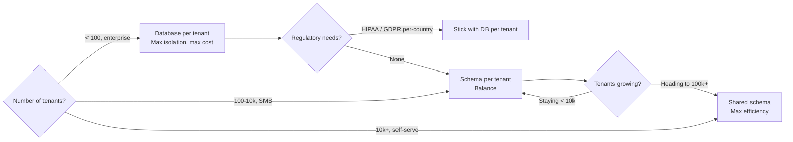
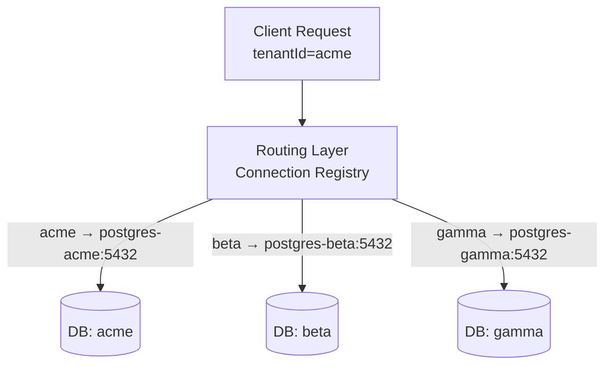
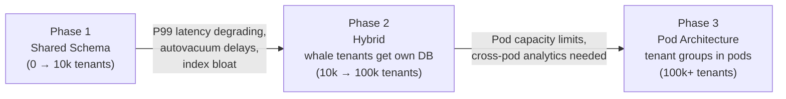
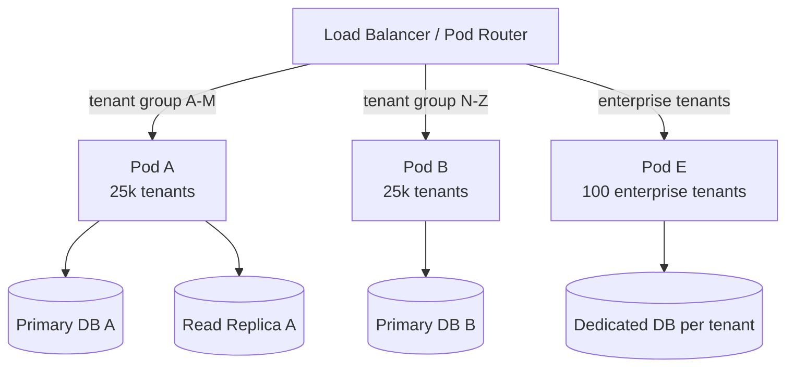

# Multi-Tenancy Architecture Patterns

## Level 1 — Surface (2-minute read)

**Multi-tenancy** is an architecture where a single software instance serves multiple customers (tenants), with each tenant's data logically or physically isolated from every other tenant.

**When you need this**: Once your SaaS product passes ~10 paying customers, you are already multi-tenant. The decision is not *whether* to be multi-tenant, but *which model* matches your tenant count, compliance obligations, and cost constraints.

### The Three Models at a Glance

| Model | Tenants | Isolation | Cost/Tenant | Complexity |
|---|---|---|---|---|
| Database per Tenant | < 100 | Full physical | $$$ | Low (simple routing) |
| Schema per Tenant | 100 – 10,000 | Logical (same DB engine) | $$ | Medium (migration tooling) |
| Shared Schema (RLS) | 10,000+ | Row-level (same tables) | $ | High (security policies, index discipline) |

### Decision Flowchart



### Quick Use / Don't Use Table

| Scenario | Recommended Model |
|---|---|
| Healthcare SaaS, enterprise contract, per-tenant audit logs | Database per Tenant |
| B2B SMB SaaS, 500-5,000 paying accounts | Schema per Tenant |
| PLG / self-serve, 10k+ tenants, freemium | Shared Schema (RLS) |
| Single-region compliance, one country | Schema or DB per tenant |
| Global SaaS, mixed compliance requirements | Hybrid (large tenants get own DB) |

---

## Level 2 — Deep Dive

### Problem Statement

You are building a B2B SaaS product. On day one you have 3 customers and a single PostgreSQL database. Each customer's data lives in the same tables with no separation. By month 6 you have 400 customers. The problems begin:

- A customer runs a large report: CPU spikes to 90%, all other customers experience 4-second query latency instead of the normal 80 ms.
- A support engineer accidentally runs `DELETE FROM orders WHERE status = 'pending'` — it deletes rows from every tenant.
- A new customer in Germany demands that their data never leave EU servers, but your DB is in us-east-1.
- Your SOC 2 audit requires evidence that Tenant A cannot access Tenant B's data.

These are the four forcing functions: **noisy neighbor**, **accidental cross-tenant writes**, **data residency**, and **audit/compliance**. The model you choose determines how well each is addressed.

---

### Model 1: Database per Tenant

#### How It Works

Each tenant gets a completely separate database instance. A routing layer (application-level or a proxy like PgBouncer) maps the incoming `tenant_id` or subdomain to the correct database connection string.



#### Routing Layer Design

The router must be fast (sub-millisecond) and cached. A typical implementation:

```python
import redis
import psycopg2
from functools import lru_cache

# Tenant registry cached in Redis (TTL: 5 minutes)
def get_tenant_connection(tenant_id: str) -> psycopg2.connection:
    conn_string = redis_client.get(f"tenant:dsn:{tenant_id}")
    if not conn_string:
        conn_string = db_registry.lookup(tenant_id)  # slow path: query registry DB
        redis_client.setex(f"tenant:dsn:{tenant_id}", 300, conn_string)
    return connection_pool.get(conn_string)

# Application usage
def get_orders(tenant_id: str, user_id: str):
    conn = get_tenant_connection(tenant_id)
    return conn.execute("SELECT * FROM orders WHERE user_id = %s", [user_id])
```

#### Migration Complexity

Running schema migrations across N databases requires an orchestrated runner. At 1,000 tenants, a single Flyway migration takes 1,000 sequential runs unless parallelised:

```bash
# Naive: ~10 minutes for 1,000 DBs at 600ms per migration
for tenant in $(list_all_tenants); do
  flyway -url=jdbc:postgresql://${tenant}.db:5432/app migrate
done

# Better: parallel batches of 50 concurrent migrations
list_all_tenants | xargs -P 50 -I{} flyway -url=jdbc:postgresql://{}.db:5432/app migrate
```

#### Cost at Scale

| Tenant Count | Minimum DB Connections | Monthly RDS Cost (t3.medium) |
|---|---|---|
| 10 | 10 | ~$200 |
| 100 | 100 | ~$2,000 |
| 1,000 | 1,000 | ~$20,000 |
| 10,000 | 10,000 | ~$200,000 |

At 1,000 tenants the DB connection overhead alone is prohibitive — each PostgreSQL connection consumes ~5 MB RAM. 1,000 connections = 5 GB just for idle connections.

#### When to Use Database per Tenant

- **HIPAA BAA**: Each tenant requires a Business Associate Agreement; their PHI must be in a logically and physically separate store with separate encryption keys.
- **GDPR data residency**: German customers require data in EU-West, US customers in us-east-1. You cannot colocate their rows in the same table.
- **Enterprise contracts**: Fortune 500 customers whose security team demands a dedicated database instance (common in financial services).
- **Tenant count will stay below 200**: At this scale the connection and cost overhead is manageable.

#### Pros and Cons

| | Pros | Cons |
|---|---|---|
| Isolation | Complete: no cross-tenant query possible | One misconfigured router can still misdirect |
| Performance | Tenant workloads fully isolated | No resource sharing; idle DBs waste money |
| Compliance | Easiest to audit and certify | Separate backups, monitoring per DB |
| Operations | Simple queries (no tenant_id predicates) | Migration tooling must iterate all DBs |

---

### Model 2: Schema per Tenant

#### How It Works

All tenants share one database server (and connection pool), but each tenant owns a separate PostgreSQL schema. Tables like `orders`, `users`, `invoices` exist in every schema with identical structure. The application switches schema context per request by setting `search_path`.

```sql
-- Provisioning a new tenant
CREATE SCHEMA tenant_acme;

-- Create tables in that schema (or use a template schema)
CREATE TABLE tenant_acme.orders (
    id          BIGSERIAL PRIMARY KEY,
    user_id     BIGINT NOT NULL,
    amount      NUMERIC(12,2) NOT NULL,
    status      TEXT NOT NULL,
    created_at  TIMESTAMPTZ NOT NULL DEFAULT NOW()
);

-- At request time, set context
SET search_path = tenant_acme;
SELECT * FROM orders WHERE status = 'pending';  -- resolves to tenant_acme.orders
```

#### Connection Pooling with Schema Switching

PgBouncer in `transaction` mode does not persist `SET search_path` across transactions (search_path resets on connection return). You must either:

1. **Use session mode** (fewer connections, search_path persists) — loses pooling efficiency.
2. **Prefix every query explicitly** (`SELECT * FROM tenant_acme.orders`) — verbose but pooling-safe.
3. **Use PgBouncer `server_reset_query`** to reset search_path on checkout — ensures clean state.

```ini
# pgbouncer.ini
[pgbouncer]
pool_mode = session          ; needed if using SET search_path
server_reset_query = DISCARD ALL  ; resets search_path on connection return
```

The recommended production pattern is to prefix table names with the schema at the ORM layer and avoid relying on `search_path` for correctness:

```python
# Django: use schema-aware database router
class TenantRouter:
    def db_for_read(self, model, **hints):
        return hints.get('tenant', 'default')

# Or use django-tenants which handles schema switching automatically
```

#### Migration Challenges

At 5,000 tenants, running `ALTER TABLE` on every schema serialises on the same database engine. A single `ADD COLUMN` migration takes:

```
5,000 schemas × 200ms per ALTER = ~17 minutes
(even faster with `ADD COLUMN … DEFAULT NULL` which is instant in PG 11+)
```

**Flyway / Liquibase approach** — run per-schema with a custom migration runner:

```java
// Pseudocode: Liquibase multi-schema migration
List<String> tenantSchemas = tenantRegistry.getAllSchemas();
tenantSchemas.parallelStream().forEach(schema -> {
    Database db = DatabaseFactory.getInstance()
        .findCorrectDatabaseImplementation(
            new JdbcConnection(dataSource.getConnection()));
    db.setDefaultSchemaName(schema);
    Liquibase liquibase = new Liquibase("db/changelog.xml", resourceAccessor, db);
    liquibase.update(new Contexts());
});
```

#### When to Use Schema per Tenant

- **100 to 10,000 tenants**: Sweet spot where shared DB is affordable but row-level policies add complexity.
- **Compliance needed but not full DB isolation**: Schema isolation satisfies most SOC 2 Type II requirements for logical separation.
- **Need to restore individual tenant data**: A schema can be pg_dump'd and restored independently without touching other tenants.

#### Pros and Cons

| | Pros | Cons |
|---|---|---|
| Isolation | Strong: no cross-schema query without explicit schema prefix | Requires careful ORM / query hygiene |
| Cost | Single DB engine shared across tenants | DB engine is single point of failure |
| Operations | Independent backup/restore per schema | Migration runner must iterate all schemas |
| Performance | Indices are per-schema, no cross-tenant index bloat | Vacuum and autovacuum run per-schema (more overhead) |

---

### Model 3: Shared Schema (Row-Level Security)

#### How It Works

All tenants share the same tables. A `tenant_id` column on every table identifies ownership. PostgreSQL's **Row-Level Security (RLS)** enforces at the storage layer that each database session can only read and write rows belonging to its declared tenant.

This is the most efficient model: 100,000 tenants use the same 10 tables. The cost is higher application discipline and careful index design.

#### PostgreSQL RLS Deep Dive

**Step 1 — Add tenant_id to every table**

```sql
CREATE TABLE orders (
    id          BIGSERIAL,
    tenant_id   UUID NOT NULL,
    user_id     BIGINT NOT NULL,
    amount      NUMERIC(12,2) NOT NULL,
    status      TEXT NOT NULL,
    created_at  TIMESTAMPTZ NOT NULL DEFAULT NOW(),
    PRIMARY KEY (tenant_id, id)  -- tenant_id FIRST for partition pruning
);
```

**Step 2 — Enable RLS and create policies**

```sql
-- Enable RLS on the table
ALTER TABLE orders ENABLE ROW LEVEL SECURITY;

-- Force RLS even for table owner (critical — without this, superuser bypasses policies)
ALTER TABLE orders FORCE ROW LEVEL SECURITY;

-- Policy: SELECT — can only see your tenant's rows
CREATE POLICY orders_tenant_isolation_select
    ON orders
    FOR SELECT
    USING (tenant_id = current_setting('app.tenant_id')::UUID);

-- Policy: INSERT — can only insert into your tenant
CREATE POLICY orders_tenant_isolation_insert
    ON orders
    FOR INSERT
    WITH CHECK (tenant_id = current_setting('app.tenant_id')::UUID);

-- Policy: UPDATE and DELETE
CREATE POLICY orders_tenant_isolation_modify
    ON orders
    FOR ALL
    USING (tenant_id = current_setting('app.tenant_id')::UUID)
    WITH CHECK (tenant_id = current_setting('app.tenant_id')::UUID);
```

**Step 3 — Set tenant context per request**

```sql
-- At the start of every transaction (application sets this)
SET LOCAL app.tenant_id = 'f47ac10b-58cc-4372-a567-0e02b2c3d479';

-- Now all queries are automatically scoped
SELECT * FROM orders WHERE status = 'pending';
-- Actual execution: SELECT * FROM orders WHERE tenant_id = 'f47ac...' AND status = 'pending'
```

**Step 4 — Verify the policy is enforced**

```sql
-- Confirm RLS is active
SELECT tablename, rowsecurity, forcerowsecurity
FROM pg_tables
WHERE tablename = 'orders';

-- tablename | rowsecurity | forcerowsecurity
-- ----------+-------------+-----------------
-- orders    | t           | t
```

#### Performance Impact of RLS

RLS adds a predicate (`tenant_id = $1`) to every query. The key question is whether PostgreSQL can use an index for this predicate.

**Without the right index** (disaster scenario):

```sql
-- Index on status only
CREATE INDEX idx_orders_status ON orders(status);

EXPLAIN (ANALYZE, BUFFERS) SELECT * FROM orders WHERE status = 'pending';
-- Seq Scan on orders (cost=0.00..850000.00 rows=50000000)
-- Filter: ((status = 'pending') AND (tenant_id = current_setting(...)::uuid))
-- Rows Removed by Filter: 49950000
-- Heap Blocks: hit=450000
```

Full table scan — catastrophic at 50M rows across 100k tenants.

**With composite index (tenant_id first)**:

```sql
-- tenant_id MUST be the leading column
CREATE INDEX idx_orders_tenant_status ON orders(tenant_id, status);

EXPLAIN (ANALYZE, BUFFERS) SELECT * FROM orders WHERE status = 'pending';
-- Index Scan using idx_orders_tenant_status on orders
-- Index Cond: ((tenant_id = current_setting(...)::uuid) AND (status = 'pending'))
-- Rows Removed by Filter: 0
-- Buffers: hit=12
```

Index seek on 12 pages instead of scanning 450,000 pages. Always put `tenant_id` as the leading column in every composite index.

#### Bypass Risks and Mitigations

The `current_setting('app.tenant_id')` approach has one critical vulnerability: if a connection is reused from a pool without resetting the session variable, the previous tenant's context persists.

```sql
-- Attacker sets their own tenant_id
SET app.tenant_id = 'victims-tenant-uuid';
SELECT * FROM orders;  -- retrieves victim's data if pool doesn't reset

-- Fix 1: Use SET LOCAL (scoped to current transaction only)
BEGIN;
SET LOCAL app.tenant_id = 'safe-tenant-uuid';
-- all queries within this transaction use the local setting
COMMIT;
-- setting reverts after COMMIT

-- Fix 2: PgBouncer server_reset_query
-- In pgbouncer.ini:
-- server_reset_query = RESET app.tenant_id; DISCARD ALL;

-- Fix 3: Use a PostgreSQL role per tenant (eliminates variable manipulation)
-- Expensive but eliminates the attack surface entirely
```

**Production hardening checklist**:
- Use `SET LOCAL` (transaction-scoped), never `SET SESSION`.
- Configure PgBouncer `server_reset_query = DISCARD ALL` so connection pool resets state on return.
- Create a limited-privilege application role that cannot call `SET` (use `SECURITY DEFINER` functions to set tenant context).
- Monitor for queries that execute with `tenant_id IS NULL` — these are policy misses.

#### Index Design for Shared Schema

Every index in a shared-schema multi-tenant database should start with `tenant_id`:

```sql
-- Orders: lookup by status within a tenant
CREATE INDEX idx_orders_tenant_status       ON orders(tenant_id, status);
CREATE INDEX idx_orders_tenant_created      ON orders(tenant_id, created_at DESC);
CREATE INDEX idx_orders_tenant_user         ON orders(tenant_id, user_id);

-- Users: lookup by email within a tenant
CREATE INDEX idx_users_tenant_email         ON users(tenant_id, email);

-- Partial index for active tenants (reduces index size)
CREATE INDEX idx_orders_active_tenant       ON orders(tenant_id, created_at DESC)
    WHERE status != 'archived';
```

A covering index that includes the `tenant_id` predicate reduces heap fetches to zero for common queries:

```sql
-- Covering index: tenant + status + amount (no heap fetch needed)
CREATE INDEX idx_orders_tenant_status_cover ON orders(tenant_id, status)
    INCLUDE (id, amount, created_at);
```

#### When to Use Shared Schema

- **10,000+ tenants**: At this scale, schema-per-tenant creates unmanageable Postgres overhead (vacuum, autovacuum, catalog bloat).
- **Self-serve / freemium**: Most tenants are small (< 1,000 rows each). Full isolation per tenant is wasteful.
- **Cost is the primary constraint**: One DB cluster serving 100k tenants versus 100k schema instances on the same cluster.

---

### Noisy Neighbor Problem

#### What It Is

In shared-schema and schema-per-tenant models, one tenant's heavy workload degrades performance for all other tenants sharing the same database resources (CPU, I/O, buffer pool, lock manager).

**Classic scenarios**:
- Tenant runs a full export (SELECT * FROM orders) at 2 AM — sequential scan evicts other tenants' hot pages from shared_buffers.
- Tenant bulk-imports 10M rows — WAL generation spikes, replication lag hits 30 seconds for all tenants.
- Tenant triggers an expensive report — query holds shared locks, other queries queue.

#### Detection: Per-Tenant Resource Tracking

```sql
-- Track per-tenant query stats using pg_stat_statements
SELECT
    current_setting('app.tenant_id') AS tenant_id,
    query,
    calls,
    total_exec_time / calls AS avg_ms,
    rows / calls AS avg_rows
FROM pg_stat_statements
WHERE query NOT LIKE '%pg_stat%'
ORDER BY total_exec_time DESC
LIMIT 20;

-- Identify top CPU consumers by tenant (requires custom logging)
-- Log tenant_id in application_name for visibility in pg_stat_activity:
SET application_name = 'tenant:f47ac10b-app';

-- Then query:
SELECT application_name, state, wait_event, query
FROM pg_stat_activity
WHERE application_name LIKE 'tenant:%'
ORDER BY query_start ASC;
```

#### Mitigations

**1. Connection limits per tenant** — prevent a single tenant from exhausting the connection pool:

```python
# Connection pool per tenant with hard cap
TENANT_CONNECTION_LIMITS = {
    'enterprise': 20,   # Large tenants get more connections
    'pro': 10,
    'free': 2,
}

def get_pool_for_tenant(tenant_id, tier):
    limit = TENANT_CONNECTION_LIMITS[tier]
    return ConnectionPool(dsn=DB_DSN, min_size=1, max_size=limit)
```

**2. Separate query queues for large tenants** — use pg_query_settings or statement timeouts:

```sql
-- Set statement timeout per tenant at session start
SET LOCAL statement_timeout = '30s';  -- free tier: 30 seconds max per query

-- Enterprise tenants get longer timeouts (set in routing layer by tier)
SET LOCAL statement_timeout = '300s';  -- 5 minutes for enterprise reports
```

**3. Rate limiting at API gateway** — reject burst traffic before it reaches the DB:

```yaml
# Kong rate-limiting plugin by tenant_id header
plugins:
  - name: rate-limiting
    config:
      second: 100        # 100 req/s per tenant
      policy: redis
      identifier: header
      header_name: X-Tenant-ID
```

**4. Workload isolation** — route heavy analytical queries to a read replica:

```python
def execute_query(tenant_id, query, is_analytical=False):
    if is_analytical:
        conn = get_read_replica_connection(tenant_id)  # async replica
    else:
        conn = get_primary_connection(tenant_id)
    return conn.execute(query)
```

**5. Separate database cluster for "whales"** — detect tenants exceeding thresholds and migrate them:

```python
WHALE_THRESHOLD_ROWS = 5_000_000   # 5M rows triggers migration candidate flag
WHALE_THRESHOLD_QPS  = 500          # 500 QPS consistently triggers review

def check_tenant_for_migration(tenant_id):
    row_count = get_tenant_row_count(tenant_id)
    qps = get_tenant_qps_p95(tenant_id)
    if row_count > WHALE_THRESHOLD_ROWS or qps > WHALE_THRESHOLD_QPS:
        flag_for_dedicated_migration(tenant_id)
```

---

### Tenant Scaling Lifecycle

Most successful SaaS products follow a predictable evolution:



#### Phase 1: Shared Schema (0 – 10k Tenants)

- All tenants in one PostgreSQL cluster with RLS.
- Works well: hot cache, simple operations, low cost.
- Warning signs at ~10k active tenants:
  - Autovacuum cannot keep up with dead tuple accumulation.
  - Index bloat on high-write tables (orders, events).
  - P99 query latency starts exceeding 500 ms for simple lookups.
  - `pg_stat_user_tables.n_dead_tup` growing faster than vacuum runs.

#### Phase 2: Hybrid (10k – 100k Tenants)

- Top 1-5% of tenants (by row count or QPS) get migrated to dedicated schemas or databases.
- Remaining 95-99% stay on shared schema.
- Migration process:

```
1. Double-write: new writes go to both shared and dedicated DB
2. Backfill: copy historical rows to dedicated DB
3. Verify: checksums match
4. Cutover: switch reads to dedicated DB
5. Cleanup: remove tenant's rows from shared DB
```

Zero-downtime migration using the Strangler Fig pattern (route tenant traffic progressively).

#### Phase 3: Pod Architecture (100k+ Tenants)

Each "pod" is a self-contained unit: N application servers + 1 primary DB + 1-2 read replicas. Tenants are assigned to pods; no cross-pod queries are allowed.



**Shopify uses exactly this pattern**: pods are assigned to merchant groups, pods can be in different regions (EU merchants → EU pod), and each pod handles ~$5M/minute of GMV independently. Flash sales do not affect merchants in other pods.

---

### Real-World Examples

#### 1. Salesforce: 150k+ Orgs, Shared Oracle Since 1999

Salesforce invented the SaaS multi-tenancy playbook. Every object (Account, Contact, Opportunity) in their "Universal Data Dictionary" has `OrgID` as the primary lookup key. Their custom metadata layer virtualises table columns — customers can add custom fields without ALTER TABLE, because custom fields are stored as pivot-table rows, not real columns.

Key numbers:
- 150,000+ orgs on shared database infrastructure.
- Every query has an implicit `AND OrgID = :orgId` added by their ORM layer.
- "Trust" architecture: their status page (trust.salesforce.com) shows per-instance (pod) availability, not global SLA.
- Salesforce pods are called "NA" (North America), "EU", "AP" instances — each serves thousands of orgs.
- Their multi-tenant kernel has been battle-tested for 25 years with < 99.9% of outages being cross-tenant contamination.

📖 [Salesforce Multi-Tenant Architecture](https://developer.salesforce.com/wiki/multi_tenant_architecture)

#### 2. Shopify: Pod Architecture for $5M/Minute Black Friday

Shopify moved from a shared monolith (pre-2012) to a pod-based architecture where each pod handles a horizontal slice of merchants. No cross-pod queries. Pods are sized for peak capacity, not average load.

Key numbers:
- 2.5 million merchants across pods.
- Black Friday 2023: $5M/minute peak GMV — handled by pod isolation, each pod sized for 5× normal load.
- Pods are in multiple regions: EU merchants on EU pods, North American merchants on NA pods.
- GDPR compliance by design: EU data never leaves EU pods.
- Pod assignment is sticky: a merchant moves to a new pod only via a deliberate "tenant migration" operation.

📖 [Shopify Engineering: Flash Sales](https://shopify.engineering/e-commerce-at-the-scale-of-shopifys-flash-sales)

#### 3. HubSpot: 100k+ Customers on Shared PostgreSQL RLS

HubSpot initially provisioned a dedicated MySQL database per customer. At ~2,000 customers this became operationally unmanageable: 2,000 database servers, each needing monitoring, backups, schema migrations. Their migration to a shared PostgreSQL cluster with RLS took 18 months.

Key numbers:
- Migrated 100,000+ customers from per-tenant MySQL to shared PostgreSQL.
- Schema migrations dropped from "run against 100,000 MySQL instances" to "run once with RLS policies".
- Read latency improved 40% due to better buffer pool utilisation (hot pages shared across tenants).
- Migration used a double-write + incremental backfill strategy with zero downtime.

📖 [HubSpot Infrastructure at Scale](https://product.hubspot.com/blog/how-we-built-hubspots-infrastructure)

---

### Common Mistakes

#### Mistake 1: Missing `FORCE ROW LEVEL SECURITY`

**What happens**: You create RLS policies but forget `ALTER TABLE orders FORCE ROW LEVEL SECURITY`. The table owner (your application DB user) bypasses all policies by default. Your application user IS the table owner, so RLS is silently ignored for all queries.

**Root cause**: PostgreSQL's default is that `ENABLE ROW LEVEL SECURITY` skips enforcement for the table owner. `FORCE ROW LEVEL SECURITY` removes this exception.

**Fix**:
```sql
-- After ENABLE, always also FORCE:
ALTER TABLE orders ENABLE ROW LEVEL SECURITY;
ALTER TABLE orders FORCE ROW LEVEL SECURITY;  -- ← critical, often missed

-- Verify:
SELECT tablename, forcerowsecurity FROM pg_tables WHERE tablename = 'orders';
-- forcerowsecurity must be 't'
```

#### Mistake 2: Wrong Index Leading Column

**What happens**: Developers create indexes optimised for single-tenant queries (e.g., `CREATE INDEX ON orders(status, created_at)`). In a shared-schema system, every query has an implicit `tenant_id = $1` predicate from RLS. The existing index cannot satisfy this predicate as a seek condition, so PostgreSQL falls back to a sequential scan of the entire table, touching all tenants' rows.

**Root cause**: `tenant_id` must be the leading column in every index because RLS injects it as the first filter condition. Without it as the leading column, PostgreSQL cannot use the index for a range scan.

**Fix**:
```sql
-- Wrong: status first, tenant_id buried or absent
CREATE INDEX idx_orders_status ON orders(status, created_at);

-- Correct: tenant_id always first
CREATE INDEX idx_orders_tenant_status ON orders(tenant_id, status, created_at);
```

#### Mistake 3: Using `SET SESSION` Instead of `SET LOCAL`

**What happens**: Application sets tenant context with `SET app.tenant_id = 'xyz'` at the session level. When PgBouncer returns the connection to the pool, the old tenant context persists. The next tenant to reuse the connection inherits the previous tenant's `tenant_id`, bypassing RLS entirely and exposing cross-tenant data.

**Root cause**: `SET SESSION` (or just `SET`) persists for the lifetime of the connection. `SET LOCAL` is scoped to the current transaction and resets on COMMIT or ROLLBACK.

**Fix**:
```sql
-- Wrong: persists across transactions
SET app.tenant_id = 'f47ac10b-...';

-- Correct: scoped to current transaction
BEGIN;
SET LOCAL app.tenant_id = 'f47ac10b-...';
-- all queries within this BEGIN...COMMIT see correct tenant
COMMIT;
-- app.tenant_id is now unset / reset by pgbouncer
```

Also configure PgBouncer `server_reset_query = DISCARD ALL` as a belt-and-suspenders safeguard.

#### Mistake 4: Running Migrations Sequentially Against All Schemas

**What happens**: At 5,000 tenants, a migration runner loops through all schemas one by one. An `ALTER TABLE ADD COLUMN` that takes 50 ms per schema × 5,000 schemas = 250 seconds total. During this window, half the tenants have the new column and half do not, causing application errors for tenants whose schema hasn't been updated yet.

**Fix**: Deploy code that handles both schema versions (backward-compatible migration), then run migrations in parallel batches:
```
Phase 1: Deploy code that works with old AND new schema.
Phase 2: Run migrations in parallel batches (50 concurrent).
Phase 3: Deploy code that requires new schema.
```

#### Mistake 5: No Tenant-Level Rate Limiting

**What happens**: A tenant on the free tier writes a script that sends 10,000 API requests per minute. Their requests consume all available DB connections. Paid enterprise tenants see elevated latency and timeouts. The noisy-neighbor problem manifests at the API layer before it even reaches the database.

**Fix**: Rate limit at the API gateway by `tenant_id`, not just by IP. Use a token bucket per tenant keyed by their ID in Redis:
```python
def check_rate_limit(tenant_id: str, tier: str) -> bool:
    limits = {'free': 100, 'pro': 1000, 'enterprise': 10000}  # req/minute
    limit = limits.get(tier, 100)
    key = f"ratelimit:{tenant_id}:{int(time.time() // 60)}"
    count = redis.incr(key)
    redis.expire(key, 120)
    return count <= limit
```

---

### Interview Angle

Multi-tenancy is a common system design topic, especially for SaaS backend roles. Interviewers look for three things:

**1. Knowledge of the three models and trade-offs** — Don't just say "put tenant_id on every table." Describe the three models, name the scale thresholds, and explain why you'd choose each.

**2. RLS depth** — Candidates who say "just add WHERE tenant_id = X everywhere" are showing they handle it manually and risk bugs. Senior candidates know PostgreSQL can enforce this automatically at the storage layer with policies that cannot be bypassed by application code (assuming `FORCE ROW LEVEL SECURITY`).

**3. The noisy-neighbor mitigation** — Most candidates describe the problem but not the fix. Production answer: connection limits per tenant, statement timeouts by tier, separate queues for analytics vs. OLTP, API gateway rate limiting by tenant_id.

**Common interviewer follow-ups**:
- "How would you migrate a tenant from shared schema to dedicated database with zero downtime?" → Double-write + backfill + checksum + cutover.
- "What happens if app.tenant_id is not set before a query executes?" → `current_setting('app.tenant_id', true)` returns NULL, policy evaluates to `NULL = NULL` = false, query returns zero rows (safe fail). Use the second boolean argument (`missing_ok = true`) to avoid an error when the setting is absent.
- "How do you handle cross-tenant analytics (e.g., platform-wide metrics)?" → Bypass RLS with a dedicated analytics role using `BYPASSRLS` privilege, or read from an aggregated data warehouse where data is pre-aggregated.

```sql
-- Safe NULL handling in policy
CREATE POLICY orders_tenant_isolation
    ON orders
    USING (
        tenant_id = NULLIF(current_setting('app.tenant_id', true), '')::UUID
    );
-- NULLIF returns NULL if setting is empty string, making USING = false → zero rows returned
```

---

### Key Takeaways

- **Use Database per Tenant for < 100 enterprise customers** with regulatory isolation needs; 1,000 tenants = 5 GB of idle connection RAM minimum — cost escalates fast.
- **Schema per Tenant is the pragmatic middle ground** for 100–10,000 tenants; migrations run per-schema but the same DB engine handles all connections, reducing infra cost by 10× vs. DB-per-tenant.
- **Shared Schema with RLS scales to 100,000+ tenants** on a single cluster, but requires `FORCE ROW LEVEL SECURITY`, `SET LOCAL` (not `SET SESSION`), and `tenant_id` as the leading column in every composite index.
- **The noisy-neighbor problem is real at 10k+ tenants**; mitigate with per-tenant connection limits, API gateway rate limiting by `tenant_id`, and migration of "whale" tenants to dedicated infrastructure.
- **Shopify's pod architecture** — tenant groups in isolated pods, no cross-pod queries, pods in separate regions — is the gold standard for 100k+ tenant SaaS at $5M/minute GMV.

---

## References

- 📖 [Salesforce Multi-Tenant Architecture](https://developer.salesforce.com/wiki/multi_tenant_architecture)
- 📖 [Shopify Engineering: E-commerce at the Scale of Shopify's Flash Sales](https://shopify.engineering/e-commerce-at-the-scale-of-shopifys-flash-sales)
- 📖 [HubSpot: How We Built HubSpot's Infrastructure](https://product.hubspot.com/blog/how-we-built-hubspots-infrastructure)
- 📚 [PostgreSQL Row Security Policies (official docs)](https://www.postgresql.org/docs/current/ddl-rowsecurity.html)
- 📺 [PGConf: Multi-Tenant SaaS with PostgreSQL RLS](https://www.youtube.com/watch?v=GEe0tbwTsHc)
