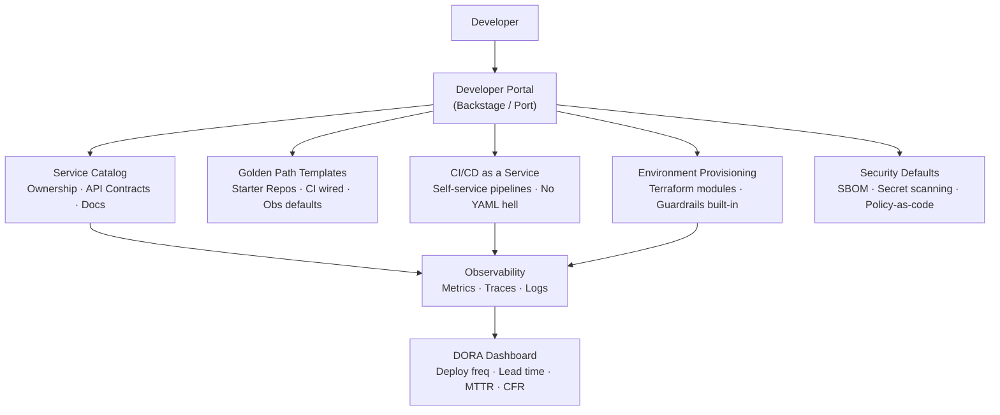
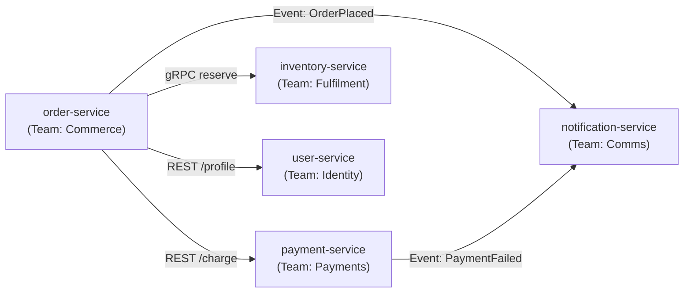

# Platform Engineering and Internal Developer Platforms

> **Reading Time:** 22 minutes
> **Difficulty:** Senior
> **Impact:** Cut developer onboarding from weeks to hours; move from 2 deploys/week to 20 deploys/day

---

## Level 1 — Surface (2-minute read)

**What it is**: An Internal Developer Platform (IDP) is a self-service layer that abstracts infrastructure complexity so application developers can provision environments, run pipelines, discover services, and ship code without filing tickets to ops teams.

**When you need one** (concrete triggers):
- Engineering headcount exceeds **50 engineers**
- You operate **3+ distinct tech stacks** with no shared tooling
- New engineer onboarding takes **> 1 week** before first deploy
- > 20% of sprint capacity goes to "waiting for infra" or "fixing CI/CD"
- Incident MTTR exceeds **2 hours** due to poor service discoverability

**The Golden Path concept**: A single opinionated, fully-supported route that works for 80% of teams. Not a mandate — teams can leave the path, but with reduced support SLA. Includes: starter repo template, wired CI/CD, observability pre-configured, security defaults on, environment provisioning automated.

**DORA metrics** (the measurement framework for platform effectiveness):

| Metric | Low Performer | High Performer | Elite |
|--------|--------------|----------------|-------|
| Deployment frequency | Monthly | Weekly | Multiple/day |
| Lead time for changes | 1–6 months | 1 week–1 month | < 1 hour |
| MTTR | 1 week+ | 1 day–1 week | < 1 hour |
| Change failure rate | > 45% | 16–30% | < 15% |



**Use this when / don't use this when:**

| Use IDP when | Don't use IDP when |
|---|---|
| > 50 engineers on 5+ teams | Small startup, single product team |
| Onboarding friction is measurable | Fewer than 3 services in production |
| Teams duplicate infrastructure setup | All teams share one monorepo + one stack |
| DORA metrics plateau below elite tier | Platform team doesn't exist yet |
| > 3 tech stacks with no shared tooling | Org has fewer than 20 engineers |

---

## Level 2 — Deep Dive

### The Problem: Cognitive Overhead at Scale

**Failure scenario**: 120-engineer organization. 8 product teams. Each team owns 4–12 microservices. Every new service requires: create AWS account → configure VPC → provision RDS → write Dockerfile → write GitHub Actions YAML (from scratch, copied from a blog post) → configure Datadog agent → set up PagerDuty routing → add to service registry (a Confluence page nobody updates). Total time: **2–3 weeks**. Error rate: high — each team invents subtly different patterns. Incidents are hard to diagnose because ownership is unclear. A senior engineer leaves; their 6 services have no documented owner.

**Traffic and scale where this breaks**:
- At 50 engineers: teams start duplicating infrastructure work
- At 100 engineers: 3+ incompatible CI/CD patterns, 2+ different secret management approaches
- At 200 engineers: onboarding takes 2 weeks; new hires spend first sprint asking "where is X?"
- At 500 engineers: a single infra ticket backlog spans 200+ items; platform becomes a bottleneck

**Root cause**: Infrastructure complexity scaled linearly with team count, but tooling investment didn't.

---

### IDP Core Components

#### 1. Service Catalog (Backstage model)

The service catalog is a **single source of truth** for every software component in the organization.

**What it stores per service**:
- Owner (team name, Slack channel, on-call rotation)
- Tech stack (language, framework, runtime version)
- API contracts (OpenAPI spec, Async API for events)
- Deployment topology (which envs exist, current version per env)
- SLO/SLA declarations (99.9% uptime, < 200ms P99)
- Links to runbooks, dashboards, incident history
- Dependency graph (what does this service call? who calls it?)

**API ownership graph** — the most valuable output:



When an incident fires on `order-service`, you immediately see: 3 upstream dependencies, 2 downstream consumers, who owns each, and their on-call rotation. **Mean time to identify blast radius: < 5 minutes** vs. 45 minutes of Slack archaeology.

**Catalog entry format** (Backstage `catalog-info.yaml`):

```yaml
apiVersion: backstage.io/v1alpha1
kind: Component
metadata:
  name: order-service
  description: Orchestrates checkout flow
  annotations:
    pagerduty.com/integration-key: abc123
    grafana/dashboard-selector: "order-service"
    github.com/project-slug: myorg/order-service
  tags:
    - java
    - kafka-consumer
    - critical-path
spec:
  type: service
  lifecycle: production
  owner: team-commerce
  system: checkout
  dependsOn:
    - component:payment-service
    - component:inventory-service
  providesApis:
    - order-api
```

---

#### 2. Golden Path Templates

The golden path is an opinionated **starter repo template** that comes pre-wired with everything a team needs to go from zero to production.

**What's included in a Java golden path template**:

```
golden-path-java/
├── src/
│   ├── main/java/
│   └── test/java/
├── .github/
│   └── workflows/
│       ├── ci.yml          # Test, lint, SAST, SBOM generation
│       ├── cd.yml          # Build → push → deploy via Spinnaker/ArgoCD
│       └── security.yml    # Secret scanning, dependency check
├── deploy/
│   ├── helm/               # Pre-configured Helm chart
│   └── terraform/          # Infra module (RDS, Redis, SQS as needed)
├── config/
│   ├── application.yml     # Spring Boot defaults + env overrides
│   └── otel-config.yml     # OpenTelemetry agent, auto-instrumentation
├── docs/
│   └── catalog-info.yaml   # Pre-filled Backstage registration
├── Dockerfile              # Multi-stage, non-root, SBOM label
└── README.md               # "Run make bootstrap and follow prompts"
```

**Time to first deploy comparison**:

| Without golden path | With golden path |
|----|-----|
| Day 1–3: Set up repo, CI/CD from scratch | Day 1: `npx @myorg/create-service my-service` |
| Day 4–6: Configure Datadog, alerts | Day 1: Auto-registered in catalog, dashboards live |
| Day 7–10: Security scanning, secrets | Day 1: SAST + secret scanning wired |
| Day 11–14: Deploy to staging | Day 1 afternoon: First PR deployed to staging |
| 2 weeks total | **4 hours total** |

**Opinionated but escapable**: Teams that need Python, Go, or Node get a different golden path template. Teams with exotic requirements can diverge but accept: no platform team SLA, self-owned CI/CD, manual catalog registration.

---

#### 3. CI/CD as a Service

Instead of each team writing their own GitHub Actions YAML (500+ lines, copied incorrectly across repos), the platform exposes **reusable pipeline components**.

**The problem with per-team YAML**:
- Team A uses `actions/checkout@v2`, Team B uses `@v3` — subtle security diff
- Security scanning added to 12/40 repos — compliance fails audit
- A platform-wide secret rotation requires updating 40+ repos manually

**The solution — composite actions / reusable workflows**:

```yaml
# .github/workflows/ci.yml (what teams write — 15 lines)
name: CI
on: [push, pull_request]
jobs:
  build:
    uses: myorg/platform-workflows/.github/workflows/java-ci.yml@main
    with:
      java-version: "21"
      sonar-project-key: ${{ vars.SONAR_KEY }}
    secrets: inherit
```

```yaml
# platform-workflows/java-ci.yml (maintained by platform team — 200 lines)
# Includes: checkout, setup-java, cache, test, coverage, SAST, SBOM,
#           Docker build, push to ECR, deploy to staging via ArgoCD,
#           Slack notification on failure
```

**Result**: Teams write 15-line files. Platform team owns the 200-line canonical version. Security fix? One PR in one repo, propagates to all 200 services within 24 hours as teams merge their dependency updates.

---

#### 4. Environment Provisioning

Self-service infrastructure: developers provision a new database, Redis cluster, or SQS queue by clicking a button or running a CLI command — no infra ticket required.

**The golden path for environment creation**:

```bash
# Developer runs
platform env create --name feature-xyz --type ephemeral --ttl 72h

# Platform CLI:
# 1. Creates Kubernetes namespace
# 2. Deploys service + dependencies from Helm charts
# 3. Provisions ephemeral RDS instance (PostgreSQL 15, 2 vCPU, 4GB)
# 4. Wires secrets into Vault, injects via env vars
# 5. Registers environment in catalog
# 6. Returns: https://feature-xyz.internal.myorg.com ready in 4 minutes

# Auto-destroyed after 72h or PR merge, whichever comes first
```

**Guardrails built in**:
- Max instance size for dev/staging capped (prevents `db.r5.24xlarge` in dev)
- Auto-destroy after TTL (prevents zombie environments — $50k/month saved at 200-engineer orgs)
- All resources tagged for cost attribution (team-name, service-name, environment)
- IAM permissions follow least-privilege defaults; escalation requires approval

**Cost savings at scale**: Airbnb reported that ephemeral environments with auto-destroy cut dev infrastructure spend by **40%**. Netflix estimates saving ~$2M/year from preventing forgotten staging environments.

---

#### 5. Developer Portal

The unified front door: search across services, docs, APIs, runbooks, and people.

**North Star metric**: **Time to find the answer** (not "time to read docs").

A developer asking "who owns the payment API, what's its contract, and is it healthy right now?" should get an answer in **< 30 seconds** from the portal, not 15 minutes of Slack + Confluence + PagerDuty tab switching.

**Portal capabilities**:
- Global search across catalog, docs, APIs, runbooks
- API explorer (try an API from the portal, see its OpenAPI spec)
- Tech radar (which libraries are "adopt", "trial", "hold", "deprecated")
- On-call directory ("who is on call for payment-service right now?")
- Incident history per service (last 5 incidents with RCA links)

---

### Build vs Buy Decision

| | Backstage | Port | Cortex | OpsLevel |
|--|--|--|--|--|
| **Model** | Open source, self-hosted | SaaS | SaaS | SaaS |
| **Setup time** | 2–4 weeks | 1–3 days | 1–3 days | 1–3 days |
| **Customization** | Unlimited (React plugins) | Moderate (scorecard-focused) | Moderate | Moderate |
| **Maintenance burden** | High (own infra, upgrades) | None | None | None |
| **Best org size** | 200–5000 engineers | 50–500 | 100–1000 | 100–1000 |
| **Cost** | Engineering time (~2 FTE) | $15–$40/user/month | $20–$50/user/month | $20–$50/user/month |
| **Strengths** | Full control, plugin ecosystem, 3000+ companies | Fast setup, beautiful UI | Scorecards, maturity tracking | SLO integration, reliability focus |
| **Weaknesses** | Significant upfront investment | Less extensible | Fewer integrations | Smaller community |

**When Backstage wins**:
- Org has > 200 engineers and a dedicated platform team (2+ FTE)
- Needs deep customization (custom plugins, bespoke workflows)
- Wants no vendor lock-in
- Already running Kubernetes; infrastructure for self-hosting is cheap
- Example: Spotify (origin), Zalando, American Airlines

**When Port/Cortex/OpsLevel wins**:
- Org is 50–200 engineers; no dedicated platform team yet
- Wants value in days, not weeks
- Primary need is service catalog + scorecards, not full IDP
- Engineering leadership willing to pay SaaS pricing
- Example: Most Series B–C startups transitioning from monolith

**Decision rule**: < 100 engineers → SaaS. 100–300 engineers → evaluate carefully (total cost of ownership for Backstage is 1–2 senior engineers full-time). > 300 engineers → Backstage almost always wins on TCO.

---

### DORA Metrics Deep Dive

DORA (DevOps Research and Assessment) defines four metrics that predict software delivery performance and organizational performance. **Elite performers are 2× more likely to meet business goals.**

#### Deployment Frequency

**What it measures**: How often does your team deploy to production?

**Why it matters**: High frequency = small batches = low risk per deploy = faster feedback loop.

```
Low:    Monthly or less
Medium: Weekly–monthly
High:   Weekly–daily
Elite:  Multiple deploys per day
```

**How to measure (git-based, not survey)**:

```python
# Count production deployments from git tags or deployment events
from datetime import datetime, timedelta

def deployment_frequency(deployments: list[datetime], window_days=30) -> float:
    """Returns deploys per day over the window."""
    window = timedelta(days=window_days)
    cutoff = datetime.utcnow() - window
    recent = [d for d in deployments if d >= cutoff]
    return len(recent) / window_days

# Elite: > 1.0 (multiple deploys/day)
# High:  0.14–1.0 (daily to weekly)
# Medium: 0.03–0.14 (weekly to monthly)
# Low:  < 0.03 (less than monthly)
```

**Practical data sources**: GitHub deployment events API, ArgoCD sync history, Spinnaker pipeline runs, PagerDuty change events.

---

#### Lead Time for Changes

**What it measures**: Time from first commit to running in production.

**Why it matters**: Directly measures developer productivity and feedback loop speed.

```
Elite:  < 1 hour
High:   1 day – 1 week
Medium: 1 week – 1 month
Low:    1–6 months
```

**How to measure**:

```python
def lead_time(pr_merged_at: datetime, deployed_at: datetime) -> timedelta:
    """
    Simplified: time from PR merge to production deploy.
    Better: time from first commit on branch to production deploy.
    """
    return deployed_at - pr_merged_at

# Track P50, P90, P99 — median hides long tails
# A P50 of 45min with P99 of 8 hours means your golden path works
# but exceptions (large PRs, manual approval gates) kill elite status
```

**Common bottlenecks that inflate lead time**:
- Manual approval gates ("manager must approve every deploy") — adds hours to days
- Long test suites (> 30 min) — run in parallel, skip flaky tests
- Sequential pipeline stages — parallelize unit tests, integration tests, SAST
- Environment queue contention — "waiting for staging" is a platform problem

---

#### MTTR (Mean Time to Restore)

**What it measures**: Time from incident start to service restored.

**Why it matters**: Directly maps to customer SLA. **$1M/hour downtime cost** is common at mid-size SaaS companies.

```
Elite:  < 1 hour
High:   < 1 day
Medium: 1 day – 1 week
Low:    > 1 week
```

**Components of MTTR**:

```
MTTR = Time to Detect + Time to Diagnose + Time to Mitigate + Time to Verify

Time to Detect:   Alert fires, engineer acknowledges (target: < 5 min)
Time to Diagnose: Find root cause service/component (target: < 15 min)
                  → This is where a good service catalog pays dividends
Time to Mitigate: Rollback, hotfix, or traffic shift (target: < 20 min)
                  → This is where golden path + ArgoCD rollback pays dividends
Time to Verify:   Confirm metrics back to normal (target: < 10 min)
```

**How the platform reduces MTTR**:
- Service catalog: blast radius identified in < 2 min vs. 20 min of Slack digging
- Golden path with ArgoCD: one-click rollback in < 3 min
- Pre-wired dashboards: no "which dashboard?" confusion during incident
- Feature flags: instant disable without a deploy

---

#### Change Failure Rate (CFR)

**What it measures**: Percentage of deployments that cause a production incident, rollback, or hotfix.

**Why it matters**: High CFR with high frequency = chaos. High frequency + low CFR = elite.

```
Elite:  < 15%
High:   16–30%
Medium: 16–30% (same band; separated by frequency)
Low:    > 45%
```

**How to measure**:

```python
def change_failure_rate(deploys: int, incident_caused_by_deploy: int) -> float:
    return incident_caused_by_deploy / deploys

# Attribute incidents to deploys: look at deploys in the 1 hour before
# incident start. If deploy exists → likely cause (confirm in postmortem).
# Automate via: PagerDuty + deployment event correlation
```

**Platform levers that reduce CFR**:
- Canary deployments (catch failures at 1% traffic before 100%)
- Automated rollback on SLO breach (deploy → watch error rate → auto-rollback if > threshold)
- Required PR reviews + SAST in CI (prevent obvious bugs reaching prod)
- Feature flags: decouple deploy from release (ship dark, enable for 5% → verify → 100%)

---

### Platform Team as Product Team

This is the most important mental model shift. **The platform team's customers are developers, not end users.**

#### Internal NPS as a Signal

Run quarterly developer surveys. Key questions:
- "How likely are you to recommend our internal tooling to a new hire?" (NPS)
- "Rate your onboarding experience" (1–10)
- "What is your biggest frustration with the platform?" (open text)

**NPS benchmarks for internal platforms**:
- < 0: Platform is actively harming productivity (urgent)
- 0–20: Neutral; platform is tolerated but not loved
- 20–50: Good; developers see clear value
- > 50: Elite; platform team is a competitive differentiator

Spotify's internal Backstage NPS was **> 60** within 18 months of launch, becoming a key retention factor for engineers.

#### North Star Metric: Time to First Deploy (TTFD)

**Definition**: Time from a new engineer's first day to their first successful production deployment.

**Why it's the right North Star**:
- Captures onboarding quality (docs, tooling, access provisioning)
- Captures CI/CD reliability (does the pipeline work on first try?)
- Captures environment provisioning speed
- Captures service catalog quality (can they find what they need?)

**TTFD targets by maturity stage**:

| Platform maturity | TTFD target |
|---|---|
| No platform | 2–4 weeks |
| Basic platform (CI/CD templates, some docs) | 3–5 days |
| Mature platform (Backstage, golden path, self-service) | < 1 day |
| Elite platform | < 4 hours |

Spotify went from 2 weeks to 1 hour after full Backstage rollout.

#### Platform Roadmap Driven by Pain Points

```
Wrong approach (supply-driven):
  "We want to add GraphQL federation support"
  "Let's refactor our Terraform modules"

Right approach (demand-driven):
  Quarterly survey → top 3 pain points
  Pain 1: "I spend 2 hours every sprint getting approvals for staging deploys"
  → Build: self-service staging environment provisioning
  Pain 2: "I can't find who owns service X when it's causing my alerts"
  → Build: ownership lookup in catalog, alert routing integration
  Pain 3: "Our CI takes 45 minutes; I can't get feedback quickly"
  → Build: parallelized test execution, caching layer
```

**Platform SLAs** (platform team owes these to developers):
- Developer portal uptime: 99.9%
- Golden path template responds to issues within 1 business day
- New golden path feature requests triaged within 1 week
- CI pipeline P50 execution time: < 10 minutes (tracked weekly)
- Environment provisioning: < 5 minutes end-to-end

---

### Real Examples

#### 1. Spotify's Backstage (2017–2020)

**Context**: 200 engineers (2017), grew to 1500+ by 2020. Operated 80+ different tech stacks. New engineers took **2 weeks** to make their first deploy.

**Problems**:
- No central service discovery — "which team owns the payments API?" required 3 Slack DMs
- 80 different CI/CD setups — no consistent security scanning, varied Docker patterns
- Documentation lived in 12 different places (Confluence, GitHub wikis, Google Docs, Notion)
- Onboarding guide was a 50-page PDF that went stale within weeks

**Backstage solution** (built internally 2017–2019):
- Service catalog with auto-discovery via `catalog-info.yaml` in every repo
- Software templates (golden path) for creating services, libraries, ML pipelines
- TechDocs: docs-as-code, auto-published from repo
- Plugin ecosystem: 50+ internal integrations (Datadog, PagerDuty, Vault, Kubernetes)

**Results by 2020**:
- Onboarding: 2 weeks → **1 hour** (time to first deploy)
- Service catalog: 100% of production services registered (up from ~20% in Confluence)
- Open-sourced March 2020; 3000+ companies adopted within 3 years
- 2023: > 1 million developers use Backstage globally

**Open-source decision rationale**: Spotify recognized they were building developer tooling, not competitive advantage. Sharing the project accelerated plugin development: community contributed 200+ plugins Spotify couldn't have built internally.

---

#### 2. Netflix's Paved Road (2015–present)

**Context**: 800+ engineers (2015). Netflix famously operates with "freedom and responsibility" — teams own their tech stack completely. But complete freedom creates support nightmares.

**Paved Road concept**: An opinionated, fully-supported path (Java + Gradle + Spinnaker + Atlas metrics) that teams are encouraged but not required to follow. Teams that deviate accept reduced platform support.

**Core stack**:
- Language: Java (primary), with supported paths for Python and Node
- Build: Gradle with Netflix-specific plugins (dependency management, security scanning)
- CI: Jenkins (internal) → migrated to GitHub Actions
- CD: Spinnaker (Netflix open-sourced this too)
- Metrics: Atlas (Netflix's internal time-series DB, open-sourced)
- Tracing: Zipkin (Netflix open-sourced this too)
- Service mesh: Eureka for service discovery, Ribbon for client-side LB, Hystrix for circuit breaking (the Netflix OSS stack)

**Results**:
- **90% adoption** of paved road across Netflix engineering
- Services on paved road: average **35 deploys/week** per service
- Services off paved road: average 8 deploys/week (support overhead reduces velocity)
- Spinnaker deploys: **4000+ deployments/day** across Netflix infrastructure

**The 10% escape hatch**: Teams with valid reasons (ML teams needing Python, mobile teams needing different tooling) can diverge. They get: zero platform team SLA, self-owned on-call for their infra tooling, documentation expected in their own repo. Netflix found this actually increased paved road adoption — knowing you *can* leave makes staying feel like a choice, not a mandate.

---

#### 3. Airbnb's Internal Platform (2018–2022)

**Context**: 3000+ engineers, 5000+ services, 100+ teams. Service creation was bottlenecked on a 12-person infra team.

**Before platform**:
- New service creation: **2 weeks** (request → design review → Terraform → DNS → CI/CD → staging)
- 40% of new services had misconfigured monitoring (found during first incident, not setup)
- Secret management: 3 different patterns in use simultaneously
- Cost attribution: impossible — couldn't map AWS spend to teams

**Platform investments (2018–2020)**:
- Service scaffold: Cookiecutter templates for Java, Python, Node with full CI/CD
- Spinnaker for CD: standardized canary deployments, automatic rollback on error spike
- Envoy service mesh: observability baked in (distributed traces, per-service metrics)
- ServicePortal: internal catalog (Backstage-like, built before Backstage existed)
- Cost dashboard: real-time AWS cost per team, per service, with anomaly detection

**Results**:
- New service creation: 2 weeks → **30 minutes**
- Monitoring coverage: 40% → 98% (pre-configured in golden path)
- Incident MTTR: reduced by 40% due to faster service ownership lookup
- Dev infrastructure cost: reduced **40%** via ephemeral environments + auto-destroy
- Canary deployments: caught 23% of production-impacting bugs at < 5% traffic in 2020

---

### Common Mistakes

#### Mistake 1: Building the Platform Before the Pain

**What it looks like**: Engineering leadership reads about Backstage, allocates a team to build an IDP. Pain points are undefined. Platform is built based on what the team thinks developers need.

**Root cause**: Platform engineering is aspirational — it's easy to justify the investment without measuring actual developer friction.

**Operational impact**: Platform team builds features nobody uses. Internal NPS is low. The catalog is half-populated. Golden path adoption is 20%. The platform team is perceived as "the team that slows us down by asking us to update YAML files."

**Fix**: Before writing one line of platform code, instrument the pain:
1. **Onboarding time audit**: Shadow 3 new hires through their first week. Measure actual TTFD.
2. **Sprint friction survey**: Ask teams: "What percentage of your sprint was blocked on infra work?"
3. **Service creation log**: Count how many infra tickets were filed last quarter. Measure resolution time.
4. **DORA baseline**: Measure current deployment frequency, lead time, MTTR, CFR across 5 representative teams.

Only build what directly reduces the top 3 pain points. Platform investment without measurement is waste.

---

#### Mistake 2: Mandating the Golden Path

**What it looks like**: Platform team builds a golden path, then issues a mandate: "All new services must use the golden path by Q3. Existing services must migrate by Q4."

**Root cause**: Platform team optimizes for consistency (their problem) rather than developer productivity (developers' problem).

**Operational impact**: Teams with legitimate reasons to deviate (ML pipelines, data engineering, edge services) are forced into an ill-fitting template. They spend more time fighting the golden path than building features. Resentment builds. Teams start filing "golden path exceptions" — creating a new backlog for the platform team. Internal NPS drops. The golden path becomes the "rusted road" — technically required, practically abandoned.

**Real example**: A mid-size fintech mandated Backstage catalog registration for all services within 6 months. Teams that didn't see value in the catalog (small, stable teams with no dependencies) auto-generated `catalog-info.yaml` files with placeholder data. The catalog had 100% registration but 60% data quality — worse than no catalog, because it created false confidence.

**Fix**: Make the golden path **irresistibly good**, not compulsory.
- Ensure golden path genuinely saves time vs. DIY (benchmark: > 50% faster)
- Publish adoption metrics publicly (teams want to be on the "modern" stack)
- Offer migration incentives: first 10 teams to migrate get dedicated platform support
- Make non-adoption visible via scorecards (public, not punitive)
- Accept that 10–20% of teams will always have valid reasons to diverge

**Target**: 80%+ voluntary adoption within 12 months of launch. If below 60%, the golden path has a product problem, not an adoption problem.

---

#### Mistake 3: Treating Platform as Infrastructure

**What it looks like**: Platform team is staffed with infrastructure engineers. They ship reliable systems (Kubernetes clusters, Terraform modules, CI/CD runners) but have no product mindset. No roadmap, no user interviews, no NPS tracking. Requests come in via Jira tickets. There is no portal — developers SSH into machines or send Slack messages.

**Root cause**: Most platform teams grew out of the ops/infra team. Infrastructure mindset is: keep the lights on, respond to tickets, optimize for reliability. Product mindset is: reduce friction, ship features developers ask for, deprecate what isn't used.

**Operational impact**: The platform team becomes a bottleneck. Developer productivity plateaus. Onboarding doesn't improve year over year. DORA metrics stagnate. "Infra tickets" become a synonym for "things that block us."

**Fix**: Restructure the platform team as a product team:

```
Platform Team Structure (Product Model):
├── Platform Product Manager
│   └── Owns roadmap, developer surveys, NPS, TTFD metric
├── Platform Engineers (2–4)
│   └── Build catalog, golden path templates, self-service tooling
├── Infrastructure Engineers (2–3)
│   └── Kubernetes clusters, networking, cloud accounts
└── Developer Relations / DX
    └── Documentation, onboarding guides, office hours
```

**Key rituals to add**:
- Monthly developer NPS survey
- Quarterly "pain point prioritization" session with team leads
- Public platform roadmap (developers can +1 and comment on upcoming features)
- Weekly office hours: 1-hour open Zoom where developers can ask platform questions
- Platform changelog: email/Slack updates when new features ship

**Metric to track**: Internal NPS trend (should increase 5–10 points per quarter in the first year).

---

### Production Numbers to Remember

| Metric | What it tells you | Elite target |
|---|---|---|
| Time to First Deploy (TTFD) | Onboarding quality | < 4 hours |
| Deployment frequency | Batch size + feedback speed | > 1/day/service |
| Lead time for changes | Dev velocity | < 1 hour |
| MTTR | Incident response quality | < 1 hour |
| Change failure rate | Release safety | < 15% |
| Platform internal NPS | Developer satisfaction | > 40 |
| Catalog coverage | Service discoverability | > 95% of prod services |
| Golden path adoption | Standardization ROI | > 80% of new services |
| CI P50 execution | Feedback loop speed | < 10 minutes |
| Environment provision time | Self-service quality | < 5 minutes |

---

### Key Takeaways / TL;DR

- **An IDP is the right investment at > 50 engineers with > 3 stacks** — below that, the overhead outweighs the benefit; above 200 engineers, not having one costs 20%+ of developer capacity to infrastructure toil.
- **The golden path is a product, not a policy** — 80%+ voluntary adoption is the target; mandating it causes the rusted road effect where teams comply but don't benefit.
- **DORA elite = multiple deploys/day, < 1h lead time, < 1h MTTR, < 15% CFR** — these metrics predict 2× business performance vs. low performers (Google DORA 2023).
- **Spotify went from 2-week onboarding to 1 hour** with Backstage; Netflix runs 4000+ deploys/day via Spinnaker; Airbnb cut service creation from 2 weeks to 30 minutes — all three treated the platform as a product with NPS tracking.
- **The platform team's #1 mistake is building before measuring pain** — instrument TTFD, sprint friction, and DORA baseline first; only build what directly reduces the top-3 pain points.

---

## References

- 📖 [Spotify's Backstage — origin story](https://engineering.atspotify.com/2020/04/how-we-use-backstage-at-spotify/) — How Spotify built and open-sourced Backstage, reducing onboarding from 2 weeks to 1 hour
- 📖 [Google DORA Report 2023](https://dora.dev/research/) — The definitive research on software delivery performance; elite performer thresholds and business outcome correlation
- 📖 [Netflix Paved Road](https://netflixtechblog.com/towards-true-continuous-integration-distributed-repositories-and-team-autonomy-at-netflix-4f39c89c7836) — Netflix's philosophy on opinionated tooling with an escape hatch; how 90% adoption was achieved voluntarily
- 📺 [Platform Engineering at Airbnb — KubeCon 2022](https://www.youtube.com/watch?v=AKqAqDCOlhI) — Airbnb's journey from 2-week service creation to 30 minutes using Spinnaker and Envoy
- 📖 [Team Topologies — platform team patterns](https://teamtopologies.com/key-concepts) — The canonical reference for platform team structure, interaction modes, and cognitive load reduction
