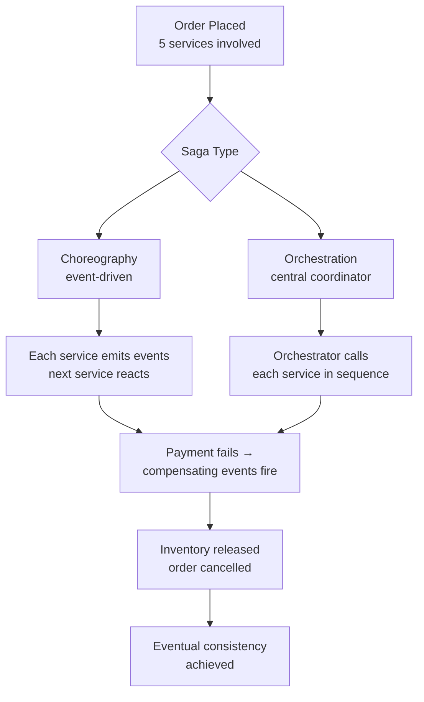
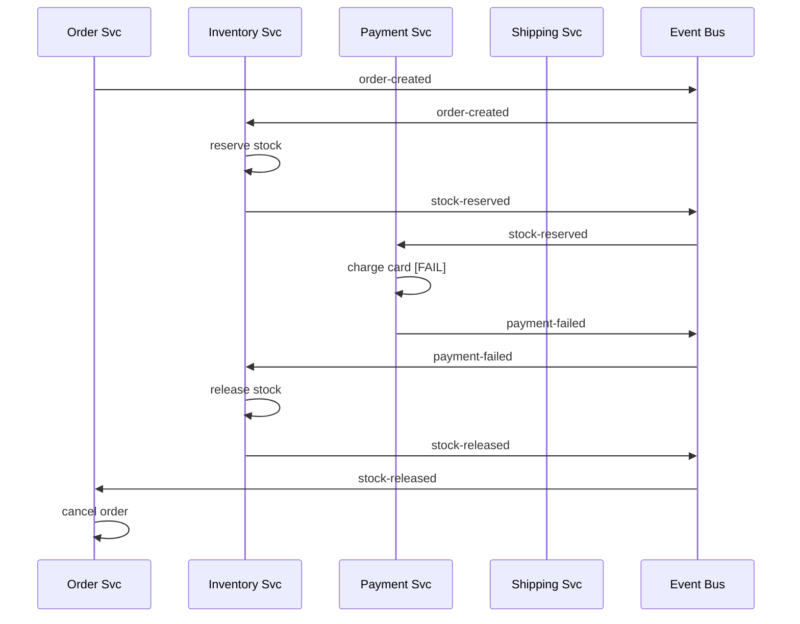
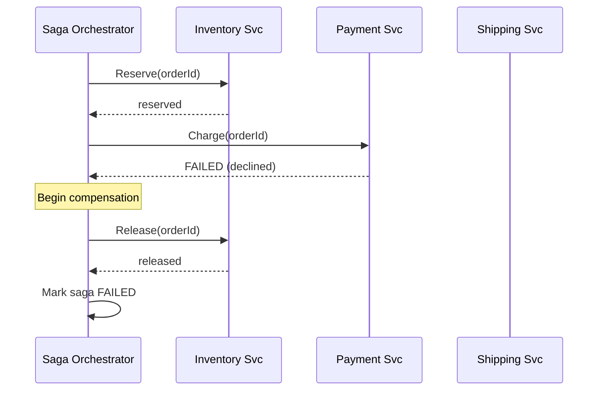
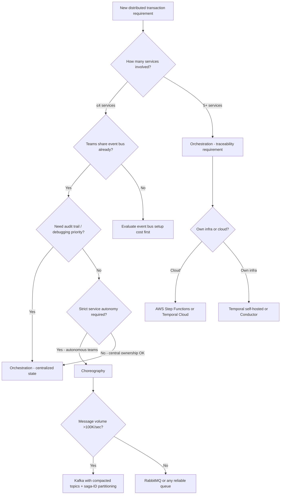

# Saga Pattern: Choreography vs Orchestration for Distributed Transactions

## 🗺️ Quick Overview


*Normal path: each step succeeds and chain completes. Trigger: any step fails mid-saga. Recovery: compensating transactions roll back completed steps in reverse order.*

**Distributed transactions are a solved problem — until you have microservices. ACID across service boundaries requires 2PC, which nobody wants in production. The Saga pattern is the industry answer, but it has two wildly different implementations with completely different failure profiles.**

**Choose the wrong one and you'll spend six months debugging ghost compensations in a 15-service mesh you can't reason about.**

---

## The Problem Class `[Mid]`

You have an e-commerce order placement that touches five services: Order, Inventory, Payment, Shipping, Loyalty. Each has its own database. You need all-or-nothing semantics — if payment fails, inventory must be released.

Traditional distributed transactions use 2-Phase Commit (2PC): a coordinator sends prepare to all participants, waits for acknowledgment, then sends commit. The blocking nature of 2PC means if the coordinator dies between prepare and commit, participants hold locks forever. At 99.9% availability per service, a 5-service 2PC achieves 99.5% availability — worse than each individual service.

The dual-write problem concretely:

```
// DANGER: These two operations are not atomic
inventoryDB.reserveItems(orderId, items);   // succeeds
eventBus.publish("items-reserved", event); // crashes

// On restart, inventory is reserved but no downstream knows.
// The event is lost. This order is permanently inconsistent.
```

```mermaid
graph TD
    subgraph "2PC Failure Window"
        C[Coordinator] -->|"1. PREPARE"| S1[Inventory]
        C -->|"1. PREPARE"| S2[Payment]
        C -->|"1. PREPARE"| S3[Shipping]
        S1 -->|"2. READY"| C
        S2 -->|"2. READY"| C
        S3 -->|"2. READY"| C
        C -->|"3. COMMIT"| S1
        C -->|CRASH 💥"| X[Dead]
        S2 -.->|"Waiting forever, locks held"| S2
        S3 -.->|"Waiting forever, locks held"| S3
    end

    subgraph "Scale Impact"
        N["5 services @ 99.9%"] -->|"2PC compound availability"| R["99.5% system availability"]
    end
```

The Saga pattern replaces one distributed transaction with a sequence of local transactions, each publishing an event or message. If any step fails, compensating transactions undo the previous steps. No global locks, no coordinator blocking.

---

## Why the Obvious Solution Fails `[Senior]`

**Why not just use idempotent retries?** Retries handle transient failures — a service crash and restart. They don't handle business-logic failures (credit card declined, item out of stock). And non-idempotent operations (debit $100) cannot be blindly retried.

**Why not just use a shared database?** Shared databases couple services — schema changes in one service break others. This is the monolith anti-pattern under a microservices veneer. Service boundaries only exist at the process level if data is shared.

**Why not eventual consistency via event publishing only?** Without compensating transactions, partial failures leave the system in an inconsistent state permanently. Inventory reserved, payment failed, shipping never scheduled — the order exists in limbo.

**The naive event-driven approach:**

```
Order Service:
  1. Save order to DB ✓
  2. Publish "order-created" event ✓
  3. Inventory Service consumes, reserves stock ✓
  4. Payment Service consumes, charges card ✗ (declined)
  5. Nobody released the inventory reservation
```

This isn't a transaction failure — it's a design gap. Compensating transactions must be explicitly designed for every failure path.

---

## The Solution Landscape `[Senior]`

There are exactly two Saga implementations: **Choreography** (event-driven, no central coordinator) and **Orchestration** (central saga orchestrator controls the flow). They are not interchangeable — they have different observability profiles, coupling characteristics, and failure modes.

---

### Solution 1: Choreography Saga

**What it is**

Each service publishes events when it completes its local transaction. Other services subscribe to those events and react. There is no central coordinator — the flow emerges from the event chain.

**How it actually works at depth**

```
Order Service         → publishes: "order-created"
  Inventory Service   → subscribes to "order-created"
                      → reserves stock
                      → publishes: "stock-reserved"
  Payment Service     → subscribes to "stock-reserved"
                      → charges card
                      → publishes: "payment-completed"
  Shipping Service    → subscribes to "payment-completed"
                      → schedules shipment
                      → publishes: "shipment-scheduled"

FAILURE PATH (payment declined):
  Payment Service     → charges card
                      → publishes: "payment-failed"
  Inventory Service   → subscribes to "payment-failed"
                      → releases stock reservation
                      → publishes: "stock-released"
  Order Service       → subscribes to "stock-released"
                      → marks order as cancelled
```

Every service must subscribe to both success and failure events from upstream services. Every service must publish compensating events when it reverses its action.



**Sizing guidance** `[Staff+]`

Event bus throughput determines saga throughput. For a saga with N steps, each successful transaction generates N events minimum. Each failed transaction generates up to 2N events (forward + compensating). At 10K orders/sec with a 5-step saga and 1% failure rate, event throughput is:

```
Success events: 10,000 * 0.99 * 5 = 49,500/sec
Failure events: 10,000 * 0.01 * 2*5 = 1,000/sec
Total: ~50,500 events/sec sustained
```

Kafka handles this comfortably with a single topic per event type. Plan partitions at 3-5x expected peak throughput for headroom.

**Configuration decisions that matter** `[Staff+]`

- **Event ordering**: Choreography assumes events for a given saga correlate by `saga_id` (or `order_id`). Partition your Kafka topics by saga ID to maintain order within a saga while allowing parallel processing across sagas.
- **Consumer group isolation**: Inventory and Payment both consume `order-created`. Use separate consumer groups so each service maintains independent offsets.
- **Event schema versioning**: When Inventory Service changes what data it needs from `order-created`, schema registry + Avro prevents the schema-coupling antipattern.
- **Idempotent consumers**: Message delivery is at-least-once. Every consumer must be idempotent — check if this saga step was already processed before acting.

**Failure modes** `[Staff+]`

1. **Lost compensation event**: Payment charges the card. Inventory Service crashes before processing `payment-failed`. Inventory is never released. Mitigation: Kafka consumer group offsets ensure the message is redelivered on restart. But if the service doesn't recover, the message sits unconsumed indefinitely — set up consumer lag alerts.

2. **Cyclic compensation**: `payment-failed` → `stock-released` → triggers another event that re-reserves stock (if event routing is misconfigured). Graph your event subscriptions and verify there are no cycles.

3. **Trace impossibility at scale**: With 15 services and 30 event types, reconstructing "what happened to order X" requires correlating events across 30 Kafka topics. Distributed tracing (trace ID propagated in event headers) is mandatory, not optional.

4. **Double compensation**: At-least-once delivery means Inventory Service might receive `payment-failed` twice. If it releases stock twice, it might release reservations it didn't make. Idempotency at the compensation level requires tracking compensation state per saga ID.

**Observability** `[Staff+]`

- Propagate `trace_id` and `saga_id` in every event header — never derive them from payload
- Build a "saga state view" by consuming all events into a read model keyed by `saga_id`
- Alert on sagas that haven't completed within SLA (e.g., no terminal event within 60 seconds)
- Alert on compensating transactions — they indicate failures; a spike is a system signal

---

### Solution 2: Orchestration Saga

**What it is**

A central Saga Orchestrator (a dedicated service or a workflow engine like AWS Step Functions, Temporal, or Conductor) controls the saga lifecycle. It calls each service in sequence, handles failures, and invokes compensating transactions explicitly.

**How it actually works at depth**

```
Saga Orchestrator receives: "place order"
  1. Call Inventory.Reserve(orderId, items)
     → success: continue
     → failure: DONE (nothing to compensate, saga failed cleanly)

  2. Call Payment.Charge(orderId, amount)
     → success: continue
     → failure: call Inventory.Release(orderId)  // compensate step 1
               DONE (saga failed with compensation)

  3. Call Shipping.Schedule(orderId)
     → success: continue
     → failure: call Payment.Refund(orderId)     // compensate step 2
               call Inventory.Release(orderId)   // compensate step 1
               DONE (saga failed with compensation)

  4. Publish order-completed event
```

The orchestrator persists its state — each step transition is durable. If the orchestrator crashes mid-saga, on recovery it knows exactly which step it was on and continues.



**Sizing guidance** `[Staff+]`

The orchestrator is a stateful service — its database becomes a bottleneck. For Temporal:
- 1 workflow execution = ~5 KB of history (state + events)
- 10K concurrent sagas = ~50 MB in-memory workflow state
- Temporal's Cassandra backend handles 50K+ workflows/sec on commodity hardware
- Orchestrator service itself: 2-4 replicas with 4 GB RAM each is typical for 10K concurrent workflows

For AWS Step Functions:
- 4,000 state transitions/sec per account (soft limit, raisable)
- At 10K orders/sec with 5 steps, you need 50K transitions/sec — requires a quota increase request
- Cost: $0.025 per 1,000 state transitions — significant at scale

**Configuration decisions that matter** `[Staff+]`

- **Orchestrator persistence**: The orchestrator's state store (Temporal's Cassandra, database-backed custom orchestrator) must be durable and highly available. Losing orchestrator state during a saga leaves it in an incomplete state with no record of what to compensate.
- **Compensating transaction order**: Compensations run in reverse step order. This is critical when compensation B depends on the result of compensation A (e.g., must release inventory before marking order cancelled, or downstream systems see an invalid state).
- **Timeout per step**: Each service call must have a timeout. Orchestrator without timeouts hangs sagas waiting for services that will never respond.
- **Compensation failure**: What if a compensating transaction fails? You can retry compensation with backoff, or escalate to a human workflow (dead letter queue + alerting). Never silently drop failed compensations.

**Failure modes** `[Staff+]`

1. **Orchestrator single point of failure**: A crashed orchestrator with in-memory state loses all in-flight saga state. Mitigation: persist every step transition to durable storage before calling the next service. Temporal and Step Functions do this by design.

2. **Compensation cascade failure**: Payment is compensated (refunded), but Inventory compensation fails (service down). You now have a refunded payment but reserved inventory — a financial inconsistency. Mitigation: never give up on compensating transactions; dead-letter queue + operations runbook for manual resolution.

3. **Stale orchestrator state**: Orchestrator calls Inventory.Reserve, network timeout occurs, the call actually succeeded, but orchestrator retries. Inventory must be idempotent (idempotency key = `saga_id + step_id`).

4. **Orchestrator bottleneck**: All saga state funnels through one service. At high concurrency, the orchestrator's database becomes the bottleneck. Shard by `saga_id % N` orchestrator replicas, each owning a partition of saga state.

**Observability** `[Staff+]`

- The orchestrator's state table IS the observability — query it for saga status at any time
- Expose `/saga/{id}/status` API for operational tooling
- Alert on sagas stuck in a single step for > 2x expected step duration
- Dashboard: sagas started/completed/failed per minute, step-level latency percentiles, compensation rate

---

## Trade-off Matrix `[Senior]` → `[Staff+]`

| Dimension | Choreography | Orchestration |
|---|---|---|
| **Coupling** | Loose — services don't know each other | Tighter — orchestrator knows all services |
| **Traceability** | Hard at >5 services | Built-in — orchestrator state is the trace |
| **Single point of failure** | None (distributed) | Orchestrator must be HA |
| **Business logic location** | Scattered across services | Centralized in orchestrator |
| **Compensation complexity** | Each service handles its own | Orchestrator manages all compensations |
| **Operational complexity** | High (debug across topics) | Lower (single place to inspect) |
| **Infrastructure cost** | Event bus (low per-message) | Orchestrator service + state store |
| **Team ownership** | Shared (every team owns saga logic) | Single team owns orchestrator |
| **Cyclic dependency risk** | High (event loops) | Low (DAG enforced by orchestrator) |
| **Scale ceiling** | Event bus throughput | Orchestrator state store throughput |

---

## Decision Framework `[Senior]` → `[Staff+]`



---

## Production Failure Story `[Staff+]`

**The Compensation Loop — Real Pattern from a Payments Platform**

A 12-service e-commerce platform used choreography sagas for order processing. The Loyalty Service subscribed to `order-completed` and awarded points. The Order Service subscribed to `loyalty-awarded` and updated the order record with point balance.

A bug in the Order Service's event handler caused it to re-publish `order-completed` after every `loyalty-awarded` event. This created an infinite loop:

```
order-completed → loyalty-awarded → order-completed → loyalty-awarded → ...
```

Within 90 seconds, the Loyalty Service had awarded 50,000x the correct points for 200 orders. Kafka consumer lag on the `order-completed` topic hit 4 million messages before the on-call engineer killed the consumer group.

**Root cause**: Choreography sagas have no built-in cycle detection. The event graph was never audited for cycles. `loyalty-awarded` should never have triggered `order-completed`.

**Fix**:
1. Explicit event dependency graph documentation and automated cycle detection in CI
2. Saga ID tracking — if a saga-id has already seen a given event type, discard it (idempotency check also catches loops)
3. Rate limiting on compensation/loop-sensitive event handlers

**With orchestration, this loop is impossible** — the orchestrator defines the step sequence as a DAG; no step can re-trigger a completed step.

---

## Observability Playbook `[Staff+]`

**Saga State Machine View (both patterns)**

Maintain a saga state table, either via the orchestrator's internal state or by projecting all saga events into a read model:

```sql
CREATE TABLE saga_state (
  saga_id       UUID PRIMARY KEY,
  saga_type     VARCHAR(64),
  current_step  VARCHAR(64),
  status        VARCHAR(32),  -- RUNNING, COMPLETED, COMPENSATING, FAILED
  started_at    TIMESTAMPTZ,
  updated_at    TIMESTAMPTZ,
  step_history  JSONB         -- [{step, status, duration_ms, error}]
);
```

**Key metrics to emit**:
- `saga_duration_seconds{saga_type, status}` — histogram
- `saga_step_duration_seconds{saga_type, step, status}` — histogram per step
- `saga_compensation_total{saga_type, step}` — counter (compensations = failures)
- `saga_stuck_count{saga_type}` — gauge (sagas not updated in > SLA threshold)

**Alerting thresholds**:
- Compensation rate > 2% of sagas starting: page on-call
- Any saga stuck > 5 minutes: page on-call
- Saga completion rate drops > 20% from baseline: page on-call

---

## Architectural Evolution `[Staff+]`

**2024-2025**: Temporal.io emerged as the dominant open-source saga orchestration engine. Its durable execution model (workflow code runs as if it's single-threaded, failures are transparent) eliminates explicit state machine design. Teams write workflow code in Go, TypeScript, Python, or Java, and Temporal handles persistence, retries, and compensation.

**2026 perspective**:
- **Dapr Workflow** (GA in 2024) provides saga orchestration built on the actor model, with native Kubernetes integration. Teams using Dapr service invocation get saga orchestration with minimal additional infrastructure.
- **Event-driven saga tooling**: EventBridge Pipes (AWS) enables choreography-style event routing with built-in filtering and transformation, reducing boilerplate consumer code.
- **Saga debugging tools**: Temporal UI provides visual saga timelines. For choreography, tools like Hazelcast's Saga visualizer or custom Kafka-to-graph projections are still required — this gap persists in 2026.
- **The Temporal vs Step Functions divide**: Temporal wins on local development experience and vendor independence; Step Functions wins on zero operational overhead for AWS-native teams. At 1M+ sagas/day, Step Functions cost ($25K+/month) drives teams back to self-hosted Temporal.

**The emerging pattern** for 2026: orchestration for critical-path sagas (order placement, payment processing) with choreography for non-critical event chains (analytics, notifications). Mixing the two in a single system is valid — not every event chain needs orchestrator overhead.

---

## Decision Framework Checklist `[All Levels]`

- [ ] Mapped every service involved in the saga and their database boundaries
- [ ] Designed compensating transaction for every step that modifies state
- [ ] Verified compensating transactions are idempotent (compensation applied twice = safe)
- [ ] Chosen choreography or orchestration based on service count and observability requirements
- [ ] If choreography: audited event dependency graph for cycles
- [ ] If orchestration: chosen persistence backend (Temporal, Step Functions, database-backed)
- [ ] Propagating `saga_id` and `trace_id` in all events/calls
- [ ] Defined SLA for saga completion and alert threshold for stuck sagas
- [ ] Defined runbook for failed compensations (manual resolution process)
- [ ] Load tested saga throughput against orchestrator/event bus capacity
- [ ] Verified consumer idempotency — same event delivered twice is safe
- [ ] Documented rollback behavior for each step in the runbook

*Written by Gaurav Porwal — 10+ Year Engineer | Tech Lead | Product Owner | Business-Minded Builder*
*Last updated: 2026-03-18*
