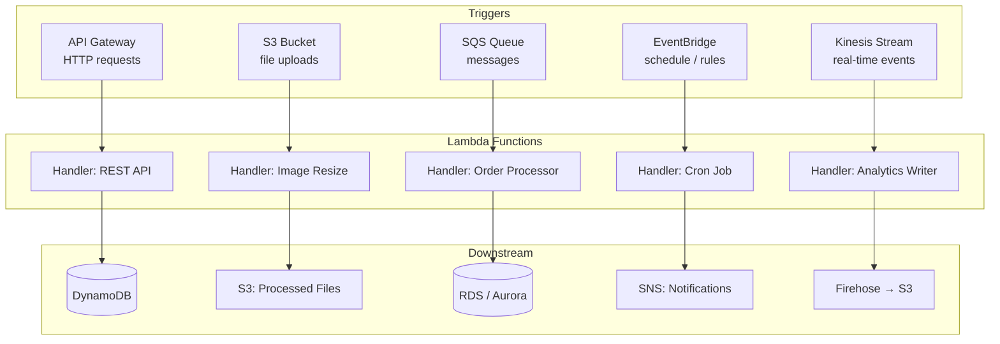
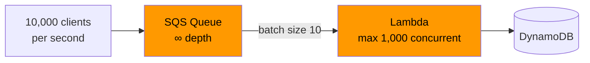
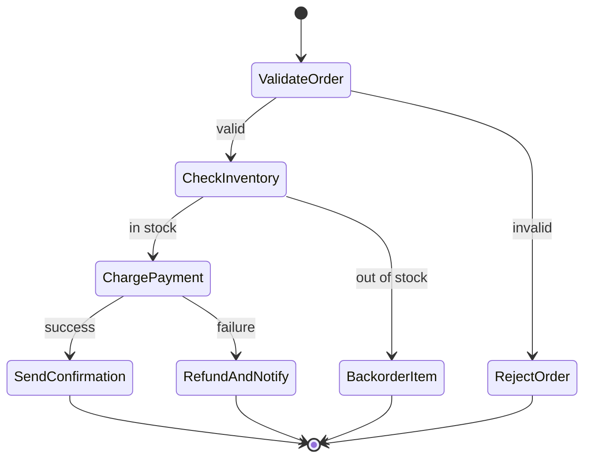
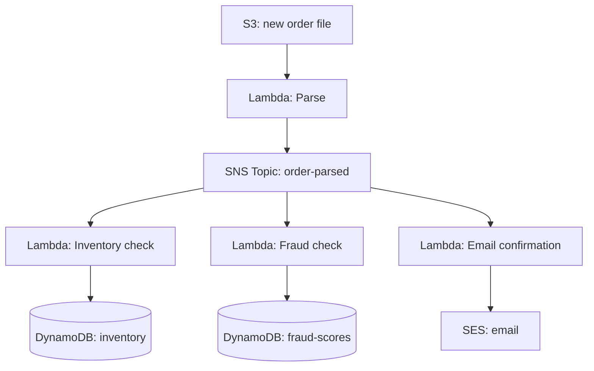
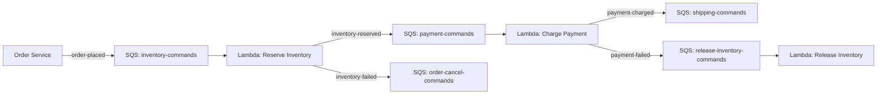

# Serverless Architecture at Scale

## Level 1 — Surface (2-minute read)

**Serverless does not mean no servers.** It means you do not provision, manage, patch, or scale servers. The cloud provider owns execution infrastructure; you supply code and pay per invocation. The operational boundary shifts from "keep N machines running" to "describe what to run and when."

### When serverless wins

- **Spiky or unpredictable traffic**: idle cost is near-zero; capacity scales to zero between events
- **Event-driven pipelines**: S3 uploads, SQS messages, Kinesis records trigger code naturally
- **Short-duration tasks** (under 15 minutes): image resizing, webhook processing, email dispatch
- **Ops-light teams**: no patching, no AMI rotation, no capacity planning
- **Scheduled jobs**: EventBridge cron replaces cron servers entirely

### When serverless loses

- **Steady high-RPS workloads** (above ~30% utilization): EC2 or containers are cheaper
- **Long-running processes** (above 15 minutes): Lambda hard limit; use ECS/Fargate or Step Functions
- **Latency-sensitive hot paths**: cold starts add 50ms–10s depending on runtime; unacceptable for p99 SLA of 50ms
- **CPU-bound batch work**: memory-to-CPU ratio is fixed; no GPU, no custom kernels
- **Stateful services**: Lambda is stateless by design; session data must live externally

### Core concepts (5 bullets)

- **Function as a Service (FaaS)**: unit of deployment is a function, not a process or container
- **Event-driven trigger model**: functions execute in response to events (HTTP, queue message, S3 object, schedule)
- **Ephemeral execution context**: each invocation may land on a fresh container — no guaranteed warm state
- **Automatic scaling**: provider scales from 0 to thousands of concurrent executions without configuration
- **Pay-per-invocation billing**: charged for GB-seconds of compute consumed, not idle time

### Architecture diagram — Lambda event-driven pipeline



### Quick-reference table

| Criterion | Use Serverless | Avoid Serverless |
|-----------|---------------|-----------------|
| Traffic pattern | Spiky, bursty, event-driven | Sustained >70% utilization |
| Task duration | Under 15 minutes | Over 15 minutes |
| Latency requirement | p50 < 200ms acceptable | p99 < 20ms required |
| State management | Stateless or externalized | In-memory caches required |
| Team size | Small team, ops-light | Dedicated platform/infra team |
| Cost driver | Avoid idle cost | Compute is already saturated |

---

## Level 2 — Deep Dive

### Problem statement

A media company launches a video upload feature. On premiere days, 500k users upload simultaneously. On normal days, uploads trickle in at 200/hour. Provisioning EC2 for peak means paying for 499,800 idle user-slots 23 hours a day. Provisioning for average means dropping 90% of uploads on launch day.

The failure scenario: you size for p95 traffic (2,000 concurrent uploads). A celebrity posts a video. Traffic spikes to 40,000 concurrent uploads in 3 minutes. Your auto-scaling group takes 5–8 minutes to add capacity. 95% of requests return 503 during scale-out.

Serverless inverts this: every upload triggers a Lambda independently. AWS scales to 40,000 concurrent executions in under 30 seconds (burst limit permitting). Your bill for the 3-minute spike is $0.04. Your bill at idle is $0.00.

The catch: each of those 40,000 executions may hit a cold start. This section explains how to engineer around that and other production constraints.

---

### The Cold Start Problem

#### What causes a cold start

When Lambda has no warm execution environment available, it must:

1. **Allocate a MicroVM** (Firecracker VM, ~50ms for AWS)
2. **Load the runtime** (JVM, Node.js runtime, Python interpreter)
3. **Initialize the function package** (unzip, import dependencies)
4. **Run initialization code** (top-level code outside the handler)

This happens on the first invocation of a new container, and on any invocation after the container has been idle long enough to be reclaimed (typically 5–15 minutes, not publicly documented).

#### Cold start latency by runtime

| Runtime | Typical Cold Start | P99 Cold Start | Notes |
|---------|-------------------|---------------|-------|
| Go | 50–100ms | 200ms | Compiled binary, minimal runtime |
| Rust | 50–150ms | 250ms | Compiled, no GC pause |
| Node.js 20 | 200–400ms | 800ms | V8 startup, module graph |
| Python 3.12 | 300–600ms | 1,200ms | Interpreter + package imports |
| Java 21 (JVM) | 3,000–10,000ms | 15,000ms | JVM startup + class loading |
| Java 21 (GraalVM native) | 100–200ms | 400ms | AOT compiled |
| .NET 8 | 800–2,000ms | 4,000ms | CLR startup |

Numbers are for 512MB memory allocation with a typical 10MB deployment package.

#### Cold start impact on user experience

A 3,000ms cold start on a synchronous API Gateway → Lambda path fails most SLAs. The 29-second API Gateway timeout is not hit, but user-perceived latency is unacceptable. Cold starts matter most for:

- **Synchronous REST APIs** (user waiting for response)
- **Authentication functions** (latency on login)
- **Real-time data APIs** (stock quotes, live scores)

Cold starts matter least for:
- **Async pipelines** (S3 trigger → resize → store — no user waiting)
- **Background jobs** (nightly data export)
- **Batch processing** (queue drain)

#### Mitigation Approach A — Provisioned Concurrency

AWS keeps N function instances pre-initialized and warm. The first N requests hit zero cold start.

```
Lambda concurrency model:
┌─────────────────────────────────────────────┐
│  Provisioned: 10 warm instances (always on) │ ← $0.0000097/GB-second
│  On-demand: scales 0→1000 on demand         │ ← cold start possible
└─────────────────────────────────────────────┘
```

Cost: Provisioned Concurrency charges apply even when idle. 10 warm instances at 512MB = 10 × 0.5GB × $0.0000097 = $0.0000485/second = $4.19/day.

**Use when**: p99 latency SLA is under 100ms, traffic is predictable enough to pre-warm, cost is justified by SLA.

**Do not use when**: traffic is completely unpredictable; you'd need to provision for peak (negating serverless cost advantage).

Application Auto Scaling can scale Provisioned Concurrency on a schedule, letting you warm up before known traffic peaks:

```python
# Scale provisioned concurrency up at 9am, down at 6pm
import boto3

client = boto3.client('application-autoscaling')

# Register Lambda as scalable target
client.register_scalable_target(
    ServiceNamespace='lambda',
    ResourceId='function:my-api-handler:prod',
    ScalableDimension='lambda:function:ProvisionedConcurrency',
    MinCapacity=2,
    MaxCapacity=50
)

# Scale-out schedule: 9am UTC weekdays
client.put_scheduled_action(
    ServiceNamespace='lambda',
    ScheduledActionName='scale-out-morning',
    ResourceId='function:my-api-handler:prod',
    ScalableDimension='lambda:function:ProvisionedConcurrency',
    Schedule='cron(0 9 ? * MON-FRI *)',
    ScalableTargetAction={'MinCapacity': 20, 'MaxCapacity': 50}
)
```

#### Mitigation Approach B — Lambda SnapStart (Java)

AWS takes a snapshot of the initialized execution environment after the first cold start and restores subsequent invocations from that snapshot. Reduces Java cold starts by ~90%.

- Snapshot is taken at function deployment, not at invocation time
- Restore from snapshot: ~300–500ms (vs 3,000–10,000ms from cold)
- Requires Java 11+ on Amazon Corretto runtime
- Functions must be idempotent (snapshot may be reused across multiple invocations)

```yaml
# SAM template
MyFunction:
  Type: AWS::Serverless::Function
  Properties:
    Runtime: java21
    SnapStart:
      ApplyOn: PublishedVersions
    AutoPublishAlias: live
```

Caveat: SnapStart snapshots include any initialized state. Secrets loaded at init time are captured in the snapshot. Rotate secrets and redeploy the function.

#### Mitigation Approach C — Language selection

If you control runtime choice:

- **Go or Rust** for latency-critical APIs: 50–100ms cold start, negligible GC pressure
- **Node.js** for CRUD APIs, webhook handlers: acceptable 200–400ms, large ecosystem
- **Python** for ML inference, data processing: 300–600ms tolerable for async work
- **Avoid JVM** for synchronous user-facing paths unless SnapStart is enabled

#### Anti-pattern: keep-alive pings

Pinging your own Lambda on a schedule (CloudWatch Events every 5 minutes) to keep it warm is common but fragile. It only keeps one concurrent instance warm. If two users hit the function simultaneously, one gets a cold start. At scale this is effectively useless. Use Provisioned Concurrency instead.

---

### Concurrency Model

#### Default limits

| Limit | Value | Scope |
|-------|-------|-------|
| Account concurrent executions | 1,000 | Per region, per account |
| Burst limit | 3,000 | Per region (initial burst) |
| Burst replenishment | +500/minute | After initial burst |
| Reserved concurrency | 0–account limit | Per function |
| Provisioned concurrency | 0–reserved | Per function version/alias |

At 1,000 default concurrent executions, a sudden 10,000-request spike will throttle 9,000 requests (return HTTP 429). This is a hard account-level ceiling, not a per-function ceiling.

**Action items for production**:
1. Request a limit increase in AWS Service Quotas before launch (takes 1–3 business days)
2. Set reserved concurrency per function to prevent one function from starving others
3. Design callers to handle 429 with exponential backoff + jitter

#### Reserved concurrency mechanics

Reserved concurrency does two things simultaneously:
1. **Guarantees** that function always has up to N concurrent executions available
2. **Limits** that function to exactly N concurrent executions (throttle at N+1)

```
Account total: 1,000 concurrent executions

Function A (reserved: 200) → max 200, guaranteed 200
Function B (reserved: 100) → max 100, guaranteed 100
Function C (unreserved)    → up to 700 (1000 - 200 - 100)
```

Setting reserved concurrency to 0 effectively disables a function (all invocations throttle). Useful for emergency circuit-breaking.

#### Designing around concurrency limits with SQS

For workloads that spike beyond Lambda concurrency limits, use SQS as an infinite buffer:



SQS accepts messages at effectively unlimited rate. Lambda drains the queue at its maximum concurrent execution rate. Messages accumulate in the queue during traffic spikes and drain when traffic subsides. No messages are lost; processing is delayed rather than dropped.

**Batch size tuning**:

| Event Source | Min Batch | Max Batch | Batch Window | Notes |
|-------------|-----------|-----------|-------------|-------|
| SQS | 1 | 10,000 | 0–300s | Larger = fewer invocations, higher latency |
| Kinesis | 1 | 10,000 | 0–300s | Per shard; parallelization factor up to 10 |
| DynamoDB Streams | 1 | 10,000 | 0–300s | Per shard |
| Kafka (MSK) | 1 | 10,000 | 0–300s | Per partition |

Batch window (`MaximumBatchingWindowInSeconds`) lets Lambda wait up to N seconds to collect more records before invoking, reducing invocation overhead at the cost of latency.

---

### State Management Patterns

Lambda execution contexts are ephemeral. The `/tmp` directory (10GB) survives within the same container reuse window, but you cannot rely on it across invocations. Every stateful operation must use an external store.

#### Pattern 1 — DynamoDB for persistent state

DynamoDB is the default choice for Lambda state: single-digit millisecond reads, serverless billing, TTL for session expiry.

```python
import boto3
import json
from datetime import datetime, timedelta

dynamodb = boto3.resource('dynamodb')
table = dynamodb.Table('session-store')

def handler(event, context):
    session_id = event['headers'].get('X-Session-ID')

    # Read session
    response = table.get_item(Key={'session_id': session_id})
    session = response.get('Item', {})

    # Update session
    session['last_seen'] = datetime.utcnow().isoformat()
    session['request_count'] = session.get('request_count', 0) + 1

    # Write with TTL (30-minute session)
    ttl = int((datetime.utcnow() + timedelta(minutes=30)).timestamp())
    table.put_item(Item={**session, 'session_id': session_id, 'ttl': ttl})

    return {'statusCode': 200, 'body': json.dumps({'requests': session['request_count']})}
```

#### Pattern 2 — ElastiCache for ephemeral hot state

For sub-millisecond reads (rate limiting, session tokens, feature flags), ElastiCache Redis/Valkey sits in the same VPC as Lambda. Lambda-to-ElastiCache latency: 0.5–2ms.

Caveat: Lambda inside a VPC adds cold start penalty (~200–400ms for ENI attachment on older Lambda versions; resolved with Hyperplane ENI in 2019 for new accounts). Verify your account uses the newer networking stack before deploying VPC Lambdas on latency-sensitive paths.

#### Pattern 3 — Step Functions for long-running workflows

When a business process takes longer than 15 minutes, or spans multiple Lambda invocations with branching logic, Step Functions provides a durable state machine.



Key properties:
- **Maximum execution duration**: 1 year (Standard Workflows), 5 minutes (Express Workflows)
- **State persistence**: Step Functions persists state between Lambda invocations — each step is independently retried
- **Audit trail**: full execution history in CloudWatch Logs
- **Error handling**: `Catch` and `Retry` blocks at each state

Cost: Standard Workflows cost $0.025 per 1,000 state transitions. Express Workflows cost $1 per 1M executions + duration. For high-volume pipelines (millions/day), Express Workflows are 90% cheaper.

#### Pattern 4 — S3 for large state and checkpoints

Lambda payload limits (6MB sync, 256KB async) prevent passing large data through events. The S3 reference pattern:

```
Producer Lambda → upload to S3 → pass S3 key in event → Consumer Lambda → read from S3
```

For ML inference pipelines: upload image to S3, pass S3 key to Rekognition Lambda, write results back to S3, pass result key to downstream aggregator Lambda.

---

### Event-Driven Patterns

#### Fan-out pattern

One event triggers parallel processing across multiple downstream functions via SNS:



All three downstream functions execute concurrently. Total pipeline latency = max(inventory, fraud, email) rather than sum.

#### Saga pattern with Lambda + SQS

For distributed transactions across microservices, use the choreography-based saga: each step publishes success/failure events, and compensating transactions subscribe to failure events.



Each Lambda writes to its own DLQ (Dead Letter Queue) on failure. DLQ messages trigger alerting and manual review for stuck sagas.

#### Event filtering

EventBridge and SQS support server-side filtering, reducing Lambda invocations for irrelevant events:

```json
{
  "FilterCriteria": {
    "Filters": [
      {
        "Pattern": "{\"body\": {\"eventType\": [\"ORDER_PLACED\", \"ORDER_CANCELLED\"]}}"
      }
    ]
  }
}
```

Filtering happens before Lambda is invoked — you pay only for invocations that match. At 10M events/day with 5% relevant, filtering saves 9.5M invocations × $0.20/1M = $1.90/day. At scale this compounds significantly.

---

### Cost Model

#### Lambda pricing (us-east-1, 2024)

| Dimension | Price |
|-----------|-------|
| Requests | $0.20 per 1M requests |
| Duration (x86) | $0.0000166667 per GB-second |
| Duration (arm64/Graviton2) | $0.0000133334 per GB-second (20% cheaper) |
| Provisioned Concurrency | $0.0000097 per GB-second (always-on charge) |
| Free tier | 1M requests/month + 400,000 GB-seconds/month |

#### EC2 comparison (t3.medium, us-east-1)

- t3.medium: 2 vCPU, 4GB RAM, $0.0416/hour = $0.000694/minute
- Lambda equivalent: 4GB × $0.0000166667/GB-s = $0.0000666668/second = $0.004/minute per invocation
- At 100% utilization: EC2 $0.000694/min vs Lambda $0.004/min × concurrent → Lambda loses

#### Break-even analysis

For a function running 500ms at 512MB:
- Lambda cost per invocation: 0.5s × 0.5GB × $0.0000166667 = $0.00000416675
- Plus request cost: $0.0000002

At what sustained RPS does EC2 become cheaper?

```
EC2 t3.medium cost/second: $0.01156/min / 60 = $0.0001156/second

Lambda cost/second at R RPS:
  R × (0.5 × 0.5 × $0.0000166667 + $0.0000002)
  = R × $0.00000436675

Break-even: $0.0001156 = R × $0.00000436675
R = 0.0001156 / 0.00000436675 ≈ 26.5 RPS sustained
```

At 27+ RPS sustained 24/7, a single t3.medium is cheaper than Lambda. At 26 or fewer RPS, Lambda is cheaper.

**Real-world implication**: most services are not sustainably loaded at 27+ RPS on a single instance. Lambda wins for all services below this threshold, including most microservices in a typical enterprise.

#### Cost optimization tactics

1. **Graviton2 (arm64)**: drop-in 20% cost reduction for most runtimes (Node.js, Python, Go). Set `Architectures: [arm64]` in SAM/CDK. Benchmark first — some workloads show no speedup but all show the 20% cost reduction.

2. **Right-size memory**: Lambda allocates CPU proportional to memory. Profile with AWS Lambda Power Tuning (open-source Step Functions workflow). Often a 1,792MB function is faster AND cheaper than a 3,008MB function because the same work finishes in less wall time.

3. **Minimize cold start surface area**: every MB of deployment package that isn't used adds initialization time. Use Lambda Layers for shared dependencies, tree-shake unused imports.

4. **Batch efficiently**: SQS batch size 10 vs batch size 1 = 10× fewer invocations = 90% reduction in $0.20/1M request costs at constant throughput.

5. **Reserved Concurrency as cost cap**: if a runaway Lambda is invoked millions of times due to a bug, reserved concurrency = 10 caps damage. Without it, Lambda auto-scales until your account limit, billing you for every invocation.

---

### Real-World Examples

#### 1. Coca-Cola: 2.5M vending machines at zero ops

Coca-Cola connected 2.5M+ vending machines across North America to AWS. Each machine sends telemetry (inventory levels, temperature, sales events) to an IoT endpoint that triggers Lambda functions.

- **Scale**: millions of machines × multiple events/day = billions of Lambda invocations/month
- **Pattern**: IoT Core → Lambda → DynamoDB (machine state) + SNS (low-inventory alerts) + Kinesis Firehose (analytics)
- **Cost saving**: $1M annually vs equivalent EC2 fleet
- **Key insight**: machine telemetry is inherently spiky (burst when machines are restocked, idle overnight). Serverless billing matches this pattern exactly.

#### 2. BBC Online: 50k req/s with zero pre-provisioned capacity

For the 2019 UK General Election, BBC Online used Lambda + API Gateway for live results delivery. Peak traffic: 50,000 requests/second at 11pm when polls closed.

- **Idle cost between elections**: effectively $0 (no provisioned servers)
- **Ramp-up**: AWS Lambda burst limit (3,000/min) meant full capacity was reached in under 5 minutes — acceptable for an event with known start time
- **Architecture**: API Gateway → Lambda → DynamoDB (results) + CloudFront (caching)
- **Key insight**: the BBC had months between elections with zero traffic. EC2 would have meant paying for idle capacity for years. Lambda meant paying only on election night.

#### 3. iRobot (Roomba): 3B events/day at zero-ops

iRobot processes telemetry from 30M+ connected Roomba devices: cleaning sessions, map updates, error reports, firmware status.

- **Volume**: 3 billion events/day = 34,722 events/second average, with spikes at peak cleaning hours (morning/evening)
- **Architecture**: devices → IoT Core → Kinesis Data Streams → Lambda (aggregation, anomaly detection) → DynamoDB (device state) + S3 (raw event archive)
- **Engineering team size for telemetry pipeline**: 2 engineers
- **Key insight**: the operational burden of 3B events/day on EC2 would require dedicated SRE capacity. Lambda + managed services reduced that to maintenance of function code only.

---

### Lambda Limits Reference Table

| Limit | Value | Design Implication |
|-------|-------|--------------------|
| Max execution time | 15 minutes | Long tasks → Step Functions or ECS |
| Max memory | 10,240 MB (10GB) | CPU allocation scales linearly with memory |
| Max payload (synchronous) | 6 MB | Large payloads → pass S3 reference in event |
| Max payload (asynchronous) | 256 KB | Event size discipline required |
| Deployment package (zip) | 50 MB | Large dependencies → Lambda Layers |
| Deployment package (unzipped) | 250 MB | Container images go up to 10GB |
| Container image size | 10 GB | Use for ML models, large runtimes |
| /tmp ephemeral storage | 10 GB (configurable) | Not persistent across cold starts |
| Environment variables | 4 KB total | Secrets → Secrets Manager or Parameter Store |
| Function layers | 5 layers max | Each layer up to 250MB unzipped |
| API Gateway timeout (sync) | 29 seconds | Design APIs to complete within 25s (safety margin) |
| Concurrent executions (default) | 1,000 per region | Request increase before launch |
| Burst limit | 3,000 (initial) | Then +500/min to account limit |
| Dead Letter Queue retries (async) | 2 retries | Design for at-least-once processing |
| Event source mapping batch size | 10,000 (SQS/Kinesis) | Tune for throughput vs latency |

---

### Common Mistakes

#### Mistake 1 — Synchronous Lambda chains (Lambda calling Lambda)

```
API Gateway → Lambda A → (sync invoke) → Lambda B → (sync invoke) → Lambda C
```

Problems:
- **Timeout amplification**: if Lambda A has a 29s timeout, Lambda B has 28s, Lambda C has 27s — total chain timeout is 29s but each hop consumes quota
- **Cost amplification**: you pay for all three Lambda durations concurrently, including idle wait
- **Error propagation**: a timeout in Lambda C fails the entire chain; Lambda B and A paid for time already used

Fix: use async invocations + SQS/SNS between steps, or use Step Functions to orchestrate. Each Lambda invocation is independent and billed only for its own execution time.

#### Mistake 2 — Storing secrets in environment variables

Environment variables are visible in Lambda configuration, CloudTrail logs, and to any IAM principal with `lambda:GetFunctionConfiguration`. Secrets stored here are persistently exposed.

Fix: store secrets in AWS Secrets Manager or Parameter Store. Fetch at cold start (cache in module-level variable), rotate on a schedule using Secrets Manager's automatic rotation.

```python
import boto3
import json

# Fetched once per cold start, cached in module scope
_secrets_cache = {}

def get_secret(secret_name):
    if secret_name not in _secrets_cache:
        client = boto3.client('secretsmanager')
        response = client.get_secret_value(SecretId=secret_name)
        _secrets_cache[secret_name] = json.loads(response['SecretString'])
    return _secrets_cache[secret_name]

def handler(event, context):
    db_config = get_secret('prod/myapp/database')
    # use db_config['password']
```

#### Mistake 3 — Ignoring partial batch failures

When Lambda processes an SQS batch of 100 messages and message 50 fails, by default Lambda treats the entire batch as failed and all 100 messages return to the queue. The 49 successfully processed messages are reprocessed on retry — causing duplicates and wasted compute.

Fix: enable `ReportBatchItemFailures` on the event source mapping. Return failed message IDs explicitly:

```python
def handler(event, context):
    batch_item_failures = []

    for record in event['Records']:
        try:
            process_message(record['body'])
        except Exception as e:
            batch_item_failures.append({
                'itemIdentifier': record['messageId']
            })

    return {'batchItemFailures': batch_item_failures}
```

Only failed messages return to the queue. Successfully processed messages are deleted. This is the correct pattern for idempotent message processing.

#### Mistake 4 — Not setting reserved concurrency on critical functions

Without reserved concurrency, a runaway Lambda (infinite retry loop, buggy event source) can consume your entire account's 1,000 concurrent execution quota, throttling all other functions. A payment Lambda hitting zero capacity because an analytics Lambda is consuming all 1,000 slots is a production incident.

Fix: assign reserved concurrency to every function in production. Critical functions (payment, auth) get explicit reservations that cannot be consumed by others.

#### Mistake 5 — Over-reliance on /tmp for state

`/tmp` is 10GB of ephemeral storage that persists within a single container's lifetime. It feels like local disk. Developers use it to cache expensive computation results. This works — until the container is recycled (after ~15 minutes of inactivity, or a deployment). The next cold start has an empty `/tmp`. Code that assumes a cached file exists will silently fail.

Fix: only use `/tmp` for within-invocation scratch space (e.g., decompressing a file, writing a temporary CSV). Use S3 for anything that needs to persist across invocations.

---

### Key Takeaways / TL;DR

- **Serverless breaks even at ~27 RPS sustained** on a single instance; below that, Lambda is cheaper than EC2 t3.medium
- **Cold starts range 50ms (Go) to 10,000ms (Java)** — choose runtime before choosing language features
- **Lambda concurrency default is 1,000/region** — request a limit increase before launch; SQS buffers infinite messages while Lambda scales
- **Step Functions handles workflows over 15 minutes** and retains full execution history for audit/debug
- **Batch partial failure handling is mandatory** — return `batchItemFailures` from SQS handlers to avoid duplicate processing of successful messages
- **Graviton2 arm64 cuts Lambda costs by 20%** with no code changes for Node.js/Python/Go workloads

---

## References

- 📖 [Coca-Cola's Serverless Vending Machine Network](https://aws.amazon.com/solutions/case-studies/coca-cola/)
- 📖 [AWS Lambda: Under the Hood](https://aws.amazon.com/blogs/compute/aws-lambda-under-the-hood/)
- 📖 [BBC Online Election Night 2019](https://www.bbc.co.uk/blogs/internet/entries/4dcb4740-3dff-4a4c-b00d-f1b7c5d2b9d8)
- 📚 [AWS Lambda Quotas](https://docs.aws.amazon.com/lambda/latest/dg/gettingstarted-limits.html)
- 📚 [Lambda SnapStart](https://docs.aws.amazon.com/lambda/latest/dg/snapstart.html)
- 📚 [Provisioned Concurrency](https://docs.aws.amazon.com/lambda/latest/dg/provisioned-concurrency.html)
- 📺 [re:Invent 2023: AWS Lambda internals](https://www.youtube.com/watch?v=0_jfH6qijVY)
- 📖 [AWS Lambda Power Tuning](https://github.com/alexcasalboni/aws-lambda-power-tuning)
