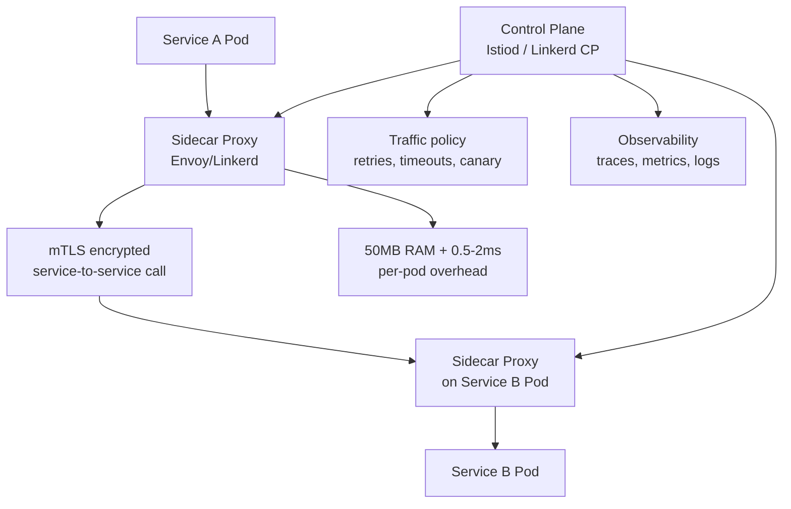
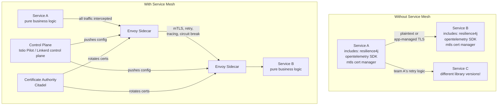
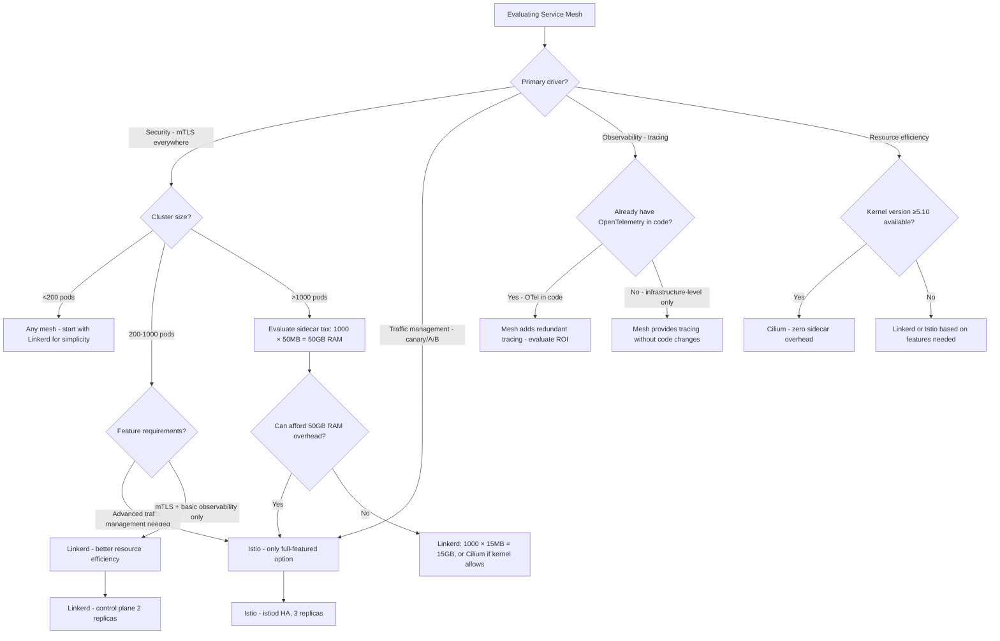

# Service Mesh: Istio, Linkerd, and the Sidecar Tax at Scale

## 🗺️ Quick Overview


*Normal path: service-to-service over plaintext HTTP. With mesh: sidecar proxies handle mTLS, retries, and tracing transparently — at the cost of 50MB RAM and 0.5-2ms p99 latency per pod.*

**A service mesh solves real problems: mutual TLS between every service pair without code changes, zero-config distributed tracing, traffic management for canary deployments without touching application code. But at 500 pods, the sidecar tax is 25 GB of RAM just for proxy processes. Every decision to adopt a service mesh must account for that math.**

---

## The Problem Class `[Mid]`

Without a service mesh, cross-cutting concerns in a microservices deployment require either:

1. **Library-based approach**: Every service imports the same resilience library (Resilience4j, Hystrix), the same tracing library (OpenTelemetry), the same auth library (service-to-service JWT validation). This couples every service to specific library versions. When you need to rotate TLS certificates, you redeploy every service.

2. **No implementation**: Services talk over plaintext HTTP. An attacker with network access can read service-to-service communication. There's no retries, no circuit breaking, no tracing.

The service mesh moves these concerns from application code to infrastructure — a proxy that handles all service-to-service communication.



**What the service mesh data plane provides** (per-request, transparently):
- mTLS: every service-to-service call is authenticated and encrypted
- Retries: configurable retry policy without application code changes
- Circuit breaking: upstream connection pool limits, ejection detection
- Load balancing: round-robin, least request, consistent hash
- Distributed tracing: trace headers injected and forwarded (requires application to propagate headers)
- Traffic management: canary, A/B, fault injection for chaos testing

---

## Why the Obvious Solution Fails `[Senior]`

**Why not just use library-based resilience everywhere?**

Library lock-in is the core problem. When Resilience4j releases a security fix, you need every team to update their dependency and redeploy. In an organization with 50 microservices across 15 teams, this takes weeks. The service mesh makes this a control-plane config update — no deployments needed.

The deeper problem: library-based approach doesn't solve mutual authentication. A compromised service can call any other service if there's no infrastructure-level authentication. mTLS with SPIFFE identity (service identity certificates, not user identity) is only practical at the infrastructure level.

**Why not terminate TLS at the API gateway only?**

East-west traffic (service-to-service) is not covered by the API gateway. If your database service is calling your cache service, that traffic bypasses the API gateway entirely. East-west traffic is often majority traffic in microservices architectures.

**Why not Kubernetes NetworkPolicy instead?**

NetworkPolicy provides L3/L4 isolation (IP/port filtering). Service mesh provides L7 policy (path-based routing, header-based auth, gRPC method-level policy). They're complementary — NetworkPolicy as baseline, service mesh for application-level policy.

---

## The Solution Landscape `[Senior]`

Three major service mesh implementations with different trade-offs: **Istio** (Google/IBM), **Linkerd** (Buoyant), and **Cilium Service Mesh** (eBPF-based, no sidecar).

---

### Solution 1: Istio with Envoy Sidecar

**What it is**

Istio is the most feature-complete service mesh. It uses Envoy (written in C++) as the data plane proxy, injected as a sidecar container into every pod. The control plane (istiod, formerly multiple components) manages certificate issuance, proxy configuration distribution, and telemetry collection.

**How it actually works at depth**

Sidecar injection via mutating webhook:
```yaml
# Namespace label triggers automatic sidecar injection
apiVersion: v1
kind: Namespace
metadata:
  name: production
  labels:
    istio-injection: enabled
```

When a pod starts in this namespace, Kubernetes calls the Istio mutating admission webhook, which injects the `istio-proxy` (Envoy) container and an `istio-init` container that configures iptables rules to redirect all traffic through Envoy.

The iptables redirect means your application binds to port 8080, Envoy listens on 15001 (outbound) and 15006 (inbound), and iptables intercepts all traffic to/from the pod's network namespace and redirects to Envoy. The application sees no change — it still connects to `http://inventory-service:8080` and Envoy handles mTLS transparently.

Traffic management example — canary release:
```yaml
# Route 10% of traffic to canary version
apiVersion: networking.istio.io/v1alpha3
kind: VirtualService
metadata:
  name: order-service
spec:
  http:
  - match:
    - headers:
        x-canary:
          exact: "true"
    route:
    - destination:
        host: order-service
        subset: canary
  - route:
    - destination:
        host: order-service
        subset: stable
      weight: 90
    - destination:
        host: order-service
        subset: canary
      weight: 10
```

**Sizing guidance** `[Staff+]`

**Sidecar resource consumption (Envoy):**
- Memory: ~50 MB base + ~5 MB per 1000 services in routing table
- At 200 services: ~50 MB + 1 MB = ~51 MB per sidecar
- At 500 pods × 51 MB = 25.5 GB RAM just for sidecar proxies
- CPU: ~0.1 vCPU idle, ~0.5 vCPU at 10K RPS per sidecar

**Latency overhead (Envoy p50/p99 added latency):**
- p50: 0.1-0.3ms (simple HTTP proxying)
- p99: 0.5-2ms (under load with mTLS)
- At 10 hops in a request chain: 10 × 2ms = 20ms added to P99 latency
- This is real and measurable — Lyft's public data shows ~1ms median added latency

**Control plane (istiod) sizing:**
- 1 istiod replica handles ~1000 pods
- Memory: ~500 MB per replica at 1000 pods (xDS config caching)
- CPU: ~1 vCPU under normal operation, spikes on config pushes
- High-availability: 3 replicas minimum

**Configuration decisions that matter** `[Staff+]`

- **mTLS mode (STRICT vs PERMISSIVE)**: PERMISSIVE allows plaintext and mTLS during migration. Move to STRICT once all services have sidecars. Never leave PERMISSIVE in production permanently — it defeats the security guarantee.
- **Telemetry sampling rate**: Full trace collection at 10K RPS generates ~10K spans/sec × ~500 bytes/span = 5 MB/sec of trace data. Use 1-5% sampling in production; 100% in development.
- **Resource limits on sidecar**: Set memory limits on istio-proxy containers. Envoy can leak memory under specific traffic patterns (long-lived connections, HTTP/2 streams). Set a limit and accept restarts.
- **Protocol detection**: Istio auto-detects HTTP/1.1, HTTP/2, gRPC. For proprietary protocols, explicitly set `appProtocol: tcp` to prevent incorrect protocol handling.

**Failure modes** `[Staff+]`

1. **istiod outage doesn't break traffic** — existing sidecars continue with cached config. New deployments can't get config updates, but in-flight traffic is unaffected. This is by design.

2. **Certificate rotation storms**: Istio rotates workload certificates every 24 hours (configurable). When thousands of sidecars simultaneously request new certs, istiod gets a certificate issuance spike. Spread rotation times with jitter: set `PILOT_CERT_TTL_DAYS` and `PILOT_CERT_GRACE_PERIOD_RATIO` to stagger renewals.

3. **iptables redirect race condition**: The istio-init container sets iptables rules before the application starts. If the application sends traffic before istio-proxy is ready, traffic fails. Mitigation: `holdApplicationUntilProxyStarts: true` in MeshConfig.

4. **Envoy OOM**: Envoy allocates memory for each upstream cluster, route, and listener. At 500+ services with complex routing rules, base memory can spike to 200MB+. Set memory requests aggressively and monitor `envoy_memory_heap_size_bytes`.

---

### Solution 2: Linkerd (Rust-based, lightweight)

**What it is**

Linkerd uses a Rust-based micro-proxy (linkerd2-proxy) instead of Envoy. The proxy is purpose-built for Kubernetes service mesh, resulting in significantly lower resource consumption. Linkerd trades some of Istio's feature breadth for simplicity and performance.

**How it actually works at depth**

Linkerd's proxy consumes ~10-20 MB per sidecar (vs Envoy's 50 MB). At 500 pods:
- Linkerd: 500 × 15 MB = 7.5 GB
- Istio/Envoy: 500 × 51 MB = 25.5 GB
- Savings: 18 GB — significant in cloud environments

Linkerd's feature set is narrower: mTLS, retries, circuit breaking, distributed tracing (via built-in Prometheus/Grafana integration). It doesn't support:
- Advanced traffic management (weighted routing, header-based routing) — use a separate ingress for this
- External authorization (use OPA or external auth separately)
- WebAssembly extensions (Envoy supports WASM plugins)

**Sizing guidance** `[Staff+]`

Use Linkerd when:
- Cluster has > 200 pods and memory is a constraint
- Team doesn't need advanced traffic management inside the cluster
- Simplicity of operation is a priority

Use Istio when:
- Need advanced traffic management (canary routing, A/B, fault injection)
- Need WASM-extensible proxy
- Organization has invested in Istio expertise

---

### Solution 3: Cilium Service Mesh (eBPF, no sidecar)

**What it is**

Cilium uses eBPF (extended Berkeley Packet Filter) — kernel-level programs that intercept and process network packets without a user-space proxy process. No sidecar injection needed; the eBPF programs run in the kernel.

**How it actually works at depth**

eBPF programs hook into the kernel networking stack directly. When a pod sends traffic, the eBPF program intercepts at the socket level, applies policy, injects tracing context, and forwards — all in kernel space without a context switch to user space.

Resource overhead per pod: near zero (kernel processes shared across all pods)
Latency overhead: < 0.1ms (kernel-level processing, no user-space hop)

**Trade-offs**: eBPF-based meshes don't have per-connection application layer visibility that Envoy provides. mTLS support requires kernel 5.10+ and relies on kernel TLS offloading. Not all cloud providers offer compatible kernel versions in managed offerings.

---

## Trade-off Matrix `[Senior]` → `[Staff+]`

| Dimension | Istio + Envoy | Linkerd | Cilium (eBPF) |
|---|---|---|---|
| **Sidecar memory per pod** | ~50 MB | ~15 MB | ~0 MB (kernel) |
| **Latency overhead p99** | 0.5-2 ms | 0.3-1 ms | < 0.1 ms |
| **mTLS support** | Full SPIFFE | Full SPIFFE | Kernel TLS (limited) |
| **Traffic management** | Advanced | Basic | Basic |
| **Observability** | Prometheus + Jaeger native | Prometheus + butin dashboard | Hubble (eBPF observability) |
| **Operational complexity** | High | Medium | High (kernel requirement) |
| **WASM extensions** | Yes (EnvoyFilter) | No | No |
| **Kernel version requirement** | Standard | Standard | Linux 5.10+ |
| **Control plane overhead** | ~500 MB (istiod) | ~150 MB | ~300 MB (cilium-operator) |

---

## Decision Framework `[Senior]` → `[Staff+]`



---

## Production Failure Story `[Staff+]`

**The mTLS PERMISSIVE Mode Incident — A Fintech Platform**

A financial services company adopted Istio for their Kubernetes cluster. During the rollout, they set PeerAuthentication to PERMISSIVE mode to allow services to communicate while sidecars were being rolled out incrementally.

The rollout took 4 months. After that, nobody changed the PeerAuthentication to STRICT. The mesh had been in PERMISSIVE mode for 18 months before a security audit flagged it.

During those 18 months, three services that had failed sidecar injection (due to Kubernetes version incompatibilities) were communicating in plaintext. The payment processing service was one of them — its sidecar had silently failed to inject due to a resource limit on the init container. Traffic to the payment processor was unencrypted within the cluster for 18 months.

**The failure was invisible** because PERMISSIVE mode is designed to not fail traffic. The security guarantee that motivated the service mesh adoption was never actually achieved.

**Fixes**:
1. Automated audit: continuously verify all pods have running istio-proxy containers
2. Set PeerAuthentication to STRICT in production within 2 weeks of starting rollout, accepting that un-injected services fail loudly
3. Monitor `istio_proxy_ready` metric per pod — alert if sidecar injection fails

---

## Observability Playbook `[Staff+]`

**Control plane health metrics** (istiod/Prometheus):
- `pilot_xds_push_time_ms` — how long it takes to push config to proxies; spike indicates config propagation lag
- `pilot_xds_connected_proxies` — number of connected sidecar proxies
- `citadel_server_csr_count` — certificate signing requests; spike indicates rotation storm

**Data plane health metrics** (Envoy/Prometheus):
- `envoy_cluster_upstream_rq_retry_total{cluster_name}` — retry rate per upstream
- `envoy_cluster_upstream_cx_connect_fail_total{cluster_name}` — connection failures
- `envoy_http_downstream_cx_active` — active downstream connections per pod

**Golden signals via service mesh** (automatically available):
- Request rate: `istio_requests_total`
- Error rate: `istio_requests_total{response_code=~"5.."}`
- Latency: `istio_request_duration_milliseconds`

Kiali (Istio's topology UI) visualizes these as a service graph — identify which service is the source of errors or latency without writing any queries.

---

## Architectural Evolution `[Staff+]`

**2026 perspective**:

**Ambient mesh** (Istio Ambient Mode, GA in late 2025) eliminates the sidecar entirely while keeping Envoy's feature set. It uses two components:
- ztunnel: a per-node lightweight proxy handling L4 mTLS (memory: ~30 MB per node, not per pod)
- waypoint proxy: a per-namespace Envoy deployment handling L7 policy only for services that need it

At 500 pods across 20 nodes: 20 × 30 MB = 600 MB for ztunnel (vs 25 GB for sidecars). Waypoint proxies exist only for namespaces with L7 policies. This changes the TCO calculation dramatically — ambient mesh is likely the dominant Istio deployment model for new clusters in 2026.

**Cilium + Gateway API**: The Kubernetes Gateway API (GA in Kubernetes 1.28) provides a standardized interface for traffic management that both Istio and Cilium implement. This enables mesh portability — write VirtualService-equivalent config once, run on either mesh.

**The multi-mesh question**: Large organizations with Kubernetes clusters across cloud providers are standardizing on Istio Multi-cluster with common control planes. The operational complexity is still significant — this is a staff engineer conversation, not a team decision.

---

## 🎯 Interview Questions

### Common Interview Questions on Service Mesh Architecture

#### Q1: When would you use a service mesh vs. a library-based approach for cross-cutting concerns?
**What interviewers look for**: Whether you understand the real trade-off — operational cost vs. code coupling. Neither is always correct; context determines the answer.

**Answer framework**:
1. Library-based (Resilience4j, OpenTelemetry SDK in every service): best when your team count is small (< 5 teams), services are homogeneous (all Java, all Node.js), and you can enforce library updates via shared internal modules. The advantage: no infrastructure to operate, no latency overhead, no kernel compatibility requirements
2. Service mesh: best when you have many teams (10+ microservices), polyglot services (Java + Go + Python), and security requirements (mTLS between every service pair) that can't be solved by library upgrades. The mesh makes mTLS and observability infrastructure concerns, not team concerns
3. The decisive factor: organizational scale. When rotating a TLS certificate requires deploying 50 services across 15 teams, the mesh's control-plane-only rotation becomes a massive operational advantage. When you have 3 services, the mesh's 50MB-per-pod overhead and control plane complexity is pure waste
4. Middle path: use OpenTelemetry SDK for application-level tracing (correlate business context) + service mesh for infrastructure-level mTLS and retries. They're complementary, not exclusive

**Key numbers to mention**: Sidecar tax: Istio/Envoy = 50MB RAM per pod. At 500 pods = 25GB RAM for proxies. Linkerd = 15MB per pod = 7.5GB at 500 pods. Latency overhead: Envoy p99 = 0.5-2ms per hop. At 10 hops in request chain = 20ms added to P99.

---

#### Q2: What is the resource overhead of Istio/Envoy sidecar proxies? How do you account for it in capacity planning?
**What interviewers look for**: Whether you've done the math and understand the budget implications. Candidates who haven't operated Istio often underestimate by an order of magnitude.

**Answer framework**:
1. Envoy sidecar memory: ~50MB base + ~5MB per 1000 services in routing table. At 200 services: ~51MB per sidecar
2. Fleet math: 500 pods × 51MB = 25.5GB RAM dedicated to proxy processes. This is not application memory — none of it serves your business logic. At ~$0.01/GB-hour for RAM in cloud: $2,555/month just for sidecars
3. CPU: ~0.1 vCPU idle, ~0.5 vCPU at 10K RPS per sidecar. Budget for extra vCPU headroom across the fleet
4. Latency: p50 adds 0.1-0.3ms per hop. p99 adds 0.5-2ms per hop. For a request chain with 10 service hops, add 5-20ms to your P99 SLO budget
5. Alternatives to reduce the tax: Linkerd (15MB/pod), Cilium ambient mesh (ztunnel: 30MB per node instead of per pod), Istio Ambient Mode (GA 2025): 20 nodes × 30MB = 600MB total vs 500 pods × 50MB = 25GB

**Key numbers to mention**: 50MB/pod (Istio), 15MB/pod (Linkerd), 30MB/node (Istio Ambient ztunnel). istiod control plane: ~500MB per replica at 1000 pods. Lyft's published data: ~1ms median added latency. At 1000 pods: Istio = 50GB RAM for sidecars.

---

#### Q3: How does mTLS work in a service mesh, and what can go wrong?
**What interviewers look for**: Security depth — not just "what is mTLS" but the operational failure modes that defeat the security guarantee.

**Answer framework**:
1. mTLS (mutual TLS): both client and server present certificates and verify each other. In service mesh, the sidecar handles the TLS handshake transparently. The application connects to `http://inventory-service:8080` and the sidecar upgrades to mTLS automatically. Identity is SPIFFE-based (workload identity via Kubernetes service account, not IP)
2. Certificate lifecycle: Istio's Citadel issues short-lived certs (24-hour default TTL). The sidecar auto-renews before expiry. This means certificate rotation happens without redeployment — a massive advantage over library-based cert management
3. The critical failure mode: PERMISSIVE mode. During rollout, services gradually get sidecars. PERMISSIVE allows both plaintext and mTLS. A real fintech incident: left PERMISSIVE for 18 months. Three services with failed sidecar injection ran plaintext. The payment processor was one of them — unencrypted within the cluster for 18 months, discovered only by security audit
4. Fix: automate PERMISSIVE → STRICT migration with a hard deadline. Monitor `istio_proxy_ready` per pod. Alert if sidecar injection fails. Set STRICT in production within 2 weeks of starting rollout — accept that un-injected services fail loudly rather than silently run plaintext

**Key numbers to mention**: Default cert TTL: 24 hours. Certificate rotation storm mitigation: stagger with `PILOT_CERT_TTL_DAYS` jitter. STRICT mode enforcement: 2-week deadline after rollout start. Monitor: `citadel_server_csr_count` for rotation storm detection.

---

#### Q4: How do you implement canary deployments using Istio VirtualService?
**What interviewers look for**: Practical traffic management knowledge — one of the most common use cases for service mesh beyond security.

**Answer framework**:
1. Define two subsets in DestinationRule: stable (v1 label) and canary (v2 label). VirtualService splits traffic by weight: 90% to stable, 10% to canary. All of this is sidecar config — no application code changes
2. Progression: update VirtualService weights via `kubectl apply` — takes effect in seconds without pod restarts. Canary goes from 10% → 25% → 50% → 100% by updating a YAML file
3. Header-based routing: route requests with `x-canary: true` header to canary version — enables internal team testing without affecting user traffic. Add this to the VirtualService match rules
4. Automated rollback integration: Argo Rollouts or Flagger read Prometheus metrics and automatically update VirtualService weights. If canary error rate exceeds threshold, weights revert to 100% stable automatically

**Key numbers to mention**: VirtualService weight update propagation: < 5 seconds across sidecar fleet. Statistical significance for 10% canary: need 10,000 requests at 10% before promotion. Argo Rollouts integration: metric check interval configurable down to 30 seconds.

---

#### Q5: Compare Istio, Linkerd, and Cilium. How do you choose?
**What interviewers look for**: Vendor-neutral analysis with a defensible decision framework, not just feature list recitation.

**Answer framework**:
1. Istio + Envoy: most feature-complete (advanced traffic management, WASM plugins, external auth). 50MB/pod. High operational complexity. Choose when: you need advanced traffic management (canary/A-B/fault injection), you're AWS/GCP native and want hosted Istio (GKE Anthos, AWS App Mesh)
2. Linkerd: lightweight Rust-based proxy, 15MB/pod. Simpler to operate. Narrower feature set (mTLS + retries + basic circuit break + tracing, no WASM). Choose when: cluster > 200 pods and memory is constrained, team prioritizes operational simplicity, you don't need advanced traffic management inside the cluster
3. Cilium: eBPF-based, no sidecar at all, near-zero per-pod overhead. Requires Linux kernel 5.10+. Basic L7 policy (not full Envoy feature parity). Choose when: kernel requirement is met, cost of sidecar RAM is prohibitive at scale, you want network policy + observability in one tool (Hubble)
4. Ambient mesh (Istio, GA 2025): ztunnel per node + waypoint per namespace. Eliminates per-pod sidecar. Likely the dominant Istio model for new clusters in 2026

**Key numbers to mention**: Memory: Istio 50MB/pod, Linkerd 15MB/pod, Cilium ~0MB/pod (kernel). Latency: Istio p99 0.5-2ms, Linkerd 0.3-1ms, Cilium < 0.1ms. istiod control plane: 500MB/replica at 1000 pods. Ambient mesh: 20 nodes × 30MB = 600MB vs 500 pods × 50MB = 25GB.

---

#### Q6: What happens if the Istio control plane (istiod) goes down? Does traffic break?
**What interviewers look for**: Understanding of the data plane / control plane separation — a key operational characteristic that many candidates don't know.

**Answer framework**:
1. Existing sidecars continue working with their cached configuration. All in-flight requests complete normally. Active mTLS connections continue — certificates are already provisioned. Retry policies, timeouts, circuit breakers all continue functioning from cached config
2. What fails: new pods cannot start receiving traffic (can't get initial proxy config), config updates don't propagate (new VirtualService rules won't apply), certificate renewals queue up (if istiod is down during cert expiry, sidecars fail to renew)
3. This is by design — data plane availability is decoupled from control plane availability. istiod going down is an operational inconvenience, not a production outage. This is why the sidecar model is safe for production despite the added complexity
4. HA configuration: 3 istiod replicas minimum. HPA to scale on CPU. `PodDisruptionBudget` to ensure at least 2 replicas survive node drains

**Key numbers to mention**: istiod default cert TTL: 24 hours. If istiod is down for > 24 hours, sidecars start to fail mTLS on cert expiry (though cert grace periods add buffer). istiod HA: 3 replicas, ~500MB each = ~1.5GB for control plane. `pilot_xds_connected_proxies` metric shows connected sidecar count.

---

#### Q7: How do you debug a service mesh when requests are failing?
**What interviewers look for**: Incident response methodology for mesh-layer failures, which are invisible to application logs.

**Answer framework**:
1. First: distinguish mesh failure from application failure. Check Kiali topology graph — it shows request rate, error rate, and latency per service pair automatically from mesh metrics. If the graph shows errors on the `service-A → service-B` edge, the mesh is telling you where
2. Check mTLS: `istioctl proxy-config listener <pod>` shows the sidecar's current mTLS config. If one service is in STRICT mode and calling a service with no sidecar, the call fails at TLS handshake — not an application error
3. Check VirtualService routing: `istioctl analyze` detects misconfigured VirtualService rules. A common error is a VirtualService that matches no DestinationRule subsets — traffic goes nowhere
4. Check Envoy access logs: enable `accessLogFile: /dev/stdout` in MeshConfig. Envoy logs every request with upstream response code, duration, and bytes. A `UPSTREAM_CONNECTION_FAILURE` log indicates the sidecar couldn't connect to upstream, even if application logs show no error
5. Check xDS config propagation: `istioctl proxy-status` shows if each sidecar has received the latest config from istiod. A sidecar with stale config may be routing to old destinations

**Key numbers to mention**: `istioctl proxy-config` commands work in < 1 second. Kiali auto-generates service graph from Prometheus metrics — no manual instrumentation. `pilot_xds_push_time_ms` p99 > 1s indicates istiod is struggling to push config at scale.

---

## 💡 Pseudocode Walkthrough

```pseudocode
// Service Mesh Request Flow — what actually happens for one HTTP call
// Application code: GET http://inventory-service:8080/stock/item-123

// 1. Application issues request (knows nothing about mesh)
app.httpGet("http://inventory-service:8080/stock/item-123")

// 2. iptables rules (set by istio-init) redirect outbound traffic to Envoy
//    App → iptables → localhost:15001 (Envoy outbound listener)

// 3. Envoy outbound processing:
envoy.onOutboundRequest(request):
  // Look up cluster config from istiod (via xDS)
  cluster = xdsConfig.lookupService("inventory-service")

  // Apply VirtualService routing rules
  if cluster.virtualService.canaryWeight > 0:
    destination = weightedRandom(cluster.stable, cluster.canary)
  else:
    destination = cluster.stable

  // Inject distributed trace headers
  request.headers["x-b3-traceid"] = propagate(currentSpan)

  // Perform mTLS handshake with destination sidecar
  tlsConn = mtls.connect(destination, cert=myCert, verifyPeer=true)

  // Apply retry policy if configured
  response = retry(
    fn = () -> tlsConn.send(request),
    maxAttempts = 3,
    retryOn = [503, 504]
  )

  // Apply circuit breaker check
  if circuitBreaker.isOpen("inventory-service"):
    return HTTP_503_CIRCUIT_OPEN

  return response

// 4. Traffic arrives at destination pod's Envoy (inbound)
//    iptables on destination redirects inbound to localhost:15006 (Envoy inbound)

// 5. Destination Envoy validates mTLS, checks AuthorizationPolicy
//    then forwards to application on localhost:8080

// Application on destination pod receives request on localhost:8080
// — sees no evidence of proxy involvement
```

---

## Decision Framework Checklist `[All Levels]`

- [ ] Calculated sidecar RAM overhead: pod_count × 50MB (Istio) or 15MB (Linkerd)
- [ ] Verified cluster kernel version supports chosen mesh (Cilium requires 5.10+)
- [ ] Defined mTLS migration plan: PERMISSIVE rollout → STRICT enforcement with timeline
- [ ] Automated verification that all pods have running sidecar proxy (not just that injection is enabled)
- [ ] Set PeerAuthentication to STRICT with hard deadline
- [ ] Configured istiod with 3 replicas for HA
- [ ] Set resource limits on istio-proxy containers (memory limit prevents OOM cascades)
- [ ] Configured telemetry sampling rate appropriate for production volume
- [ ] Kiali or equivalent topology dashboard configured and accessible to on-call team
- [ ] Certificate rotation timing configured to stagger across pod fleet
- [ ] Documented which services opted out of mesh and why (intentional gaps in mTLS)
- [ ] Load tested: measured actual latency overhead added by sidecar proxy for P99

## Next Steps

- **Deployment strategies using mesh**: Canary releases via Istio VirtualService → [Deployment Strategies](./deployment-strategies-deep-dive)
- **Bulkhead at infrastructure level**: Istio DestinationRule connection pool limits → [Bulkhead Pattern](./bulkhead-pattern)
- **Migration facade routing**: Service mesh as the strangler fig proxy layer → [Strangler Fig Migration](./strangler-fig-migration)
- **Saga observability**: How mesh tracing helps debug distributed sagas → [Saga Pattern Deep Dive](./saga-pattern-deep-dive)

*Written by Gaurav Porwal — 10+ Year Engineer | Tech Lead | Product Owner | Business-Minded Builder*
*Last updated: 2026-03-18*
