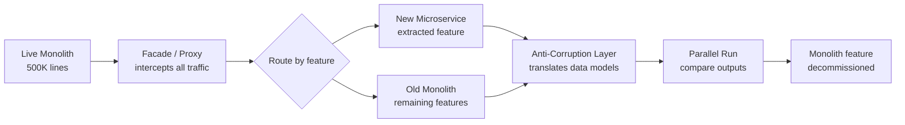
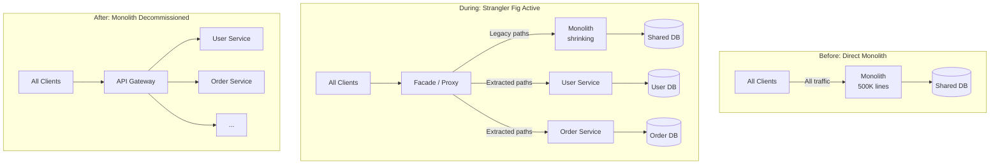
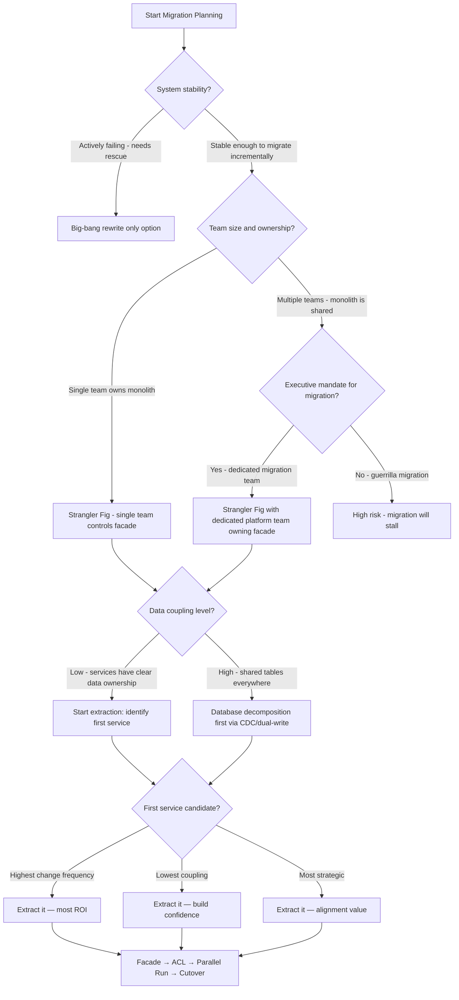

# Strangler Fig Migration: Incremental Monolith Decomposition Patterns

## 🗺️ Quick Overview


*Normal path: proxy routes to monolith. Trigger: feature extracted to microservice. Migration: traffic gradually shifts, monolith shrinks incrementally until safely retired.*

**Every system design discussion about microservices assumes you're starting fresh. You're not. You have a 500K-line Rails monolith handling $50M/day in transactions, and you need to decompose it without a single minute of planned downtime.**

**The Strangler Fig pattern is the only sane path. But "strangler fig" is not a plan — it's a philosophy. Here's the engineering.**

---

## The Problem Class `[Mid]`

Martin Fowler coined the term in 2004, inspired by the strangler fig tree: a vine that grows around a host tree, eventually replacing it entirely while the original trunk rots away. Applied to software: wrap the monolith with a facade, route new traffic to new microservices, gradually starve the monolith of work until it can be safely decommissioned.

The failure mode is attempting this naively:

```
Week 1: Extract User Service
Week 2: Monolith still has "user" code paths
Week 8: Two sources of truth for user data
Week 16: User Service and monolith disagree on email format
Week 24: Can't tell which is authoritative
Result: Worse than the monolith
```

The problem is not technical — it's architectural discipline. The strangler fig requires a proxy layer that can route traffic, an anti-corruption layer that prevents legacy concepts from leaking into new services, and a parallel-run strategy for validating correctness before cutting over.



---

## Why the Obvious Solution Fails `[Senior]`

**Why not a big-bang rewrite?**

The "Second System Effect" (Fred Brooks, 1975) applies here. You're simultaneously trying to:
1. Replicate all existing behavior (much of it undocumented)
2. Build new architecture
3. Keep the original system running during development
4. Validate correctness against a moving target

Netscape 6, Microsoft Longhorn, Fusion IO — large rewrites fail at an alarming rate. The monolith's behavior IS the specification, including all the bugs that customers have worked around.

**Why not extract by layer (horizontal slicing)?**

"Extract all persistence code first, then services, then APIs" doesn't map to business capabilities. You end up with a distributed monolith — all services deployed separately but all coupled to a shared database and each other's domain models.

**Why not extract the easiest service first?**

The easiest service to extract is usually the least business-critical. You'll have done six months of work, have one microservice in production, and made zero progress on the high-value but high-complexity core. Migration fatigue kills the project.

Extract by **business capability** (vertical slice), starting with capabilities that have:
- Clear ownership boundaries
- Well-defined APIs within the monolith
- Low coupling to other capabilities (measured by shared data models)
- High change frequency (most bang for isolation buck)

---

## The Solution Landscape `[Senior]`

Strangler Fig has four core mechanisms that must work together: **Facade/Proxy**, **Anti-Corruption Layer**, **Traffic Routing**, and **Parallel Run**.

---

### Solution 1: Facade / Proxy Interception

**What it is**

A reverse proxy or API gateway sits in front of the monolith and intercepts all traffic. Rules route requests to either the monolith or the new microservice based on path, headers, or feature flag.

**How it actually works at depth**

Start with NGINX or a purpose-built gateway (Kong, Envoy, AWS ALB with routing rules):

```nginx
# Nginx routing configuration - strangler fig in action
server {
    listen 443 ssl;

    # User service extracted - route to new service
    location /api/v1/users {
        proxy_pass http://user-service:8080;
    }

    # Order service extracted for specific plans only
    location /api/v1/orders {
        # Feature flag check via header
        if ($http_x_feature_new_orders = "true") {
            proxy_pass http://order-service:8080;
        }
        # Default to monolith
        proxy_pass http://monolith:3000;
    }

    # Everything else goes to monolith
    location / {
        proxy_pass http://monolith:3000;
    }
}
```

The facade must be stateless and highly available — it's now in the critical path for all traffic. Deploy minimum 3 replicas behind a load balancer.

**Sizing guidance** `[Staff+]`

Facade overhead per request: 0.3-0.8ms added latency (TCP connection to upstream + proxy processing). At 50K RPS through a single Nginx instance:
- CPU: ~2 vCPU for 50K RPS plain proxying
- Memory: ~150 MB resident (mostly connection state)
- Max throughput without SSL termination: ~100K RPS per Nginx worker process

For SSL termination at the facade layer, TLS handshake costs ~2ms (TLS 1.3 with session tickets: ~0.5ms for resumptions). Use session ticket reuse aggressively.

**Configuration decisions that matter** `[Staff+]`

- **Routing granularity**: Route by URL path prefix (coarse, fast) vs request body inspection (fine-grained, expensive). Never inspect request bodies in the routing layer — it breaks streaming and costs CPU.
- **Timeout alignment**: Set facade timeout > max downstream service timeout. A 30s facade timeout with a 60s service timeout causes facade to close the connection before the service responds.
- **Circuit breaker at facade**: If User Service is down, route `/api/v1/users` back to monolith (if monolith still has that code path). This is the escape hatch for early extraction failures.
- **Request/response logging**: Log which upstream handled each request with a `X-Handled-By: user-service|monolith` header. Critical for parallel run comparison.

**Failure modes** `[Staff+]`

1. **Facade becomes a new monolith**: Routing logic grows to include business logic (auth, rate limiting, request transformation). Keep the facade as routing-only; push all business logic to services.
2. **Configuration drift**: Nginx configs diverge across environments. Manage routing rules as code (Helm chart, Terraform) with the same deployment pipeline as services.
3. **Facade as SPOF**: If the facade has a deployment bug, all traffic fails. Blue-green deploy the facade itself; never do in-place updates.

---

### Solution 2: Anti-Corruption Layer (ACL)

**What it is**

A translation layer between the new microservice's domain model and the monolith's legacy domain model. Prevents the new service from being "corrupted" by the monolith's data shapes, naming conventions, and business logic.

**How it actually works at depth**

The monolith has a `users` table with columns shaped by 10 years of accretion:

```sql
-- Legacy monolith schema
CREATE TABLE users (
  usr_id        INTEGER,
  usr_email_1   VARCHAR(255),  -- "primary email"
  usr_email_2   VARCHAR(255),  -- "backup email"
  acct_status   CHAR(1),       -- 'A'=active, 'S'=suspended, 'D'=deleted
  cust_tier     INTEGER,       -- 1=free, 2=pro, 3=enterprise (undocumented)
  created_dt    INTEGER        -- Unix timestamp, not TIMESTAMPTZ
);
```

Your new User Service has a clean domain model:

```typescript
// New service domain model
interface User {
  id: string;          // UUID, not integer
  email: string;       // single canonical email
  status: 'active' | 'suspended' | 'deleted';
  plan: 'free' | 'pro' | 'enterprise';
  createdAt: Date;
}
```

The ACL translates between them:

```typescript
class UserAntiCorruptionLayer {
  // Monolith → New Service
  fromLegacy(legacyUser: LegacyUser): User {
    return {
      id: this.idMapping.get(legacyUser.usr_id) ?? uuidv4(),
      email: legacyUser.usr_email_1,  // canonical choice
      status: this.mapStatus(legacyUser.acct_status),
      plan: this.mapPlan(legacyUser.cust_tier),
      createdAt: new Date(legacyUser.created_dt * 1000),
    };
  }

  // New Service → Monolith (for dual-write period)
  toLegacy(user: User): Partial<LegacyUser> {
    return {
      usr_id: this.idMapping.getReverse(user.id),
      usr_email_1: user.email,
      acct_status: this.reverseMapStatus(user.status),
      cust_tier: this.reverseMapPlan(user.plan),
    };
  }

  private mapStatus(code: string): User['status'] {
    const map = { 'A': 'active', 'S': 'suspended', 'D': 'deleted' };
    return map[code] ?? 'active';
  }
}
```

**Sizing guidance** `[Staff+]`

ACL transformation cost is typically CPU-bound: simple field mapping at 1M records/sec per core is realistic. The expensive operations are:
- ID mapping table lookups (cache in Redis, ~0.1ms per lookup)
- Schema validation (JSON Schema validation: ~0.5ms per record)
- Dual-write synchronization (see below)

During dual-write, every write to User Service also writes back to monolith through the ACL. At 1K writes/sec sustained:
- ACL translation: < 1ms
- Monolith write (DB call): 5-20ms
- Total dual-write latency addition: 5-20ms on write path

If the monolith write fails during dual-write, what is correct behavior? This is a policy decision: accept the write (eventual sync) or reject it (strong consistency). Most teams accept the write and sync asynchronously via CDC.

---

### Solution 3: Parallel Run Strategy

**What it is**

Route the same request to both monolith and new service simultaneously. Compare responses. Use one as authoritative (usually monolith during validation). Flag discrepancies. Only cut over when discrepancy rate drops below threshold.

**How it actually works at depth**

```typescript
class ParallelRunMiddleware {
  async handleRequest(req: Request): Promise<Response> {
    // Fire both requests concurrently
    const [legacyResult, newResult] = await Promise.allSettled([
      this.monolithClient.call(req),
      this.newServiceClient.call(req),
    ]);

    const primary = legacyResult;  // monolith is authoritative during validation

    // Async comparison — don't add to response latency
    setImmediate(() => {
      this.compareAndLog(req, legacyResult, newResult);
    });

    return primary.status === 'fulfilled'
      ? primary.value
      : this.handleError(legacyResult.reason);
  }

  private compareAndLog(req, legacy, newSvc) {
    const discrepancy = this.differ.compare(legacy.value, newSvc.value);
    if (discrepancy) {
      metrics.increment('parallel_run.discrepancy', {
        endpoint: req.path,
        field: discrepancy.field,
      });
      logger.warn('parallel_run_mismatch', { req_id: req.id, discrepancy });
    } else {
      metrics.increment('parallel_run.match', { endpoint: req.path });
    }
  }
}
```

**Sizing guidance** `[Staff+]`

Parallel run doubles the load on downstream services. Budget for:
- 2x upstream calls per request during parallel run period
- New service sized for full production traffic (not just test traffic)
- Comparison logging: ~500 bytes per comparison × RPS × duration — budget storage

Shadow traffic (fire-and-forget to new service, don't include in response): lower fidelity but half the latency impact. Use shadow traffic for initial validation, full parallel run for pre-cutover confidence.

---

## Trade-off Matrix `[Senior]` → `[Staff+]`

| Dimension | Big-Bang Rewrite | Strangler Fig |
|---|---|---|
| **Risk** | Maximum — one large cutover | Minimal — incremental cutovers |
| **Time to first value** | 12-18 months | 4-8 weeks (first service) |
| **Operational complexity** | Low during dev, high at cutover | Medium throughout |
| **Dual-write period cost** | None | CPU + DB write amplification |
| **Rollback capability** | "Rollback" = restart rewrite | Per-service rollback in minutes |
| **Staff morale impact** | High burnout risk | Iterative wins |
| **Data consistency** | Clean cutover | Complex sync during migration |
| **Timeline predictability** | Unpredictable | Predictable per-service |

| Dimension | Facade-Only | Facade + ACL |
|---|---|---|
| **Legacy model leak** | High — new service sees legacy shapes | None — ACL translates |
| **Migration correctness** | Fragile | Verifiable via parallel run |
| **Complexity** | Lower | Higher (ACL must be maintained) |
| **Long-term maintainability** | Technical debt accumulates | Clean domain model from day 1 |

---

## Decision Framework `[Senior]` → `[Staff+]`



---

## Production Failure Story `[Staff+]`

**The ACL That Wasn't — A Payments Migration**

A fintech company extracted their Transaction Service from a monolith using a proxy facade. They skipped the ACL, reasoning "we'll clean up the domain model later." The new Transaction Service accepted the legacy monolith's `amount` as an integer (cents in USD).

Six months later, they needed to support GBP. The monolith used integers for GBP too (pence). The new Transaction Service had no currency concept — it just stored integers and assumed USD.

Adding multi-currency support required a schema migration on the Transaction Service that was now in production with 50M records, plus a backfill to add currency codes to all historical records. The backfill took 3 weeks and required a maintenance window for the schema change — exactly the kind of migration risk they were trying to escape.

**The ACL would have forced this conversation on day one.** When translating `amount: 1099` from the monolith, the ACL developer would have needed to decide the domain model representation — `{ amount: 10.99, currency: 'USD' }` — and documented the decision. The technical debt was created by skipping the ACL, not by moving too fast.

---

## Observability Playbook `[Staff+]`

**Migration health metrics**:

- `traffic_ratio{handler="monolith|service"}` — percentage of traffic handled by each side. This is your migration progress metric.
- `parallel_run_discrepancy_rate{endpoint}` — discrepancy percentage per endpoint. Threshold to cut over: < 0.1% discrepancy for 7 consecutive days.
- `dual_write_lag_seconds` — how far behind is the secondary write. Should be < 1 second.
- `acl_translation_error_total` — ACL translation failures indicate schema or business logic divergence.

**Operational runbook triggers**:
- Discrepancy rate > 5%: halt cutover, investigate root cause
- Dual-write lag > 30 seconds: route all writes back to monolith, page on-call
- New service error rate > monolith error rate: route all traffic back to monolith

---

## Architectural Evolution `[Staff+]`

**2026 perspective on tooling**:

- **Feature flag platforms** (LaunchDarkly, Flagsmith, Unleash) are now the routing layer of choice for strangler fig migrations. Instead of NGINX routing rules, feature flags control which service handles which request — with user-segment targeting (beta users get new service), percentage rollouts, and instant kill switches. This gives product and operations teams control over migration pace without deploying new proxy configs.

- **CDC-based dual-write** (Debezium → Kafka → new service consumer) has replaced application-level dual-write for most migrations. The monolith writes to its DB; Debezium captures changes from WAL; the new service consumes and applies. This eliminates write amplification in the application tier and provides a natural catch-up mechanism after new service downtime.

- **Service mesh migration support**: Istio's traffic management (VirtualService, DestinationRule) handles facade routing natively in Kubernetes environments. Weighted routing between monolith and new service, header-based routing for internal testing, and automatic retries are all available without a separate proxy tier.

- **AI-assisted migration**: In 2025-2026, tools like Grit.io and Moderne use AI to suggest extraction candidates based on change frequency analysis and dependency graphs, reducing the upfront planning effort from weeks to hours.

The strangler fig migration itself is not changing — but the tooling making the proxy/routing/dual-write layers easier to implement continues to mature.

---

## 🎯 Interview Questions

### Common Interview Questions on Strangler Fig Migration

#### Q1: How would you migrate a monolith to microservices without downtime?
**What interviewers look for**: A concrete migration plan with rollback capability at each step. "Big-bang rewrite" is immediately disqualifying. They want incremental, reversible steps.

**Answer framework**:
1. Phase 1 — Facade first: deploy a reverse proxy (Nginx, Envoy, AWS ALB) in front of the monolith before writing any new service code. All traffic routes through the facade to the monolith. Zero behavior change, but now you have a routing layer
2. Phase 2 — Extract one service: choose the first service by business capability (not technical layer). Extract it, build the Anti-Corruption Layer to translate domain models, deploy it. Configure the facade to route that service's traffic to the new service; everything else still goes to the monolith
3. Phase 3 — Parallel run: for 7 days, run both monolith and new service for the extracted feature. Compare responses. Discrepancy rate < 0.1% for 7 consecutive days = ready to cut over
4. Phase 4 — Repeat: one service at a time. The monolith shrinks. When all features are extracted, decommission the monolith
5. Rollback at any point: update one routing rule in the facade. Takes 5 seconds, not a redeployment

**Key numbers to mention**: Facade overhead: 0.3-0.8ms added latency per request. Parallel run doubles load on extracted service — size it for full production traffic. Discrepancy threshold: < 0.1% over 7 days before cutover. Never delete monolith code paths until dual-write period ends.

---

#### Q2: What is the strangler fig pattern and when would you use it?
**What interviewers look for**: Whether you know the "why" — when it's appropriate vs when it's overkill vs when you'd choose something else.

**Answer framework**:
1. Named for the strangler fig tree that grows around a host tree, eventually replacing it. Applied to software: wrap the existing system with a facade, route new functionality to new services, gradually starve the old system of work until it can be safely decommissioned
2. Use it when: you have a stable-but-hard-to-change monolith in production, the monolith handles significant revenue (you cannot take downtime), and you need to extract specific capabilities to allow independent scaling or team autonomy
3. Do not use it when: the monolith is actively failing (use targeted hot-fixes first), when the system is small enough to rewrite safely (< 6 months, single team), or when the monolith's behavior is so undocumented that parallel-run comparison is meaningless
4. The pattern requires three components working together: Facade/Proxy (routing), Anti-Corruption Layer (domain model translation), Parallel Run (correctness validation). Skip any of these and the migration will produce a distributed monolith or data inconsistency

**Key numbers to mention**: Big-bang rewrite failure rate is high (Netscape 6, Longhorn). First service extraction: 4-8 weeks to production value. Full monolith decomposition for a 500K-line codebase: 18-36 months realistic estimate.

---

#### Q3: What is an Anti-Corruption Layer and why is it critical during migration?
**What interviewers look for**: Understanding that domain model purity matters and that skipping the ACL creates hidden technical debt.

**Answer framework**:
1. The ACL is a translation layer between the new microservice's clean domain model and the monolith's legacy data shapes. It prevents the monolith's naming conventions, encoding choices, and business logic quirks from "corrupting" the new service
2. Real example: monolith stores `acct_status` as `CHAR(1)` with values `A/S/D`, `cust_tier` as integer `1/2/3`, `created_dt` as Unix integer. The new User Service should speak `status: 'active'|'suspended'|'deleted'`, `plan: 'free'|'pro'|'enterprise'`, `createdAt: Date`. The ACL translates between these
3. The hidden cost of skipping it: a fintech skipped ACL and stored amounts as integers (cents). Six months later, they needed GBP support — the new service had no currency concept. A 3-week backfill of 50M records plus a maintenance-window schema migration. The ACL would have forced the domain model decision on day one
4. ACL must translate in both directions during dual-write: new service → ACL → monolith DB (for writes), monolith DB → ACL → new service (for reads/migrations)

**Key numbers to mention**: ACL translation cost: < 1ms per record for field mapping. ID mapping table lookups: ~0.1ms with Redis cache. Dual-write latency addition: 5-20ms on write path (monolith write). ACL translation test coverage should exceed 90% including legacy data edge cases.

---

#### Q4: How do you handle data migration during a strangler fig?
**What interviewers look for**: The hardest part of any migration — data ownership, dual-write consistency, and when to cut over data.

**Answer framework**:
1. Dual-write period: while both monolith and new service are live, all writes must go to both. Options: application-level dual-write (write to both in code, accept 5-20ms overhead) or CDC-based (monolith writes to its DB, Debezium captures WAL changes, Kafka topic → new service consumer applies them). CDC is preferred — it eliminates write amplification in the application tier
2. The data ownership cutover is the hardest step. Before cutover: monolith is authoritative. During parallel run: both should agree. After cutover: new service is authoritative, monolith reads from new service's API or its own now-stale copy
3. Exit criteria for dual-write: discrepancy rate < 0.1% for 7 consecutive days. Monitor `dual_write_lag_seconds` — should be < 1 second. If dual-write lag > 30 seconds, route all writes back to monolith and page on-call
4. Data that can't easily be dual-written (large blobs, event logs): snapshot-and-backfill. Stop writes briefly (< 5 minutes), snapshot the data, load into new service, resume with CDC

**Key numbers to mention**: CDC replication lag (Debezium → Kafka): typically 100-500ms. Parallel run discrepancy threshold: < 0.1% for 7 days before cutover. Dual-write lag alert: > 30 seconds = route back to monolith. Full data migration for 500M records: plan for 1-3 weeks with live CDC catchup.

---

#### Q5: How do you choose which service to extract first?
**What interviewers look for**: Strategic thinking about migration sequencing — not just technical feasibility but business value and risk management.

**Answer framework**:
1. Not the easiest service: extracting the simplest, least-used service first gives you migration experience but zero business value. After 6 months, you have one microservice and no progress on the high-value core. Migration fatigue kills the project
2. Not the most complex service: extracting the most coupled, most critical service first maximizes risk. A partial extraction leaves two sources of truth for the most important data
3. Right criteria: (a) highest change frequency — most developer pain, most ROI from extraction; (b) clear data ownership — no tables shared with other capabilities; (c) well-defined internal API in the monolith — less ACL surface area; (d) manageable coupling — few other services depend on it
4. Practical tool: generate a coupling heatmap from git history (which files change together) and a dependency graph (which modules call each other). The service with high change frequency and low coupling is the ideal first extraction

**Key numbers to mention**: Ideal first service: < 20% of monolith's code, < 5 shared data tables with other services, > 30% of recent change commits. Use `git log --stat | grep filename` to find highest-churn modules programmatically.

---

#### Q6: What is parallel run and when do you stop it?
**What interviewers look for**: Understanding of shadow testing as a validation gate, and concrete criteria for what "good enough" looks like.

**Answer framework**:
1. Parallel run sends the same request to both monolith and new service concurrently. One is authoritative (monolith during validation). Responses are compared asynchronously without adding to response latency. Discrepancies are logged with the specific field that diverged
2. This reveals: domain model translation bugs in the ACL, business logic gaps (the monolith has 10 years of edge case handling the new service missed), data migration gaps (historical records that didn't convert correctly)
3. Stop criteria: discrepancy rate < 0.1% for 7 consecutive days AND all remaining discrepancies are known, accepted, and documented (e.g., "monolith returns deprecated field X that new service intentionally omits"). No open unknowns
4. Double the load cost: parallel run doubles upstream calls. Size the new service for full production traffic before starting parallel run. Use shadow traffic (fire-and-forget, don't block response) for initial validation; full synchronous parallel run only for final pre-cutover confidence

**Key numbers to mention**: Shadow traffic overhead: doubles downstream calls. Comparison log storage: ~500 bytes per comparison × RPS × 7 days. Discrepancy threshold: 0.1% over 7 days. Typical parallel run duration: 2-4 weeks for a well-specified service, longer for services with complex business logic.

---

#### Q7: How do you handle rollback if the new microservice has a critical bug after cutover?
**What interviewers look for**: Whether you've pre-planned rollback as a first-class concern, not an afterthought.

**Answer framework**:
1. Rollback is a routing rule change: update the facade config to route traffic back to the monolith. With Nginx/Envoy/ALB, this takes 5 seconds. The monolith's code path must still exist — never delete it until you've confirmed the new service is stable for 30+ days
2. During dual-write period, monolith data is still current — routing back is completely safe. After ending dual-write (monolith data is stale), rollback requires re-enabling CDC or dual-write to resync the monolith before routing traffic back
3. Test rollback in staging before cutover: the rollback that has never been tested will fail in production at 2 AM. Run a full rollback drill, verify data consistency, document the runbook with exact commands
4. Mark monolith code paths with deprecation annotations (not deleted): `// DEPRECATED: routing to user-service, delete after 2026-06-01`. This makes it easy to find and eventually remove, while keeping it available for rollback

**Key numbers to mention**: Rollback time with facade routing: < 5 seconds. Monolith code retention after cutover: minimum 30 days, ideally 90 days. Dual-write data lag after routing back: 0 (data was never deleted from monolith during dual-write period).

---

## 💡 Pseudocode Walkthrough

```pseudocode
// Strangler Fig — Progressive Traffic Migration
// Facade routes traffic based on extraction state

ROUTING_TABLE = {
  "/api/v1/users":  { handler: "user-service",  state: EXTRACTED },
  "/api/v1/orders": { handler: "monolith",       state: PARALLEL_RUN, pct: 100 },
  "/api/v1/products":{ handler: "monolith",      state: PENDING },
  // default: all other paths → monolith
}

function routeRequest(request):
  path = request.path
  config = ROUTING_TABLE[path] ?? { handler: "monolith", state: PENDING }

  if config.state == EXTRACTED:
    return forwardTo(config.handler, request)

  if config.state == PARALLEL_RUN:
    // Run both, compare, return authoritative (monolith)
    [legacyResp, newResp] = await parallel(
      monolith.call(request),
      newService.call(request)
    )
    compareAndLog(request, legacyResp, newResp)  // async, non-blocking
    return legacyResp  // monolith is authoritative during parallel run

  // PENDING or default: everything goes to monolith
  return forwardTo("monolith", request)

// Anti-Corruption Layer translation
function translateUserFromLegacy(legacyUser):
  return {
    id:        idMapping.getOrCreate(legacyUser.usr_id),
    email:     legacyUser.usr_email_1,
    status:    { 'A': 'active', 'S': 'suspended', 'D': 'deleted' }[legacyUser.acct_status],
    plan:      { 1: 'free', 2: 'pro', 3: 'enterprise' }[legacyUser.cust_tier],
    createdAt: new Date(legacyUser.created_dt * 1000)  // Unix → ISO timestamp
  }

// Cutover decision: when parallel_run discrepancy_rate < 0.1% for 7 days
// Update ROUTING_TABLE state: PARALLEL_RUN → EXTRACTED
// Monitor for 30 days before deleting monolith code path
```

---

## Decision Framework Checklist `[All Levels]`

- [ ] Identified first extraction candidate based on business capability boundary (not technical layer)
- [ ] Mapped all data owned by target service — no shared tables remain after extraction
- [ ] Designed Anti-Corruption Layer before writing any service code
- [ ] Facade is deployed and routing some traffic before service code is complete
- [ ] Parallel run configured — discrepancy logging operational before cutover
- [ ] Dual-write period defined with exit criteria (e.g., 7 days clean parallel run)
- [ ] Rollback plan per service: routing rule to revert to monolith tested and documented
- [ ] Feature flags or routing rules managed as code, deployed via CI/CD
- [ ] Monolith's code path for extracted capability marked with deprecation comment (not deleted yet)
- [ ] Migration health dashboard live: traffic ratio, discrepancy rate, dual-write lag
- [ ] Team agreement on when monolith code path is deleted (after dual-write period)
- [ ] ACL translation tests have >90% coverage including edge cases from legacy data analysis

## Next Steps

- **Interview Prep**: Practice monolith migration questions → [Monolith to Microservices Interview Q&A](/12-interview-prep/system-design/scale-and-reliability/monolith-to-microservices)
- **Data Layer**: How CDC (Debezium) enables dual-write for migrations → [Change Data Capture](/10-architecture/concepts/change-data-capture)
- **Traffic Routing**: Service mesh VirtualService handles facade routing natively → [Service Mesh Architecture](./service-mesh-architecture)
- **Deployment Safety**: Blue-green and canary strategies complement the migration facade → [Deployment Strategies](./deployment-strategies-deep-dive)
- **Resilience During Migration**: Protect new services with bulkheads while they mature → [Bulkhead Pattern](./bulkhead-pattern)

*Written by Gaurav Porwal — 10+ Year Engineer | Tech Lead | Product Owner | Business-Minded Builder*
*Last updated: 2026-03-18*
