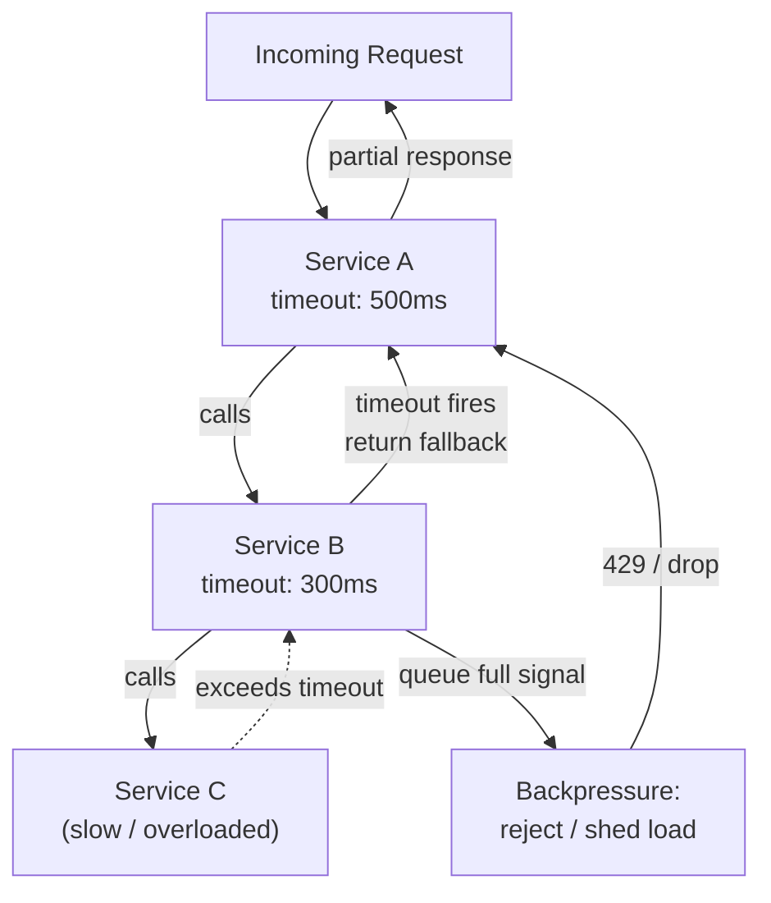
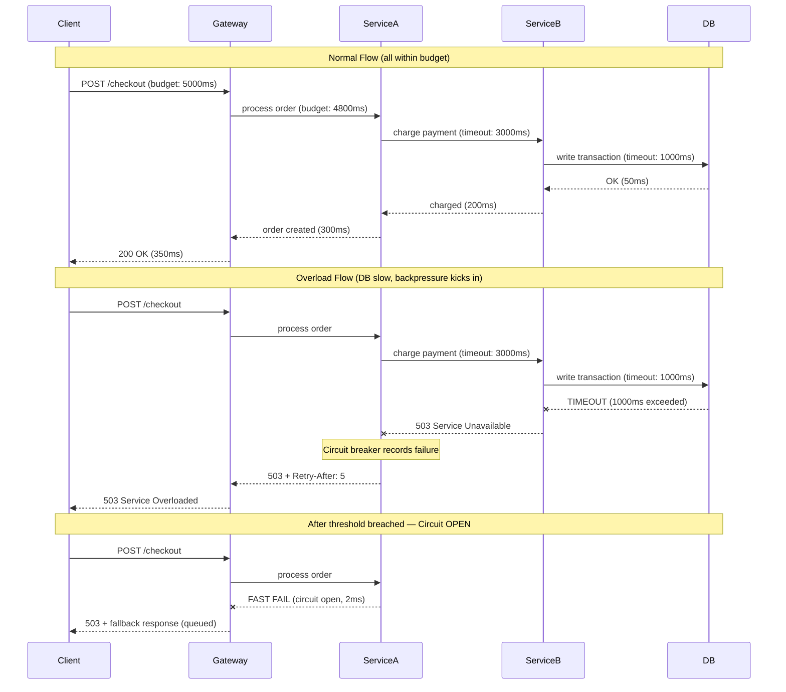

# Timeouts & Backpressure - Fail Fast, Protect Your System

> **Reading Time:** 18 minutes
> **Difficulty:** 🟡 Intermediate
> **Impact:** Prevent cascading failures, maintain system stability under load

## 🗺️ Quick Overview



*Timeouts ensure a slow downstream service never holds threads indefinitely; backpressure signals prevent upstream callers from overwhelming an already-struggling service — together they stop one slow component from cascading into a full outage.*

## The Amazon Problem: Every 100ms Costs 1% Sales

**How slow dependencies destroy your entire system:**

```
Scenario: E-commerce checkout without proper timeouts

Normal flow (200ms total):
├── Auth service: 20ms
├── Inventory service: 50ms
├── Payment service: 80ms
├── Order service: 50ms
└── Customer: Happy ✅

When payment service is slow (no timeout):
├── Auth service: 20ms
├── Inventory service: 50ms
├── Payment service: 30,000ms (30 seconds!) ← stuck
├── Order service: never reached
├── Thread: blocked for 30 seconds
├── Thread pool: exhausted in 2 minutes
├── All requests: timing out
└── Customer: "Site is down!" ❌

Impact:
├── 100% of requests affected (not just payment)
├── Cascading failure to all services
└── $6.6M/hour revenue loss (Amazon scale)
```

**The lesson:** A single slow dependency without timeouts can take down your entire system.

---

## The Problem: Slow Is Worse Than Down

### Why Slow Services Are Dangerous

```
Dead service:
├── Fails immediately
├── Connection refused in <100ms
├── Circuit breaker trips fast
└── System recovers quickly

Slow service:
├── Holds connections open
├── Exhausts thread pools
├── Backs up request queues
├── Cascades to calling services
└── Takes down entire system
```

### The Domino Effect

```
┌─────────┐     ┌─────────┐     ┌─────────┐     ┌─────────┐
│  User   │────►│ Gateway │────►│ Service │────►│Database │
└─────────┘     └─────────┘     └─────────┘     └─────────┘
                     │               │               │
                     │               │          [SLOW!]
                     │               │               │
                     │          [Waiting...]         │
                     │               │               │
                [Backing up...]      │               │
                     │               │               │
               [Exhausted!]          │               │

Timeline:
T=0:     Database becomes slow (100ms → 30,000ms)
T=1m:    Service A thread pool exhausted
T=2m:    Gateway thread pool exhausted
T=3m:    All user requests failing
T=5m:    Cascaded to Services B, C, D (they call A)
T=10m:   Complete system outage
```

---

## Timeout Strategies

### 1. Connection Timeout

```javascript
// Time to establish TCP connection
const http = require('http');

const options = {
  hostname: 'api.example.com',
  port: 80,
  path: '/users',
  method: 'GET',
  timeout: 3000  // Connection timeout: 3 seconds
};

const req = http.request(options, (res) => {
  // Handle response
});

req.on('timeout', () => {
  req.destroy();
  console.error('Connection timeout');
});

req.on('error', (error) => {
  console.error('Request failed:', error.message);
});

req.end();
```

### 2. Read/Socket Timeout

```javascript
// Time to receive data after connection established
const axios = require('axios');

const client = axios.create({
  timeout: 5000,  // Total timeout for request

  // Or more granular:
  // connectTimeout: 3000,  // Time to establish connection
  // socketTimeout: 10000   // Time waiting for response
});

async function fetchUser(userId) {
  try {
    const response = await client.get(`/users/${userId}`);
    return response.data;
  } catch (error) {
    if (error.code === 'ECONNABORTED') {
      console.error('Request timed out');
    }
    throw error;
  }
}
```

### 3. Request Timeout with Deadline Propagation

```javascript
// Propagate remaining time budget through service calls
class DeadlineContext {
  constructor(timeoutMs) {
    this.deadline = Date.now() + timeoutMs;
  }

  remaining() {
    return Math.max(0, this.deadline - Date.now());
  }

  isExpired() {
    return Date.now() >= this.deadline;
  }

  childContext(bufferMs = 100) {
    // Child gets remaining time minus buffer for overhead
    return new DeadlineContext(this.remaining() - bufferMs);
  }
}

// Usage in service chain
async function handleRequest(req, res) {
  // Start with 5 second budget
  const ctx = new DeadlineContext(5000);

  // Each service call uses remaining time
  const user = await userService.get(userId, { timeout: ctx.remaining() });

  if (ctx.isExpired()) {
    return res.status(504).json({ error: 'Request timeout' });
  }

  const orders = await orderService.list(userId, { timeout: ctx.remaining() });

  if (ctx.isExpired()) {
    return res.status(504).json({ error: 'Request timeout' });
  }

  res.json({ user, orders });
}
```

### 4. Timeout with Fallback

```javascript
async function withTimeout(promise, timeoutMs, fallback) {
  let timeoutId;

  const timeoutPromise = new Promise((_, reject) => {
    timeoutId = setTimeout(() => {
      reject(new Error(`Timeout after ${timeoutMs}ms`));
    }, timeoutMs);
  });

  try {
    const result = await Promise.race([promise, timeoutPromise]);
    clearTimeout(timeoutId);
    return result;
  } catch (error) {
    clearTimeout(timeoutId);

    if (error.message.includes('Timeout')) {
      // Return fallback value instead of failing
      console.warn('Using fallback due to timeout');
      return typeof fallback === 'function' ? fallback() : fallback;
    }

    throw error;
  }
}

// Usage
const recommendations = await withTimeout(
  recommendationService.getForUser(userId),
  2000,  // 2 second timeout
  []     // Fallback to empty array
);
```

---

## Backpressure Strategies

### What Is Backpressure?

```
Without backpressure:
Producer: 1000 msg/sec ───────► Consumer: 100 msg/sec
                                     │
                              [Queue growing!]
                                     │
                              [Memory exhausted]
                                     │
                              [System crash!]

With backpressure:
Producer: 1000 msg/sec ───────► Consumer: 100 msg/sec
         │                           │
         │◄── "Slow down!" ──────────│
         │                           │
Producer: 100 msg/sec ────────► Consumer: 100 msg/sec
         │                           │
    [System stable]            [Processing normally]
```

### Strategy 1: Bounded Queues

```javascript
class BoundedQueue {
  constructor(maxSize) {
    this.queue = [];
    this.maxSize = maxSize;
  }

  async enqueue(item) {
    if (this.queue.length >= this.maxSize) {
      // Option 1: Reject
      throw new Error('Queue full');

      // Option 2: Block until space available
      // await this.waitForSpace();

      // Option 3: Drop oldest
      // this.queue.shift();
    }

    this.queue.push(item);
  }

  dequeue() {
    return this.queue.shift();
  }

  isFull() {
    return this.queue.length >= this.maxSize;
  }
}

// Usage with rejection
async function handleRequest(req, res) {
  try {
    await requestQueue.enqueue(req);
    res.status(202).json({ message: 'Accepted' });
  } catch (error) {
    // Backpressure: tell client to slow down
    res.status(503).json({
      error: 'Service overloaded',
      retryAfter: 5
    });
  }
}
```

### Strategy 2: Rate Limiting with Token Bucket

```javascript
class TokenBucket {
  constructor(capacity, refillRate) {
    this.capacity = capacity;
    this.tokens = capacity;
    this.refillRate = refillRate;  // tokens per second
    this.lastRefill = Date.now();
  }

  tryConsume(tokens = 1) {
    this.refill();

    if (this.tokens >= tokens) {
      this.tokens -= tokens;
      return { allowed: true, remaining: this.tokens };
    }

    const waitTime = ((tokens - this.tokens) / this.refillRate) * 1000;
    return { allowed: false, retryAfter: waitTime };
  }

  refill() {
    const now = Date.now();
    const elapsed = (now - this.lastRefill) / 1000;
    this.tokens = Math.min(this.capacity, this.tokens + elapsed * this.refillRate);
    this.lastRefill = now;
  }
}

// Middleware
function backpressureMiddleware(bucket) {
  return (req, res, next) => {
    const result = bucket.tryConsume();

    if (!result.allowed) {
      res.status(429)
        .set('Retry-After', Math.ceil(result.retryAfter / 1000))
        .json({ error: 'Rate limited', retryAfter: result.retryAfter });
      return;
    }

    next();
  };
}
```

### Strategy 3: Load Shedding

```javascript
class LoadShedder {
  constructor(options = {}) {
    this.maxConcurrent = options.maxConcurrent || 100;
    this.maxQueueSize = options.maxQueueSize || 500;
    this.current = 0;
    this.queued = 0;
  }

  async execute(fn, priority = 'normal') {
    // High priority never shed
    if (priority !== 'high' && this.shouldShed()) {
      throw new LoadSheddingError('System overloaded');
    }

    if (this.current >= this.maxConcurrent) {
      if (this.queued >= this.maxQueueSize) {
        throw new LoadSheddingError('Queue full');
      }

      this.queued++;
      await this.waitForSlot();
      this.queued--;
    }

    this.current++;
    try {
      return await fn();
    } finally {
      this.current--;
    }
  }

  shouldShed() {
    // Shed load based on current pressure
    const pressure = this.current / this.maxConcurrent;

    if (pressure > 0.9) {
      // Over 90% capacity: shed 50% of requests
      return Math.random() < 0.5;
    }

    if (pressure > 0.8) {
      // Over 80% capacity: shed 20% of requests
      return Math.random() < 0.2;
    }

    return false;
  }
}
```

---

## Circuit Breaker Pattern

### How It Works

```
States:
                    ┌─────────────────────────┐
                    │                         │
                    ▼                         │
┌────────┐   failure   ┌────────┐   timeout  │   success
│ CLOSED │────────────►│  OPEN  │────────────┼──►┌──────────┐
└────────┘             └────────┘            │   │HALF-OPEN │
    │                      │                 │   └──────────┘
    │                      │                 │        │
    │    success           │ (blocks all    │        │ failure
    │◄─────────────────────┼─ requests)     │        ▼
    │                      │                 └───── OPEN
```

### Implementation

```javascript
class CircuitBreaker {
  constructor(options = {}) {
    this.failureThreshold = options.failureThreshold || 5;
    this.resetTimeout = options.resetTimeout || 30000;
    this.halfOpenMax = options.halfOpenMax || 3;

    this.state = 'CLOSED';
    this.failures = 0;
    this.successes = 0;
    this.lastFailure = null;
    this.halfOpenAttempts = 0;
  }

  async execute(fn) {
    if (this.state === 'OPEN') {
      if (Date.now() - this.lastFailure < this.resetTimeout) {
        throw new CircuitOpenError('Circuit is open');
      }
      this.state = 'HALF_OPEN';
      this.halfOpenAttempts = 0;
    }

    if (this.state === 'HALF_OPEN') {
      if (this.halfOpenAttempts >= this.halfOpenMax) {
        throw new CircuitOpenError('Circuit is half-open, max attempts reached');
      }
      this.halfOpenAttempts++;
    }

    try {
      const result = await fn();
      this.onSuccess();
      return result;
    } catch (error) {
      this.onFailure();
      throw error;
    }
  }

  onSuccess() {
    if (this.state === 'HALF_OPEN') {
      this.successes++;
      if (this.successes >= this.halfOpenMax) {
        this.state = 'CLOSED';
        this.failures = 0;
        this.successes = 0;
        console.log('Circuit closed');
      }
    } else {
      this.failures = 0;
    }
  }

  onFailure() {
    this.failures++;
    this.lastFailure = Date.now();

    if (this.state === 'HALF_OPEN') {
      this.state = 'OPEN';
      console.log('Circuit opened (half-open failed)');
    } else if (this.failures >= this.failureThreshold) {
      this.state = 'OPEN';
      console.log('Circuit opened (threshold exceeded)');
    }
  }

  getState() {
    return {
      state: this.state,
      failures: this.failures,
      lastFailure: this.lastFailure
    };
  }
}

// Usage
const paymentCircuit = new CircuitBreaker({
  failureThreshold: 5,
  resetTimeout: 30000
});

async function processPayment(order) {
  try {
    return await paymentCircuit.execute(() =>
      paymentService.charge(order.amount)
    );
  } catch (error) {
    if (error instanceof CircuitOpenError) {
      // Fast fail - don't even try
      return { status: 'pending', message: 'Payment service unavailable' };
    }
    throw error;
  }
}
```

---

## Retry with Exponential Backoff

```javascript
class RetryWithBackoff {
  constructor(options = {}) {
    this.maxRetries = options.maxRetries || 3;
    this.baseDelay = options.baseDelay || 1000;
    this.maxDelay = options.maxDelay || 30000;
    this.factor = options.factor || 2;
    this.jitter = options.jitter || 0.1;
  }

  async execute(fn, options = {}) {
    let lastError;

    for (let attempt = 0; attempt <= this.maxRetries; attempt++) {
      try {
        return await fn();
      } catch (error) {
        lastError = error;

        // Don't retry certain errors
        if (!this.isRetryable(error)) {
          throw error;
        }

        if (attempt === this.maxRetries) {
          break;
        }

        const delay = this.calculateDelay(attempt);
        console.log(`Attempt ${attempt + 1} failed, retrying in ${delay}ms`);
        await this.sleep(delay);
      }
    }

    throw lastError;
  }

  calculateDelay(attempt) {
    // Exponential: 1s, 2s, 4s, 8s...
    let delay = this.baseDelay * Math.pow(this.factor, attempt);

    // Cap at max delay
    delay = Math.min(delay, this.maxDelay);

    // Add jitter (±10%)
    const jitterAmount = delay * this.jitter;
    delay += (Math.random() * 2 - 1) * jitterAmount;

    return Math.round(delay);
  }

  isRetryable(error) {
    // Retry on network errors and 5xx responses
    const retryableErrors = [
      'ECONNRESET', 'ETIMEDOUT', 'ENOTFOUND', 'ECONNREFUSED'
    ];

    if (retryableErrors.includes(error.code)) return true;
    if (error.response?.status >= 500) return true;
    if (error.response?.status === 429) return true;  // Rate limited

    return false;
  }

  sleep(ms) {
    return new Promise(resolve => setTimeout(resolve, ms));
  }
}

// Usage
const retry = new RetryWithBackoff({
  maxRetries: 3,
  baseDelay: 1000,
  maxDelay: 10000
});

const result = await retry.execute(() => externalApi.fetchData());
```

---

## Real-World: How Netflix Implements Resilience

```
Netflix Hystrix (now resilience4j):

1. Timeout
   └── Every external call has timeout
   └── Default: 1 second

2. Circuit Breaker
   └── Opens after 50% failure rate
   └── Half-opens after 5 seconds
   └── Closes after 10 successes

3. Bulkhead
   └── Thread pool per dependency
   └── Prevents one slow service from blocking others

4. Fallback
   └── Every call has fallback behavior
   └── Cached data, default values, or graceful degradation

Result:
├── Single service failure doesn't cascade
├── Users see degraded but functional experience
├── System recovers automatically
└── 99.99% availability
```

---

## Quick Win: Add Resilience Today

```javascript
// Combined timeout + retry + circuit breaker
class ResilientClient {
  constructor(baseUrl, options = {}) {
    this.baseUrl = baseUrl;
    this.timeout = options.timeout || 5000;
    this.retry = new RetryWithBackoff(options.retry);
    this.circuit = new CircuitBreaker(options.circuit);
  }

  async request(path, options = {}) {
    return this.circuit.execute(() =>
      this.retry.execute(() =>
        this.doRequest(path, options)
      )
    );
  }

  async doRequest(path, options) {
    const controller = new AbortController();
    const timeoutId = setTimeout(() => controller.abort(), this.timeout);

    try {
      const response = await fetch(`${this.baseUrl}${path}`, {
        ...options,
        signal: controller.signal
      });

      if (!response.ok) {
        throw new HttpError(response.status, await response.text());
      }

      return response.json();
    } finally {
      clearTimeout(timeoutId);
    }
  }
}

// Usage
const client = new ResilientClient('https://api.example.com', {
  timeout: 3000,
  retry: { maxRetries: 2, baseDelay: 500 },
  circuit: { failureThreshold: 5, resetTimeout: 30000 }
});

const data = await client.request('/users/123');
```

---

## Timeout + Backpressure: Normal vs. Overload Flow



## 🎯 Interview Questions

### Common Interview Questions on Timeouts and Backpressure

#### Q1: Why is a slow service more dangerous than a dead service? How do timeouts fix this?
**What interviewers look for**: Understanding of thread-pool exhaustion mechanics and why "fail fast" is better than "wait and see".

**Answer framework**:
1. **Dead service fails immediately**: Connection refused in <100ms; circuit breaker trips fast; calling service handles the error and moves on; thread is released in milliseconds.
2. **Slow service holds threads**: Each thread blocked waiting for a 30-second timeout; a 200-thread pool is exhausted in 200 × 30s / incoming RPS = minutes; once the pool is exhausted, the calling service itself becomes unresponsive, cascading the failure upward.
3. **Timeout as a circuit breaker pre-cursor**: By failing after 3 seconds instead of 30, each thread is held for 3s instead of 30s — 10x more throughput under degraded conditions; combined with a circuit breaker (which trips after enough timeouts), the system recovers gracefully.

**Key numbers to mention**: Amazon found every 100ms of latency costs 1% of sales; typical HTTP timeout 3–5 seconds for synchronous APIs; database query timeout 5 seconds; a 200-thread pool with no timeouts: 30-second hangs exhaust all threads in ~2 minutes at 100 RPS; Netflix default Hystrix timeout: 1 second.

---

#### Q2: How would you choose timeout values for a microservices call chain? Explain "deadline propagation".
**What interviewers look for**: Understanding that nested timeouts must be smaller than parent timeouts, and that the total budget must be managed explicitly.

**Answer framework**:
1. **Timeout budget model**: The outermost call has a budget (e.g., 5000ms); each downstream call should use a fraction of the remaining budget, leaving a buffer for overhead; if Service A calls B which calls C, A's timeout must be > B's timeout (e.g., 5000ms → 3000ms → 1500ms).
2. **Deadline propagation**: Pass the remaining time budget in a context header (gRPC's `deadline` field does this natively; HTTP services add `X-Request-Deadline`); each service checks if the deadline is already expired before making its own downstream calls — no point calling if the client will time out anyway.
3. **Practical guidelines**: Use P99 latency of the downstream service × 3 as the timeout; start with generous values and tighten them based on observed P99; alert when timeout-triggered failures exceed 0.1% of traffic.

**Key numbers to mention**: gRPC propagates deadlines natively via headers; outer SLO: 500ms for P99; API→ServiceA: 400ms; ServiceA→ServiceB: 250ms; ServiceB→DB: 100ms; subtract 50ms overhead at each hop; Netflix uses 1-second default timeout but tunes per service; Google gRPC deadline header: `grpc-timeout: 1S`.

---

#### Q3: What is backpressure and what are the four main strategies to handle it?
**What interviewers look for**: A clear mental model of producer-consumer speed mismatch plus concrete strategy names and when each applies.

**Answer framework**:
1. **Load shedding**: Reject excess requests with 503 + `Retry-After` header; prioritize critical paths (checkout) over non-critical (recommendations); simplest strategy, immediately effective, but some requests are lost.
2. **Bounded queues + buffering**: Accept requests into a fixed-size queue; process at consumer's pace; effective for bursty traffic that calms down; fails for sustained overload (queue grows to max, then falls back to load shedding).
3. **Rate limiting**: Limit per-client or per-API-key request rate (token bucket); returns 429 with `Retry-After`; protects against misbehaving clients and DDoS; doesn't help with legitimate sustained load from many clients.
4. **Adaptive concurrency control**: Dynamically adjust the number of concurrent requests based on observed latency (Netflix Concurrency Limits library); if P99 latency starts rising, reduce the concurrency limit; more sophisticated but handles both bursty and sustained overload.

**Key numbers to mention**: Load shedding threshold: 90% CPU or 80% thread pool utilization; bounded queue size: 500–2000 for typical services; token bucket rate: per-client limit typically 100–1000 RPS depending on tier; Netflix adaptive concurrency control reduces tail latency by 40% during load spikes; Kafka consumer backpressure: `max.poll.records: 500` per batch.

---

#### Q4: How do you implement retry logic safely without creating a retry storm?
**What interviewers look for**: Knowledge of jitter, exponential backoff, and the interaction between retries and circuit breakers.

**Answer framework**:
1. **Exponential backoff**: Delay doubles on each retry — 1s, 2s, 4s, 8s; caps at a maximum (e.g., 30s) to prevent indefinitely long waits; combined with `maxRetries: 3`, total wait is at most 7 seconds before giving up.
2. **Jitter is mandatory**: Without jitter, all clients that received a 503 at the same time retry at the same time, creating a synchronized retry wave that re-overwhelms the just-recovered service; add ±10–30% random jitter to break synchronization.
3. **Only retry idempotent operations**: Never retry a payment charge without an idempotency key — double charges are worse than errors; retry only on 429, 503, 504, and network errors; never retry 400, 401, 403 (client errors won't resolve with retries).

**Key numbers to mention**: Without jitter: 1000 clients retry at T+1s, T+2s simultaneously = thundering herd; with jitter: retries spread over 0.9s–1.1s, 1.8s–2.2s, etc.; max retries: 3 for synchronous APIs, 5 for async/queue consumers; base delay: 1 second; AWS SDK uses full jitter (random between 0 and cap); Google Cloud recommends 0.5× to 1.5× jitter factor.

---

#### Q5: Describe the bulkhead pattern and how it prevents one slow service from taking down your entire application.
**What interviewers look for**: Analogy to ship bulkheads, concrete implementation (separate thread pools), and how it complements circuit breakers.

**Answer framework**:
1. **Without bulkhead**: All downstream calls share one thread pool (e.g., 200 threads); Payment service gets slow → all 200 threads are blocked waiting for payment → zero threads for User, Inventory, Shipping calls → entire service becomes unresponsive.
2. **With bulkhead**: Separate thread pools per downstream dependency — Payment: 40 threads, User: 30 threads, Inventory: 30 threads, Shipping: 20 threads, other: 80 threads; Payment service getting slow only exhausts its 40-thread pool; User, Inventory, and Shipping continue serving requests normally.
3. **Sizing bulkheads**: Use P99 response time and target throughput: if Payment takes 200ms P99 and you handle 200 RPS of payment calls, you need 200 × 0.2s = 40 threads; add 20% buffer → 50 threads max.

**Key numbers to mention**: Netflix Hystrix uses one thread pool per dependency by default; typical pool sizes: 10–50 per external service; semaphore-based bulkheads (same thread, just counter) have lower overhead but don't timeout the thread itself; thread-based bulkheads add ~1–3ms overhead per call; Resilience4j bulkhead default: 25 max concurrent calls.

---

#### Q6: How would you handle a situation where your database is slow and causing timeouts across your service fleet?
**What interviewers look for**: Layered defense — not just "add a timeout" but a full mitigation strategy from caching to read replicas to circuit breakers.

**Answer framework**:
1. **Immediate mitigation**: Ensure all DB calls have statement timeouts (`SET statement_timeout = '5s'` in Postgres); this kills slow queries before they block other connections; use PgBouncer connection pooling to limit max DB connections.
2. **Read traffic mitigation**: Route read queries to read replicas; serve recent reads from Redis cache (stale-while-revalidate pattern) so the primary DB is only hit for writes; return cached data with a staleness header rather than timing out.
3. **Write traffic protection**: Queue non-critical writes (audit logs, analytics) via a message queue; circuit-break the DB call and fail fast for non-critical writes; for critical writes, use optimistic locking to reduce contention.

**Key numbers to mention**: Postgres `statement_timeout: 5000ms`; PgBouncer pool size: 50–100 connections vs. 200+ app connections without pooling; Redis cache TTL for read-your-writes: 100ms; replica lag: typically <100ms for synchronous, <1s for async replication; circuit breaker on DB: open at 50% errors in 20-request window.

---

## Key Takeaways

### Resilience Checklist

```
□ Every external call has a timeout
□ Timeouts are shorter than user patience
□ Retries use exponential backoff with jitter
□ Circuit breakers protect against slow services
□ Bounded queues prevent memory exhaustion
□ Load shedding prioritizes important requests
□ Fallbacks provide degraded but functional experience
```

### Timeout Guidelines

| Operation | Recommended Timeout |
|-----------|---------------------|
| DNS lookup | 1-2 seconds |
| TCP connect | 3-5 seconds |
| HTTP request | 5-10 seconds |
| Database query | 5-30 seconds |
| Batch job | 1-5 minutes |

---

## Related Content

- [POC #75: Circuit Breaker](/10-architecture/hands-on/circuit-breaker)
- [POC #76: Retry with Backoff](/10-architecture/hands-on/retry-backoff)
- [Cascading Failures](/problems-at-scale/availability/cascading-failures)
- [Connection Pool Management](/09-observability/concepts/connection-pool-management)
- [Circuit Breaker Interview Prep](/12-interview-prep/system-design/fundamentals/circuit-breaker-pattern)

---

**Remember:** Slow is worse than down. A service that responds in 30 seconds is worse than one that fails in 100ms. Set aggressive timeouts, implement retries with backoff, and use circuit breakers to fail fast. Your system's resilience is only as strong as its weakest timeout.
