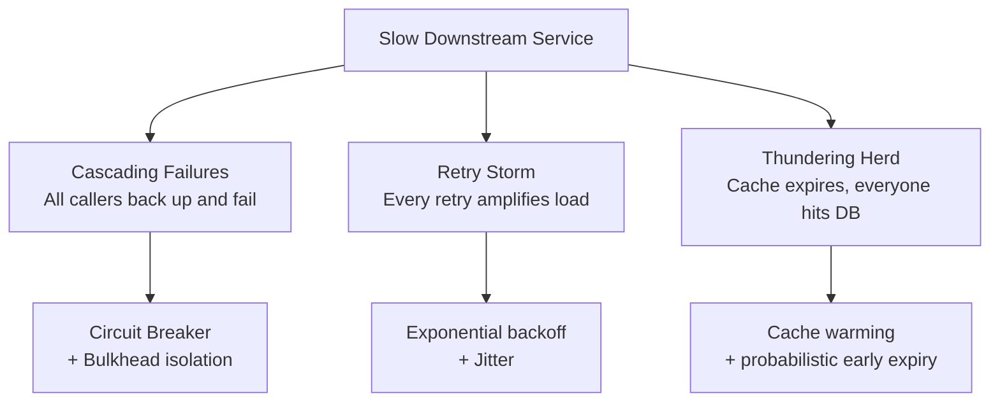

# Architecture Failure Modes

Cascading failures, retry storms, thundering herd — the disasters that take down production.

```mermaid
graph TD
    SLOW[Slow Downstream Service]
    SLOW --> CF[Cascading Failures\nAll callers back up and fail]
    SLOW --> RS[Retry Storm\nEvery retry amplifies load]
    SLOW --> TH[Thundering Herd\nCache expires, everyone hits DB]
    CF --> FIX1[Circuit Breaker\n+ Bulkhead isolation]
    RS --> FIX2[Exponential backoff\n+ Jitter]
    TH --> FIX3[Cache warming\n+ probabilistic early expiry]
```
