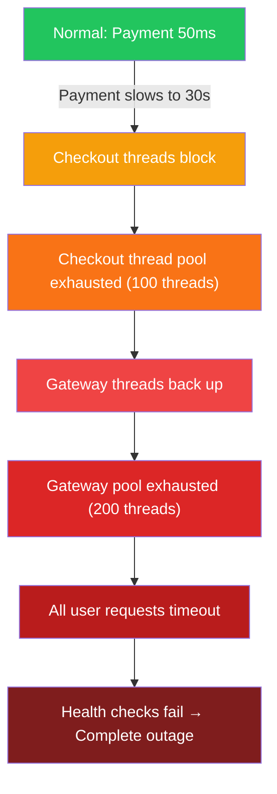

# Timeout Domino Effect - When One Slow Service Kills Everything

> **Category:** Availability
> **Frequency:** Common in microservices architectures
> **Detection Difficulty:** Medium (symptoms appear downstream)
> **Impact:** Complete system outage from a single slow dependency

## 🗺️ Quick Overview



*One slow dependency triggers a chain reaction that exhausts thread pools upstream — a dead service is safer than a slow one.*

## The Amazon Problem: 100ms = 1% Sales Loss

**Real Incident Pattern:**

```
Scenario: E-commerce checkout during flash sale

Architecture:
┌─────────┐     ┌─────────┐     ┌─────────┐     ┌─────────┐
│  User   │────►│ Gateway │────►│ Checkout│────►│ Payment │
└─────────┘     └─────────┘     └─────────┘     └─────────┘
                     │                               │
                     │                          [SLOW: 30s]
                     │                               │

Timeline:
T=0:      Payment service becomes slow (30s response time)
T=10s:    Checkout service threads blocked waiting for payment
T=30s:    Checkout service thread pool exhausted (100 threads)
T=35s:    Gateway threads backing up (waiting for checkout)
T=60s:    Gateway thread pool exhausted (200 threads)
T=65s:    All user requests timing out
T=70s:    Load balancer health checks failing
T=75s:    Complete outage

Impact:
├── Started with 1 slow service
├── Cascaded to take down 5 services
├── 100% of users affected
└── 45 minutes to recover
```

**The problem:** Missing or too-long timeouts allow slow services to consume all resources in calling services.

---

## Why This Happens

### Cause 1: No Timeout Configured

```javascript
// ❌ BAD: No timeout - waits forever
const response = await fetch('http://payment-service/charge', {
  method: 'POST',
  body: JSON.stringify(order)
});
// If payment-service takes 5 minutes, we wait 5 minutes

// ✅ GOOD: Explicit timeout
const controller = new AbortController();
const timeout = setTimeout(() => controller.abort(), 5000);

const response = await fetch('http://payment-service/charge', {
  method: 'POST',
  body: JSON.stringify(order),
  signal: controller.signal
});
clearTimeout(timeout);
```

### Cause 2: Timeout Too Long

```
Default timeouts that cause problems:

HTTP client default: 0 (infinite) or 120 seconds
Database connection: 30 seconds
AWS SDK: 60 seconds

User expectation: < 3 seconds

Result: Each request holds resources for 30-120 seconds
        With 100 concurrent requests, system exhausted in seconds
```

### Cause 3: Timeout Not Propagated

```
Request chain with 10-second timeout per hop:

Gateway ──► Service A ──► Service B ──► Service C ──► Database
  10s          10s          10s           10s          10s
           └──────────────── Total: 40+ seconds ────────────────┘

User timeout: 10 seconds
Actual request time: 40 seconds

Result: Gateway times out, but downstream services still working
        Resources wasted, potential duplicate processing
```

### The Domino Math

```
Thread pool: 100 threads
Normal request time: 50ms
Requests per second: 2000 (100 threads × 1000ms / 50ms)

When one dependency goes slow (30s response):
Threads blocked: All 100
Requests per second: 3.3 (100 threads / 30s)

Cascade effect:
├── Calling service can only handle 3 req/s
├── Queue builds up rapidly
├── Health checks fail
├── Load balancer removes server
├── More traffic goes to remaining servers
└── Remaining servers also overwhelmed
```

---

## Detection

### Symptom 1: Thread Pool Exhaustion

```javascript
// Monitor active threads/connections
setInterval(() => {
  const pool = connectionPool.getStats();

  metrics.gauge('pool.active', pool.active);
  metrics.gauge('pool.waiting', pool.waiting);
  metrics.gauge('pool.available', pool.available);

  // Alert if pool is near exhaustion
  const utilization = pool.active / pool.total;
  if (utilization > 0.8) {
    console.warn(`Thread pool at ${utilization * 100}% capacity`);
  }

  if (utilization > 0.95) {
    alert('CRITICAL: Thread pool nearly exhausted');
  }
}, 5000);
```

### Symptom 2: Latency Spike Correlation

```
Healthy state:
├── Service A latency: 50ms
├── Service B latency: 100ms
└── Service C latency: 30ms

During incident:
├── Service A latency: 50ms (unaffected)
├── Service B latency: 30,000ms (slow!)
├── Service C latency: 29,000ms (waiting for B)
└── Gateway latency: 28,500ms (waiting for C)

Pattern: Latency spike propagates upstream
         Root cause is furthest downstream slow service
```

### Symptom 3: Increased Error Rates

```sql
-- Find correlation between timeouts and downstream latency
SELECT
  date_trunc('minute', timestamp) AS minute,
  service,
  COUNT(*) FILTER (WHERE error_type = 'timeout') AS timeouts,
  AVG(duration_ms) AS avg_latency,
  PERCENTILE_CONT(0.99) WITHIN GROUP (ORDER BY duration_ms) AS p99_latency
FROM requests
WHERE timestamp > NOW() - INTERVAL '1 hour'
GROUP BY minute, service
ORDER BY minute DESC, timeouts DESC;
```

---

## Prevention Strategies

### Strategy 1: Aggressive Timeouts

```javascript
// Set timeouts shorter than user patience
const TIMEOUT_CONFIG = {
  // External services: aggressive
  'payment-service': 3000,    // 3 seconds max
  'inventory-service': 2000,  // 2 seconds max
  'notification-service': 1000, // 1 second max (non-critical)

  // Database: based on query complexity
  'database-simple': 1000,    // 1 second
  'database-complex': 5000,   // 5 seconds
  'database-batch': 30000,    // 30 seconds (background jobs only)

  // User-facing total
  'api-request-total': 5000   // 5 seconds end-to-end
};

class TimeoutManager {
  constructor(config) {
    this.config = config;
  }

  getTimeout(service) {
    return this.config[service] || 5000; // Default 5s
  }

  withTimeout(service, promise) {
    const timeout = this.getTimeout(service);
    return Promise.race([
      promise,
      new Promise((_, reject) =>
        setTimeout(() => reject(new TimeoutError(service, timeout)), timeout)
      )
    ]);
  }
}
```

### Strategy 2: Deadline Propagation

```javascript
// Propagate remaining time budget through call chain
class RequestContext {
  constructor(deadline) {
    this.deadline = deadline || Date.now() + 5000;
  }

  remainingTime() {
    return Math.max(0, this.deadline - Date.now());
  }

  isExpired() {
    return Date.now() >= this.deadline;
  }

  // Create child context with buffer for overhead
  child(bufferMs = 100) {
    return new RequestContext(this.deadline - bufferMs);
  }

  // Get timeout for next call
  timeoutForNextCall(overhead = 100) {
    return this.remainingTime() - overhead;
  }
}

// Usage in service chain
async function handleCheckout(req, res) {
  // Start with 5-second budget
  const ctx = new RequestContext(Date.now() + 5000);

  // Pass remaining time to each service
  const inventory = await inventoryService.check(items, {
    timeout: ctx.timeoutForNextCall()
  });

  if (ctx.isExpired()) {
    return res.status(504).json({ error: 'Request timeout' });
  }

  const payment = await paymentService.charge(amount, {
    timeout: ctx.timeoutForNextCall()
  });

  if (ctx.isExpired()) {
    // Compensate: refund payment
    await paymentService.refund(payment.id);
    return res.status(504).json({ error: 'Request timeout' });
  }

  res.json({ orderId: order.id });
}
```

### Strategy 3: Bulkhead Pattern

```javascript
// Isolate thread pools per dependency
class BulkheadManager {
  constructor() {
    this.pools = new Map();
  }

  getPool(service, options = {}) {
    if (!this.pools.has(service)) {
      this.pools.set(service, new Semaphore(options.maxConcurrent || 20));
    }
    return this.pools.get(service);
  }

  async execute(service, fn, options = {}) {
    const pool = this.getPool(service, options);

    if (!await pool.tryAcquire(options.waitTimeout || 0)) {
      throw new BulkheadFullError(service);
    }

    try {
      return await fn();
    } finally {
      pool.release();
    }
  }
}

// Usage
const bulkhead = new BulkheadManager();

async function callPaymentService(order) {
  return bulkhead.execute('payment-service', async () => {
    return await paymentClient.charge(order);
  }, {
    maxConcurrent: 20,  // Max 20 concurrent calls to payment service
    waitTimeout: 1000   // Wait 1s max for slot
  });
}

// Benefits:
// - Payment service slow? Only 20 threads affected
// - Inventory service still has its own pool
// - System partially degraded, not dead
```

### Strategy 4: Circuit Breaker + Timeout

```javascript
// Combine timeouts with circuit breaker for fast failure
class ResilientClient {
  constructor(options = {}) {
    this.timeout = options.timeout || 5000;
    this.circuit = new CircuitBreaker({
      failureThreshold: 5,
      resetTimeout: 30000
    });
  }

  async call(fn) {
    // Circuit breaker: fail fast if service is known to be down
    return this.circuit.execute(async () => {
      // Timeout: don't wait forever
      return this.withTimeout(fn, this.timeout);
    });
  }

  async withTimeout(fn, timeout) {
    return Promise.race([
      fn(),
      new Promise((_, reject) =>
        setTimeout(() => reject(new TimeoutError()), timeout)
      )
    ]);
  }
}

// Result:
// - If service is healthy: 5s max wait
// - If service is slow: Circuit opens after 5 failures
// - Once open: Immediate failure (no waiting)
// - System stays responsive
```

---

## Real-World Solutions

### How Netflix Handles It

```
Netflix Hystrix (resilience4j):

1. Command timeout: Every service call wrapped
   └── Default: 1 second

2. Thread pool per service: Bulkhead isolation
   └── Payment: 20 threads
   └── Recommendations: 50 threads
   └── User profile: 30 threads

3. Circuit breaker: Fast failure on known issues
   └── Opens after 50% failure rate

4. Fallback: Degraded experience when failing
   └── Show cached recommendations
   └── Skip personalization

Result:
├── Single slow service isolated
├── Other services unaffected
├── User sees partial functionality
└── System recovers automatically
```

### How Amazon Handles It

```
Amazon's timeout strategy:

1. Aggressive timeouts based on P99 latency
   └── If P99 is 200ms, timeout at 500ms

2. Retry budget: Track retries across system
   └── Stop retrying if too many failures

3. Hedge requests: Send duplicate request after delay
   └── Cancel slower one when first completes

4. Load shedding: Reject low-priority requests when overloaded
   └── Protect checkout flow at all costs
```

---

## Quick Win: Add Timeouts Today

```javascript
// Express middleware for request timeouts
function requestTimeout(timeout) {
  return (req, res, next) => {
    // Set timeout on request
    req.setTimeout(timeout, () => {
      if (!res.headersSent) {
        res.status(504).json({
          error: 'Request timeout',
          timeout
        });
      }
    });

    // Track start time for logging
    req.startTime = Date.now();

    res.on('finish', () => {
      const duration = Date.now() - req.startTime;
      if (duration > timeout * 0.8) {
        console.warn(`Slow request: ${req.method} ${req.path} took ${duration}ms`);
      }
    });

    next();
  };
}

// Apply to all routes
app.use(requestTimeout(5000));

// Or per-route
app.get('/fast-endpoint', requestTimeout(1000), handler);
app.post('/slow-endpoint', requestTimeout(30000), handler);
```

---

## Key Takeaways

### Prevention Checklist

```
□ Every external call has explicit timeout
□ Timeouts are shorter than user patience (< 5s)
□ Deadline/context propagated through service chain
□ Thread pools isolated per dependency (bulkhead)
□ Circuit breakers fail fast on known issues
□ Fallbacks provide degraded functionality
□ Monitoring alerts on thread pool saturation
```

### Timeout Guidelines

| Dependency Type | Timeout | Rationale |
|-----------------|---------|-----------|
| Fast service (cache) | 500ms | Should be instant |
| Typical service | 2-5s | User patience limit |
| Slow service (search) | 5-10s | Only if user expects wait |
| Background job | 30s-5m | Not user-facing |
| Never | Infinite | Always set explicit timeout |

---

## Related Content

- [Timeouts & Backpressure](/10-architecture/concepts/timeouts-backpressure)
- [Cascading Failures](/problems-at-scale/availability/cascading-failures)
- [POC #75: Circuit Breaker](/10-architecture/hands-on/circuit-breaker)
- [Connection Pool Management](/09-observability/concepts/connection-pool-management)

---

---

## 🔍 Quick Detection Checklist

**Alert signals**:
- [ ] P99 latency for an upstream service exceeds its configured timeout threshold, causing downstream errors to spike
- [ ] Thread pool utilization rises from normal to > 80% over 30–60 seconds without a corresponding traffic spike (threads blocking on downstream)
- [ ] Latency spike pattern is staircase-shaped: Service C spikes first, then Service B, then Service A — propagating upstream over minutes
- [ ] Request success rate drops proportionally to how many threads are blocked (e.g., 40 of 100 threads blocked on slow dep = 40% of requests failing)
- [ ] `active_connections` on the slow dependency is at max; `waiting_connections` queue is growing (DB connection pool exhaustion)

**Immediate mitigation steps**:
1. **Identify the slow dependency**: In distributed tracing, find the service with the highest latency that isn't being caused by its own dependencies. This is the root-cause slow service — all others are victims.
2. **Manually open circuit breaker** on the slow dependency at its callers. This immediately frees blocked threads — converts 30-second blocks into 10ms rejections. Upstream services regain thread capacity within seconds.
3. **Apply bulkhead isolation**: If the slow service doesn't have a dedicated thread pool, temporarily reduce the number of threads allowed for calls to it (via semaphore or connection limit), freeing shared threads for other dependencies.
4. **Investigate root cause of slowdown**: Common causes are DB query without index (check `EXPLAIN ANALYZE`), connection pool exhaustion (check pool utilization metrics), memory pressure causing GC pauses, or an external API degradation (check vendor status page).
5. **Verify thread pool recovery**: Watch thread pool utilization drop as circuit breaker takes effect. Should recover to < 50% utilization within 2–3 minutes of opening the circuit.

---

## 🎯 Interview Questions

### Common Interview Questions on Timeout Domino Effect

#### Q1: You're on-call and see a service chain where A calls B calls C. A is returning 504s, B's P99 is 28s, C looks healthy. What's happening and what do you do?
**What interviewers look for**: Reading the symptom pattern (504 at A, elevated B, healthy C suggests B→C timeout that's blocking B's threads) and applying the right immediate fix.

**Answer framework**:
1. **What's happening**: C looks healthy in C's own metrics, but B's calls to C are timing out. The "healthy" reading is because C's health endpoint returns 200 — but the actual data queries C handles for B are slow (probably a slow DB query or lock contention). B is accumulating blocked threads waiting 28s each for C.
2. **Immediate action**: Open the circuit breaker on B's dependency on C. This frees B's threads (converting 28s waits to 10ms rejections). A stops getting 504s within 60 seconds as B's thread pool drains.
3. **Root cause investigation**: Check C's database query latency (look for queries > 1s), check connection pool utilization on C's DB, check for lock contention in C's DB (`pg_locks` for PostgreSQL, `SHOW PROCESSLIST` for MySQL).

**Key numbers to mention**: At 28s timeout and 100 threads on B, B processes only 100/28 = 3.6 req/sec. Normal capacity is 2,000 req/sec (100 threads × 1,000ms/50ms avg). The domino effect: B's effective throughput drops 550x before anyone opens the circuit. See also: [Cascading Failures](/problems-at-scale/availability/cascading-failures).

---

#### Q2: How do you set timeouts correctly across a microservice call chain?
**What interviewers look for**: Deadline propagation knowledge — not independent timeouts per hop, but a total budget shared across the chain.

**Answer framework**:
1. **Naive approach (wrong)**: Each service sets its own independent timeout (Gateway=10s, A=10s, B=10s, C=10s). A user request could wait 40+ seconds before the gateway times out. Users expect < 5s.
2. **Deadline propagation (correct)**: Set a total budget at the entry point (e.g., 5s). Pass the remaining deadline as a context/header through each hop. Each service checks if the deadline has passed before making the next call. If remaining time < 100ms, return immediately.
3. **Aggressive service-level timeouts + overall budget**: Internal service timeouts should be 2–3x the P99 latency of the called service (if P99 is 50ms, set timeout to 100–150ms). This catches outliers without blocking for the full 5-second budget.

**Key numbers to mention**: Amazon's timeout strategy: set timeouts at P99 × 2 for internal services, P99 × 5 for external APIs. If a service's P99 is 200ms, timeout at 400–500ms. This ensures 99% of healthy requests succeed while unhealthy requests fail fast.

---

#### Q3: Why is a slow service worse than a dead service in microservices?
**What interviewers look for**: The thread pool exhaustion explanation — not just "it uses resources" but the specific mathematical reason a slow service cascades and a dead service doesn't.

**Answer framework**:
1. **Dead service = immediate failure**: Caller gets a connection refused or 503 in < 10ms. Thread is freed immediately. Even if the caller retries 3 times, each failure takes 10ms. Thread pool remains available for other requests.
2. **Slow service = thread pool exhaustion**: Each call to the slow service holds a thread for 30 seconds waiting for a response. At 100 threads and 30s hold time, the pool can handle only 100/30 = 3.3 req/sec. Normal capacity: 2,000 req/sec. The service is effectively dead but threads are still tied up — nothing can be served.
3. **The cascade mechanism**: Threads accumulate in the caller (blocked on slow dep). Queue builds up. Health checks start failing (health check also blocks on the slow dep). LB removes the caller from rotation. Remaining callers get more traffic → they also exhaust faster. Entire tier falls within minutes.

**Key numbers to mention**: Netflix coined this: "Latency is the silent killer." A dead dependency fails fast (< 1ms). A slow dependency at 30s: 10,000 requests/second × 30s = 300,000 threads needed. You have 1,000 threads. The service is destroyed in 0.1 seconds of slow responses. This is why circuit breakers are set to open on slow calls, not just errors.

---

**Remember:** A slow service is worse than a dead service. Dead services fail fast; slow services hold resources and cascade failures. Set aggressive timeouts, use circuit breakers, and isolate dependencies with bulkheads. Your system is only as fast as its slowest timeout.
