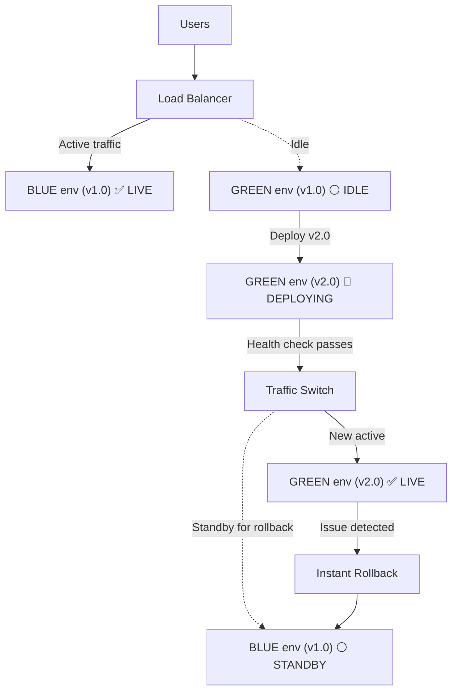

# POC #97: Blue-Green Deployment

> **Difficulty:** 🟡 Intermediate
> **Time:** 25 minutes
> **Prerequisites:** Docker basics, Load balancing concepts

## 🗺️ Quick Overview



*Traffic flips atomically between two identical environments — zero downtime, instant rollback.*

## What You'll Learn

Blue-Green deployment maintains two identical production environments. Traffic switches instantly between them, enabling zero-downtime deployments and instant rollbacks.

```
BLUE-GREEN DEPLOYMENT:
┌─────────────────────────────────────────────────────────────────┐
│                                                                 │
│  BEFORE DEPLOYMENT:                                             │
│  ──────────────────                                             │
│                                                                 │
│  Users ───▶ Load Balancer ───▶ BLUE (v1.0) ✅ LIVE             │
│                            ╲                                    │
│                             ╲──▶ GREEN (v1.0) ⚪ IDLE           │
│                                                                 │
│  DURING DEPLOYMENT:                                             │
│  ──────────────────                                             │
│                                                                 │
│  Users ───▶ Load Balancer ───▶ BLUE (v1.0) ✅ LIVE             │
│                            ╲                                    │
│                             ╲──▶ GREEN (v2.0) 🔄 DEPLOYING      │
│                                                                 │
│  AFTER SWITCH:                                                  │
│  ─────────────                                                  │
│                                                                 │
│  Users ───▶ Load Balancer ───▶ GREEN (v2.0) ✅ LIVE            │
│                            ╲                                    │
│                             ╲──▶ BLUE (v1.0) ⚪ STANDBY         │
│                                                                 │
│  ROLLBACK (if needed):                                          │
│  ─────────────────────                                          │
│                                                                 │
│  Users ───▶ Load Balancer ───▶ BLUE (v1.0) ✅ LIVE             │
│                                  (instant!)                     │
│                                                                 │
└─────────────────────────────────────────────────────────────────┘
```

---

## Implementation

```javascript
// blue-green-deployment.js

// ==========================================
// DEPLOYMENT ENVIRONMENT
// ==========================================

class Environment {
  constructor(name, config = {}) {
    this.name = name;
    this.version = config.version || 'unknown';
    this.instances = [];
    this.status = 'idle';  // idle, deploying, live, draining
    this.healthCheckUrl = config.healthCheckUrl || '/health';
    this.metadata = {
      deployedAt: null,
      deployedBy: null
    };
  }

  async deploy(version, instances) {
    this.status = 'deploying';
    this.version = version;

    console.log(`  📦 Deploying ${version} to ${this.name}...`);

    // Simulate deployment to instances
    for (const instance of instances) {
      await this.deployToInstance(instance, version);
    }

    this.instances = instances;
    this.metadata.deployedAt = new Date();
    this.status = 'idle';

    console.log(`  ✅ Deployment complete: ${this.name} running ${version}`);
  }

  async deployToInstance(instance, version) {
    // Simulate container/instance deployment
    await new Promise(r => setTimeout(r, 100));
    instance.version = version;
    instance.status = 'running';
  }

  async healthCheck() {
    const results = await Promise.all(
      this.instances.map(async (instance) => {
        try {
          // Simulate health check
          await new Promise(r => setTimeout(r, 50));
          return { instance: instance.id, healthy: Math.random() > 0.1 };
        } catch {
          return { instance: instance.id, healthy: false };
        }
      })
    );

    const healthy = results.filter(r => r.healthy).length;
    return {
      environment: this.name,
      healthy,
      total: this.instances.length,
      percentage: (healthy / this.instances.length) * 100
    };
  }

  setLive() {
    this.status = 'live';
  }

  setIdle() {
    this.status = 'idle';
  }
}

// ==========================================
// LOAD BALANCER
// ==========================================

class LoadBalancer {
  constructor() {
    this.activeEnvironment = null;
    this.environments = new Map();
    this.requestCount = 0;
  }

  registerEnvironment(env) {
    this.environments.set(env.name, env);
  }

  setActive(envName) {
    const oldEnv = this.activeEnvironment;
    const newEnv = this.environments.get(envName);

    if (!newEnv) {
      throw new Error(`Environment not found: ${envName}`);
    }

    if (oldEnv) {
      oldEnv.setIdle();
    }

    newEnv.setLive();
    this.activeEnvironment = newEnv;

    console.log(`\n🔀 Traffic switched: ${oldEnv?.name || 'none'} → ${envName}`);
  }

  route(request) {
    if (!this.activeEnvironment) {
      return { status: 503, body: 'No active environment' };
    }

    this.requestCount++;
    const instance = this.selectInstance();

    return {
      status: 200,
      environment: this.activeEnvironment.name,
      version: this.activeEnvironment.version,
      instance: instance.id
    };
  }

  selectInstance() {
    const instances = this.activeEnvironment.instances;
    const index = this.requestCount % instances.length;
    return instances[index];
  }

  getStatus() {
    return {
      active: this.activeEnvironment?.name,
      version: this.activeEnvironment?.version,
      environments: Array.from(this.environments.values()).map(e => ({
        name: e.name,
        version: e.version,
        status: e.status,
        instances: e.instances.length
      }))
    };
  }
}

// ==========================================
// DEPLOYMENT ORCHESTRATOR
// ==========================================

class BlueGreenOrchestrator {
  constructor(loadBalancer) {
    this.loadBalancer = loadBalancer;
    this.deploymentHistory = [];
  }

  async deploy(version, options = {}) {
    const currentEnv = this.loadBalancer.activeEnvironment;
    const targetEnvName = currentEnv?.name === 'blue' ? 'green' : 'blue';
    const targetEnv = this.loadBalancer.environments.get(targetEnvName);

    console.log(`\n${'═'.repeat(50)}`);
    console.log(`DEPLOYING: ${version}`);
    console.log(`${'═'.repeat(50)}`);
    console.log(`  Current: ${currentEnv?.name || 'none'} (${currentEnv?.version || 'none'})`);
    console.log(`  Target:  ${targetEnvName}`);

    // Step 1: Deploy to inactive environment
    const instances = this.createInstances(options.instanceCount || 3);
    await targetEnv.deploy(version, instances);

    // Step 2: Health check
    console.log(`\n  🏥 Running health checks...`);
    const health = await targetEnv.healthCheck();
    console.log(`  Health: ${health.percentage.toFixed(0)}% (${health.healthy}/${health.total})`);

    if (health.percentage < (options.minHealthy || 80)) {
      console.log(`  ❌ Health check failed, aborting deployment`);
      return { success: false, reason: 'Health check failed' };
    }

    // Step 3: Switch traffic
    if (!options.skipSwitch) {
      this.loadBalancer.setActive(targetEnvName);
    }

    // Record deployment
    this.deploymentHistory.push({
      version,
      environment: targetEnvName,
      timestamp: new Date(),
      previousVersion: currentEnv?.version
    });

    console.log(`\n  ✅ Deployment successful!`);
    return { success: true, environment: targetEnvName, version };
  }

  async rollback() {
    const lastDeployment = this.deploymentHistory[this.deploymentHistory.length - 1];
    if (!lastDeployment) {
      console.log('  ❌ No deployment to rollback');
      return { success: false, reason: 'No deployment history' };
    }

    const currentEnv = this.loadBalancer.activeEnvironment;
    const rollbackEnvName = currentEnv?.name === 'blue' ? 'green' : 'blue';

    console.log(`\n${'═'.repeat(50)}`);
    console.log(`ROLLBACK`);
    console.log(`${'═'.repeat(50)}`);
    console.log(`  Rolling back from ${currentEnv?.version} to ${lastDeployment.previousVersion}`);

    // Simply switch traffic back (instant rollback)
    this.loadBalancer.setActive(rollbackEnvName);

    console.log(`  ✅ Rollback complete!`);
    return { success: true, version: lastDeployment.previousVersion };
  }

  createInstances(count) {
    return Array.from({ length: count }, (_, i) => ({
      id: `instance-${Date.now()}-${i}`,
      status: 'pending',
      version: null
    }));
  }

  getDeploymentHistory() {
    return this.deploymentHistory;
  }
}

// ==========================================
// DEMONSTRATION
// ==========================================

async function demonstrate() {
  console.log('='.repeat(60));
  console.log('BLUE-GREEN DEPLOYMENT');
  console.log('='.repeat(60));

  // Setup
  const loadBalancer = new LoadBalancer();
  const blueEnv = new Environment('blue', { version: 'v1.0.0' });
  const greenEnv = new Environment('green', { version: 'v1.0.0' });

  loadBalancer.registerEnvironment(blueEnv);
  loadBalancer.registerEnvironment(greenEnv);

  const orchestrator = new BlueGreenOrchestrator(loadBalancer);

  // Initial deployment
  console.log('\n--- Initial Deployment ---');
  await orchestrator.deploy('v1.0.0');

  // Simulate traffic
  console.log('\n--- Simulating Traffic ---');
  for (let i = 0; i < 5; i++) {
    const response = loadBalancer.route({ path: '/api/users' });
    console.log(`  Request ${i + 1}: ${response.environment} (${response.version})`);
  }

  // Deploy new version
  console.log('\n--- Deploy v2.0.0 ---');
  await orchestrator.deploy('v2.0.0');

  // Traffic now goes to new version
  console.log('\n--- Traffic After Deployment ---');
  for (let i = 0; i < 5; i++) {
    const response = loadBalancer.route({ path: '/api/users' });
    console.log(`  Request ${i + 1}: ${response.environment} (${response.version})`);
  }

  // Show current status
  console.log('\n--- Current Status ---');
  const status = loadBalancer.getStatus();
  console.log(`  Active: ${status.active} (${status.version})`);
  status.environments.forEach(e => {
    console.log(`  ${e.name}: ${e.version} [${e.status}] (${e.instances} instances)`);
  });

  // Simulate issue and rollback
  console.log('\n--- Simulating Rollback ---');
  await orchestrator.rollback();

  // Traffic back to old version
  console.log('\n--- Traffic After Rollback ---');
  for (let i = 0; i < 3; i++) {
    const response = loadBalancer.route({ path: '/api/users' });
    console.log(`  Request ${i + 1}: ${response.environment} (${response.version})`);
  }

  // Deployment history
  console.log('\n--- Deployment History ---');
  orchestrator.getDeploymentHistory().forEach((d, i) => {
    console.log(`  ${i + 1}. ${d.version} → ${d.environment} (${d.timestamp.toISOString()})`);
  });

  console.log('\n✅ Demo complete!');
}

demonstrate().catch(console.error);
```

---

## Blue-Green vs Other Strategies

| Strategy | Downtime | Rollback | Resource Cost |
|----------|----------|----------|---------------|
| **Blue-Green** | Zero | Instant | 2x (double env) |
| **Rolling** | Zero | Slow | 1x + buffer |
| **Canary** | Zero | Fast | 1x + small |
| **Recreate** | Yes | Slow | 1x |

---

## Database Considerations

```
DATABASE MIGRATION CHALLENGES:

OPTION 1: Backward Compatible Migrations
├── Add columns (nullable or with defaults)
├── Don't remove columns until both versions done
└── Both v1 and v2 can read/write

OPTION 2: Database Per Version
├── Separate databases for blue/green
├── Sync data before switch
└── Complex but isolated

OPTION 3: Feature Flags
├── New code reads both schemas
├── Toggle between old/new at runtime
└── Gradual migration
```

---

## Best Practices

```
✅ DO:
├── Automate everything
├── Health check before switch
├── Keep rollback ready
├── Test in staging first
├── Monitor after switch
└── Document the process

❌ DON'T:
├── Manual traffic switching
├── Skip health checks
├── Delete old environment quickly
├── Forget database migrations
├── Deploy without monitoring
└── Rush the process
```

---

## ⚡ Quick Reference Implementation

```javascript
// Blue-green deployment controller — copy-paste template
class BlueGreenController {
  constructor(loadBalancer) {
    this.lb = loadBalancer;
    this.active = 'blue';   // 'blue' | 'green'
  }

  inactive() { return this.active === 'blue' ? 'green' : 'blue'; }

  async deploy(version, { minHealthyPct = 80 } = {}) {
    const target = this.inactive();
    await this.lb.deploy(target, version);           // Deploy to idle env
    const health = await this.lb.healthCheck(target); // Check before switch
    if (health.pct < minHealthyPct) throw new Error(`Health check failed: ${health.pct}%`);
    this.lb.setActive(target);                        // Atomic traffic switch
    this.active = target;
    return { deployed: target, previous: this.inactive() };
  }

  rollback() {
    const previous = this.inactive();
    this.lb.setActive(previous);  // Instant — previous env still running
    this.active = previous;
  }
}
```

---

## 🎯 Interview Questions

### Implementation-Focused Interview Questions

#### Q1: How do you implement blue-green deployment with zero-downtime database migrations?

**What interviewers look for**: Understanding that database schema changes are the hardest part of blue-green deployments.

**Answer framework**:
1. **Expand-contract pattern**: Phase 1 — add the new column (nullable/default), deploy v2 that writes both old and new column; Phase 2 — after all traffic is on v2, drop the old column
2. Never rename/drop columns in the same release that switches traffic
3. For data migrations: run as a background job after the deploy, not as part of the deployment itself
4. Both blue (v1) and green (v2) must be able to read/write the database simultaneously during the cutover window

**Code snippet that impresses**:
```sql
-- Phase 1: Add new column (backward-compatible, both v1 and v2 can run)
ALTER TABLE users ADD COLUMN display_name VARCHAR(255) DEFAULT NULL;

-- v2 app writes both columns during transition:
-- UPDATE users SET name = $1, display_name = $1 WHERE id = $2

-- Phase 2: After full traffic on v2 (next release)
ALTER TABLE users DROP COLUMN name;  -- Safe now — no v1 instances left
```

---

#### Q2: How do you route 10% of traffic to the green environment while keeping 90% on blue?

**What interviewers look for**: Load balancer configuration knowledge and the difference between blue-green (all-or-nothing) and weighted routing.

**Answer framework**:
1. Pure blue-green is **all-or-nothing** — when you switch, 100% goes to green
2. Weighted routing (10%/90%) is actually **canary release**, not blue-green
3. AWS ALB weighted target groups: set blue target group weight=90, green=10 in the listener rule
4. Nginx upstream: use `weight` parameter in the upstream block
5. Key distinction: blue-green's value is **instant rollback** (switch back is a single operation), not gradual rollout

**Code snippet that impresses**:
```nginx
# Nginx weighted routing (canary approach, not pure blue-green)
upstream app {
    server blue-env:8080 weight=90;   # 90% to stable
    server green-env:8080 weight=10;  # 10% to new version
}

# Pure blue-green: single upstream, switched atomically
upstream app {
    server green-env:8080;  # After switch: 100% green
}
```

---

#### Q3: How do you verify a green environment is healthy before switching traffic?

**What interviewers look for**: Health check design, smoke testing, and deployment gates.

**Answer framework**:
1. **Liveness check**: `/health` returns 200 (process is alive)
2. **Readiness check**: `/ready` returns 200 only when DB connections are warm and caches are primed
3. **Smoke tests**: run a small set of critical user journey tests against the green environment using internal routing before exposing to users
4. **Metric baseline**: let green environment serve a tiny % (like internal employees) and compare error rate to blue before full switch

**Code snippet that impresses**:
```javascript
async function waitForHealthy(env, { minHealthy = 0.8, maxWait = 120000 }) {
  const deadline = Date.now() + maxWait;
  while (Date.now() < deadline) {
    const { percentage } = await env.healthCheck();
    if (percentage >= minHealthy * 100) return true;
    await sleep(5000);
  }
  throw new Error(`${env.name} not healthy after ${maxWait / 1000}s`);
}
```

---

#### Q4: What is the biggest risk with blue-green deployment and how do you mitigate it?

**What interviewers look for**: Honest trade-off analysis, not just benefits.

**Answer framework**:
1. **Database incompatibility**: if green writes data in a format blue can't read, rollback is now dangerous
2. **Cost**: running two full production environments doubles infrastructure cost — use auto-scaling to minimize standby costs
3. **Long-lived connections**: WebSocket/gRPC connections to blue don't automatically move to green; need graceful drain
4. Mitigation: keep blue environment running for at least 1 deployment cycle (typically 24h) before decommissioning

---

#### Q5: How would you automate a blue-green deployment pipeline in CI/CD?

**What interviewers look for**: DevOps knowledge, scripting CI/CD gates, and rollback triggers.

**Answer framework**:
1. CI pipeline stages: Build → Test → Deploy to inactive env → Health check gate → Switch traffic → Post-deploy smoke tests → (auto-rollback if smoke fails)
2. The traffic switch should be a single API call to your load balancer (AWS ALB, Route 53, Nginx upstream reload)
3. Store the previous version in pipeline state — rollback is just calling switch again with the previous env name

---

## Related POCs

- [Canary Releases](/10-architecture/hands-on/canary-releases)
- [Feature Flags](/10-architecture/hands-on/feature-flags)
- [Health Check Patterns](/09-observability/hands-on/health-check-patterns)

## Further Reading

**Concept articles:**
- [Deployment Strategies Deep Dive](/10-architecture/concepts/deployment-strategies-deep-dive)

**Interview prep:**
- [Monolith to Microservices (deployment patterns)](/12-interview-prep/system-design/scale-and-reliability/monolith-to-microservices)

**Failure modes:**
- [Cascading Failures](/10-architecture/failures/cascading-failures)
