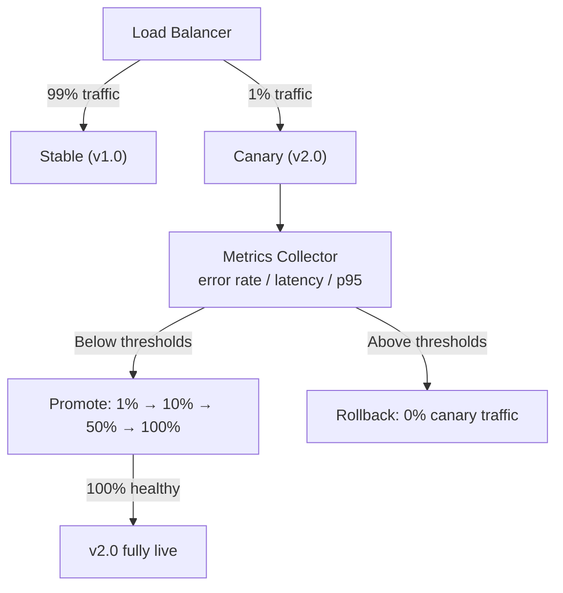

# POC #98: Canary Releases

> **Difficulty:** 🟡 Intermediate
> **Time:** 25 minutes
> **Prerequisites:** Load balancing concepts, Monitoring basics

## 🗺️ Quick Overview



*Traffic shifts to the canary in small increments while metrics guard each promotion gate.*

## What You'll Learn

Canary releases gradually shift traffic to new versions while monitoring for errors. Unlike blue-green, canary reduces blast radius by exposing only a small percentage of users initially.

```
CANARY RELEASE PROGRESSION:
┌─────────────────────────────────────────────────────────────────┐
│                                                                 │
│  STAGE 1: 1% Canary                                             │
│  ─────────────────────                                          │
│  ┌────────────────────────────────────────────┐  ┌───┐         │
│  │           v1.0 (99%)                       │  │v2 │ 1%      │
│  └────────────────────────────────────────────┘  └───┘         │
│                                                                 │
│  STAGE 2: 10% Canary                                            │
│  ──────────────────────                                         │
│  ┌──────────────────────────────────────┐  ┌──────┐            │
│  │           v1.0 (90%)                 │  │ v2.0 │ 10%        │
│  └──────────────────────────────────────┘  └──────┘            │
│                                                                 │
│  STAGE 3: 50% Canary                                            │
│  ──────────────────────                                         │
│  ┌─────────────────────┐  ┌─────────────────────┐              │
│  │    v1.0 (50%)       │  │     v2.0 (50%)      │              │
│  └─────────────────────┘  └─────────────────────┘              │
│                                                                 │
│  STAGE 4: Full Rollout                                          │
│  ─────────────────────────                                      │
│  ┌────────────────────────────────────────────────┐            │
│  │               v2.0 (100%)                      │            │
│  └────────────────────────────────────────────────┘            │
│                                                                 │
└─────────────────────────────────────────────────────────────────┘
```

---

## Implementation

```javascript
// canary-releases.js

// ==========================================
// METRICS COLLECTOR
// ==========================================

class MetricsCollector {
  constructor() {
    this.metrics = new Map();  // version -> { requests, errors, latencies }
    this.window = 60000;  // 1 minute window
  }

  record(version, success, latencyMs) {
    if (!this.metrics.has(version)) {
      this.metrics.set(version, {
        requests: [],
        errors: [],
        latencies: []
      });
    }

    const now = Date.now();
    const data = this.metrics.get(version);

    data.requests.push({ timestamp: now, value: 1 });
    data.latencies.push({ timestamp: now, value: latencyMs });

    if (!success) {
      data.errors.push({ timestamp: now, value: 1 });
    }

    // Clean old data
    this.cleanup(version, now);
  }

  cleanup(version, now) {
    const data = this.metrics.get(version);
    const cutoff = now - this.window;

    data.requests = data.requests.filter(r => r.timestamp > cutoff);
    data.errors = data.errors.filter(r => r.timestamp > cutoff);
    data.latencies = data.latencies.filter(r => r.timestamp > cutoff);
  }

  getStats(version) {
    const data = this.metrics.get(version);
    if (!data || data.requests.length === 0) {
      return null;
    }

    const requests = data.requests.length;
    const errors = data.errors.length;
    const errorRate = (errors / requests) * 100;

    const latencies = data.latencies.map(l => l.value).sort((a, b) => a - b);
    const p50 = latencies[Math.floor(latencies.length * 0.5)] || 0;
    const p95 = latencies[Math.floor(latencies.length * 0.95)] || 0;
    const p99 = latencies[Math.floor(latencies.length * 0.99)] || 0;

    return {
      requests,
      errors,
      errorRate: errorRate.toFixed(2),
      latency: { p50, p95, p99 }
    };
  }
}

// ==========================================
// CANARY CONTROLLER
// ==========================================

class CanaryController {
  constructor(config = {}) {
    this.stages = config.stages || [1, 5, 10, 25, 50, 100];
    this.currentStage = 0;
    this.baselineVersion = null;
    this.canaryVersion = null;
    this.canaryWeight = 0;
    this.status = 'idle';  // idle, running, paused, completed, rolled_back

    this.metrics = new MetricsCollector();
    this.thresholds = config.thresholds || {
      maxErrorRate: 1,      // 1% max error rate
      maxP95Latency: 500,   // 500ms max p95 latency
      minRequests: 100      // Min requests before promotion
    };

    this.history = [];
  }

  startCanary(baselineVersion, canaryVersion) {
    this.baselineVersion = baselineVersion;
    this.canaryVersion = canaryVersion;
    this.currentStage = 0;
    this.canaryWeight = this.stages[0];
    this.status = 'running';

    this.log(`Started canary: ${baselineVersion} → ${canaryVersion}`);
    this.log(`Initial weight: ${this.canaryWeight}%`);

    return {
      baseline: baselineVersion,
      canary: canaryVersion,
      weight: this.canaryWeight
    };
  }

  // Route request based on canary weight
  route(userId) {
    if (this.status !== 'running') {
      return { version: this.baselineVersion, isCanary: false };
    }

    // Consistent hashing for sticky sessions
    const hash = this.hashUser(userId);
    const bucket = hash % 100;

    const isCanary = bucket < this.canaryWeight;

    return {
      version: isCanary ? this.canaryVersion : this.baselineVersion,
      isCanary
    };
  }

  hashUser(userId) {
    let hash = 0;
    const str = String(userId);
    for (let i = 0; i < str.length; i++) {
      hash = ((hash << 5) - hash) + str.charCodeAt(i);
      hash = hash & hash;
    }
    return Math.abs(hash);
  }

  // Record request result
  recordRequest(version, success, latencyMs) {
    this.metrics.record(version, success, latencyMs);
  }

  // Analyze metrics and decide action
  analyze() {
    if (this.status !== 'running') {
      return { action: 'none', reason: 'Canary not running' };
    }

    const baselineStats = this.metrics.getStats(this.baselineVersion);
    const canaryStats = this.metrics.getStats(this.canaryVersion);

    if (!canaryStats || canaryStats.requests < this.thresholds.minRequests) {
      return {
        action: 'wait',
        reason: `Insufficient data (${canaryStats?.requests || 0}/${this.thresholds.minRequests} requests)`
      };
    }

    // Check error rate
    if (parseFloat(canaryStats.errorRate) > this.thresholds.maxErrorRate) {
      return {
        action: 'rollback',
        reason: `Error rate too high: ${canaryStats.errorRate}% > ${this.thresholds.maxErrorRate}%`,
        stats: { baseline: baselineStats, canary: canaryStats }
      };
    }

    // Check latency
    if (canaryStats.latency.p95 > this.thresholds.maxP95Latency) {
      return {
        action: 'rollback',
        reason: `P95 latency too high: ${canaryStats.latency.p95}ms > ${this.thresholds.maxP95Latency}ms`,
        stats: { baseline: baselineStats, canary: canaryStats }
      };
    }

    // Compare with baseline (if available)
    if (baselineStats) {
      const errorDiff = parseFloat(canaryStats.errorRate) - parseFloat(baselineStats.errorRate);
      const latencyDiff = canaryStats.latency.p95 - baselineStats.latency.p95;

      // Canary significantly worse than baseline
      if (errorDiff > 0.5 || latencyDiff > 100) {
        return {
          action: 'rollback',
          reason: `Canary worse than baseline (error diff: ${errorDiff.toFixed(2)}%, latency diff: ${latencyDiff}ms)`,
          stats: { baseline: baselineStats, canary: canaryStats }
        };
      }
    }

    // All good - ready to promote
    return {
      action: 'promote',
      reason: 'Metrics within thresholds',
      stats: { baseline: baselineStats, canary: canaryStats }
    };
  }

  // Promote to next stage
  promote() {
    if (this.currentStage >= this.stages.length - 1) {
      this.complete();
      return { success: true, action: 'completed', weight: 100 };
    }

    this.currentStage++;
    this.canaryWeight = this.stages[this.currentStage];

    this.log(`Promoted to ${this.canaryWeight}%`);

    this.history.push({
      action: 'promote',
      stage: this.currentStage,
      weight: this.canaryWeight,
      timestamp: new Date()
    });

    return {
      success: true,
      action: 'promoted',
      stage: this.currentStage,
      weight: this.canaryWeight
    };
  }

  // Rollback canary
  rollback(reason) {
    this.status = 'rolled_back';
    this.canaryWeight = 0;

    this.log(`Rolled back: ${reason}`);

    this.history.push({
      action: 'rollback',
      reason,
      timestamp: new Date()
    });

    return {
      success: true,
      version: this.baselineVersion,
      reason
    };
  }

  // Complete canary (100% traffic to new version)
  complete() {
    this.status = 'completed';
    this.baselineVersion = this.canaryVersion;
    this.canaryWeight = 100;

    this.log(`Canary completed: ${this.canaryVersion} is now live`);

    this.history.push({
      action: 'complete',
      version: this.canaryVersion,
      timestamp: new Date()
    });
  }

  // Pause canary
  pause() {
    this.status = 'paused';
    this.log('Canary paused');
  }

  // Resume canary
  resume() {
    this.status = 'running';
    this.log('Canary resumed');
  }

  log(message) {
    console.log(`  [Canary] ${message}`);
  }

  getStatus() {
    return {
      status: this.status,
      baseline: this.baselineVersion,
      canary: this.canaryVersion,
      weight: this.canaryWeight,
      stage: `${this.currentStage + 1}/${this.stages.length}`,
      metrics: {
        baseline: this.metrics.getStats(this.baselineVersion),
        canary: this.metrics.getStats(this.canaryVersion)
      }
    };
  }
}

// ==========================================
// TRAFFIC SIMULATOR
// ==========================================

class TrafficSimulator {
  constructor(controller) {
    this.controller = controller;
  }

  // Simulate traffic with different characteristics per version
  async simulateTraffic(requestCount, versionBehavior) {
    const results = { baseline: [], canary: [] };

    for (let i = 0; i < requestCount; i++) {
      const userId = `user-${i}`;
      const routing = this.controller.route(userId);

      const behavior = versionBehavior[routing.version];
      const latency = this.generateLatency(behavior.avgLatency, behavior.latencyVariance);
      const success = Math.random() > behavior.errorRate;

      this.controller.recordRequest(routing.version, success, latency);

      if (routing.isCanary) {
        results.canary.push({ success, latency });
      } else {
        results.baseline.push({ success, latency });
      }

      // Small delay between requests
      if (i % 100 === 0) {
        await new Promise(r => setTimeout(r, 10));
      }
    }

    return results;
  }

  generateLatency(avg, variance) {
    // Normal distribution approximation
    const u1 = Math.random();
    const u2 = Math.random();
    const z = Math.sqrt(-2 * Math.log(u1)) * Math.cos(2 * Math.PI * u2);
    return Math.max(1, Math.round(avg + z * variance));
  }
}

// ==========================================
// DEMONSTRATION
// ==========================================

async function demonstrate() {
  console.log('='.repeat(60));
  console.log('CANARY RELEASES');
  console.log('='.repeat(60));

  // Create canary controller
  const controller = new CanaryController({
    stages: [1, 5, 10, 25, 50, 100],
    thresholds: {
      maxErrorRate: 2,
      maxP95Latency: 300,
      minRequests: 50
    }
  });

  const simulator = new TrafficSimulator(controller);

  // Scenario 1: Successful canary release
  console.log('\n--- Scenario 1: Successful Canary Release ---');

  controller.startCanary('v1.0', 'v2.0');

  const goodVersionBehavior = {
    'v1.0': { avgLatency: 100, latencyVariance: 20, errorRate: 0.01 },
    'v2.0': { avgLatency: 95, latencyVariance: 18, errorRate: 0.008 }  // Slightly better
  };

  // Progress through stages
  for (let stage = 0; stage < 4; stage++) {
    console.log(`\n  Stage ${stage + 1}:`);

    // Simulate traffic
    await simulator.simulateTraffic(200, goodVersionBehavior);

    // Analyze metrics
    const analysis = controller.analyze();
    console.log(`    Analysis: ${analysis.action} - ${analysis.reason}`);

    if (analysis.stats?.canary) {
      const cs = analysis.stats.canary;
      console.log(`    Canary: ${cs.requests} reqs, ${cs.errorRate}% errors, p95=${cs.latency.p95}ms`);
    }

    // Promote if ready
    if (analysis.action === 'promote') {
      const result = controller.promote();
      console.log(`    Promoted to ${result.weight}%`);
    }
  }

  // Show final status
  console.log('\n  Final Status:');
  const status = controller.getStatus();
  console.log(`    ${status.status}: ${status.canary} at ${status.weight}%`);

  // Scenario 2: Failed canary (rollback)
  console.log('\n\n--- Scenario 2: Canary Rollback (High Error Rate) ---');

  const failController = new CanaryController({
    stages: [1, 5, 10, 25, 50, 100],
    thresholds: {
      maxErrorRate: 2,
      maxP95Latency: 300,
      minRequests: 50
    }
  });

  const failSimulator = new TrafficSimulator(failController);

  failController.startCanary('v1.0', 'v2.1-buggy');

  const buggyVersionBehavior = {
    'v1.0': { avgLatency: 100, latencyVariance: 20, errorRate: 0.01 },
    'v2.1-buggy': { avgLatency: 150, latencyVariance: 50, errorRate: 0.05 }  // 5% errors!
  };

  // Simulate traffic
  await failSimulator.simulateTraffic(200, buggyVersionBehavior);

  // Analyze
  const failAnalysis = failController.analyze();
  console.log(`  Analysis: ${failAnalysis.action} - ${failAnalysis.reason}`);

  if (failAnalysis.action === 'rollback') {
    failController.rollback(failAnalysis.reason);
    console.log(`  Rolled back to ${failController.baselineVersion}`);
  }

  // Scenario 3: Progressive rollout visualization
  console.log('\n\n--- Scenario 3: Traffic Distribution Visualization ---');

  const vizController = new CanaryController({
    stages: [1, 10, 25, 50, 75, 100]
  });

  vizController.startCanary('v1', 'v2');

  for (const weight of [1, 10, 25, 50, 75, 100]) {
    vizController.canaryWeight = weight;

    // Count routing decisions
    let baselineCount = 0;
    let canaryCount = 0;

    for (let i = 0; i < 100; i++) {
      const routing = vizController.route(`user-${i}`);
      if (routing.isCanary) canaryCount++;
      else baselineCount++;
    }

    const baselineBar = '█'.repeat(Math.round(baselineCount / 2));
    const canaryBar = '▓'.repeat(Math.round(canaryCount / 2));

    console.log(`  ${String(weight).padStart(3)}% | ${baselineBar}${canaryBar} | v1:${baselineCount} v2:${canaryCount}`);
  }

  console.log('\n✅ Demo complete!');
}

demonstrate().catch(console.error);
```

---

## Canary vs Blue-Green vs Rolling

| Aspect | Canary | Blue-Green | Rolling |
|--------|--------|------------|---------|
| **Blast Radius** | Small (1-5% initial) | 50% or 100% | Varies |
| **Rollback Speed** | Fast | Instant | Slow |
| **Resource Cost** | 1x + small | 2x | 1x + buffer |
| **Complexity** | High (metrics) | Medium | Low |
| **Best For** | Risk-averse deploys | Fast switching | Resource-limited |

---

## Canary Metrics to Monitor

```
CRITICAL METRICS:
┌─────────────────────────────────────────────────────────────────┐
│                                                                 │
│  ERROR RATE                    LATENCY                          │
│  ──────────                    ───────                          │
│  Compare canary vs baseline    P50, P95, P99 percentiles        │
│  Alert if diff > threshold     Compare distributions            │
│                                                                 │
│  THROUGHPUT                    BUSINESS METRICS                 │
│  ──────────                    ────────────────                 │
│  Requests per second           Conversion rate                  │
│  Success rate                  Revenue per request              │
│                                                                 │
│  RESOURCE USAGE                DOWNSTREAM IMPACT                │
│  ──────────────                ─────────────────                │
│  CPU, Memory                   Database load                    │
│  Connection pool               Cache hit rate                   │
│                                                                 │
└─────────────────────────────────────────────────────────────────┘
```

---

## Best Practices

```
✅ DO:
├── Start with tiny percentage (1%)
├── Monitor multiple metrics
├── Use consistent hashing for sticky sessions
├── Automate rollback decisions
├── Compare against baseline, not absolutes
└── Include business metrics

❌ DON'T:
├── Skip metric collection
├── Promote without enough data
├── Ignore downstream dependencies
├── Use random routing (breaks sessions)
├── Rush through stages
└── Forget database compatibility
```

---

## ⚡ Quick Reference Implementation

```javascript
// Minimal canary controller — copy-paste template
class CanaryController {
  constructor({ stages = [1, 5, 10, 25, 50, 100], thresholds = {} } = {}) {
    this.stages = stages;
    this.stageIdx = 0;
    this.weight = stages[0];   // Current canary % (e.g., 1)
    this.thresholds = { maxErrorRate: 1, maxP95ms: 500, minRequests: 100, ...thresholds };
  }

  // Consistent hashing: same user always hits same version
  route(userId) {
    let h = 5381;
    for (const c of String(userId)) h = ((h << 5) + h) + c.charCodeAt(0);
    return (Math.abs(h) % 100) < this.weight ? 'canary' : 'stable';
  }

  analyze(canaryStats, baselineStats) {
    if (canaryStats.requests < this.thresholds.minRequests) return 'wait';
    if (canaryStats.errorRate - baselineStats.errorRate > this.thresholds.maxErrorRate) return 'rollback';
    if (canaryStats.p95 - baselineStats.p95 > this.thresholds.maxP95ms) return 'rollback';
    return 'promote';
  }

  promote() {
    if (this.stageIdx < this.stages.length - 1) this.weight = this.stages[++this.stageIdx];
    return this.weight;
  }
}
```

---

## 🎯 Interview Questions

### Implementation-Focused Interview Questions

#### Q1: How do you implement canary analysis to auto-rollback a bad release?

**What interviewers look for**: Automated decision making based on statistical comparison, not just raw thresholds.

**Answer framework**:
1. Collect key metrics for both the canary version and the stable baseline during the same time window
2. Compare canary metrics against baseline (relative, not absolute) — a 2% canary error rate is fine if baseline is 2%, but bad if baseline is 0.1%
3. Set rollback triggers: if `canary.errorRate > baseline.errorRate + 0.5%` OR `canary.p95 > baseline.p95 + 100ms` → auto-rollback
4. Require minimum request volume (e.g., 100 requests) before making any promotion/rollback decision — avoid acting on noise

**Code snippet that impresses**:
```javascript
function analyzeCanary(canaryStats, baselineStats, thresholds) {
  // Relative comparison prevents false alarms during high-error periods
  const errorDelta = canaryStats.errorRate - baselineStats.errorRate;
  const latencyDelta = canaryStats.p95 - baselineStats.p95;

  if (errorDelta > thresholds.maxErrorDelta) {
    return { action: 'rollback', reason: `Error rate delta ${errorDelta.toFixed(2)}% exceeds threshold` };
  }
  if (latencyDelta > thresholds.maxLatencyDelta) {
    return { action: 'rollback', reason: `P95 latency delta ${latencyDelta}ms exceeds threshold` };
  }
  if (canaryStats.requests < thresholds.minRequests) {
    return { action: 'wait', reason: 'Insufficient traffic for confident analysis' };
  }
  return { action: 'promote' };
}
```

---

#### Q2: What metrics would you monitor during a canary release and why?

**What interviewers look for**: Breadth of observability — technical AND business metrics.

**Answer framework**:
1. **Error rate**: HTTP 5xx / total requests — catch crashes immediately
2. **Latency P95/P99**: tail latency is what users actually experience during slow periods
3. **Throughput**: requests per second — a sudden drop may mean the canary is rejecting requests silently
4. **Business metrics**: conversion rate, checkout success rate, revenue per session — a technically "green" deploy can still hurt business
5. **Resource utilization**: CPU/memory on canary instances — memory leaks show up here before they cause crashes

---

#### Q3: How do you ensure the same user always goes to the same version (sticky sessions) during a canary rollout?

**What interviewers look for**: Consistent hashing knowledge and session management awareness.

**Answer framework**:
1. Problem: without sticky sessions, a user may see v1 for request 1 and v2 for request 2 — causes jarring inconsistencies
2. Solution: hash the user ID (or session cookie) to a bucket 0–99; if bucket < canaryWeight, route to canary, else stable
3. This is deterministic: the same user ID always hashes to the same bucket, so routing is consistent across requests
4. A/B testing platforms (LaunchDarkly, Optimizely) use this exact pattern

**Code snippet that impresses**:
```javascript
function routeRequest(userId, canaryWeightPercent) {
  // djb2 hash — simple and fast; use murmurhash in production
  let hash = 5381;
  for (const char of String(userId)) {
    hash = ((hash << 5) + hash) + char.charCodeAt(0);
    hash = hash & hash;  // 32-bit integer
  }
  const bucket = Math.abs(hash) % 100;
  return bucket < canaryWeightPercent ? 'canary' : 'stable';
}
// user-123 always hashes to same bucket regardless of when called
```

---

#### Q4: How would you handle a canary release for a database schema change?

**What interviewers look for**: Understanding that canary deploys are harder when state is involved.

**Answer framework**:
1. Canary adds a code layer between users and the database — the database is **shared** between canary and stable
2. Schema must be backward-compatible: add nullable columns, never drop/rename in the same release
3. New index: add `CONCURRENTLY` to avoid locking; run before the canary deploy, not during
4. If the schema change is breaking: use feature flags to control which code path reads/writes the new column

---

#### Q5: How does a canary release differ from an A/B test? When would you use each?

**What interviewers look for**: Conceptual clarity and knowing when to reach for which tool.

**Answer framework**:
1. **Canary**: safety mechanism — route N% to new version to catch bugs/regressions before full rollout; auto-rollback on degradation; temporary
2. **A/B test**: product experiment — compare two variants to measure user behavior difference (click rate, conversion); requires statistical significance; runs for days/weeks
3. Canary is infrastructure/ops owned; A/B test is product/engineering owned
4. They can coexist: canary handles the safe deployment, a feature flag handles the A/B assignment within the same deployed version

---

## Related POCs

- [Blue-Green Deployment](/10-architecture/hands-on/blue-green-deployment)
- [Feature Flags](/10-architecture/hands-on/feature-flags)
- [Health Check Patterns](/09-observability/hands-on/health-check-patterns)

## Further Reading

**Concept articles:**
- [Deployment Strategies Deep Dive](/10-architecture/concepts/deployment-strategies-deep-dive)

**Interview prep:**
- [Load Balancing Strategies](/12-interview-prep/system-design/fundamentals/load-balancing-strategies)

**Failure modes:**
- [Cascading Failures](/10-architecture/failures/cascading-failures)
