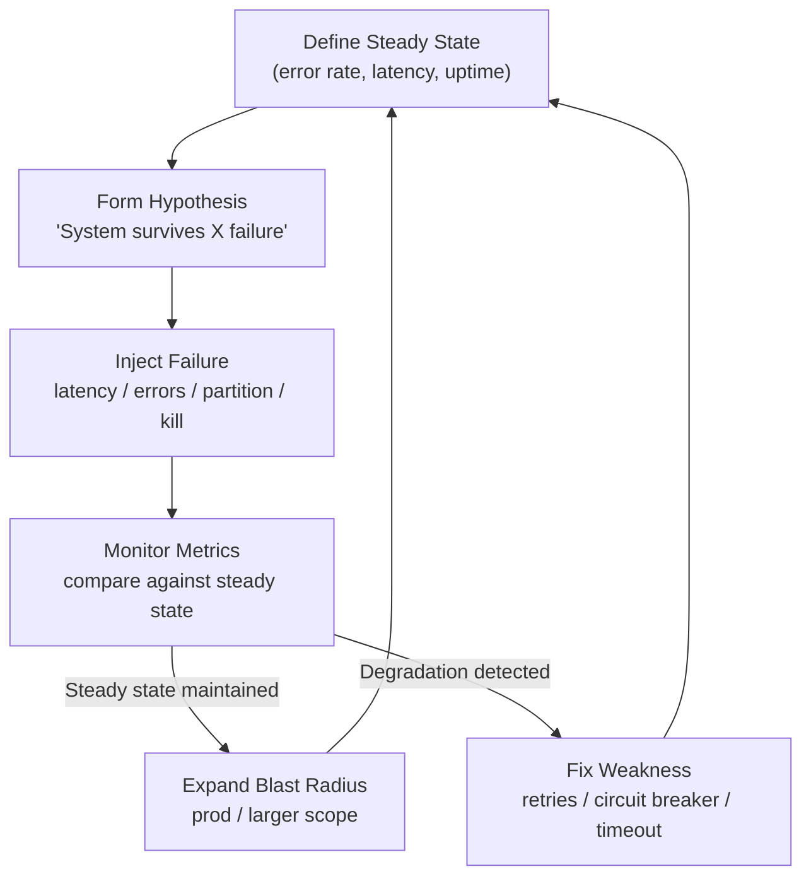

# POC #92: Chaos Engineering

> **Difficulty:** 🔴 Advanced
> **Time:** 30 minutes
> **Prerequisites:** Node.js, Distributed systems concepts

## 🗺️ Quick Overview



*Proactively inject controlled failures to find weaknesses before they cause real incidents.*

## What You'll Learn

Chaos Engineering proactively tests system resilience by injecting controlled failures. This reveals weaknesses before they cause production incidents.

```
CHAOS ENGINEERING PROCESS:
┌─────────────────────────────────────────────────────────────────┐
│                                                                 │
│  1. STEADY STATE     2. HYPOTHESIS      3. EXPERIMENT           │
│  ─────────────       ──────────         ──────────              │
│                                                                 │
│  Define normal       "System will       Inject failure:         │
│  behavior:           handle X           - Kill instance         │
│  - 99.9% uptime      failure with       - Add latency           │
│  - p95 < 200ms       <5% degradation"   - Drop packets          │
│  - Error rate <1%                       - Fill disk             │
│                                                                 │
│  4. ANALYZE          5. FIX             6. REPEAT               │
│  ───────             ───                ──────                  │
│                                                                 │
│  Did system          Improve            Increase blast          │
│  maintain steady     resilience:        radius, run in          │
│  state?              - Add retries      production              │
│                      - Circuit breaker                          │
│                      - Timeouts                                 │
│                                                                 │
└─────────────────────────────────────────────────────────────────┘
```

---

## Implementation

```javascript
// chaos-engineering.js

// ==========================================
// CHAOS MONKEY - FAILURE INJECTION
// ==========================================

class ChaosMonkey {
  constructor(options = {}) {
    this.enabled = options.enabled || false;
    this.experiments = new Map();
    this.activeExperiments = new Set();
    this.results = [];
  }

  // Register an experiment
  registerExperiment(name, experiment) {
    this.experiments.set(name, {
      name,
      inject: experiment.inject,
      restore: experiment.restore,
      probability: experiment.probability || 1.0,
      duration: experiment.duration || 60000,
      targetSelector: experiment.targetSelector || (() => true)
    });
    console.log(`🐒 Registered experiment: ${name}`);
  }

  // Start an experiment
  async startExperiment(name, options = {}) {
    if (!this.enabled) {
      console.log('⚠️ Chaos Monkey is disabled');
      return;
    }

    const experiment = this.experiments.get(name);
    if (!experiment) {
      throw new Error(`Experiment not found: ${name}`);
    }

    const experimentId = `${name}-${Date.now()}`;
    const startTime = Date.now();

    console.log(`\n🔥 Starting chaos experiment: ${name}`);
    console.log(`   ID: ${experimentId}`);
    console.log(`   Duration: ${experiment.duration}ms`);

    const context = {
      id: experimentId,
      name,
      startTime,
      options
    };

    // Inject failure
    try {
      await experiment.inject(context);
      this.activeExperiments.add(experimentId);

      // Auto-restore after duration
      setTimeout(async () => {
        await this.stopExperiment(experimentId, experiment, context);
      }, experiment.duration);

      return experimentId;
    } catch (error) {
      console.error(`❌ Failed to start experiment: ${error.message}`);
      throw error;
    }
  }

  async stopExperiment(experimentId, experiment, context) {
    if (!this.activeExperiments.has(experimentId)) return;

    console.log(`\n✅ Stopping experiment: ${experimentId}`);

    try {
      await experiment.restore(context);
    } catch (error) {
      console.error(`⚠️ Failed to restore: ${error.message}`);
    }

    this.activeExperiments.delete(experimentId);

    this.results.push({
      experimentId,
      name: experiment.name,
      startTime: context.startTime,
      endTime: Date.now(),
      duration: Date.now() - context.startTime
    });
  }

  // Stop all active experiments
  async stopAll() {
    console.log('\n🛑 Stopping all experiments...');
    for (const experimentId of this.activeExperiments) {
      const name = experimentId.split('-')[0];
      const experiment = this.experiments.get(name);
      if (experiment) {
        await experiment.restore({ id: experimentId });
      }
      this.activeExperiments.delete(experimentId);
    }
  }
}

// ==========================================
// FAILURE INJECTORS
// ==========================================

// Latency Injection
class LatencyInjector {
  constructor() {
    this.delays = new Map();  // route -> delay
  }

  middleware() {
    return (req, res, next) => {
      const delay = this.delays.get(req.path) || this.delays.get('*') || 0;
      if (delay > 0) {
        setTimeout(next, delay);
      } else {
        next();
      }
    };
  }

  addDelay(route, delayMs) {
    this.delays.set(route, delayMs);
    console.log(`   💉 Injecting ${delayMs}ms latency on ${route}`);
  }

  removeDelay(route) {
    this.delays.delete(route);
    console.log(`   🔧 Removed latency from ${route}`);
  }

  clear() {
    this.delays.clear();
  }
}

// Error Injection
class ErrorInjector {
  constructor() {
    this.errors = new Map();  // route -> { statusCode, probability }
  }

  middleware() {
    return (req, res, next) => {
      const config = this.errors.get(req.path) || this.errors.get('*');
      if (config && Math.random() < config.probability) {
        return res.status(config.statusCode).json({
          error: 'Chaos injection',
          code: 'CHAOS_ERROR'
        });
      }
      next();
    };
  }

  addError(route, statusCode, probability = 1.0) {
    this.errors.set(route, { statusCode, probability });
    console.log(`   💉 Injecting ${statusCode} errors on ${route} (${probability * 100}%)`);
  }

  removeError(route) {
    this.errors.delete(route);
  }

  clear() {
    this.errors.clear();
  }
}

// Resource Exhaustion
class ResourceExhaustion {
  constructor() {
    this.leaks = [];
  }

  // Simulate memory pressure
  consumeMemory(megabytes) {
    const data = Buffer.alloc(megabytes * 1024 * 1024, 'x');
    this.leaks.push(data);
    console.log(`   💉 Consumed ${megabytes}MB memory`);
  }

  // Simulate CPU pressure
  consumeCPU(durationMs) {
    const start = Date.now();
    console.log(`   💉 Consuming CPU for ${durationMs}ms`);

    return new Promise(resolve => {
      const burn = () => {
        const elapsed = Date.now() - start;
        if (elapsed < durationMs) {
          // Busy loop
          let x = 0;
          for (let i = 0; i < 1000000; i++) x += Math.random();
          setImmediate(burn);
        } else {
          resolve();
        }
      };
      burn();
    });
  }

  release() {
    this.leaks = [];
    global.gc && global.gc();
    console.log(`   🔧 Released resources`);
  }
}

// Network Partition Simulator
class NetworkPartition {
  constructor() {
    this.blockedHosts = new Set();
  }

  // Middleware to simulate partition
  middleware() {
    return (req, res, next) => {
      // Check if target host is blocked
      const targetHost = req.headers['x-target-host'];
      if (targetHost && this.blockedHosts.has(targetHost)) {
        return res.status(503).json({
          error: 'Service unavailable',
          code: 'NETWORK_PARTITION'
        });
      }
      next();
    };
  }

  blockHost(host) {
    this.blockedHosts.add(host);
    console.log(`   💉 Blocked network to ${host}`);
  }

  unblockHost(host) {
    this.blockedHosts.delete(host);
    console.log(`   🔧 Unblocked network to ${host}`);
  }

  clear() {
    this.blockedHosts.clear();
  }
}

// ==========================================
// EXPERIMENT DEFINITIONS
// ==========================================

function defineExperiments(chaos, injectors) {
  const { latency, errors, resources, network } = injectors;

  // Latency Spike
  chaos.registerExperiment('latency-spike', {
    inject: async (ctx) => {
      latency.addDelay('*', ctx.options.delayMs || 2000);
    },
    restore: async () => {
      latency.clear();
    },
    duration: 30000
  });

  // Random Errors
  chaos.registerExperiment('random-errors', {
    inject: async (ctx) => {
      errors.addError('*', 500, ctx.options.probability || 0.3);
    },
    restore: async () => {
      errors.clear();
    },
    duration: 60000
  });

  // Service Dependency Failure
  chaos.registerExperiment('dependency-failure', {
    inject: async (ctx) => {
      const target = ctx.options.target || 'payment-service';
      network.blockHost(target);
    },
    restore: async (ctx) => {
      const target = ctx.options.target || 'payment-service';
      network.unblockHost(target);
    },
    duration: 45000
  });

  // Memory Pressure
  chaos.registerExperiment('memory-pressure', {
    inject: async (ctx) => {
      resources.consumeMemory(ctx.options.megabytes || 256);
    },
    restore: async () => {
      resources.release();
    },
    duration: 30000
  });

  // Cascading Failure
  chaos.registerExperiment('cascading-failure', {
    inject: async (ctx) => {
      // Simulate multiple failures
      latency.addDelay('/api/orders', 5000);
      errors.addError('/api/payments', 503, 0.5);
    },
    restore: async () => {
      latency.clear();
      errors.clear();
    },
    duration: 60000
  });
}

// ==========================================
// STEADY STATE MONITOR
// ==========================================

class SteadyStateMonitor {
  constructor(thresholds) {
    this.thresholds = thresholds || {
      errorRate: 0.01,        // 1%
      p95Latency: 500,        // 500ms
      availability: 0.999     // 99.9%
    };
    this.metrics = {
      requests: 0,
      errors: 0,
      latencies: []
    };
  }

  recordRequest(latencyMs, isError) {
    this.metrics.requests++;
    this.metrics.latencies.push(latencyMs);
    if (isError) this.metrics.errors++;
  }

  checkSteadyState() {
    const errorRate = this.metrics.requests > 0
      ? this.metrics.errors / this.metrics.requests
      : 0;

    const sortedLatencies = [...this.metrics.latencies].sort((a, b) => a - b);
    const p95Index = Math.ceil(sortedLatencies.length * 0.95) - 1;
    const p95Latency = sortedLatencies[p95Index] || 0;

    const availability = 1 - errorRate;

    const steadyState = {
      errorRate,
      p95Latency,
      availability,
      inSteadyState:
        errorRate <= this.thresholds.errorRate &&
        p95Latency <= this.thresholds.p95Latency &&
        availability >= this.thresholds.availability
    };

    return steadyState;
  }

  reset() {
    this.metrics = { requests: 0, errors: 0, latencies: [] };
  }
}

// ==========================================
// DEMONSTRATION
// ==========================================

async function demonstrate() {
  console.log('='.repeat(60));
  console.log('CHAOS ENGINEERING');
  console.log('='.repeat(60));

  // Initialize components
  const chaos = new ChaosMonkey({ enabled: true });
  const latency = new LatencyInjector();
  const errors = new ErrorInjector();
  const resources = new ResourceExhaustion();
  const network = new NetworkPartition();
  const monitor = new SteadyStateMonitor();

  // Define experiments
  defineExperiments(chaos, { latency, errors, resources, network });

  // Simulate baseline traffic
  console.log('\n--- Establishing Baseline ---');
  for (let i = 0; i < 100; i++) {
    const latencyMs = 50 + Math.random() * 100;
    const isError = Math.random() < 0.005;  // 0.5% baseline errors
    monitor.recordRequest(latencyMs, isError);
  }

  const baseline = monitor.checkSteadyState();
  console.log('Baseline steady state:', baseline);

  // Run latency experiment
  console.log('\n--- Running Latency Spike Experiment ---');
  monitor.reset();

  await chaos.startExperiment('latency-spike', { delayMs: 1500 });

  // Simulate traffic during experiment
  for (let i = 0; i < 50; i++) {
    const baseLatency = 50 + Math.random() * 100;
    const injectedLatency = latency.delays.get('*') || 0;
    const totalLatency = baseLatency + injectedLatency;
    const isError = totalLatency > 2000 ? true : Math.random() < 0.02;
    monitor.recordRequest(totalLatency, isError);
  }

  const duringChaos = monitor.checkSteadyState();
  console.log('During chaos:', duringChaos);
  console.log('Steady state maintained:', duringChaos.inSteadyState ? '❌ NO' : '⚠️ DEGRADED');

  // Cleanup
  await chaos.stopAll();

  // Run error injection experiment
  console.log('\n--- Running Error Injection Experiment ---');
  monitor.reset();

  await chaos.startExperiment('random-errors', { probability: 0.2 });

  // Simulate traffic
  for (let i = 0; i < 50; i++) {
    const latencyMs = 50 + Math.random() * 100;
    const isError = Math.random() < 0.2;  // 20% injected errors
    monitor.recordRequest(latencyMs, isError);
  }

  const errorExperiment = monitor.checkSteadyState();
  console.log('During error injection:', errorExperiment);

  await chaos.stopAll();

  console.log('\n--- Experiment Results ---');
  console.log('Experiments run:', chaos.results.length);
  chaos.results.forEach(r => {
    console.log(`  ${r.name}: ${r.duration}ms`);
  });

  console.log('\n✅ Demo complete!');
}

demonstrate().catch(console.error);
```

---

## Common Chaos Experiments

| Experiment | What It Tests | Tools |
|------------|---------------|-------|
| **Instance Kill** | Auto-scaling, failover | Chaos Monkey |
| **Latency Injection** | Timeout handling | Toxiproxy, tc |
| **Network Partition** | Split-brain handling | iptables, tc |
| **Disk Full** | Graceful degradation | dd, fallocate |
| **CPU Exhaustion** | Throttling, priorities | stress-ng |
| **DNS Failure** | Caching, retries | dnsmasq |

---

## Netflix Chaos Tools

```
SIMIAN ARMY:

Chaos Monkey      - Randomly kills instances
Latency Monkey    - Injects network delays
Conformity Monkey - Finds non-conforming instances
Doctor Monkey     - Checks instance health
Janitor Monkey    - Cleans up unused resources
Security Monkey   - Finds security vulnerabilities
Chaos Gorilla     - Simulates entire zone failure
Chaos Kong        - Simulates entire region failure
```

---

## Best Practices

```
✅ DO:
├── Start small (dev/staging first)
├── Have a hypothesis
├── Define steady state metrics
├── Automate rollback
├── Run during business hours initially
└── Document findings

❌ DON'T:
├── Run in production without prep
├── Skip the hypothesis
├── Ignore monitoring during tests
├── Run without rollback plan
├── Test everything at once
└── Blame individuals for failures
```

---

## ⚡ Quick Reference Implementation

```javascript
// Minimal chaos experiment runner — copy-paste template
class ChaosExperiment {
  constructor({ name, steadyState, inject, restore, duration = 30000 }) {
    this.name = name;
    this.steadyState = steadyState;  // () => { errorRate, p95Latency }
    this.inject = inject;            // () => Promise<void>
    this.restore = restore;          // () => Promise<void>
    this.duration = duration;
  }

  async run() {
    const before = await this.steadyState();
    console.log(`[${this.name}] Baseline: ${JSON.stringify(before)}`);

    await this.inject();
    await sleep(this.duration);
    const during = await this.steadyState();
    console.log(`[${this.name}] During:   ${JSON.stringify(during)}`);

    await this.restore();
    const after = await this.steadyState();
    console.log(`[${this.name}] After:    ${JSON.stringify(after)}`);

    return { hypothesis: 'system tolerates failure', maintained: during.errorRate < 0.05 };
  }
}
```

---

## 🎯 Interview Questions

### Implementation-Focused Interview Questions

#### Q1: How would you run a chaos experiment to test database failover?

**What interviewers look for**: Structured hypothesis-driven approach, not just "kill things and see what happens."

**Answer framework**:
1. **Hypothesis**: "When the primary database fails, the system promotes a replica within 30s and serves requests with < 1% error rate during the failover window"
2. **Steady state**: measure baseline error rate (<0.1%), p95 latency (<200ms), and successful read/write operations
3. **Inject**: kill the primary database (AWS RDS: force failover; on-prem: `systemctl stop postgres`)
4. **Monitor**: watch error rate and latency for 60s; compare against steady state thresholds
5. **Restore/verify**: confirm new primary is up, replica promoted, app reconnected; check steady state restored

**Code snippet that impresses**:
```javascript
const dbFailoverExperiment = new ChaosExperiment({
  name: 'db-primary-failover',
  steadyState: async () => ({
    errorRate: await metrics.getErrorRate('last-1m'),
    p95: await metrics.getP95Latency('last-1m'),
    writesSucceeding: await metrics.getSuccessRate('db-writes', 'last-1m')
  }),
  inject: () => rds.rebootDbInstance({ ForceFailover: true }),
  restore: async () => { /* RDS auto-restores — verify promotion */ },
  duration: 90000  // 90s to observe failover completion
});
```

---

#### Q2: What is a blast radius and how do you limit it during a chaos experiment?

**What interviewers look for**: Risk management thinking and progressive experiment design.

**Answer framework**:
1. **Blast radius**: the scope of potential impact if an experiment goes wrong — how many users, services, or data could be affected
2. **Limit by environment**: start in development, then staging, then production off-peak, then production during business hours
3. **Limit by traffic**: use feature flags or canary routing to route only 1-5% of traffic through the chaos-injected path
4. **Limit by target**: inject failure into a single availability zone, a single node, or a non-critical service — not everything at once
5. **Auto-restore**: always set a hard timeout (`duration`) after which the experiment is automatically stopped, regardless of findings

---

#### Q3: How do you implement latency injection middleware for chaos testing?

**What interviewers look for**: Practical implementation knowledge for fault injection without infrastructure changes.

**Answer framework**:
1. Add a middleware layer between your service and its downstream clients
2. The middleware checks a chaos configuration store (Redis key, env var, or local config) on each call
3. If chaos is enabled for a route/service, add `sleep(configuredDelay)` before passing through
4. Key: the chaos configuration must be externally toggleable without a code deploy

**Code snippet that impresses**:
```javascript
// Chaos middleware — toggled via Redis key without restart
function chaosLatencyMiddleware(chaosConfig) {
  return async (req, res, next) => {
    const delay = await chaosConfig.get(`chaos:latency:${req.path}`);
    if (delay) {
      console.log(`[Chaos] Injecting ${delay}ms latency on ${req.path}`);
      await new Promise(r => setTimeout(r, parseInt(delay)));
    }
    next();
  };
}
// Toggle: redis-cli SET chaos:latency:/api/orders 2000 EX 60
```

---

#### Q4: How do you define "steady state" metrics for a chaos experiment?

**What interviewers look for**: Measurement-first thinking and understanding that steady state is system-specific.

**Answer framework**:
1. Steady state is the set of metrics that define "the system is healthy" for YOUR system — not generic thresholds
2. Minimum set: error rate, latency percentiles (p95/p99), availability (uptime)
3. Better: include business metrics — transactions per second, conversion rate, active users — because a technically "green" deploy can still hurt revenue
4. The experiment only runs if steady state is confirmed BEFORE injection; if not, abort — you don't want to inject on an already-degraded system

---

#### Q5: How does chaos engineering fit into a CI/CD pipeline?

**What interviewers look for**: Automation mindset and the maturity model from manual experiments to continuous verification.

**Answer framework**:
1. **Level 1** (beginner): manual chaos game days — run experiments during scheduled windows with full team present
2. **Level 2**: automated chaos in staging as part of deployment gate — inject failures, verify system meets thresholds, gate promotion to prod
3. **Level 3** (advanced): continuous chaos in production — Netflix's Chaos Monkey runs constantly, killing random instances; requires mature circuit breakers and fallbacks
4. Entry point for most teams: Level 2 — add a chaos test suite to your staging pipeline that runs before production deploy

---

## Related POCs

- [Circuit Breaker](/10-architecture/hands-on/circuit-breaker)
- [Load Testing](/09-observability/hands-on/load-testing-k6)
- [Graceful Degradation](/10-architecture/hands-on/graceful-degradation)

## Further Reading

**Concept articles:**
- [Chaos Engineering — Concept](/10-architecture/concepts/chaos-engineering)
- [High Availability](/10-architecture/concepts/microservices-architecture)

**Interview prep:**
- [Observability and Monitoring](/12-interview-prep/system-design/scale-and-reliability/observability-monitoring)

**Failure modes:**
- [Cascading Failures](/10-architecture/failures/cascading-failures)
- [Thundering Herd](/10-architecture/failures/thundering-herd)
