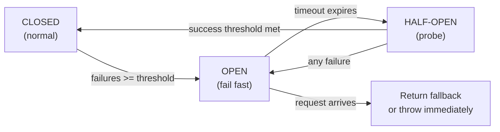

# POC #75: Circuit Breaker Implementation

> **Difficulty:** 🟡 Intermediate
> **Time:** 35 minutes
> **Prerequisites:** Understanding of failure modes, async patterns

## 🗺️ Quick Overview



*Three-state machine stops cascading failures by short-circuiting calls to an unhealthy downstream.*

## What You'll Build

A production-ready circuit breaker that:
- Protects services from cascading failures
- Fails fast when downstream is unhealthy
- Automatically recovers when downstream heals
- Provides metrics and observability

## The Problem

```javascript
// Without circuit breaker: Slow death
async function getUser(userId) {
  // Downstream service is slow (30s timeout)
  // Every request waits 30 seconds
  // Thread pool exhausted
  // Entire system becomes unresponsive
  return await userService.fetch(userId);
}

// With circuit breaker: Fast failure
async function getUser(userId) {
  // After 5 failures, circuit opens
  // Subsequent requests fail immediately (no waiting)
  // System stays responsive
  // Fallback provides degraded experience
}
```

## Implementation

### Step 1: Core Circuit Breaker

```javascript
// circuit-breaker.js
const EventEmitter = require('events');

class CircuitBreaker extends EventEmitter {
  static States = {
    CLOSED: 'CLOSED',
    OPEN: 'OPEN',
    HALF_OPEN: 'HALF_OPEN'
  };

  constructor(options = {}) {
    super();

    // Configuration
    this.name = options.name || 'default';
    this.failureThreshold = options.failureThreshold || 5;
    this.successThreshold = options.successThreshold || 3;
    this.timeout = options.timeout || 30000;  // Time before half-open
    this.halfOpenMaxCalls = options.halfOpenMaxCalls || 3;

    // State
    this.state = CircuitBreaker.States.CLOSED;
    this.failures = 0;
    this.successes = 0;
    this.lastFailureTime = null;
    this.halfOpenCalls = 0;

    // Metrics
    this.metrics = {
      totalCalls: 0,
      successfulCalls: 0,
      failedCalls: 0,
      rejectedCalls: 0,
      stateChanges: []
    };
  }

  async execute(fn, fallback) {
    this.metrics.totalCalls++;

    // Check if circuit should transition from OPEN to HALF_OPEN
    if (this.state === CircuitBreaker.States.OPEN) {
      if (Date.now() - this.lastFailureTime >= this.timeout) {
        this.transitionTo(CircuitBreaker.States.HALF_OPEN);
      } else {
        return this.handleRejection(fallback);
      }
    }

    // Limit calls in HALF_OPEN state
    if (this.state === CircuitBreaker.States.HALF_OPEN) {
      if (this.halfOpenCalls >= this.halfOpenMaxCalls) {
        return this.handleRejection(fallback);
      }
      this.halfOpenCalls++;
    }

    // Execute the function
    try {
      const result = await fn();
      this.handleSuccess();
      return result;
    } catch (error) {
      this.handleFailure(error);
      throw error;
    }
  }

  handleSuccess() {
    this.metrics.successfulCalls++;
    this.failures = 0;

    if (this.state === CircuitBreaker.States.HALF_OPEN) {
      this.successes++;
      if (this.successes >= this.successThreshold) {
        this.transitionTo(CircuitBreaker.States.CLOSED);
      }
    }
  }

  handleFailure(error) {
    this.metrics.failedCalls++;
    this.failures++;
    this.lastFailureTime = Date.now();

    if (this.state === CircuitBreaker.States.HALF_OPEN) {
      this.transitionTo(CircuitBreaker.States.OPEN);
    } else if (this.failures >= this.failureThreshold) {
      this.transitionTo(CircuitBreaker.States.OPEN);
    }
  }

  handleRejection(fallback) {
    this.metrics.rejectedCalls++;

    if (fallback) {
      return typeof fallback === 'function' ? fallback() : fallback;
    }

    const error = new CircuitBreakerError(
      `Circuit ${this.name} is ${this.state}`
    );
    error.circuitState = this.state;
    throw error;
  }

  transitionTo(newState) {
    const oldState = this.state;
    this.state = newState;

    // Reset counters
    if (newState === CircuitBreaker.States.CLOSED) {
      this.failures = 0;
      this.successes = 0;
    } else if (newState === CircuitBreaker.States.HALF_OPEN) {
      this.successes = 0;
      this.halfOpenCalls = 0;
    }

    // Record state change
    this.metrics.stateChanges.push({
      from: oldState,
      to: newState,
      timestamp: Date.now()
    });

    // Emit event
    this.emit('stateChange', { from: oldState, to: newState });
    console.log(`Circuit ${this.name}: ${oldState} → ${newState}`);
  }

  getState() {
    return {
      name: this.name,
      state: this.state,
      failures: this.failures,
      successes: this.successes,
      lastFailureTime: this.lastFailureTime,
      metrics: { ...this.metrics }
    };
  }

  // Force circuit to specific state (for testing/admin)
  forceOpen() {
    this.transitionTo(CircuitBreaker.States.OPEN);
    this.lastFailureTime = Date.now();
  }

  forceClose() {
    this.transitionTo(CircuitBreaker.States.CLOSED);
  }
}

class CircuitBreakerError extends Error {
  constructor(message) {
    super(message);
    this.name = 'CircuitBreakerError';
  }
}

module.exports = { CircuitBreaker, CircuitBreakerError };
```

### Step 2: Circuit Breaker Registry

```javascript
// circuit-registry.js
const { CircuitBreaker } = require('./circuit-breaker');

class CircuitBreakerRegistry {
  constructor() {
    this.circuits = new Map();
  }

  get(name, options = {}) {
    if (!this.circuits.has(name)) {
      const circuit = new CircuitBreaker({ name, ...options });

      // Add monitoring
      circuit.on('stateChange', ({ from, to }) => {
        console.log(`[CircuitBreaker] ${name}: ${from} → ${to}`);

        if (to === 'OPEN') {
          // Alert when circuit opens
          this.alertCircuitOpen(name);
        }
      });

      this.circuits.set(name, circuit);
    }

    return this.circuits.get(name);
  }

  getAll() {
    const states = {};
    for (const [name, circuit] of this.circuits) {
      states[name] = circuit.getState();
    }
    return states;
  }

  alertCircuitOpen(name) {
    // Integration with alerting system
    console.warn(`🚨 ALERT: Circuit ${name} is OPEN`);
  }
}

// Singleton
const registry = new CircuitBreakerRegistry();
module.exports = registry;
```

### Step 3: Express Middleware

```javascript
// middleware/circuit-breaker.js
const registry = require('../circuit-registry');

function circuitBreakerMiddleware(options = {}) {
  return (req, res, next) => {
    // Get or create circuit for this route
    const circuitName = options.name || `${req.method}:${req.baseUrl}`;
    const circuit = registry.get(circuitName, options);

    // Attach to request for use in route handlers
    req.circuit = circuit;

    // Add state to response headers
    res.on('finish', () => {
      res.set('X-Circuit-State', circuit.state);
    });

    next();
  };
}

// Helper for wrapping async route handlers
function withCircuitBreaker(handler, options = {}) {
  return async (req, res, next) => {
    const circuit = req.circuit;

    try {
      await circuit.execute(
        () => handler(req, res, next),
        options.fallback
      );
    } catch (error) {
      if (error.name === 'CircuitBreakerError') {
        res.status(503).json({
          error: 'Service temporarily unavailable',
          circuitState: error.circuitState,
          retryAfter: Math.ceil(circuit.timeout / 1000)
        });
      } else {
        next(error);
      }
    }
  };
}

module.exports = { circuitBreakerMiddleware, withCircuitBreaker };
```

### Step 4: API Usage Example

```javascript
// routes/users.js
const express = require('express');
const { circuitBreakerMiddleware, withCircuitBreaker } = require('../middleware/circuit-breaker');

const router = express.Router();

// Apply circuit breaker to all user routes
router.use(circuitBreakerMiddleware({
  name: 'user-service',
  failureThreshold: 3,
  successThreshold: 2,
  timeout: 30000
}));

// Route with circuit breaker
router.get('/:id', withCircuitBreaker(
  async (req, res) => {
    const user = await userService.getById(req.params.id);

    if (!user) {
      return res.status(404).json({ error: 'User not found' });
    }

    res.json(user);
  },
  {
    fallback: () => ({
      id: req.params.id,
      name: 'Unknown User',
      _cached: true,
      _circuitOpen: true
    })
  }
));

module.exports = router;
```

### Step 5: Health Endpoint

```javascript
// routes/health.js
const registry = require('../circuit-registry');

router.get('/circuits', (req, res) => {
  const circuits = registry.getAll();

  const unhealthy = Object.values(circuits)
    .filter(c => c.state !== 'CLOSED');

  res.json({
    status: unhealthy.length === 0 ? 'healthy' : 'degraded',
    circuits,
    unhealthyCount: unhealthy.length
  });
});
```

## Testing

### Test Script

```javascript
// test-circuit-breaker.js
const { CircuitBreaker } = require('./circuit-breaker');

async function runTests() {
  const circuit = new CircuitBreaker({
    name: 'test',
    failureThreshold: 3,
    successThreshold: 2,
    timeout: 5000
  });

  console.log('Test 1: Normal operation (CLOSED)');
  await circuit.execute(() => Promise.resolve('success'));
  console.log('State:', circuit.state); // CLOSED

  console.log('\nTest 2: Failures trigger OPEN');
  for (let i = 0; i < 3; i++) {
    try {
      await circuit.execute(() => Promise.reject(new Error('fail')));
    } catch (e) {}
  }
  console.log('State:', circuit.state); // OPEN

  console.log('\nTest 3: Requests rejected when OPEN');
  try {
    await circuit.execute(() => Promise.resolve('success'));
  } catch (e) {
    console.log('Caught:', e.message); // Circuit test is OPEN
  }

  console.log('\nTest 4: Wait for HALF_OPEN');
  await new Promise(r => setTimeout(r, 5100));
  console.log('State:', circuit.state); // HALF_OPEN

  console.log('\nTest 5: Successes in HALF_OPEN close circuit');
  await circuit.execute(() => Promise.resolve('success'));
  await circuit.execute(() => Promise.resolve('success'));
  console.log('State:', circuit.state); // CLOSED

  console.log('\nMetrics:', circuit.getState().metrics);
}

runTests();
```

## Expected Output

```
Test 1: Normal operation (CLOSED)
State: CLOSED

Test 2: Failures trigger OPEN
Circuit test: CLOSED → OPEN
State: OPEN

Test 3: Requests rejected when OPEN
Caught: Circuit test is OPEN

Test 4: Wait for HALF_OPEN
Circuit test: OPEN → HALF_OPEN
State: HALF_OPEN

Test 5: Successes in HALF_OPEN close circuit
Circuit test: HALF_OPEN → CLOSED
State: CLOSED

Metrics: {
  totalCalls: 6,
  successfulCalls: 3,
  failedCalls: 3,
  rejectedCalls: 1,
  stateChanges: [...]
}
```

## ⚡ Quick Reference Implementation

```javascript
// Minimal circuit breaker — copy-paste template
class CircuitBreaker {
  constructor({ failureThreshold = 5, timeout = 30000, successThreshold = 3 } = {}) {
    this.state = 'CLOSED';  // CLOSED | OPEN | HALF_OPEN
    this.failures = 0;
    this.successes = 0;
    this.lastFailureTime = null;
    this.failureThreshold = failureThreshold;
    this.timeout = timeout;
    this.successThreshold = successThreshold;
  }

  async call(fn, fallback) {
    if (this.state === 'OPEN') {
      if (Date.now() - this.lastFailureTime < this.timeout) {
        return fallback ? fallback() : Promise.reject(new Error('Circuit OPEN'));
      }
      this.state = 'HALF_OPEN';
      this.successes = 0;
    }
    try {
      const result = await fn();
      this._onSuccess();
      return result;
    } catch (err) {
      this._onFailure();
      throw err;
    }
  }

  _onSuccess() {
    this.failures = 0;
    if (this.state === 'HALF_OPEN' && ++this.successes >= this.successThreshold) {
      this.state = 'CLOSED';
    }
  }

  _onFailure() {
    this.lastFailureTime = Date.now();
    if (this.state === 'HALF_OPEN' || ++this.failures >= this.failureThreshold) {
      this.state = 'OPEN';
    }
  }
}
```

---

## 🎯 Interview Questions

### Implementation-Focused Interview Questions

#### Q1: Write pseudocode for a circuit breaker state machine. What are the three states and the transitions between them?

**What interviewers look for**: Understanding of the state machine design, transition conditions, and thread-safety considerations.

**Answer framework**:
1. CLOSED → OPEN: when `failures >= failureThreshold`; set `lastFailureTime = now`
2. OPEN → HALF_OPEN: when `now - lastFailureTime >= timeout`; allow a limited probe batch
3. HALF_OPEN → CLOSED: when `successes >= successThreshold` in the probe window
4. HALF_OPEN → OPEN: on any single failure during probing

**Code snippet that impresses**:
```javascript
// State transition logic — interviewers love explicit state machines
execute(fn) {
  if (this.state === 'OPEN') {
    if (Date.now() - this.lastFailureTime >= this.timeout) {
      this.state = 'HALF_OPEN';  // Allow probe requests
    } else {
      throw new CircuitOpenError();  // Fast fail — no waiting
    }
  }
  // ... execute fn, call _onSuccess or _onFailure
}
```

---

#### Q2: How do you test that a circuit breaker opens correctly without using real external services?

**What interviewers look for**: Ability to write deterministic tests for stateful, time-dependent components.

**Answer framework**:
1. Inject a fake `fn` that throws a controlled error (no network needed)
2. Loop `failureThreshold` times to drive state to OPEN
3. Assert `circuit.state === 'OPEN'` and that subsequent calls are rejected without calling `fn`
4. For HALF_OPEN testing: manually set `lastFailureTime = Date.now() - timeout - 1` to skip the clock wait

**Code snippet that impresses**:
```javascript
// Bypass time dependency — don't sleep in tests
it('opens after threshold failures', async () => {
  const cb = new CircuitBreaker({ failureThreshold: 3, timeout: 30000 });
  const fail = () => Promise.reject(new Error('down'));

  for (let i = 0; i < 3; i++) {
    await cb.call(fail, () => null);
  }
  expect(cb.state).toBe('OPEN');

  // Skip clock: backdate lastFailureTime to simulate timeout elapsed
  cb.lastFailureTime = Date.now() - 31000;
  expect(cb.state).toBe('OPEN');  // still OPEN until next call
  const probe = await cb.call(() => Promise.resolve('ok'), null);
  expect(cb.state).toBe('HALF_OPEN');
});
```

---

#### Q3: What happens when the circuit breaker is in HALF_OPEN and multiple concurrent requests arrive?

**What interviewers look for**: Race condition awareness, thread/async safety, and production-hardening instincts.

**Answer framework**:
1. Without guards: all concurrent requests pass through — defeating the probe purpose
2. Solution A: add an atomic `halfOpenCalls` counter with a `halfOpenMaxCalls` cap; reject extras
3. Solution B: use a semaphore/mutex so only one probe request runs at a time
4. In Node.js: since the event loop is single-threaded, check-then-increment is safe **if** you do it synchronously before the first `await`

**Code snippet that impresses**:
```javascript
// Gate half-open calls atomically (before any await)
if (this.state === 'HALF_OPEN') {
  if (this.halfOpenCalls >= this.halfOpenMaxCalls) {
    return fallback();  // Reject excess probes immediately
  }
  this.halfOpenCalls++;  // Increment synchronously — safe in single-threaded JS
}
```

---

#### Q4: How would you implement a sliding-window circuit breaker instead of a count-based one?

**What interviewers look for**: Knowledge of production circuit breaker libraries (Netflix Hystrix, Resilience4j) and when count-based thresholds are insufficient.

**Answer framework**:
1. Count-based: opens after N failures total — can open on a slow trickle over hours
2. Sliding window (time-based): opens when error rate exceeds X% within the last N seconds
3. Implementation: keep a ring buffer of `(timestamp, success/fail)` events; on each call, evict events older than the window, then compute error rate
4. Libraries like Resilience4j use a circular bit array for O(1) time/space updates

**Code snippet that impresses**:
```javascript
// Time-based sliding window check
_shouldOpen() {
  const windowStart = Date.now() - this.windowMs;
  this.events = this.events.filter(e => e.ts > windowStart);  // Evict old
  const errors = this.events.filter(e => !e.success).length;
  const errorRate = errors / (this.events.length || 1);
  return this.events.length >= this.minRequests && errorRate > this.errorThreshold;
}
```

---

#### Q5: How do you propagate circuit breaker state across multiple instances of a service (e.g., 10 pods)?

**What interviewers look for**: Distributed systems thinking — local in-memory state vs. distributed state.

**Answer framework**:
1. **Per-instance (default)**: each pod tracks its own circuit; a single bad pod opens its circuit independently — safest and most common
2. **Shared state via Redis**: all pods read/write circuit state to Redis; risk: Redis becomes a single point of failure for resilience infrastructure
3. **Gossip/mesh (service mesh approach)**: Istio/Envoy sidecars maintain circuit state at the proxy layer, shared across the mesh without app code changes
4. **Recommendation**: prefer per-instance for simple cases; use service mesh if you need fleet-wide visibility

---

## Key Takeaways

1. **Fail fast** - Don't wait for slow services to timeout
2. **Automatic recovery** - Circuit reopens after timeout
3. **Fallbacks** - Provide degraded functionality when open
4. **Observability** - Emit events and track metrics
5. **Per-dependency** - Separate circuit per downstream service

## Common Configuration

| Service Type | Failure Threshold | Timeout | Success Threshold |
|--------------|-------------------|---------|-------------------|
| Critical | 3 | 60s | 5 |
| Standard | 5 | 30s | 3 |
| Non-critical | 10 | 15s | 2 |

## Related POCs

- [POC #76: Retry with Backoff](/10-architecture/hands-on/retry-backoff)
- [POC #71: Connection Pool Sizing](/01-databases/hands-on/connection-pool-sizing)
- [Timeouts & Backpressure](/10-architecture/concepts/timeouts-backpressure)

## Further Reading

**Concept articles:**
- [Circuit Breaker — Concept Deep Dive](/10-architecture/concepts/circuit-breaker)
- [Timeouts & Backpressure](/10-architecture/concepts/timeouts-backpressure)

**Interview prep:**
- [Circuit Breaker Pattern — Interview Q&A](/12-interview-prep/system-design/fundamentals/circuit-breaker-pattern)

**Failure modes:**
- [Cascading Failures](/10-architecture/failures/cascading-failures)
- [Circuit Breaker Failure Scenarios](/10-architecture/failures/circuit-breaker-failure)
