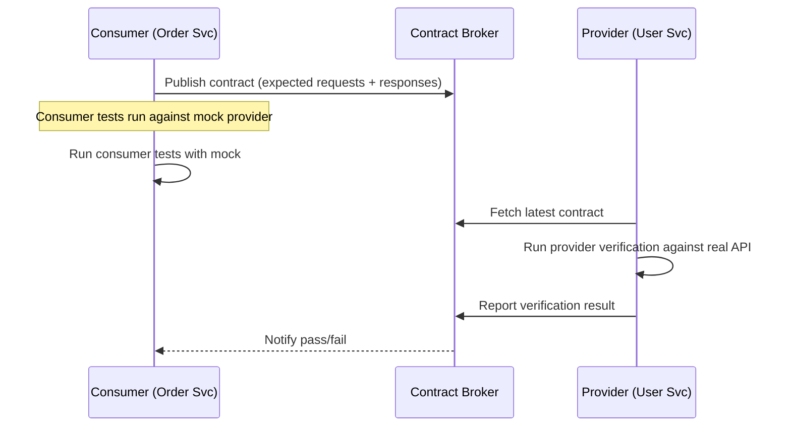

# POC #93: Contract Testing

> **Difficulty:** 🟡 Intermediate
> **Time:** 25 minutes
> **Prerequisites:** Node.js, API concepts, Testing basics

## 🗺️ Quick Overview



*Consumer owns the contract; provider verifies it — no shared test environment required.*

## ⚡ Quick Reference Implementation

```javascript
// Minimal contract definition — copy-paste template
const contract = new Contract('order-service', 'user-service')
  .addInteraction({
    description: 'Get user by ID',
    request: { method: 'GET', path: '/api/users/123' },
    response: {
      status: 200,
      body: {
        id: Matchers.uuid(),               // Any valid UUID — not exact value
        name: Matchers.type('John'),        // Any string
        email: Matchers.regex(/^.+@.+\..+$/, 'john@example.com')  // Valid email format
        // Only include fields the consumer actually uses!
      }
    }
  });

// Consumer test: run against mock (no real provider needed)
const mock = new MockProvider(contract.toJSON());
const res = mock.handle({ method: 'GET', path: '/api/users/123' });
assert(res.status === 200);

// Provider test: verify real implementation satisfies the contract
await verifier.verify(contract.toJSON());  // Runs in provider's CI pipeline
```

---

## What You'll Learn

Contract Testing verifies that services communicate correctly by defining and validating API contracts between consumers and providers. This catches integration issues before deployment.

```
CONTRACT TESTING FLOW:
┌─────────────────────────────────────────────────────────────────┐
│                                                                 │
│  CONSUMER                 CONTRACT                 PROVIDER     │
│  ────────                 ────────                 ────────     │
│                                                                 │
│  ┌─────────┐         ┌─────────────┐         ┌─────────┐       │
│  │ Order   │ ──1──▶  │  Contract   │ ◀──4─── │ User    │       │
│  │ Service │         │  Broker     │         │ Service │       │
│  └─────────┘         └─────────────┘         └─────────┘       │
│       │                    │                       │            │
│       │              ┌─────▼─────┐                │            │
│       │              │ Contracts │                │            │
│       │              │ - Request │                │            │
│       │              │ - Response│                │            │
│       │              └───────────┘                │            │
│       │                    │                       │            │
│       ▼                    ▼                       ▼            │
│  2. Generate          3. Store              5. Verify          │
│     contract             contract              against          │
│     from tests           version              contract          │
│                                                                 │
│  ✅ Both sides tested independently                            │
│  ✅ No need for running all services                           │
│  ✅ Fast feedback on breaking changes                          │
└─────────────────────────────────────────────────────────────────┘
```

---

## Implementation

```javascript
// contract-testing.js

// ==========================================
// CONTRACT DEFINITION
// ==========================================

class Contract {
  constructor(consumer, provider) {
    this.consumer = consumer;
    this.provider = provider;
    this.interactions = [];
    this.metadata = {
      createdAt: new Date().toISOString(),
      version: '1.0.0'
    };
  }

  addInteraction(interaction) {
    this.interactions.push({
      description: interaction.description,
      request: {
        method: interaction.request.method,
        path: interaction.request.path,
        headers: interaction.request.headers || {},
        query: interaction.request.query || {},
        body: interaction.request.body
      },
      response: {
        status: interaction.response.status,
        headers: interaction.response.headers || {},
        body: interaction.response.body,
        matchingRules: interaction.response.matchingRules || {}
      }
    });
    return this;
  }

  toJSON() {
    return {
      consumer: { name: this.consumer },
      provider: { name: this.provider },
      interactions: this.interactions,
      metadata: this.metadata
    };
  }
}

// ==========================================
// MATCHING RULES
// ==========================================

const Matchers = {
  // Type matching
  type: (example) => ({
    match: 'type',
    value: example
  }),

  // Regex matching
  regex: (pattern, example) => ({
    match: 'regex',
    regex: pattern,
    value: example
  }),

  // Integer matching
  integer: (example = 1) => ({
    match: 'integer',
    value: example
  }),

  // Decimal matching
  decimal: (example = 1.0) => ({
    match: 'decimal',
    value: example
  }),

  // Date matching
  date: (format = 'yyyy-MM-dd', example = '2024-01-15') => ({
    match: 'date',
    format,
    value: example
  }),

  // UUID matching
  uuid: (example = '550e8400-e29b-41d4-a716-446655440000') => ({
    match: 'regex',
    regex: '^[0-9a-f]{8}-[0-9a-f]{4}-[0-9a-f]{4}-[0-9a-f]{4}-[0-9a-f]{12}$',
    value: example
  }),

  // Array with min length
  eachLike: (example, min = 1) => ({
    match: 'type',
    min,
    value: [example]
  }),

  // Include in response
  includes: (value) => ({
    match: 'include',
    value
  })
};

// ==========================================
// CONTRACT VALIDATOR
// ==========================================

class ContractValidator {
  validate(actual, expected, rules = {}) {
    const errors = [];

    if (typeof expected === 'object' && expected !== null) {
      // Check for matching rules
      if (expected.match) {
        return this.validateWithRule(actual, expected);
      }

      // Object validation
      if (Array.isArray(expected)) {
        if (!Array.isArray(actual)) {
          return [{ path: '', message: 'Expected array' }];
        }
        // Validate array items
        for (let i = 0; i < expected.length && i < actual.length; i++) {
          const itemErrors = this.validate(actual[i], expected[i]);
          errors.push(...itemErrors.map(e => ({
            ...e,
            path: `[${i}]${e.path}`
          })));
        }
      } else {
        // Object validation
        for (const key of Object.keys(expected)) {
          if (!(key in actual)) {
            errors.push({ path: `.${key}`, message: 'Missing field' });
            continue;
          }
          const fieldErrors = this.validate(actual[key], expected[key]);
          errors.push(...fieldErrors.map(e => ({
            ...e,
            path: `.${key}${e.path}`
          })));
        }
      }
    } else {
      // Primitive validation
      if (actual !== expected) {
        errors.push({ path: '', message: `Expected ${expected}, got ${actual}` });
      }
    }

    return errors;
  }

  validateWithRule(actual, rule) {
    switch (rule.match) {
      case 'type':
        if (typeof actual !== typeof rule.value) {
          return [{ path: '', message: `Expected type ${typeof rule.value}` }];
        }
        break;

      case 'regex':
        if (!new RegExp(rule.regex).test(actual)) {
          return [{ path: '', message: `Does not match regex ${rule.regex}` }];
        }
        break;

      case 'integer':
        if (!Number.isInteger(actual)) {
          return [{ path: '', message: 'Expected integer' }];
        }
        break;

      case 'decimal':
        if (typeof actual !== 'number') {
          return [{ path: '', message: 'Expected number' }];
        }
        break;

      case 'include':
        if (!String(actual).includes(rule.value)) {
          return [{ path: '', message: `Expected to include ${rule.value}` }];
        }
        break;
    }

    return [];
  }
}

// ==========================================
// CONTRACT BROKER (Simplified)
// ==========================================

class ContractBroker {
  constructor() {
    this.contracts = new Map();  // key: consumer-provider -> versions
  }

  publish(contract) {
    const key = `${contract.consumer.name}-${contract.provider.name}`;
    if (!this.contracts.has(key)) {
      this.contracts.set(key, []);
    }
    this.contracts.get(key).push(contract);
    console.log(`📤 Published contract: ${key} v${contract.metadata.version}`);
  }

  getLatest(consumer, provider) {
    const key = `${consumer}-${provider}`;
    const versions = this.contracts.get(key) || [];
    return versions[versions.length - 1];
  }

  getAll() {
    const all = [];
    for (const [key, versions] of this.contracts) {
      all.push({ key, versions: versions.length, latest: versions[versions.length - 1] });
    }
    return all;
  }
}

// ==========================================
// CONSUMER TEST (Mock Provider)
// ==========================================

class MockProvider {
  constructor(contract) {
    this.contract = contract;
    this.interactions = new Map();

    for (const interaction of contract.interactions) {
      const key = `${interaction.request.method}:${interaction.request.path}`;
      this.interactions.set(key, interaction);
    }
  }

  // Simulate provider response
  handle(request) {
    const key = `${request.method}:${request.path}`;
    const interaction = this.interactions.get(key);

    if (!interaction) {
      return { status: 404, body: { error: 'No matching interaction' } };
    }

    // Validate request matches contract
    if (interaction.request.body) {
      const validator = new ContractValidator();
      const errors = validator.validate(request.body, interaction.request.body);
      if (errors.length > 0) {
        return { status: 400, body: { errors } };
      }
    }

    return {
      status: interaction.response.status,
      headers: interaction.response.headers,
      body: interaction.response.body
    };
  }
}

// ==========================================
// PROVIDER VERIFICATION
// ==========================================

class ProviderVerifier {
  constructor(provider, baseUrl) {
    this.provider = provider;
    this.baseUrl = baseUrl;
    this.validator = new ContractValidator();
  }

  async verify(contract) {
    const results = [];

    for (const interaction of contract.interactions) {
      console.log(`\n🔍 Verifying: ${interaction.description}`);

      try {
        // Make actual request to provider
        const response = await this.makeRequest(interaction.request);

        // Validate status
        if (response.status !== interaction.response.status) {
          results.push({
            interaction: interaction.description,
            success: false,
            error: `Status mismatch: expected ${interaction.response.status}, got ${response.status}`
          });
          continue;
        }

        // Validate body
        const bodyErrors = this.validator.validate(
          response.body,
          interaction.response.body
        );

        if (bodyErrors.length > 0) {
          results.push({
            interaction: interaction.description,
            success: false,
            errors: bodyErrors
          });
        } else {
          results.push({
            interaction: interaction.description,
            success: true
          });
        }
      } catch (error) {
        results.push({
          interaction: interaction.description,
          success: false,
          error: error.message
        });
      }
    }

    return results;
  }

  async makeRequest(request) {
    // Simulated for demo - in real code, use fetch/axios
    console.log(`   ${request.method} ${request.path}`);

    // Mock response for demo
    return {
      status: 200,
      body: {
        id: '123',
        name: 'Test User',
        email: 'test@example.com'
      }
    };
  }
}

// ==========================================
// DEMONSTRATION
// ==========================================

async function demonstrate() {
  console.log('='.repeat(60));
  console.log('CONTRACT TESTING');
  console.log('='.repeat(60));

  const broker = new ContractBroker();

  // === CONSUMER SIDE ===
  console.log('\n--- Consumer: Order Service ---');

  // Define contract from consumer's perspective
  const contract = new Contract('order-service', 'user-service')
    .addInteraction({
      description: 'Get user by ID',
      request: {
        method: 'GET',
        path: '/api/users/123'
      },
      response: {
        status: 200,
        body: {
          id: Matchers.uuid(),
          name: Matchers.type('John Doe'),
          email: Matchers.regex('^[\\w.-]+@[\\w.-]+\\.\\w+$', 'john@example.com'),
          createdAt: Matchers.date()
        }
      }
    })
    .addInteraction({
      description: 'Create user',
      request: {
        method: 'POST',
        path: '/api/users',
        body: {
          name: Matchers.type('Jane Doe'),
          email: Matchers.regex('^[\\w.-]+@[\\w.-]+\\.\\w+$', 'jane@example.com')
        }
      },
      response: {
        status: 201,
        body: {
          id: Matchers.uuid(),
          name: Matchers.type('Jane Doe'),
          email: Matchers.type('jane@example.com')
        }
      }
    });

  console.log('Contract interactions:');
  contract.interactions.forEach(i => console.log(`  - ${i.description}`));

  // Publish to broker
  broker.publish(contract.toJSON());

  // === CONSUMER TEST ===
  console.log('\n--- Consumer Test (with Mock) ---');

  const mockProvider = new MockProvider(contract.toJSON());

  // Test consumer code against mock
  const getResponse = mockProvider.handle({
    method: 'GET',
    path: '/api/users/123'
  });
  console.log('GET /api/users/123:', getResponse.status === 200 ? '✅ Pass' : '❌ Fail');

  const createResponse = mockProvider.handle({
    method: 'POST',
    path: '/api/users',
    body: { name: 'Test', email: 'test@test.com' }
  });
  console.log('POST /api/users:', createResponse.status === 201 ? '✅ Pass' : '❌ Fail');

  // === PROVIDER VERIFICATION ===
  console.log('\n--- Provider Verification ---');

  const verifier = new ProviderVerifier('user-service', 'http://localhost:3001');
  const latestContract = broker.getLatest('order-service', 'user-service');
  const results = await verifier.verify(latestContract);

  results.forEach(r => {
    console.log(`  ${r.interaction}: ${r.success ? '✅ Pass' : '❌ Fail'}`);
    if (!r.success && r.errors) {
      r.errors.forEach(e => console.log(`    - ${e.path}: ${e.message}`));
    }
  });

  // Summary
  console.log('\n--- Contract Summary ---');
  const allContracts = broker.getAll();
  allContracts.forEach(c => {
    console.log(`  ${c.key}: ${c.versions} version(s)`);
  });

  console.log('\n✅ Demo complete!');
}

demonstrate().catch(console.error);
```

---

## Pact Example

```javascript
// Using Pact library (real-world)
const { Pact } = require('@pact-foundation/pact');

const provider = new Pact({
  consumer: 'OrderService',
  provider: 'UserService',
  port: 1234
});

describe('User Service Contract', () => {
  beforeAll(() => provider.setup());
  afterAll(() => provider.finalize());

  it('returns user by ID', async () => {
    await provider.addInteraction({
      state: 'user 123 exists',
      uponReceiving: 'a request for user 123',
      withRequest: {
        method: 'GET',
        path: '/api/users/123'
      },
      willRespondWith: {
        status: 200,
        body: {
          id: Matchers.uuid(),
          name: Matchers.string('John')
        }
      }
    });

    // Test your consumer code
    const user = await userClient.getUser('123');
    expect(user.name).toBeDefined();
  });
});
```

---

## Consumer vs Provider Testing

| Aspect | Consumer Test | Provider Test |
|--------|---------------|---------------|
| **Runs** | Consumer CI | Provider CI |
| **Uses** | Mock provider | Real provider |
| **Validates** | Expected calls | Contract compliance |
| **Catches** | Wrong assumptions | Breaking changes |

---

## Best Practices

```
✅ DO:
├── Write contracts from consumer perspective
├── Use matchers for flexible validation
├── Version contracts
├── Fail build on contract violations
├── Run provider verification before deploy
└── Share contracts via broker

❌ DON'T:
├── Over-specify (exact values)
├── Skip provider states
├── Ignore contract versioning
├── Test implementation details
├── Couple contracts to database
└── Share mocks between tests
```

---

## 🎯 Interview Questions

### Implementation-Focused Interview Questions

#### Q1: What is consumer-driven contract testing and how does it differ from traditional API testing?

**What interviewers look for**: Understanding of who owns the contract and why the consumer-driven model catches more integration bugs.

**Answer framework**:
1. **Traditional testing**: provider writes tests for their own API — they verify what they think consumers need
2. **Consumer-driven contracts**: each consumer defines the interactions it needs from the provider; the provider runs these consumer-defined tests against its real implementation
3. Key insight: if OrderService only uses `GET /users/{id}` returning `{id, name, email}`, then UserService breaking the `createdAt` field won't break OrderService — consumer-driven contracts make this explicit
4. The contract is owned by the consumer, stored in a broker (Pact Broker), and the provider CI downloads and verifies it before every deploy

**Code snippet that impresses**:
```javascript
// Consumer writes: "here's what I need from UserService"
const contract = new Contract('order-service', 'user-service')
  .addInteraction({
    description: 'Get user for order',
    request: { method: 'GET', path: '/api/users/123' },
    response: {
      status: 200,
      body: { id: Matchers.uuid(), name: Matchers.type('John') }
      // Only fields order-service actually uses — not the full user schema
    }
  });
```

---

#### Q2: How do you handle breaking contract changes? What is semantic versioning for APIs?

**What interviewers look for**: Change management discipline and backward compatibility principles.

**Answer framework**:
1. **Non-breaking changes** (safe): add optional fields to responses, add new endpoints, add optional request headers
2. **Breaking changes** (dangerous): remove/rename fields, change field types, change required/optional semantics
3. **Process**: before removing a field, check if any consumer contract references it — if yes, coordinate with that team
4. **API versioning**: when breaking changes are necessary, version the API (`/v2/users`) and run both versions in parallel during migration

**Code snippet that impresses**:
```javascript
// Provider verification in CI — fails if contract is broken
// Run: pact-verifier --provider UserService --pact-broker http://broker
async function verifyContracts(provider, broker) {
  const contracts = await broker.getContractsFor(provider);
  const results = [];
  for (const contract of contracts) {
    const verificationResults = await verifier.verify(contract);
    results.push({ consumer: contract.consumer, passed: verificationResults.every(r => r.success) });
  }
  if (results.some(r => !r.passed)) {
    throw new Error('Provider verification failed — breaking contract change detected');
  }
}
```

---

#### Q3: How do you test both sides of a contract independently in CI/CD?

**What interviewers look for**: Understanding of the two-pipeline pattern and how contract tests replace shared integration environments.

**Answer framework**:
1. **Consumer pipeline**: consumer writes tests → generates contract pact file → publishes to Pact Broker → consumer tests run against mock provider (no real provider needed)
2. **Provider pipeline**: provider pulls latest contracts from Pact Broker → runs provider verification against real provider code → reports results to broker
3. Decoupled: neither team needs the other's service running; they communicate through the broker
4. Can-I-Deploy check: before promoting to production, query the broker `can-i-deploy --pacticipant OrderService --to production` — broker confirms all providers have verified against this consumer version

---

#### Q4: What are Pact Matchers and why do you use them instead of exact value matching?

**What interviewers look for**: Pragmatic test design — avoiding over-specification that makes contracts brittle.

**Answer framework**:
1. Exact value matching: `{ id: '550e8400-...' }` — breaks if a different valid UUID is returned; creates false failures
2. Type matchers: `Matchers.type('John')` — validates that `name` is a string, any string value passes
3. Regex matchers: `Matchers.regex(/^[\w]+@[\w]+\.\w+$/, 'john@example.com')` — validates format without hardcoding a value
4. Rule of thumb: use exact matching only for status codes and business-critical fields (e.g., a specific error code); use matchers for data values

---

#### Q5: How do you implement contract testing for asynchronous/event-driven services?

**What interviewers look for**: Awareness that contract testing goes beyond REST APIs.

**Answer framework**:
1. Async contracts define: what event a producer publishes and what structure the consumer expects
2. Consumer test: mock the message broker; assert that the consumer processes a test message with the expected shape correctly
3. Producer test: trigger the action that produces the event; assert the published message matches the contract structure
4. Pact supports async messaging contracts via `MessagePact`; the same broker stores and distributes them

**Code snippet that impresses**:
```javascript
// Consumer side — define what event shape I can handle
const messagePact = new MessageConsumerPact({
  consumer: 'notification-service',
  provider: 'order-service'
});

await messagePact
  .given('an order was created')
  .expectsToReceive('an OrderCreated event')
  .withContent({
    orderId: Matchers.uuid(),
    customerId: Matchers.uuid(),
    total: Matchers.decimal(99.99)
  })
  .verify(async (message) => {
    // Assert that notification-service can process this message
    await notificationHandler.onOrderCreated(message);
  });
```

---

## Related POCs

- [Integration Testing](/10-architecture/hands-on/integration-testing)
- [API Versioning](/07-api-design/hands-on/api-versioning-strategies)
- [gRPC Protocol Buffers](/07-api-design/hands-on/grpc-protocol-buffers)

## Further Reading

**Concept articles:**
- [Microservices Communication](/10-architecture/concepts/microservices-communication)
- [Microservices Architecture](/10-architecture/concepts/microservices-architecture)

**Interview prep:**
- [API Design: REST, GraphQL, gRPC](/12-interview-prep/system-design/fundamentals/api-design-rest-graphql-grpc)

**Failure modes:**
- [Cascading Failures](/10-architecture/failures/cascading-failures)
