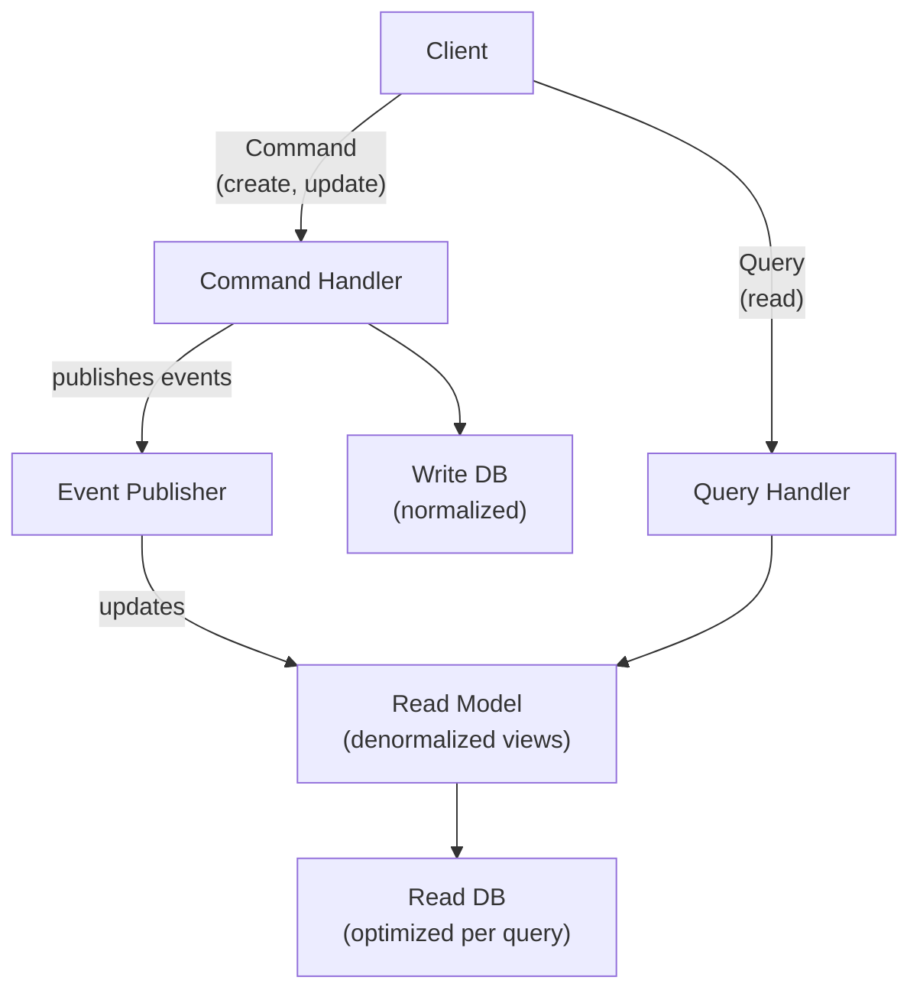

# POC #82: CQRS Pattern

> **Difficulty:** 🔴 Advanced
> **Time:** 30 minutes
> **Prerequisites:** Node.js, Event Sourcing basics

## 🗺️ Quick Overview



*Commands mutate write state through events; queries hit pre-computed read models for fast, join-free access.*

## What You'll Learn

CQRS (Command Query Responsibility Segregation) separates read and write operations into different models, allowing independent optimization.

```
TRADITIONAL ARCHITECTURE:
┌─────────────────────────────────────────────────────────────────┐
│                                                                 │
│  API ──────────────▶ Service ──────────────▶ Database          │
│                        │                        │               │
│                    Reads + Writes          Single Model         │
│                                                                 │
│  Problem: Read and write patterns are different!                │
│  - Reads: Complex queries, joins, aggregations                  │
│  - Writes: Business logic, validation, transactions             │
└─────────────────────────────────────────────────────────────────┘

CQRS ARCHITECTURE:
┌─────────────────────────────────────────────────────────────────┐
│                                                                 │
│  Commands ──▶ Command Handler ──▶ Write DB (Normalized)        │
│                     │                                           │
│                     ▼                                           │
│              Event Publisher                                    │
│                     │                                           │
│                     ▼                                           │
│  Queries ───▶ Query Handler ───▶ Read DB (Denormalized)        │
│                                                                 │
│  Benefits: Optimize each side independently!                    │
└─────────────────────────────────────────────────────────────────┘
```

---

## Implementation

```javascript
// cqrs-pattern.js

// ==========================================
// COMMAND SIDE (Write Model)
// ==========================================

// Commands - Intent to change state
class CreateOrderCommand {
  constructor(orderId, customerId, items) {
    this.type = 'CreateOrder';
    this.orderId = orderId;
    this.customerId = customerId;
    this.items = items;
    this.timestamp = new Date();
  }
}

class AddItemCommand {
  constructor(orderId, item) {
    this.type = 'AddItem';
    this.orderId = orderId;
    this.item = item;
    this.timestamp = new Date();
  }
}

class SubmitOrderCommand {
  constructor(orderId) {
    this.type = 'SubmitOrder';
    this.orderId = orderId;
    this.timestamp = new Date();
  }
}

// Write Model - Handles business logic
class Order {
  constructor() {
    this.id = null;
    this.customerId = null;
    this.items = [];
    this.status = null;
    this.total = 0;
    this.events = [];
  }

  static create(orderId, customerId, items) {
    const order = new Order();
    order.apply({
      type: 'OrderCreated',
      orderId,
      customerId,
      items,
      total: items.reduce((sum, i) => sum + i.price * i.quantity, 0)
    });
    return order;
  }

  addItem(item) {
    if (this.status !== 'draft') {
      throw new Error('Cannot modify submitted order');
    }
    this.apply({
      type: 'ItemAdded',
      orderId: this.id,
      item,
      newTotal: this.total + item.price * item.quantity
    });
  }

  submit() {
    if (this.status !== 'draft') {
      throw new Error('Order already submitted');
    }
    if (this.items.length === 0) {
      throw new Error('Cannot submit empty order');
    }
    this.apply({
      type: 'OrderSubmitted',
      orderId: this.id,
      submittedAt: new Date().toISOString()
    });
  }

  apply(event) {
    this.events.push(event);
    this.when(event);
  }

  when(event) {
    switch (event.type) {
      case 'OrderCreated':
        this.id = event.orderId;
        this.customerId = event.customerId;
        this.items = [...event.items];
        this.total = event.total;
        this.status = 'draft';
        break;
      case 'ItemAdded':
        this.items.push(event.item);
        this.total = event.newTotal;
        break;
      case 'OrderSubmitted':
        this.status = 'submitted';
        break;
    }
  }

  getUncommittedEvents() {
    const events = [...this.events];
    this.events = [];
    return events;
  }
}

// Command Handler - Orchestrates commands
class OrderCommandHandler {
  constructor(writeRepository, eventPublisher) {
    this.repository = writeRepository;
    this.eventPublisher = eventPublisher;
  }

  async handle(command) {
    console.log(`\n📥 Handling command: ${command.type}`);

    switch (command.type) {
      case 'CreateOrder':
        return this.handleCreateOrder(command);
      case 'AddItem':
        return this.handleAddItem(command);
      case 'SubmitOrder':
        return this.handleSubmitOrder(command);
      default:
        throw new Error(`Unknown command: ${command.type}`);
    }
  }

  async handleCreateOrder(cmd) {
    const order = Order.create(cmd.orderId, cmd.customerId, cmd.items);
    await this.repository.save(order);
    await this.publishEvents(order);
    return order.id;
  }

  async handleAddItem(cmd) {
    const order = await this.repository.load(cmd.orderId);
    if (!order) throw new Error('Order not found');
    order.addItem(cmd.item);
    await this.repository.save(order);
    await this.publishEvents(order);
  }

  async handleSubmitOrder(cmd) {
    const order = await this.repository.load(cmd.orderId);
    if (!order) throw new Error('Order not found');
    order.submit();
    await this.repository.save(order);
    await this.publishEvents(order);
  }

  async publishEvents(order) {
    const events = order.getUncommittedEvents();
    for (const event of events) {
      await this.eventPublisher.publish(event);
    }
  }
}

// ==========================================
// QUERY SIDE (Read Model)
// ==========================================

// Read Model - Optimized for queries
class OrderReadModel {
  constructor() {
    // Denormalized views
    this.orders = new Map();
    this.ordersByCustomer = new Map();
    this.ordersByStatus = new Map();
    this.dailyStats = new Map();
  }

  // Event handlers - Build read model from events
  handleEvent(event) {
    switch (event.type) {
      case 'OrderCreated':
        this.onOrderCreated(event);
        break;
      case 'ItemAdded':
        this.onItemAdded(event);
        break;
      case 'OrderSubmitted':
        this.onOrderSubmitted(event);
        break;
    }
  }

  onOrderCreated(event) {
    const order = {
      id: event.orderId,
      customerId: event.customerId,
      items: event.items,
      total: event.total,
      status: 'draft',
      itemCount: event.items.length,
      createdAt: new Date().toISOString()
    };

    // Main orders view
    this.orders.set(event.orderId, order);

    // By customer index
    if (!this.ordersByCustomer.has(event.customerId)) {
      this.ordersByCustomer.set(event.customerId, []);
    }
    this.ordersByCustomer.get(event.customerId).push(event.orderId);

    // By status index
    if (!this.ordersByStatus.has('draft')) {
      this.ordersByStatus.set('draft', []);
    }
    this.ordersByStatus.get('draft').push(event.orderId);

    console.log(`📊 Read model updated: Order ${event.orderId} created`);
  }

  onItemAdded(event) {
    const order = this.orders.get(event.orderId);
    if (order) {
      order.items.push(event.item);
      order.total = event.newTotal;
      order.itemCount = order.items.length;
    }
  }

  onOrderSubmitted(event) {
    const order = this.orders.get(event.orderId);
    if (order) {
      // Update status
      const oldStatus = order.status;
      order.status = 'submitted';
      order.submittedAt = event.submittedAt;

      // Update status index
      const oldIndex = this.ordersByStatus.get(oldStatus);
      if (oldIndex) {
        const idx = oldIndex.indexOf(event.orderId);
        if (idx > -1) oldIndex.splice(idx, 1);
      }

      if (!this.ordersByStatus.has('submitted')) {
        this.ordersByStatus.set('submitted', []);
      }
      this.ordersByStatus.get('submitted').push(event.orderId);

      // Update daily stats
      const date = event.submittedAt.split('T')[0];
      if (!this.dailyStats.has(date)) {
        this.dailyStats.set(date, { count: 0, revenue: 0 });
      }
      const stats = this.dailyStats.get(date);
      stats.count++;
      stats.revenue += order.total;
    }
  }
}

// Query Handler - Serves read requests
class OrderQueryHandler {
  constructor(readModel) {
    this.readModel = readModel;
  }

  // Get single order
  getOrder(orderId) {
    return this.readModel.orders.get(orderId);
  }

  // Get orders by customer
  getOrdersByCustomer(customerId) {
    const orderIds = this.readModel.ordersByCustomer.get(customerId) || [];
    return orderIds.map(id => this.readModel.orders.get(id));
  }

  // Get orders by status
  getOrdersByStatus(status) {
    const orderIds = this.readModel.ordersByStatus.get(status) || [];
    return orderIds.map(id => this.readModel.orders.get(id));
  }

  // Get dashboard stats
  getDashboardStats() {
    let totalOrders = 0;
    let totalRevenue = 0;
    let draftOrders = 0;
    let submittedOrders = 0;

    for (const [_, order] of this.readModel.orders) {
      totalOrders++;
      totalRevenue += order.total;
      if (order.status === 'draft') draftOrders++;
      if (order.status === 'submitted') submittedOrders++;
    }

    return {
      totalOrders,
      totalRevenue,
      draftOrders,
      submittedOrders,
      averageOrderValue: totalOrders > 0 ? totalRevenue / totalOrders : 0
    };
  }

  // Get daily stats (pre-computed)
  getDailyStats() {
    return Array.from(this.readModel.dailyStats.entries())
      .map(([date, stats]) => ({ date, ...stats }));
  }
}

// ==========================================
// INFRASTRUCTURE
// ==========================================

// Simple in-memory write repository
class OrderWriteRepository {
  constructor() {
    this.orders = new Map();
  }

  async save(order) {
    this.orders.set(order.id, order);
  }

  async load(orderId) {
    return this.orders.get(orderId);
  }
}

// Event Publisher (synchronizes read model)
class EventPublisher {
  constructor() {
    this.subscribers = [];
  }

  subscribe(handler) {
    this.subscribers.push(handler);
  }

  async publish(event) {
    console.log(`📤 Publishing event: ${event.type}`);
    for (const handler of this.subscribers) {
      handler(event);
    }
  }
}

// ==========================================
// DEMONSTRATION
// ==========================================

async function demonstrate() {
  console.log('='.repeat(60));
  console.log('CQRS PATTERN');
  console.log('='.repeat(60));

  // Setup infrastructure
  const writeRepository = new OrderWriteRepository();
  const eventPublisher = new EventPublisher();
  const readModel = new OrderReadModel();
  const commandHandler = new OrderCommandHandler(writeRepository, eventPublisher);
  const queryHandler = new OrderQueryHandler(readModel);

  // Connect read model to event publisher
  eventPublisher.subscribe(event => readModel.handleEvent(event));

  // === COMMAND SIDE ===
  console.log('\n--- COMMAND SIDE (Writes) ---');

  // Create order
  await commandHandler.handle(new CreateOrderCommand(
    'ORD-001',
    'CUST-123',
    [
      { name: 'Laptop', price: 999, quantity: 1 },
      { name: 'Mouse', price: 49, quantity: 2 }
    ]
  ));

  // Add item
  await commandHandler.handle(new AddItemCommand('ORD-001', {
    name: 'Keyboard',
    price: 79,
    quantity: 1
  }));

  // Submit order
  await commandHandler.handle(new SubmitOrderCommand('ORD-001'));

  // Create another order
  await commandHandler.handle(new CreateOrderCommand(
    'ORD-002',
    'CUST-123',
    [{ name: 'Monitor', price: 399, quantity: 1 }]
  ));

  // === QUERY SIDE ===
  console.log('\n--- QUERY SIDE (Reads) ---');

  // Get single order
  console.log('\nOrder ORD-001:', queryHandler.getOrder('ORD-001'));

  // Get orders by customer
  console.log('\nOrders for CUST-123:', queryHandler.getOrdersByCustomer('CUST-123'));

  // Get orders by status
  console.log('\nDraft orders:', queryHandler.getOrdersByStatus('draft'));
  console.log('Submitted orders:', queryHandler.getOrdersByStatus('submitted'));

  // Dashboard stats
  console.log('\nDashboard Stats:', queryHandler.getDashboardStats());

  console.log('\n✅ Demo complete!');
}

demonstrate().catch(console.error);
```

---

## CQRS vs Traditional Architecture

| Aspect | Traditional | CQRS |
|--------|-------------|------|
| **Model** | Single model for reads/writes | Separate read/write models |
| **Database** | One database | Can use different DBs |
| **Scaling** | Scale together | Scale independently |
| **Complexity** | Lower | Higher |
| **Query Performance** | Limited by normalization | Optimized denormalized views |

---

## When to Use CQRS

```
✅ GOOD FIT:
├── High read-to-write ratio (100:1 or more)
├── Complex queries with many joins
├── Different scaling needs for reads vs writes
├── Event Sourcing systems
└── Microservices with eventual consistency

❌ POOR FIT:
├── Simple CRUD applications
├── Low traffic systems
├── Strong consistency requirements
├── Small teams without DDD experience
└── Prototypes or MVPs
```

---

## Real-World Examples

```
AMAZON:
├── Write: Order placement (normalized, ACID)
├── Read: Product catalog (denormalized, cached)
└── Ratio: ~100 reads per write

TWITTER:
├── Write: Tweet creation (fan-out on write)
├── Read: Timeline (pre-computed per user)
└── Optimization: Eventual consistency OK

NETFLIX:
├── Write: User actions, ratings
├── Read: Recommendations (ML-optimized)
└── Separation: Different teams, different DBs
```

---

## ⚡ Quick Reference Implementation

```javascript
// Minimal CQRS wiring — copy-paste template
// Command side: validates, mutates, publishes events
async function handleCommand(command, writeRepo, eventBus) {
  const aggregate = await writeRepo.load(command.id);
  const events = aggregate.process(command);   // Business logic produces events
  await writeRepo.save(aggregate, events);
  for (const event of events) await eventBus.publish(event);
}

// Query side: read model updated by event handlers
eventBus.subscribe(event => readModel.apply(event));  // Eventual consistency

// Read: O(1) lookup — no joins, pre-denormalized
async function handleQuery(query, readModel) {
  return readModel.get(query);  // Return pre-computed view
}
```

---

## 🎯 Interview Questions

### Implementation-Focused Interview Questions

#### Q1: Why would you choose CQRS over a traditional single-model architecture? What are the actual performance gains?

**What interviewers look for**: Concrete numbers, not just "read and write can scale independently."

**Answer framework**:
1. **Read-to-write ratios**: most apps have 100:1 reads to writes; CQRS lets you scale them independently
2. **Read optimization**: the read model is denormalized — a single document or row contains everything needed for a view, eliminating expensive JOINs
3. **Write optimization**: the write model focuses on invariants and business logic, using normalized data with transactions
4. **Real gain**: Twitter timeline — without CQRS, fetching a timeline requires JOINing tweets + follows + user data; with CQRS (fan-out-on-write), the read model is a pre-computed list — O(1) instead of O(follows × tweets)

---

#### Q2: How do you handle the read model being out of sync with the write model (eventual consistency)?

**What interviewers look for**: Understanding of read-your-own-writes consistency and practical UX mitigations.

**Answer framework**:
1. **Don't over-engineer it**: most views are OK with 100-500ms staleness; show a spinner or optimistic UI
2. **Optimistic updates**: on command submission, immediately update the UI locally; the read model will catch up shortly
3. **Read-your-own-writes**: after a write, route the user's subsequent reads to the write model for 5-10s (or until the read model catches up)
4. **Version tracking**: include an `eventVersion` or `updatedAt` in the read model; client can poll until it sees the expected version

**Code snippet that impresses**:
```javascript
// After submitting a command, poll until read model reflects the change
async function waitForReadModel(orderId, expectedStatus, timeoutMs = 5000) {
  const deadline = Date.now() + timeoutMs;
  while (Date.now() < deadline) {
    const order = queryHandler.getOrder(orderId);
    if (order?.status === expectedStatus) return order;
    await sleep(100);
  }
  throw new Error('Read model did not converge in time');
}
```

---

#### Q3: How do you rebuild a corrupted or stale read model?

**What interviewers look for**: Event replay capability and the importance of event store durability.

**Answer framework**:
1. Clear the read model store (truncate table or flush Redis)
2. Replay all historical events from the event store, in order, from the beginning
3. The read model's event handlers reconstruct all views from scratch
4. This works because events are immutable and ordered — the event store is the source of truth, not the read model
5. Optimization: use snapshots to replay only from a recent checkpoint instead of the entire history

**Code snippet that impresses**:
```javascript
async function rebuildReadModel(eventStore, readModel) {
  await readModel.clear();  // Wipe all derived data
  let offset = 0;
  const batchSize = 1000;

  while (true) {
    const events = await eventStore.getEvents({ offset, limit: batchSize });
    if (events.length === 0) break;

    for (const event of events) {
      readModel.handleEvent(event);  // Deterministic replay
    }
    offset += events.length;
    console.log(`Rebuilt ${offset} events...`);
  }
  console.log('Read model rebuild complete');
}
```

---

#### Q4: What does the write side of CQRS look like with event sourcing? How does it differ from a traditional write model?

**What interviewers look for**: Understanding the event sourcing connection and aggregate reconstitution.

**Answer framework**:
1. **Traditional write model**: stores current state; UPDATE overwrites previous values; history is lost
2. **Event-sourced write model**: stores all events that happened; current state is computed by replaying events from the beginning (or from a snapshot)
3. Aggregate reconstitution: load events from store → apply each to empty aggregate → resulting state is current state
4. Benefit: full audit trail, time-travel queries, ability to replay to any point in history

---

#### Q5: When is CQRS the wrong choice?

**What interviewers look for**: Honest trade-off awareness — juniors oversell patterns, seniors know when not to use them.

**Answer framework**:
1. **Simple CRUD apps**: adding CQRS to a user settings form is pure overhead — you're not gaining scalability at this scale
2. **Strong consistency requirements**: if a read immediately after a write MUST return the updated value (e.g., bank balance), eventual consistency is a problem
3. **Small teams**: CQRS doubles the surface area (two models, event contracts, replay logic) — a team of 2-3 engineers shouldn't be maintaining this
4. **Rule of thumb**: use CQRS when your read:write ratio exceeds 10:1 AND your queries are complex enough that a single model can't efficiently serve both

---

## Related POCs

- [Event Sourcing Basics](/04-messaging/hands-on/event-sourcing-basics)
- [Saga Pattern](/10-architecture/hands-on/saga-pattern)
- [Outbox Pattern](/04-messaging/hands-on/outbox-pattern)

## Further Reading

**Concept articles:**
- [CQRS Deep Dive](/10-architecture/concepts/cqrs)
- [Event-Driven Architecture](/10-architecture/concepts/event-driven-architecture)

**Interview prep:**
- [Distributed Tracing and Architecture](/12-interview-prep/system-design/scale-and-reliability/distributed-tracing)

**Failure modes:**
- [Stale Read After Write](/10-architecture/failures/split-brain)
