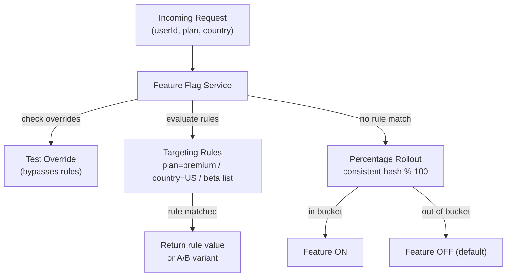

# POC #96: Feature Flags

> **Difficulty:** 🟡 Intermediate
> **Time:** 25 minutes
> **Prerequisites:** Node.js, Configuration management basics

## 🗺️ Quick Overview



*Evaluate targeting rules first, then fall through to percentage rollout for gradual, safe releases.*

## What You'll Learn

Feature flags enable runtime control of features without deployment. This covers flag types, targeting rules, gradual rollouts, and A/B testing.

```
FEATURE FLAG SYSTEM:
┌─────────────────────────────────────────────────────────────────┐
│                                                                 │
│  FLAG TYPES:                                                    │
│  ───────────                                                    │
│                                                                 │
│  RELEASE FLAG         EXPERIMENT FLAG       OPS FLAG            │
│  ────────────         ───────────────       ────────            │
│  ┌───┐                ┌───┐                 ┌───┐               │
│  │ON │ New feature    │50%│ A/B test        │OFF│ Kill switch   │
│  └───┘                └───┘                 └───┘               │
│                                                                 │
│  TARGETING:                                                     │
│  ──────────                                                     │
│                                                                 │
│  ┌─────────────────────────────────────────────────────────┐   │
│  │  if user.country == "US" AND user.plan == "premium"     │   │
│  │    → enable feature                                      │   │
│  │  else if user.id in [1, 2, 3]  (beta testers)           │   │
│  │    → enable feature                                      │   │
│  │  else                                                    │   │
│  │    → 10% rollout                                         │   │
│  └─────────────────────────────────────────────────────────┘   │
│                                                                 │
└─────────────────────────────────────────────────────────────────┘
```

---

## Implementation

```javascript
// feature-flags.js

// ==========================================
// FLAG DEFINITIONS
// ==========================================

class Flag {
  constructor(config) {
    this.key = config.key;
    this.name = config.name;
    this.description = config.description;
    this.type = config.type || 'boolean';  // boolean, string, number, json
    this.defaultValue = config.defaultValue;
    this.enabled = config.enabled ?? true;
    this.rules = config.rules || [];
    this.variants = config.variants || [];
    this.rolloutPercentage = config.rolloutPercentage ?? 100;
    this.metadata = config.metadata || {};
  }
}

// ==========================================
// FEATURE FLAG SERVICE
// ==========================================

class FeatureFlagService {
  constructor(options = {}) {
    this.flags = new Map();
    this.overrides = new Map();  // For testing
    this.evaluationCache = new Map();
    this.cacheTTL = options.cacheTTL || 60000;  // 1 minute
    this.listeners = [];
  }

  // Register a flag
  register(flag) {
    this.flags.set(flag.key, flag);
    console.log(`🚩 Registered flag: ${flag.key}`);
    return this;
  }

  // Evaluate a flag for a user
  evaluate(flagKey, user = {}, defaultValue = null) {
    // Check overrides first (for testing)
    if (this.overrides.has(flagKey)) {
      return this.overrides.get(flagKey);
    }

    const flag = this.flags.get(flagKey);
    if (!flag) {
      console.warn(`Flag not found: ${flagKey}`);
      return defaultValue;
    }

    // Check if flag is globally disabled
    if (!flag.enabled) {
      return flag.defaultValue;
    }

    // Check cache
    const cacheKey = `${flagKey}:${JSON.stringify(user)}`;
    const cached = this.evaluationCache.get(cacheKey);
    if (cached && Date.now() - cached.timestamp < this.cacheTTL) {
      return cached.value;
    }

    // Evaluate rules
    const result = this.evaluateRules(flag, user);

    // Cache result
    this.evaluationCache.set(cacheKey, {
      value: result,
      timestamp: Date.now()
    });

    return result;
  }

  evaluateRules(flag, user) {
    // Check targeting rules in order
    for (const rule of flag.rules) {
      if (this.matchesRule(rule, user)) {
        if (rule.variant) {
          return this.getVariantValue(flag, rule.variant);
        }
        return rule.value ?? true;
      }
    }

    // Check percentage rollout
    if (flag.rolloutPercentage < 100) {
      const hash = this.hashUser(user.id || 'anonymous', flag.key);
      const bucket = hash % 100;

      if (bucket >= flag.rolloutPercentage) {
        return flag.defaultValue;
      }
    }

    // Return default variant or value
    if (flag.variants.length > 0) {
      return this.selectVariant(flag, user);
    }

    return flag.defaultValue ?? true;
  }

  matchesRule(rule, user) {
    for (const condition of rule.conditions || []) {
      const userValue = this.getNestedValue(user, condition.attribute);

      switch (condition.operator) {
        case 'equals':
          if (userValue !== condition.value) return false;
          break;
        case 'not_equals':
          if (userValue === condition.value) return false;
          break;
        case 'in':
          if (!condition.values.includes(userValue)) return false;
          break;
        case 'not_in':
          if (condition.values.includes(userValue)) return false;
          break;
        case 'greater_than':
          if (userValue <= condition.value) return false;
          break;
        case 'less_than':
          if (userValue >= condition.value) return false;
          break;
        case 'contains':
          if (!String(userValue).includes(condition.value)) return false;
          break;
        case 'regex':
          if (!new RegExp(condition.value).test(userValue)) return false;
          break;
        default:
          return false;
      }
    }
    return true;
  }

  getNestedValue(obj, path) {
    return path.split('.').reduce((o, k) => o?.[k], obj);
  }

  // Consistent hashing for percentage rollouts
  hashUser(userId, flagKey) {
    const str = `${userId}:${flagKey}`;
    let hash = 0;
    for (let i = 0; i < str.length; i++) {
      hash = ((hash << 5) - hash) + str.charCodeAt(i);
      hash = hash & hash;
    }
    return Math.abs(hash);
  }

  // A/B testing variant selection
  selectVariant(flag, user) {
    const hash = this.hashUser(user.id || 'anonymous', flag.key);
    const totalWeight = flag.variants.reduce((sum, v) => sum + (v.weight || 1), 0);
    let bucket = hash % totalWeight;

    for (const variant of flag.variants) {
      bucket -= variant.weight || 1;
      if (bucket < 0) {
        return variant.value;
      }
    }

    return flag.variants[0]?.value ?? flag.defaultValue;
  }

  getVariantValue(flag, variantKey) {
    const variant = flag.variants.find(v => v.key === variantKey);
    return variant?.value ?? flag.defaultValue;
  }

  // Override for testing
  setOverride(flagKey, value) {
    this.overrides.set(flagKey, value);
  }

  clearOverride(flagKey) {
    this.overrides.delete(flagKey);
  }

  clearAllOverrides() {
    this.overrides.clear();
  }

  // Get all flags (for admin UI)
  getAllFlags() {
    return Array.from(this.flags.values()).map(f => ({
      key: f.key,
      name: f.name,
      enabled: f.enabled,
      rolloutPercentage: f.rolloutPercentage,
      rulesCount: f.rules.length
    }));
  }

  // Update flag at runtime
  updateFlag(flagKey, updates) {
    const flag = this.flags.get(flagKey);
    if (!flag) throw new Error(`Flag not found: ${flagKey}`);

    Object.assign(flag, updates);
    this.evaluationCache.clear();  // Clear cache
    this.notifyListeners(flagKey, flag);

    console.log(`📝 Updated flag: ${flagKey}`);
  }

  // Subscribe to flag changes
  subscribe(callback) {
    this.listeners.push(callback);
    return () => {
      this.listeners = this.listeners.filter(l => l !== callback);
    };
  }

  notifyListeners(flagKey, flag) {
    for (const listener of this.listeners) {
      listener(flagKey, flag);
    }
  }
}

// ==========================================
// EXPRESS MIDDLEWARE
// ==========================================

function featureFlagMiddleware(flagService) {
  return (req, res, next) => {
    // Attach flag evaluation helper to request
    req.isFeatureEnabled = (flagKey, defaultValue = false) => {
      return flagService.evaluate(flagKey, req.user || {}, defaultValue);
    };

    req.getFeatureValue = (flagKey, defaultValue = null) => {
      return flagService.evaluate(flagKey, req.user || {}, defaultValue);
    };

    next();
  };
}

// ==========================================
// DEMONSTRATION
// ==========================================

async function demonstrate() {
  console.log('='.repeat(60));
  console.log('FEATURE FLAGS');
  console.log('='.repeat(60));

  const flagService = new FeatureFlagService();

  // Register flags
  console.log('\n--- Registering Flags ---');

  flagService
    .register(new Flag({
      key: 'new-checkout',
      name: 'New Checkout Flow',
      description: 'Redesigned checkout experience',
      defaultValue: false,
      rolloutPercentage: 25,  // 25% of users
      rules: [
        {
          conditions: [{ attribute: 'plan', operator: 'equals', value: 'premium' }],
          value: true  // All premium users get it
        },
        {
          conditions: [{ attribute: 'id', operator: 'in', values: ['beta-1', 'beta-2'] }],
          value: true  // Beta testers
        }
      ]
    }))
    .register(new Flag({
      key: 'button-color',
      name: 'CTA Button Color Test',
      type: 'string',
      defaultValue: 'blue',
      variants: [
        { key: 'control', value: 'blue', weight: 50 },
        { key: 'variant-a', value: 'green', weight: 25 },
        { key: 'variant-b', value: 'orange', weight: 25 }
      ]
    }))
    .register(new Flag({
      key: 'api-rate-limit',
      name: 'API Rate Limit',
      type: 'number',
      defaultValue: 100,
      rules: [
        {
          conditions: [{ attribute: 'plan', operator: 'equals', value: 'enterprise' }],
          value: 10000
        },
        {
          conditions: [{ attribute: 'plan', operator: 'equals', value: 'premium' }],
          value: 1000
        }
      ]
    }))
    .register(new Flag({
      key: 'maintenance-mode',
      name: 'Maintenance Mode',
      description: 'Kill switch for maintenance',
      defaultValue: false,
      enabled: true
    }));

  // Test evaluations
  console.log('\n--- Flag Evaluations ---');

  const users = [
    { id: 'user-1', plan: 'free', country: 'US' },
    { id: 'user-2', plan: 'premium', country: 'UK' },
    { id: 'beta-1', plan: 'free', country: 'US' },
    { id: 'user-3', plan: 'enterprise', country: 'DE' }
  ];

  for (const user of users) {
    const checkout = flagService.evaluate('new-checkout', user);
    const buttonColor = flagService.evaluate('button-color', user);
    const rateLimit = flagService.evaluate('api-rate-limit', user);

    console.log(`\n  User: ${user.id} (${user.plan})`);
    console.log(`    new-checkout: ${checkout}`);
    console.log(`    button-color: ${buttonColor}`);
    console.log(`    api-rate-limit: ${rateLimit}`);
  }

  // A/B test distribution
  console.log('\n--- A/B Test Distribution ---');
  const distribution = { blue: 0, green: 0, orange: 0 };

  for (let i = 0; i < 1000; i++) {
    const color = flagService.evaluate('button-color', { id: `test-${i}` });
    distribution[color]++;
  }

  console.log('  Button color distribution (1000 users):');
  for (const [color, count] of Object.entries(distribution)) {
    const bar = '█'.repeat(Math.round(count / 20));
    console.log(`    ${color.padEnd(8)}: ${bar} ${count}`);
  }

  // Rollout percentage test
  console.log('\n--- Rollout Percentage (25%) ---');
  let enabledCount = 0;

  for (let i = 0; i < 1000; i++) {
    const enabled = flagService.evaluate('new-checkout', { id: `rollout-${i}`, plan: 'free' });
    if (enabled) enabledCount++;
  }

  console.log(`  Enabled for ${enabledCount}/1000 users (~${(enabledCount / 10).toFixed(1)}%)`);

  // Runtime update
  console.log('\n--- Runtime Flag Update ---');
  flagService.updateFlag('maintenance-mode', { defaultValue: true });
  console.log('  maintenance-mode:', flagService.evaluate('maintenance-mode', {}));

  // Override for testing
  console.log('\n--- Test Override ---');
  flagService.setOverride('new-checkout', true);
  console.log('  new-checkout (with override):', flagService.evaluate('new-checkout', { id: 'any' }));
  flagService.clearOverride('new-checkout');

  console.log('\n✅ Demo complete!');
}

demonstrate().catch(console.error);
```

---

## Flag Types

| Type | Use Case | Lifecycle |
|------|----------|-----------|
| **Release** | New features | Remove after full rollout |
| **Experiment** | A/B tests | Remove after analysis |
| **Ops** | Kill switches | Keep permanently |
| **Permission** | Entitlements | Keep permanently |

---

## Best Practices

```
✅ DO:
├── Use meaningful flag names
├── Set expiration dates
├── Clean up old flags
├── Log flag evaluations
├── Use consistent targeting
└── Test both branches

❌ DON'T:
├── Leave flags forever
├── Nest flags deeply
├── Use for config values
├── Skip documentation
├── Ignore flag debt
└── Forget to clean up
```

---

## ⚡ Quick Reference Implementation

```javascript
// Minimal feature flag evaluator — copy-paste template
class FeatureFlag {
  constructor(key, { defaultValue = false, rolloutPct = 100, rules = [] } = {}) {
    this.key = key;
    this.defaultValue = defaultValue;
    this.rolloutPct = rolloutPct;
    this.rules = rules;  // [{ match: (user) => bool, value: any }]
  }

  evaluate(user = {}) {
    // 1. Check targeted rules first
    for (const rule of this.rules) {
      if (rule.match(user)) return rule.value;
    }
    // 2. Percentage rollout via consistent hash
    const hash = this._hash(`${user.id}:${this.key}`);
    return (hash % 100) < this.rolloutPct ? true : this.defaultValue;
  }

  _hash(str) {
    let h = 5381;
    for (const c of str) h = ((h << 5) + h) + c.charCodeAt(0);
    return Math.abs(h);
  }
}
```

---

## 🎯 Interview Questions

### Implementation-Focused Interview Questions

#### Q1: How do you implement a feature flag that gradually rolls out to 10% of users, ensuring the same user always gets the same experience?

**What interviewers look for**: Consistent hashing for deterministic bucketing, not random per-request.

**Answer framework**:
1. Hash `userId + flagKey` together (not just userId — prevents all flags toggling at the same percentage threshold)
2. `bucket = hash(userId + ":" + flagKey) % 100` — if bucket < rolloutPct, return true
3. Including the flag key means user-123 might be in bucket 30 for flag A but bucket 70 for flag B
4. This is deterministic: same user, same flag → same bucket every time, regardless of when or where evaluated

**Code snippet that impresses**:
```javascript
// Include flagKey in hash to avoid correlated buckets across flags
function getUserBucket(userId, flagKey) {
  const input = `${userId}:${flagKey}`;
  let hash = 5381;
  for (const c of input) hash = ((hash << 5) + hash) + c.charCodeAt(0);
  return Math.abs(hash) % 100;
}

function isEnabled(userId, flagKey, rolloutPercent) {
  return getUserBucket(userId, flagKey) < rolloutPercent;
}
// isEnabled('user-123', 'new-ui', 10) → consistent true/false for this user
```

---

#### Q2: What are the different types of feature flags and when should you use each?

**What interviewers look for**: Taxonomy knowledge and lifecycle management awareness.

**Answer framework**:
1. **Release flags**: gate new features during gradual rollout; short-lived — remove after 100% rollout
2. **Experiment flags (A/B)**: test variant behavior for product metrics; time-boxed — remove after analysis
3. **Ops flags (kill switches)**: disable expensive or broken features under load; permanent — keep as circuit breakers
4. **Permission flags**: entitlements per plan/tier (premium features); permanent — managed by product data

**Code snippet that impresses**:
```javascript
// Ops flag as a kill switch — no user targeting needed, just a global toggle
const flags = {
  'recommendations-enabled': { type: 'ops', defaultValue: true },
  'new-checkout': { type: 'release', rolloutPct: 25 },
  'checkout-button-color': { type: 'experiment', variants: ['blue', 'green'] },
  'advanced-analytics': { type: 'permission', rules: [{ plan: 'enterprise', value: true }] }
};
```

---

#### Q3: How do you handle flag evaluation latency? What's the difference between a local SDK and a remote API call?

**What interviewers look for**: Performance sensitivity — flag evaluation happens on every request.

**Answer framework**:
1. **Remote API (naïve)**: call a flag service on every request — adds 10-50ms latency, single point of failure
2. **Local SDK with polling**: SDK caches flags in-memory, polls for updates every 30s — sub-millisecond evaluation, stale by up to 30s
3. **Local SDK with streaming**: flag service pushes updates via SSE/WebSocket — near-real-time with local evaluation speed
4. LaunchDarkly and Unleash both use the local SDK + streaming approach for production safety

---

#### Q4: How do you prevent "flag debt" — the accumulation of stale flags that nobody removes?

**What interviewers look for**: Process discipline and operational maturity beyond just technical implementation.

**Answer framework**:
1. Set an expiry date on every flag at creation time — flag as tech debt in the backlog when it expires
2. Track flag usage: log every evaluation; alert if a flag hasn't been evaluated in 30 days (dead flag)
3. Fail-fast in dev: throw an error in development if a flag is past its expiry date
4. Regular audits: make flag cleanup part of sprint planning (treat flags like TODO comments)

---

#### Q5: How would you test code that uses feature flags to ensure both the enabled and disabled paths are covered?

**What interviewers look for**: Testing discipline for branching code paths and avoiding flag-coupled test failures.

**Answer framework**:
1. Use the override mechanism (`setOverride(flagKey, value)`) in tests to force specific paths
2. Write two test variants for every feature-flagged path: one with flag=true, one with flag=false
3. Never use real user IDs in tests that rely on percentage rollout — override explicitly
4. Integration tests: test the full system with flag on vs. flag off as separate test suites

**Code snippet that impresses**:
```javascript
// Test both flag branches explicitly — never rely on rollout percentages in tests
describe('checkout', () => {
  it('shows new UI when flag is ON', () => {
    flags.setOverride('new-checkout', true);
    const result = renderCheckout(user);
    expect(result).toMatchSnapshot('new-checkout-ui');
    flags.clearOverride('new-checkout');
  });

  it('shows legacy UI when flag is OFF', () => {
    flags.setOverride('new-checkout', false);
    const result = renderCheckout(user);
    expect(result).toMatchSnapshot('legacy-checkout-ui');
    flags.clearOverride('new-checkout');
  });
});
```

---

## Related POCs

- [Graceful Degradation](/10-architecture/hands-on/graceful-degradation)
- [Blue-Green Deployment](/10-architecture/hands-on/blue-green-deployment)
- [Canary Releases](/10-architecture/hands-on/canary-releases)

## Further Reading

**Concept articles:**
- [Feature Flag Architecture](/10-architecture/concepts/feature-flag-architecture)
- [Deployment Strategies Deep Dive](/10-architecture/concepts/deployment-strategies-deep-dive)

**Interview prep:**
- [API Gateway Pattern](/12-interview-prep/system-design/fundamentals/api-gateway-pattern)

**Failure modes:**
- [Cascading Failures](/10-architecture/failures/cascading-failures)
