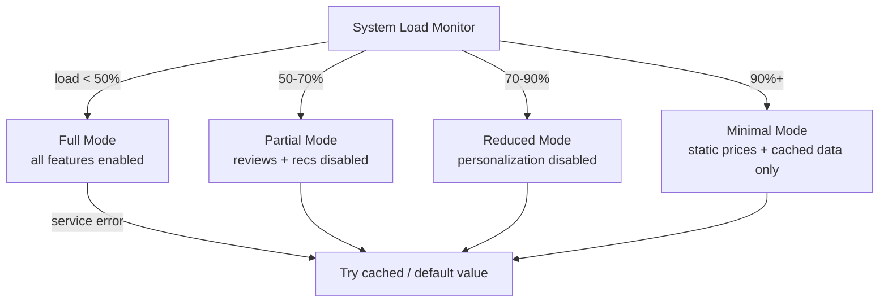

# POC #78: Graceful Degradation

> **Difficulty:** 🟡 Intermediate
> **Time:** 20 minutes
> **Prerequisites:** Node.js, Circuit breaker concepts

## 🗺️ Quick Overview



*Drop non-critical features under load in priority order so the core user journey always works.*

## What You'll Learn

Graceful degradation keeps your system functional when dependencies fail, by falling back to cached data, default values, or reduced functionality.

```
GRACEFUL DEGRADATION:
┌─────────────────────────────────────────────────────────────────┐
│                                                                 │
│  Full Functionality          Degraded Mode         Minimal Mode │
│  ──────────────────          ─────────────         ──────────── │
│                                                                 │
│  Recommendations: ✅         Recommendations: ❌   Static page   │
│  Personalization: ✅         Personalization: ❌   Basic checkout│
│  Real-time prices: ✅        Cached prices: ✅     Fixed prices  │
│  Live inventory: ✅          Cached inventory: ✅  "In stock"    │
│                                                                 │
│  100% features              70% features           30% features │
│  All services up            Some services down     Major outage │
│                                                                 │
└─────────────────────────────────────────────────────────────────┘
```

---

## Implementation

```javascript
// graceful-degradation.js

// ==========================================
// FEATURE FLAGS FOR DEGRADATION
// ==========================================

class FeatureFlags {
  constructor() {
    this.flags = new Map([
      ['recommendations', { enabled: true, fallback: 'popular' }],
      ['personalization', { enabled: true, fallback: 'generic' }],
      ['realtime-inventory', { enabled: true, fallback: 'cached' }],
      ['dynamic-pricing', { enabled: true, fallback: 'base-price' }],
      ['reviews', { enabled: true, fallback: 'none' }]
    ]);
  }

  isEnabled(feature) {
    return this.flags.get(feature)?.enabled ?? false;
  }

  disable(feature) {
    const flag = this.flags.get(feature);
    if (flag) {
      flag.enabled = false;
      console.log(`🔴 DISABLED: ${feature} (fallback: ${flag.fallback})`);
    }
  }

  enable(feature) {
    const flag = this.flags.get(feature);
    if (flag) {
      flag.enabled = true;
      console.log(`🟢 ENABLED: ${feature}`);
    }
  }

  getFallback(feature) {
    return this.flags.get(feature)?.fallback;
  }
}

// ==========================================
// DEGRADABLE SERVICE
// ==========================================

class ProductService {
  constructor(featureFlags) {
    this.flags = featureFlags;
    this.cache = new Map();
    this.baseProducts = [
      { id: 1, name: 'Laptop', basePrice: 999 },
      { id: 2, name: 'Phone', basePrice: 599 },
      { id: 3, name: 'Tablet', basePrice: 399 }
    ];
  }

  async getProduct(productId) {
    const base = this.baseProducts.find(p => p.id === productId);
    if (!base) return null;

    const product = { ...base };

    // Dynamic pricing (degradable)
    if (this.flags.isEnabled('dynamic-pricing')) {
      try {
        product.price = await this.getDynamicPrice(productId);
      } catch (e) {
        console.log(`⚠️ Dynamic pricing failed, using base price`);
        product.price = base.basePrice;
        product.priceSource = 'fallback';
      }
    } else {
      product.price = base.basePrice;
      product.priceSource = 'base';
    }

    // Real-time inventory (degradable)
    if (this.flags.isEnabled('realtime-inventory')) {
      try {
        product.inventory = await this.getRealtimeInventory(productId);
      } catch (e) {
        console.log(`⚠️ Inventory service failed, using cached`);
        product.inventory = this.cache.get(`inventory:${productId}`) || { available: true, count: 'unknown' };
        product.inventorySource = 'cached';
      }
    } else {
      product.inventory = { available: true, count: 'unknown' };
      product.inventorySource = 'degraded';
    }

    // Reviews (degradable, non-critical)
    if (this.flags.isEnabled('reviews')) {
      try {
        product.reviews = await this.getReviews(productId);
      } catch (e) {
        product.reviews = [];
        product.reviewsSource = 'unavailable';
      }
    } else {
      product.reviews = [];
      product.reviewsSource = 'disabled';
    }

    return product;
  }

  // Simulated external services
  async getDynamicPrice(productId) {
    // Simulate occasional failure
    if (Math.random() < 0.3) throw new Error('Pricing service unavailable');
    await new Promise(r => setTimeout(r, 100));
    return this.baseProducts.find(p => p.id === productId).basePrice * (1 + Math.random() * 0.1);
  }

  async getRealtimeInventory(productId) {
    if (Math.random() < 0.2) throw new Error('Inventory service unavailable');
    await new Promise(r => setTimeout(r, 50));
    const count = Math.floor(Math.random() * 100);
    const result = { available: count > 0, count };
    this.cache.set(`inventory:${productId}`, result);  // Cache for fallback
    return result;
  }

  async getReviews(productId) {
    if (Math.random() < 0.4) throw new Error('Reviews service unavailable');
    await new Promise(r => setTimeout(r, 200));
    return [{ rating: 5, text: 'Great product!' }];
  }
}

// ==========================================
// RECOMMENDATION SERVICE (DEGRADABLE)
// ==========================================

class RecommendationService {
  constructor(featureFlags) {
    this.flags = featureFlags;
    this.popularProducts = [1, 2, 3];  // Fallback: popular items
  }

  async getRecommendations(userId) {
    if (!this.flags.isEnabled('recommendations')) {
      return {
        items: this.popularProducts,
        source: 'popular-fallback',
        personalized: false
      };
    }

    if (!this.flags.isEnabled('personalization')) {
      return {
        items: this.popularProducts,
        source: 'popular-no-personalization',
        personalized: false
      };
    }

    try {
      // Try personalized recommendations
      const personalized = await this.getPersonalizedRecs(userId);
      return {
        items: personalized,
        source: 'ml-model',
        personalized: true
      };
    } catch (e) {
      console.log(`⚠️ Personalization failed, using popular items`);
      return {
        items: this.popularProducts,
        source: 'popular-fallback',
        personalized: false
      };
    }
  }

  async getPersonalizedRecs(userId) {
    if (Math.random() < 0.3) throw new Error('ML service unavailable');
    await new Promise(r => setTimeout(r, 300));
    return [2, 3, 1];  // Simulated personalized order
  }
}

// ==========================================
// LOAD SHEDDING
// ==========================================

class LoadShedder {
  constructor(featureFlags, thresholds) {
    this.flags = featureFlags;
    this.thresholds = thresholds || {
      'reviews': 0.5,           // Disable at 50% load
      'recommendations': 0.6,   // Disable at 60% load
      'personalization': 0.7,   // Disable at 70% load
      'dynamic-pricing': 0.8,   // Disable at 80% load
      'realtime-inventory': 0.9 // Disable at 90% load
    };
  }

  adjustForLoad(loadPercent) {
    console.log(`\n📊 Current load: ${(loadPercent * 100).toFixed(0)}%`);

    for (const [feature, threshold] of Object.entries(this.thresholds)) {
      if (loadPercent >= threshold) {
        if (this.flags.isEnabled(feature)) {
          this.flags.disable(feature);
        }
      } else {
        if (!this.flags.isEnabled(feature)) {
          this.flags.enable(feature);
        }
      }
    }
  }
}

// ==========================================
// DEMONSTRATION
// ==========================================

async function demonstrate() {
  console.log('='.repeat(60));
  console.log('GRACEFUL DEGRADATION');
  console.log('='.repeat(60));

  const flags = new FeatureFlags();
  const productService = new ProductService(flags);
  const recService = new RecommendationService(flags);
  const loadShedder = new LoadShedder(flags);

  // Scenario 1: Normal operation
  console.log('\n--- Scenario 1: Normal Load (30%) ---');
  loadShedder.adjustForLoad(0.3);

  let product = await productService.getProduct(1);
  console.log('Product:', JSON.stringify(product, null, 2));

  let recs = await recService.getRecommendations('user-123');
  console.log('Recommendations:', recs);

  // Scenario 2: High load
  console.log('\n--- Scenario 2: High Load (75%) ---');
  loadShedder.adjustForLoad(0.75);

  product = await productService.getProduct(1);
  console.log('Product:', JSON.stringify(product, null, 2));

  recs = await recService.getRecommendations('user-123');
  console.log('Recommendations:', recs);

  // Scenario 3: Critical load
  console.log('\n--- Scenario 3: Critical Load (95%) ---');
  loadShedder.adjustForLoad(0.95);

  product = await productService.getProduct(1);
  console.log('Product:', JSON.stringify(product, null, 2));

  recs = await recService.getRecommendations('user-123');
  console.log('Recommendations:', recs);

  // Scenario 4: Recovery
  console.log('\n--- Scenario 4: Recovery (40%) ---');
  loadShedder.adjustForLoad(0.4);

  console.log('\n✅ Demo complete!');
}

demonstrate().catch(console.error);
```

---

## Degradation Tiers

| Load Level | Disabled Features | User Experience |
|------------|-------------------|-----------------|
| 0-50% | None | Full experience |
| 50-60% | Reviews | Minor reduction |
| 60-70% | Recommendations | Less discovery |
| 70-80% | Personalization | Generic content |
| 80-90% | Dynamic pricing | Fixed prices |
| 90%+ | Real-time inventory | Cached data |

---

## Netflix's Approach

```
NETFLIX DEGRADATION LEVELS:

Level 0 (Normal):
├── 4K streaming
├── Personalized recommendations
├── Real-time "Continue Watching"
└── Social features

Level 1 (Elevated):
├── HD streaming (no 4K)
├── Cached recommendations
├── Delayed "Continue Watching"
└── Social features disabled

Level 2 (Critical):
├── SD streaming only
├── Popular content only
├── Basic playback only
└── Minimal metadata
```

---

## Related POCs

- [Circuit Breaker](/10-architecture/hands-on/circuit-breaker)
- [Timeout Configuration](/10-architecture/hands-on/timeout-configuration)
- [Backpressure](/04-messaging/hands-on/backpressure-queues)
