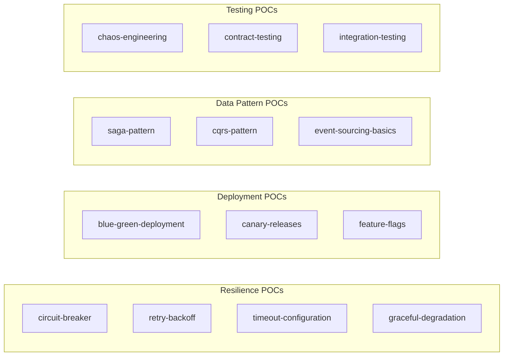

# Architecture Hands-On

Implement circuit breakers, saga patterns, blue-green deployments, and more.

```mermaid
graph LR
    subgraph "Resilience POCs"
        CB[circuit-breaker]
        RB[retry-backoff]
        TC[timeout-configuration]
        GD[graceful-degradation]
    end
    subgraph "Deployment POCs"
        BG[blue-green-deployment]
        CR[canary-releases]
        FE[feature-flags]
    end
    subgraph "Data Pattern POCs"
        SAGA[saga-pattern]
        CQRS[cqrs-pattern]
        ES[event-sourcing-basics]
    end
    subgraph "Testing POCs"
        CE[chaos-engineering]
        CT[contract-testing]
        IT[integration-testing]
    end
```
