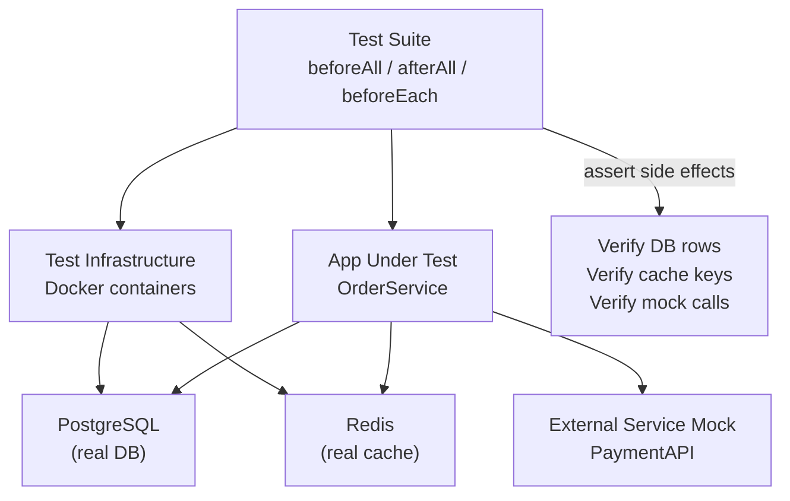

# POC #95: Integration Testing Patterns

> **Difficulty:** 🟡 Intermediate
> **Time:** 25 minutes
> **Prerequisites:** Node.js, Docker basics, Testing fundamentals

## 🗺️ Quick Overview



*Spin up real dependencies in containers, wire the app to them, then assert end-to-end behavior.*

## What You'll Learn

Integration tests verify that multiple components work together correctly. This covers testing APIs, databases, external services, and message queues as a system.

```
INTEGRATION TESTING SCOPE:
┌─────────────────────────────────────────────────────────────────┐
│                                                                 │
│  UNIT TEST          INTEGRATION TEST        E2E TEST            │
│  ─────────          ────────────────        ────────            │
│                                                                 │
│  ┌───────┐          ┌───────────────┐       ┌───────────────┐  │
│  │Service│          │ API + DB +    │       │ Full App +    │  │
│  │ Only  │          │ Cache + Queue │       │ Browser + UI  │  │
│  └───────┘          └───────────────┘       └───────────────┘  │
│                                                                 │
│  Mocked deps        Real deps (Docker)      Real everything    │
│  Milliseconds       Seconds                 Minutes            │
│  Many tests         Some tests              Few tests          │
│                                                                 │
│  INTEGRATION TEST COMPONENTS:                                   │
│  ─────────────────────────────                                 │
│  ┌─────────────────────────────────────────────────────────┐   │
│  │                    Test Container                        │   │
│  │  ┌─────┐  ┌─────┐  ┌─────┐  ┌───────┐  ┌─────────┐     │   │
│  │  │ API │──│ DB  │──│Redis│──│ Kafka │──│ External│     │   │
│  │  └─────┘  └─────┘  └─────┘  └───────┘  │  Mock   │     │   │
│  │                                         └─────────┘     │   │
│  └─────────────────────────────────────────────────────────┘   │
│                                                                 │
└─────────────────────────────────────────────────────────────────┘
```

---

## Implementation

```javascript
// integration-testing.js

// ==========================================
// TEST INFRASTRUCTURE
// ==========================================

class TestInfrastructure {
  constructor() {
    this.services = new Map();
    this.startedServices = [];
  }

  // Register a service
  register(name, config) {
    this.services.set(name, {
      name,
      config,
      instance: null,
      started: false
    });
    return this;
  }

  // Start all services
  async startAll() {
    console.log('🚀 Starting test infrastructure...\n');

    for (const [name, service] of this.services) {
      await this.start(name);
    }

    console.log('\n✅ All services started');
    return this;
  }

  async start(name) {
    const service = this.services.get(name);
    if (!service) throw new Error(`Unknown service: ${name}`);
    if (service.started) return service.instance;

    console.log(`   Starting ${name}...`);

    // Simulate Docker container startup
    service.instance = await this.createInstance(service.config);
    service.started = true;
    this.startedServices.push(name);

    return service.instance;
  }

  async createInstance(config) {
    // In real code: use testcontainers or docker-compose
    await new Promise(r => setTimeout(r, 100));  // Simulate startup

    switch (config.type) {
      case 'postgres':
        return new MockPostgres(config);
      case 'redis':
        return new MockRedis(config);
      case 'api':
        return new MockAPI(config);
      default:
        throw new Error(`Unknown service type: ${config.type}`);
    }
  }

  // Stop all services
  async stopAll() {
    console.log('\n🛑 Stopping test infrastructure...');

    for (const name of this.startedServices.reverse()) {
      const service = this.services.get(name);
      if (service?.instance?.stop) {
        await service.instance.stop();
      }
      service.started = false;
    }

    this.startedServices = [];
    console.log('✅ All services stopped');
  }

  get(name) {
    return this.services.get(name)?.instance;
  }
}

// ==========================================
// MOCK SERVICES (Simplified)
// ==========================================

class MockPostgres {
  constructor(config) {
    this.config = config;
    this.data = new Map();
    this.port = config.port || 5432;
  }

  async query(sql, params = []) {
    // Simplified mock implementation
    return { rows: [], rowCount: 0 };
  }

  async stop() {
    console.log(`   Stopping PostgreSQL on port ${this.port}`);
  }
}

class MockRedis {
  constructor(config) {
    this.config = config;
    this.data = new Map();
    this.port = config.port || 6379;
  }

  async get(key) {
    return this.data.get(key);
  }

  async set(key, value, options = {}) {
    this.data.set(key, value);
    return 'OK';
  }

  async del(key) {
    return this.data.delete(key) ? 1 : 0;
  }

  async stop() {
    console.log(`   Stopping Redis on port ${this.port}`);
  }
}

class MockAPI {
  constructor(config) {
    this.config = config;
    this.port = config.port || 3000;
    this.routes = new Map();
    this.requests = [];
  }

  route(method, path, handler) {
    this.routes.set(`${method}:${path}`, handler);
  }

  async request(method, path, options = {}) {
    const key = `${method}:${path}`;
    const handler = this.routes.get(key);

    this.requests.push({ method, path, options, timestamp: Date.now() });

    if (handler) {
      return handler(options);
    }

    return { status: 404, body: { error: 'Not found' } };
  }

  getRequests() {
    return this.requests;
  }

  clearRequests() {
    this.requests = [];
  }

  async stop() {
    console.log(`   Stopping API on port ${this.port}`);
  }
}

// ==========================================
// APPLICATION UNDER TEST
// ==========================================

class OrderService {
  constructor(db, cache, paymentClient) {
    this.db = db;
    this.cache = cache;
    this.paymentClient = paymentClient;
  }

  async createOrder(userId, items) {
    // Calculate total
    const total = items.reduce((sum, i) => sum + i.price * i.quantity, 0);

    // Check user in cache first
    let user = await this.cache.get(`user:${userId}`);
    if (!user) {
      // Fetch from DB (simplified)
      user = { id: userId, name: 'Test User' };
      await this.cache.set(`user:${userId}`, JSON.stringify(user), { ex: 300 });
    }

    // Process payment
    const payment = await this.paymentClient.request('POST', '/payments', {
      body: { userId, amount: total }
    });

    if (payment.status !== 200) {
      throw new Error('Payment failed');
    }

    // Create order
    const orderId = `ord_${Date.now()}`;
    const order = {
      id: orderId,
      userId,
      items,
      total,
      paymentId: payment.body.paymentId,
      status: 'confirmed',
      createdAt: new Date()
    };

    // Save to DB (simplified)
    await this.db.query(
      'INSERT INTO orders (id, user_id, total, status) VALUES ($1, $2, $3, $4)',
      [order.id, order.userId, order.total, order.status]
    );

    // Invalidate cache
    await this.cache.del(`orders:${userId}`);

    return order;
  }

  async getOrder(orderId) {
    // Try cache first
    const cached = await this.cache.get(`order:${orderId}`);
    if (cached) return JSON.parse(cached);

    // Fetch from DB
    const result = await this.db.query(
      'SELECT * FROM orders WHERE id = $1',
      [orderId]
    );

    if (result.rows.length > 0) {
      await this.cache.set(`order:${orderId}`, JSON.stringify(result.rows[0]), { ex: 300 });
      return result.rows[0];
    }

    return null;
  }
}

// ==========================================
// INTEGRATION TEST SUITE
// ==========================================

class IntegrationTestSuite {
  constructor(infrastructure) {
    this.infrastructure = infrastructure;
    this.tests = [];
    this.results = [];
    this.beforeAllFn = null;
    this.afterAllFn = null;
    this.beforeEachFn = null;
    this.afterEachFn = null;
  }

  beforeAll(fn) { this.beforeAllFn = fn; }
  afterAll(fn) { this.afterAllFn = fn; }
  beforeEach(fn) { this.beforeEachFn = fn; }
  afterEach(fn) { this.afterEachFn = fn; }

  test(name, fn) {
    this.tests.push({ name, fn });
  }

  async run() {
    console.log('\n🧪 Running integration tests...\n');

    if (this.beforeAllFn) await this.beforeAllFn();

    for (const test of this.tests) {
      try {
        if (this.beforeEachFn) await this.beforeEachFn();

        await test.fn();

        if (this.afterEachFn) await this.afterEachFn();

        this.results.push({ name: test.name, passed: true });
        console.log(`  ✅ ${test.name}`);
      } catch (error) {
        this.results.push({ name: test.name, passed: false, error: error.message });
        console.log(`  ❌ ${test.name}`);
        console.log(`     ${error.message}`);
      }
    }

    if (this.afterAllFn) await this.afterAllFn();

    const passed = this.results.filter(r => r.passed).length;
    const failed = this.results.filter(r => !r.passed).length;

    console.log(`\n📊 Results: ${passed} passed, ${failed} failed`);
    return { passed, failed };
  }
}

// Assertion helper
function assert(condition, message) {
  if (!condition) throw new Error(message || 'Assertion failed');
}

// ==========================================
// EXTERNAL SERVICE MOCK
// ==========================================

class ExternalServiceMock {
  constructor() {
    this.responses = new Map();
    this.requests = [];
  }

  // Configure mock response
  when(method, path) {
    const key = `${method}:${path}`;
    return {
      respond: (response) => {
        this.responses.set(key, response);
      }
    };
  }

  // Handle request
  async request(method, path, options = {}) {
    const key = `${method}:${path}`;
    this.requests.push({ method, path, options });

    const response = this.responses.get(key);
    if (response) {
      if (typeof response === 'function') {
        return response(options);
      }
      return response;
    }

    return { status: 500, body: { error: 'Not mocked' } };
  }

  // Verify requests were made
  verify(method, path, times = 1) {
    const count = this.requests.filter(
      r => r.method === method && r.path === path
    ).length;

    if (count !== times) {
      throw new Error(
        `Expected ${times} calls to ${method} ${path}, got ${count}`
      );
    }
  }

  reset() {
    this.requests = [];
  }
}

// ==========================================
// DEMONSTRATION
// ==========================================

async function demonstrate() {
  console.log('='.repeat(60));
  console.log('INTEGRATION TESTING PATTERNS');
  console.log('='.repeat(60));

  // Setup infrastructure
  const infra = new TestInfrastructure()
    .register('postgres', { type: 'postgres', port: 5433 })
    .register('redis', { type: 'redis', port: 6380 })
    .register('api', { type: 'api', port: 3001 });

  await infra.startAll();

  // Get service instances
  const db = infra.get('postgres');
  const cache = infra.get('redis');

  // Create payment service mock
  const paymentMock = new ExternalServiceMock();
  paymentMock.when('POST', '/payments').respond({
    status: 200,
    body: { paymentId: 'pay_123', status: 'success' }
  });

  // Create service under test
  const orderService = new OrderService(db, cache, paymentMock);

  // Create test suite
  const suite = new IntegrationTestSuite(infra);

  suite.beforeEach(() => {
    paymentMock.reset();
    cache.data.clear();
  });

  // Test: Create order flow
  suite.test('creates order with payment processing', async () => {
    const order = await orderService.createOrder('user-123', [
      { name: 'Item 1', price: 50, quantity: 2 }
    ]);

    assert(order.id, 'Order should have an ID');
    assert(order.total === 100, 'Total should be 100');
    assert(order.status === 'confirmed', 'Status should be confirmed');
    assert(order.paymentId === 'pay_123', 'Should have payment ID');

    // Verify payment service was called
    paymentMock.verify('POST', '/payments', 1);
  });

  // Test: Caching behavior
  suite.test('caches user data after first fetch', async () => {
    await orderService.createOrder('user-456', [
      { name: 'Item', price: 25, quantity: 1 }
    ]);

    const cachedUser = await cache.get('user:user-456');
    assert(cachedUser, 'User should be cached');
  });

  // Test: Payment failure handling
  suite.test('handles payment failure gracefully', async () => {
    paymentMock.when('POST', '/payments').respond({
      status: 400,
      body: { error: 'Insufficient funds' }
    });

    let error = null;
    try {
      await orderService.createOrder('user-789', [
        { name: 'Item', price: 1000, quantity: 1 }
      ]);
    } catch (e) {
      error = e;
    }

    assert(error !== null, 'Should throw error');
    assert(error.message === 'Payment failed', 'Error message should match');
  });

  // Test: Cache invalidation
  suite.test('invalidates order cache after creation', async () => {
    await cache.set('orders:user-100', JSON.stringify([{ id: 'old' }]));

    await orderService.createOrder('user-100', [
      { name: 'Item', price: 10, quantity: 1 }
    ]);

    const cachedOrders = await cache.get('orders:user-100');
    assert(!cachedOrders, 'Orders cache should be invalidated');
  });

  // Run tests
  await suite.run();

  // Cleanup
  await infra.stopAll();

  console.log('\n✅ Demo complete!');
}

demonstrate().catch(console.error);
```

---

## Docker Compose for Integration Tests

```yaml
# docker-compose.test.yml
version: '3.8'
services:
  postgres:
    image: postgres:15
    environment:
      POSTGRES_DB: test_db
      POSTGRES_USER: test
      POSTGRES_PASSWORD: test
    ports:
      - "5433:5432"
    healthcheck:
      test: ["CMD-SHELL", "pg_isready -U test"]
      interval: 5s
      timeout: 5s
      retries: 5

  redis:
    image: redis:7
    ports:
      - "6380:6379"
    healthcheck:
      test: ["CMD", "redis-cli", "ping"]

  kafka:
    image: confluentinc/cp-kafka:7.0.0
    ports:
      - "9093:9093"
    environment:
      KAFKA_BROKER_ID: 1
      KAFKA_ZOOKEEPER_CONNECT: zookeeper:2181
```

---

## Test Categories

| Category | Focus | Example |
|----------|-------|---------|
| **API Integration** | HTTP endpoints | Create order → 201 |
| **Database Integration** | CRUD + queries | Insert + select works |
| **Cache Integration** | Cache hit/miss | Redis caching |
| **Message Queue** | Pub/sub flow | Event published |
| **External Services** | 3rd party APIs | Payment gateway |

---

## Best Practices

```
✅ DO:
├── Use Docker for dependencies
├── Reset state between tests
├── Mock external services
├── Test error scenarios
├── Verify side effects
└── Use meaningful assertions

❌ DON'T:
├── Share state between tests
├── Test implementation details
├── Skip cleanup
├── Use production services
├── Over-mock internals
└── Ignore timing issues
```

---

## Related POCs

- [Contract Testing](/interview-prep/practice-pocs/contract-testing)
- [Database Testing](/interview-prep/practice-pocs/database-testing)
- [Load Testing](/interview-prep/practice-pocs/load-testing-k6)
