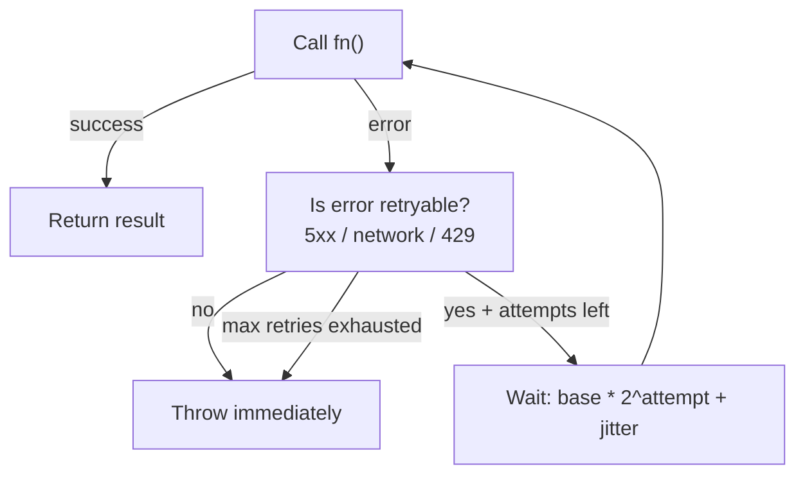

# POC #76: Retry with Exponential Backoff

> **Difficulty:** 🟢 Beginner
> **Time:** 25 minutes
> **Prerequisites:** Async/await, understanding of network errors

## 🗺️ Quick Overview



*Exponential backoff with jitter spaces out retries to avoid thundering-herd storms after an outage.*

## ⚡ Quick Reference Implementation

```javascript
// Minimal retry with exponential backoff + full jitter — copy-paste template
async function retryWithBackoff(fn, { maxRetries = 3, base = 1000, max = 30000 } = {}) {
  for (let attempt = 0; attempt <= maxRetries; attempt++) {
    try {
      return await fn(attempt);
    } catch (err) {
      if (attempt === maxRetries || !isRetryable(err)) throw err;
      const delay = Math.random() * Math.min(base * Math.pow(2, attempt), max); // Full jitter
      await new Promise(r => setTimeout(r, delay));
    }
  }
}

function isRetryable(err) {
  if (['ECONNRESET', 'ETIMEDOUT', 'ECONNREFUSED'].includes(err.code)) return true;
  if (err.response?.status >= 500 || err.response?.status === 429) return true;
  return false;  // 4xx client errors: don't retry
}
```

---

## What You'll Build

A robust retry utility that:
- Retries transient failures automatically
- Uses exponential backoff to avoid thundering herd
- Adds jitter to prevent synchronized retries
- Respects maximum retry limits

## The Problem

```javascript
// Without retry: Single failure = complete failure
async function fetchData() {
  const response = await fetch('https://api.example.com/data');
  return response.json();
  // Network blip → Request fails → User sees error
}

// With retry: Transient failures are handled
async function fetchData() {
  return await retry(() => fetch('https://api.example.com/data'));
  // Network blip → Retry → Success → User happy
}
```

## Implementation

### Step 1: Basic Retry

```javascript
// retry.js
async function retry(fn, options = {}) {
  const maxRetries = options.maxRetries ?? 3;
  const shouldRetry = options.shouldRetry ?? isRetryableError;

  let lastError;

  for (let attempt = 0; attempt <= maxRetries; attempt++) {
    try {
      return await fn(attempt);
    } catch (error) {
      lastError = error;

      if (attempt === maxRetries || !shouldRetry(error)) {
        throw error;
      }

      console.log(`Attempt ${attempt + 1} failed, retrying...`);
    }
  }

  throw lastError;
}

function isRetryableError(error) {
  // Network errors
  if (['ECONNRESET', 'ETIMEDOUT', 'ECONNREFUSED'].includes(error.code)) {
    return true;
  }

  // HTTP errors (5xx are typically retryable)
  if (error.response?.status >= 500) return true;

  // Rate limiting
  if (error.response?.status === 429) return true;

  return false;
}

module.exports = { retry, isRetryableError };
```

### Step 2: Add Exponential Backoff

```javascript
// retry-with-backoff.js
class RetryWithBackoff {
  constructor(options = {}) {
    this.maxRetries = options.maxRetries ?? 3;
    this.baseDelay = options.baseDelay ?? 1000;  // 1 second
    this.maxDelay = options.maxDelay ?? 30000;   // 30 seconds
    this.factor = options.factor ?? 2;           // Double each time
    this.shouldRetry = options.shouldRetry ?? this.defaultShouldRetry;
    this.onRetry = options.onRetry ?? this.defaultOnRetry;
  }

  async execute(fn) {
    let lastError;

    for (let attempt = 0; attempt <= this.maxRetries; attempt++) {
      try {
        return await fn(attempt);
      } catch (error) {
        lastError = error;

        if (attempt === this.maxRetries) {
          throw error;
        }

        if (!this.shouldRetry(error, attempt)) {
          throw error;
        }

        const delay = this.calculateDelay(attempt);
        this.onRetry(error, attempt, delay);
        await this.sleep(delay);
      }
    }

    throw lastError;
  }

  calculateDelay(attempt) {
    // Exponential: base * factor^attempt
    // 1s, 2s, 4s, 8s, 16s...
    const delay = this.baseDelay * Math.pow(this.factor, attempt);
    return Math.min(delay, this.maxDelay);
  }

  defaultShouldRetry(error, attempt) {
    // Network errors
    const networkErrors = ['ECONNRESET', 'ETIMEDOUT', 'ECONNREFUSED', 'ENOTFOUND'];
    if (networkErrors.includes(error.code)) return true;

    // HTTP 5xx errors
    if (error.response?.status >= 500) return true;

    // Rate limiting (429)
    if (error.response?.status === 429) return true;

    return false;
  }

  defaultOnRetry(error, attempt, delay) {
    console.log(
      `Attempt ${attempt + 1} failed: ${error.message}. Retrying in ${delay}ms...`
    );
  }

  sleep(ms) {
    return new Promise(resolve => setTimeout(resolve, ms));
  }
}

module.exports = RetryWithBackoff;
```

### Step 3: Add Jitter

```javascript
// retry-with-jitter.js
class RetryWithJitter extends RetryWithBackoff {
  constructor(options = {}) {
    super(options);
    this.jitter = options.jitter ?? 0.2;  // ±20% randomization
  }

  calculateDelay(attempt) {
    // Get base exponential delay
    let delay = super.calculateDelay(attempt);

    // Add jitter: delay ± (delay * jitter)
    const jitterRange = delay * this.jitter;
    const randomJitter = (Math.random() * 2 - 1) * jitterRange;
    delay = delay + randomJitter;

    return Math.max(0, Math.round(delay));
  }
}

// Alternative: Full jitter (AWS recommendation)
class RetryWithFullJitter extends RetryWithBackoff {
  calculateDelay(attempt) {
    const maxDelay = super.calculateDelay(attempt);
    // Random between 0 and maxDelay
    return Math.random() * maxDelay;
  }
}

// Alternative: Decorrelated jitter
class RetryWithDecorrelatedJitter extends RetryWithBackoff {
  constructor(options) {
    super(options);
    this.lastDelay = this.baseDelay;
  }

  calculateDelay(attempt) {
    if (attempt === 0) {
      this.lastDelay = this.baseDelay;
      return this.baseDelay;
    }

    // delay = random between baseDelay and lastDelay * 3
    const min = this.baseDelay;
    const max = this.lastDelay * 3;
    this.lastDelay = Math.min(this.maxDelay, min + Math.random() * (max - min));

    return this.lastDelay;
  }
}

module.exports = {
  RetryWithJitter,
  RetryWithFullJitter,
  RetryWithDecorrelatedJitter
};
```

### Step 4: Respect Retry-After Header

```javascript
// retry-with-headers.js
class SmartRetry extends RetryWithBackoff {
  calculateDelay(attempt, error) {
    // Respect Retry-After header if present
    const retryAfter = this.getRetryAfter(error);
    if (retryAfter !== null) {
      return retryAfter;
    }

    // Otherwise use exponential backoff with jitter
    let delay = super.calculateDelay(attempt);
    const jitterRange = delay * 0.2;
    delay += (Math.random() * 2 - 1) * jitterRange;

    return Math.round(delay);
  }

  getRetryAfter(error) {
    const retryAfter = error.response?.headers?.['retry-after'];
    if (!retryAfter) return null;

    // Retry-After can be seconds or a date
    const seconds = parseInt(retryAfter, 10);
    if (!isNaN(seconds)) {
      return seconds * 1000;
    }

    // Parse as date
    const date = new Date(retryAfter);
    if (!isNaN(date.getTime())) {
      return Math.max(0, date.getTime() - Date.now());
    }

    return null;
  }
}

module.exports = SmartRetry;
```

### Step 5: Complete Utility

```javascript
// index.js
const RetryWithBackoff = require('./retry-with-backoff');
const { RetryWithJitter, RetryWithFullJitter } = require('./retry-with-jitter');
const SmartRetry = require('./retry-with-headers');

// Convenience function
async function retryWithBackoff(fn, options = {}) {
  const retry = new RetryWithJitter(options);
  return retry.execute(fn);
}

// Axios interceptor
function createRetryInterceptor(options = {}) {
  const retry = new SmartRetry(options);

  return async (error) => {
    const config = error.config;

    // Don't retry if already retried max times
    config._retryCount = config._retryCount || 0;
    if (config._retryCount >= (options.maxRetries || 3)) {
      return Promise.reject(error);
    }

    // Check if should retry
    if (!retry.defaultShouldRetry(error)) {
      return Promise.reject(error);
    }

    config._retryCount++;
    const delay = retry.calculateDelay(config._retryCount - 1, error);

    console.log(`Retrying request in ${delay}ms (attempt ${config._retryCount})`);
    await retry.sleep(delay);

    return axios(config);
  };
}

module.exports = {
  RetryWithBackoff,
  RetryWithJitter,
  RetryWithFullJitter,
  SmartRetry,
  retryWithBackoff,
  createRetryInterceptor
};
```

## Usage Examples

```javascript
const { retryWithBackoff, createRetryInterceptor } = require('./retry');

// Basic usage
const data = await retryWithBackoff(
  () => fetch('https://api.example.com/data').then(r => r.json()),
  { maxRetries: 3, baseDelay: 1000 }
);

// With axios interceptor
const axios = require('axios');
axios.interceptors.response.use(
  response => response,
  createRetryInterceptor({ maxRetries: 3 })
);

// Custom retry logic
const retry = new RetryWithJitter({
  maxRetries: 5,
  baseDelay: 500,
  maxDelay: 10000,
  shouldRetry: (error) => {
    // Only retry specific errors
    return error.response?.status === 503;
  },
  onRetry: (error, attempt, delay) => {
    console.log(`Custom log: Retry ${attempt + 1} in ${delay}ms`);
    metrics.increment('api.retries', { attempt });
  }
});

await retry.execute(() => apiClient.submitOrder(order));
```

## Testing

```javascript
// test-retry.js
const { RetryWithJitter } = require('./retry');

async function runTests() {
  console.log('Test 1: Successful on first try');
  const retry = new RetryWithJitter({ maxRetries: 3 });
  const result = await retry.execute(() => Promise.resolve('success'));
  console.log('Result:', result);

  console.log('\nTest 2: Fails then succeeds');
  let attempts = 0;
  const result2 = await retry.execute(() => {
    attempts++;
    if (attempts < 3) {
      const error = new Error('Transient failure');
      error.code = 'ECONNRESET';
      throw error;
    }
    return 'success after retries';
  });
  console.log('Result:', result2, 'Attempts:', attempts);

  console.log('\nTest 3: Exhausts retries');
  try {
    await retry.execute(() => {
      const error = new Error('Always fails');
      error.code = 'ECONNRESET';
      throw error;
    });
  } catch (e) {
    console.log('Correctly threw after max retries');
  }

  console.log('\nTest 4: Non-retryable error');
  try {
    await retry.execute(() => {
      throw new Error('Non-retryable error');
    });
  } catch (e) {
    console.log('Correctly threw immediately for non-retryable error');
  }
}

runTests();
```

## Expected Output

```
Test 1: Successful on first try
Result: success

Test 2: Fails then succeeds
Attempt 1 failed: Transient failure. Retrying in 1000ms...
Attempt 2 failed: Transient failure. Retrying in 2000ms...
Result: success after retries Attempts: 3

Test 3: Exhausts retries
Attempt 1 failed: Always fails. Retrying in 1000ms...
Attempt 2 failed: Always fails. Retrying in 2000ms...
Attempt 3 failed: Always fails. Retrying in 4000ms...
Correctly threw after max retries

Test 4: Non-retryable error
Correctly threw immediately for non-retryable error
```

## 🎯 Interview Questions

### Implementation-Focused Interview Questions

#### Q1: Implement exponential backoff with jitter in pseudocode. Why is jitter necessary?

**What interviewers look for**: The formula, the reasoning, and the difference between full jitter, equal jitter, and decorrelated jitter.

**Answer framework**:
1. Without jitter: if 100 clients all fail at the same moment and retry at `base * 2^attempt`, they all retry at exactly the same times — thundering herd every `2^n` seconds
2. Full jitter: `delay = random(0, base * 2^attempt)` — completely decorrelated retries; AWS recommends this
3. Equal jitter: `delay = base * 2^attempt / 2 + random(0, base * 2^attempt / 2)` — guarantees some minimum wait while still adding randomness
4. Always cap: `delay = min(delay, maxDelay)` to prevent multi-hour waits on high attempt counts

**Code snippet that impresses**:
```javascript
function calculateBackoffDelay(attempt, { base = 1000, max = 30000, jitter = 'full' } = {}) {
  const exponential = base * Math.pow(2, attempt);   // 1s, 2s, 4s, 8s...
  const capped = Math.min(exponential, max);          // Never exceed maxDelay

  if (jitter === 'full') {
    return Math.random() * capped;                    // AWS recommendation
  } else if (jitter === 'equal') {
    return capped / 2 + Math.random() * (capped / 2);
  }
  return capped;  // No jitter (don't use in production)
}
// attempt=0: 0-1s | attempt=1: 0-2s | attempt=2: 0-4s | attempt=3: 0-8s
```

---

#### Q2: How do you prevent retry storms when all clients retry simultaneously after a service restart?

**What interviewers look for**: Understanding of thundering herd at the retry level and mitigation strategies.

**Answer framework**:
1. **Full jitter**: the single most important defense — spreads retries over the entire backoff window
2. **Max concurrent retries**: rate-limit retries at the client SDK level (e.g., max 5 concurrent retry attempts per client instance)
3. **Circuit breaker**: after the circuit opens, stop retrying entirely until the downstream recovers — only HALF_OPEN probe requests go through
4. **Backpressure from server**: 429 with `Retry-After: 60` tells ALL clients to wait 60s — more coordinated than random jitter

**Code snippet that impresses**:
```javascript
// Guard: don't pile retries on top of retries
class RetryLimiter {
  constructor(maxConcurrent = 5) {
    this.activeRetries = 0;
    this.max = maxConcurrent;
  }

  async executeWithRetry(fn, maxAttempts = 3) {
    if (this.activeRetries >= this.max) {
      throw new Error('Too many concurrent retries — fast failing');
    }
    this.activeRetries++;
    try {
      return await retryWithBackoff(fn, { maxRetries: maxAttempts });
    } finally {
      this.activeRetries--;
    }
  }
}
```

---

#### Q3: How do you distinguish retryable errors from non-retryable errors?

**What interviewers look for**: Practical knowledge of HTTP status codes and network error semantics.

**Answer framework**:
1. **Retryable** (transient): `500 Internal Server Error`, `503 Service Unavailable`, `504 Gateway Timeout`, network errors (`ECONNRESET`, `ETIMEDOUT`), `429 Too Many Requests`
2. **Non-retryable** (permanent): `400 Bad Request` (wrong input — retrying won't fix it), `401 Unauthorized` (need new credentials), `403 Forbidden` (permission issue), `404 Not Found`, `409 Conflict` (depending on semantics)
3. **Context-dependent**: `408 Request Timeout` is retryable; `422 Unprocessable Entity` usually isn't
4. Key principle: retry only when the error indicates a transient infrastructure problem, not a business logic rejection

---

#### Q4: What is the Retry-After header and how should your retry logic use it?

**What interviewers look for**: Respecting server-side signals instead of blindly applying your own backoff.

**Answer framework**:
1. `Retry-After: 30` means wait 30 seconds before retrying; `Retry-After: Sat, 01 Jan 2026 00:00:00 GMT` means wait until that date
2. Common sources: rate limiting (429), server maintenance (503), temporary overload
3. Your retry logic should check for this header FIRST, before applying exponential backoff
4. Benefit: avoids hammering a server that's explicitly telling you it needs time to recover

**Code snippet that impresses**:
```javascript
function getRetryDelay(error, attempt) {
  // Always honor server-side signals over local backoff calculation
  const retryAfter = error.response?.headers?.['retry-after'];
  if (retryAfter) {
    const seconds = parseInt(retryAfter, 10);
    if (!isNaN(seconds)) return seconds * 1000;
    const date = new Date(retryAfter);
    if (!isNaN(date)) return Math.max(0, date - Date.now());
  }
  // Fall back to exponential backoff with full jitter
  return calculateBackoffDelay(attempt);
}
```

---

#### Q5: How do you make operations safe to retry? What is idempotency and how do you implement it?

**What interviewers look for**: Understanding that retry safety requires server-side design, not just client-side retry logic.

**Answer framework**:
1. An operation is idempotent if calling it N times has the same effect as calling it once
2. GET, DELETE, PUT are naturally idempotent; POST is not (unless you add an idempotency key)
3. Implementation: client generates a UUID (`idempotency-key` header); server stores `(key → result)` in Redis with 24h TTL; on duplicate key, return the stored result without re-processing
4. This allows safe retries of payment, order creation, and any other non-idempotent operation

---

## Key Takeaways

1. **Exponential backoff** prevents thundering herd
2. **Jitter** prevents synchronized retries across instances
3. **Retry-After** headers should be respected
4. **Non-retryable errors** should fail immediately
5. **Limit retries** to prevent infinite loops

## Backoff Visualization

```
Attempt   Delay (base: 1s, factor: 2)   With Jitter (±20%)
   1            1s                        0.8s - 1.2s
   2            2s                        1.6s - 2.4s
   3            4s                        3.2s - 4.8s
   4            8s                        6.4s - 9.6s
   5           16s                       12.8s - 19.2s
```

## Related POCs

- [POC #75: Circuit Breaker](/10-architecture/hands-on/circuit-breaker)
- [POC #73: Idempotency Keys](/07-api-design/hands-on/idempotency-keys)
- [Timeouts & Backpressure](/10-architecture/concepts/timeouts-backpressure)

## Further Reading

**Concept articles:**
- [Timeouts & Backpressure](/10-architecture/concepts/timeouts-backpressure)
- [Async Processing](/10-architecture/concepts/async-processing)

**Interview prep:**
- [High Concurrency API Design](/12-interview-prep/system-design/fundamentals/high-concurrency-api)

**Failure modes:**
- [Retry Storm](/10-architecture/failures/retry-storm)
- [Cascading Failures](/10-architecture/failures/cascading-failures)
