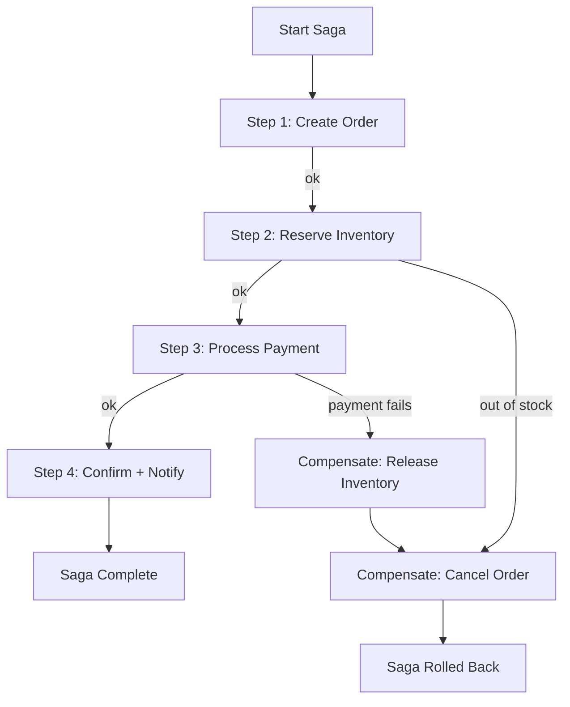

# POC #84: Saga Pattern

> **Difficulty:** 🔴 Advanced
> **Time:** 35 minutes
> **Prerequisites:** Node.js, Distributed systems, Message queues

## 🗺️ Quick Overview



*Each local transaction has a compensating action — failure triggers reverse execution to restore consistency.*

## What You'll Learn

The Saga pattern manages distributed transactions across multiple services by breaking them into local transactions with compensating actions for rollback.

```
DISTRIBUTED TRANSACTION PROBLEM:
┌─────────────────────────────────────────────────────────────────┐
│  Order Service    Payment Service    Inventory Service          │
│       │                 │                   │                   │
│       ├─────────────────┼───────────────────┤                   │
│       │         2PC (Two-Phase Commit)      │                   │
│       │                 │                   │                   │
│  ❌ Doesn't scale! Locks across services = bottleneck           │
│  ❌ Single point of failure                                     │
│  ❌ High latency                                                 │
└─────────────────────────────────────────────────────────────────┘

SAGA SOLUTION:
┌─────────────────────────────────────────────────────────────────┐
│                                                                 │
│  1. Create Order ──▶ 2. Reserve Inventory ──▶ 3. Process Payment│
│         │                    │                      │           │
│         ▼                    ▼                      ▼           │
│  (Compensate:         (Compensate:           (Compensate:       │
│   Cancel Order)        Release Stock)         Refund Payment)   │
│                                                                 │
│  ✅ Each step is a local transaction                            │
│  ✅ Compensating actions for rollback                           │
│  ✅ Eventually consistent                                       │
└─────────────────────────────────────────────────────────────────┘
```

---

## Implementation

```javascript
// saga-pattern.js

// ==========================================
// SAGA STEP DEFINITION
// ==========================================

class SagaStep {
  constructor(name, execute, compensate) {
    this.name = name;
    this.execute = execute;      // Forward action
    this.compensate = compensate; // Rollback action
  }
}

// ==========================================
// SAGA ORCHESTRATOR
// ==========================================

class SagaOrchestrator {
  constructor(sagaId) {
    this.sagaId = sagaId;
    this.steps = [];
    this.executedSteps = [];
    this.context = {};
    this.status = 'pending';
  }

  addStep(step) {
    this.steps.push(step);
    return this;
  }

  async execute(initialContext = {}) {
    this.context = { ...initialContext };
    this.status = 'running';

    console.log(`\n🚀 Starting Saga: ${this.sagaId}`);
    console.log('─'.repeat(50));

    try {
      // Execute steps in order
      for (const step of this.steps) {
        console.log(`\n▶️ Executing: ${step.name}`);

        try {
          const result = await step.execute(this.context);
          this.context = { ...this.context, ...result };
          this.executedSteps.push(step);
          console.log(`✅ ${step.name} completed`);
        } catch (error) {
          console.log(`❌ ${step.name} failed: ${error.message}`);
          throw error;
        }
      }

      this.status = 'completed';
      console.log(`\n✅ Saga ${this.sagaId} completed successfully!`);
      return { success: true, context: this.context };

    } catch (error) {
      // Compensate in reverse order
      console.log(`\n⚠️ Saga failed, starting compensation...`);
      await this.compensate();
      return { success: false, error: error.message, context: this.context };
    }
  }

  async compensate() {
    this.status = 'compensating';

    // Execute compensations in reverse order
    const reversedSteps = [...this.executedSteps].reverse();

    for (const step of reversedSteps) {
      console.log(`\n◀️ Compensating: ${step.name}`);

      try {
        await step.compensate(this.context);
        console.log(`✅ ${step.name} compensated`);
      } catch (compError) {
        console.log(`⚠️ Compensation failed for ${step.name}: ${compError.message}`);
        // In production: Log, alert, and potentially retry
      }
    }

    this.status = 'compensated';
    console.log(`\n🔄 Saga ${this.sagaId} compensation completed`);
  }
}

// ==========================================
// SIMULATED SERVICES
// ==========================================

class OrderService {
  constructor() {
    this.orders = new Map();
  }

  async createOrder(customerId, items, total) {
    const orderId = `ORD-${Date.now()}`;

    // Simulate some processing time
    await this.delay(100);

    this.orders.set(orderId, {
      id: orderId,
      customerId,
      items,
      total,
      status: 'created'
    });

    console.log(`  📦 Order ${orderId} created for $${total}`);
    return { orderId };
  }

  async cancelOrder(orderId) {
    await this.delay(50);

    const order = this.orders.get(orderId);
    if (order) {
      order.status = 'cancelled';
      console.log(`  📦 Order ${orderId} cancelled`);
    }
  }

  async confirmOrder(orderId) {
    await this.delay(50);

    const order = this.orders.get(orderId);
    if (order) {
      order.status = 'confirmed';
      console.log(`  📦 Order ${orderId} confirmed`);
    }
  }

  delay(ms) {
    return new Promise(r => setTimeout(r, ms));
  }
}

class InventoryService {
  constructor() {
    this.inventory = new Map([
      ['PROD-1', { quantity: 100, reserved: 0 }],
      ['PROD-2', { quantity: 50, reserved: 0 }],
      ['PROD-3', { quantity: 0, reserved: 0 }]  // Out of stock
    ]);
    this.reservations = new Map();
  }

  async reserveInventory(orderId, items) {
    await this.delay(150);

    const reservation = [];

    for (const item of items) {
      const stock = this.inventory.get(item.productId);

      if (!stock || stock.quantity - stock.reserved < item.quantity) {
        throw new Error(`Insufficient stock for ${item.productId}`);
      }

      stock.reserved += item.quantity;
      reservation.push({ productId: item.productId, quantity: item.quantity });
    }

    this.reservations.set(orderId, reservation);
    console.log(`  📋 Inventory reserved for order ${orderId}`);
    return { reservationId: orderId };
  }

  async releaseInventory(orderId) {
    await this.delay(50);

    const reservation = this.reservations.get(orderId);
    if (reservation) {
      for (const item of reservation) {
        const stock = this.inventory.get(item.productId);
        if (stock) {
          stock.reserved -= item.quantity;
        }
      }
      this.reservations.delete(orderId);
      console.log(`  📋 Inventory released for order ${orderId}`);
    }
  }

  delay(ms) {
    return new Promise(r => setTimeout(r, ms));
  }
}

class PaymentService {
  constructor() {
    this.payments = new Map();
    this.failNextPayment = false;
  }

  async processPayment(orderId, amount, customerId) {
    await this.delay(200);

    // Simulate occasional failures
    if (this.failNextPayment) {
      this.failNextPayment = false;
      throw new Error('Payment declined by bank');
    }

    const paymentId = `PAY-${Date.now()}`;
    this.payments.set(paymentId, {
      id: paymentId,
      orderId,
      amount,
      customerId,
      status: 'completed'
    });

    console.log(`  💳 Payment ${paymentId} processed: $${amount}`);
    return { paymentId };
  }

  async refundPayment(paymentId) {
    await this.delay(100);

    const payment = this.payments.get(paymentId);
    if (payment) {
      payment.status = 'refunded';
      console.log(`  💳 Payment ${paymentId} refunded`);
    }
  }

  setNextPaymentToFail() {
    this.failNextPayment = true;
  }

  delay(ms) {
    return new Promise(r => setTimeout(r, ms));
  }
}

class NotificationService {
  async sendOrderConfirmation(customerId, orderId) {
    await new Promise(r => setTimeout(r, 50));
    console.log(`  📧 Confirmation email sent to customer ${customerId}`);
    return { notificationSent: true };
  }

  async sendOrderCancellation(customerId, orderId) {
    await new Promise(r => setTimeout(r, 50));
    console.log(`  📧 Cancellation email sent to customer ${customerId}`);
  }
}

// ==========================================
// ORDER SAGA DEFINITION
// ==========================================

function createOrderSaga(services) {
  const { orderService, inventoryService, paymentService, notificationService } = services;

  return new SagaOrchestrator('order-saga')
    // Step 1: Create Order
    .addStep(new SagaStep(
      'Create Order',
      async (ctx) => {
        const result = await orderService.createOrder(
          ctx.customerId,
          ctx.items,
          ctx.total
        );
        return result;
      },
      async (ctx) => {
        await orderService.cancelOrder(ctx.orderId);
      }
    ))
    // Step 2: Reserve Inventory
    .addStep(new SagaStep(
      'Reserve Inventory',
      async (ctx) => {
        const result = await inventoryService.reserveInventory(
          ctx.orderId,
          ctx.items
        );
        return result;
      },
      async (ctx) => {
        await inventoryService.releaseInventory(ctx.orderId);
      }
    ))
    // Step 3: Process Payment
    .addStep(new SagaStep(
      'Process Payment',
      async (ctx) => {
        const result = await paymentService.processPayment(
          ctx.orderId,
          ctx.total,
          ctx.customerId
        );
        return result;
      },
      async (ctx) => {
        if (ctx.paymentId) {
          await paymentService.refundPayment(ctx.paymentId);
        }
      }
    ))
    // Step 4: Confirm Order
    .addStep(new SagaStep(
      'Confirm Order',
      async (ctx) => {
        await orderService.confirmOrder(ctx.orderId);
        return {};
      },
      async (ctx) => {
        // No compensation needed - order was already cancelled in step 1
      }
    ))
    // Step 5: Send Notification
    .addStep(new SagaStep(
      'Send Notification',
      async (ctx) => {
        const result = await notificationService.sendOrderConfirmation(
          ctx.customerId,
          ctx.orderId
        );
        return result;
      },
      async (ctx) => {
        await notificationService.sendOrderCancellation(
          ctx.customerId,
          ctx.orderId
        );
      }
    ));
}

// ==========================================
// DEMONSTRATION
// ==========================================

async function demonstrate() {
  console.log('='.repeat(60));
  console.log('SAGA PATTERN - DISTRIBUTED TRANSACTIONS');
  console.log('='.repeat(60));

  // Initialize services
  const services = {
    orderService: new OrderService(),
    inventoryService: new InventoryService(),
    paymentService: new PaymentService(),
    notificationService: new NotificationService()
  };

  // Scenario 1: Successful Order
  console.log('\n' + '═'.repeat(60));
  console.log('SCENARIO 1: Successful Order');
  console.log('═'.repeat(60));

  const successSaga = createOrderSaga(services);
  const successResult = await successSaga.execute({
    customerId: 'CUST-001',
    items: [
      { productId: 'PROD-1', quantity: 2 },
      { productId: 'PROD-2', quantity: 1 }
    ],
    total: 299.99
  });
  console.log('\nResult:', successResult);

  // Scenario 2: Payment Failure (triggers compensation)
  console.log('\n' + '═'.repeat(60));
  console.log('SCENARIO 2: Payment Failure');
  console.log('═'.repeat(60));

  services.paymentService.setNextPaymentToFail();

  const failSaga = createOrderSaga(services);
  const failResult = await failSaga.execute({
    customerId: 'CUST-002',
    items: [{ productId: 'PROD-1', quantity: 5 }],
    total: 499.99
  });
  console.log('\nResult:', failResult);

  // Scenario 3: Inventory Failure (out of stock)
  console.log('\n' + '═'.repeat(60));
  console.log('SCENARIO 3: Out of Stock');
  console.log('═'.repeat(60));

  const stockSaga = createOrderSaga(services);
  const stockResult = await stockSaga.execute({
    customerId: 'CUST-003',
    items: [{ productId: 'PROD-3', quantity: 1 }],  // Out of stock
    total: 99.99
  });
  console.log('\nResult:', stockResult);

  console.log('\n✅ Demo complete!');
}

demonstrate().catch(console.error);
```

---

## Saga Types

| Type | Orchestration | Choreography |
|------|---------------|--------------|
| **Control** | Central orchestrator | Event-driven |
| **Complexity** | Easier to understand | More complex |
| **Coupling** | Services coupled to orchestrator | Loosely coupled |
| **Debugging** | Easy to trace | Harder to trace |
| **Use Case** | Complex workflows | Simple workflows |

---

## Compensation Strategies

```
COMPENSATION BEST PRACTICES:

1. SEMANTIC REVERSAL
   ├── Create Order → Cancel Order
   ├── Reserve Stock → Release Stock
   └── Charge Payment → Refund Payment

2. IDEMPOTENT COMPENSATIONS
   └── Running compensation twice has same effect

3. RETRY WITH BACKOFF
   └── Compensation can fail too - must retry

4. DEAD LETTER QUEUE
   └── Unrecoverable compensations need manual handling

5. TIMEOUT HANDLING
   └── Set deadlines for each step
```

---

## Real-World Examples

```
UBER RIDE SAGA:
1. Create Ride Request → Cancel Ride
2. Match Driver → Release Driver
3. Start Trip → End Trip Early
4. Calculate Fare → Void Fare
5. Charge Rider → Refund Rider
6. Pay Driver → Reverse Payment

AMAZON ORDER SAGA:
1. Validate Order → Mark Invalid
2. Reserve Inventory → Release Inventory
3. Process Payment → Refund Payment
4. Ship Order → Cancel Shipment
5. Update Status → Revert Status
```

---

## ⚡ Quick Reference Implementation

```javascript
// Minimal saga orchestrator — copy-paste template
class Saga {
  constructor(id) {
    this.id = id;
    this.steps = [];      // [{ execute, compensate }]
    this.executed = [];   // steps that ran (for reverse compensation)
  }

  step(execute, compensate) {
    this.steps.push({ execute, compensate });
    return this;
  }

  async run(ctx) {
    for (const step of this.steps) {
      try {
        const result = await step.execute(ctx);
        Object.assign(ctx, result);  // Merge step output into shared context
        this.executed.push(step);
      } catch (err) {
        await this._compensate(ctx);  // Roll back all completed steps
        throw err;
      }
    }
    return ctx;
  }

  async _compensate(ctx) {
    for (const step of [...this.executed].reverse()) {
      try { await step.compensate(ctx); } catch (e) { /* log, alert, DLQ */ }
    }
  }
}
```

---

## 🎯 Interview Questions

### Implementation-Focused Interview Questions

#### Q1: Implement a choreography saga for order processing. How does it differ from an orchestration saga?

**What interviewers look for**: Understanding of both saga variants, event-driven design, and when to choose each.

**Answer framework**:
1. **Orchestration**: a central saga object calls each service in sequence and drives compensation — easier to trace, but the orchestrator is a new service to deploy
2. **Choreography**: each service listens to domain events and reacts — no central coordinator, but harder to follow the flow across logs
3. Choreography pseudocode: `OrderCreated` → inventory service listens → emits `InventoryReserved` → payment service listens → emits `PaymentProcessed` → etc.
4. Key tradeoff: orchestration couples services to the orchestrator; choreography decouples them but creates implicit coupling through shared event contracts

**Code snippet that impresses**:
```javascript
// Choreography: each service subscribes to events
eventBus.on('OrderCreated', async ({ orderId, items }) => {
  try {
    await reserveInventory(orderId, items);
    eventBus.emit('InventoryReserved', { orderId });
  } catch {
    eventBus.emit('InventoryReservationFailed', { orderId });
    // Other services listen to this and compensate their own state
  }
});
```

---

#### Q2: How do you ensure idempotency in saga compensating transactions?

**What interviewers look for**: Understanding of at-least-once delivery and distributed system failure modes.

**Answer framework**:
1. Compensations can be called multiple times (network retries, crash recovery)
2. Each compensation must produce the same result whether called once or N times
3. Pattern: use the `sagaId` + `stepName` as an idempotency key; check if already compensated before acting
4. Database: use `INSERT ... ON CONFLICT DO NOTHING` with the idempotency key

**Code snippet that impresses**:
```javascript
async compensatePayment(sagaId, paymentId) {
  // Check if already compensated — idempotency guard
  const existing = await db.query(
    'SELECT id FROM saga_compensations WHERE saga_id=$1 AND step=$2',
    [sagaId, 'payment-refund']
  );
  if (existing.rows.length > 0) return;  // Already done — skip

  await refundPayment(paymentId);
  await db.query(
    'INSERT INTO saga_compensations (saga_id, step) VALUES ($1, $2)',
    [sagaId, 'payment-refund']
  );
}
```

---

#### Q3: What happens if a saga's compensating transaction itself fails? How do you handle it?

**What interviewers look for**: Production failure handling, dead letter queues, and manual intervention patterns.

**Answer framework**:
1. A failed compensation leaves the system in an inconsistent state — this is the hardest case in distributed transactions
2. **Retry with backoff**: compensation failures are usually transient; retry 3-5 times before escalating
3. **Dead letter queue**: after max retries, push the failed compensation to a DLQ for manual review
4. **Alerting**: trigger a PagerDuty/Slack alert immediately — a stuck saga means data inconsistency
5. **Compensate what you can**: log which steps failed, so engineers know exactly what needs manual cleanup

**Code snippet that impresses**:
```javascript
async _compensate(ctx) {
  for (const step of [...this.executed].reverse()) {
    let retries = 3;
    while (retries > 0) {
      try {
        await step.compensate(ctx);
        break;
      } catch (err) {
        if (--retries === 0) {
          await deadLetterQueue.send({ sagaId: this.id, step: step.name, ctx, err });
          alert.trigger(`Saga ${this.id}: compensation failed for ${step.name}`);
        }
        await sleep(1000 * (4 - retries));  // backoff
      }
    }
  }
}
```

---

#### Q4: How do you implement saga state persistence so a saga survives service restarts?

**What interviewers look for**: Event sourcing for sagas, saga log patterns, and durability under failure.

**Answer framework**:
1. Store saga state transitions in a `saga_log` table: `(saga_id, step, status, context_json, updated_at)`
2. On startup, query for `status IN ('running', 'compensating')` and resume from last committed step
3. Before executing each step, write `step_started`; after success, write `step_completed`
4. This is the Saga Log pattern — used by Axon Framework, Temporal.io, and AWS Step Functions

**Code snippet that impresses**:
```javascript
// Write intent before acting (write-ahead log pattern for sagas)
async executeStep(step, ctx) {
  await sagaLog.write({ sagaId, step: step.name, status: 'started', ctx });
  const result = await step.execute(ctx);
  await sagaLog.write({ sagaId, step: step.name, status: 'completed', ctx: { ...ctx, ...result } });
  return result;
}
```

---

#### Q5: How would you test a saga end-to-end to verify compensation rolls back correctly?

**What interviewers look for**: Test design for distributed workflows, failure injection, and assertion of side effects.

**Answer framework**:
1. Integration test: wire all real service mocks (or in-process stubs), configure one to fail at step N
2. Run the saga, assert it throws and all previously executed steps are compensated
3. Verify compensations via side-effect checks: inventory count restored, order status = cancelled, payment not created
4. Test each failure point independently (fail at step 1, step 2, step N)

---

## Related POCs

- [Event Sourcing Basics](/04-messaging/hands-on/event-sourcing-basics)
- [CQRS Pattern](/10-architecture/hands-on/cqrs-pattern)
- [Outbox Pattern](/04-messaging/hands-on/outbox-pattern)

## Further Reading

**Concept articles:**
- [Saga Pattern Deep Dive](/10-architecture/concepts/saga-pattern-deep-dive)
- [Event-Driven Architecture](/10-architecture/concepts/event-driven-architecture)

**Interview prep:**
- [Distributed Transaction Design](/12-interview-prep/system-design/scale-and-reliability/monolith-to-microservices)

**Failure modes:**
- [Cascading Failures](/10-architecture/failures/cascading-failures)
