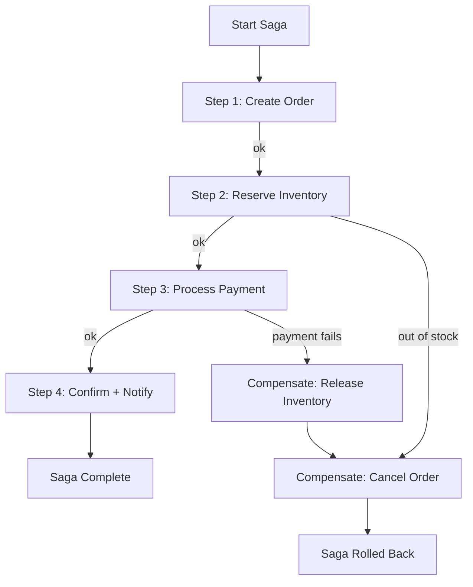

# POC #84: Saga Pattern

> **Difficulty:** 🔴 Advanced
> **Time:** 35 minutes
> **Prerequisites:** Node.js, Distributed systems, Message queues

## 🗺️ Quick Overview



*Each local transaction has a compensating action — failure triggers reverse execution to restore consistency.*

## What You'll Learn

The Saga pattern manages distributed transactions across multiple services by breaking them into local transactions with compensating actions for rollback.

```
DISTRIBUTED TRANSACTION PROBLEM:
┌─────────────────────────────────────────────────────────────────┐
│  Order Service    Payment Service    Inventory Service          │
│       │                 │                   │                   │
│       ├─────────────────┼───────────────────┤                   │
│       │         2PC (Two-Phase Commit)      │                   │
│       │                 │                   │                   │
│  ❌ Doesn't scale! Locks across services = bottleneck           │
│  ❌ Single point of failure                                     │
│  ❌ High latency                                                 │
└─────────────────────────────────────────────────────────────────┘

SAGA SOLUTION:
┌─────────────────────────────────────────────────────────────────┐
│                                                                 │
│  1. Create Order ──▶ 2. Reserve Inventory ──▶ 3. Process Payment│
│         │                    │                      │           │
│         ▼                    ▼                      ▼           │
│  (Compensate:         (Compensate:           (Compensate:       │
│   Cancel Order)        Release Stock)         Refund Payment)   │
│                                                                 │
│  ✅ Each step is a local transaction                            │
│  ✅ Compensating actions for rollback                           │
│  ✅ Eventually consistent                                       │
└─────────────────────────────────────────────────────────────────┘
```

---

## Implementation

```javascript
// saga-pattern.js

// ==========================================
// SAGA STEP DEFINITION
// ==========================================

class SagaStep {
  constructor(name, execute, compensate) {
    this.name = name;
    this.execute = execute;      // Forward action
    this.compensate = compensate; // Rollback action
  }
}

// ==========================================
// SAGA ORCHESTRATOR
// ==========================================

class SagaOrchestrator {
  constructor(sagaId) {
    this.sagaId = sagaId;
    this.steps = [];
    this.executedSteps = [];
    this.context = {};
    this.status = 'pending';
  }

  addStep(step) {
    this.steps.push(step);
    return this;
  }

  async execute(initialContext = {}) {
    this.context = { ...initialContext };
    this.status = 'running';

    console.log(`\n🚀 Starting Saga: ${this.sagaId}`);
    console.log('─'.repeat(50));

    try {
      // Execute steps in order
      for (const step of this.steps) {
        console.log(`\n▶️ Executing: ${step.name}`);

        try {
          const result = await step.execute(this.context);
          this.context = { ...this.context, ...result };
          this.executedSteps.push(step);
          console.log(`✅ ${step.name} completed`);
        } catch (error) {
          console.log(`❌ ${step.name} failed: ${error.message}`);
          throw error;
        }
      }

      this.status = 'completed';
      console.log(`\n✅ Saga ${this.sagaId} completed successfully!`);
      return { success: true, context: this.context };

    } catch (error) {
      // Compensate in reverse order
      console.log(`\n⚠️ Saga failed, starting compensation...`);
      await this.compensate();
      return { success: false, error: error.message, context: this.context };
    }
  }

  async compensate() {
    this.status = 'compensating';

    // Execute compensations in reverse order
    const reversedSteps = [...this.executedSteps].reverse();

    for (const step of reversedSteps) {
      console.log(`\n◀️ Compensating: ${step.name}`);

      try {
        await step.compensate(this.context);
        console.log(`✅ ${step.name} compensated`);
      } catch (compError) {
        console.log(`⚠️ Compensation failed for ${step.name}: ${compError.message}`);
        // In production: Log, alert, and potentially retry
      }
    }

    this.status = 'compensated';
    console.log(`\n🔄 Saga ${this.sagaId} compensation completed`);
  }
}

// ==========================================
// SIMULATED SERVICES
// ==========================================

class OrderService {
  constructor() {
    this.orders = new Map();
  }

  async createOrder(customerId, items, total) {
    const orderId = `ORD-${Date.now()}`;

    // Simulate some processing time
    await this.delay(100);

    this.orders.set(orderId, {
      id: orderId,
      customerId,
      items,
      total,
      status: 'created'
    });

    console.log(`  📦 Order ${orderId} created for $${total}`);
    return { orderId };
  }

  async cancelOrder(orderId) {
    await this.delay(50);

    const order = this.orders.get(orderId);
    if (order) {
      order.status = 'cancelled';
      console.log(`  📦 Order ${orderId} cancelled`);
    }
  }

  async confirmOrder(orderId) {
    await this.delay(50);

    const order = this.orders.get(orderId);
    if (order) {
      order.status = 'confirmed';
      console.log(`  📦 Order ${orderId} confirmed`);
    }
  }

  delay(ms) {
    return new Promise(r => setTimeout(r, ms));
  }
}

class InventoryService {
  constructor() {
    this.inventory = new Map([
      ['PROD-1', { quantity: 100, reserved: 0 }],
      ['PROD-2', { quantity: 50, reserved: 0 }],
      ['PROD-3', { quantity: 0, reserved: 0 }]  // Out of stock
    ]);
    this.reservations = new Map();
  }

  async reserveInventory(orderId, items) {
    await this.delay(150);

    const reservation = [];

    for (const item of items) {
      const stock = this.inventory.get(item.productId);

      if (!stock || stock.quantity - stock.reserved < item.quantity) {
        throw new Error(`Insufficient stock for ${item.productId}`);
      }

      stock.reserved += item.quantity;
      reservation.push({ productId: item.productId, quantity: item.quantity });
    }

    this.reservations.set(orderId, reservation);
    console.log(`  📋 Inventory reserved for order ${orderId}`);
    return { reservationId: orderId };
  }

  async releaseInventory(orderId) {
    await this.delay(50);

    const reservation = this.reservations.get(orderId);
    if (reservation) {
      for (const item of reservation) {
        const stock = this.inventory.get(item.productId);
        if (stock) {
          stock.reserved -= item.quantity;
        }
      }
      this.reservations.delete(orderId);
      console.log(`  📋 Inventory released for order ${orderId}`);
    }
  }

  delay(ms) {
    return new Promise(r => setTimeout(r, ms));
  }
}

class PaymentService {
  constructor() {
    this.payments = new Map();
    this.failNextPayment = false;
  }

  async processPayment(orderId, amount, customerId) {
    await this.delay(200);

    // Simulate occasional failures
    if (this.failNextPayment) {
      this.failNextPayment = false;
      throw new Error('Payment declined by bank');
    }

    const paymentId = `PAY-${Date.now()}`;
    this.payments.set(paymentId, {
      id: paymentId,
      orderId,
      amount,
      customerId,
      status: 'completed'
    });

    console.log(`  💳 Payment ${paymentId} processed: $${amount}`);
    return { paymentId };
  }

  async refundPayment(paymentId) {
    await this.delay(100);

    const payment = this.payments.get(paymentId);
    if (payment) {
      payment.status = 'refunded';
      console.log(`  💳 Payment ${paymentId} refunded`);
    }
  }

  setNextPaymentToFail() {
    this.failNextPayment = true;
  }

  delay(ms) {
    return new Promise(r => setTimeout(r, ms));
  }
}

class NotificationService {
  async sendOrderConfirmation(customerId, orderId) {
    await new Promise(r => setTimeout(r, 50));
    console.log(`  📧 Confirmation email sent to customer ${customerId}`);
    return { notificationSent: true };
  }

  async sendOrderCancellation(customerId, orderId) {
    await new Promise(r => setTimeout(r, 50));
    console.log(`  📧 Cancellation email sent to customer ${customerId}`);
  }
}

// ==========================================
// ORDER SAGA DEFINITION
// ==========================================

function createOrderSaga(services) {
  const { orderService, inventoryService, paymentService, notificationService } = services;

  return new SagaOrchestrator('order-saga')
    // Step 1: Create Order
    .addStep(new SagaStep(
      'Create Order',
      async (ctx) => {
        const result = await orderService.createOrder(
          ctx.customerId,
          ctx.items,
          ctx.total
        );
        return result;
      },
      async (ctx) => {
        await orderService.cancelOrder(ctx.orderId);
      }
    ))
    // Step 2: Reserve Inventory
    .addStep(new SagaStep(
      'Reserve Inventory',
      async (ctx) => {
        const result = await inventoryService.reserveInventory(
          ctx.orderId,
          ctx.items
        );
        return result;
      },
      async (ctx) => {
        await inventoryService.releaseInventory(ctx.orderId);
      }
    ))
    // Step 3: Process Payment
    .addStep(new SagaStep(
      'Process Payment',
      async (ctx) => {
        const result = await paymentService.processPayment(
          ctx.orderId,
          ctx.total,
          ctx.customerId
        );
        return result;
      },
      async (ctx) => {
        if (ctx.paymentId) {
          await paymentService.refundPayment(ctx.paymentId);
        }
      }
    ))
    // Step 4: Confirm Order
    .addStep(new SagaStep(
      'Confirm Order',
      async (ctx) => {
        await orderService.confirmOrder(ctx.orderId);
        return {};
      },
      async (ctx) => {
        // No compensation needed - order was already cancelled in step 1
      }
    ))
    // Step 5: Send Notification
    .addStep(new SagaStep(
      'Send Notification',
      async (ctx) => {
        const result = await notificationService.sendOrderConfirmation(
          ctx.customerId,
          ctx.orderId
        );
        return result;
      },
      async (ctx) => {
        await notificationService.sendOrderCancellation(
          ctx.customerId,
          ctx.orderId
        );
      }
    ));
}

// ==========================================
// DEMONSTRATION
// ==========================================

async function demonstrate() {
  console.log('='.repeat(60));
  console.log('SAGA PATTERN - DISTRIBUTED TRANSACTIONS');
  console.log('='.repeat(60));

  // Initialize services
  const services = {
    orderService: new OrderService(),
    inventoryService: new InventoryService(),
    paymentService: new PaymentService(),
    notificationService: new NotificationService()
  };

  // Scenario 1: Successful Order
  console.log('\n' + '═'.repeat(60));
  console.log('SCENARIO 1: Successful Order');
  console.log('═'.repeat(60));

  const successSaga = createOrderSaga(services);
  const successResult = await successSaga.execute({
    customerId: 'CUST-001',
    items: [
      { productId: 'PROD-1', quantity: 2 },
      { productId: 'PROD-2', quantity: 1 }
    ],
    total: 299.99
  });
  console.log('\nResult:', successResult);

  // Scenario 2: Payment Failure (triggers compensation)
  console.log('\n' + '═'.repeat(60));
  console.log('SCENARIO 2: Payment Failure');
  console.log('═'.repeat(60));

  services.paymentService.setNextPaymentToFail();

  const failSaga = createOrderSaga(services);
  const failResult = await failSaga.execute({
    customerId: 'CUST-002',
    items: [{ productId: 'PROD-1', quantity: 5 }],
    total: 499.99
  });
  console.log('\nResult:', failResult);

  // Scenario 3: Inventory Failure (out of stock)
  console.log('\n' + '═'.repeat(60));
  console.log('SCENARIO 3: Out of Stock');
  console.log('═'.repeat(60));

  const stockSaga = createOrderSaga(services);
  const stockResult = await stockSaga.execute({
    customerId: 'CUST-003',
    items: [{ productId: 'PROD-3', quantity: 1 }],  // Out of stock
    total: 99.99
  });
  console.log('\nResult:', stockResult);

  console.log('\n✅ Demo complete!');
}

demonstrate().catch(console.error);
```

---

## Saga Types

| Type | Orchestration | Choreography |
|------|---------------|--------------|
| **Control** | Central orchestrator | Event-driven |
| **Complexity** | Easier to understand | More complex |
| **Coupling** | Services coupled to orchestrator | Loosely coupled |
| **Debugging** | Easy to trace | Harder to trace |
| **Use Case** | Complex workflows | Simple workflows |

---

## Compensation Strategies

```
COMPENSATION BEST PRACTICES:

1. SEMANTIC REVERSAL
   ├── Create Order → Cancel Order
   ├── Reserve Stock → Release Stock
   └── Charge Payment → Refund Payment

2. IDEMPOTENT COMPENSATIONS
   └── Running compensation twice has same effect

3. RETRY WITH BACKOFF
   └── Compensation can fail too - must retry

4. DEAD LETTER QUEUE
   └── Unrecoverable compensations need manual handling

5. TIMEOUT HANDLING
   └── Set deadlines for each step
```

---

## Real-World Examples

```
UBER RIDE SAGA:
1. Create Ride Request → Cancel Ride
2. Match Driver → Release Driver
3. Start Trip → End Trip Early
4. Calculate Fare → Void Fare
5. Charge Rider → Refund Rider
6. Pay Driver → Reverse Payment

AMAZON ORDER SAGA:
1. Validate Order → Mark Invalid
2. Reserve Inventory → Release Inventory
3. Process Payment → Refund Payment
4. Ship Order → Cancel Shipment
5. Update Status → Revert Status
```

---

## Related POCs

- [Event Sourcing Basics](/04-messaging/hands-on/event-sourcing-basics)
- [CQRS Pattern](/10-architecture/hands-on/cqrs-pattern)
- [Outbox Pattern](/04-messaging/hands-on/outbox-pattern)
