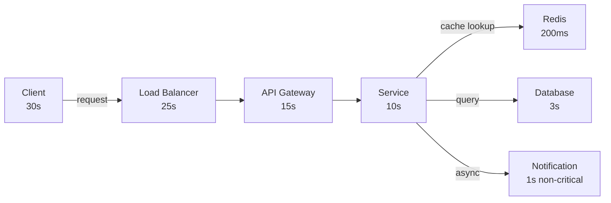

# POC #76: Timeout Configuration Patterns

> **Difficulty:** 🟡 Intermediate
> **Time:** 20 minutes
> **Prerequisites:** Node.js, HTTP basics

## 🗺️ Quick Overview



*Each layer's timeout must be shorter than its upstream so the caller never retries a request still in flight downstream.*

## ⚡ Quick Reference Implementation

```javascript
// Timeout wrapper — copy-paste template
function withTimeout(promise, ms, name = 'operation') {
  let timer;
  const timeout = new Promise((_, reject) => {
    timer = setTimeout(() => reject(new Error(`${name} timed out after ${ms}ms`)), ms);
  });
  return Promise.race([promise, timeout]).finally(() => clearTimeout(timer));
}

// Deadline propagation: pass remaining budget downstream
function getRemainingBudget(startTime, totalBudgetMs, bufferMs = 100) {
  const elapsed = Date.now() - startTime;
  return Math.max(0, totalBudgetMs - elapsed - bufferMs);
}

// Usage: cascading timeout budget
async function handleRequest(req) {
  const start = Date.now();
  const total = 10000;  // 10s total budget
  await withTimeout(checkInventory(), Math.min(2000, getRemainingBudget(start, total)), 'inventory');
  await withTimeout(processPayment(), Math.min(5000, getRemainingBudget(start, total)), 'payment');
}
```

---

## What You'll Learn

Proper timeout configuration prevents cascading failures. Wrong timeouts cause either premature failures or resource exhaustion.

```
TIMEOUT LAYERS:
┌─────────────────────────────────────────────────────────────────┐
│                                                                 │
│  Client ──▶ Load Balancer ──▶ API Gateway ──▶ Service ──▶ DB   │
│    │            │                  │            │          │    │
│   30s          60s                10s          5s         2s    │
│                                                                 │
│  Rule: Each layer timeout < previous layer timeout             │
│  Otherwise: Upstream retries while downstream still processing │
│                                                                 │
└─────────────────────────────────────────────────────────────────┘
```

---

## Implementation

```javascript
// timeout-patterns.js
const http = require('http');
const https = require('https');

// ==========================================
// PATTERN 1: HTTP CLIENT TIMEOUTS
// ==========================================

class HttpClient {
  constructor(options = {}) {
    this.connectTimeout = options.connectTimeout || 3000;   // TCP connection
    this.socketTimeout = options.socketTimeout || 10000;    // Idle socket
    this.requestTimeout = options.requestTimeout || 30000;  // Total request
  }

  async request(url, options = {}) {
    return new Promise((resolve, reject) => {
      const startTime = Date.now();
      const parsedUrl = new URL(url);
      const protocol = parsedUrl.protocol === 'https:' ? https : http;

      // Overall request timeout
      const requestTimer = setTimeout(() => {
        req.destroy();
        reject(new Error(`Request timeout after ${this.requestTimeout}ms`));
      }, this.requestTimeout);

      const req = protocol.request(url, {
        ...options,
        timeout: this.connectTimeout  // Connection timeout
      }, (res) => {
        let data = '';
        res.on('data', chunk => data += chunk);
        res.on('end', () => {
          clearTimeout(requestTimer);
          const elapsed = Date.now() - startTime;
          resolve({ status: res.statusCode, data, elapsed });
        });
      });

      // Socket timeout (idle)
      req.setTimeout(this.socketTimeout, () => {
        req.destroy();
        reject(new Error(`Socket timeout after ${this.socketTimeout}ms`));
      });

      req.on('error', (err) => {
        clearTimeout(requestTimer);
        reject(err);
      });

      if (options.body) {
        req.write(options.body);
      }
      req.end();
    });
  }
}

// ==========================================
// PATTERN 2: DATABASE QUERY TIMEOUTS
// ==========================================

class DatabaseClient {
  constructor(pool) {
    this.pool = pool;
    this.defaultTimeout = 5000;  // 5 seconds
  }

  async query(sql, params, options = {}) {
    const timeout = options.timeout || this.defaultTimeout;
    const client = await this.pool.connect();

    try {
      // Set statement timeout for this connection
      await client.query(`SET statement_timeout = ${timeout}`);

      const startTime = Date.now();
      const result = await client.query(sql, params);
      const elapsed = Date.now() - startTime;

      console.log(`Query completed in ${elapsed}ms`);
      return result;
    } catch (error) {
      if (error.message.includes('canceling statement due to statement timeout')) {
        throw new Error(`Query timeout after ${timeout}ms`);
      }
      throw error;
    } finally {
      client.release();
    }
  }
}

// ==========================================
// PATTERN 3: CASCADING TIMEOUTS
// ==========================================

class OrderService {
  constructor() {
    // Each downstream call has smaller timeout than overall operation
    this.overallTimeout = 10000;  // 10s total for order
    this.inventoryTimeout = 2000; // 2s for inventory check
    this.paymentTimeout = 5000;   // 5s for payment
    this.notificationTimeout = 1000; // 1s for notification (non-critical)
  }

  async placeOrder(order) {
    const startTime = Date.now();

    const withTimeout = async (promise, timeout, name) => {
      const timeoutPromise = new Promise((_, reject) => {
        setTimeout(() => reject(new Error(`${name} timeout after ${timeout}ms`)), timeout);
      });
      return Promise.race([promise, timeoutPromise]);
    };

    const remainingTime = () => this.overallTimeout - (Date.now() - startTime);

    try {
      // Check if we have enough time
      if (remainingTime() < this.inventoryTimeout) {
        throw new Error('Insufficient time for order processing');
      }

      // Step 1: Check inventory (2s timeout)
      console.log(`Checking inventory (timeout: ${this.inventoryTimeout}ms)...`);
      await withTimeout(
        this.checkInventory(order),
        Math.min(this.inventoryTimeout, remainingTime()),
        'Inventory check'
      );

      // Step 2: Process payment (5s timeout)
      if (remainingTime() < this.paymentTimeout) {
        throw new Error('Insufficient time for payment processing');
      }

      console.log(`Processing payment (timeout: ${this.paymentTimeout}ms)...`);
      const payment = await withTimeout(
        this.processPayment(order),
        Math.min(this.paymentTimeout, remainingTime()),
        'Payment processing'
      );

      // Step 3: Send notification (1s timeout, non-critical)
      console.log(`Sending notification (timeout: ${this.notificationTimeout}ms)...`);
      try {
        await withTimeout(
          this.sendNotification(order),
          Math.min(this.notificationTimeout, remainingTime()),
          'Notification'
        );
      } catch (e) {
        // Non-critical, log and continue
        console.log(`Notification failed (non-critical): ${e.message}`);
      }

      return { success: true, orderId: payment.orderId, elapsed: Date.now() - startTime };
    } catch (error) {
      return { success: false, error: error.message, elapsed: Date.now() - startTime };
    }
  }

  // Simulated downstream calls
  async checkInventory(order) {
    await new Promise(r => setTimeout(r, 500)); // 500ms
    return { available: true };
  }

  async processPayment(order) {
    await new Promise(r => setTimeout(r, 2000)); // 2s
    return { orderId: 'ord_' + Date.now() };
  }

  async sendNotification(order) {
    await new Promise(r => setTimeout(r, 300)); // 300ms
    return { sent: true };
  }
}

// ==========================================
// PATTERN 4: ADAPTIVE TIMEOUTS
// ==========================================

class AdaptiveTimeout {
  constructor(options = {}) {
    this.baseTimeout = options.baseTimeout || 1000;
    this.maxTimeout = options.maxTimeout || 10000;
    this.minTimeout = options.minTimeout || 100;
    this.percentile = options.percentile || 99;  // p99

    this.latencies = [];
    this.windowSize = options.windowSize || 100;
  }

  recordLatency(latency) {
    this.latencies.push(latency);
    if (this.latencies.length > this.windowSize) {
      this.latencies.shift();
    }
  }

  getTimeout() {
    if (this.latencies.length < 10) {
      return this.baseTimeout;  // Not enough data
    }

    // Calculate percentile
    const sorted = [...this.latencies].sort((a, b) => a - b);
    const index = Math.ceil(sorted.length * this.percentile / 100) - 1;
    const p99 = sorted[index];

    // Add 20% buffer
    const timeout = Math.round(p99 * 1.2);

    // Clamp to bounds
    return Math.max(this.minTimeout, Math.min(this.maxTimeout, timeout));
  }

  async execute(fn) {
    const timeout = this.getTimeout();
    const startTime = Date.now();

    try {
      const result = await Promise.race([
        fn(),
        new Promise((_, reject) =>
          setTimeout(() => reject(new Error('Timeout')), timeout)
        )
      ]);

      this.recordLatency(Date.now() - startTime);
      return result;
    } catch (error) {
      if (error.message !== 'Timeout') {
        this.recordLatency(Date.now() - startTime);
      }
      throw error;
    }
  }
}

// ==========================================
// DEMONSTRATION
// ==========================================

async function demonstrate() {
  console.log('='.repeat(60));
  console.log('TIMEOUT CONFIGURATION PATTERNS');
  console.log('='.repeat(60));

  // Demo 1: HTTP Client Timeouts
  console.log('\n--- HTTP Client Timeouts ---');
  const client = new HttpClient({
    connectTimeout: 2000,
    socketTimeout: 5000,
    requestTimeout: 10000
  });

  try {
    const result = await client.request('https://httpbin.org/delay/1');
    console.log(`Success: ${result.status} in ${result.elapsed}ms`);
  } catch (e) {
    console.log(`Failed: ${e.message}`);
  }

  // Demo 2: Cascading Timeouts
  console.log('\n--- Cascading Timeouts ---');
  const orderService = new OrderService();
  const orderResult = await orderService.placeOrder({ items: ['item1'] });
  console.log('Order result:', orderResult);

  // Demo 3: Adaptive Timeouts
  console.log('\n--- Adaptive Timeouts ---');
  const adaptive = new AdaptiveTimeout({ baseTimeout: 1000 });

  // Simulate varying latencies
  const latencies = [100, 150, 120, 200, 180, 500, 130, 140, 160, 170];
  latencies.forEach(l => adaptive.recordLatency(l));

  console.log(`Recorded latencies: ${latencies.join(', ')}ms`);
  console.log(`Calculated timeout (p99 + 20%): ${adaptive.getTimeout()}ms`);

  console.log('\n✅ Demo complete!');
}

demonstrate().catch(console.error);
```

---

## Timeout Guidelines

| Layer | Typical Timeout | Rationale |
|-------|----------------|-----------|
| Client → LB | 30-60s | User patience limit |
| LB → API Gateway | 20-30s | Less than client |
| API → Service | 5-15s | Leave room for retries |
| Service → DB | 2-5s | Queries should be fast |
| Service → Cache | 100-500ms | Cache should be instant |

---

## Anti-Patterns

```javascript
// ❌ WRONG: No timeout
const response = await fetch(url);  // Can hang forever

// ❌ WRONG: Downstream timeout > upstream
// Gateway: 5s, Service: 10s
// Service still processing when gateway gives up

// ❌ WRONG: Same timeout everywhere
// All services: 30s timeout
// Slow service blocks everything

// ✅ CORRECT: Cascading timeouts
// Gateway: 10s
// Service A: 5s
// Service B: 3s
// Database: 2s
```

---

## 🎯 Interview Questions

### Implementation-Focused Interview Questions

#### Q1: How do you set appropriate timeout values for each tier in a distributed system?

**What interviewers look for**: The cascade rule and the practical heuristics for sizing timeouts.

**Answer framework**:
1. **The cascade rule**: each downstream timeout MUST be shorter than the upstream timeout that wraps it; otherwise the upstream retries while the downstream is still working — double processing
2. **Rule of thumb**: downstream timeout = upstream timeout × 0.5, with some buffer for network overhead
3. **Database queries**: profile your p99 query time, set timeout at p99 × 1.5 (fail fast on outliers)
4. **Cache (Redis)**: 100-500ms — if Redis takes more than 500ms, treat as down and use fallback
5. Start with these defaults and tune based on observed p99 latency

**Code snippet that impresses**:
```
// Correct cascade — each layer shorter than its parent
Client       → 30s   (user patience limit)
Load Balancer→ 25s   (must be < Client)
API Gateway  → 15s   (must be < Load Balancer)
Microservice → 10s   (must be < API Gateway)
  → Database  → 3s   (must be < Microservice)
  → Redis     → 200ms (must be < Microservice)
  → 3rd party → 5s   (non-critical: wrap in try/catch, non-blocking)
```

---

#### Q2: What is deadline propagation and why does it matter?

**What interviewers look for**: gRPC context propagation pattern and the problem with independent per-hop timeouts.

**Answer framework**:
1. **Problem**: Service A has a 10s timeout calling Service B; B has a 10s timeout calling C; total possible wait: 20s — but A's user already gave up at 10s
2. **Deadline propagation**: the original deadline is passed down the call chain as a context deadline; each service uses `min(its_own_timeout, remaining_deadline)` as its effective timeout
3. gRPC propagates deadlines automatically via `context.WithDeadline`; HTTP services must implement it manually via request headers (e.g., `X-Request-Deadline`)
4. Benefit: no wasted work — if the client already timed out, downstream services abort immediately

**Code snippet that impresses**:
```javascript
// Pass remaining deadline downstream
async function callDownstream(request, remainingMs) {
  const deadline = Date.now() + remainingMs;
  const myTimeout = 5000;  // My configured timeout
  const effectiveTimeout = Math.min(myTimeout, remainingMs - 200);  // 200ms buffer

  return await fetch(DOWNSTREAM_URL, {
    signal: AbortSignal.timeout(effectiveTimeout),
    headers: { 'X-Request-Deadline': deadline.toString() }
  });
}
```

---

#### Q3: How do you distinguish between a connect timeout, a read timeout, and a request timeout? Why does the distinction matter?

**What interviewers look for**: Network timeout taxonomy and proper configuration of HTTP clients.

**Answer framework**:
1. **Connect timeout**: how long to wait for the TCP handshake to complete — typically 2-5s; should be short (a server that can't accept connections in 5s is likely down)
2. **Read/socket timeout**: how long to wait for data after the connection is established — covers slow responses mid-stream
3. **Request timeout**: the total wall-clock time budget for the entire request including connect + transfer
4. Missing connect timeout is a common bug: the default is often unlimited, meaning a firewall black-hole can block a thread forever

---

#### Q4: What happens when a timeout fires but the downstream service has already processed the request?

**What interviewers look for**: The idempotency connection — timeouts create the exactly-once problem.

**Answer framework**:
1. This is the "did it commit or not?" problem — the request may have been processed but the response was lost
2. For non-idempotent operations (payment, order creation): you don't know if retrying will double-charge
3. Solution: use idempotency keys — client generates a UUID and sends it on every attempt; server deduplicates using that key
4. For database operations: wrap in a transaction — if the connection times out, the transaction rolls back automatically (assuming the connection is closed)

---

#### Q5: How do you implement an adaptive timeout that adjusts based on observed latency?

**What interviewers look for**: Dynamic configuration instead of static magic numbers, and percentile-based sizing.

**Answer framework**:
1. Track a sliding window of the last N request latencies for each downstream dependency
2. Compute p99 of the window; set timeout = p99 × 1.2 (20% safety buffer)
3. Clamp to `[minTimeout, maxTimeout]` to prevent the timeout from drifting to extremes
4. Use this to auto-tune in development; in production, promote calculated timeouts to config values after validation

---

## Related POCs

- [Retry with Backoff](/10-architecture/hands-on/retry-backoff)
- [Circuit Breaker](/10-architecture/hands-on/circuit-breaker)
- [Timeouts & Backpressure](/10-architecture/concepts/timeouts-backpressure)

## Further Reading

**Concept articles:**
- [Timeouts & Backpressure](/10-architecture/concepts/timeouts-backpressure)
- [Backpressure](/10-architecture/concepts/backpressure)

**Interview prep:**
- [High Concurrency API Design](/12-interview-prep/system-design/fundamentals/high-concurrency-api)

**Failure modes:**
- [Timeout Domino Effect](/10-architecture/failures/timeout-domino-effect)
- [Cascading Failures](/10-architecture/failures/cascading-failures)
