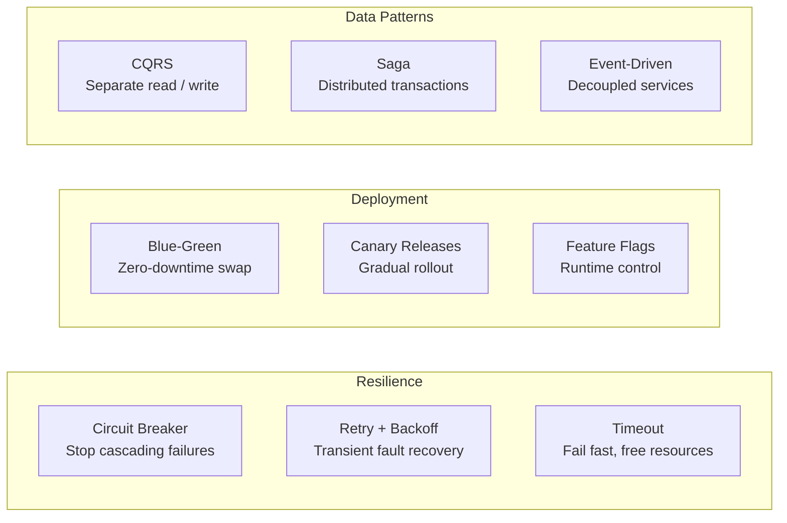

# Architecture & Patterns

Architecture patterns are reusable solutions to recurring problems. This section covers circuit breakers, sagas, microservices communication, service meshes, deployment strategies, and more.

## Navigate by Role

| I am... | Start here | Goal |
|---------|-----------|------|
| 🟢 Junior | [microservices-architecture](./concepts/microservices-architecture) | Understand microservices vs monolith trade-offs |
| 🟡 Mid-level | [circuit-breaker](./concepts/circuit-breaker) + [api-gateway](/07-api-design/concepts/api-gateway-deep-dive) | Build resilient distributed systems |
| 🔴 Senior / TL | [saga-pattern-deep-dive](./concepts/saga-pattern-deep-dive) + [cqrs](./concepts/cqrs) | Design complex event-driven architectures |
| 🏆 Interview prepping | [business-and-advanced questions](../12-interview-prep/system-design/business-and-advanced) | Advanced architecture interview patterns |

## What You'll Learn

- **Concepts**: Circuit breaker, saga pattern, bulkhead, strangler fig, CQRS, event-driven architecture
- **Hands-On**: Implement resilience patterns with working code
- **Failure Modes**: Cascading failures, retry storms, split brain, thundering herd

## Where to Start

1. [Circuit Breaker](/10-architecture/concepts/circuit-breaker) — Stop cascading failures
2. [Saga Pattern Deep Dive](/10-architecture/concepts/saga-pattern-deep-dive) — Distributed transaction coordination
3. [Microservices Architecture](/10-architecture/concepts/microservices-architecture) — When microservices make sense
4. [Cascading Failures](/10-architecture/failures/cascading-failures) — The most common production disaster

## Topic Map

| Topic | 📖 Concept | 🔬 Hands-On | ⚠️ Failures | 🎯 Interview |
|-------|-----------|------------|------------|-------------|
| Circuit Breaker | [circuit-breaker](./concepts/circuit-breaker) | [circuit-breaker](./hands-on/circuit-breaker) | [cascading-failures](./failures/cascading-failures), [circuit-breaker-failure](./failures/circuit-breaker-failure) | [fundamentals](../12-interview-prep/system-design/fundamentals) |
| Microservices Architecture | [microservices-architecture](./concepts/microservices-architecture) | — | — | [scale-and-reliability](../12-interview-prep/system-design/scale-and-reliability) |
| Microservices Communication | [microservices-communication](./concepts/microservices-communication) | — | — | — |
| Timeouts & Backpressure | [timeouts-backpressure](./concepts/timeouts-backpressure), [backpressure](./concepts/backpressure) | [retry-backoff](./hands-on/retry-backoff), [timeout-configuration](./hands-on/timeout-configuration) | [timeout-domino-effect](./failures/timeout-domino-effect) | — |
| Saga Pattern | [saga-pattern-deep-dive](./concepts/saga-pattern-deep-dive) | [saga-pattern](./hands-on/saga-pattern) | — | [saga-pattern](../12-interview-prep/system-design/business-and-advanced/saga-pattern) |
| CQRS | [cqrs](./concepts/cqrs) | [cqrs-pattern](./hands-on/cqrs-pattern) | — | [cqrs-pattern](../12-interview-prep/system-design/business-and-advanced/cqrs-pattern) |
| Event-Driven Architecture | [event-driven-architecture](./concepts/event-driven-architecture) | — | — | [messaging-and-streaming](../12-interview-prep/system-design/messaging-and-streaming) |
| Bulkhead Pattern | [bulkhead-pattern](./concepts/bulkhead-pattern) | — | — | — |
| Strangler Fig Migration | [strangler-fig-migration](./concepts/strangler-fig-migration) | — | — | — |
| Service Mesh | [service-mesh-architecture](./concepts/service-mesh-architecture) | — | — | — |
| Deployment Strategies | [deployment-strategies-deep-dive](./concepts/deployment-strategies-deep-dive) | [blue-green-deployment](./hands-on/blue-green-deployment), [canary-releases](./hands-on/canary-releases) | — | — |
| Feature Flags | [feature-flag-architecture](./concepts/feature-flag-architecture) | [feature-flags](./hands-on/feature-flags) | — | — |
| Load Balancing | [load-balancing-strategies](./concepts/load-balancing-strategies) | — | — | — |
| Async Processing | [async-processing](./concepts/async-processing) | — | — | — |
| Chaos Engineering | [chaos-engineering](./concepts/chaos-engineering) | [chaos-engineering](./hands-on/chaos-engineering) | — | — |
| CDN & Edge Computing | [cdn-edge-computing](./concepts/cdn-edge-computing) | — | — | — |
| Retry Storm | — | — | [retry-storm](./failures/retry-storm) | — |
| Thundering Herd | — | — | [thundering-herd](./failures/thundering-herd) | — |
| Split Brain | — | — | [split-brain](./failures/split-brain) | — |
| Graceful Degradation | — | [graceful-degradation](./hands-on/graceful-degradation) | — | — |
| Contract Testing | — | [contract-testing](./hands-on/contract-testing) | — | — |
| Integration Testing | — | [integration-testing](./hands-on/integration-testing) | — | — |
