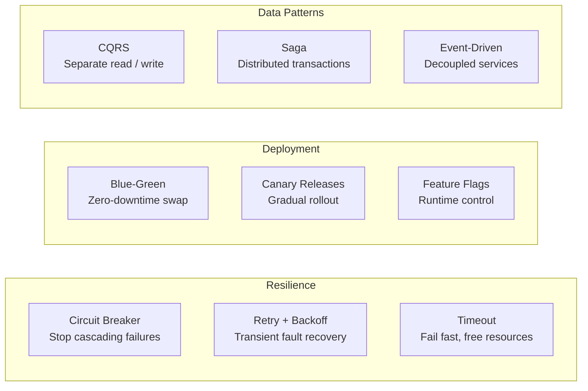

# Architecture & Patterns

Architecture patterns are reusable solutions to recurring problems. This section covers circuit breakers, sagas, microservices communication, service meshes, deployment strategies, and more.

## What You'll Learn

- **Concepts**: Circuit breaker, saga pattern, bulkhead, strangler fig, CQRS, event-driven architecture
- **Hands-On**: Implement resilience patterns with working code
- **Failure Modes**: Cascading failures, retry storms, split brain, thundering herd

## Where to Start

1. [Circuit Breaker](/10-architecture/concepts/circuit-breaker) — Stop cascading failures
2. [Saga Pattern Deep Dive](/10-architecture/concepts/saga-pattern-deep-dive) — Distributed transaction coordination
3. [Microservices Architecture](/10-architecture/concepts/microservices-architecture) — When microservices make sense
4. [Cascading Failures](/10-architecture/failures/cascading-failures) — The most common production disaster

## Topic Map

| Topic | Concepts | Hands-On | Problems at Scale | Interview Prep |
|-------|----------|----------|-------------------|----------------|
| Circuit breaker | [circuit-breaker](/10-architecture/concepts/circuit-breaker) | [circuit-breaker](/10-architecture/hands-on/circuit-breaker) | [cascading-failures](/problems-at-scale/availability/cascading-failures), [circuit-breaker-failure](/problems-at-scale/availability/cascading-failures) | [circuit-breaker-pattern](/12-interview-prep/system-design/fundamentals/circuit-breaker-pattern) |
| Microservices comms | [microservices-communication](/10-architecture/concepts/microservices-communication) | — | — | [monolith-to-microservices](/12-interview-prep/system-design/scale-and-reliability/monolith-to-microservices) |
| Timeouts & backpressure | [timeouts-backpressure](/10-architecture/concepts/timeouts-backpressure), [backpressure](/10-architecture/concepts/backpressure) | [retry-backoff](/10-architecture/hands-on/retry-backoff), [timeout-configuration](/10-architecture/hands-on/timeout-configuration) | — | — |
| Event-driven | [event-driven-architecture](/10-architecture/concepts/event-driven-architecture) | [event-sourcing-basics](/10-architecture/hands-on/event-sourcing-basics) | — | [event-driven-architecture](/12-interview-prep/system-design/messaging-and-streaming/event-driven-architecture) |
| CQRS | [cqrs](/10-architecture/concepts/cqrs) | — | — | [cqrs-pattern](/12-interview-prep/system-design/business-and-advanced/cqrs-pattern) |
| Saga pattern | [saga-pattern-deep-dive](/10-architecture/concepts/saga-pattern-deep-dive) | [saga-pattern](/10-architecture/hands-on/saga-pattern) | — | [saga-pattern](/12-interview-prep/system-design/business-and-advanced/saga-pattern) |
