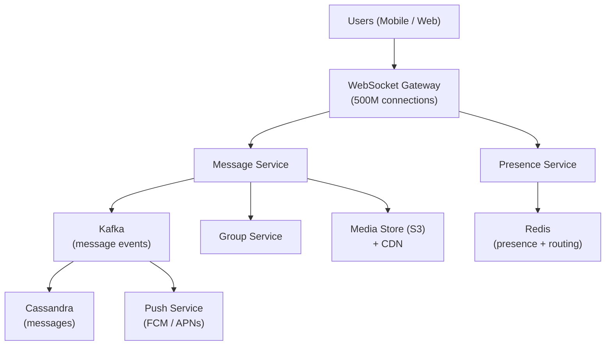

# Design a Chat System (WhatsApp / Slack)

**Difficulty**: Intermediate
**Time**: 60 minutes
**Companies**: Meta, Google, Microsoft, Uber, Amazon (Top-3 most asked system design question)

## 🗺️ Quick Overview



*Messages flow through persistent WebSocket connections to stateless services backed by Cassandra for storage and Redis for real-time routing.*

## 1. Problem Statement

Design a real-time messaging system that supports:
- One-on-one conversations
- Group chats
- Message delivery to offline users
- Read receipts and typing indicators
- Multimedia messages (images, videos, files)

**Scale reference (WhatsApp):**

```
Users: 2 billion+
Daily messages: 100 billion+
Peak messages: 70 million per second
Group size: Up to 1024 members
Media shared: 7 billion photos/day
End-to-end encrypted: All messages
```

## 2. Requirements

### Functional Requirements
1. Send/receive messages in real-time (1:1 and group)
2. Online/offline presence detection
3. Message delivery guarantees (sent, delivered, read)
4. Support text, images, videos, documents
5. Push notifications for offline users
6. Group chats (up to 500 members)

### Non-Functional Requirements
1. **Real-time** (< 100ms delivery for online users)
2. **Reliable** (no message loss, ordered delivery)
3. **Scalable** (500M+ daily active users)
4. **Available** (99.99% uptime)
5. **Low bandwidth** (optimize for mobile networks)
6. **Secure** (end-to-end encryption)

### Out of Scope
- Voice/video calls
- Stories/status features
- Payment features
- Message search (full-text)

## 3. Capacity Estimation

### Traffic
```
Daily active users: 500M
Messages per user per day: 40
Total messages per day: 20 billion

Messages per second:
  Average: 20B / 86,400 = 230,000 msg/sec
  Peak (3x): 700,000 msg/sec

Connections:
  500M users × 1 WebSocket connection = 500M concurrent connections
  (Not all online simultaneously - typically 10-20% at any time)
  Active connections: 50-100M concurrent
```

### Storage
```
Average message size: 100 bytes (text)
Average media size: 500 KB

Text storage per day:
  20B messages × 100 bytes = 2 TB/day

Media storage per day:
  2B media messages × 500 KB = 1 PB/day

Retention:
  Text: Forever (unless user deletes)
  Media: 30 days on server, permanent in cloud backup
```

## 4. High-Level Design

```
┌──────────────────────────────────────────────────────────────┐
│                        Client Layer                          │
│  ┌──────────┐   ┌──────────┐   ┌──────────┐                  │
│  │  Mobile  │   │  Desktop │   │   Web    │                  │
│  │   App    │   │   App    │   │  Client  │                  │
│  └─────┬────┘   └─────┬────┘   └─────┬────┘                  │
│        │              │              │                        │
│        └──────────────┼──────────────┘                        │
│                       │ WebSocket / MQTT                      │
└───────────────────────┼──────────────────────────────────────┘
                        │
┌───────────────────────▼──────────────────────────────────────┐
│                   Gateway Layer                              │
│  ┌──────────────────────────────────┐                        │
│  │      WebSocket Gateway           │  Manages persistent    │
│  │   (Connection Management)        │  connections           │
│  │                                  │  500M+ connections     │
│  │  ┌────┐ ┌────┐ ┌────┐ ┌────┐    │                        │
│  │  │GW-1│ │GW-2│ │GW-3│ │GW-N│    │  Horizontally scaled   │
│  │  └────┘ └────┘ └────┘ └────┘    │                        │
│  └──────────────┬───────────────────┘                        │
└─────────────────┼────────────────────────────────────────────┘
                  │
┌─────────────────▼────────────────────────────────────────────┐
│                   Service Layer                              │
│                                                              │
│  ┌──────────┐  ┌──────────┐  ┌──────────┐  ┌──────────┐      │
│  │ Message  │  │ Presence │  │  Group   │  │   Push   │      │
│  │ Service  │  │ Service  │  │ Service  │  │ Service  │      │
│  └─────┬────┘  └─────┬────┘  └─────┬────┘  └─────┬────┘      │
│        │             │             │             │            │
│  ┌─────▼─────────────▼─────────────▼─────────────▼────────┐  │
│  │              Message Queue (Kafka)                     │  │
│  └────────────────────────────────────────────────────────┘  │
└──────────────────────────────────────────────────────────────┘
                  │
┌─────────────────▼────────────────────────────────────────────┐
│                   Storage Layer                              │
│                                                              │
│  ┌──────────┐  ┌──────────┐  ┌──────────┐  ┌──────────┐      │
│  │ Message  │  │  User    │  │  Redis   │  │  Media   │      │
│  │   DB     │  │   DB     │  │ (Cache + │  │  Store   │      │
│  │(Cassandra│  │(PostgreSQL│  │ Presence)│  │  (S3)    │      │
│  └──────────┘  └──────────┘  └──────────┘  └──────────┘      │
│                                                              │
└──────────────────────────────────────────────────────────────┘
```

## 5. Core Components

### WebSocket Connection Management

```
Why WebSocket?

HTTP Polling:
  Client: "Any new messages?"  (every 1 second)
  Server: "No"
  Client: "Any new messages?"
  Server: "No"
  Client: "Any new messages?"
  Server: "Yes, here's one!"
  Problem: 99% of requests are wasted

Long Polling:
  Client: "Any new messages?" (waits...)
  Server: ...... (holds connection for 30 seconds)
  Server: "Yes, here's one!"
  Problem: Server holds too many connections, overhead on reconnect

WebSocket:
  Client ←──── persistent connection ────→ Server
  Server pushes messages instantly when they arrive
  Bidirectional, low overhead, real-time
```

```
Connection routing:

User A connects → Gateway Server 3
User B connects → Gateway Server 7

How does a message from A reach B?

Connection Registry (Redis):
  user_A → gateway_server_3
  user_B → gateway_server_7

Message flow:
  1. User A sends message to Gateway 3
  2. Gateway 3 → Message Service
  3. Message Service looks up User B → Gateway 7
  4. Message Service → Gateway 7
  5. Gateway 7 → push to User B's WebSocket

┌──────┐   ┌─────────┐   ┌──────────┐   ┌─────────┐   ┌──────┐
│User A│──▶│Gateway 3│──▶│ Message  │──▶│Gateway 7│──▶│User B│
│      │   │         │   │ Service  │   │         │   │      │
└──────┘   └─────────┘   └──────────┘   └─────────┘   └──────┘
                              │
                    ┌─────────▼──────────┐
                    │  Redis: User→GW    │
                    │  A → GW3           │
                    │  B → GW7           │
                    └────────────────────┘
```

### Message Flow: 1-on-1 Chat

```
User A sends "Hello!" to User B:

1. SEND
   A → Gateway: { to: "B", text: "Hello!", msgId: "m1" }

2. ACKNOWLEDGE (sent ✓)
   Gateway → A: { msgId: "m1", status: "sent", timestamp: T1 }

3. STORE
   Message Service → Cassandra: Store message
   Message Service → Kafka: Publish event

4. ROUTE
   a) If B is ONLINE:
      Message Service → Gateway(B) → B: { from: "A", text: "Hello!" }
      B → Gateway: { msgId: "m1", status: "delivered" }
      Gateway → A: { msgId: "m1", status: "delivered" ✓✓ }

   b) If B is OFFLINE:
      Message Service → Push Service → FCM/APNs
      B gets push notification
      When B comes online:
        B → Gateway: "Get my pending messages"
        Gateway → Message Service → return undelivered messages

5. READ RECEIPT
   B reads message
   B → Gateway: { msgId: "m1", status: "read" }
   Gateway → A: { msgId: "m1", status: "read" ✓✓ blue }
```

### Message Flow: Group Chat

```
Group: "Engineering Team" (150 members)
User A sends: "Deploy successful!"

Approach 1: Fan-out on write (WhatsApp approach)
  Store message once
  Create delivery record for each member
  Push to each online member's gateway

  Message → ┌──────────────┐
            │ Group Service│
            │              │
            │ Members:     │
            │ B (online)  ─┼──▶ Gateway(B) → B
            │ C (online)  ─┼──▶ Gateway(C) → C
            │ D (offline) ─┼──▶ Push notification
            │ ... (147)    │──▶ Batch processing
            └──────────────┘

  Pro: Read is fast (pre-delivered)
  Con: Write is expensive (150 deliveries per message)

Approach 2: Fan-out on read (Slack approach)
  Store message with group_id
  Members fetch messages when they open the chat

  Pro: Write is fast (single write)
  Con: Read may be slow (query on open)
  Best for: Large groups, less active chats

WhatsApp hybrid:
  Small groups (< 100): Fan-out on write
  Large groups (100+): Fan-out on read + push for mentions
```

### Presence Detection

```
How to know if a user is online?

Heartbeat approach:
  Client sends heartbeat every 30 seconds
  Server marks user as "online"
  No heartbeat for 60 seconds → "offline"

  ┌──────┐  heartbeat (30s)  ┌──────────────┐
  │Client│ ──────────────── ▶│   Presence   │
  │      │                   │   Service    │
  └──────┘                   │              │
                             │ Redis:       │
                             │ user:A → online (TTL 60s)│
                             │ user:B → online (TTL 60s)│
                             │ user:C → (expired=offline)│
                             └──────────────┘

Optimization for large contact lists:
  - Don't broadcast presence to ALL contacts
  - Only update presence for users who have the chat open
  - Batch presence updates (every 5 seconds)
  - WhatsApp: Only shows "last seen" when you open a chat
```

## 6. Storage Design

### Message Storage (Cassandra)

```
Why Cassandra?
  - Handles 100B+ writes/day
  - Linear horizontal scaling
  - Tunable consistency (write to 2/3 replicas)
  - Time-series friendly (messages are time-ordered)

Table design:
CREATE TABLE messages (
    conversation_id UUID,
    message_id TIMEUUID,    -- Time-based UUID (auto-ordered)
    sender_id UUID,
    content TEXT,
    content_type TEXT,       -- 'text', 'image', 'video'
    media_url TEXT,
    created_at TIMESTAMP,
    PRIMARY KEY (conversation_id, message_id)
) WITH CLUSTERING ORDER BY (message_id DESC);

-- Efficient queries:
-- Latest messages: SELECT * FROM messages
--   WHERE conversation_id = ? LIMIT 50
-- Messages after cursor: SELECT * FROM messages
--   WHERE conversation_id = ? AND message_id > ?

Partition strategy:
  Partition key: conversation_id
  Each conversation's messages co-located
  Hot partition risk: Celebrity group chats
    → Sub-partition by time bucket if needed
```

### Delivery Status Tracking

```
Track message delivery state:

CREATE TABLE message_status (
    message_id TIMEUUID,
    recipient_id UUID,
    status TEXT,           -- 'sent', 'delivered', 'read'
    updated_at TIMESTAMP,
    PRIMARY KEY (message_id, recipient_id)
);

-- Also index by recipient for "unread" queries:
CREATE TABLE pending_messages (
    recipient_id UUID,
    message_id TIMEUUID,
    conversation_id UUID,
    sender_id UUID,
    PRIMARY KEY (recipient_id, message_id)
) WITH CLUSTERING ORDER BY (message_id ASC);

-- When user comes online:
-- SELECT * FROM pending_messages WHERE recipient_id = ?
-- Deliver all pending, then delete from this table
```

### Media Storage

```
Media flow:

1. Upload:
   Client → Upload Service → S3
   Upload Service → CDN (distribute globally)
   Upload Service → Message Service (media URL)

2. Send:
   Message contains URL, not actual media
   { text: "", media_url: "cdn.app.com/img/abc123.jpg",
     media_type: "image", thumbnail_url: "..." }

3. Download:
   Recipient fetches from CDN (closest edge)

Optimization:
  - Generate thumbnails server-side (save mobile bandwidth)
  - Progressive image loading (blur → full quality)
  - Video: Adaptive bitrate streaming (HLS)
  - Compress images before upload (client-side)
  - Dedup: Same image sent to 10 groups = stored once
```

## 7. Handling Offline Users

```
User B goes offline at 2:00 PM
Messages arrive at 2:15, 2:30, 3:00 PM
User B comes back online at 4:00 PM

Flow:
┌──────────────────────────────────────────────────┐
│ 2:00 PM  B disconnects                           │
│          Gateway detects: WebSocket closed        │
│          Redis: user:B → offline                  │
│                                                  │
│ 2:15 PM  A sends message to B                    │
│          Message Service: B is offline            │
│          → Store in pending_messages table        │
│          → Push Service → APNs/FCM notification   │
│                                                  │
│ 2:30 PM  C sends message to B                    │
│          → Same: store + push notification        │
│          → Notification: "2 new messages"         │
│                                                  │
│ 3:00 PM  D sends message to B                    │
│          → Store + notification batched           │
│          → "3 new messages from A, C, D"          │
│                                                  │
│ 4:00 PM  B comes online                          │
│          → Connects to Gateway                    │
│          → Gateway: "Sync pending messages"       │
│          → Query pending_messages for B           │
│          → Deliver all 3 messages in order        │
│          → Delete from pending_messages           │
│          → Send delivery receipts to A, C, D      │
└──────────────────────────────────────────────────┘
```

## 8. End-to-End Encryption (E2EE)

```
WhatsApp uses Signal Protocol:

Key exchange (when users first connect):
1. Each user generates:
   - Identity key pair (long-term)
   - Signed pre-key pair (medium-term)
   - One-time pre-key pairs (single use)

2. Upload public keys to server

3. When A wants to message B:
   - A downloads B's public keys from server
   - A computes shared secret (X3DH key agreement)
   - A encrypts message with shared secret
   - Server CANNOT read the message

Message flow with E2EE:
┌──────┐                    ┌──────────┐                   ┌──────┐
│User A│                    │  Server  │                   │User B│
│      │                    │          │                   │      │
│ Encrypt                   │          │                   │      │
│ with B's ──── Encrypted ──▶ Stores   ──── Encrypted ───▶│      │
│ public      message        encrypted     message        Decrypt│
│ key                        blob                         with B's│
│                            (can't read)                 private│
└──────┘                    └──────────┘                   └──────┘

Server sees: { from: A, to: B, blob: "a7f8c3e2..." }
Server CANNOT see: "Hello! Let's meet at 5pm"

Group E2EE:
  Sender encrypts message ONCE
  Uses "Sender Key" protocol
  Each group member has the sender key
  When member leaves → rotate all sender keys
```

## 9. Scaling Strategies

```
Scaling WebSocket connections:

Problem: 100M concurrent connections
  Each connection ≈ 10KB memory
  100M × 10KB = 1TB of memory just for connections!

Solution: Distributed gateway servers

  10,000 gateway servers × 10,000 connections each = 100M

  Geographic distribution:
  US-East:  2,000 servers (20M connections)
  US-West:  1,500 servers (15M connections)
  EU:       2,500 servers (25M connections)
  Asia:     3,000 servers (30M connections)
  Other:    1,000 servers (10M connections)

Scaling message storage:

  Cassandra cluster:
  - 100+ nodes
  - Replication factor: 3
  - Partitioned by conversation_id
  - Each node handles ~1B messages

Scaling message routing:

  Kafka topics:
  - messages.{region} (regional processing)
  - Partitioned by conversation_id
  - 100+ partitions per topic
  - Consumer groups per gateway region
```

## 10. Key Takeaways

```
1. WebSocket for real-time, push notifications for offline
   Persistent connections for online users
   APNs/FCM for background notifications

2. Fan-out strategy depends on group size
   Small groups: Fan-out on write (faster reads)
   Large groups: Fan-out on read (faster writes)

3. Cassandra for message storage
   Time-series friendly, massive write throughput
   Partition by conversation_id for co-located reads

4. Connection routing via Redis registry
   Map: user_id → gateway_server
   Fast lookups for message delivery

5. Offline message queue is critical
   Store pending messages, deliver on reconnect
   Batch push notifications to save battery

6. E2E encryption is table stakes
   Server should never see plaintext messages
   Signal Protocol is the gold standard

7. Presence detection uses heartbeats
   30-second heartbeat, 60-second TTL
   Only broadcast to active chat participants
```
