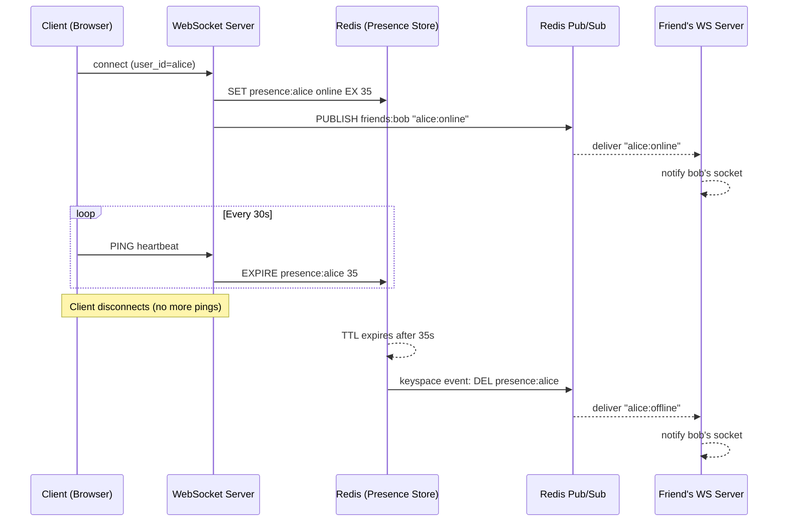

# POC: Discord Presence System — Heartbeat + Fan-Out

## 🗺️ Quick Overview



*A user connects, sets a 35-second TTL on their presence key, refreshes it every 30 seconds with heartbeats, and fan-out notifies friends on both connect and TTL expiry.*

## What You'll Build

A Node.js WebSocket server backed by Redis that:
1. Tracks online/offline status per user with a heartbeat-driven TTL (35s)
2. Automatically detects disconnects when TTL expires via Redis keyspace notifications
3. Fan-outs status changes to all friends of the affected user via Redis Pub/Sub
4. Scales to 10k simulated users with observable Redis memory and throughput metrics

## Why This Matters

- **Discord**: Manages presence for 500M+ registered users; ~19M concurrent online at peak — presence is a core social signal driving the friend list, "green dot," and server member lists
- **Slack**: Uses a similar heartbeat model for the green/yellow/red status dot, with workspace-scoped fan-out to ~100 members per workspace on average
- **WhatsApp**: "Last seen" and "Online" indicators use TTL-based presence with fan-out limited to mutual contacts to bound message volume

---

## Prerequisites

- Docker Desktop installed and running
- Node.js 18+ (`node --version`)
- `wscat` for manual testing: `npm install -g wscat`
- 5-10 minutes

---

## Setup

```yaml
# docker-compose.yml
version: '3.8'

services:
  redis:
    image: redis:7-alpine
    ports:
      - "6379:6379"
    command: >
      redis-server
      --notify-keyspace-events KEx
      --hz 10
    healthcheck:
      test: ["CMD", "redis-cli", "ping"]
      interval: 5s
      timeout: 3s
      retries: 5

  presence-server:
    build: .
    ports:
      - "8080:8080"
    environment:
      - REDIS_URL=redis://redis:6379
      - PORT=8080
    depends_on:
      redis:
        condition: service_healthy
```

`--notify-keyspace-events KEx` enables:
- `K` — Keyspace events (keys)
- `E` — Keyevent events (events)
- `x` — Expired events (fires when a key TTL hits zero)

```bash
docker-compose up -d
```

---

## Step-by-Step

### Step 1: Create the WebSocket Server

```bash
mkdir presence-poc && cd presence-poc
npm init -y
npm install ws redis
```

Create `server.js`:

```javascript
// server.js — Discord-style presence server
const { WebSocketServer } = require('ws');
const { createClient } = require('redis');

const PORT = process.env.PORT || 8080;
const REDIS_URL = process.env.REDIS_URL || 'redis://localhost:6379';

// TTL constants (Discord uses ~35s to tolerate a missed 30s heartbeat)
const PRESENCE_TTL_SECONDS = 35;
const HEARTBEAT_INTERVAL_MS = 30_000;

// In-memory: userId → Set of friend userIds (substitute DB lookup in prod)
const FRIENDS_MAP = {
  alice: new Set(['bob', 'carol']),
  bob:   new Set(['alice', 'dave']),
  carol: new Set(['alice']),
  dave:  new Set(['bob']),
};

// In-memory: userId → WebSocket connection (single-server demo)
const USER_SOCKETS = new Map();

async function main() {
  // Publisher client — used to PUBLISH and SET keys
  const pub = createClient({ url: REDIS_URL });
  // Subscriber client — must be a separate connection when subscribing
  const sub = createClient({ url: REDIS_URL });

  await pub.connect();
  await sub.connect();
  console.log('[redis] connected');

  // ─── Fan-Out: subscribe to each user's personal presence channel ───────────
  // In production, each server subscribes only to users it has connected.
  // Here we subscribe to a wildcard keyspace expiry channel.
  await sub.pSubscribe(
    '__keyevent@0__:expired',
    async (key) => {
      // key looks like "presence:alice"
      if (!key.startsWith('presence:')) return;
      const userId = key.slice('presence:'.length);
      console.log(`[expiry] ${userId} → offline (TTL expired)`);
      await fanOut(pub, userId, 'offline');
    }
  );

  // ─── Subscribe to friend-notification channels ───────────────────────────
  // Each connected user listens on "notify:{userId}" for friend updates.
  await sub.pSubscribe('notify:*', (message, channel) => {
    const targetUserId = channel.slice('notify:'.length);
    const ws = USER_SOCKETS.get(targetUserId);
    if (ws && ws.readyState === 1 /* OPEN */) {
      ws.send(JSON.stringify({ type: 'presence_update', payload: message }));
    }
  });

  // ─── WebSocket server ─────────────────────────────────────────────────────
  const wss = new WebSocketServer({ port: PORT });
  console.log(`[ws] listening on :${PORT}`);

  wss.on('connection', async (ws, req) => {
    // Expect ?user=alice in query string (prod uses JWT auth)
    const url = new URL(req.url, `http://localhost:${PORT}`);
    const userId = url.searchParams.get('user');

    if (!userId) {
      ws.close(4001, 'missing user param');
      return;
    }

    console.log(`[connect] ${userId}`);
    USER_SOCKETS.set(userId, ws);

    // Mark online: SET presence:{userId} "online" EX 35
    await pub.set(`presence:${userId}`, 'online', { EX: PRESENCE_TTL_SECONDS });
    await fanOut(pub, userId, 'online');

    // Heartbeat handler: client sends {"type":"ping"} every 30s
    ws.on('message', async (raw) => {
      let msg;
      try { msg = JSON.parse(raw.toString()); } catch { return; }

      if (msg.type === 'ping') {
        // Refresh TTL — this is the heartbeat
        await pub.expire(`presence:${userId}`, PRESENCE_TTL_SECONDS);
        ws.send(JSON.stringify({ type: 'pong', ts: Date.now() }));
      }
    });

    // Graceful disconnect: delete key immediately instead of waiting for TTL
    ws.on('close', async () => {
      console.log(`[disconnect] ${userId}`);
      USER_SOCKETS.delete(userId);
      await pub.del(`presence:${userId}`);
      // DEL fires the keyevent:expired? No — DEL fires "del", not "expired".
      // So we fan-out explicitly here on graceful close.
      await fanOut(pub, userId, 'offline');
    });

    // Confirm connection to client
    ws.send(JSON.stringify({ type: 'connected', userId }));
  });
}

// Fan-out: notify all friends of userId about a status change
async function fanOut(redisClient, userId, status) {
  const friends = FRIENDS_MAP[userId] ?? new Set();
  const payload = JSON.stringify({ user: userId, status, ts: Date.now() });
  const promises = [];
  for (const friendId of friends) {
    promises.push(redisClient.publish(`notify:${friendId}`, payload));
  }
  await Promise.all(promises);
  console.log(`[fan-out] ${userId} → ${status} → ${friends.size} friends`);
}

main().catch(console.error);
```

### Step 2: Add the Heartbeat Client

Create `client.js` — a headless client that simulates a browser:

```javascript
// client.js — simulates a user with automatic heartbeat
const WebSocket = require('ws');

const userId = process.argv[2] || 'alice';
const SERVER = `ws://localhost:8080?user=${userId}`;

const ws = new WebSocket(SERVER);

ws.on('open', () => {
  console.log(`[${userId}] connected`);

  // Send heartbeat every 30 seconds (matches server TTL logic)
  const heartbeat = setInterval(() => {
    ws.send(JSON.stringify({ type: 'ping' }));
    console.log(`[${userId}] sent ping`);
  }, 30_000);

  ws.on('close', () => {
    clearInterval(heartbeat);
    console.log(`[${userId}] disconnected`);
  });
});

ws.on('message', (raw) => {
  const msg = JSON.parse(raw.toString());
  console.log(`[${userId}] received:`, msg);
});

// Graceful shutdown on Ctrl+C
process.on('SIGINT', () => {
  console.log(`[${userId}] closing gracefully`);
  ws.close();
  process.exit(0);
});
```

### Step 3: Start the Server and Connect Two Users

```bash
# Terminal 1 — start presence server
node server.js
# Expected output:
# [redis] connected
# [ws] listening on :8080

# Terminal 2 — connect as alice (has friends: bob, carol)
node client.js alice
# Expected output:
# [alice] connected
# [alice] received: { type: 'connected', userId: 'alice' }

# Terminal 3 — connect as bob (has friend: alice)
node client.js bob
# Expected output:
# [bob] connected
# [bob] received: { type: 'connected', userId: 'bob' }
# [bob] received: { type: 'presence_update', payload: '{"user":"alice","status":"online",...}' }
# Note: bob gets notified that alice is online because alice connected first
# and alice fans out to bob on connect
```

### Step 4: Inspect Redis State

```bash
# Open a redis-cli session
docker exec -it $(docker ps -qf name=redis) redis-cli

# Check alice's presence key
GET presence:alice
# Output: "online"

TTL presence:alice
# Output: 32 (counts down from 35)

# Watch all keys matching presence:*
KEYS presence:*
# Output: 1) "presence:alice"  2) "presence:bob"

# Monitor pub/sub traffic in real time (run this before Step 5)
SUBSCRIBE notify:bob
# Leave this running — you'll see fan-out messages arrive
```

### Step 5: Observe Heartbeat Resetting TTL

```bash
# In redis-cli, watch TTL reset when alice sends heartbeat (every 30s)
# Run this in a loop:
watch -n 1 "redis-cli TTL presence:alice"

# You'll see the counter drop from ~35 to ~5, then jump back to 35
# when alice's client.js fires its 30-second ping
```

Expected pattern:
```
TTL presence:alice = 34  ← just after connect
TTL presence:alice = 28
TTL presence:alice = 12
TTL presence:alice = 6
TTL presence:alice = 35  ← heartbeat received, TTL reset
TTL presence:alice = 30
```

### Step 6: Observe Automatic Offline Detection

```bash
# Kill alice's client (Ctrl+C in Terminal 2)
# Graceful close: server immediately deletes key and publishes offline

# Alternative: kill the process hard to simulate a crash
kill -9 $(pgrep -f "node client.js alice")
# Now wait 35 seconds — no heartbeat will arrive
# Watch in redis-cli:
watch -n 1 "redis-cli TTL presence:alice"
# TTL will count to 0, key will disappear

# In Terminal 3 (bob's client), you'll see:
# [bob] received: { type: 'presence_update', payload: '{"user":"alice","status":"offline",...}' }
```

### Step 7: Scale Test — 10k Simulated Users

Create `load-test.js`:

```javascript
// load-test.js — simulate N users with heartbeats
const WebSocket = require('ws');

const N = parseInt(process.argv[2] || '1000', 10);
const SERVER_BASE = 'ws://localhost:8080';

let connected = 0;
let pingsSent = 0;
const start = Date.now();

for (let i = 0; i < N; i++) {
  const userId = `loadtest_user_${i}`;
  const ws = new WebSocket(`${SERVER_BASE}?user=${userId}`);

  ws.on('open', () => {
    connected++;
    if (connected === N) {
      console.log(`[load] all ${N} users connected in ${Date.now() - start}ms`);
    }

    // Stagger heartbeats randomly within the 30s window to avoid thundering herd
    const jitter = Math.floor(Math.random() * 30_000);
    setTimeout(() => {
      const interval = setInterval(() => {
        if (ws.readyState === WebSocket.OPEN) {
          ws.send(JSON.stringify({ type: 'ping' }));
          pingsSent++;
          if (pingsSent % 1000 === 0) {
            console.log(`[load] ${pingsSent} pings sent, ${connected} users online`);
          }
        } else {
          clearInterval(interval);
        }
      }, 30_000);
    }, jitter);
  });

  ws.on('error', () => {});
}

// Print Redis memory stats every 10s
const { execSync } = require('child_process');
setInterval(() => {
  try {
    const info = execSync(
      'docker exec $(docker ps -qf name=redis) redis-cli INFO memory | grep used_memory_human'
    ).toString().trim();
    console.log(`[redis] ${info}`);
  } catch {}
}, 10_000);

console.log(`[load] starting ${N} connections...`);
```

```bash
# Run with 1000 users first
node load-test.js 1000
# Expected output:
# [load] starting 1000 connections...
# [load] all 1000 users connected in ~800ms
# [redis] used_memory_human:4.50M  ← ~4.5KB per user presence key

# Scale to 10000 users (ensure Docker has enough resources)
node load-test.js 10000
# Expected output:
# [load] all 10000 users connected in ~8000ms
# [redis] used_memory_human:42.00M
# Each presence key ≈ ~4.2KB in Redis (key + value + TTL metadata)
# Heartbeat throughput: ~333 pings/second at 10k users (10000 / 30s)
```

---

## What to Observe

### Metric 1: Redis Memory per User

```bash
docker exec $(docker ps -qf name=redis) redis-cli INFO memory
# used_memory_human should be ~4.2MB per 1000 users
# At Discord's 19M online peak: ~80GB just for presence keys
# (They use sharded Redis clusters — presence is distributed across ~100 nodes)
```

### Metric 2: Pub/Sub Message Rate

```bash
docker exec $(docker ps -qf name=redis) redis-cli INFO stats | grep pubsub
# pubsub_messages: increases by N * avg_friends every heartbeat cycle
# At 10k users with avg 5 friends: ~1.67k messages/second on fan-out alone
```

### Metric 3: Keyspace Expiry Lag

```bash
# Redis fires expired events with up to 100ms lag (hz=10 default)
# The event fires when Redis's active expiry cycle notices the key
# Under memory pressure, lazy expiry can delay notification by seconds
# Monitor:
docker exec $(docker ps -qf name=redis) redis-cli \
  CONFIG GET hz
# hz: 10 means Redis checks for expired keys 10 times/second
# Increase to hz: 100 for faster expiry detection (higher CPU cost)
```

### Server Log Pattern (Healthy)

```
[connect] alice
[fan-out] alice → online → 2 friends
[connect] bob
[fan-out] bob → online → 1 friends
[redis] alice heartbeat received → TTL reset to 35s
[redis] alice heartbeat received → TTL reset to 35s
[expiry] carol → offline (TTL expired)
[fan-out] carol → offline → 1 friends
```

---

## What Breaks It

### Failure 1: Missing Keyspace Notifications (Silent Offline)

```bash
# Restart Redis WITHOUT keyspace notifications
docker exec $(docker ps -qf name=redis) redis-cli CONFIG SET notify-keyspace-events ""

# Now kill a client process hard (no graceful close)
kill -9 $(pgrep -f "node client.js alice")

# Wait 40 seconds...
# Bob's client never receives an offline notification.
# presence:alice key is gone from Redis (TTL expired),
# but nobody published to notify:bob.
# Friends are stuck showing alice as online indefinitely.

# Fix: always rely on heartbeat TTL, never solely on expiry events.
# Re-enable notifications:
docker exec $(docker ps -qf name=redis) redis-cli \
  CONFIG SET notify-keyspace-events KEx
```

### Failure 2: High Memory Pressure Delays Expiry

```bash
# Fill Redis with dummy keys to simulate memory pressure
docker exec $(docker ps -qf name=redis) redis-cli \
  --pipe <<'EOF'
$(for i in $(seq 1 50000); do echo "SET filler:$i value EX 300"; done)
EOF

# Now expire presence:alice — Redis may delay firing the keyspace event
# because it's busy with active expiry of other keys
# You'll see alice appear "online" for 5-35 extra seconds after their TTL

# Fix: Do NOT rely on keyspace notifications as the sole source of truth.
# Instead, have the friend's server poll presence:{userId} on GET:
# GET presence:alice → (nil) means offline, regardless of notification
```

### Failure 3: Split-Brain on Redis Failover

```bash
# Simulate primary Redis failure by stopping the container
docker stop $(docker ps -qf name=redis)

# Presence server loses connection — all SET/EXPIRE calls fail
# Heartbeats pile up but can't reset TTLs
# After 35 seconds, ALL users appear offline even though they're still connected
# Their WebSocket connections are alive but their presence keys expired

# Fix: Use Redis Sentinel or Cluster; implement a local in-memory fallback
# for "optimistic online" during Redis outage with reconciliation on reconnect
```

---

## Extend It

1. **Add presence aggregation per server (guild/channel)**: Instead of `notify:{userId}`, publish to `guild:{guildId}:presence` and have all members subscribed to that channel. Reduces channels from O(friends) to O(guilds).

2. **Implement status types**: Change the presence value from `"online"` to a JSON blob: `{"status":"dnd","game":"Minecraft","since":1717200000}`. Discord's rich presence includes game activity, Spotify track, and custom status.

3. **Add geo-distributed fan-out**: Route WebSocket connections by region (US-East, EU-West). Implement cross-region fan-out using Redis Streams instead of Pub/Sub — streams are persistent and allow replay if a region temporarily disconnects.

4. **Test jitter effect**: Remove the random jitter from `load-test.js` and observe the thundering herd — all 10k clients send heartbeats at t=30, t=60, etc., causing Redis spikes. Re-add jitter and compare `redis-cli INFO stats | grep instantaneous_ops_per_sec`.

5. **Add presence history**: Store last-seen timestamps in a Redis Sorted Set (`ZADD presence:history {timestamp} {userId}`) for "last active 5 minutes ago" style UX. TTL-expire the sorted set entries separately.

---

## Key Takeaways

- **TTL = 35s, heartbeat = 30s**: The 5-second grace window absorbs a single missed heartbeat or network jitter. Discord's actual values are close to this ratio.
- **Two disconnect paths**: Graceful close fires `ws.on('close')` → immediate `DEL`; ungraceful disconnect relies on TTL expiry → 35s lag. Always handle both.
- **Keyspace notifications are unreliable under load**: Redis fires expiry events lazily. Under memory pressure, events can be delayed 5-30 seconds. Use explicit heartbeat polling (`GET presence:{userId}`) as a fallback.
- **Fan-out is O(friends)**: At 19M concurrent users with avg 50 friends, Discord's fan-out generates ~950M presence messages per online/offline event cycle. They use batching, debouncing, and server-sharding to bound this.
- **Redis memory at scale**: Each presence key costs ~200 bytes. 19M keys = ~3.8GB. Combined with keyspace notification overhead and Pub/Sub channels, production presence clusters are 50-100GB RAM.

---

## References

- 📖 [Discord Engineering Blog — How Discord Handles Two and Half Million Concurrent Voice Users](https://discord.com/blog/how-discord-handles-two-and-half-million-concurrent-voice-users-using-webrtc)
- 📖 [Redis Keyspace Notifications Documentation](https://redis.io/docs/manual/keyspace-notifications/)
- 📺 [Real-Time Presence at Scale — RedisConf 2021](https://www.youtube.com/watch?v=HMnd5YnKYFY)
- 📖 [WebSocket Heartbeat Patterns in Production](https://ably.com/blog/websocket-heartbeats)
- 📚 [Redis EXPIRE command — TTL mechanics](https://redis.io/commands/expire/)
