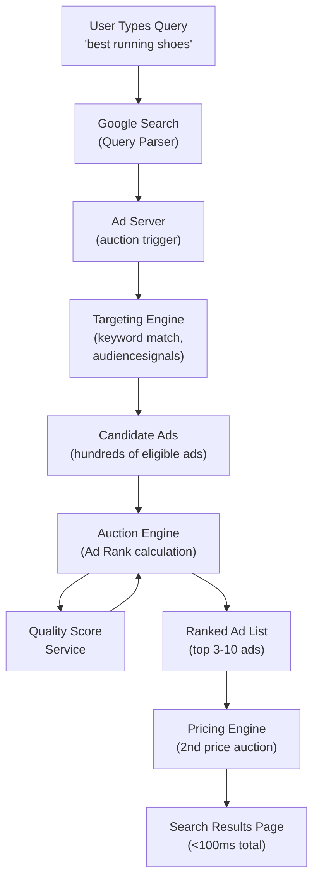

# Google Ads Auction System

**Difficulty**: Advanced
**Time**: 45 minutes
**Companies**: Google, Meta, Amazon, Twitter/X, LinkedIn (Common for senior backend roles in ads)

## Quick Overview



*Every search query triggers a real-time auction. Hundreds of eligible ads compete. The auction completes end-to-end in under 100ms.*

## 1. Problem Statement

Google Search displays ads alongside organic results. The challenge: for every search query, billions of advertisers potentially want to show an ad. Google must:

```
Scale requirements:
  Search queries:    8.5 billion per day (~100,000/second)
  Active advertisers: 7+ million globally
  Eligible ads per query: potentially thousands
  Auction latency budget: <10ms (within total <100ms SERP)
  Revenue at stake:  ~$224 billion/year (Google 2023 ad revenue)

Goals (in tension):
  1. Maximize revenue per query
  2. Show relevant ads (user satisfaction → long-term revenue)
  3. Be fair to advertisers (predictable, non-arbitrary)
  4. Prevent fraud (fake clicks draining advertiser budgets)
```

The solution is a **modified second-price auction** (Vickrey auction) incorporating ad quality signals.

## 2. The Vickrey Auction Model

### Why Second-Price Auction?

```
First-price auction (naive):
  Highest bidder wins AND pays their bid

  Problem: Advertisers shade bids (bid below true value)
  Reason:  If you bid $5 and win, you pay $5 even if next bid was $1
  Result:  Inefficient, unpredictable, complex for advertisers

Second-price (Vickrey) auction:
  Highest bidder wins BUT pays the second-highest bid + $0.01

  Example:
    Advertiser A bids $5.00 (for "running shoes")
    Advertiser B bids $3.50
    Advertiser C bids $2.00

    A wins, pays $3.51 (B's bid + $0.01)

  Why this is better:
  - Dominant strategy: bid your true value
  - No benefit to shading bids
  - Simpler for advertisers (just enter max you'd pay per click)
  - Predictable pricing

  Key property: Bidding your true value is the optimal strategy regardless
  of what others bid. This is called "incentive compatible."
```

## 3. Ad Rank Formula

Google doesn't use a pure price auction. It uses Ad Rank:

```
Ad Rank = Max CPC Bid × Quality Score × Ad Extensions Impact

Where:
  Max CPC Bid:     Maximum amount advertiser will pay per click
  Quality Score:   1-10 score from Google (see below)
  Ad Extensions:   Bonus for using sitelinks, callouts, etc.

Example:
  Advertiser A: $5.00 bid × Quality Score 4  = Ad Rank 20
  Advertiser B: $3.50 bid × Quality Score 8  = Ad Rank 28 ← WINS
  Advertiser C: $2.00 bid × Quality Score 10 = Ad Rank 20

  B wins despite having a lower bid than A
  because B's quality score is much higher.

Why this matters to Google:
  User clicks on relevant ads → user happy → user keeps using Google
  High-quality ads clicked more → Google earns more per auction
  Aligns Google's incentives with user experience
```

### Actual Price Paid

```
Winner pays minimum needed to maintain their position:

Price paid by B = (Ad Rank of next competitor / B's Quality Score) + $0.01

Price paid by B = (Ad Rank A / QS B) + $0.01
               = (20 / 8) + $0.01
               = $2.50 + $0.01
               = $2.51

B bid $3.50 but only pays $2.51
This is the second-price principle applied with quality adjustments
```

## 4. Quality Score Components

Quality Score (1-10) is calculated from three sub-components:

```
Quality Score Components:

1. Expected Click-Through Rate (CTR)
   - Historical CTR of this ad for similar queries
   - Predicted probability user will click
   - Accounts for ad position (above/below fold) in normalization

   Weight: ~60% of Quality Score

2. Ad Relevance
   - How closely the ad matches search intent
   - Keyword match in headline and description
   - Semantic relevance of ad copy to query
   - "Below average" / "Average" / "Above average" tiers

   Weight: ~20% of Quality Score

3. Landing Page Experience
   - Is the landing page relevant to the ad and query?
   - Page load speed (Core Web Vitals: LCP, FID, CLS)
   - Mobile-friendliness
   - Low ad density (not a spam page)
   - Original content

   Weight: ~20% of Quality Score

Calculation:
  QS ≈ w1 × expected_CTR + w2 × ad_relevance + w3 × landing_page
  Score normalized to 1-10 range

How advertisers improve QS:
  - Write tightly themed ad groups (few keywords per ad group)
  - Ad copy must contain the keyword
  - Landing page must be the actual product page, not homepage
  - Improve site speed (Google's PageSpeed Insights)
```

## 5. Real-Time Bidding Pipeline

### End-to-End Latency Budget

```
Timeline for a single search query (total budget: ~100ms):

  0ms     User hits Enter
  0-5ms   Query parsing, spell correction, intent detection
  5-15ms  Organic search ranking (retrieving 10 blue links)
  5-10ms  Ad serving pipeline starts (parallel with organic)
    5ms   → Targeting: find all eligible ads for this query
    3ms   → Bid retrieval: get current bids for eligible ads
    2ms   → Quality Score lookup (pre-computed, cached)
    1ms   → Ad Rank calculation and sorting
    1ms   → Price calculation
    1ms   → Ad creative retrieval (headline, description, URL)
  15-90ms HTML rendering, network latency to user
  100ms   Page displayed to user

Key insight: The auction itself takes ~10ms within 100ms total budget
Most of quality score is pre-computed offline, not in real-time
```

### Architecture Deep Dive

```
┌─────────────────────────────────────────────────────────────────────┐
│                    Ad Serving Pipeline                               │
│                                                                     │
│  Query Signal                                                        │
│  ┌──────────┐   ┌─────────────┐   ┌──────────────┐                  │
│  │"running  │──▶│  Keyword    │──▶│  Eligibility │                  │
│  │ shoes"   │   │  Matching   │   │  Filter      │                  │
│  │ + signals│   │  (inverted  │   │  (budget,    │                  │
│  │          │   │   index)    │   │   targeting) │                  │
│  └──────────┘   └─────────────┘   └──────┬───────┘                  │
│                                          │                          │
│                                          │ ~500 candidate ads       │
│                                          ▼                          │
│  ┌─────────────────────────────────────────────────────────┐         │
│  │                    Auction Engine                       │         │
│  │                                                         │         │
│  │  For each candidate ad:                                 │         │
│  │    bid = getBid(advertiser_id, keyword)                 │         │
│  │    qs  = getQualityScore(ad_id, query, context)  ← cache│         │
│  │    rank = bid × qs × extension_factor                   │         │
│  │                                                         │         │
│  │  Sort by Ad Rank → pick top K slots (3 above, 7 below)  │         │
│  │  Calculate price for each winner (second-price formula) │         │
│  └─────────────────────────────────────────────────────────┘         │
│                                                                     │
│  ┌──────────────────────────────────────────────────────────┐        │
│  │              Budget Pacing Service (async)               │        │
│  │  Real-time budget check:                                 │        │
│  │    if (advertiser.daily_budget_remaining <= 0):           │        │
│  │      remove from eligible set                            │        │
│  └──────────────────────────────────────────────────────────┘        │
└─────────────────────────────────────────────────────────────────────┘
```

## 6. Targeting

### How Ads Match Queries

```
Keyword match types (specificity order):

Exact match:    [running shoes]     → Only "running shoes" (exactly)
Phrase match:   "running shoes"     → "best running shoes", "running shoes for men"
Broad match:    running shoes       → "jogging footwear", "sneakers for marathon"
                                       (Google expands with semantic understanding)

Advertiser sets:
  Ad Group: "Running Shoes"
  Keywords: [running shoes], "trail running shoes", broad: sneakers
  Budget: $500/day
  Max CPC bid: $3.00
  Targeting: US, 25-45 age, mobile users
```

### Audience Signals

Beyond keywords, Google injects user signals:

```
Contextual signals (privacy-safe):
  - Search query and query history (recent searches)
  - Location (city-level)
  - Device type (mobile vs desktop)
  - Time of day / day of week
  - Language

Audience signals (aggregated, not individual tracking post-2023):
  - In-market audiences (users researching a purchase)
  - Affinity audiences (interests based on browsing patterns)
  - Remarketing lists (users who visited advertiser's site)
    ← Stored as hashed IDs, matched via Google's identity graph

Bid adjustments:
  Advertiser can adjust bids +/- 900% for audiences:
    "If user is in 'Fitness Enthusiasts' segment → bid ×1.5"
    "If user is on mobile → bid ×0.8"
  Final bid = base_bid × audience_multipliers × device_multiplier
```

## 7. Budget Pacing

### The Problem

```
Advertiser has $500/day budget for "running shoes" ads.
8.5 billion queries per day → millions of eligible impressions.

Without pacing:
  Budget exhausted in first 2 hours of day (peak morning traffic)
  Advertiser misses afternoon and evening traffic
  → Poor ROI, advertiser dissatisfied

Goal: Spread $500 evenly across 24 hours
      (or weighted by expected conversion probability per hour)
```

### Pacing Algorithm

```
Standard pacing (even distribution):
  Hourly budget = $500 / 24 = $20.83/hour
  Every N seconds, check: "Have we spent more than target for this hour?"
  If over budget → throttle (probabilistically skip auctions for this advertiser)

Smart pacing (conversion-weighted):
  Historical conversion data: conversions peak 8-10am and 7-9pm
  Shift budget to high-value times:
    8-10am:  $80 (high conversion window)
    2-4pm:   $30 (low conversion window)
    7-9pm:   $90 (high conversion window)

Throttling implementation:
  Each advertiser has a serve rate (0.0 to 1.0):
    1.0 = participate in all eligible auctions
    0.5 = skip 50% of auctions randomly
    0.0 = paused

  Serve rate adjusted every ~10 seconds based on:
    (target_spend_so_far - actual_spend_so_far) / target_spend_so_far

  If actual > target: reduce serve rate
  If actual < target: increase serve rate
```

## 8. Fraud Detection

```
Click fraud: Competitors or click farms clicking ads to drain advertiser budgets.
Scale: Google blocks billions of invalid clicks per year.

Detection signals:
  IP address: Multiple clicks from same IP in short window
  Click timing: Clicks at impossible speed (bots click faster than humans)
  Click patterns: Regular intervals suggest automation
  User agent: Bot signatures, headless browser fingerprints
  Device fingerprint: Multiple accounts, same device
  Post-click behavior: Click + immediate bounce (low engagement = fraud signal)
  Geographic anomaly: US advertiser, clicks from unusual countries

Multi-layer defense:
  Layer 1: Real-time (in-auction, <10ms)
    Block known bad IP ranges
    Rate limit clicks per IP per hour

  Layer 2: Near real-time (minutes)
    ML models on click stream: score each click 0-1 (fraud probability)
    High-score clicks: credited back to advertiser

  Layer 3: Offline (daily)
    Deep analysis of traffic patterns
    Retroactive adjustments to advertiser invoices
    Accounts suspended for systematic fraud

Outcome:
  ~80% of fraud detected and filtered in real-time
  ~15% detected within 24 hours (refunded)
  ~5% missed (estimated, never fully eliminable)
```

## 9. Key Numbers to Remember

```
Metric                          Value              Notes
─────────────────────────────────────────────────────────────
Queries per day                 8.5 billion        ~100,000/second
Ad auction latency              <10ms              Within 100ms page load
Quality Score range             1–10               10 = best
Replication factor (QS cache)   multiple PoPs      Sub-ms retrieval globally
Minimum CPC (Search)            ~$0.01             Quality floors apply
Max bid adjustment              ×10 (900% increase)
Budget throttle interval        ~10 seconds        Pacing refresh
Invalid click block rate        ~80% real-time     Rest caught offline
Google ad revenue 2023          $224 billion       Search + Display + YouTube
Max ad positions (Search)       3 above + 7 below  10 total per page
```

## 10. Tradeoffs

```
TRADEOFF: Revenue vs relevance
  Higher bids → more revenue per query
  Irrelevant ads → users ignore/hate ads → fewer clicks → less long-term revenue
  Resolution: Quality Score forces relevance; irrelevant ads can't simply outbid
  Net effect: Google earns MORE because users click relevant ads more

TRADEOFF: Second-price vs first-price auction
  Second-price: incentive compatible (bid true value), less revenue per auction
  First-price: higher revenue per auction, but advertisers shade bids unpredictably
  Google chose second-price for advertiser trust and simplicity

TRADEOFF: Keyword vs audience targeting
  Keyword: user shows clear purchase intent (high conversion)
  Audience: reach users before they search (top of funnel)
  Solution: use both, let advertisers layer them with bid adjustments

TRADEOFF: Pacing accuracy vs system complexity
  Perfect pacing requires microsecond budget checks (too slow)
  Batch updates every 10 seconds: good enough, occasionally over/under-delivers
  Underspend is fine; overspend is reimbursed by Google

TRADEOFF: Fraud detection precision vs recall
  High precision (few false positives): advertisers trust the system
  High recall (catch all fraud): risky — legitimate clicks get blocked
  Google errs toward precision to avoid blocking real traffic
```

## 11. Interview Talking Points

**Why is it a second-price auction?**
Second-price (Vickrey) auction is incentive-compatible: advertisers bid their true value. In a first-price auction, advertisers shade bids (bid less than their true value), leading to complex game theory and unpredictable pricing. Second-price gives a dominant strategy: bid what you'd actually pay per click.

**How does Quality Score prevent low-quality ads from winning by bidding high?**
Ad Rank = bid × Quality Score. A low-quality ad (QS=2) needs to bid 5x as much as a high-quality ad (QS=10) to have the same rank. High-quality advertisers get better positions at lower prices — this incentivizes relevance.

**How do you keep the auction under 10ms when there are millions of advertisers?**
Pre-computation is key. Quality Scores are calculated offline (updated daily for most advertisers, hourly for high-traffic ones) and cached in a distributed in-memory store (similar to Redis clusters at global PoPs). The auction only multiplies cached QS by the bid — no heavy computation at query time.

**What happens when an advertiser's budget runs out mid-day?**
The pacing algorithm prevents this by throttling serve rate. When budget approaches the hourly target, the system probabilistically skips auctions (serve rate drops below 1.0). Only advertisers who opt into "Accelerated delivery" can exhaust budget early.

**How does Google detect click fraud in <10ms?**
The in-auction layer only blocks the cheapest checks: known bad IP ranges and rate limits. The heavy ML fraud detection runs asynchronously after the click is served, credits advertisers retroactively, and flags accounts for offline review. Real-time blocks would add latency; post-hoc detection avoids that.

## Key Takeaways

```
1. Second-price auction is incentive-compatible: bid your true value
   Highest Ad Rank wins, pays minimum needed to hold their position

2. Ad Rank = bid × Quality Score — relevance beats raw spending power
   Google profits more from relevant ads that users click (alignment of incentives)

3. Quality Score rewards ad-keyword-landing page coherence
   Expected CTR is the biggest component (~60%)

4. Pre-compute everything possible; cache aggressively
   QS computed offline, cached globally → auction stays <10ms

5. Budget pacing prevents early depletion by throttling serve rate
   Refresh every 10 seconds based on actual vs target spend

6. Fraud detection is layered: real-time block (80%) + offline analysis (15%)
   Errs toward precision (false negatives) over recall (false positives)

7. Billions of auctions/day = $224B/year → small improvements = massive revenue
   1% CTR improvement on Google scale ≈ $2B/year in additional revenue
```
