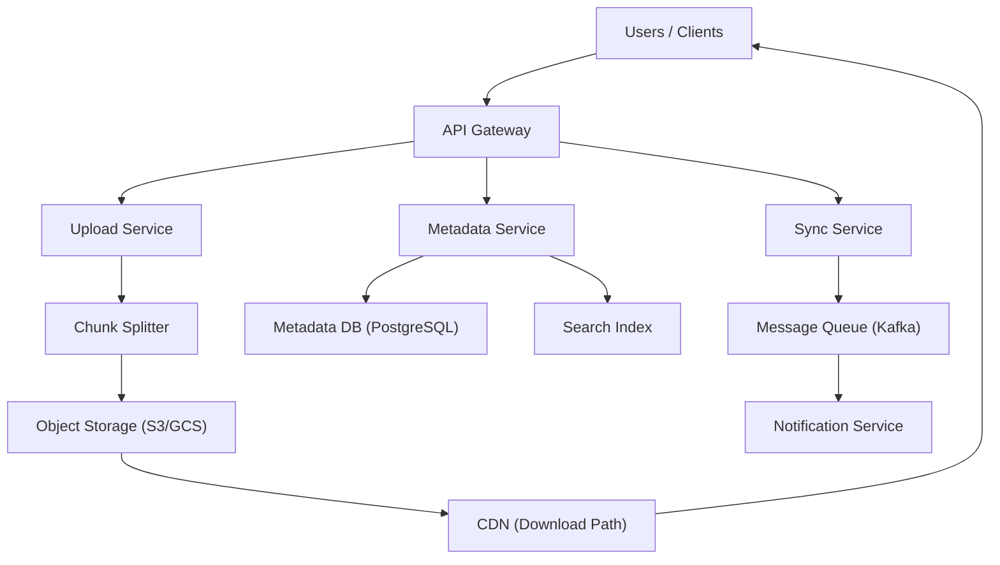

# Design Google Drive (File Storage & Sync)

**Difficulty**: Advanced
**Time**: 60 minutes
**Companies**: Google, Dropbox, Microsoft, Amazon, Box (Common for senior roles)

## 🗺️ Quick Overview



*Files are split into chunks, stored in object storage, and metadata is tracked separately — sync events flow through a message queue to keep all devices up to date.*

## 1. Problem Statement

Design a cloud file storage and synchronization system where users store, share, and sync files across devices.

**Scale reference (Google Drive / Dropbox):**

```
Google Drive: 1 billion+ users
Dropbox: 700 million+ registered users
Files stored: Trillions of files
Storage: Exabytes
Sync events: Billions per day
Max file size: 5 TB (Google Drive)
```

## 2. Requirements

### Functional Requirements
1. Upload and download files
2. Sync files across multiple devices
3. Share files/folders with permissions
4. File versioning (keep last N versions)
5. Conflict resolution for concurrent edits
6. Notifications for shared file changes

### Non-Functional Requirements
1. **Reliable** (never lose a file)
2. **Fast sync** (changes appear on other devices within seconds)
3. **Bandwidth efficient** (only sync changed parts)
4. **Scalable** (billions of files, millions of concurrent syncs)
5. **Available** (99.99% for downloads, 99.9% for uploads)

### Out of Scope
- Real-time collaborative editing (Google Docs)
- Full-text file search
- Offline editing details

## 3. High-Level Architecture

```
┌──────────────────────────────────────────────────────────────┐
│                    Client (Desktop/Mobile/Web)                │
│                                                              │
│  ┌──────────────┐  ┌──────────────┐  ┌──────────────┐        │
│  │ File Watcher │  │  Sync Engine │  │   Chunker    │        │
│  │ (monitors    │  │ (coordinates │  │ (splits files│        │
│  │  local files)│  │  sync state) │  │  into chunks)│        │
│  └──────┬───────┘  └──────┬───────┘  └──────┬───────┘        │
└─────────┼─────────────────┼─────────────────┼────────────────┘
          │                 │                 │
┌─────────▼─────────────────▼─────────────────▼────────────────┐
│                       API Layer                              │
│  ┌──────────────┐  ┌──────────────┐  ┌──────────────┐        │
│  │  Metadata    │  │  Upload /    │  │    Sync      │        │
│  │  Service     │  │  Download    │  │   Service    │        │
│  │              │  │  Service     │  │              │        │
│  └──────┬───────┘  └──────┬───────┘  └──────┬───────┘        │
└─────────┼─────────────────┼─────────────────┼────────────────┘
          │                 │                 │
┌─────────▼──────┐  ┌──────▼───────┐  ┌──────▼───────┐
│  Metadata DB   │  │  Block Store │  │  Notification │
│  (PostgreSQL)  │  │  (S3)        │  │  Service      │
│                │  │              │  │  (WebSocket)  │
│  Files, users, │  │  File chunks │  │  Push changes │
│  permissions,  │  │  deduplicated│  │  to devices   │
│  versions      │  │              │  │               │
└────────────────┘  └──────────────┘  └───────────────┘
```

## 4. File Chunking

### Why Chunk Files?

```
Problem: User edits 1 byte in a 1GB file
  Without chunking: Re-upload entire 1GB ❌
  With chunking: Re-upload one 4MB chunk ✅ (250x less data)

How it works:
  File: presentation.pptx (100MB)

  Split into 4MB chunks:
  ┌─────────┬─────────┬─────────┬─────────┬─────────┐
  │ Chunk 0 │ Chunk 1 │ Chunk 2 │ ... │ Chunk 24│
  │ 4MB     │ 4MB     │ 4MB     │     │ 4MB     │
  │ hash:a1 │ hash:b2 │ hash:c3 │     │ hash:z9 │
  └─────────┴─────────┴─────────┴─────────┴─────────┘

  Each chunk has a content hash (SHA-256)
  Hash = unique identifier for that chunk's content

User edits slide 5 (modifies chunk 2):
  ┌─────────┬─────────┬─────────┬─────────┬─────────┐
  │ Chunk 0 │ Chunk 1 │ Chunk 2 │ ... │ Chunk 24│
  │ hash:a1 │ hash:b2 │ hash:d4 │     │ hash:z9 │
  │ (same)  │ (same)  │(CHANGED)│     │ (same)  │
  └─────────┴─────────┴─────────┴─────────┴─────────┘

  Only chunk 2 has a new hash → Only upload chunk 2 (4MB)
```

### Content-Defined Chunking (Smarter)

```
Fixed-size chunking problem:
  Insert 1 byte at start of file → ALL chunks shift → ALL re-uploaded

Content-defined chunking (Rabin fingerprint):
  Chunk boundaries based on content, not fixed offsets
  Insert data → Only affected chunk changes
  Used by: Dropbox, rsync

  Algorithm:
  - Slide a window over file content
  - Compute rolling hash at each position
  - If hash matches pattern → chunk boundary
  - Average chunk size: 4MB (but varies by content)

  Result: Inserting data only affects 1-2 chunks
  instead of all subsequent chunks
```

## 5. Deduplication

```
Same file uploaded by different users → Store once

User A uploads vacation.jpg (hash: abc123)
User B uploads vacation.jpg (hash: abc123) ← Same file!

┌──────────────────────────────────────────────┐
│  Block Store                                 │
│                                              │
│  Chunk hash → Storage location               │
│  abc123 → s3://blocks/ab/c1/abc123           │
│  def456 → s3://blocks/de/f4/def456           │
│                                              │
│  User A's file: [abc123, def456, ghi789]     │
│  User B's file: [abc123, jkl012, mno345]     │
│                 ^^^^^^^^                     │
│                 Same chunk! Stored once.      │
└──────────────────────────────────────────────┘

Deduplication levels:
  File-level: Same file hash → don't store again
  Chunk-level: Same chunk hash → don't store again

Dropbox saves ~50% storage through deduplication
```

## 6. Sync Protocol

### How Sync Works

```
Device A (laptop) modifies file:

1. File Watcher detects change
   "report.docx modified at 10:15:00"

2. Chunker re-chunks modified file
   Chunk 3 hash changed: old:x1y2 → new:a3b4

3. Sync Engine compares with server state
   Server has chunks: [c1, c2, x1y2, c4]
   Local has chunks:  [c1, c2, a3b4, c4]
   Diff: Chunk 3 needs upload

4. Upload only changed chunk
   PUT /chunks/a3b4 → Upload 4MB

5. Update metadata on server
   PATCH /files/report.docx
   { chunks: [c1, c2, a3b4, c4], version: 5 }

6. Server notifies Device B (phone)
   WebSocket push: "report.docx updated to version 5"

7. Device B's Sync Engine
   Compare: Server has [c1, c2, a3b4, c4]
            Local has  [c1, c2, x1y2, c4]
   Download only chunk a3b4

8. Device B reconstructs file
   Assemble chunks: c1 + c2 + a3b4 + c4 = updated report.docx
```

### Sync State Machine

```
File states on each device:

  ┌─────────┐  local edit   ┌──────────┐  upload done  ┌─────────┐
  │ IN_SYNC │──────────────▶│ MODIFIED │──────────────▶│ IN_SYNC │
  └─────────┘               └──────────┘               └─────────┘
       │                         │
       │ remote change           │ conflict detected
       ▼                         ▼
  ┌──────────┐              ┌──────────┐
  │NEEDS_PULL│              │CONFLICTED│
  │(download)│              │          │
  └──────────┘              └──────────┘

Device metadata:
{
  filePath: "/documents/report.docx",
  localVersion: 4,
  serverVersion: 5,
  localHash: "abc123",
  serverHash: "def456",
  state: "NEEDS_PULL",
  chunks: ["c1", "c2", "a3b4", "c4"]
}
```

## 7. Conflict Resolution

```
Problem: Two devices edit same file simultaneously

Device A (laptop): Edit paragraph 1 at 10:00 AM
Device B (phone):  Edit paragraph 5 at 10:00 AM
Both upload at 10:01 AM

Who wins?

Strategy 1: Last Writer Wins
  Compare timestamps → later edit wins
  Simple but loses data (earlier edit discarded)
  ❌ Not acceptable for file storage

Strategy 2: Create Conflict Copy (Dropbox approach)
  Both versions saved:
    report.docx                    (Device A's version)
    report (conflicted copy).docx  (Device B's version)

  User manually merges
  Safe but annoying for users

Strategy 3: Automatic Merge (if possible)
  For structured files (text, code):
    Three-way merge using common ancestor
    Like git merge — automatic if no overlapping changes

  For binary files (images, PDFs):
    Can't auto-merge → Create conflict copy

  Common approach:
    if (canAutoMerge(ancestor, versionA, versionB)) {
      merged = autoMerge(ancestor, versionA, versionB);
      uploadMerged(merged);
    } else {
      createConflictCopy(versionA, versionB);
      notifyUser("Conflict detected, please resolve");
    }
```

## 8. File Sharing & Permissions

```
Permission model:

┌────────────────────────────────────────────┐
│  Permission Levels                         │
│                                            │
│  Owner:  Full control (delete, share, edit)│
│  Editor: Can edit and share                │
│  Viewer: Read-only access                  │
│  Commenter: View + add comments            │
└────────────────────────────────────────────┘

Sharing types:
  1. Direct share: Share with specific user/email
  2. Link sharing: Anyone with the link can access
  3. Organization: Everyone in the company

Permission table:
  CREATE TABLE permissions (
    file_id UUID,
    grantee_type TEXT,     -- 'user', 'group', 'link', 'org'
    grantee_id TEXT,       -- user_id, group_id, or 'anyone'
    role TEXT,             -- 'owner', 'editor', 'viewer'
    link_token TEXT,       -- For link sharing
    expires_at TIMESTAMP,
    created_by UUID,
    PRIMARY KEY (file_id, grantee_type, grantee_id)
  );

Access check (evaluated in order):
  1. Is user the owner? → Full access
  2. Does user have direct permission? → Use that role
  3. Is user in a group with permission? → Use group role
  4. Does a valid link exist + user has the link? → Link role
  5. None of the above → ACCESS DENIED
```

## 9. File Versioning

```
Keep N versions of every file:

File: report.docx

Version  Date         Size    Chunks           Modified By
───────  ────         ────    ──────           ───────────
v1       Jan 10       2MB     [a1, b2, c3]     Alice
v2       Jan 12       2.1MB   [a1, b2, d4]     Alice
v3       Jan 13       2.1MB   [a1, e5, d4]     Bob
v4       Jan 15       2.3MB   [a1, e5, f6, g7] Alice
v5       Jan 16       2.3MB   [a1, e5, f6, h8] Bob (current)

Storage: Only unique chunks stored
  Chunks across all versions: a1, b2, c3, d4, e5, f6, g7, h8
  Total: 8 chunks × 4MB = 32MB
  Without dedup: 5 versions × ~2.2MB avg = 11MB
  With chunk-level versioning: Store unique chunks only

Version API:
  GET /files/{id}/versions              → List all versions
  GET /files/{id}/versions/{versionId}  → Download specific version
  POST /files/{id}/versions/{versionId}/restore → Restore old version

Retention policy:
  Keep last 100 versions
  Keep versions from last 30 days
  After that → Only keep one per week for 1 year
  → Then one per month forever
```

## 10. Notification & Real-Time Sync

```
When a file changes, notify all devices and shared users:

┌──────────────┐  file changed  ┌──────────────┐
│  Device A    │───────────────▶│ Sync Service │
│  (laptop)    │                │              │
└──────────────┘                └──────┬───────┘
                                       │
                                       │ Publish event
                                       ▼
                                ┌──────────────┐
                                │    Kafka     │
                                │ file.changed │
                                └──────┬───────┘
                                       │
                           ┌───────────┼───────────┐
                           ▼           ▼           ▼
                    ┌──────────┐ ┌──────────┐ ┌──────────┐
                    │Device B  │ │Device C  │ │Shared    │
                    │(phone)   │ │(tablet)  │ │user Bob  │
                    │WebSocket │ │WebSocket │ │Push notif│
                    └──────────┘ └──────────┘ └──────────┘

Long polling for mobile (saves battery):
  Client: GET /sync?since=version123&timeout=30s
  Server holds connection for up to 30 seconds
  Returns immediately if there are changes
  Returns empty after 30 seconds if no changes
```

## 11. Key Takeaways

```
1. Content-defined chunking enables efficient sync
   Only changed chunks uploaded/downloaded
   Insert operations don't cascade to all chunks

2. Deduplication saves ~50% storage
   Same chunk stored once, referenced by many files
   Content-addressable storage (hash → location)

3. Conflict resolution is the hardest UX problem
   Auto-merge when possible (text/code files)
   Conflict copies for binary files
   Always preserve both versions

4. File metadata and content stored separately
   Metadata in PostgreSQL (ACID, relational)
   File chunks in object storage (S3, scalable)

5. Version history through chunk references
   Each version = list of chunk hashes
   Storage efficient (shared chunks across versions)

6. Real-time notifications drive sync
   WebSocket for desktop, long-polling for mobile
   Kafka for event distribution across devices

7. Permission checks must be fast
   Cache permissions in Redis
   Hierarchical: folder permission → file permission
```
