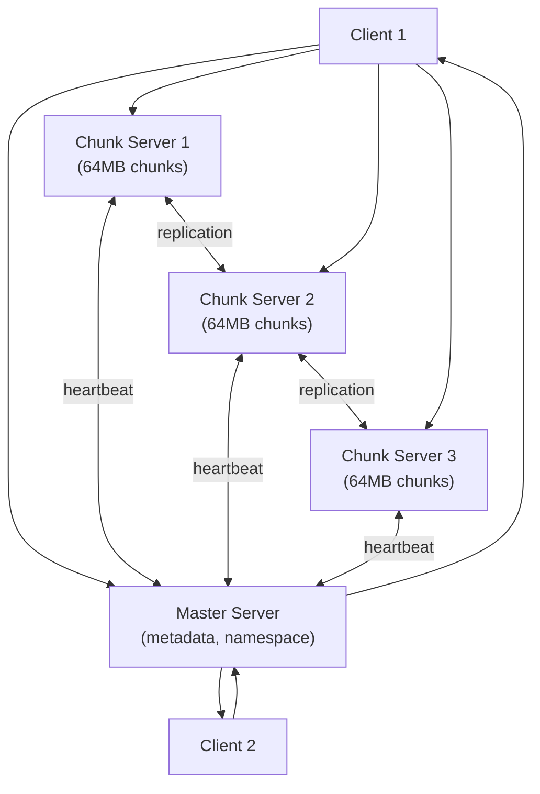

# Google File System (GFS) Case Study

**Difficulty**: Advanced
**Time**: 45 minutes
**Companies**: Google, Facebook, Amazon (Foundational knowledge for senior distributed systems roles)

## Quick Overview



*Client asks the master for chunk locations, then talks directly to chunk servers — the master is never in the data path.*

## 1. Problem Statement

In 2003, Google faced a storage problem no off-the-shelf system could solve:

```
Google's data at the time:
  - Petabytes of web crawl data
  - Billions of documents to index
  - Hundreds of machines routinely failing every week
  - Workloads: large sequential reads, large sequential appends
  - NOT random writes, NOT small files
```

Existing file systems (NFS, AFS) were designed for small files and occasional failures. Google needed a system purpose-built for their workload: **giant files, sequential access, commodity hardware, and frequent failures**.

## 2. Architecture

### Key Components

```
┌─────────────────────────────────────────────────────────────┐
│                     GFS Architecture                         │
│                                                             │
│  ┌──────────┐         ┌────────────────┐                   │
│  │  Client  │◀───────▶│  Master Server │                   │
│  │          │ (1)     │                │                   │
│  │ GFS lib  │ metadata│  - Namespace   │                   │
│  │ (linked  │ lookup  │  - Chunk map   │                   │
│  │  into    │         │  - Chunk leases│                   │
│  │  app)    │         │  - Replication │                   │
│  └──────┬───┘         └───────┬────────┘                   │
│         │ (2) direct          │ periodic                   │
│         │ data I/O            │ heartbeat                  │
│         ▼                     ▼                            │
│  ┌─────────────────────────────────────────────────┐        │
│  │               Chunk Servers                     │        │
│  │  ┌──────────┐  ┌──────────┐  ┌──────────┐       │        │
│  │  │ CS-001   │  │ CS-002   │  │ CS-003   │       │        │
│  │  │          │  │          │  │          │       │        │
│  │  │ chunk A  │  │ chunk A  │  │ chunk A  │← 3x   │        │
│  │  │ chunk B  │  │ chunk C  │  │ chunk B  │  rep  │        │
│  │  │ chunk D  │  │ chunk D  │  │ chunk C  │       │        │
│  │  │ (Linux   │  │ (Linux   │  │ (Linux   │       │        │
│  │  │  files)  │  │  files)  │  │  files)  │       │        │
│  │  └──────────┘  └──────────┘  └──────────┘       │        │
│  └─────────────────────────────────────────────────┘        │
└─────────────────────────────────────────────────────────────┘
```

### Master Server

The master holds all file system metadata in memory:
- File namespace (directory tree)
- Mapping from filenames to chunk IDs
- Mapping from chunk IDs to chunk server locations
- Chunk version numbers and lease holders

The master does NOT hold chunk data. It only tells clients where to find chunks.

### Chunk Servers

Chunk servers store actual data as Linux files. Each chunk:
- Fixed size: **64MB** (much larger than typical 4KB blocks)
- Identified by a globally unique 64-bit chunk handle
- Replicated across 3 chunk servers by default

## 3. Key Design Decisions

### 64MB Chunk Size

```
Typical file system block: 4KB
GFS chunk size:            64MB (16,000x larger)

Why so big?
  - Google files: multi-GB web crawl data, not photos
  - Large chunks → fewer metadata entries → master fits in RAM
  - Large sequential reads → amortize TCP connection overhead
  - Reduces metadata traffic to master

Downside:
  - Small files = 1 chunk = hot spot on one chunk server
  - Many clients access same small file → one server overwhelmed
  - Google solution: for small files, increase replication factor
```

### Single Master Design

Only one master node. This was a deliberate simplification:

```
Benefits of single master:
  ✓ Simple, consistent metadata decisions
  ✓ No distributed consensus needed for metadata
  ✓ Easy to implement global chunk placement optimization
  ✓ Master fits metadata in RAM → fast lookups

Limitations:
  ✗ Single point of failure (mitigated by shadow masters)
  ✗ Potential bottleneck for metadata operations
  ✗ Master must NOT be in data path (clients cache chunk locations)

Mitigation:
  - All operations logged to disk (operation log)
  - Shadow masters can serve read-only requests
  - Master recovers quickly from checkpoint + operation log
```

### Relaxed Consistency Model

GFS does not guarantee strict consistency. It guarantees **defined** (not undefined) regions after successful mutations:

```
Consistency guarantee levels:
  Defined:   All clients see the same data, consistent with mutation
  Consistent: All clients see the same data (may be mix of concurrent writes)
  Inconsistent: Different clients may see different data

GFS atomic record append: returns "defined" for the appended region
GFS concurrent writes:    returns "consistent but undefined" (may mix data)

Why relax consistency?
  Google's workloads: append-only MapReduce pipelines
  Strong consistency → coordination overhead → lower throughput
  "Good enough": readers skip padding and duplicates using checksums
```

## 4. Read and Write Flow

### Read Flow

```
Step 1: Client computes chunk index
  File: /crawl/page-data (100GB)
  Read offset: 2,500,000,000 bytes
  Chunk index = floor(2,500,000,000 / 67,108,864) = 37

Step 2: Client → Master (metadata request)
  Request: filename="/crawl/page-data", chunk_index=37
  Response: chunk_handle=CH_8821, servers=[CS-004, CS-007, CS-019]
  Client caches this mapping for ~5 minutes

Step 3: Client → Nearest chunk server (direct data read)
  Request to CS-004: GET chunk CH_8821, offset=4MB, length=1MB
  CS-004 reads from local Linux file
  Response: 1MB of data

No master involvement after step 2.
Master is never in the data path.
```

### Write Flow (Record Append)

```
Step 1: Client → Master (lease request)
  "Who holds the lease for chunk CH_9920?"
  Master grants lease to primary replica (CS-002)
  Master response: primary=CS-002, secondaries=[CS-005, CS-011]

Step 2: Client pushes data to ALL replicas (data flow decoupled from control)
  Client → CS-002: push 64KB data (buffered, not written yet)
  Client → CS-005: push 64KB data (buffered)
  Client → CS-011: push 64KB data (buffered)
  ← Chunk servers acknowledge receipt (data in memory buffer)

Step 3: Client → Primary (write command)
  "Append the buffered data"

Step 4: Primary serializes all concurrent appends
  Primary picks offset within chunk
  Writes data to its own chunk file
  Forwards write order to secondaries

Step 5: Secondaries execute in same order, acknowledge primary

Step 6: Primary → Client (success/failure)
  If any secondary fails: client retries from step 3
  Retry may create duplicates → readers must handle via checksums
```

## 5. Fault Tolerance

### Heartbeat Mechanism

```
Every chunk server sends heartbeat to master every few seconds:
  - "I'm alive"
  - List of chunks I hold
  - Disk usage stats

Master tracks last heartbeat time per server.
If no heartbeat for 60 seconds:
  - Server declared dead
  - All its chunks marked under-replicated
  - Master schedules re-replication from surviving replicas
```

### Chunk Replication

```
Default replication factor: 3

Placement policy:
  Replica 1: Same rack as client (fast first write)
  Replica 2: Different rack, same datacenter
  Replica 3: Different rack, different datacenter (disaster recovery)

Re-replication triggers:
  - Chunk server death (< 3 replicas)
  - Chunk server reports corrupted chunk (checksum mismatch)
  - Manual disk removal

Priority queue for re-replication:
  1. Chunks with only 1 replica (most urgent)
  2. Chunks with 2 replicas
  3. Chunks with 3 but on unhealthy servers
```

### Master Recovery

```
Master durability:
  - All metadata mutations logged to operation log (on disk + replicated)
  - Operation log is the single source of truth
  - Master takes periodic checkpoints (compact serialized state)

Recovery process:
  1. Load latest checkpoint into memory (~seconds)
  2. Replay operation log since checkpoint
  3. Contact all chunk servers to rebuild chunk location map
  4. Shadow masters serve read-only requests during recovery

Recovery time: typically under 1 minute
Shadow master lag: a few seconds behind primary
```

## 6. Performance Characteristics

```
GFS was optimized for throughput, not latency:

                   GFS Design Choice        Traditional FS
  ───────────────────────────────────────────────────────
  Optimization    Throughput               Latency
  File size       Giant (GB-TB)            Small (KB-MB)
  Access pattern  Sequential               Random
  Write type      Append-only              Overwrite
  Consistency     Relaxed                  Strict
  Failures        Expected, tolerated      Exceptional

Measured performance (2003 paper):
  Sequential read: ~100 MB/s per client (aggregated across chunk servers)
  Record append:   ~6 GB/s aggregate across cluster
  Metadata ops:    ~200 ops/sec on master (bottleneck)
```

## 7. Influence on Modern Systems

GFS directly inspired the Hadoop Distributed File System (HDFS) and shaped modern distributed storage:

```
GFS (2003)                    Influenced
─────────────────────────────────────────────────────
Single master + chunk servers → HDFS NameNode + DataNodes
64MB chunks                   → HDFS 128MB blocks (similar idea)
3x replication                → HDFS default 3x replication
Operation log + checkpoints   → HDFS edit log + fsimage
Relaxed consistency           → Kafka, Cassandra eventual consistency
Append-only optimization      → AWS Kinesis, Kafka log segments
Master as metadata store      → Zookeeper, etcd for coordination

Modern evolutions:
  Colossus (GFS v2, ~2010): Multiple masters, distributed metadata
  Bigtable builds on GFS: Sorted map stored as GFS files
  MapReduce builds on GFS: Workers read/write via GFS
```

## 8. Key Numbers to Remember

```
Number                  Value       Why It Matters
──────────────────────────────────────────────────────────
Chunk size              64MB        Reduces master memory usage
Replication factor      3x          Tolerates 2 simultaneous failures
Master RAM for metadata ~64GB       ~1 billion files supported
Heartbeat interval      few seconds Failure detection speed
Lease duration          60 seconds  How long a primary is authoritative
Master recovery time    ~1 minute   RTO from master failure
Max file size           No limit    Google stored petabytes
Metadata per file       ~200 bytes  Each file = namespace + chunk map
```

## 9. Tradeoffs

```
STRENGTH: Throughput at scale
  Sequential reads of GB files saturate network bandwidth
  Multiple chunk servers serve in parallel
  No bottleneck in data path after first metadata lookup

WEAKNESS: Single master is a bottleneck
  All metadata ops go through one server
  ~200 metadata ops/sec limit
  Google had to build Colossus to fix this

WEAKNESS: Weak consistency hurts some workloads
  Concurrent writes may interleave data
  Applications must handle duplicates after failed appends
  Not suitable for databases or random-write workloads

STRENGTH: Failure is the norm, not exception
  Designed for commodity hardware with frequent disk failures
  Re-replication happens automatically
  No human intervention for most failures

TRADEOFF: Append-only vs general-purpose
  Optimized for MapReduce pipelines that append log data
  Poor fit for databases, transactional workloads
  Google built separate systems (Bigtable, Spanner) for those
```

## 10. Interview Talking Points

**What makes GFS different from HDFS?**
GFS predates HDFS; HDFS is modeled after GFS. Key difference: HDFS is open source and uses 128MB blocks vs GFS's 64MB. Both use a single name/master node — HDFS only added high availability (active-standby) much later.

**Why single master when it's a bottleneck?**
Simplicity. Distributed metadata means distributed consensus (Paxos/Raft). Single master means simple, fast decisions. Google lived with the limitation until 2010 (Colossus) when they needed to.

**What happens if the master crashes?**
Shadow masters serve read-only traffic immediately. The primary master recovers in under a minute from the operation log. Chunk locations are re-built from heartbeats — they're never durably stored on the master (chunk servers are the source of truth for what they hold).

**Why relax consistency?**
MapReduce jobs read each file once, sequentially, and write output once. Strict consistency would require locking/coordination across 3 replicas for every write — unacceptable overhead. The tradeoff was: occasional duplicates/padding in output, handled at the application layer.

**What problem does 64MB chunk size solve?**
It minimizes the metadata the master needs to keep in RAM. At 64MB/chunk, 1PB of data requires only ~16 million chunk entries. At 4KB, that's 250 billion entries — impossible to hold in memory on one server.

## Key Takeaways

```
1. Single master keeps the design simple — avoid distributed consensus where possible
2. Separate control plane (metadata) from data plane (chunks) for scalability
3. Clients cache metadata and talk directly to data servers — master not in hot path
4. Failure is expected; design for automatic recovery, not manual intervention
5. Relaxed consistency enables higher throughput for append-heavy workloads
6. Large chunks reduce metadata overhead; tradeoff is hot spots for small files
7. GFS influenced: HDFS, Bigtable, MapReduce, Colossus, and modern object stores
```
