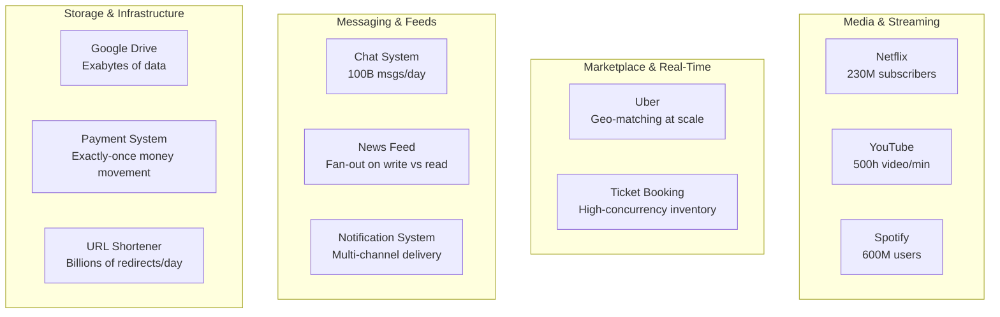

# Real-World Systems

Learn by studying how top companies actually built their systems. Each case study covers the problem, requirements, architecture, trade-offs, and what you'd say in an interview.

## Case Studies

| System | Key Challenge | Scale |
|--------|---------------|-------|
| [Netflix](./netflix) | Video streaming globally | 230M+ subscribers |
| [YouTube](./youtube) | Video upload, processing, delivery | 500h video/minute uploaded |
| [Spotify](./spotify) | Music streaming with personalization | 600M+ users |
| [Uber](./uber-backend) | Real-time geo-matching | Millions of rides/day |
| [Payment System](./payment-system) | Exactly-once money movement | Billions in daily volume |
| [Chat System](./chat-system) | Real-time messaging at scale | WhatsApp: 100B messages/day |
| [News Feed](./news-feed) | Fan-out on write vs read | Facebook: 1.5B users |
| [Notification System](./notification-system) | Multi-channel delivery | Billions of notifications/day |
| [Google Drive](./google-drive) | Distributed file storage | Exabytes of data |
| [URL Shortener](./url-shortener) | High read, low write | Billions of redirects/day |
| [Pastebin](./pastebin) | Content storage & retrieval | — |
| [Rate Limiter](./rate-limiter) | Protect APIs from abuse | — |
| [Ticket Booking](./ticket-booking) | Concurrency & inventory | Millions of tickets sold |
| [Unique ID Generator](./unique-id-generator) | Globally unique, sortable IDs | Millions/second |
