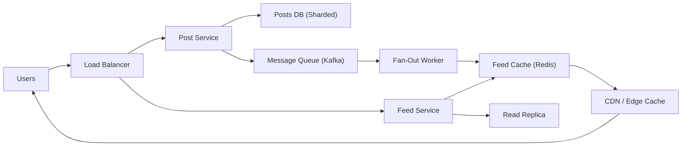

# Design a Social Media News Feed (Instagram / Twitter)

**Difficulty**: Intermediate
**Time**: 60 minutes
**Companies**: Meta, Google, X (Twitter), LinkedIn, TikTok (Top-5 most asked)

## 🗺️ Quick Overview



*When a user posts, a fan-out worker pushes the post ID into each follower's cached feed — reads become a fast Redis lookup rather than a live database query.*

## 1. Problem Statement

Design a news feed system that shows users a personalized, ranked stream of posts from people they follow.

**Scale reference (Instagram):**

```
Users: 2 billion+ monthly active
Daily active: 500 million+
Photos uploaded: 100 million+ per day
Feed requests: 500K+ per second
Average follows: 200 accounts per user
Posts per user per day: ~1-2
```

**The core challenge:**

```
User follows 500 people
Each person posts 1-2 times per day
User opens app → Show the best 500-1000 posts
In ranked order, within 200ms

That's: 500M users × 500 followings × 2 posts = 500 billion
post-to-user relationships to manage PER DAY
```

## 2. Requirements

### Functional Requirements
1. Users can create posts (text, images, videos)
2. Users follow/unfollow other users
3. Users see a feed of posts from people they follow
4. Feed is ranked (not just chronological)
5. Support pagination (infinite scroll)
6. Real-time: New posts appear in feed without refresh

### Non-Functional Requirements
1. **Fast** (feed loads in < 200ms)
2. **Scalable** (500M+ DAU)
3. **Available** (99.99% uptime)
4. **Eventually consistent** (new post appears in followers' feeds within seconds)
5. **Ranked** (relevance > recency)

### Out of Scope
- Stories/Reels
- Direct messaging
- Ads integration
- Comments/likes (separate service)

## 3. The Fan-Out Problem

### Fan-Out on Write (Push Model)

```
When user posts → Pre-compute feed for ALL followers

Taylor Swift posts a photo (300M followers):

PostService receives post
  → Write to posts table
  → For EACH follower: add post to their feed cache

┌──────────┐     ┌──────────────┐     ┌────────────────┐
│ Taylor   │────▶│ Post Service │────▶│  Fan-out       │
│ posts    │     │              │     │  Workers       │
└──────────┘     └──────────────┘     │                │
                                      │ For 300M users:│
                                      │ Add to feed    │
                                      └────────┬───────┘
                                               │
                 ┌─────────────────────────────┬┘
                 ▼              ▼              ▼
          ┌───────────┐  ┌───────────┐  ┌───────────┐
          │ Feed:     │  │ Feed:     │  │ Feed:     │
          │ User A    │  │ User B    │  │ User C    │
          │ [Taylor's │  │ [Taylor's │  │ [Taylor's │
          │  post]    │  │  post]    │  │  post]    │
          └───────────┘  └───────────┘  └───────────┘

Pros:
  ✅ Feed read is instant (pre-computed, just fetch cache)
  ✅ Simple read path

Cons:
  ❌ Celebrity problem: Taylor → 300M writes PER POST
  ❌ Wasted work: Many followers won't open app today
  ❌ High write amplification
  ❌ Delay: Followers don't see post until fan-out completes
```

### Fan-Out on Read (Pull Model)

```
When user opens feed → Fetch posts from all followed users

User A follows 500 people. Opens app:

┌──────────┐     ┌──────────────┐
│ User A   │────▶│ Feed Service │
│ opens    │     │              │
│ feed     │     │ For each of  │
└──────────┘     │ 500 follows: │
                 │ Get latest   │
                 │ posts        │
                 └──────┬───────┘
                        │
          ┌─────────────┼─────────────┐
          ▼             ▼             ▼
   ┌───────────┐ ┌───────────┐ ┌───────────┐
   │ Posts by  │ │ Posts by  │ │ Posts by  │
   │ User 1   │ │ User 2   │ │ User 500 │
   └───────────┘ └───────────┘ └───────────┘
          │             │             │
          └─────────────┼─────────────┘
                        ▼
                 Merge + Rank
                 Return top 50

Pros:
  ✅ No celebrity problem (no write amplification)
  ✅ Always fresh data (no stale cache)

Cons:
  ❌ SLOW: 500 queries per feed request
  ❌ High read latency (merge 500 sources)
  ❌ Spiky read load when users open app
```

### Hybrid Approach (What Instagram/Twitter Actually Use)

```
Regular users (< 10K followers): Fan-out on write
  Post → Push to all followers' feeds
  Fast, manageable write volume

Celebrities (> 10K followers): Fan-out on read
  Post → Store in celebrity's post list
  When follower opens feed → Merge celebrity posts at read time

┌────────────────────────────────────────────────────┐
│                  Feed Generation                    │
│                                                    │
│  User opens feed:                                  │
│                                                    │
│  Step 1: Fetch pre-computed feed (from cache)      │
│          [Post from friend A]                      │
│          [Post from friend B]                      │
│          [Post from friend C]                      │
│          (pushed at write time)                    │
│                                                    │
│  Step 2: Fetch celebrity posts (at read time)      │
│          [Latest from Taylor Swift]                │
│          [Latest from Cristiano Ronaldo]           │
│          [Latest from Kim Kardashian]              │
│          (queried from celebrity post tables)      │
│                                                    │
│  Step 3: Merge + Rank all posts together           │
│          → Final personalized feed                 │
│                                                    │
└────────────────────────────────────────────────────┘

Threshold: ~10K followers (configurable)
  Below → fan-out on write
  Above → fan-out on read
```

## 4. High-Level Architecture

```
┌───────────────────────────────────────────────────────────────┐
│                     Client (Mobile/Web)                       │
└────────────┬──────────────────────────────────┬───────────────┘
             │                                  │
        POST /feed                         POST /posts
             │                                  │
┌────────────▼──────────┐          ┌────────────▼──────────────┐
│    Feed Service       │          │    Post Service           │
│                       │          │                           │
│ 1. Get pre-computed   │          │ 1. Store post             │
│    feed from cache    │          │ 2. Upload media to CDN    │
│ 2. Fetch celebrity    │          │ 3. Publish PostCreated    │
│    posts              │          │    event                  │
│ 3. Merge + rank       │          │                           │
│ 4. Return paginated   │          └────────────┬──────────────┘
│                       │                       │
└────────────┬──────────┘                       │ Event
             │                                  ▼
     ┌───────▼───────┐              ┌───────────────────────┐
     │  Feed Cache   │              │    Fan-Out Service     │
     │   (Redis)     │◀─────────────│                       │
     │               │   push       │ For each follower:    │
     │ user:123:feed │   posts to   │ If followers < 10K:   │
     │ [post1,post2] │   follower   │   Push to feed cache  │
     │               │   feeds      │ Else:                 │
     └───────────────┘              │   Skip (read at query)│
                                    └───────────┬───────────┘
                                                │
                                    ┌───────────▼───────────┐
                                    │   Social Graph DB     │
                                    │   (who follows whom)  │
                                    │                       │
                                    │   followers(user_id)  │
                                    │   → [follower_ids]    │
                                    └───────────────────────┘
```

## 5. Feed Ranking

### Simple Chronological (Twitter's Original)

```
Score = timestamp

Posts sorted by newest first.
Simple, but users miss important posts.
```

### Interest-Based Ranking (Instagram/Facebook)

```
Score = f(interest, recency, popularity, relationship)

Factors and weights:
┌─────────────────────────────────────────────────┐
│ Factor              │ Signal                     │
├─────────────────────┼────────────────────────────┤
│ Interest (40%)      │ Do you usually like/comment│
│                     │ on this person's posts?    │
├─────────────────────┼────────────────────────────┤
│ Recency (25%)       │ How new is the post?       │
│                     │ Decay function over time   │
├─────────────────────┼────────────────────────────┤
│ Relationship (20%)  │ Do you DM this person?     │
│                     │ Tagged together? Family?    │
├─────────────────────┼────────────────────────────┤
│ Popularity (10%)    │ How many likes/comments?   │
│                     │ Engagement velocity         │
├─────────────────────┼────────────────────────────┤
│ Content type (5%)   │ Do you prefer photos/videos│
│                     │ /text? Match preference    │
└─────────────────────┴────────────────────────────┘
```

```python
# Simplified ranking function
def rank_post(post, user):
    # Interest: How much does user engage with author?
    interest = get_interaction_score(user.id, post.author_id)
    # Range: 0.0 to 1.0 (based on likes, comments, profile views)

    # Recency: Exponential decay from post creation
    hours_old = (now() - post.created_at).hours
    recency = math.exp(-0.05 * hours_old)
    # 1 hour old: 0.95, 12 hours: 0.55, 24 hours: 0.30

    # Relationship: Closeness score
    relationship = get_closeness(user.id, post.author_id)
    # Based on: DMs, tags, profile visits, mutual friends

    # Popularity: Engagement rate
    engagement = (post.likes + post.comments * 3) / max(post.impressions, 1)
    popularity = min(engagement * 10, 1.0)

    # Content type preference
    content_pref = get_content_preference(user.id, post.content_type)

    # Weighted score
    score = (
        0.40 * interest +
        0.25 * recency +
        0.20 * relationship +
        0.10 * popularity +
        0.05 * content_pref
    )

    return score
```

### Two-Phase Ranking

```
Phase 1: Candidate Generation (fast, coarse)
  Get 1000 candidate posts from:
  - Pre-computed feed cache (fan-out on write posts)
  - Celebrity post lists (fan-out on read)
  - Trending/explore posts

Phase 2: Ranking (ML model, fine-grained)
  Score each of 1000 candidates with ML model
  Features: user history, post features, context
  Return top 50 ranked posts

  ┌──────────┐
  │ 1000     │  Candidate
  │ candidates│  generation
  └─────┬────┘  (< 50ms)
        │
  ┌─────▼────┐
  │ ML       │  Ranking model
  │ Ranking  │  (< 100ms)
  └─────┬────┘
        │
  ┌─────▼────┐
  │ Top 50   │  Return to
  │ posts    │  client
  └──────────┘
```

## 6. Storage Design

### Social Graph (Who Follows Whom)

```
Option A: Graph Database (Neo4j)
  (user:123)-[:FOLLOWS]->(user:456)
  Great for: Graph traversals, "friends of friends"
  Scale concern: Sharding graph DBs is hard

Option B: Adjacency List in Redis
  following:123 → {456, 789, 101, ...}  (set)
  followers:456 → {123, 202, 303, ...}  (set)
  Great for: Fast lookups, O(1) "does A follow B?"
  Used by: Twitter, Instagram

Option C: Relational Table
  CREATE TABLE follows (
    follower_id BIGINT,
    following_id BIGINT,
    created_at TIMESTAMP,
    PRIMARY KEY (follower_id, following_id)
  );
  Great for: Consistency, range queries
  Scale: Shard by follower_id
```

### Feed Cache (Redis)

```
Per-user feed stored as sorted set:

Key: feed:{user_id}
Value: Sorted set of (score=timestamp, member=post_id)

ZADD feed:123 1706644800 "post:abc"
ZADD feed:123 1706644900 "post:def"

# Get latest 20 posts
ZREVRANGE feed:123 0 19

# Get next page (cursor-based)
ZREVRANGEBYSCORE feed:123 (1706644800 -inf LIMIT 0 20

Feed cache per user:
  - Store last 500 post IDs (not full posts)
  - Post details fetched separately (cached in post cache)
  - TTL: 7 days (inactive users' feeds expire)
  - Memory: 500 IDs × 8 bytes = 4KB per user
  - 500M users × 4KB = 2TB Redis cluster
```

### Post Storage

```
Posts table (PostgreSQL/Cassandra):

CREATE TABLE posts (
    post_id UUID PRIMARY KEY,
    author_id BIGINT,
    content TEXT,
    media_urls TEXT[],
    created_at TIMESTAMP,
    like_count INT DEFAULT 0,
    comment_count INT DEFAULT 0,
    is_deleted BOOLEAN DEFAULT FALSE
);

-- Index for fan-out on read (celebrity posts)
CREATE INDEX idx_posts_author_time
  ON posts (author_id, created_at DESC);

-- Query: Get latest posts from celebrity
SELECT * FROM posts
WHERE author_id = 456
  AND created_at > NOW() - INTERVAL '7 days'
ORDER BY created_at DESC
LIMIT 10;
```

## 7. Real-Time Feed Updates

```
New post appears without refreshing:

Option A: Polling
  Client polls GET /feed?since=last_timestamp every 30s
  Simple but wasteful (30 requests/min even if no new posts)

Option B: Long Polling
  Client opens request, server holds until new post available
  Better than polling, but connection overhead

Option C: WebSocket / SSE (Recommended)
  Persistent connection, server pushes new posts

  ┌──────────┐  WebSocket  ┌──────────────┐
  │  Client  │◀═══════════▶│  Feed Push   │
  │          │             │  Service     │
  └──────────┘             └──────┬───────┘
                                  │
                           ┌──────▼───────┐
                           │    Kafka     │
                           │  feed.updates│
                           └──────────────┘

  When a post is fan-out to user's feed:
  1. Write to feed cache
  2. Publish to Kafka topic: feed.updates.{user_id}
  3. Feed Push Service consumes event
  4. Pushes to user's WebSocket: "New post available"
  5. Client fetches the new post

  Optimization:
  - Only push to users who have the app open
  - Batch updates: "3 new posts" instead of 3 pushes
  - Debounce: Wait 5 seconds to batch nearby posts
```

## 8. Pagination

```
Cursor-based pagination (NOT offset-based):

❌ Offset-based (breaks with new posts):
   Page 1: GET /feed?offset=0&limit=20
   Page 2: GET /feed?offset=20&limit=20
   Problem: New post added → Page 2 shows duplicate!

✅ Cursor-based (stable with new posts):
   Page 1: GET /feed?limit=20
   Response: { posts: [...], cursor: "ts:1706644800" }

   Page 2: GET /feed?limit=20&cursor=ts:1706644800
   Response: { posts: [...], cursor: "ts:1706644200" }

   Cursor = timestamp of last post seen
   "Give me 20 posts older than this timestamp"
   New posts don't affect pagination
```

## 9. Key Takeaways

```
1. Hybrid fan-out is the answer
   Fan-out on write for regular users (fast reads)
   Fan-out on read for celebrities (manageable writes)
   Threshold: ~10K followers

2. Feed ranking > chronological
   ML-based ranking with interest, recency, relationship
   Two-phase: candidate generation + ranking model

3. Redis sorted sets for feed cache
   Store post IDs, not full posts
   TTL for inactive users

4. Cursor-based pagination
   Stable with new content appearing
   Use timestamp or post ID as cursor

5. WebSocket for real-time updates
   Push notifications of new posts
   Client fetches full post data on demand

6. Celebrity problem is the key design challenge
   Discuss this tradeoff in interviews
   Shows you understand write amplification
```
