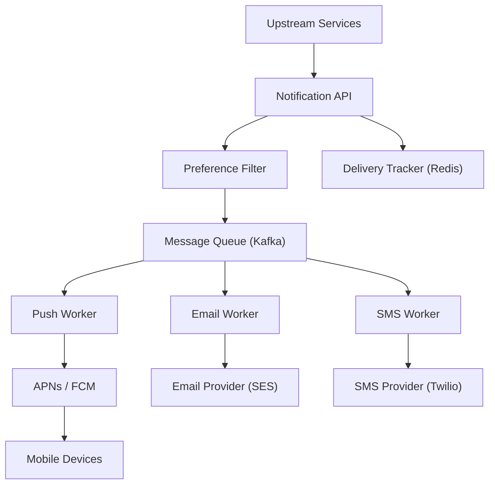

# Design a Notification System

**Difficulty**: Intermediate
**Time**: 45 minutes
**Companies**: Amazon, Meta, Google, Uber, LinkedIn (Common interview question)

## 🗺️ Quick Overview



*Events from any upstream service are queued and routed to channel-specific workers, each responsible for one delivery provider — failures are retried independently per channel.*

## 1. Problem Statement

Design a system that sends notifications across multiple channels (push, email, SMS, in-app) at scale, with user preferences, rate limiting, and delivery tracking.

**Scale reference:**

```
Amazon: 1 billion+ push notifications per day
Facebook: 10 billion+ notifications per day
Uber: Millions of real-time trip notifications per hour
LinkedIn: 100M+ email notifications per week
```

**The challenge isn't sending ONE notification — it's sending BILLIONS reliably.**

## 2. Requirements

### Functional Requirements
1. Send notifications via push, email, SMS, and in-app
2. Support user notification preferences (opt-in/out per channel)
3. Template-based notifications with personalization
4. Priority levels (critical, high, normal, low)
5. Rate limiting per user (no notification spam)
6. Delivery tracking and analytics
7. Scheduled/delayed notifications

### Non-Functional Requirements
1. **Reliable** (critical notifications must be delivered)
2. **Scalable** (1 billion+ notifications per day)
3. **Low latency** (< 5 seconds for high-priority)
4. **Extensible** (easy to add new channels)
5. **Fault tolerant** (one channel down doesn't block others)

### Out of Scope
- Notification content creation/management UI
- A/B testing of notification copy
- Complex targeting/segmentation engine

## 3. Notification Types

```
Channel         Latency      Cost          Best For
───────         ───────      ────          ────────
Push (iOS/     < 1 second   Free*         Real-time alerts
 Android)                                  (messages, orders)

In-App          Instant      Free          Non-urgent updates
                (if online)                (recommendations)

Email           Seconds to   $0.0001-     Marketing, receipts,
                minutes      $0.001/msg    detailed content

SMS             Seconds      $0.01-        OTP, critical alerts,
                             $0.05/msg     users without app

Voice call      Seconds      $0.01-        Emergency alerts
                             $0.10/min     (fraud, outages)

* Push notifications via FCM/APNs are free,
  but infrastructure costs money at scale
```

## 4. High-Level Design

```
┌──────────────────────────────────────────────────────────────┐
│                    Notification Flow                         │
│                                                              │
│  ┌──────────────┐                                            │
│  │   Trigger    │  "User 123's order shipped"                │
│  │  (Services)  │  "New message from Bob"                    │
│  │              │  "Your OTP is 483921"                      │
│  └──────┬───────┘                                            │
│         │                                                    │
│  ┌──────▼───────┐  Validate, deduplicate, rate limit         │
│  │ Notification │                                            │
│  │   Service    │                                            │
│  └──────┬───────┘                                            │
│         │                                                    │
│  ┌──────▼───────┐  Apply user preferences, templates         │
│  │  Processing  │                                            │
│  │   Pipeline   │                                            │
│  └──────┬───────┘                                            │
│         │                                                    │
│  ┌──────▼──────────────────────────────────┐                  │
│  │           Priority Queues               │                  │
│  │  ┌─────────┐ ┌────────┐ ┌────────────┐  │                  │
│  │  │Critical │ │ High   │ │  Normal    │  │                  │
│  │  │(OTP,    │ │(Orders,│ │(Marketing, │  │                  │
│  │  │ fraud)  │ │ msgs)  │ │ updates)   │  │                  │
│  │  └────┬────┘ └───┬────┘ └─────┬──────┘  │                  │
│  └───────┼──────────┼────────────┼─────────┘                  │
│          │          │            │                            │
│  ┌───────▼──────────▼────────────▼─────────┐                  │
│  │          Channel Workers                │                  │
│  │                                         │                  │
│  │  ┌──────┐ ┌──────┐ ┌──────┐ ┌────────┐  │                  │
│  │  │ Push │ │Email │ │ SMS  │ │In-App  │  │                  │
│  │  │Worker│ │Worker│ │Worker│ │ Worker │  │                  │
│  │  └──┬───┘ └──┬───┘ └──┬───┘ └───┬────┘  │                  │
│  └─────┼────────┼────────┼─────────┼───────┘                  │
│        │        │        │         │                         │
│  ┌─────▼──┐ ┌───▼──┐ ┌───▼──┐ ┌────▼─────┐                   │
│  │APNs / │ │SES / │ │Twilio│ │WebSocket │                   │
│  │  FCM  │ │SendGd│ │      │ │  / SSE   │                   │
│  └───────┘ └──────┘ └──────┘ └──────────┘                   │
└──────────────────────────────────────────────────────────────┘
```

## 5. Detailed Component Design

### Notification Service (Entry Point)

```javascript
// Notification Service - receives notification requests
class NotificationService {
  async send(notification) {
    // 1. Validate request
    this.validate(notification);

    // 2. Deduplicate (idempotency check)
    const isDuplicate = await this.dedup.check(notification.idempotencyKey);
    if (isDuplicate) {
      return { status: 'duplicate', message: 'Already processed' };
    }

    // 3. Rate limit check (per user)
    const isLimited = await this.rateLimiter.check(
      notification.userId,
      notification.channel
    );
    if (isLimited) {
      return { status: 'rate_limited', retryAfter: 300 };
    }

    // 4. Get user preferences
    const preferences = await this.preferenceService.get(notification.userId);

    // 5. Filter channels based on preferences
    const channels = this.filterChannels(notification, preferences);

    if (channels.length === 0) {
      return { status: 'opted_out', message: 'User has opted out' };
    }

    // 6. Enqueue for each channel
    for (const channel of channels) {
      await this.queue.publish(channel, {
        ...notification,
        channel,
        priority: notification.priority || 'normal',
        scheduledAt: notification.scheduledAt || Date.now()
      });
    }

    // 7. Track notification
    await this.analytics.track(notification.id, 'queued', channels);

    return { status: 'queued', channels, notificationId: notification.id };
  }
}
```

### User Preferences

```
User preference model:

{
  userId: "user-123",
  channels: {
    push: {
      enabled: true,
      quietHours: { start: "22:00", end: "08:00", timezone: "US/Pacific" },
      categories: {
        messages: true,
        marketing: false,
        orderUpdates: true,
        security: true    // Can't disable security notifications
      }
    },
    email: {
      enabled: true,
      address: "user@example.com",
      frequency: "immediate",  // "immediate" | "daily_digest" | "weekly_digest"
      categories: {
        messages: false,       // Don't email for every message
        marketing: true,
        orderUpdates: true,
        security: true
      }
    },
    sms: {
      enabled: true,
      phone: "+1234567890",
      categories: {
        messages: false,
        marketing: false,
        orderUpdates: false,
        security: true        // Only OTP and fraud alerts
      }
    },
    inApp: {
      enabled: true           // Always on for in-app
    }
  },
  globalDnd: false,           // Do not disturb
  language: "en"
}

Channel selection logic:
1. Is channel enabled? → No → Skip
2. Is category allowed for channel? → No → Skip
3. Is it quiet hours? → Yes → Delay (unless critical)
4. Is user in DND mode? → Yes → Only send critical
5. All checks pass → Send!
```

### Template Engine

```
Templates with personalization:

Template: "order_shipped"
{
  push: {
    title: "Your order is on its way!",
    body: "{{item_name}} shipped via {{carrier}}. Track: {{tracking_url}}",
    image: "{{item_image_url}}",
    action: "OPEN_ORDER_DETAILS",
    data: { orderId: "{{order_id}}" }
  },
  email: {
    subject: "Your {{item_name}} has shipped!",
    template: "order-shipped.html",
    variables: {
      customerName: "{{first_name}}",
      itemName: "{{item_name}}",
      carrier: "{{carrier}}",
      trackingUrl: "{{tracking_url}}",
      estimatedDelivery: "{{delivery_date}}"
    }
  },
  sms: {
    body: "Your order shipped! Track at {{short_tracking_url}}"
  },
  inApp: {
    title: "Order Shipped",
    body: "{{item_name}} is on its way",
    icon: "shipping",
    action: "/orders/{{order_id}}"
  }
}

Rendering:
  Input: { item_name: "AirPods Pro", carrier: "FedEx", ... }
  Push: "AirPods Pro shipped via FedEx. Track: https://..."
  Email: Full HTML email with tracking details
  SMS: "Your order shipped! Track at https://short.url/abc"
```

### Priority Queue System

```
Three priority levels with different SLAs:

┌────────────────────────────────────────────┐
│            Priority Queues                  │
│                                            │
│  CRITICAL (< 30 seconds)                   │
│  ┌──────────────────────────────┐           │
│  │ OTP codes, fraud alerts,     │           │
│  │ security notifications       │           │
│  │ [msg][msg][msg]              │ ← Processed first │
│  └──────────────────────────────┘           │
│                                            │
│  HIGH (< 5 minutes)                        │
│  ┌──────────────────────────────┐           │
│  │ New messages, order updates, │           │
│  │ payment confirmations        │           │
│  │ [msg][msg][msg][msg][msg]    │           │
│  └──────────────────────────────┘           │
│                                            │
│  NORMAL (< 30 minutes)                     │
│  ┌──────────────────────────────┐           │
│  │ Marketing, recommendations,  │           │
│  │ weekly digests, reminders    │           │
│  │ [msg][msg][msg][msg][msg]... │           │
│  └──────────────────────────────┘           │
│                                            │
│  Worker allocation:                        │
│  Critical: 20% of workers (always ready)   │
│  High: 50% of workers                      │
│  Normal: 30% of workers                    │
│  Dynamic rebalancing if queues grow        │
└────────────────────────────────────────────┘
```

### Channel Workers

```
Push Worker (APNs / FCM):

async function pushWorker(notification) {
  const { userId, title, body, data } = notification;

  // Get user's device tokens (may have multiple devices)
  const devices = await deviceRegistry.getDevices(userId);

  for (const device of devices) {
    try {
      if (device.platform === 'ios') {
        await apns.send({
          deviceToken: device.token,
          payload: {
            aps: {
              alert: { title, body },
              sound: 'default',
              badge: await getBadgeCount(userId)
            },
            ...data
          }
        });
      } else if (device.platform === 'android') {
        await fcm.send({
          token: device.token,
          notification: { title, body },
          data: data,
          android: {
            priority: 'high',
            notification: {
              channelId: notification.category
            }
          }
        });
      }

      await trackDelivery(notification.id, device.id, 'delivered');
    } catch (error) {
      if (error.code === 'INVALID_TOKEN') {
        // Token expired - remove device
        await deviceRegistry.removeDevice(device.id);
      } else {
        // Retry or DLQ
        await handleFailure(notification, device, error);
      }
    }
  }
}
```

```
Email Worker (SES / SendGrid):

async function emailWorker(notification) {
  const { userId, subject, template, variables } = notification;

  const user = await userService.get(userId);

  // Render template
  const html = await templateEngine.render(template, {
    ...variables,
    customerName: user.firstName,
    unsubscribeUrl: generateUnsubscribeUrl(userId, notification.category)
  });

  // Send via email provider
  await emailProvider.send({
    from: 'noreply@app.com',
    to: user.email,
    subject: subject,
    html: html,
    headers: {
      'X-Notification-Id': notification.id,
      'List-Unsubscribe': generateUnsubscribeUrl(userId, notification.category)
    }
  });

  await trackDelivery(notification.id, 'email', 'sent');
}
```

## 6. Rate Limiting Notifications

```
Per-user rate limits:

Push notifications:
  Max: 50 per day (across all categories)
  Marketing: 3 per day
  Messages: No limit (but batch if > 10 in 1 minute)

Email:
  Transactional: No limit (OTP, receipts)
  Marketing: 1 per day
  Digest: Once per configured frequency

SMS:
  Max: 5 per day (expensive!)
  OTP: No limit
  Marketing: 1 per week

Implementation:
async function checkRateLimit(userId, channel, category) {
  const key = `ratelimit:${channel}:${category}:${userId}`;
  const count = await redis.incr(key);

  if (count === 1) {
    await redis.expire(key, getWindowSeconds(channel, category));
  }

  const limit = getRateLimit(channel, category);
  return count <= limit;
}

Smart batching:
  If user gets 15 messages in 1 minute:
  ❌ Send 15 separate push notifications
  ✅ Send 1 push: "You have 15 new messages"

  If user gets 5 order updates in 10 minutes:
  ❌ 5 emails: "Order update", "Order update", ...
  ✅ 1 email: "Order update: shipped and arriving tomorrow"
```

## 7. Delivery Tracking

```
Notification lifecycle:

  CREATED → QUEUED → PROCESSING → SENT → DELIVERED → READ
                                    ↓
                                  FAILED → RETRYING → SENT
                                    ↓
                                    DLQ

Tracking table:
CREATE TABLE notification_events (
    notification_id UUID,
    channel TEXT,
    event_type TEXT,      -- 'created','queued','sent','delivered',
                          --  'read','failed','bounced','unsubscribed'
    event_time TIMESTAMP,
    metadata JSONB,       -- { provider: 'fcm', device: 'iphone-12' }
    PRIMARY KEY (notification_id, event_time)
);

Analytics dashboard:
┌──────────────────────────────────────────────┐
│        Notification Analytics                │
│                                              │
│  Channel    Sent     Delivered  Read   Rate  │
│  ─────────  ──────   ─────────  ────   ───── │
│  Push       1.2M     1.1M      450K   37%   │
│  Email      800K     780K      195K   25%   │
│  SMS        50K      49K       N/A    98%   │
│  In-App     2.1M     2.1M      1.8M   86%   │
│                                              │
│  Failures today: 23,456 (0.5%)               │
│  DLQ size: 142 (needs review)                │
│  Avg delivery time: 1.2 seconds              │
│  P99 delivery time: 4.8 seconds              │
└──────────────────────────────────────────────┘
```

## 8. Reliability and Failure Handling

### Retry Strategy

```
Retry with exponential backoff per channel:

Push (FCM/APNs):
  Retry: 3 attempts
  Backoff: 1s, 5s, 30s
  On permanent failure: Remove invalid token

Email (SES/SendGrid):
  Retry: 5 attempts
  Backoff: 10s, 30s, 2min, 10min, 1hr
  On bounce: Mark email as invalid
  On spam complaint: Auto-unsubscribe user

SMS (Twilio):
  Retry: 2 attempts
  Backoff: 5s, 30s
  On failure: Fall back to email
  On invalid number: Remove from profile

Fallback chain:
  Push fails → Try email
  Email fails → Try SMS (if critical)
  SMS fails → Try in-app (next time they open)
  All fail → DLQ + alert ops team
```

### Deduplication

```
Problem: Network issues cause duplicate sends

User receives:
  "Your OTP is 483921"
  "Your OTP is 483921"    ← Duplicate!
  "Your OTP is 483921"    ← Duplicate!

Solution: Idempotency key per notification

async function send(notification) {
  const dedupKey = `dedup:${notification.idempotencyKey}`;

  // Check if already processed (atomic set-if-not-exists)
  const isNew = await redis.set(dedupKey, '1', 'NX', 'EX', 3600);

  if (!isNew) {
    return; // Already sent this notification
  }

  // Process notification...
}

// Caller provides idempotency key:
await notificationService.send({
  idempotencyKey: `otp:${userId}:${otpCode}:${timestamp}`,
  userId: '123',
  channel: 'sms',
  template: 'otp',
  data: { code: '483921' }
});
```

## 9. Scaling Considerations

```
Scaling each component:

Notification Service (API):
  Stateless → Scale horizontally behind ALB
  10-50 instances based on request rate

Message Queues (Kafka/SQS):
  Partition by channel + priority
  Topics: notifications.push.critical
          notifications.push.high
          notifications.email.normal
          ...

Channel Workers:
  Scale independently per channel
  Push workers: 100 instances (high volume)
  Email workers: 50 instances
  SMS workers: 10 instances (low volume, expensive)

  Auto-scale on queue depth:
    Queue depth > 10K → scale up
    Queue depth < 100 → scale down

Redis (Preferences + Rate Limits):
  Cluster mode: 6+ nodes
  Cache user preferences (TTL: 5 min)
  Rate limit counters with TTL

Database:
  Write: Notification events → Kafka → Cassandra
  Read: Analytics dashboard → Read replicas
  User preferences → PostgreSQL (relational, ACID)
```

## 10. Real-World Example: Uber

```
Uber Notification Architecture:

Trigger events:
  - Driver assigned (push to rider)
  - Trip started (push + in-app)
  - Arriving soon (push to rider, push to driver)
  - Trip completed (push + email receipt)
  - Surge pricing (push to nearby drivers)
  - Promotions (push + email, rate limited)

Scale:
  - 100M+ notifications per day
  - Sub-second delivery for trip notifications
  - Multi-region deployment
  - Channel preferences per user per category

Key design choices:
  1. Push is primary (riders need real-time updates)
  2. Email for receipts and promotions only
  3. SMS for OTP and markets without smartphones
  4. In-app for non-urgent (promotions, tips)
  5. Rate limit: Max 20 push/day for marketing
  6. Quiet hours respected except for active trips
```

## 11. Key Takeaways

```
1. Decouple notification creation from delivery
   API accepts requests → Queue → Workers deliver
   Senders don't wait for delivery

2. Priority queues are essential
   OTP (30s SLA) vs marketing (30 min SLA)
   Allocate workers by priority

3. Respect user preferences
   Channel opt-in/out, quiet hours, frequency
   Never send to an opted-out channel

4. Rate limit aggressively
   Nobody wants 50 push notifications a day
   Batch related notifications

5. Every channel worker should be independent
   Email down? Push still works
   SMS expensive? Route to push first

6. Deduplication prevents notification spam
   Network retries can cause duplicates
   Use idempotency keys for all notifications

7. Track every notification event
   Created → Queued → Sent → Delivered → Read
   Essential for debugging and analytics

8. Templates separate content from delivery
   Change notification text without code deploy
   Support multiple languages easily
```
