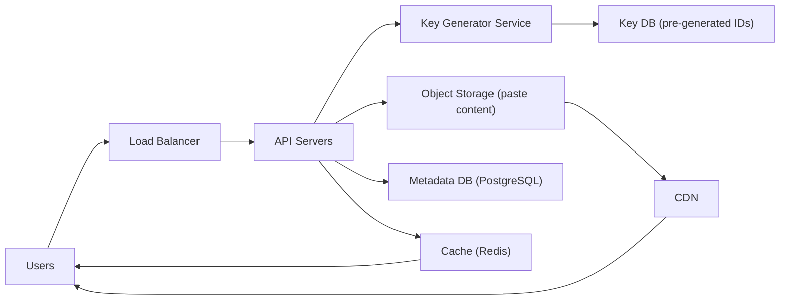

# Design a Pastebin (like pastebin.com)

**Difficulty**: Beginner
**Time**: 45 minutes
**Companies**: Google, Amazon, Microsoft, Meta (Classic interview question)

## 🗺️ Quick Overview



*Short unique keys are pre-generated to avoid hot-spot collisions; paste content lives in object storage while metadata (owner, expiry, views) lives in a relational DB with a Redis read cache in front.*

## 1. Problem Statement

Design a text sharing service that:
- Allows users to store and share plain text or code snippets
- Generates unique URLs for each paste
- Supports syntax highlighting and expiration
- Handles millions of pastes and reads

**Examples**:
```
Create paste:
POST → "Hello World! This is my code snippet..."
Return → https://paste.io/abc123

Retrieve paste:
GET https://paste.io/abc123
Return → "Hello World! This is my code snippet..."
```

**Similar services**: Pastebin, GitHub Gist, Hastebin, Ghostbin

## 2. Requirements

### Functional Requirements
1. Create a new paste with text content
2. Generate unique URL for each paste
3. Retrieve paste by URL
4. Optional: Syntax highlighting (language detection)
5. Optional: Paste expiration (1 hour, 1 day, never)
6. Optional: Password protection
7. Optional: View count tracking

### Non-Functional Requirements
1. **High availability** (99.9% uptime)
2. **Low latency** (< 200ms for paste retrieval)
3. **Scalable** (10M pastes/day at peak)
4. **Durable** (pastes never lost until expiration)
5. **Short URLs** (6-8 characters)
6. **Large pastes** (up to 10MB per paste)

### Out of Scope
- User accounts and authentication
- Paste editing (pastes are immutable)
- Real-time collaboration
- Rich text formatting

## 3. Capacity Estimation

### Traffic Estimates
```
Write (new pastes): 1,000,000 per day = 12 pastes/sec
Read (views): 10:1 read/write ratio = 120 views/sec

Peak traffic (5× average):
- Writes: 60 pastes/sec
- Reads: 600 views/sec
```

### Storage Estimates
```
Average paste size: 10 KB
Maximum paste size: 10 MB

New pastes per day: 1M
Average retention: 1 year (with expiration)
Active pastes: 365M

Storage needed:
- Average case: 365M × 10 KB = 3.65 TB
- Peak case (all max size): 365M × 10 MB = 3.65 PB (unrealistic)

Realistic estimate: 5-10 TB for text storage
Metadata overhead: ~20%
Total: ~12 TB
```

### Bandwidth Estimates
```
Writes: 12 pastes/sec × 10 KB = 120 KB/sec
Reads: 120 views/sec × 10 KB = 1.2 MB/sec

Peak reads: 600 views/sec × 10 KB = 6 MB/sec

Total bandwidth: ~10 MB/sec (manageable)
```

### Key Observation
```
This is a READ-HEAVY system:
- 10:1 read/write ratio
- Perfect candidate for aggressive caching
- Content is immutable after creation
```

## 4. System APIs

### Create Paste

```javascript
POST /api/paste

Request:
{
  "content": "print('Hello, World!')",
  "language": "python",           // Optional, auto-detect if omitted
  "expiresIn": "1d",              // Optional: "1h", "1d", "1w", "1m", "never"
  "password": "secret123",        // Optional
  "burnAfterRead": false          // Optional: delete after first view
}

Response: 201 Created
{
  "id": "abc123",
  "url": "https://paste.io/abc123",
  "rawUrl": "https://paste.io/raw/abc123",
  "language": "python",
  "createdAt": "2026-01-23T10:30:00Z",
  "expiresAt": "2026-01-24T10:30:00Z",
  "size": 22
}
```

### Get Paste (HTML View)

```javascript
GET /:pasteId

Headers:
  X-Password: secret123  // If password protected

Response: 200 OK (HTML page with syntax highlighting)

Error Responses:
- 404: Paste not found or expired
- 401: Password required or incorrect
```

### Get Raw Paste

```javascript
GET /raw/:pasteId

Response: 200 OK
Content-Type: text/plain

print('Hello, World!')
```

### Delete Paste

```javascript
DELETE /api/paste/:pasteId

Headers:
  X-Delete-Key: xyz789  // Provided at creation time

Response: 204 No Content
```

## 5. Database Schema

### Option A: SQL Database (PostgreSQL)

```sql
CREATE TABLE pastes (
  id VARCHAR(8) PRIMARY KEY,          -- Short unique ID
  content TEXT NOT NULL,              -- Paste content (or S3 reference for large pastes)
  content_hash CHAR(64),              -- SHA-256 for deduplication
  language VARCHAR(50),               -- Programming language
  created_at TIMESTAMP DEFAULT NOW(),
  expires_at TIMESTAMP,               -- NULL = never expires
  password_hash CHAR(60),             -- bcrypt hash if protected
  delete_key VARCHAR(32),             -- For owner deletion
  burn_after_read BOOLEAN DEFAULT FALSE,
  view_count INT DEFAULT 0,
  size_bytes INT NOT NULL,

  INDEX idx_expires_at (expires_at),
  INDEX idx_content_hash (content_hash)  -- For deduplication
);

-- For large pastes, store content in S3 and reference here
CREATE TABLE paste_storage (
  paste_id VARCHAR(8) PRIMARY KEY,
  storage_type VARCHAR(10),            -- 'inline' or 's3'
  s3_bucket VARCHAR(100),
  s3_key VARCHAR(200),
  FOREIGN KEY (paste_id) REFERENCES pastes(id)
);
```

### Option B: NoSQL (DynamoDB)

```javascript
// Partition key: pasteId
// Sort key: None (simple key-value)

{
  "pasteId": "abc123",                // Partition key
  "content": "print('Hello')",        // Paste content
  "language": "python",
  "createdAt": 1706009400,            // Unix timestamp
  "expiresAt": 1706095800,            // TTL (DynamoDB auto-deletes)
  "passwordHash": "...",
  "deleteKey": "xyz789",
  "burnAfterRead": false,
  "viewCount": 42,
  "sizeBytes": 15
}

// TTL enabled on 'expiresAt' for automatic cleanup
```

## 6. High-Level Architecture

```
                            ┌─────────────────────┐
                            │    CDN (CloudFront) │
                            │  - Cache static     │
                            │  - Cache popular    │
                            │    pastes           │
                            └──────────┬──────────┘
                                       │
                                       ▼
                            ┌─────────────────────┐
                            │   Load Balancer     │
                            │     (ALB/NLB)       │
                            └──────────┬──────────┘
                                       │
                ┌──────────────────────┼──────────────────────┐
                ▼                      ▼                      ▼
         ┌─────────────┐        ┌─────────────┐        ┌─────────────┐
         │   App       │        │   App       │        │   App       │
         │   Server 1  │        │   Server 2  │        │   Server 3  │
         └──────┬──────┘        └──────┬──────┘        └──────┬──────┘
                │                      │                      │
                └──────────────────────┼──────────────────────┘
                                       │
                    ┌──────────────────┼──────────────────┐
                    ▼                  ▼                  ▼
             ┌───────────┐      ┌───────────┐      ┌───────────┐
             │   Redis   │      │ PostgreSQL│      │    S3     │
             │   Cache   │      │  (Meta)   │      │ (Content) │
             └───────────┘      └───────────┘      └───────────┘
```

## 7. Key Design Decisions

### Decision 1: Short ID Generation

**Options considered**:

| Approach | Pros | Cons |
|----------|------|------|
| Auto-increment + Base62 | Simple, sequential | Predictable, reveals count |
| UUID | Unique, no collision | 36 chars (too long) |
| Random Base62 | Short, unpredictable | Collision possible |
| Hash of content | Content-addressable | Long, collision possible |
| Pre-generated IDs | Fast, guaranteed unique | Storage overhead |

**Chosen approach**: Counter + Base62 encoding

```javascript
// ID Generation Service
class IdGenerator {
  constructor() {
    this.counter = BigInt(Date.now()) * 1000n;  // Start from timestamp
  }

  async generate() {
    const id = this.counter++;
    return this.toBase62(id);
  }

  toBase62(num) {
    const chars = '0123456789ABCDEFGHIJKLMNOPQRSTUVWXYZabcdefghijklmnopqrstuvwxyz';
    let result = '';
    while (num > 0n) {
      result = chars[Number(num % 62n)] + result;
      num = num / 62n;
    }
    return result.padStart(6, '0');
  }
}

// 6 characters in Base62 = 62^6 = 56.8 billion unique IDs
// At 1M pastes/day = 155 years of IDs
```

### Decision 2: Content Storage Strategy

```javascript
// Small pastes (< 100KB): Store inline in database
// Large pastes (100KB - 10MB): Store in S3

async function storePaste(content) {
  const sizeBytes = Buffer.byteLength(content, 'utf8');

  if (sizeBytes < 100 * 1024) {
    // Inline storage
    return {
      storageType: 'inline',
      content: content
    };
  } else {
    // S3 storage
    const key = `pastes/${generateId()}`;
    await s3.putObject({
      Bucket: 'pastebin-content',
      Key: key,
      Body: content,
      ContentType: 'text/plain'
    });

    return {
      storageType: 's3',
      s3Key: key
    };
  }
}
```

### Decision 3: Caching Strategy

```javascript
// Multi-layer caching

// Layer 1: CDN (CloudFront) - Cache at edge
// TTL: 5 minutes for popular pastes
// Benefits: Global distribution, reduced server load

// Layer 2: Redis - Application cache
// TTL: 1 hour for recently accessed pastes
// Benefits: Sub-millisecond reads

async function getPaste(pasteId) {
  // Check Redis first
  const cached = await redis.get(`paste:${pasteId}`);
  if (cached) {
    await redis.incr(`views:${pasteId}`);  // Track views
    return JSON.parse(cached);
  }

  // Check database
  const paste = await db.query(
    'SELECT * FROM pastes WHERE id = $1 AND (expires_at IS NULL OR expires_at > NOW())',
    [pasteId]
  );

  if (!paste) {
    throw new NotFoundError('Paste not found or expired');
  }

  // Handle S3 content
  if (paste.storage_type === 's3') {
    paste.content = await s3.getObject({
      Bucket: 'pastebin-content',
      Key: paste.s3_key
    });
  }

  // Cache in Redis
  await redis.setex(`paste:${pasteId}`, 3600, JSON.stringify(paste));

  return paste;
}
```

## 8. Deep Dive: Handling Large Content

### Content Deduplication

Many pastes contain identical content (example code, templates, etc.).

```javascript
async function createPaste(content, options) {
  // Calculate content hash
  const contentHash = crypto.createHash('sha256').update(content).digest('hex');

  // Check for existing identical paste
  const existing = await db.query(
    'SELECT id FROM pastes WHERE content_hash = $1 AND expires_at > NOW() LIMIT 1',
    [contentHash]
  );

  if (existing) {
    // Return new URL pointing to existing content
    const newId = await idGenerator.generate();
    await db.query(
      `INSERT INTO pastes (id, content_reference, content_hash, ...) VALUES ($1, $2, $3, ...)`,
      [newId, existing.id, contentHash, ...]
    );
    return newId;
  }

  // Store new content
  return await storeNewPaste(content, contentHash, options);
}

// Deduplication savings:
// - Common code examples: 30% storage reduction
// - Error logs: 50% storage reduction (many duplicates)
// - Overall: ~20% storage savings
```

### Compression for Storage

```javascript
const zlib = require('zlib');

async function compressAndStore(content) {
  // Only compress if content is compressible (text)
  const compressed = await promisify(zlib.gzip)(content);

  // Only use compression if it actually saves space
  if (compressed.length < content.length * 0.8) {
    return {
      compressed: true,
      data: compressed
    };
  }

  return {
    compressed: false,
    data: content
  };
}

// Compression results for typical content:
// - Plain text: 60-80% compression
// - Code: 50-70% compression
// - Already compressed: No benefit
```

## 9. Security Considerations

### Password Protection

```javascript
const bcrypt = require('bcrypt');

async function createProtectedPaste(content, password) {
  const passwordHash = await bcrypt.hash(password, 12);

  return await db.query(
    'INSERT INTO pastes (id, content, password_hash) VALUES ($1, $2, $3)',
    [generateId(), content, passwordHash]
  );
}

async function accessProtectedPaste(pasteId, providedPassword) {
  const paste = await db.query('SELECT * FROM pastes WHERE id = $1', [pasteId]);

  if (paste.password_hash) {
    const valid = await bcrypt.compare(providedPassword, paste.password_hash);
    if (!valid) {
      throw new UnauthorizedError('Invalid password');
    }
  }

  return paste;
}
```

### Burn After Read

```javascript
async function getBurnablePaste(pasteId) {
  const result = await db.query(
    `DELETE FROM pastes
     WHERE id = $1 AND burn_after_read = true
     RETURNING *`,
    [pasteId]
  );

  if (result.rows.length > 0) {
    // Paste was burnable and now deleted
    return result.rows[0];
  }

  // Regular paste, just return it
  return await db.query('SELECT * FROM pastes WHERE id = $1', [pasteId]);
}
```

### Content Filtering

```javascript
// Basic abuse prevention
async function validateContent(content) {
  // Size limit
  if (content.length > 10 * 1024 * 1024) {
    throw new Error('Content exceeds 10MB limit');
  }

  // Rate limiting per IP
  const recentPastes = await redis.incr(`rate:${clientIp}`);
  await redis.expire(`rate:${clientIp}`, 3600);

  if (recentPastes > 100) {  // 100 pastes per hour per IP
    throw new TooManyRequestsError('Rate limit exceeded');
  }

  // Malware scanning (optional, for enterprise)
  // await scanContent(content);
}
```

## 10. Scaling Strategies

### Read Scaling (Most Important)

```
Since reads >> writes, focus on read scaling:

1. CDN caching for popular pastes
   - 80% of traffic to 20% of pastes
   - Cache popular pastes at edge

2. Redis cluster for hot data
   - Cache recently created pastes
   - Cache frequently accessed pastes

3. Read replicas for database
   - All reads go to replicas
   - Only writes go to primary

Read path:
User → CDN (hit? done) → Redis (hit? done) → DB Replica → Response
```

### Write Scaling

```javascript
// Writes are less frequent, but still need to scale

// Option 1: Sharding by paste ID
const shardId = pasteId.charCodeAt(0) % NUM_SHARDS;
const db = getShardConnection(shardId);

// Option 2: Time-based partitioning
// Recent pastes in hot storage, old pastes in cold storage
const partition = paste.createdAt > weekAgo ? 'hot' : 'cold';
const storage = getStorage(partition);
```

### Cleanup Service

```javascript
// Background job to clean expired pastes

async function cleanupExpiredPastes() {
  // Batch delete for efficiency
  const batchSize = 1000;

  let deleted = 0;
  do {
    const result = await db.query(
      `DELETE FROM pastes
       WHERE id IN (
         SELECT id FROM pastes
         WHERE expires_at < NOW()
         LIMIT $1
       )
       RETURNING id`,
      [batchSize]
    );

    deleted = result.rowCount;

    // Also clean from S3
    for (const paste of result.rows) {
      await cleanupS3(paste.id);
    }

    // Avoid overwhelming the database
    if (deleted === batchSize) {
      await sleep(1000);
    }
  } while (deleted === batchSize);
}

// Run every hour
cron.schedule('0 * * * *', cleanupExpiredPastes);
```

## 11. Trade-offs and Alternatives

### SQL vs NoSQL

| Consideration | SQL (PostgreSQL) | NoSQL (DynamoDB) |
|---------------|------------------|------------------|
| Query flexibility | High | Limited |
| Auto-scaling | Manual sharding | Automatic |
| TTL expiration | Manual cleanup job | Built-in TTL |
| Cost at scale | Lower | Higher |
| Operations | More complex | Simpler |

**Recommendation**: Start with PostgreSQL for flexibility, consider DynamoDB for extreme scale.

### Blob Storage vs Inline

| Consideration | S3 for All | Hybrid (Size-based) |
|---------------|------------|---------------------|
| Latency | Higher (S3 call) | Lower for small |
| Cost | Higher (S3 requests) | Optimized |
| Simplicity | Simpler architecture | More complex |
| Backup | S3 durability | Need both backups |

**Recommendation**: Hybrid approach - inline for <100KB, S3 for larger.

## 12. Interview Tips

### Key Points to Mention

1. **Read-heavy system**: Emphasize caching strategy
2. **Content immutability**: Enables aggressive caching
3. **Expiration handling**: TTL vs cleanup jobs
4. **Large content**: S3 vs inline storage decision
5. **ID generation**: Base62 encoding for short URLs

### Common Follow-up Questions

**Q: How would you handle paste editing?**
A: Create new paste, optionally link versions. Makes caching simpler.

**Q: How would you detect and prevent abuse?**
A: Rate limiting, content scanning, IP reputation, CAPTCHA for suspicious patterns.

**Q: How would you add user accounts?**
A: Add users table, link pastes to users, add authentication layer.

**Q: What if one paste goes viral?**
A: CDN handles it - paste cached at edge, origin server barely touched.

## 13. Summary

```
Key Design Choices:
├── ID Generation: Counter + Base62 (short, unique)
├── Storage: Inline (<100KB) + S3 (>100KB)
├── Caching: CDN → Redis → Database
├── Expiration: TTL in DynamoDB or cleanup job
└── Scaling: Read replicas, sharding by ID

Performance Targets:
├── Write latency: < 100ms
├── Read latency: < 50ms (cached), < 200ms (uncached)
├── Availability: 99.9%
└── Throughput: 10M pastes/day

Cost Drivers:
├── Storage: S3 ($0.023/GB/month)
├── Database: RDS or DynamoDB
├── Bandwidth: CDN pricing
└── Compute: Auto-scaling group
```

---

## Related Resources

- [URL Shortener Design](./url-shortener.md) - Similar short URL generation
- [Key-Value Store Design](./key-value-store.md) - Storage patterns
- [Rate Limiting Strategies](../api-design/rate-limiting.md) - Abuse prevention

---

## Practice POCs

- [POC #1: Redis Key-Value Cache](/03-redis/hands-on/redis-key-value-cache)
- [POC #7: Redis Rate Limiting](/03-redis/hands-on/redis-rate-limiting)
- [POC #61: Cache-Aside Pattern](/02-caching/hands-on/cache-aside-pattern)
