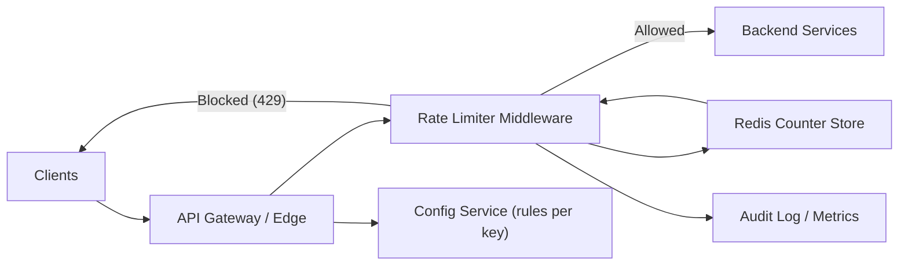

# Design a Rate Limiter

**Difficulty**: Intermediate
**Time**: 45 minutes
**Companies**: Stripe, Cloudflare, Google, Amazon, Meta (Very common interview question)

## 🗺️ Quick Overview



*Every inbound request is checked against a counter in Redis; the gateway enforces the decision at the edge before traffic ever reaches backend services.*

## 1. Problem Statement

Design a system that limits the number of requests a client can make within a time window.

**Why it matters:**

```
Without rate limiting:
  1. One user sends 10,000 requests/sec
  2. Your servers are overwhelmed
  3. All other users experience downtime
  4. Your AWS bill explodes
  5. You get DDoS'd and can't stop it

With rate limiting:
  1. User limited to 100 requests/sec
  2. Excess requests get HTTP 429 (Too Many Requests)
  3. Other users unaffected
  4. Costs predictable
  5. DDoS mitigated at the edge
```

**Real-world examples:**

```
GitHub API:     5,000 requests/hour per user
Twitter API:    300 tweets/3 hours per user
Stripe API:     100 requests/sec per key
Google Maps:    50 requests/sec per key
Discord:        50 messages/10 sec per channel
```

## 2. Requirements

### Functional Requirements
1. Limit requests based on configurable rules
2. Support multiple rate limit criteria (user ID, IP, API key)
3. Return appropriate headers (remaining, reset time)
4. Support different limits per API endpoint
5. Optional: Allow burst traffic above steady rate

### Non-Functional Requirements
1. **Low latency** (< 1ms overhead per request)
2. **Highly available** (rate limiter down ≠ API down)
3. **Distributed** (works across multiple servers)
4. **Accurate** (no significant over/under counting)
5. **Memory efficient** (millions of clients tracked)

### Out of Scope
- Authentication/authorization
- API analytics dashboard
- Billing based on usage

## 3. Rate Limiting Algorithms

### Algorithm 1: Fixed Window Counter

```
Simple: Count requests in fixed time windows

Window: 1 minute, Limit: 100 requests

Timeline:
  12:00:00 ──────────────────── 12:01:00 ──────────────────── 12:02:00
  │  Counter: 0 → 1 → ... → 100  │  Counter: 0 → 1 → ...    │
  │  Request 101: REJECTED ❌     │  Fresh window             │
  └───────────────────────────────┘───────────────────────────┘

Implementation:
  Key: "rate:user123:202601301200"  (user + window timestamp)
  Value: counter (incremented per request)
```

```javascript
// Fixed Window implementation
async function fixedWindowRateLimit(userId, limit, windowSec) {
  const window = Math.floor(Date.now() / 1000 / windowSec);
  const key = `rate:${userId}:${window}`;

  const count = await redis.incr(key);

  if (count === 1) {
    await redis.expire(key, windowSec); // Auto-cleanup
  }

  if (count > limit) {
    return { allowed: false, remaining: 0 };
  }

  return { allowed: true, remaining: limit - count };
}
```

**Pros:** Simple, low memory, O(1) operations
**Cons:** Burst at window edges (2x limit possible)

```
The boundary problem:

Window 1 (12:00-12:01)        Window 2 (12:01-12:02)
         ................100 requests | 100 requests...........
                     ◄── 1 second ──►
                     200 requests in 1 second!
                     (Limit is supposed to be 100/min)
```

### Algorithm 2: Sliding Window Log

```
Track exact timestamps of all requests

Limit: 100 requests per minute

Sorted set of timestamps:
  [12:00:05, 12:00:12, 12:00:18, ..., 12:00:59]

New request at 12:01:10:
  1. Remove all entries older than 12:00:10 (60s ago)
  2. Count remaining entries
  3. If count < 100: Allow, add timestamp
  4. If count >= 100: Reject
```

```javascript
// Sliding Window Log implementation
async function slidingWindowLog(userId, limit, windowSec) {
  const now = Date.now();
  const windowStart = now - (windowSec * 1000);
  const key = `rate:${userId}`;

  // Atomic operation using Redis pipeline
  const pipe = redis.pipeline();
  pipe.zremrangebyscore(key, 0, windowStart);  // Remove old entries
  pipe.zadd(key, now, `${now}:${Math.random()}`); // Add current
  pipe.zcard(key);                              // Count entries
  pipe.expire(key, windowSec);                  // Auto-cleanup

  const results = await pipe.exec();
  const count = results[2][1];

  if (count > limit) {
    // Remove the entry we just added (request denied)
    pipe.zremrangebyscore(key, now, now);
    return { allowed: false, remaining: 0 };
  }

  return { allowed: true, remaining: limit - count };
}
```

**Pros:** Accurate, no boundary problem
**Cons:** High memory (stores every timestamp), O(log n) operations

### Algorithm 3: Sliding Window Counter (Best of Both)

```
Combines fixed window efficiency with sliding window accuracy

Current window: 12:01:00 - 12:02:00
Previous window: 12:00:00 - 12:01:00
Current time: 12:01:15 (25% into current window)

Previous window count: 84
Current window count: 36

Weighted count = previous × (1 - position%) + current
               = 84 × 0.75 + 36
               = 63 + 36
               = 99

Limit: 100
Result: 99 < 100 → ALLOWED (1 remaining)
```

```javascript
// Sliding Window Counter implementation
async function slidingWindowCounter(userId, limit, windowSec) {
  const now = Date.now();
  const currentWindow = Math.floor(now / 1000 / windowSec);
  const previousWindow = currentWindow - 1;

  const currentKey = `rate:${userId}:${currentWindow}`;
  const previousKey = `rate:${userId}:${previousWindow}`;

  const [previousCount, currentCount] = await Promise.all([
    redis.get(previousKey).then(v => parseInt(v) || 0),
    redis.get(currentKey).then(v => parseInt(v) || 0)
  ]);

  // Calculate position in current window (0.0 to 1.0)
  const windowStart = currentWindow * windowSec * 1000;
  const position = (now - windowStart) / (windowSec * 1000);

  // Weighted count
  const weightedCount = previousCount * (1 - position) + currentCount;

  if (weightedCount >= limit) {
    return { allowed: false, remaining: 0 };
  }

  // Increment current window
  await redis.incr(currentKey);
  await redis.expire(currentKey, windowSec * 2);

  return {
    allowed: true,
    remaining: Math.floor(limit - weightedCount - 1)
  };
}
```

**Pros:** Accurate, low memory, O(1) operations
**Cons:** Not 100% precise (approximation)

### Algorithm 4: Token Bucket

```
Bucket fills with tokens at a steady rate
Each request consumes one token
No tokens = request denied

Bucket capacity: 10 tokens (allows burst)
Refill rate: 2 tokens/second (steady rate)

Timeline:
  t=0:  Bucket: [●●●●●●●●●●] 10 tokens (full)
  t=0:  5 requests → [●●●●●○○○○○] 5 tokens left (burst OK!)
  t=1:  Refill +2  → [●●●●●●●○○○] 7 tokens
  t=1:  3 requests → [●●●●○○○○○○] 4 tokens left
  t=2:  Refill +2  → [●●●●●●○○○○] 6 tokens
  t=5:  Refill +6  → [●●●●●●●●●●] 10 tokens (capped at max)

Key insight: Allows short bursts while maintaining average rate
```

```javascript
// Token Bucket implementation
async function tokenBucket(userId, bucketSize, refillRate) {
  const key = `bucket:${userId}`;
  const now = Date.now();

  // Lua script for atomic token bucket (runs on Redis)
  const luaScript = `
    local key = KEYS[1]
    local bucket_size = tonumber(ARGV[1])
    local refill_rate = tonumber(ARGV[2])
    local now = tonumber(ARGV[3])

    local bucket = redis.call('hmget', key, 'tokens', 'last_refill')
    local tokens = tonumber(bucket[1]) or bucket_size
    local last_refill = tonumber(bucket[2]) or now

    -- Calculate tokens to add since last refill
    local elapsed = (now - last_refill) / 1000
    local new_tokens = math.min(
      bucket_size,
      tokens + (elapsed * refill_rate)
    )

    if new_tokens >= 1 then
      -- Consume one token
      new_tokens = new_tokens - 1
      redis.call('hmset', key, 'tokens', new_tokens, 'last_refill', now)
      redis.call('expire', key, bucket_size / refill_rate * 2)
      return {1, math.floor(new_tokens)} -- allowed, remaining
    else
      redis.call('hmset', key, 'tokens', new_tokens, 'last_refill', now)
      return {0, 0} -- denied, 0 remaining
    end
  `;

  const [allowed, remaining] = await redis.eval(
    luaScript, 1, key, bucketSize, refillRate, now
  );

  return { allowed: allowed === 1, remaining };
}
```

**Pros:** Smooth rate, allows bursts, intuitive
**Cons:** More complex, needs atomic operations

### Algorithm 5: Leaky Bucket

```
Requests enter a bucket that "leaks" at a fixed rate

Like a bucket with a hole in the bottom:
  - Water (requests) poured in from top
  - Water leaks out at constant rate
  - If bucket overflows → request rejected

  ┌──────────┐
  │ Requests │ ← New requests enter
  │ ┌──────┐ │
  │ │●●●●●●│ │ ← Bucket (queue)
  │ │●●●●  │ │
  │ └──┬───┘ │
  │    │     │
  │    ▼     │
  │ Process  │ ← Fixed rate output (e.g., 10 req/sec)
  └──────────┘

If bucket full → HTTP 429

Difference from Token Bucket:
  Token Bucket: Allows bursts (use saved tokens)
  Leaky Bucket: Always processes at fixed rate (smooths traffic)
```

**Pros:** Perfectly smooth output rate, simple
**Cons:** No burst handling, recent requests may wait behind old ones

### Algorithm Comparison

```
Algorithm              Memory    Accuracy   Burst    Complexity
────────────────       ──────    ────────   ─────    ──────────
Fixed Window           O(1)     Low        Yes*     Very low
Sliding Window Log     O(n)     Perfect    No       Medium
Sliding Window Counter O(1)     High       No       Low
Token Bucket           O(1)     High       Yes      Medium
Leaky Bucket           O(n)     Perfect    No       Medium

* Fixed window burst is a bug, not a feature

Recommended:
  Simple API limits → Sliding Window Counter
  Burst-friendly → Token Bucket (Stripe uses this)
  Smooth output → Leaky Bucket
```

## 4. High-Level Design

```
┌────────┐     ┌──────────────┐     ┌──────────────┐
│ Client │────▶│ Rate Limiter │────▶│  API Server  │
│        │◀────│  Middleware   │◀────│              │
└────────┘     └──────┬───────┘     └──────────────┘
                      │
               ┌──────▼───────┐
               │    Redis     │
               │ (Counters/   │
               │  Tokens)     │
               └──────────────┘

Request flow:
1. Client sends request
2. Rate limiter middleware intercepts
3. Check Redis: Is client within limit?
   - YES → Forward to API server
   - NO → Return 429 Too Many Requests
4. Include rate limit headers in response
```

### Response Headers

```
HTTP/1.1 200 OK
X-RateLimit-Limit: 100          # Max requests per window
X-RateLimit-Remaining: 45       # Requests left in window
X-RateLimit-Reset: 1706644800   # Unix timestamp when window resets
X-RateLimit-Policy: "100;w=60"  # 100 per 60 seconds

HTTP/1.1 429 Too Many Requests
X-RateLimit-Limit: 100
X-RateLimit-Remaining: 0
X-RateLimit-Reset: 1706644800
Retry-After: 30                 # Seconds until retry is safe
Content-Type: application/json

{
  "error": "rate_limit_exceeded",
  "message": "Rate limit of 100 requests per minute exceeded",
  "retry_after": 30
}
```

## 5. Distributed Rate Limiting

### The Problem

```
Single server: Easy - one Redis, one counter

Multiple servers:
┌─────────┐   ┌─────────┐   ┌─────────┐
│Server 1 │   │Server 2 │   │Server 3 │
│Count: 40│   │Count: 35│   │Count: 30│
└─────────┘   └─────────┘   └─────────┘

Total: 105 requests (OVER the 100 limit!)
But each server thinks it's under limit.
```

### Solution 1: Centralized Redis

```
All servers share ONE Redis:

┌─────────┐  ┌─────────┐  ┌─────────┐
│Server 1 │  │Server 2 │  │Server 3 │
└────┬────┘  └────┬────┘  └────┬────┘
     │            │            │
     └────────────┼────────────┘
                  │
           ┌──────▼──────┐
           │    Redis    │
           │ Counter: 95 │  Single source of truth
           └─────────────┘

Pros: Accurate, simple
Cons: Redis is single point of failure, latency to Redis
Mitigation: Redis Cluster with replicas
```

### Solution 2: Local + Sync (Approximate)

```
Each server has local counter, syncs periodically:

┌─────────────────┐  ┌─────────────────┐
│    Server 1     │  │    Server 2     │
│ Local: 15       │  │ Local: 12       │
│ Global: ~90     │  │ Global: ~90     │
│ Allowance: 33   │  │ Allowance: 33   │
└────────┬────────┘  └────────┬────────┘
         │                    │
         └────────┬───────────┘
                  │ Sync every 1 second
           ┌──────▼──────┐
           │    Redis    │
           │ Total: 90   │
           └─────────────┘

Each server gets: limit / server_count allowance
Sync to Redis periodically for global view
Pros: Low latency (local checks), resilient
Cons: Approximate (can slightly over/under count)
```

### Solution 3: Rate Limiting at the Edge

```
CDN/Edge level rate limiting (Cloudflare, AWS WAF):

┌────────┐     ┌───────────────┐     ┌──────────┐
│ Client │────▶│  Edge (CDN)   │────▶│  Origin  │
│        │     │               │     │  Server  │
│        │     │ Rate limit    │     │          │
│        │     │ checked HERE  │     │  Never   │
│        │     │ (closest to   │     │  sees    │
│        │     │  the user)    │     │  excess  │
│        │     │               │     │ traffic  │
└────────┘     └───────────────┘     └──────────┘

Benefits:
- Blocks bad traffic before it reaches your servers
- Sub-millisecond latency (edge is close to user)
- DDoS protection built in
- No load on your application servers

Used by: Cloudflare (handles 20%+ of internet traffic)
```

## 6. Multi-Tier Rate Limiting

```
Real systems have multiple layers:

Layer 1: Per IP (DDoS protection)
  └── 1000 requests/second per IP

Layer 2: Per User (fair usage)
  └── 100 requests/minute per authenticated user

Layer 3: Per Endpoint (protect expensive operations)
  └── POST /api/search: 10 requests/minute
  └── GET /api/users: 100 requests/minute
  └── POST /api/upload: 5 requests/minute

Layer 4: Global (system protection)
  └── Total system: 50,000 requests/second

Example config:
rules:
  - name: "ip-rate-limit"
    key: "ip:${request.ip}"
    limit: 1000
    window: 1s
    algorithm: token_bucket

  - name: "user-rate-limit"
    key: "user:${request.userId}"
    limit: 100
    window: 60s
    algorithm: sliding_window

  - name: "endpoint-search"
    key: "search:${request.userId}"
    match: "POST /api/search"
    limit: 10
    window: 60s
    algorithm: fixed_window

  - name: "global-limit"
    key: "global"
    limit: 50000
    window: 1s
    algorithm: token_bucket
```

## 7. Architecture Diagram

```
┌────────────────────────────────────────────────────────────────┐
│                        Edge Layer                              │
│  ┌──────────┐  ┌──────────┐  ┌──────────┐                     │
│  │ CDN PoP  │  │ CDN PoP  │  │ CDN PoP  │  IP-level limiting  │
│  │ (US-East)│  │(EU-West) │  │(AP-South)│                     │
│  └────┬─────┘  └────┬─────┘  └────┬─────┘                     │
└───────┼──────────────┼──────────────┼──────────────────────────┘
        │              │              │
┌───────▼──────────────▼──────────────▼──────────────────────────┐
│                   Application Layer                            │
│  ┌──────────────────────────────────────┐                      │
│  │         Load Balancer (ALB)          │                      │
│  └──────────┬──────────┬───────────────┘                      │
│             │          │                                       │
│  ┌──────────▼──┐  ┌────▼──────────┐                            │
│  │ API Server  │  │ API Server    │                            │
│  │             │  │               │                            │
│  │ ┌─────────┐│  │ ┌────────────┐│   Rate Limiter Middleware   │
│  │ │  Rate   ││  │ │   Rate     ││                            │
│  │ │ Limiter ││  │ │  Limiter   ││                            │
│  │ └────┬────┘│  │ └─────┬──────┘│                            │
│  └──────┼─────┘  └───────┼───────┘                            │
│         │                │                                     │
│  ┌──────▼────────────────▼─────┐                               │
│  │     Redis Cluster           │  Counters, tokens, keys       │
│  │  ┌────────┐  ┌────────┐    │                               │
│  │  │Primary │  │Replica │    │                               │
│  │  │  Node  │  │  Node  │    │                               │
│  │  └────────┘  └────────┘    │                               │
│  └─────────────────────────────┘                               │
│                                                                │
│  ┌─────────────────────────────┐                               │
│  │    Rules Configuration      │  Rate limit rules             │
│  │   (Database / Config Svc)   │  Updated without deploy       │
│  └─────────────────────────────┘                               │
└────────────────────────────────────────────────────────────────┘
```

## 8. Handling Edge Cases

### What If Redis Is Down?

```
Option A: Fail open (allow all requests)
  Pros: API stays available
  Cons: No rate limiting during outage
  Best for: Non-critical APIs

Option B: Fail closed (reject all requests)
  Pros: Protects backend from overload
  Cons: Legitimate users blocked
  Best for: Financial/critical APIs

Option C: Local fallback
  Pros: Basic protection maintained
  Cons: Not globally accurate
  Best for: Most applications

// Recommended: Fail open with local fallback
async function rateLimit(userId) {
  try {
    return await redisRateLimit(userId);
  } catch (redisError) {
    // Redis down - use local in-memory limiter
    return localRateLimit(userId);
  }
}
```

### Race Conditions

```
Without atomic operations:

Thread 1: Read counter → 99
Thread 2: Read counter → 99
Thread 1: 99 < 100, allow → Write 100
Thread 2: 99 < 100, allow → Write 100
Result: Both allowed, but limit is 100!

Solution: Lua scripts on Redis (atomic)

-- Atomic check-and-increment
local count = redis.call('INCR', KEYS[1])
if count == 1 then
  redis.call('EXPIRE', KEYS[1], ARGV[1])
end
if count > tonumber(ARGV[2]) then
  return 0 -- denied
end
return 1 -- allowed
```

## 9. Real-World Examples

### Stripe's Rate Limiter

```
Stripe uses Token Bucket with multiple tiers:

API-wide: 100 requests/sec per API key
  Allows short bursts for checkout flows

Resource-specific:
  Card creation: 100/day per API key
  Charge creation: Based on account risk score
  Refunds: 200/hour per account

Headers returned:
  Stripe-RateLimit-Limit: 100
  Stripe-RateLimit-Remaining: 95
  Stripe-RateLimit-Reset: 1706644800
```

### Cloudflare's Rate Limiting

```
Cloudflare processes 45M+ HTTP requests/second

Their approach:
1. Edge-level counting (no central store for basic limits)
2. Probabilistic data structures (HyperLogLog) for unique IPs
3. Sample-based counting for global rules
4. Exact counting for per-customer rules (Redis)

Scale: Rate limit decisions in < 50 microseconds
```

## 10. Key Takeaways

```
1. Choose algorithm based on needs:
   Simple → Fixed/Sliding Window Counter
   Burst-friendly → Token Bucket
   Smooth traffic → Leaky Bucket

2. Centralized Redis for accuracy
   Use Lua scripts for atomic operations
   Redis Cluster for high availability

3. Multiple layers of rate limiting
   IP → User → Endpoint → Global

4. Always return proper headers
   X-RateLimit-Limit, Remaining, Reset, Retry-After

5. Handle Redis failures gracefully
   Fail open + local fallback for most cases

6. Rate limit at the edge when possible
   CDN/WAF blocks bad traffic before it reaches you

7. Make limits configurable
   Rules in config service, not hardcoded
   Change limits without deployment
```
