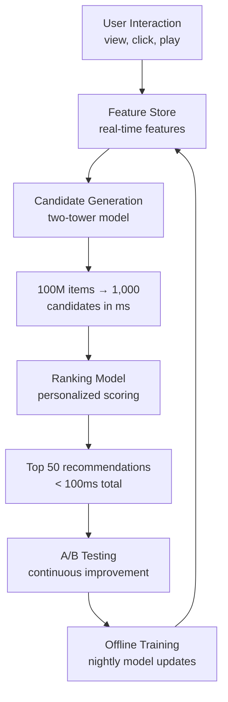
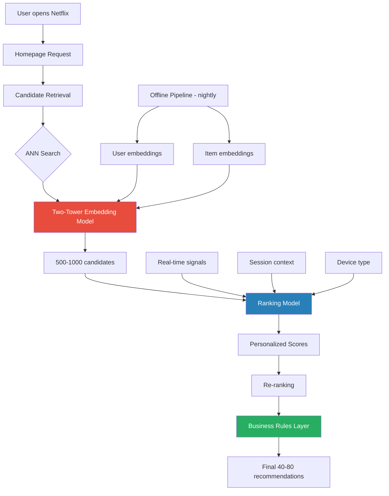
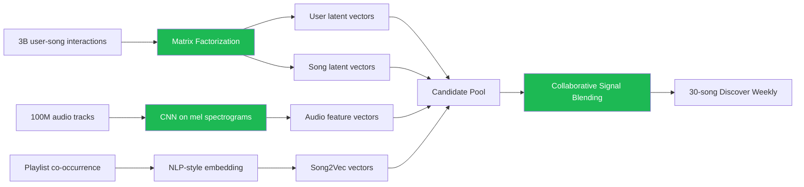
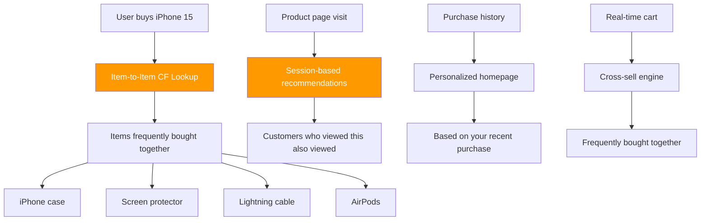

# Recommendation System at Scale — Netflix, Spotify, Amazon

## 🗺️ Quick Overview


*Normal path: user action → feature update → pre-computed candidates → real-time ranking → display. Key challenge: sub-100ms personalization across catalogs of 15K–100M items for 230M–600M users.*

## The Scale Problem

Recommendation systems look deceptively simple — "show the user something they'll like" — but at platform scale, they become one of the hardest engineering problems:

| Platform | Users | Catalog | Recommendations/day |
|----------|-------|---------|---------------------|
| Netflix | 230M+ subscribers (2023) | 15,000+ titles | Billions |
| Spotify | 600M+ users | 100M+ tracks, 100k new songs/day | Trillions |
| Amazon | 300M+ active customers | 350M+ products | Trillions |

**Why is this hard?**

1. **Latency**: Recommendations must return in under 100ms. Running a full ML model over 15,000 Netflix titles or 100M Spotify tracks in real-time is impossible.
2. **Freshness**: User tastes change. Yesterday's data is already stale for music, slightly stale for movies.
3. **Cold start**: New users have no history. New items have no interactions.
4. **Feedback loops**: If you only recommend popular items, popular items get more clicks, which makes them more popular — diversity collapses.
5. **Scale of personalization**: Every one of Netflix's 230M users sees a *different* homepage. That's 230M distinct recommendation sets computed daily.

Netflix famously found that **80% of streams come from recommendations**, not search. Getting recommendations right is a direct revenue driver — not a nice-to-have.

---

## Netflix's Architecture

Netflix's recommendation system evolved from a simple collaborative filter (the subject of their 2009 $1M prize contest) into a multi-layered ML pipeline.

### Core Architecture



### Two-Tower Model

The core of Netflix's retrieval is a **two-tower neural network**:

- **User tower**: takes user features (watch history, ratings, demographics, time of day) → produces a 256-dimensional user embedding vector
- **Item tower**: takes item features (genre, director, cast, synopsis, average rating) → produces a 256-dimensional item embedding vector
- **Similarity**: cosine similarity between user and item vectors

The magic: once you have both towers trained, you pre-compute all item embeddings offline. Then at query time, you only need to:
1. Run the user tower for the current user (~5ms)
2. Find the top-500 closest item vectors using Approximate Nearest Neighbor (ANN) search (~10ms)

This reduces the problem from "score all 15,000 items" to "find nearest neighbors in 256-dimensional space" — which ANN algorithms like FAISS or ScaNN solve in under 10ms even at massive scale.

### Retrieval vs Ranking

Netflix uses a two-stage pipeline:

**Stage 1 — Retrieval (fast, approximate)**
- Goal: reduce 15,000 titles → 500 candidates
- Method: Two-tower ANN search
- Latency target: ~20ms
- Precision: acceptable to miss some good items

**Stage 2 — Ranking (slow, precise)**
- Goal: rank 500 candidates → top 40 for display
- Method: Deep neural network with 100s of features
- Latency target: ~50ms
- Features: user history depth, completion rate for similar titles, time since last watch, current session length

**Stage 3 — Re-ranking (business rules)**
- Diversity enforcement (no 3 thrillers in a row)
- Freshness boost for new releases
- Content licensing rules by region
- Deduplication (same actor twice in top row)

### A/B Testing at Scale

Netflix runs **250+ A/B tests simultaneously**. This is only possible because:

1. **Experiment isolation**: each test has a user bucket (e.g., 0.5% of users)
2. **Metric tracking**: primary metric is usually streaming hours per member, secondary is retention
3. **Statistical rigor**: tests run for at least 2 weeks to account for weekly patterns
4. **Holdback groups**: some users are held out of all experiments as a control baseline

Every homepage layout, every algorithm change, every new feature — all tested via A/B before full rollout.

---

## Spotify's Approach

Spotify's **Discover Weekly** playlist (launched 2015) is their most iconic recommendation product: every Monday, 600M users get a personalized 30-song playlist they've never heard.

### How Discover Weekly Works



### Three Signal Sources

**1. Collaborative Filtering (primary signal)**
- Matrix factorization on 3 billion user-song interaction events
- Interaction events: plays, skips, adds to playlist, saves, shares
- Produces latent vector for each user and each song
- "Users like you also listened to X"

**2. Audio Analysis (cold start + new music)**
- CNNs trained on mel spectrograms (visual representations of audio frequency over time)
- Extracts features: tempo, key, loudness, danceability, acousticness, valence (musical positivity)
- Enables recommendations for songs with zero plays — critical for 100k new songs/day
- "This song sounds like what you play"

**3. Natural Language Processing (context)**
- Crawl music blogs, reviews, playlist titles, social media
- Extract co-occurrence: artists mentioned together in similar contexts
- Word2Vec-style embeddings: artists mentioned in similar contexts get similar vectors
- "This artist is talked about in the same breath as your favorites"

### Cold Start: New User Onboarding

For a new user with no history, Spotify uses **playlist-based onboarding**:
1. Ask users to select 3+ artists they like
2. Find users with similar taste profiles
3. Bootstrap recommendations from those users' listening histories
4. Within 2-3 sessions of listening, collaborative filter has enough signal to take over

### Feedback Signals

| Signal | Type | Weight |
|--------|------|--------|
| Stream completion (>30s) | Implicit positive | High |
| Skip within 5 seconds | Implicit negative | Very High |
| Add to playlist | Explicit positive | Very High |
| Like/heart | Explicit positive | High |
| Replay | Implicit positive | High |
| Share | Explicit positive | Medium |
| Hide song | Explicit negative | Very High |

---

## Amazon's Product Recommendations

Amazon's recommendation engine is one of the oldest and most profitable in the world. Their **item-to-item collaborative filtering** approach (patented in 1998) still powers the core of "Customers who bought X also bought Y."

### Item-to-Item Collaborative Filtering



### Why Item-to-Item (Not User-to-User)?

The original Amazon insight was to flip collaborative filtering from user-similarity to item-similarity:

**User-to-user CF** (naive approach):
- Find users similar to you
- Recommend what they bought
- Problem: with 300M users, computing user similarity is O(N²) — computationally impossible

**Item-to-item CF** (Amazon's innovation):
- Pre-compute which items are frequently bought together
- When user views/buys item X, look up X's similar items table
- This table can be pre-computed offline and stored as a simple lookup
- Real-time query is a single database lookup — O(1)

The item similarity table is updated periodically (not real-time) as purchase data accumulates. This is scalable because you're computing similarity between M items (M << N users).

### Two Recommendation Modes

**1. Session-based (real-time)**
- Based on current browsing session: what you've viewed in the last 30 minutes
- Doesn't require login
- Powered by a real-time event stream (Kinesis) → recommendation service

**2. Personalized (batch + cache)**
- Based on full purchase/browsing history
- Computed nightly in batch
- Cached per user in a low-latency key-value store
- Served at homepage load time

### Revenue Impact

Amazon has publicly stated recommendations drive approximately **35% of total revenue**. This is the business justification for the massive engineering investment.

---

## Shared Patterns Across All Three

Despite different domains (video, music, products), Netflix, Spotify, and Amazon all converge on the same architectural patterns:

### 1. Two-Stage Pipeline (Universal)

Every large-scale recommendation system uses the same fundamental architecture:

```
Millions of items → [Retrieval: ANN] → Hundreds of candidates → [Ranking: ML model] → Top-N results
```

The split is necessary because:
- Running a heavy ML model on all items is too slow (latency)
- A fast ANN lookup on all items loses precision
- Doing both stages captures the best of both worlds

### 2. Offline + Online Split

| Layer | When | What |
|-------|------|------|
| Offline (batch) | Daily/hourly | Train models, compute embeddings, pre-compute item similarities |
| Near-real-time | Minutes | Update feature store with recent events |
| Online (real-time) | Per request | Retrieve candidates, run ranking model, apply business rules |

### 3. Feature Store

All three companies use a **feature store** to manage ML features:

- **Batch features**: computed overnight, stored in a column store (e.g., Hive/BigQuery)
  - User's top genres last 30 days
  - Average completion rate per genre
  - Last 100 interactions
- **Real-time features**: updated as events happen, stored in Redis/DynamoDB
  - Current session items
  - Last 3 streams in this session
  - Current time of day / device

The feature store provides a single source of truth so training and serving use identical feature definitions — avoiding training/serving skew.

### 4. Cold Start Strategy

| Company | New User | New Item |
|---------|----------|----------|
| Netflix | Popularity + genre survey onboarding | Metadata-based similarity + editorial boost |
| Spotify | Artist preference selection + collaborative bootstrap | Audio CNN features (no plays needed) |
| Amazon | Browsing behavior within session | Category/attribute similarity |

### 5. Diversity Enforcement

All three systems actively fight **filter bubble** effects and recommendation staleness:

- **Exploration vs. exploitation**: occasionally recommend outside the comfort zone
- **Artist/creator diversity**: enforce maximum N items from same source
- **Freshness**: boost newer items even if predicted engagement is slightly lower
- **Serendipity score**: penalize items the user would "obviously" like to encourage discovery

---

## Key Architecture Decisions

### Retrieval vs Ranking (Two-Stage Pipeline)

The fundamental insight behind every modern recommendation system is that you cannot afford to score every item with a heavy model at query time.

**The math**: If ranking one item takes 1ms and you have 100,000 items, ranking all items takes 100 seconds. Unacceptable.

**The solution**: two-stage pipeline:

```
Stage 1: Retrieval
- Cheap operation (ANN search, heuristics, simple rules)
- Reduces N=100,000 items → K=500 candidates
- Latency: ~10ms
- Precision: ~70% (acceptable to miss some good items)

Stage 2: Ranking
- Expensive ML model (deep neural network, gradient boosted trees)
- Scores K=500 candidates precisely
- Latency: ~50ms
- Produces final ordered list
```

The retrieval stage often uses multiple sub-retrievers in parallel and merges:
- "User history" retriever: items similar to what you've watched
- "Trending" retriever: globally popular items right now
- "Editorial" retriever: curated picks
- "Serendipity" retriever: random exploration items

### Feature Store Design

A feature store solves the **training-serving skew problem** — the model was trained on features computed one way, but at serving time features are computed differently, leading to degraded predictions.

```
┌─────────────────────────────────────────────────┐
│                  Feature Store                   │
│                                                  │
│  Batch Layer (daily)          Online Layer       │
│  ┌────────────────┐           ┌───────────────┐  │
│  │ user_top_genres│           │ session_items │  │
│  │ watch_history  │           │ current_time  │  │
│  │ completion_rate│           │ device_type   │  │
│  └────────────────┘           └───────────────┘  │
│         ↓                            ↓           │
│  ┌────────────────────────────────────────────┐  │
│  │         Unified Feature Serving API         │  │
│  └────────────────────────────────────────────┘  │
│         ↓                                        │
│  Training pipeline AND serving both use same API │
└─────────────────────────────────────────────────┘
```

**Technology choices**:
- Batch features: Hive, BigQuery, Spark → loaded into Redis or Cassandra
- Real-time features: Kafka → Flink/Spark Streaming → Redis
- Feature registry: tracks feature definitions, versions, lineage

### A/B Testing Infrastructure

Running 250+ simultaneous A/B tests (Netflix) requires sophisticated infrastructure:

**Experiment assignment**:
```
user_bucket = hash(user_id + experiment_id) % 1000
# If user_bucket < 5, user is in experiment group (0.5% of users)
```

**Metric collection**:
- Each user action is tagged with experiment bucket
- Metrics computed per-experiment: streaming hours, retention, clicks
- Statistical significance tested with t-test or Mann-Whitney U

**Key requirement**: experiments must be **orthogonal** — users in one experiment should be randomly distributed across all other experiments. This prevents interaction effects from corrupting results.

---

## Production Trade-offs

| Decision | Option A | Option B | Who Uses What |
|----------|----------|----------|---------------|
| Retrieval method | Matrix factorization | Two-tower neural net | Netflix: two-tower; Spotify: both; Amazon: item-item CF |
| Feature freshness | Batch (hours old) | Real-time (seconds old) | All three use both: batch for history, real-time for session |
| Cold start for new items | No recs until N plays | Content-based similarity | Spotify: audio CNN; Netflix: metadata; Amazon: category |
| Diversity | Pure ML score | Score + diversity constraints | All three enforce diversity rules post-ranking |
| A/B testing scope | Algorithm-level | Presentation-level | Netflix: both; Amazon: heavy presentation testing |
| Model serving | Pre-computed batch | Real-time inference | Retrieval: pre-computed; Ranking: real-time inference |
| Training frequency | Daily retrain | Continuous learning | Most use daily retrain; Spotify uses near-real-time for skip signals |

---

## Lessons Learned

**1. Business rules beat pure ML at the edges.** ML optimizes for predicted engagement, but engagement alone leads to low diversity, filter bubbles, and potentially harmful content amplification. Every mature recommendation system adds a rules layer *after* the ML ranking.

**2. Latency budget drives architecture.** The two-stage pipeline exists purely because of latency constraints. If you had infinite compute, you'd run your best model on all items. But you don't, so you split into a cheap retrieval and an expensive ranking stage.

**3. Offline evaluation metrics don't predict online performance.** Recommendation accuracy on held-out data (precision@K, NDCG) often doesn't correlate with business metrics (streaming hours, revenue). Always A/B test before trusting offline metrics.

**4. Cold start is never fully solved.** Even with audio CNNs (Spotify) or rich metadata (Netflix), new items and new users get worse recommendations. Plan for this explicitly — don't pretend cold start is a solved problem.

**5. Feedback loops are dangerous.** A system that only recommends what users engage with will converge on a narrow set of popular items. Inject exploration, enforce diversity, and monitor for catalog coverage — what percentage of your catalog gets recommended to anyone?

**6. Infrastructure investment compounds.** Netflix's recommendation infrastructure (feature store, A/B testing platform, model serving) took years to build, but every new model they develop benefits from it immediately. Invest in the infrastructure early.

**7. The data matters more than the model.** A simple matrix factorization with excellent data beats a fancy deep learning model with mediocre data. Netflix's 2009 prize contest showed that ensembling many simple models beat individual complex ones — the variety of signal sources was the key insight.
