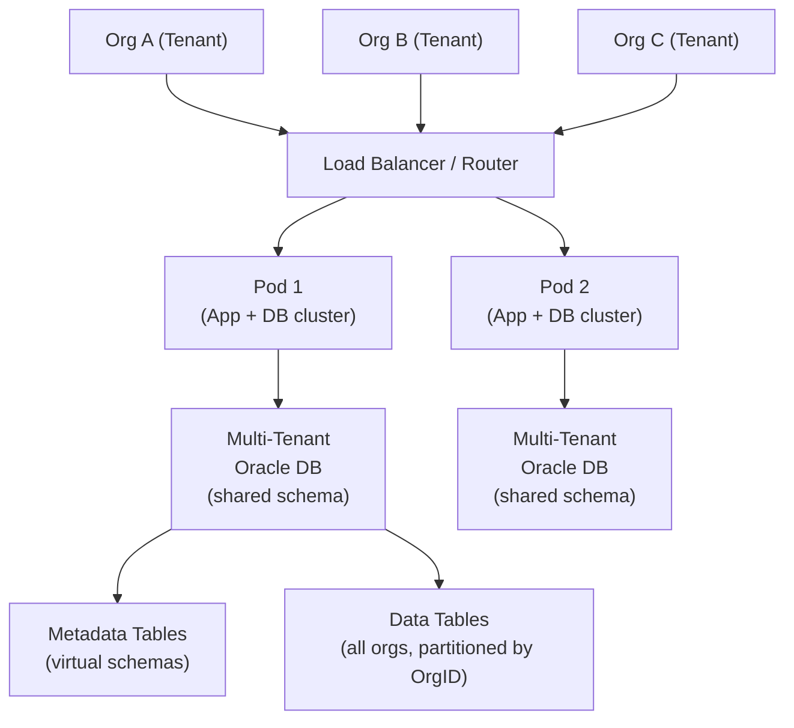

# Salesforce Multi-Tenant SaaS Architecture

**Difficulty**: Advanced
**Time**: 45 minutes
**Companies**: Salesforce, Workday, ServiceNow, HubSpot (Common for senior SaaS platform roles)

## Quick Overview



*Every tenant shares the same database schema. Tenant isolation is enforced via OrgID columns and row-level access checks — not separate databases.*

## 1. Problem Statement

Salesforce launched in 2000 with a radical idea: instead of selling software to install, they would host it for everyone. The challenge they faced:

```
Traditional enterprise software problem:
  - Each customer installs their own copy (SAP, Oracle, Siebel)
  - Customer wants custom fields, custom logic, custom workflows
  - Upgrade requires re-testing all customizations
  - Operations burden: thousands of separate deployments to maintain

Salesforce's goal (2000):
  - One codebase, one database schema, one deployment
  - Serve 150,000+ organizations from a single software version
  - Each org can customize heavily without touching shared code
  - Deploy updates to ALL customers simultaneously, zero downtime
```

The answer was **metadata-driven multi-tenancy**: customization lives in data tables, not in code.

## 2. Architecture

### Pod Architecture

Salesforce divides its infrastructure into "pods" — independent clusters:

```
┌─────────────────────────────────────────────────────────────┐
│                   Salesforce Global Infrastructure           │
│                                                             │
│  ┌──────────────────┐    ┌──────────────────┐               │
│  │     POD NA1      │    │     POD NA2       │  ← North     │
│  │  (North America) │    │  (North America)  │    America   │
│  │                  │    │                   │               │
│  │  App Tier (×N)   │    │  App Tier (×N)    │               │
│  │  DB Cluster      │    │  DB Cluster       │               │
│  │  ~25K orgs       │    │  ~25K orgs        │               │
│  └──────────────────┘    └──────────────────┘               │
│                                                             │
│  ┌──────────────────┐    ┌──────────────────┐               │
│  │     POD EU1      │    │     POD AP1       │  ← EU, APAC  │
│  │   (Europe)       │    │  (Asia Pacific)   │               │
│  └──────────────────┘    └──────────────────┘               │
│                                                             │
│  Router: "Which pod is org acme.salesforce.com on?"         │
│  Answer: Org → Pod mapping stored in central routing table  │
└─────────────────────────────────────────────────────────────┘
```

Each pod contains:
- Multiple application servers (web + API)
- An Oracle RAC database cluster (primary + standbys)
- Local cache (memcache)
- Batch processing infrastructure

### Shared Database, Shared Schema

All tenants in a pod share the same database tables:

```
Traditional SaaS (naive approach):
  Org A → DB: salesforce_org_a (separate database)
  Org B → DB: salesforce_org_b (separate database)
  Problem: 150,000 orgs = 150,000 databases. Impossible to manage.

Salesforce approach: One schema, OrgID everywhere

  Table: Account
  ┌────────────────────────────────────────────────────────┐
  │ OrgID     │ AccountID │ Name          │ Industry  │ ... │
  ├────────────┼───────────┼───────────────┼───────────┤     │
  │ ORG-00001 │ ACC-001   │ Acme Corp     │ Tech      │     │
  │ ORG-00001 │ ACC-002   │ Beta Ltd      │ Finance   │     │
  │ ORG-00002 │ ACC-001   │ Gamma Inc     │ Retail    │     │
  │ ORG-00003 │ ACC-001   │ Delta Corp    │ Healthcare│     │
  └────────────┴───────────┴───────────────┴───────────┴─────┘
                ↑ Every query includes WHERE OrgID = '...'
```

The `OrgID` column is in every table. Every query is always scoped to one org. This is enforced at the query generation layer, never left to application code.

## 3. Metadata-Driven Architecture

### The Key Innovation

Salesforce customers can add custom fields, custom objects, and custom logic — without changing the shared database schema.

```
Standard Salesforce schema: Fixed columns in shared tables
Custom field "Favorite Color" on Account for Org A:

  Without metadata-driven approach:
    ALTER TABLE Account ADD COLUMN custom_favorite_color VARCHAR(50);
    ← Impossible: one schema for all 150,000 orgs

  Salesforce solution: Generic "values" columns + metadata

  Table: Account (shared)
  ┌──────────┬───────────┬──────┬───────┬───────────┬──────────┐
  │ OrgID    │ AccountID │ Name │ Value0│ Value1    │ Value2   │
  ├──────────┼───────────┼──────┼───────┼───────────┼──────────┤
  │ ORG-001  │ ACC-001   │ Acme │ Red   │ Enterprise│ Active   │
  │ ORG-002  │ ACC-002   │ Beta │ NULL  │ SMB       │ Inactive │
  └──────────┴───────────┴──────┴───────┴───────────┴──────────┘

  Table: CustomField (metadata — what does Value0 mean per org?)
  ┌──────────┬────────────────────┬────────┬──────────────┐
  │ OrgID    │ CustomFieldID      │ Column │ Label        │
  ├──────────┼────────────────────┼────────┼──────────────┤
  │ ORG-001  │ CF-001             │ Value0 │ Favorite Color│
  │ ORG-001  │ CF-002             │ Value1 │ Segment      │
  │ ORG-001  │ CF-003             │ Value2 │ Status       │
  └──────────┴────────────────────┴────────┴──────────────┘

  Result: Org A has "Favorite Color" custom field
          Org B doesn't — Value0 is NULL and not shown
          No schema change needed
```

### Custom Objects

Orgs can create entirely new object types:

```
Org A creates "Support Ticket" custom object:
  → Stored in a generic CustomObject table (OrgID + ObjectID + fields)
  → Metadata describes field names, types, relationships
  → Appears in UI as a real object

This is stored as rows in tables, not as new tables.
Salesforce runtime reads metadata to know how to present data.
```

## 4. How Multi-Tenancy Works

### Request Routing

```
User at acme.salesforce.com/s/... sends request:

Step 1: DNS → Load balancer
Step 2: Load balancer looks up OrgID from hostname
  acme.salesforce.com → OrgID = ORG-001 → Pod NA1
Step 3: Route request to Pod NA1's app servers
Step 4: App server resolves user's session → loads OrgID into context
Step 5: All subsequent DB queries automatically include WHERE OrgID = 'ORG-001'
```

### Data Isolation Enforcement

```
Isolation is enforced in the data access layer, not application code:

class QueryBuilder {
  build(sql) {
    // All queries MUST go through this builder
    // OrgID injected automatically
    return sql + ` AND OrgID = '${currentContext.orgId}'`
  }
}

// Developer writes:
SELECT * FROM Account WHERE Name LIKE 'A%'

// Query executed:
SELECT * FROM Account WHERE Name LIKE 'A%' AND OrgID = 'ORG-001'

This prevents data leakage across tenants.
The OrgID injection is non-bypassable at the framework level.
```

### Governor Limits

Because all tenants share resources, Salesforce enforces hard limits:

```
Why governor limits exist:
  One runaway org → degrades experience for all other orgs on the pod
  Noisy neighbor problem solved by enforcement, not isolation

Example limits per transaction:
  SOQL queries executed:      100 per transaction
  Records retrieved by SOQL:  50,000 per transaction
  DML statements:             150 per transaction
  CPU time:                   10,000ms
  Heap size:                  6MB
  API calls per day:          15,000 per licensed user

If any limit is exceeded → TransactionLimitException thrown
Transaction is rolled back, org is not harmed
Other orgs on the pod are protected
```

## 5. Scaling Strategy

### Pod Assignment

```
When a new org signs up:
  1. Salesforce picks the least-loaded pod in the appropriate region
  2. Org is assigned to that pod permanently (or until migration)
  3. Org's data and metadata stored on that pod's DB cluster

Pod capacity:
  ~25,000 orgs per pod (varies by tier)
  Enterprise orgs use more resources → fewer per pod
  Small orgs → more per pod

Scaling out:
  Need more capacity? → Add a new pod
  Don't need to rebalance existing pods
  New customers go to new pods
```

### Caching Layer

```
Multi-tenant caching challenges:
  Cache for Org A must NOT leak to Org B

Salesforce caching:
  Key structure: {OrgID}:{objectType}:{recordID}
  e.g.: "ORG-001:Account:ACC-001"

  Metadata cache (rarely changes):
    - Custom fields definitions → cached aggressively
    - Page layouts, permission sets
    - Invalidated on admin changes

  Data cache (frequently changes):
    - Recently accessed records → memcache
    - Short TTL (~5 minutes)
    - LRU eviction per org namespace
```

### Schema Changes at Scale

```
Challenge: Salesforce deploys updates to ALL pods simultaneously
  Must not break customizations or lose data

Strategy:
  1. No destructive schema changes (never DROP COLUMN or RENAME)
  2. Add new columns → safe (existing code uses old columns)
  3. Use code flags: if (feature.enabled('new_payment_flow'))
  4. Dark launch: deploy code, enable for 1% of orgs first
  5. Canary pod: update Pod NA1, monitor, then roll out to all pods

Migration of per-org metadata:
  When Salesforce adds a system feature (e.g. new field on Account):
  → New column added to Account table
  → Default value backfilled via background job
  → Metadata updated for all orgs
  Background jobs run over days to avoid peak-time load
```

## 6. Handling the Noisy Neighbor Problem

```
Scenario: Org A runs a massive batch import (10M records)
          during peak hours. Other orgs on the pod suffer.

Salesforce mitigations:

1. Governor limits per transaction (described above)
2. Batch Apex runs asynchronously in background queue
   - Not during user-facing request processing
   - Throttled per org: max 5 concurrent async jobs
3. Priority queues: Interactive requests > batch jobs
4. Per-org connection pooling: DB connections reserved per org
5. Org-level query monitoring: Slow queries flagged and killed

For very large enterprise orgs:
  Performance Edition: dedicated pod (single tenant)
  Hyperforce: run on cloud infrastructure (AWS, Azure)
  → Full resource isolation, still same codebase
```

## 7. Tradeoffs

```
STRENGTH: Operational efficiency
  One codebase to maintain, one deployment to update
  150,000 orgs get the same version simultaneously
  No per-customer patching, upgrades, or installations

WEAKNESS: Customization flexibility has limits
  Max ~500 custom fields per object (limited value columns)
  Custom logic runs in Apex sandbox, not arbitrary code
  Can't do things that work in a dedicated DB (no custom indexes on custom fields initially)

STRENGTH: Multi-tenant DB is extremely cost efficient
  Shared Oracle cluster for 25,000 orgs
  vs 25,000 separate DBs (cost would be 100x)

WEAKNESS: Noisy neighbor risk
  Governor limits solve it, but also constrain legitimate workloads
  Large customers feel the limits more → pushed to Performance Edition

TRADEOFF: Generic schema vs specialized schema
  Generic "Value0, Value1..." columns → flexible but slower
  Database can't use normal column statistics for query planning
  Salesforce had to build custom query optimization for this model

STRENGTH: Schema changes are safe and fast
  Adding a column doesn't break any org's customization
  Rollout is instant for all tenants
  No per-customer testing matrix
```

## 8. Interview Talking Points

**Why not just give each customer their own database?**
At 150,000+ orgs, that's 150,000 databases to manage, patch, backup, and monitor. Operational cost is prohibitive. Shared schema means one database cluster per pod, serving 25,000 orgs — 3 orders of magnitude more efficient.

**How does Salesforce prevent one customer from seeing another's data?**
OrgID injection at the data access framework layer. Every query generated by the platform automatically has `AND OrgID = ?` appended. This is non-bypassable — developers never write raw SQL; it goes through the query builder.

**What are governor limits and why do they exist?**
Hard limits on CPU, DB queries, and heap per transaction. Since all tenants share resources on a pod, one unconstrained tenant could degrade everyone else. Governor limits are the only alternative to full resource isolation (which would destroy cost efficiency).

**How do you add a feature for all customers without breaking customizations?**
Feature flags + additive schema changes. Never remove or rename columns. New columns are added with defaults, then backfilled. Code paths are toggled per org. Dark launch on a canary pod before global rollout.

**What is the metadata-driven architecture's biggest limitation?**
Query performance. Generic `Value0, Value1...` columns can't have type-specific indexes. Query optimization is harder because column statistics are meaningless (Value0 means "Color" for one org and "Revenue Tier" for another). Salesforce built a custom statistics system to work around this.

## Key Takeaways

```
1. Shared schema + OrgID column = multi-tenancy at scale
   No separate databases, just strict row-level partitioning

2. Metadata-driven customization: customization is data, not code
   Custom fields, objects, layouts stored as rows in metadata tables
   Schema never changes; behavior changes via metadata

3. Governor limits are the noisy neighbor solution for shared infrastructure
   Hard limits protect all tenants at the cost of constraining individual ones

4. Pod architecture enables horizontal scaling without resharding
   New pods absorb new customers; existing pods remain stable

5. Additive-only schema changes make zero-downtime deploys possible
   Never remove columns; use feature flags for behavioral changes

6. Operational efficiency at scale requires accepting tradeoffs
   Generic columns, limited indexes, rigid customization = necessary compromises
```
