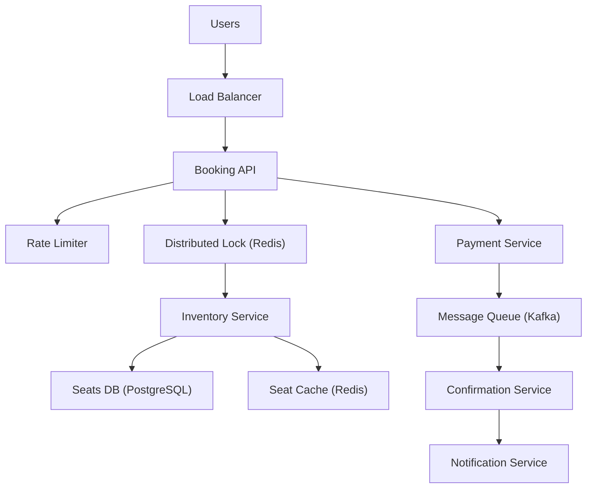

# Design a Ticket Booking System (Ticketmaster / BookMyShow)

**Difficulty**: Intermediate
**Time**: 45 minutes
**Companies**: Amazon, Google, Microsoft, Flipkart (Common - tests concurrency knowledge)

## 🗺️ Quick Overview



*A distributed lock ensures only one booking transaction can hold a seat at a time — the lock is released only after payment confirmation, preventing double-booking under extreme concurrency.*

## 1. Problem Statement

Design a system for booking event tickets (concerts, sports, movies) that handles extreme concurrency — thousands of users competing for the same seats simultaneously.

**Scale reference (Ticketmaster):**

```
Taylor Swift Eras Tour (2022):
  - 14 million users in queue simultaneously
  - 3.5 billion system requests in a single day
  - 2 million tickets sold in 24 hours
  - Ticketmaster crashed and made national news

Normal day:
  - 500 million tickets sold per year
  - 30,000+ events managed
  - Peak: 1 million+ concurrent users during on-sale
```

**The core challenge:**

```
10,000 seats available
100,000 users trying to book at the EXACT same time
(On-sale starts at 10:00 AM sharp)

Requirements:
  - No double-booking (seat sold to exactly one person)
  - No overselling (can't sell 10,001 tickets)
  - Fair ordering (first come, first served)
  - Fast response (< 5 seconds to complete booking)
  - Handle 100K+ concurrent requests without crashing
```

## 2. Requirements

### Functional Requirements
1. Browse events and view seat maps
2. Select and temporarily hold seats
3. Complete purchase within time limit
4. Prevent double-booking of seats
5. Release held seats if purchase not completed
6. Virtual waiting room for high-demand events

### Non-Functional Requirements
1. **Consistent** (no double-booking — most important)
2. **Available** (99.9% during normal, graceful degradation during surge)
3. **Scalable** (100K+ concurrent users per event)
4. **Low latency** (seat selection < 2 seconds)
5. **Fair** (FIFO ordering for seat access)

### Out of Scope
- Payment processing details
- Event creation/management
- Seat pricing algorithms
- Resale marketplace

## 3. The Concurrency Problem

```
Without proper locking:

10:00:00.000  User A: SELECT seat WHERE id = 'A1' → status: AVAILABLE
10:00:00.001  User B: SELECT seat WHERE id = 'A1' → status: AVAILABLE
10:00:00.002  User A: UPDATE seat SET status = 'BOOKED' WHERE id = 'A1' ✅
10:00:00.003  User B: UPDATE seat SET status = 'BOOKED' WHERE id = 'A1' ✅

Result: BOTH users think they booked seat A1!

This is a classic TOCTOU race condition
(Time Of Check To Time Of Use)
```

### Solution 1: Optimistic Locking (Version-Based)

```sql
-- Each seat has a version number
-- Read
SELECT id, status, version FROM seats
  WHERE id = 'A1' AND status = 'AVAILABLE';
-- Returns: { id: 'A1', status: 'AVAILABLE', version: 1 }

-- Book (only succeeds if version hasn't changed)
UPDATE seats
  SET status = 'HELD', holder_id = 'user-123', version = version + 1
  WHERE id = 'A1' AND version = 1 AND status = 'AVAILABLE';

-- Check affected rows:
-- 1 row affected → Success! You got it.
-- 0 rows affected → Someone else got it first. Try another seat.
```

```
Timeline with optimistic locking:

User A: SELECT A1 → version: 1
User B: SELECT A1 → version: 1
User A: UPDATE A1 WHERE version = 1 → ✅ 1 row updated (version → 2)
User B: UPDATE A1 WHERE version = 1 → ❌ 0 rows (version is now 2)
User B: Gets error → "Seat no longer available, try another"

No double booking! ✅
```

### Solution 2: Pessimistic Locking (SELECT FOR UPDATE)

```sql
BEGIN TRANSACTION;

-- Lock the row (other transactions wait here)
SELECT * FROM seats
  WHERE id = 'A1' AND status = 'AVAILABLE'
  FOR UPDATE;

-- If we get here, we have exclusive lock
UPDATE seats
  SET status = 'HELD',
      holder_id = 'user-123',
      hold_expires_at = NOW() + INTERVAL '10 minutes'
  WHERE id = 'A1';

COMMIT;
```

```
Timeline with pessimistic locking:

User A: SELECT FOR UPDATE A1 → ✅ Locked
User B: SELECT FOR UPDATE A1 → ⏳ WAITING (blocked)
User A: UPDATE A1 → HELD → COMMIT → Lock released
User B: SELECT FOR UPDATE A1 → Gets row, but status = HELD
User B: No available seat → return error
```

### Solution 3: Redis Distributed Lock (Best for Scale)

```
Use Redis for seat locking, database for persistence:

async function holdSeat(eventId, seatId, userId) {
  // Try to acquire lock on seat (atomic SET NX)
  const lockKey = `lock:${eventId}:${seatId}`;
  const acquired = await redis.set(
    lockKey,
    userId,
    'NX',          // Only set if not exists
    'EX', 600      // Expire in 10 minutes
  );

  if (!acquired) {
    return { success: false, error: 'SEAT_TAKEN' };
  }

  // Lock acquired! Update database
  await db.seats.update({
    where: { eventId, seatId, status: 'AVAILABLE' },
    data: {
      status: 'HELD',
      holderId: userId,
      holdExpiresAt: new Date(Date.now() + 600_000)
    }
  });

  return { success: true, expiresIn: 600 };
}

// Release seat if purchase not completed
async function releaseSeat(eventId, seatId, userId) {
  const lockKey = `lock:${eventId}:${seatId}`;

  // Only release if we own the lock (Lua script for atomicity)
  const script = `
    if redis.call("get", KEYS[1]) == ARGV[1] then
      return redis.call("del", KEYS[1])
    else
      return 0
    end
  `;
  await redis.eval(script, 1, lockKey, userId);

  await db.seats.update({
    where: { eventId, seatId, holderId: userId },
    data: { status: 'AVAILABLE', holderId: null }
  });
}
```

### Comparison of Approaches

```
Approach           Throughput   Consistency   Complexity
──────────         ──────────   ───────────   ──────────
Optimistic Lock    High         Strong        Low
(version column)   (no waits)   (DB level)    (retry logic)

Pessimistic Lock   Low          Strong        Low
(SELECT FOR        (blocking)   (DB level)    (deadlock risk)
 UPDATE)

Redis Lock         Very High    Strong*       Medium
(SET NX)           (in-memory)  (with Lua)    (expiry mgmt)

* Requires careful handling of Redis failures

Recommendation:
  Low concurrency: Optimistic locking (simple, works)
  High concurrency: Redis lock + database (scalable)
  Maximum safety: Pessimistic lock (strongest guarantee)
```

## 4. Seat Hold and Expiry

```
Two-phase booking:

Phase 1: HOLD (temporary reservation)
  User selects seats → Seats held for 10 minutes
  Timer shown: "Complete purchase in 9:45..."

Phase 2: BOOK (permanent purchase)
  User pays → Seats permanently booked
  If timer expires → Seats released back to available

┌──────────┐ select  ┌──────────┐ pay    ┌──────────┐
│AVAILABLE │────────▶│  HELD    │───────▶│ BOOKED   │
│          │         │(10 min)  │        │(permanent)│
└──────────┘         └────┬─────┘        └──────────┘
      ▲                   │ timer
      │                   │ expires
      └───────────────────┘
        released back

Hold expiry (background job):
  Run every 30 seconds:
  UPDATE seats
    SET status = 'AVAILABLE', holder_id = NULL
    WHERE status = 'HELD'
      AND hold_expires_at < NOW();

  OR: Redis key expiry with notification:
  - Set key with TTL (automatic expiry)
  - Subscribe to Redis keyspace notifications
  - On expiry → update database to release seat
```

## 5. Virtual Waiting Room

```
Problem: 100K users hit "Buy" at 10:00 AM
  Server can only process 1,000 bookings/sec
  Without queue: Server crashes, nobody gets tickets

Solution: Virtual waiting room (queue)

┌──────────────────────────────────────────────────┐
│              Virtual Waiting Room                 │
│                                                  │
│  10:00:00  100,000 users arrive                  │
│                                                  │
│  ┌────────────────────────────────────┐           │
│  │  Queue (FIFO)                     │           │
│  │  Position 1: User-A               │ → Enter   │
│  │  Position 2: User-B               │ → Enter   │
│  │  Position 3: User-C               │ → Enter   │
│  │  ...                              │           │
│  │  Position 1000: User-XY           │ → Wait    │
│  │  ...                              │           │
│  │  Position 100000: User-ZZ         │ → Wait    │
│  └────────────────────────────────────┘           │
│                                                  │
│  Processing rate: 1,000 users/minute              │
│  User-A: "You're next! Proceed to seat selection" │
│  User-ZZ: "Position: 99,000. Est wait: 99 min"  │
│                                                  │
│  Fair: First come, first served                   │
│  Safe: Server never overloaded                    │
│  Transparent: User knows their position           │
└──────────────────────────────────────────────────┘
```

```
Implementation:

// When user arrives at on-sale page
async function joinQueue(eventId, userId) {
  const position = await redis.rpush(
    `queue:${eventId}`,
    JSON.stringify({ userId, joinedAt: Date.now() })
  );

  // Generate unique queue token
  const token = generateToken(userId, eventId);
  await redis.set(`queue-token:${token}`, userId, 'EX', 3600);

  return {
    token,
    position,
    estimatedWait: position * 60 / PROCESSING_RATE // seconds
  };
}

// Background worker: Let users through
async function processQueue(eventId) {
  const BATCH_SIZE = 50; // Let 50 users through at a time

  while (true) {
    const users = await redis.lpop(`queue:${eventId}`, BATCH_SIZE);

    for (const userData of users) {
      const user = JSON.parse(userData);
      // Grant access to seat selection
      await redis.set(
        `access:${eventId}:${user.userId}`,
        'granted',
        'EX', 600  // 10 minutes to select seats
      );
      // Notify user via WebSocket
      await notifyUser(user.userId, 'QUEUE_YOUR_TURN');
    }

    await sleep(1000); // Process batch every second
  }
}

// Seat selection page: Verify queue access
async function verifySeatAccess(eventId, userId) {
  const access = await redis.get(`access:${eventId}:${userId}`);
  if (access !== 'granted') {
    throw new Error('NOT_YOUR_TURN');
  }
}
```

## 6. High-Level Architecture

```
┌──────────────────────────────────────────────────────────────┐
│                         Clients                              │
│  ┌──────────┐   ┌──────────┐   ┌──────────┐                  │
│  │  Mobile  │   │   Web    │   │  Kiosk   │                  │
│  └─────┬────┘   └─────┬────┘   └─────┬────┘                  │
└────────┼──────────────┼──────────────┼────────────────────────┘
         │              │              │
┌────────▼──────────────▼──────────────▼────────────────────────┐
│                    CDN + WAF + Rate Limiter                   │
│               (Block bots, serve static assets)               │
└──────────────────────────┬───────────────────────────────────┘
                           │
┌──────────────────────────▼───────────────────────────────────┐
│                    Waiting Room Service                       │
│            (Queue management, position tracking)              │
└──────────────────────────┬───────────────────────────────────┘
                           │ (when user's turn arrives)
┌──────────────────────────▼───────────────────────────────────┐
│                     API Gateway                              │
└────────┬──────────┬──────────┬──────────┬────────────────────┘
         │          │          │          │
    ┌────▼────┐ ┌───▼───┐ ┌───▼────┐ ┌───▼────┐
    │ Event   │ │ Seat  │ │Booking │ │Payment │
    │ Service │ │Service│ │Service │ │Service │
    └────┬────┘ └───┬───┘ └───┬────┘ └───┬────┘
         │          │         │           │
    ┌────▼──────────▼─────────▼───────────▼─────┐
    │              Redis Cluster                 │
    │  Seat locks, queue, session, inventory     │
    └────────────────────┬──────────────────────┘
                         │
    ┌────────────────────▼──────────────────────┐
    │           PostgreSQL (Primary)             │
    │   Events, Seats, Bookings, Users          │
    │   + Read Replicas for browsing            │
    └───────────────────────────────────────────┘
```

## 7. Inventory Management

```
Problem: 10,000 seats, need instant count of available

Approach 1: Count from database (slow)
  SELECT COUNT(*) FROM seats
    WHERE event_id = 'E1' AND status = 'AVAILABLE';
  → Scans thousands of rows, slow under load

Approach 2: Redis counter (fast)
  Key: inventory:{event_id}:{section}
  Value: available count

  # Initialize
  SET inventory:E1:VIP 100
  SET inventory:E1:GA 5000

  # Atomic decrement when seat held
  DECR inventory:E1:VIP  → Returns 99 (or -1 if oversold)

  # If result < 0: Sold out! Increment back.
  if (remaining < 0) {
    INCR inventory:E1:VIP  // Undo
    return 'SOLD_OUT';
  }

  # Atomic increment when hold expires
  INCR inventory:E1:VIP  → Returns 100

Benefits:
  - O(1) check if tickets available
  - Atomic, no race conditions
  - Can show real-time count on event page
```

## 8. Handling Failures

### Payment Fails After Seat Hold

```
User holds seat → Payment fails → What happens?

Timeline:
  t=0:   Hold seat A1 (10 min timer starts)
  t=30s: Payment attempt → DECLINED
  t=31s: Release seat A1 immediately (don't wait 10 min)

Code:
async function processBooking(eventId, seatId, userId, paymentInfo) {
  try {
    // Verify hold still valid
    const hold = await verifyHold(eventId, seatId, userId);
    if (!hold) throw new Error('HOLD_EXPIRED');

    // Process payment
    const payment = await paymentService.charge(paymentInfo);

    // Payment successful → Confirm booking
    await confirmBooking(eventId, seatId, userId, payment.id);
    return { success: true, bookingId: booking.id };

  } catch (error) {
    // Payment failed or hold expired → Release seat
    await releaseSeat(eventId, seatId, userId);
    return { success: false, error: error.message };
  }
}
```

### System Crash During Booking

```
What if server crashes between "seat held" and "payment charged"?

Recovery process (on startup):
  1. Find all HELD seats where hold has expired
  2. Check payment service: Was payment actually charged?
  3. If paid → Confirm booking (complete the flow)
  4. If not paid → Release seat

This is the Saga pattern:
  Hold seat → Charge payment → Confirm booking
  If any step fails → Compensate (release seat, refund)
```

## 9. Bot Protection

```
Ticket scalpers use bots to buy tickets faster than humans

Protection layers:

1. CAPTCHA at queue entry
   Solve challenge before entering waiting room
   Stops basic bots

2. Rate limiting
   Max 1 request per second per IP
   Max 6 seats per account

3. Browser fingerprinting
   Detect headless browsers (Puppeteer, Selenium)
   Check for human-like mouse movements

4. Queue randomization window
   Instead of pure FIFO, randomize position within
   a 30-second window (reduces advantage of faster bots)

5. Account verification
   Require verified phone number
   Require account created > 24 hours before on-sale

6. Purchase limits
   Max 4 tickets per account per event
   Link to verified identity for high-demand events
```

## 10. Key Takeaways

```
1. Concurrency control is the #1 design challenge
   Optimistic locking for low contention
   Redis locks for high concurrency
   No double-booking is non-negotiable

2. Two-phase booking: Hold → Pay → Confirm
   10-minute hold timer prevents seat hoarding
   Automatic release on timeout or payment failure

3. Virtual waiting room prevents server overload
   Queue users, process at sustainable rate
   Show position and estimated wait time

4. Redis for real-time inventory
   Atomic DECR/INCR for available count
   No database scanning under load

5. Bot protection is essential
   CAPTCHA, rate limiting, fingerprinting
   Purchase limits per account

6. Design for the "10:00 AM spike"
   Traffic goes from 0 to 100K in one second
   CDN, queue, and rate limiting absorb the spike

7. Saga pattern for distributed transactions
   Hold → Pay → Book (with compensating actions)
   Handle crashes and partial failures gracefully
```
