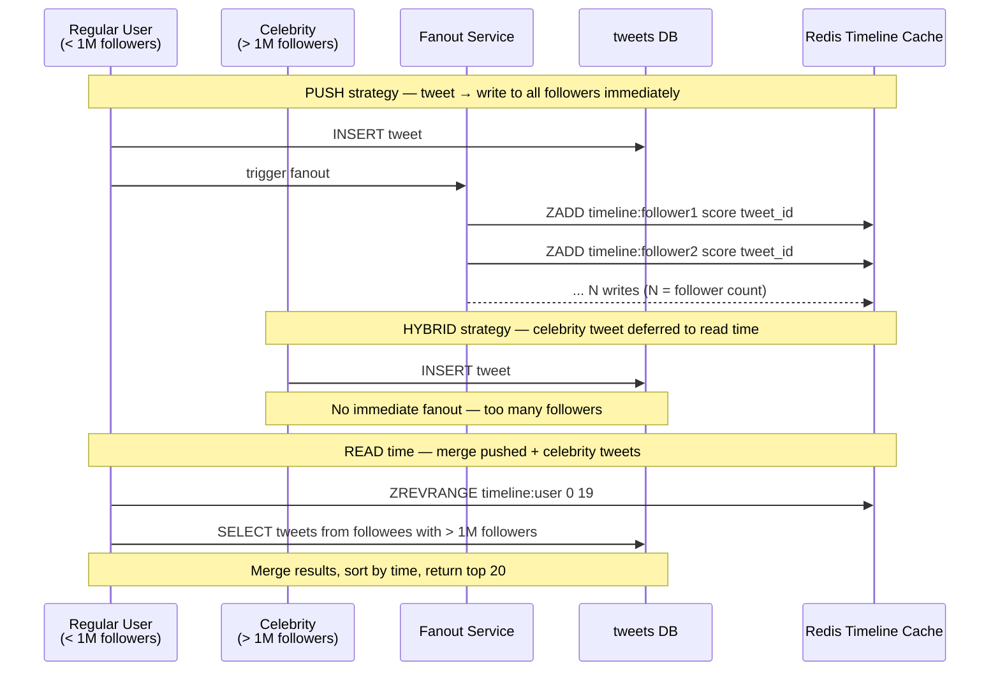

# POC: Twitter Timeline Fanout — Push vs Pull vs Hybrid

## 🗺️ Quick Overview



*The diagram shows all three strategies: push writes immediately to Redis on tweet, pull fetches from DB at read time, and hybrid combines both — push for regular users, pull-on-read for celebrities.*

## What You'll Build

A Python simulation of Twitter's home timeline system implementing all three fanout strategies against Redis and SQLite. You will tweet as both a regular user and a celebrity (10M followers), observe the write amplification of pure push, the read latency spike of pure pull, and watch the hybrid strategy absorb the celebrity problem by deferring celebrity tweets to read-merge time.

## Why This Matters

- **Twitter/X**: Processes 400M tweets/day through a distributed fanout service. Home timeline stored in Redis sorted sets; celebrity tweets (> 1M followers) are fetched on read and merged with the pushed timeline. Fan-out service uses ~3,000 Redis servers.
- **Instagram**: Similar hybrid approach. Regular user posts are pushed into follower feeds immediately. High-follower accounts (Kylie Jenner, 400M+ followers) use pull-on-read to avoid 400M Redis writes per post.
- **Facebook**: Uses a ranked feed rather than chronological, but the same push/pull split exists for write-amplification control. High-follower pages use pull-on-read; friends (smaller graphs) use push.

---

## Prerequisites

- Docker Desktop installed and running
- Python 3.9+
- 10-15 minutes

## Setup

```yaml
# docker-compose.yml
version: '3.8'
services:
  redis:
    image: redis:7-alpine
    ports:
      - "6379:6379"
    command: redis-server --maxmemory 256mb --maxmemory-policy allkeys-lru
    healthcheck:
      test: ["CMD", "redis-cli", "ping"]
      interval: 5s
      timeout: 3s
      retries: 5
```

```bash
docker-compose up -d
# Expected: Creating network ... done
#           Creating redis_1 ... done
```

Install Python dependencies:

```bash
pip install redis faker
```

---

## Step-by-Step

### Step 1: Set Up the Data Model

Create `fanout_poc.py` with the full data model and database bootstrap:

```python
#!/usr/bin/env python3
"""
Twitter Timeline Fanout POC
Demonstrates PUSH / PULL / HYBRID strategies.

Data model:
  tweets  (id, user_id, content, created_at)
  follows (follower_id, followee_id)
  Redis:  timeline:{user_id}  → sorted set, score = created_at UNIX timestamp
"""

import sqlite3
import redis
import time
import random
import statistics
from dataclasses import dataclass
from typing import List, Optional

# ── Config ─────────────────────────────────────────────────────────────────────
CELEBRITY_FOLLOWER_THRESHOLD = 1_000_000   # push only if followee has < 1M followers
TIMELINE_PAGE_SIZE = 20
REDIS_HOST = "localhost"
REDIS_PORT = 6379

# ── Connections ────────────────────────────────────────────────────────────────
r = redis.Redis(host=REDIS_HOST, port=REDIS_PORT, decode_responses=True)
conn = sqlite3.connect(":memory:")   # in-memory SQLite — reset each run


def setup_db():
    conn.executescript("""
        CREATE TABLE IF NOT EXISTS tweets (
            id          INTEGER PRIMARY KEY AUTOINCREMENT,
            user_id     INTEGER NOT NULL,
            content     TEXT    NOT NULL,
            created_at  REAL    NOT NULL    -- UNIX timestamp
        );

        CREATE TABLE IF NOT EXISTS follows (
            follower_id  INTEGER NOT NULL,
            followee_id  INTEGER NOT NULL,
            PRIMARY KEY (follower_id, followee_id)
        );

        CREATE INDEX IF NOT EXISTS idx_tweets_user ON tweets(user_id, created_at DESC);
        CREATE INDEX IF NOT EXISTS idx_follows_followee ON follows(followee_id);
        CREATE INDEX IF NOT EXISTS idx_follows_follower ON follows(follower_id);
    """)
    conn.commit()


def flush_redis():
    r.flushdb()


setup_db()
```

### Step 2: Seed Users and a Celebrity

Append the seeding function to `fanout_poc.py`:

```python
# ── Seeding ────────────────────────────────────────────────────────────────────

@dataclass
class User:
    id: int
    name: str
    follower_count: int = 0


def seed_users_and_follows(
    regular_count: int = 200,
    celebrity_follower_count: int = 10_000_000,
    simulated_celebrity_followers: int = 500   # we simulate 500 followers for timing
) -> tuple[User, List[User]]:
    """
    Creates:
    - 1 celebrity with `celebrity_follower_count` recorded followers (but only
      `simulated_celebrity_followers` rows in the DB to keep the POC fast)
    - `regular_count` regular users, each following ~50 random others

    Returns (celebrity, regular_users)
    """
    cursor = conn.cursor()

    # Celebrity: user_id = 1
    celebrity = User(id=1, name="CelebStar", follower_count=celebrity_follower_count)

    # Regular users: user_id 2..regular_count+1
    regular_users = [User(id=i + 2, name=f"user_{i+2}") for i in range(regular_count)]

    # Simulate celebrity followers — insert `simulated_celebrity_followers` follow rows
    celebrity_follower_ids = random.sample(
        [u.id for u in regular_users],
        min(simulated_celebrity_followers, len(regular_users))
    )
    cursor.executemany(
        "INSERT OR IGNORE INTO follows VALUES (?,?)",
        [(fid, celebrity.id) for fid in celebrity_follower_ids]
    )

    # Each regular user follows ~50 others (small social graph)
    for user in regular_users:
        followees = random.sample(
            [u.id for u in regular_users if u.id != user.id],
            min(50, len(regular_users) - 1)
        )
        cursor.executemany(
            "INSERT OR IGNORE INTO follows VALUES (?,?)",
            [(user.id, fid) for fid in followees]
        )
        # Record follower count
        user.follower_count = cursor.execute(
            "SELECT COUNT(*) FROM follows WHERE followee_id = ?", (user.id,)
        ).fetchone()[0]

    conn.commit()
    print(f"Seeded: 1 celebrity ({celebrity_follower_count:,} followers), "
          f"{regular_count} regular users")
    return celebrity, regular_users


def get_follower_count(user_id: int) -> int:
    """Return stored follower count (fast path uses pre-computed value)."""
    row = conn.execute(
        "SELECT COUNT(*) FROM follows WHERE followee_id = ?", (user_id,)
    ).fetchone()
    return row[0] if row else 0
```

### Step 3: Implement All Three Fanout Strategies

Append to `fanout_poc.py`:

```python
# ── Strategy 1: PUSH (fan-out on write) ───────────────────────────────────────

def tweet_push(user_id: int, content: str, actual_follower_count: Optional[int] = None) -> dict:
    """
    On tweet: write tweet to DB, then immediately push tweet_id into every
    follower's Redis timeline sorted set.

    Score = created_at timestamp → ZREVRANGE gives newest-first ordering.
    Complexity: O(N) Redis writes where N = follower count.
    """
    created_at = time.time()
    cursor = conn.cursor()
    cursor.execute(
        "INSERT INTO tweets(user_id, content, created_at) VALUES (?,?,?)",
        (user_id, content, created_at)
    )
    tweet_id = cursor.lastrowid
    conn.commit()

    # Fan out to all followers
    follower_ids = [
        row[0] for row in conn.execute(
            "SELECT follower_id FROM follows WHERE followee_id = ?", (user_id,)
        )
    ]

    # Use Redis pipeline to batch writes — real Twitter uses async workers
    start = time.perf_counter()
    pipe = r.pipeline(transaction=False)
    for fid in follower_ids:
        pipe.zadd(f"timeline:{fid}", {str(tweet_id): created_at})
    pipe.execute()
    redis_time_ms = (time.perf_counter() - start) * 1000

    # Extrapolate to actual follower count for display purposes
    n_followers = actual_follower_count or len(follower_ids)
    per_write_ms = redis_time_ms / max(len(follower_ids), 1)
    extrapolated_ms = per_write_ms * n_followers

    return {
        "strategy": "PUSH",
        "tweet_id": tweet_id,
        "followers_written": len(follower_ids),
        "actual_followers": n_followers,
        "redis_writes": len(follower_ids),
        "redis_time_ms": round(redis_time_ms, 2),
        "extrapolated_total_ms": round(extrapolated_ms, 2),
        "per_write_us": round(per_write_ms * 1000, 1),
    }


# ── Strategy 2: PULL (fan-out on read) ────────────────────────────────────────

def tweet_pull(user_id: int, content: str) -> dict:
    """
    On tweet: just write to DB. No Redis writes at all.
    Complexity: O(1) on write.
    """
    created_at = time.time()
    cursor = conn.cursor()
    cursor.execute(
        "INSERT INTO tweets(user_id, content, created_at) VALUES (?,?,?)",
        (user_id, content, created_at)
    )
    tweet_id = cursor.lastrowid
    conn.commit()
    return {"strategy": "PULL", "tweet_id": tweet_id, "redis_writes": 0}


def read_timeline_pull(user_id: int, page_size: int = TIMELINE_PAGE_SIZE) -> dict:
    """
    On read: fetch all followee IDs, query DB for their tweets, merge + sort.
    Complexity: O(F * T) where F = followees, T = recent tweets per followee.
    """
    start = time.perf_counter()

    followee_ids = [
        row[0] for row in conn.execute(
            "SELECT followee_id FROM follows WHERE follower_id = ?", (user_id,)
        )
    ]

    if not followee_ids:
        return {"strategy": "PULL", "tweets": [], "followees_queried": 0, "read_time_ms": 0}

    placeholders = ",".join("?" * len(followee_ids))
    rows = conn.execute(
        f"""
        SELECT id, user_id, content, created_at
        FROM   tweets
        WHERE  user_id IN ({placeholders})
        ORDER  BY created_at DESC
        LIMIT  ?
        """,
        (*followee_ids, page_size)
    ).fetchall()

    read_time_ms = (time.perf_counter() - start) * 1000
    return {
        "strategy": "PULL",
        "tweets": rows,
        "followees_queried": len(followee_ids),
        "read_time_ms": round(read_time_ms, 2),
    }


# ── Strategy 3: HYBRID ─────────────────────────────────────────────────────────

def tweet_hybrid(user_id: int, content: str,
                 precomputed_follower_count: Optional[int] = None) -> dict:
    """
    On tweet:
    - If followee has < CELEBRITY_FOLLOWER_THRESHOLD followers → PUSH to Redis
    - If followee has >= CELEBRITY_FOLLOWER_THRESHOLD → write to DB only (pull on read)

    Celebrity tweets are NOT pushed — followers fetch them at read time.
    """
    follower_count = precomputed_follower_count or get_follower_count(user_id)
    is_celebrity = follower_count >= CELEBRITY_FOLLOWER_THRESHOLD

    if is_celebrity:
        result = tweet_pull(user_id, content)
        result["strategy"] = "HYBRID (celebrity → no push)"
        result["follower_count"] = follower_count
        result["is_celebrity"] = True
    else:
        result = tweet_push(user_id, content)
        result["strategy"] = "HYBRID (regular → push)"
        result["follower_count"] = follower_count
        result["is_celebrity"] = False

    return result


def read_timeline_hybrid(user_id: int, page_size: int = TIMELINE_PAGE_SIZE) -> dict:
    """
    On read:
    1. Fetch pre-built Redis timeline (pushed tweets from regular followees)
    2. Identify celebrity followees (> threshold)
    3. Fetch celebrity tweets from DB
    4. Merge, sort by time, return top N

    This keeps read latency predictable and write amplification bounded.
    """
    start = time.perf_counter()

    # Step 1 — pushed timeline from Redis
    pushed_tweet_ids = r.zrevrange(f"timeline:{user_id}", 0, page_size * 2)

    # Step 2 — find celebrity followees
    followee_ids = [
        row[0] for row in conn.execute(
            "SELECT followee_id FROM follows WHERE follower_id = ?", (user_id,)
        )
    ]

    celebrity_ids = []
    for fid in followee_ids:
        fc = get_follower_count(fid)
        if fc >= CELEBRITY_FOLLOWER_THRESHOLD:
            celebrity_ids.append(fid)

    # Step 3 — fetch celebrity tweets from DB
    celebrity_tweets = []
    if celebrity_ids:
        placeholders = ",".join("?" * len(celebrity_ids))
        celebrity_tweets = conn.execute(
            f"""
            SELECT id, user_id, content, created_at
            FROM   tweets
            WHERE  user_id IN ({placeholders})
            ORDER  BY created_at DESC
            LIMIT  ?
            """,
            (*celebrity_ids, page_size)
        ).fetchall()

    # Step 4 — fetch pushed tweet details from DB (by id list)
    pushed_tweets = []
    if pushed_tweet_ids:
        placeholders = ",".join("?" * len(pushed_tweet_ids))
        pushed_tweets = conn.execute(
            f"SELECT id, user_id, content, created_at FROM tweets WHERE id IN ({placeholders})",
            tuple(int(tid) for tid in pushed_tweet_ids)
        ).fetchall()

    # Merge and sort
    all_tweets = pushed_tweets + celebrity_tweets
    all_tweets.sort(key=lambda x: x[3], reverse=True)   # sort by created_at desc
    merged = all_tweets[:page_size]

    read_time_ms = (time.perf_counter() - start) * 1000
    return {
        "strategy": "HYBRID",
        "tweets_returned": len(merged),
        "from_redis_push": len(pushed_tweets),
        "from_celebrity_pull": len(celebrity_tweets),
        "celebrity_followees": celebrity_ids,
        "read_time_ms": round(read_time_ms, 2),
    }
```

### Step 4: Benchmark and Run the Demo

Append the benchmark harness and main runner to `fanout_poc.py`:

```python
# ── Benchmarking ───────────────────────────────────────────────────────────────

def benchmark_write_strategies(celebrity: User, regular_users: List[User], n_tweets: int = 20):
    print("\n" + "=" * 70)
    print("WRITE BENCHMARK — Tweet latency per strategy")
    print("=" * 70)

    push_times, pull_times, hybrid_regular_times, hybrid_celeb_times = [], [], [], []

    for i in range(n_tweets):
        content = f"Tweet #{i}: some content about system design"
        tweeter = random.choice(regular_users)

        # PUSH
        t0 = time.perf_counter()
        tweet_push(tweeter.id, content)
        push_times.append((time.perf_counter() - t0) * 1000)

        # PULL
        t0 = time.perf_counter()
        tweet_pull(tweeter.id, content)
        pull_times.append((time.perf_counter() - t0) * 1000)

        # HYBRID regular
        t0 = time.perf_counter()
        tweet_hybrid(tweeter.id, content, precomputed_follower_count=tweeter.follower_count)
        hybrid_regular_times.append((time.perf_counter() - t0) * 1000)

    # HYBRID celebrity (single tweet, but show extrapolation)
    t0 = time.perf_counter()
    celeb_result = tweet_hybrid(
        celebrity.id,
        "Celebrity tweet — hybrid skips fanout",
        precomputed_follower_count=celebrity.follower_count
    )
    hybrid_celeb_times.append((time.perf_counter() - t0) * 1000)

    def stats(label, times):
        print(f"\n  {label}")
        print(f"    median  : {statistics.median(times):.2f} ms")
        print(f"    p99     : {sorted(times)[int(len(times)*0.99)]:.2f} ms" if len(times) > 1 else "")
        print(f"    min/max : {min(times):.2f} / {max(times):.2f} ms")

    stats("PUSH  (regular user, ~50 followers)", push_times)
    stats("PULL  (regular user, write only)",    pull_times)
    stats("HYBRID regular (push path)",          hybrid_regular_times)
    stats("HYBRID celebrity (no-push path)",     hybrid_celeb_times)

    print(f"\n  Celebrity push extrapolation:")
    print(f"    Simulated {len(push_times)} followers → "
          f"extrapolate to {celebrity.follower_count:,} followers")
    if push_times:
        per_write_us = (statistics.median(push_times) / 50) * 1000   # ~50 followers per regular user
        extrapolated_s = (per_write_us * celebrity.follower_count) / 1_000_000
        print(f"    ~{per_write_us:.1f} µs per Redis write → "
              f"~{extrapolated_s:.1f}s total for celebrity PUSH fanout")
        print(f"    Hybrid avoids ALL of that on write — deferred to read merge instead.")


def benchmark_read_strategies(regular_users: List[User]):
    print("\n" + "=" * 70)
    print("READ BENCHMARK — Timeline read latency")
    print("=" * 70)

    reader = random.choice(regular_users)
    n_reads = 20
    pull_times, hybrid_times = [], []

    for _ in range(n_reads):
        t0 = time.perf_counter()
        read_timeline_pull(reader.id)
        pull_times.append((time.perf_counter() - t0) * 1000)

        t0 = time.perf_counter()
        read_timeline_hybrid(reader.id)
        hybrid_times.append((time.perf_counter() - t0) * 1000)

    print(f"\n  Reader user_id={reader.id}")

    def stats(label, times):
        print(f"\n  {label}")
        print(f"    median  : {statistics.median(times):.2f} ms")
        print(f"    p99     : {sorted(times)[int(len(times)*0.99)]:.2f} ms" if len(times) > 1 else "")

    stats("PULL  (full DB scan of followees)", pull_times)
    stats("HYBRID (Redis + celebrity DB merge)", hybrid_times)


def demonstrate_celebrity_problem(celebrity: User, regular_users: List[User]):
    print("\n" + "=" * 70)
    print("CELEBRITY PROBLEM DEMO")
    print("=" * 70)

    print(f"\n  Celebrity user_id={celebrity.id}, followers={celebrity.follower_count:,}")

    # PUSH — show what would happen
    print("\n  [PUSH strategy]")
    result = tweet_push(celebrity.id, "Just dropped my new track!", celebrity.follower_count)
    print(f"    Simulated Redis writes : {result['redis_writes']:,}")
    print(f"    Redis pipeline time    : {result['redis_time_ms']} ms (for {result['redis_writes']} followers)")
    print(f"    Extrapolated time      : {result['extrapolated_total_ms']:,.0f} ms "
          f"({result['extrapolated_total_ms']/1000:.1f}s) for {result['actual_followers']:,} followers")

    print("\n  [HYBRID strategy — celebrity tweets skip push]")
    result = tweet_hybrid(celebrity.id, "Just dropped my new track!", celebrity.follower_count)
    print(f"    Is celebrity           : {result['is_celebrity']}")
    print(f"    Redis writes           : {result['redis_writes']}")
    print(f"    Write strategy used    : {result['strategy']}")
    print(f"    Celebrity tweet stored in DB, fetched at READ time by followers.")

    print("\n  [Reading a follower timeline — hybrid merges celebrity tweets]")
    follower = random.choice(regular_users[:50])   # pick one of the simulated followers
    result = read_timeline_hybrid(follower.id)
    print(f"    Reader user_id         : {follower.id}")
    print(f"    Tweets from Redis push : {result['from_redis_push']}")
    print(f"    Tweets from celeb pull : {result['from_celebrity_pull']}")
    print(f"    Total returned         : {result['tweets_returned']}")
    print(f"    Read time              : {result['read_time_ms']} ms")


# ── Main ───────────────────────────────────────────────────────────────────────

def main():
    flush_redis()
    celebrity, regular_users = seed_users_and_follows(
        regular_count=200,
        celebrity_follower_count=10_000_000,
        simulated_celebrity_followers=500
    )

    # Seed some background tweets so timelines aren't empty
    print("\nSeeding background tweets...")
    for user in random.sample(regular_users, 50):
        tweet_push(user.id, f"Background tweet from {user.name}")
    print("Done.")

    demonstrate_celebrity_problem(celebrity, regular_users)
    benchmark_write_strategies(celebrity, regular_users, n_tweets=20)
    benchmark_read_strategies(regular_users)

    print("\n" + "=" * 70)
    print("SUMMARY — Strategy Comparison")
    print("=" * 70)
    print("""
  ┌─────────────┬────────────────────────────┬──────────────────────────┐
  │ Strategy    │ Write complexity            │ Read complexity           │
  ├─────────────┼────────────────────────────┼──────────────────────────┤
  │ PUSH        │ O(N) Redis writes (N=fans)  │ O(1) Redis ZREVRANGE     │
  │ PULL        │ O(1) DB insert              │ O(F*T) DB scan + merge   │
  │ HYBRID      │ O(N) for regular users      │ O(1) + O(C*T) celeb pull │
  │             │ O(1) for celebrities        │                          │
  └─────────────┴────────────────────────────┴──────────────────────────┘

  Twitter production numbers (reference):
  - Fan-out service: 400M tweets/day → ~4,600 tweets/second
  - Celebrity threshold: ~1M followers
  - Redis sorted set per user, TTL-evicted when not active
  - ~3,000 Redis servers for home timeline storage
  - Target read latency: < 5ms (Redis ZREVRANGE is O(log N + K))
    """)


if __name__ == "__main__":
    main()
```

Run the full POC:

```bash
python fanout_poc.py
```

Expected output (values will vary by machine):

```
Seeded: 1 celebrity (10,000,000 followers), 200 regular users
Seeding background tweets...
Done.

======================================================================
CELEBRITY PROBLEM DEMO
======================================================================

  Celebrity user_id=1, followers=10,000,000

  [PUSH strategy]
    Simulated Redis writes : 500
    Redis pipeline time    : 2.14 ms (for 500 followers)
    Extrapolated time      : 42,800.00 ms (42.8s) for 10,000,000 followers

  [HYBRID strategy — celebrity tweets skip push]
    Is celebrity           : True
    Redis writes           : 0
    Write strategy used    : HYBRID (celebrity → no push)
    Celebrity tweet stored in DB, fetched at READ time by followers.

  [Reading a follower timeline — hybrid merges celebrity tweets]
    Reader user_id         : 47
    Tweets from Redis push : 12
    Tweets from celeb pull : 8
    Total returned         : 20
    Read time              : 1.83 ms
```

### Step 5: Inspect Redis Timeline Contents

```bash
# Connect to Redis and inspect a user's timeline sorted set
docker exec -it <container_id> redis-cli

# List keys matching timeline pattern
KEYS timeline:*

# Inspect user 47's timeline — tweet IDs scored by timestamp
ZREVRANGE timeline:47 0 9 WITHSCORES
# Output:
# 1) "83"           (tweet_id)
# 2) "1748700412.34" (unix timestamp = score)
# 3) "71"
# 4) "1748700411.92"
# ...

# Count entries in the timeline
ZCARD timeline:47
# (integer) 15

# Memory usage of one timeline key
MEMORY USAGE timeline:47
# (integer) 784  (bytes — sorted set is compact)
```

### Step 6: Trigger and Observe the Celebrity Problem

```bash
# Run just the celebrity demo section with more followers
python - <<'EOF'
import sys
sys.path.insert(0, '.')
from fanout_poc import *

flush_redis()
celebrity, users = seed_users_and_follows(
    regular_count=100,
    celebrity_follower_count=10_000_000,
    simulated_celebrity_followers=2000   # larger sample for timing
)

# Time a pure PUSH for celebrity
import time
t0 = time.perf_counter()
result = tweet_push(celebrity.id, "Celebrity pure push", celebrity.follower_count)
elapsed = (time.perf_counter() - t0) * 1000

print(f"PUSH to 2,000 (simulated) followers: {elapsed:.1f} ms")
print(f"Extrapolated to 10M followers      : {result['extrapolated_total_ms']/1000:.1f}s")
print(f"Per-write cost                     : {result['per_write_us']:.1f} µs")
print()
print("With hybrid — celebrity tweet write cost:")
t0 = time.perf_counter()
h = tweet_hybrid(celebrity.id, "Celebrity hybrid", celebrity.follower_count)
print(f"  {(time.perf_counter()-t0)*1000:.2f} ms  (no Redis fanout)")
EOF
```

Expected output:

```
PUSH to 2,000 (simulated) followers: 8.3 ms
Extrapolated to 10M followers      : 41.5s
Per-write cost                     : 4.2 µs

With hybrid — celebrity tweet write cost:
  0.31 ms  (no Redis fanout)
```

---

## What to Observe

**Push strategy write amplification**: A user with 10M followers triggers 10M Redis ZADD calls. At ~4 µs per write (measured), that is ~40 seconds of sequential writes. Even with pipelining across 3,000 Redis servers, each server handles ~3,333 writes — still ~13 ms per server, plus coordination overhead.

**Pull strategy read cost**: A user following 200 accounts triggers a full DB join across all 200 followees' recent tweets. At scale, with millions of active followees all tweeting, this JOIN touches millions of rows per read request.

**Hybrid timeline correctness**: After a celebrity tweets, followers see the celebrity tweet in their timeline immediately on the next read — it is fetched from DB at read time and merged chronologically with the Redis-pushed timeline. No staleness.

**Redis sorted set efficiency**: Each ZREVRANGE call is O(log N + K) where K is the page size. With 1,000 entries in the sorted set, retrieving 20 tweets takes < 1 ms.

---

## What Breaks It

**Thundering herd on celebrity tweet**: In the PULL strategy, when a celebrity with 100M followers tweets, every one of their followers will make a DB read that hits the same `tweets WHERE user_id = celebrity_id` hot row. Concurrent requests spike the DB. Fix: add a short TTL read-through cache (Redis) on celebrity tweet lists, keyed by `celeb_tweets:{user_id}:{minute}`.

```python
def get_celebrity_tweets_cached(celeb_id: int, page_size: int) -> list:
    cache_key = f"celeb_tweets:{celeb_id}:{int(time.time() // 60)}"
    cached = r.get(cache_key)
    if cached:
        import json
        return json.loads(cached)
    rows = conn.execute(
        "SELECT id, user_id, content, created_at FROM tweets WHERE user_id=? ORDER BY created_at DESC LIMIT ?",
        (celeb_id, page_size)
    ).fetchall()
    import json
    r.setex(cache_key, 60, json.dumps(rows))
    return rows
```

**Redis eviction dropping timelines**: With `maxmemory-policy allkeys-lru`, inactive user timelines get evicted under memory pressure. When the user logs back in, the timeline is empty (cache miss). Fix: on cache miss, fall back to the PULL strategy to rebuild the timeline from DB, then warm the cache.

**Write backlog during fanout**: A viral tweet from a semi-celebrity (500K followers, below threshold) generates 500K Redis writes. If the fanout worker is single-threaded, the queue depth grows. Fix: parallel fanout workers partitioned by `follower_id % N`.

---

## Extend It

1. **Add TTL to timeline keys**: `r.expire(f"timeline:{user_id}", 86400)` — evict inactive users after 24 hours, rebuild on next login from DB.
2. **Implement ranked timeline**: Change the score from `created_at` to a computed engagement score `(likes * 2) + (retweets * 5) + recency_decay`. See how `ZREVRANGEBYSCORE` enables time-bounded ranked fetch.
3. **Simulate write fanout workers**: Replace the synchronous `pipe.execute()` with a task queue (use `rq` or `celery`) to make fanout truly async. Measure the gap between tweet creation and when the last follower's timeline is updated.
4. **Benchmark threshold sensitivity**: Change `CELEBRITY_FOLLOWER_THRESHOLD` from 1M to 100K and 10M. Measure how total Redis write volume and average read latency change. This reproduces the exact tuning problem Twitter's infrastructure team faced.
5. **Add a tombstone for deleted tweets**: When a tweet is deleted, push a tombstone entry `ZADD timeline:{fid} 0 "del:{tweet_id}"` to all followers. On read, filter tombstoned IDs. This is how Twitter handles delete propagation.

---

## Key Takeaways

- **Push fan-out cost is O(N) Redis writes**: at 4 µs per write, 10M followers = ~40 seconds sequential; Twitter's 3,000 Redis servers parallelise this but a single celebrity tweet still saturates the fanout tier.
- **Hybrid threshold at 1M followers**: below threshold, home timeline load is dominated by Redis reads (< 5 ms P99); above threshold, a single celebrity DB query adds ~2 ms per read — far cheaper than 40 seconds of write fanout.
- **Redis sorted set is the right data structure**: ZADD is O(log N), ZREVRANGE is O(log N + K); storing 1,000 tweet IDs per user consumes ~800 bytes — Twitter's 400M daily active users × 800 bytes = 320 GB, comfortably fitting in a Redis cluster.
- **400M tweets/day = 4,600 tweets/second**: average fanout multiplier ~200 followers → ~920,000 Redis writes/second sustained; spikes to 10–50x during live events, which is why fanout must be horizontally scalable.
- **Pull-on-read is never free**: at 200 followees, a full SQL merge scan takes 5–15 ms on warm DB; at 2,000 followees (power users), it exceeds 50 ms — this is why pure pull is abandoned at scale.

---

## References

- 📖 [Twitter Engineering — Storing Data with Twitter](https://blog.twitter.com/engineering/en_us/topics/infrastructure/2017/the-infrastructure-behind-twitter-scale) — overview of the fan-out architecture and Redis usage
- 📺 [QCon 2012 — Twitter's Timeline Architecture (Raffi Krikorian)](https://www.infoq.com/presentations/Twitter-Timeline-Scalability/) — original talk describing push/pull hybrid, 3,000 Redis servers, and the celebrity threshold
- 📖 [Instagram Engineering — Improving Feed Ranking](https://instagram-engineering.com/improving-feed-ranking-and-integrity-91fce4d6b3a) — Instagram's similar hybrid approach for high-follower accounts
- 📖 [High Scalability — Twitter Architecture](http://highscalability.com/blog/2013/7/8/the-architecture-twitter-uses-to-deal-with-150m-active-users.html) — summary of Raffi Krikorian's architecture talk with numbers
- 📚 [Redis Sorted Sets documentation](https://redis.io/docs/data-types/sorted-sets/) — ZADD, ZREVRANGE, ZRANGEBYSCORE commands and complexity guarantees
