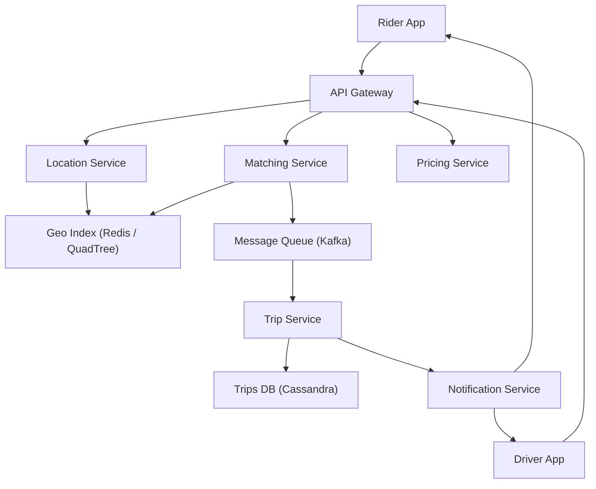

# Design Uber Backend (Ride-Hailing System)

**Difficulty**: Intermediate
**Time**: 60 minutes
**Companies**: Uber, Lyft, Grab, Ola, DiDi (Common interview question)

## 🗺️ Quick Overview



*Driver locations are continuously indexed in a geospatial store; when a rider requests a trip the matching service queries nearby drivers, selects the best match, and coordinates both parties via async events.*

## 1. Problem Statement

Design a ride-hailing system where riders request rides and nearby drivers are matched in real-time.

**Scale reference (Uber):**

```
Trips: 25 million+ per day
Active drivers: 5 million globally
Cities: 10,000+ cities
Active riders: 130 million+ monthly
Peak matching: 100,000+ matches per minute
ETA accuracy: Within 2 minutes for 90% of trips
```

**The core challenge:**

```
Rider opens app → "I need a ride from A to B"
System must:
  1. Find nearby available drivers (< 2 seconds)
  2. Calculate ETA for each driver (< 1 second)
  3. Match best driver (< 3 seconds)
  4. Track driver location in real-time (every 4 seconds)
  5. Calculate fare dynamically (surge pricing)
  6. Handle 100K+ concurrent trip requests

All while drivers are constantly moving.
```

## 2. Requirements

### Functional Requirements
1. Riders request rides (pickup/dropoff locations)
2. Match riders with nearby available drivers
3. Real-time GPS tracking of drivers
4. ETA calculation
5. Fare estimation and calculation
6. Trip lifecycle (request → match → pickup → trip → dropoff)
7. Driver and rider status management

### Non-Functional Requirements
1. **Real-time** (matching < 5 seconds)
2. **Location accuracy** (within 10 meters)
3. **Scalable** (25M+ trips/day)
4. **Available** (99.99% — rides can't "go down")
5. **Low latency** (location updates every 4 seconds)

### Out of Scope
- Payment processing (separate system)
- Driver onboarding
- Rider ratings/reviews
- Multi-stop rides

## 3. High-Level Architecture

```
┌──────────────────────────────────────────────────────────────┐
│                     Client Apps                              │
│  ┌──────────┐                          ┌──────────┐          │
│  │  Rider   │                          │  Driver  │          │
│  │   App    │                          │   App    │          │
│  └────┬─────┘                          └────┬─────┘          │
│       │                                     │                │
│  Request ride                          Send location        │
│  View ETA                              every 4 seconds      │
│  Track driver                          Accept/reject ride   │
└───────┼─────────────────────────────────────┼────────────────┘
        │                                     │
┌───────▼─────────────────────────────────────▼────────────────┐
│                    API Gateway / Load Balancer                │
└───────┬──────────┬──────────┬──────────┬─────────────────────┘
        │          │          │          │
   ┌────▼────┐ ┌───▼───┐ ┌───▼───┐ ┌───▼────────┐
   │  Trip   │ │ Match │ │  ETA  │ │  Location  │
   │ Service │ │Service│ │Service│ │  Service   │
   └────┬────┘ └───┬───┘ └───┬───┘ └───┬────────┘
        │          │         │          │
   ┌────▼──────────▼─────────▼──────────▼────────┐
   │              Kafka (Events)                  │
   │  trip.requested | driver.matched             │
   │  location.updated | trip.completed           │
   └────────┬──────────────┬──────────────────────┘
            │              │
   ┌────────▼────┐   ┌────▼──────────┐
   │  Trip DB    │   │  Location     │
   │ (PostgreSQL)│   │  Store        │
   │             │   │  (Redis +     │
   │  Trips,     │   │   GeoSpatial) │
   │  Fares,     │   │               │
   │  Status     │   │  Driver       │
   └─────────────┘   │  positions    │
                     └───────────────┘
```

## 4. Core Components

### Location Service (Driver Tracking)

```
Driver app sends GPS coordinates every 4 seconds:

{ driverId: "d-123", lat: 37.7749, lng: -122.4194, timestamp: T }

Volume:
  5M active drivers × 1 update every 4 seconds
  = 1.25 million location updates per second

Storage: Redis with Geospatial Index

  GEOADD drivers:available -122.4194 37.7749 "driver-123"
  GEOADD drivers:available -122.4089 37.7833 "driver-456"

  # Find drivers within 3km of rider
  GEOSEARCH drivers:available
    FROMLONLAT -122.4194 37.7749
    BYRADIUS 3 km
    ASC                    # Nearest first
    COUNT 20               # Top 20

  Result:
    driver-456: 0.8 km away
    driver-789: 1.2 km away
    driver-123: 2.1 km away

Redis GeoSpatial uses a Sorted Set internally:
  - Geohash encoding for efficient range queries
  - O(log(N) + M) where M = results returned
  - Handles millions of entries efficiently
```

```
Driver status management:

States:
  OFFLINE → AVAILABLE → EN_ROUTE → ON_TRIP → AVAILABLE
                ↓
           UNAVAILABLE (break, offline)

Redis Hash for driver state:
  HSET driver:123 status "available" lat 37.77 lng -122.41
                  vehicle_type "sedan" rating 4.8

When driver becomes available:
  GEOADD drivers:available {lng} {lat} "driver:123"

When driver matches a ride:
  ZREM drivers:available "driver:123"  # Remove from available pool
  GEOADD drivers:en_route {lng} {lat} "driver:123"

This ensures we only match AVAILABLE drivers.
```

### Matching Service

```
Rider requests ride → Find and assign best driver

Matching algorithm:

1. Find nearby available drivers
   GEOSEARCH drivers:available
     FROMLONLAT {rider_lng} {rider_lat}
     BYRADIUS 5 km
     ASC COUNT 20

2. Calculate ETA for each driver
   For each of 20 drivers:
     ETA = routing_service.getETA(driver.location, rider.location)

3. Score and rank drivers
   score = w1 * (1/ETA) +          # Closer is better
           w2 * driver.rating +      # Higher rated
           w3 * driver.acceptance +   # Acceptance rate
           w4 * vehicle_match         # Vehicle type match

4. Send ride request to top driver
   Driver has 15 seconds to accept

5. If declined or timeout → Next driver
   If 3 drivers decline → Expand search radius

┌──────────┐  request   ┌──────────────┐  find nearby  ┌──────────┐
│  Rider   │───────────▶│   Matching   │──────────────▶│ Location │
│          │            │   Service    │               │  Service │
└──────────┘            └──────┬───────┘               └──────────┘
                               │
                    ┌──────────▼──────────┐
                    │  Send to Driver     │
                    │  Wait 15 seconds    │
                    │                     │
                    │  Accept? ──▶ Match! │
                    │  Decline? ──▶ Next  │
                    │  Timeout? ──▶ Next  │
                    └─────────────────────┘
```

### Trip Service (Trip Lifecycle)

```
Trip state machine:

  REQUESTED → MATCHED → DRIVER_EN_ROUTE → DRIVER_ARRIVED
                                              │
                                         TRIP_STARTED
                                              │
                                         TRIP_COMPLETED
                                              │
                                          FARE_CHARGED

Each state transition:
  1. Update trip record in database
  2. Publish event to Kafka
  3. Notify rider and driver via push/WebSocket

Trip record:
{
  tripId: "trip-abc",
  riderId: "user-123",
  driverId: "driver-456",
  status: "TRIP_STARTED",
  pickup: { lat: 37.77, lng: -122.41, address: "123 Main St" },
  dropoff: { lat: 37.78, lng: -122.43, address: "456 Oak Ave" },
  requestedAt: "2026-01-15T18:00:00Z",
  matchedAt: "2026-01-15T18:00:03Z",
  pickupAt: "2026-01-15T18:05:00Z",
  startedAt: "2026-01-15T18:06:00Z",
  estimatedFare: { min: 12.50, max: 16.00 },
  vehicleType: "sedan",
  surgeMultiplier: 1.5
}
```

### ETA Service

```
Calculate estimated time of arrival:

Simple approach: Haversine distance / average speed
  Not accurate (ignores roads, traffic)

Better approach: Road network graph + traffic data
  Use routing engine (OSRM, Valhalla, or Google Maps API)

  ┌──────────────────────────────────────────┐
  │              ETA Service                 │
  │                                          │
  │  Input: origin (lat/lng), dest (lat/lng) │
  │                                          │
  │  Step 1: Find route on road network      │
  │    → Dijkstra/A* on road graph           │
  │    → Consider one-way streets, turns     │
  │                                          │
  │  Step 2: Apply real-time traffic         │
  │    → Speed data from driver GPS updates  │
  │    → Historical patterns (rush hour)     │
  │    → Live incidents (accidents, closures)│
  │                                          │
  │  Step 3: ML adjustment                   │
  │    → Weather impact                      │
  │    → Time of day patterns                │
  │    → Local knowledge (school zones)      │
  │                                          │
  │  Output: ETA in seconds + route polyline │
  └──────────────────────────────────────────┘

Uber's approach:
  - Road graph partitioned by region
  - Real-time traffic from driver GPS data
  - ML model trained on billions of historical trips
  - ETA recalculated every 30 seconds during trip
  - Accuracy: Within 2 minutes 90% of the time
```

### Surge Pricing

```
When demand > supply → Increase prices to balance

  ┌─────────────────────────────────────────┐
  │         Surge Pricing Engine            │
  │                                         │
  │  City divided into hexagonal zones      │
  │  (H3 geospatial indexing)               │
  │                                         │
  │  For each zone, every 2 minutes:        │
  │                                         │
  │  demand = ride_requests in zone         │
  │  supply = available_drivers in zone     │
  │                                         │
  │  ratio = demand / supply                │
  │                                         │
  │  ratio < 1.0  → surge = 1.0x (no surge)│
  │  ratio 1-2    → surge = 1.2x           │
  │  ratio 2-3    → surge = 1.5x           │
  │  ratio 3-5    → surge = 2.0x           │
  │  ratio > 5    → surge = 3.0x (cap)     │
  │                                         │
  │  Surge multiplier applied to fare       │
  │  Higher prices:                         │
  │    → Discourage non-urgent rides        │
  │    → Attract drivers to high-demand area│
  └─────────────────────────────────────────┘

Geospatial zoning with H3:
  H3 hexagons at resolution 7 (~5.16 km² area)
  Each hex has its own demand/supply metrics
  Adjacent hexes influence each other (smoothing)
```

## 5. Fare Calculation

```
Fare = base_fare
     + (per_mile_rate × distance_miles)
     + (per_minute_rate × trip_duration_minutes)
     + booking_fee
     + tolls
     × surge_multiplier

Example:
  Base fare:      $2.00
  Distance:       5.2 miles × $1.50/mi = $7.80
  Duration:       18 min × $0.35/min = $6.30
  Booking fee:    $2.50
  Tolls:          $0.00
  Subtotal:       $18.60
  Surge (1.5x):   $18.60 × 1.5 = $27.90
  Final fare:     $27.90

Upfront pricing (modern approach):
  - Calculate fare BEFORE trip starts
  - Based on predicted route/duration
  - Rider confirms price before requesting
  - Protects rider from traffic/detour surprises
  - Uber earns/loses on prediction accuracy
```

## 6. Real-Time Tracking

```
During a trip, both rider and driver see live position:

Driver app → Location update every 4 seconds
  ↓
Location Service → Store in Redis
  ↓
WebSocket/Push → Send to rider's app

┌──────────┐  GPS (4s)  ┌──────────────┐  publish   ┌──────────┐
│  Driver  │───────────▶│  Location    │──────────▶│  Kafka   │
│   App    │            │  Service     │           │          │
└──────────┘            └──────────────┘           └────┬─────┘
                                                        │
                                                   ┌────▼─────┐
                                                   │  Push    │
                                                   │  Service │
                                                   └────┬─────┘
                                                        │
                                                   ┌────▼─────┐
                                                   │  Rider   │
                                                   │   App    │
                                                   └──────────┘

Optimization:
  - Don't send every 4s update to rider
  - Server-side smoothing: interpolate between points
  - Client-side animation: smooth car movement on map
  - Reduce frequency when driver is stationary
  - Batch location updates (send 3 at once every 12s)
```

## 7. Geospatial Indexing

```
Problem: Find all drivers within 3km of rider
  5 million drivers globally
  Can't scan all of them for every request!

Solution 1: Geohash
  Divide world into grid cells using geohash prefixes
  Same prefix = nearby locations

  Geohash: "9q8yyk" (San Francisco area)
  Nearby:  "9q8yym", "9q8yyj", "9q8yys"

  Search: Find all drivers with geohash prefix "9q8yy"
  (Returns drivers in ~1km² area)

Solution 2: H3 Hexagonal Grid (Uber uses this)
  World divided into hexagonal cells
  Better than squares (uniform distances)

  Resolution 7: ~5.16 km² per hexagon
  Resolution 9: ~0.11 km² per hexagon

  ┌─────────────────────────────────────┐
  │       H3 Hexagonal Grid            │
  │                                     │
  │     ╱╲    ╱╲    ╱╲                  │
  │   ╱    ╲╱    ╲╱    ╲                │
  │  │  A   │  B   │  C  │              │
  │   ╲    ╱╲    ╱╲    ╱                │
  │     ╲╱    ╲╱    ╲╱                  │
  │   ╱    ╲╱    ╲╱    ╲                │
  │  │  D   │  E   │  F  │              │
  │   ╲    ╱╲    ╱╲    ╱                │
  │     ╲╱    ╲╱    ╲╱                  │
  │                                     │
  │  Rider in cell E                    │
  │  Search cells: E + neighbors        │
  │  (D, A, B, C, F + one more)         │
  └─────────────────────────────────────┘

  Redis: Each cell has a set of drivers
    SADD h3:cell:872830b2fffffff "driver-123"
    SADD h3:cell:872830b2fffffff "driver-456"

  Search: Get all drivers in cell + neighbor cells
    SUNION h3:cell:872830b2 h3:cell:872830b3 ...

Solution 3: QuadTree
  Recursively divide space into quadrants
  Subdivide when a cell has too many drivers
  Good for: Non-uniform distribution (cities vs rural)
```

## 8. Scaling Strategies

```
Scale by city/region:

┌─────────────────────────────────────────────────┐
│              Global Routing Layer                │
│  DNS / Load Balancer routes to nearest region    │
└───────┬──────────────┬──────────────┬────────────┘
        ▼              ▼              ▼
  ┌──────────┐   ┌──────────┐   ┌──────────┐
  │ US Stack │   │ EU Stack │   │APAC Stack│
  │          │   │          │   │          │
  │ Trip Svc │   │ Trip Svc │   │ Trip Svc │
  │ Match Svc│   │ Match Svc│   │ Match Svc│
  │ Location │   │ Location │   │ Location │
  │ ETA Svc  │   │ ETA Svc  │   │ ETA Svc  │
  │          │   │          │   │          │
  │ Redis    │   │ Redis    │   │ Redis    │
  │ Postgres │   │ Postgres │   │ Postgres │
  │ Kafka    │   │ Kafka    │   │ Kafka    │
  └──────────┘   └──────────┘   └──────────┘

Each region is self-contained:
  - Rides don't cross regions
  - Location data stays in region
  - Independent failure domains

Within a region, further partition by city:
  - Each city has its own matching pool
  - Location index per city (smaller search space)
  - Surge pricing per city zone
```

## 9. Key Takeaways

```
1. Geospatial indexing is the core challenge
   Redis GeoSpatial, H3 hexagons, or QuadTree
   Must efficiently answer: "nearby available drivers?"

2. Location updates are high-volume write workload
   1M+ updates/sec, Redis handles this well
   Separate location store from trip database

3. Matching requires speed and fairness
   Find 20 nearby → Score → Offer to best → Timeout → Next
   The 15-second accept window is crucial UX

4. Real-time tracking via WebSocket
   Server-side interpolation for smooth movement
   Batch updates to reduce bandwidth

5. Surge pricing balances supply and demand
   Hexagonal zones, recalculated every 2 minutes
   ML models predict demand before it happens

6. Partition by geography
   Each city/region is independent
   Rides are local, data locality is natural

7. Trip state machine drives the entire flow
   REQUESTED → MATCHED → EN_ROUTE → ARRIVED →
   STARTED → COMPLETED → CHARGED
   Every state transition = event published
```
