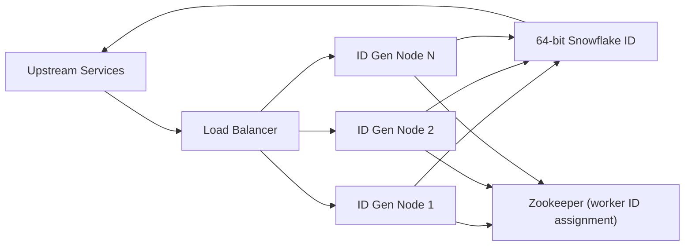

# Design a Distributed Unique ID Generator

**Difficulty**: Beginner/Intermediate
**Time**: 45 minutes
**Companies**: Twitter, Discord, Instagram, Uber (Asked frequently)

## 🗺️ Quick Overview



*Each generator node combines a millisecond timestamp, an assigned worker ID, and a per-node sequence counter to produce a 64-bit ID — no coordination needed at generation time, only at node startup.*

## 1. Problem Statement

Design a system that generates globally unique IDs in a distributed environment.

**Requirements**:
- IDs must be unique across all servers
- IDs should be sortable by time (roughly)
- System must handle 10,000+ IDs per second per server
- IDs should be 64-bit integers (fit in database BIGINT)

**Why This Matters**:
```
Without unique IDs:
- Two orders with same ID → Payment processed twice
- Two users with same ID → Data overwritten
- Two messages with same ID → Messages lost

At scale (Twitter):
- 500M tweets/day = 5,787 tweets/second
- Each tweet needs unique ID instantly
- Auto-increment? Too slow, single point of failure
```

## 2. Requirements

### Functional Requirements
1. Generate unique 64-bit IDs
2. IDs roughly sortable by generation time
3. Support multiple data centers
4. High throughput (10,000+ IDs/second/server)
5. IDs should be numeric (for database indexing)

### Non-Functional Requirements
1. **High availability** (99.99% uptime)
2. **Low latency** (< 1ms per ID)
3. **No coordination** (servers generate independently)
4. **Scalable** (add more servers without conflicts)

### Out of Scope
- UUID (128-bit, not sortable)
- Centralized ID service
- Sequential IDs (privacy concerns)

## 3. Approaches Comparison

### Option 1: Database Auto-Increment

```sql
CREATE TABLE orders (
  id BIGSERIAL PRIMARY KEY,
  ...
);

INSERT INTO orders (...) VALUES (...) RETURNING id;
```

| Pros | Cons |
|------|------|
| Simple | Single point of failure |
| Sequential | Bottleneck at scale |
| Works everywhere | Multi-master conflicts |

**Verdict**: Not suitable for distributed systems.

### Option 2: UUID

```javascript
const uuid = require('uuid');
const id = uuid.v4();  // "550e8400-e29b-41d4-a716-446655440000"
```

| Pros | Cons |
|------|------|
| No coordination | 128-bit (too large) |
| Built-in everywhere | Not sortable by time |
| Truly random | Poor database indexing |
| | Harder to debug/read |

**Verdict**: Good for non-sorted unique identifiers.

### Option 3: Twitter Snowflake (Recommended)

```
64-bit ID structure:
┌─────────────────────────────────────────────────────────────────┐
│ 0 │    Timestamp (41 bits)    │ DC │ Machine │   Sequence     │
│   │        2^41 = 69 years    │ ID │   ID    │   (12 bits)    │
│   │                           │(5) │  (5)    │ 2^12 = 4096/ms │
└─────────────────────────────────────────────────────────────────┘
 1       41 bits                  5      5           12 bits

Total: 1 + 41 + 5 + 5 + 12 = 64 bits
```

| Pros | Cons |
|------|------|
| Time-sortable | Clock sync issues |
| 64-bit (fits DB) | Requires epoch config |
| High throughput | More complex |
| Scales infinitely | |

**Verdict**: Industry standard for distributed ID generation.

### Option 4: Database Ticket Server (Flickr)

```sql
-- Server 1: Odd IDs
CREATE TABLE tickets (
  id BIGINT AUTO_INCREMENT PRIMARY KEY
) AUTO_INCREMENT = 1, AUTO_INCREMENT_INCREMENT = 2;

-- Server 2: Even IDs
CREATE TABLE tickets (
  id BIGINT AUTO_INCREMENT PRIMARY KEY
) AUTO_INCREMENT = 2, AUTO_INCREMENT_INCREMENT = 2;
```

| Pros | Cons |
|------|------|
| Simple concept | Still a bottleneck |
| Sequential IDs | Requires DB call |
| Works with MySQL | Hard to add servers |

**Verdict**: Good for medium scale, not ideal for high scale.

## 4. Deep Dive: Snowflake Implementation

### ID Structure

```javascript
// Snowflake ID: 64 bits
// Bit allocation:
// - Sign bit (1): Always 0 (positive number)
// - Timestamp (41): Milliseconds since epoch
// - Datacenter ID (5): 0-31 datacenters
// - Machine ID (5): 0-31 machines per datacenter
// - Sequence (12): 0-4095 IDs per millisecond

const EPOCH = 1609459200000n;  // 2021-01-01 00:00:00 UTC

class Snowflake {
  constructor(datacenterId, machineId) {
    if (datacenterId > 31n || datacenterId < 0n) {
      throw new Error('Datacenter ID must be 0-31');
    }
    if (machineId > 31n || machineId < 0n) {
      throw new Error('Machine ID must be 0-31');
    }

    this.datacenterId = datacenterId;
    this.machineId = machineId;
    this.sequence = 0n;
    this.lastTimestamp = -1n;
  }

  generate() {
    let timestamp = BigInt(Date.now());

    if (timestamp < this.lastTimestamp) {
      throw new Error('Clock moved backwards. Refusing to generate ID.');
    }

    if (timestamp === this.lastTimestamp) {
      this.sequence = (this.sequence + 1n) & 4095n;  // 12 bits max

      if (this.sequence === 0n) {
        // Sequence exhausted, wait for next millisecond
        timestamp = this.waitNextMillis(this.lastTimestamp);
      }
    } else {
      this.sequence = 0n;
    }

    this.lastTimestamp = timestamp;

    // Compose ID
    const id =
      ((timestamp - EPOCH) << 22n) |   // Timestamp (41 bits, shifted left 22)
      (this.datacenterId << 17n) |      // Datacenter (5 bits, shifted left 17)
      (this.machineId << 12n) |         // Machine (5 bits, shifted left 12)
      this.sequence;                     // Sequence (12 bits)

    return id;
  }

  waitNextMillis(lastTimestamp) {
    let timestamp = BigInt(Date.now());
    while (timestamp <= lastTimestamp) {
      timestamp = BigInt(Date.now());
    }
    return timestamp;
  }

  // Parse ID to extract components
  static parse(id) {
    const timestamp = (id >> 22n) + EPOCH;
    const datacenterId = (id >> 17n) & 31n;
    const machineId = (id >> 12n) & 31n;
    const sequence = id & 4095n;

    return {
      timestamp: new Date(Number(timestamp)),
      datacenterId: Number(datacenterId),
      machineId: Number(machineId),
      sequence: Number(sequence)
    };
  }
}

// Usage
const generator = new Snowflake(1n, 1n);  // Datacenter 1, Machine 1
const id = generator.generate();
console.log(id.toString());  // "1619827200000000000"

// Parsing
console.log(Snowflake.parse(id));
// { timestamp: 2026-01-23T12:00:00.000Z, datacenterId: 1, machineId: 1, sequence: 0 }
```

### Capacity Calculation

```
Per millisecond per machine:
- Sequence: 12 bits = 4,096 IDs/ms
- = 4,096,000 IDs/second per machine

Per datacenter:
- Machines: 5 bits = 32 machines
- = 32 × 4,096,000 = 131 million IDs/second

Total system:
- Datacenters: 5 bits = 32 datacenters
- = 32 × 131 million = 4.2 billion IDs/second

Timeline:
- Timestamp: 41 bits = 2,199,023,255,551 milliseconds
- = 69.7 years from epoch
- Epoch 2021-01-01 → Runs out in 2090
```

### Clock Synchronization Handling

```javascript
class SafeSnowflake extends Snowflake {
  constructor(datacenterId, machineId, options = {}) {
    super(datacenterId, machineId);
    this.maxClockDrift = options.maxClockDrift || 5000;  // 5 seconds
  }

  generate() {
    let timestamp = BigInt(Date.now());

    // Handle clock drift
    if (this.lastTimestamp - timestamp > this.maxClockDrift) {
      // Clock jumped back significantly - likely a major issue
      throw new Error(`Clock moved backwards by ${this.lastTimestamp - timestamp}ms`);
    }

    if (timestamp < this.lastTimestamp) {
      // Small drift - wait it out
      console.warn(`Clock drift detected: ${this.lastTimestamp - timestamp}ms`);
      timestamp = this.waitNextMillis(this.lastTimestamp);
    }

    return super.generate.call(this);
  }
}

// Alternative: Use logical clock
class LogicalSnowflake {
  constructor(datacenterId, machineId) {
    this.datacenterId = BigInt(datacenterId);
    this.machineId = BigInt(machineId);
    this.logicalClock = BigInt(Date.now());
    this.sequence = 0n;
  }

  generate() {
    const realTime = BigInt(Date.now());

    // Logical clock: max(realTime, lastLogicalClock + 1)
    this.logicalClock = this.logicalClock >= realTime
      ? this.logicalClock + 1n
      : realTime;

    const id =
      ((this.logicalClock - EPOCH) << 22n) |
      (this.datacenterId << 17n) |
      (this.machineId << 12n) |
      (this.sequence++ & 4095n);

    return id;
  }
}
```

## 5. System Architecture

### Single Region Deployment

```
                    ┌─────────────────────────────────────────┐
                    │              Application                │
                    │                                         │
                    │   ┌───────────────────────────────────┐ │
                    │   │        ID Generator Pool          │ │
                    │   │                                   │ │
                    │   │  ┌────────┐ ┌────────┐ ┌────────┐│ │
                    │   │  │ Gen 1  │ │ Gen 2  │ │ Gen 3  ││ │
                    │   │  │ DC=1   │ │ DC=1   │ │ DC=1   ││ │
                    │   │  │ M=1    │ │ M=2    │ │ M=3    ││ │
                    │   │  └────────┘ └────────┘ └────────┘│ │
                    │   └───────────────────────────────────┘ │
                    │                                         │
                    │   Each generator produces unique IDs    │
                    │   No coordination required!             │
                    └─────────────────────────────────────────┘
```

### Multi-Region Deployment

```
        US-East (DC=1)              US-West (DC=2)              EU (DC=3)
    ┌─────────────────┐        ┌─────────────────┐        ┌─────────────────┐
    │                 │        │                 │        │                 │
    │  ┌───┐ ┌───┐   │        │  ┌───┐ ┌───┐   │        │  ┌───┐ ┌───┐   │
    │  │M=1│ │M=2│   │        │  │M=1│ │M=2│   │        │  │M=1│ │M=2│   │
    │  └───┘ └───┘   │        │  └───┘ └───┘   │        │  └───┘ └───┘   │
    │                 │        │                 │        │                 │
    └─────────────────┘        └─────────────────┘        └─────────────────┘

    DC=1, M=1 → IDs: 001...        DC=2, M=1 → IDs: 010...        DC=3, M=1 → IDs: 011...
    DC=1, M=2 → IDs: 002...        DC=2, M=2 → IDs: 020...        DC=3, M=2 → IDs: 032...

    All IDs globally unique!
    No cross-region coordination needed!
```

### ID Service Architecture (Optional)

For systems that want centralized ID generation:

```
                              Load Balancer
                                    │
                    ┌───────────────┼───────────────┐
                    ▼               ▼               ▼
             ┌─────────────┐ ┌─────────────┐ ┌─────────────┐
             │ ID Service  │ │ ID Service  │ │ ID Service  │
             │   Node 1    │ │   Node 2    │ │   Node 3    │
             │  (M=1)      │ │  (M=2)      │ │  (M=3)      │
             └──────┬──────┘ └──────┬──────┘ └──────┬──────┘
                    │               │               │
                    └───────────────┼───────────────┘
                                    │
                              ZooKeeper
                          (Machine ID assignment)

API:
  POST /ids?count=100
  Returns: [id1, id2, ..., id100]

  GET /id
  Returns: { id: 123456789 }
```

## 6. Implementation Patterns

### Pattern 1: Embedded Generator (Recommended)

```javascript
// Each service has its own generator
// Machine ID from environment or ZooKeeper

const machineId = process.env.MACHINE_ID || await zookeeper.getMachineId();
const datacenterId = process.env.DATACENTER_ID || 1;

const idGenerator = new Snowflake(datacenterId, machineId);

// Use in application
app.post('/orders', async (req, res) => {
  const orderId = idGenerator.generate();
  await db.query('INSERT INTO orders (id, ...) VALUES ($1, ...)', [orderId.toString()]);
  res.json({ orderId: orderId.toString() });
});
```

### Pattern 2: Pre-Generated ID Pool

```javascript
// For ultra-low latency, pre-generate IDs
class IdPool {
  constructor(generator, poolSize = 1000) {
    this.generator = generator;
    this.poolSize = poolSize;
    this.pool = [];
    this.refillThreshold = poolSize * 0.2;

    this.refill();
  }

  async refill() {
    while (this.pool.length < this.poolSize) {
      this.pool.push(this.generator.generate());
    }
  }

  getOne() {
    if (this.pool.length < this.refillThreshold) {
      // Async refill
      setImmediate(() => this.refill());
    }

    if (this.pool.length === 0) {
      // Fallback to sync generation
      return this.generator.generate();
    }

    return this.pool.shift();
  }

  getMany(count) {
    const ids = [];
    for (let i = 0; i < count; i++) {
      ids.push(this.getOne());
    }
    return ids;
  }
}

// Usage
const pool = new IdPool(new Snowflake(1n, 1n));
const id = pool.getOne();  // Instant, from pool
const batch = pool.getMany(100);  // Get 100 IDs at once
```

### Pattern 3: Range Allocation

```javascript
// Central service allocates ranges, workers use locally
// Good for batch processing

class RangeAllocator {
  constructor(zookeeper) {
    this.zk = zookeeper;
    this.rangeSize = 10000n;  // Allocate 10K IDs at a time
  }

  async allocateRange() {
    // Atomic increment in ZooKeeper
    const counter = await this.zk.incrementCounter('/id-counter', this.rangeSize);
    return {
      start: counter - this.rangeSize,
      end: counter - 1n
    };
  }
}

class RangeConsumer {
  constructor(allocator) {
    this.allocator = allocator;
    this.currentRange = null;
    this.position = 0n;
  }

  async generate() {
    if (!this.currentRange || this.position > this.currentRange.end) {
      this.currentRange = await this.allocator.allocateRange();
      this.position = this.currentRange.start;
    }

    return this.position++;
  }
}

// Usage
const allocator = new RangeAllocator(zookeeper);
const consumer = new RangeConsumer(allocator);

// Generates 10,000 IDs without any coordination
// Then fetches next range
```

## 7. Real-World Implementations

### Twitter Snowflake

```
Original implementation:
- 41-bit timestamp (ms since Twitter epoch)
- 10-bit machine ID
- 12-bit sequence

Used for:
- Tweet IDs
- User IDs
- Direct message IDs

Scale:
- 500M tweets/day
- Peak: 143,199 tweets/second (World Cup 2014)
```

### Instagram's Approach

```javascript
// Instagram: Modified Snowflake using PostgreSQL

// 64-bit ID structure:
// 41 bits: Milliseconds since Instagram epoch (Jan 1, 2011)
// 13 bits: Logical shard ID
// 10 bits: Auto-increment sequence per shard

// PostgreSQL function
CREATE OR REPLACE FUNCTION instagram_id(shard_id INT)
RETURNS BIGINT AS $$
DECLARE
  epoch BIGINT := 1293840000000;
  now_ms BIGINT;
  seq_id INT;
  result BIGINT;
BEGIN
  SELECT FLOOR(EXTRACT(EPOCH FROM clock_timestamp()) * 1000) INTO now_ms;
  SELECT nextval('table_' || shard_id || '_seq') % 1024 INTO seq_id;

  result := (now_ms - epoch) << 23;
  result := result | (shard_id << 10);
  result := result | seq_id;

  RETURN result;
END;
$$ LANGUAGE plpgsql;
```

### Discord's Snowflake

```javascript
// Discord: Modified for their scale
// 64-bit structure:
// 42 bits: Timestamp (ms since Discord epoch: Jan 1, 2015)
// 5 bits: Worker ID
// 5 bits: Process ID
// 12 bits: Increment

// Interesting: They can extract message timestamp from ID
function getTimestampFromId(id) {
  const DISCORD_EPOCH = 1420070400000n;
  return new Date(Number((BigInt(id) >> 22n) + DISCORD_EPOCH));
}

// Check when a message was sent just from the ID!
console.log(getTimestampFromId('1234567890123456789'));
```

### Sony's Sonyflake

```javascript
// Sonyflake: Optimized for fewer machines, longer life
// 64-bit structure:
// 39 bits: 10ms units since epoch (174 years!)
// 8 bits: Sequence (256 per 10ms = 25,600/sec)
// 16 bits: Machine ID (65,536 machines)

// Trade-off: Lower throughput, longer timestamp range
```

## 8. Common Pitfalls

### Pitfall 1: Clock Synchronization

```javascript
// Problem: NTP time adjustment can move clock backwards

// Solution 1: Use monotonic clock when available
const { performance } = require('perf_hooks');
const monotonicTime = () => BigInt(Math.floor(performance.now()));

// Solution 2: Refuse to generate IDs if clock moves back
if (currentTime < lastTime) {
  throw new ClockMovedBackwardsError();
}

// Solution 3: Use logical timestamps
this.logicalTime = Math.max(realTime, this.logicalTime + 1);
```

### Pitfall 2: Machine ID Conflicts

```javascript
// Problem: Two machines get same machine ID
// Result: Duplicate IDs!

// Solution: Use ZooKeeper for coordination
async function getMachineId() {
  const lock = await zk.lock('/machine-id-lock');
  try {
    // Get existing assignments
    const assignments = await zk.getData('/machine-assignments');

    // Find unused ID
    for (let id = 0; id < 32; id++) {
      if (!assignments[id]) {
        // Claim this ID
        await zk.setData('/machine-assignments', {
          ...assignments,
          [id]: { hostname: os.hostname(), timestamp: Date.now() }
        });
        return id;
      }
    }

    throw new Error('No available machine IDs');
  } finally {
    await lock.release();
  }
}
```

### Pitfall 3: Sequence Exhaustion

```javascript
// Problem: More than 4096 IDs needed in one millisecond

// Solution: Wait for next millisecond
if (this.sequence >= 4095n) {
  while (Date.now() <= this.lastTimestamp) {
    // Busy wait (or use setImmediate for cooperative)
  }
  this.sequence = 0n;
  this.lastTimestamp = BigInt(Date.now());
}

// Alternative: Pre-generate pool during low-traffic periods
```

## 9. Interview Tips

### Key Points to Cover

1. **Why not UUID**: Too long (128-bit), not sortable
2. **Why not auto-increment**: Single point of failure, not distributed
3. **Snowflake benefits**: Time-sortable, unique, 64-bit
4. **Clock issues**: Mention NTP sync, clock drift handling
5. **Scalability**: Show the math (billions of IDs/second possible)

### Common Follow-up Questions

**Q: What if the clock goes backwards?**
A: Either refuse to generate (safest), wait for time to catch up, or use logical clock that never goes backwards.

**Q: How do you assign machine IDs?**
A: ZooKeeper/etcd for coordination, Kubernetes pod ID, or environment variable with orchestration.

**Q: Why 41 bits for timestamp?**
A: 2^41 ms = 69 years. Balance between timestamp range and bits for other components.

**Q: Can you extract timestamp from ID?**
A: Yes! Right-shift by 22 bits and add epoch. Useful for debugging.

## 10. Summary

```
Snowflake ID (64 bits):
├── Timestamp (41 bits): ~69 years of IDs
├── Datacenter ID (5 bits): 32 datacenters
├── Machine ID (5 bits): 32 machines per DC
└── Sequence (12 bits): 4,096 IDs per millisecond

Key properties:
├── Unique: Combination of time + location + sequence
├── Sortable: Timestamp at most significant bits
├── Distributed: No coordination needed
├── Fast: In-memory generation, < 1ms
└── Compact: Fits in BIGINT column

When to use:
├── Snowflake: Most distributed systems
├── UUID: When sorting not needed
├── Auto-increment: Small scale, single database
└── Range allocation: Batch processing
```

---

## Related Resources

- [URL Shortener Design](/11-real-world/url-shortener) - Uses ID generation for short codes
- [Pastebin Design](/11-real-world/pastebin) - Similar ID requirements
- [Database Sharding](/01-databases/concepts/sharding-strategies) - Sharding by generated ID

---

## Practice POCs

- [POC #29: Database Sequences](/01-databases/hands-on/database-sequences)
- [POC #65: Idempotency Keys](/07-api-design/hands-on/idempotency-keys)
