# A/B Testing Platform — Capacity Estimation

## Problem Statement

An A/B testing platform serving 100M DAU must assign every user to experiment variants on every page load with sub-10ms latency, collect billions of interaction events per day for statistical analysis, and support hundreds of concurrent experiments across product teams. The read-to-write ratio is 99:1 — assignment lookups dominate, while experiment configuration changes are rare. The platform underpins every product decision, so correctness (consistent assignment) and availability (99.99%) are non-negotiable.

## Functional Requirements

- Assign users to experiment variants deterministically and consistently across sessions
- Support feature flag evaluation with targeting rules (country, device, user segment)
- Collect experiment exposure and conversion events at full traffic scale
- Provide near-real-time dashboards and statistical significance calculations
- Support 500+ concurrent experiments without degrading assignment latency
- Allow gradual rollouts (0% → 100%) with kill-switch capability

## Non-Functional Requirements

| Requirement | Target |
|-------------|--------|
| Assignment read latency | < 5ms (P99) |
| Event write latency | < 50ms (P99) |
| Availability | 99.99% (< 53 min/year downtime) |
| Durability (event data) | 99.999999999% (S3) |
| Assignment throughput | 2M QPS peak |
| Event ingestion throughput | 120K events/s peak |
| Experiment config propagation | < 30 seconds to all nodes |

## Traffic Estimation

### DAU → Peak QPS Calculation

| Metric | Calculation | Result |
|--------|-------------|--------|
| DAU | Given | 100M |
| Page loads per user per day | Mobile + web browsing avg | ~20 |
| Assignment calls per page load | Flags checked per render | ~5 |
| Raw assignment calls/day | 100M × 20 × 5 | 10B |
| Event exposures/day | 100M × 20 page loads (1 exposure each) | 2B |
| Conversion events/day | 100M × 4 avg conversions | 400M |
| Total events/day | exposures + conversions | ~2.4B |
| Avg assignment QPS | 10B / 86,400 | ~115K |
| Peak assignment QPS (3× avg) | 115K × 3 (morning surge + deploy) | ~345K |
| Burst peak (marketing push) | 345K × 6 (flash sale / launch) | **~2M QPS** |
| Avg event QPS | 2.4B / 86,400 | ~28K |
| Peak event QPS (3× avg) | 28K × 3 | ~84K |
| Burst event QPS | 84K × 1.5 | **~120K QPS** |
| Read QPS (99% of traffic) | 2M × 0.99 | ~1.98M |
| Write QPS (1% of traffic) | 2M × 0.01 | ~20K (config writes) |

**Key insight**: At 2M assignment QPS, each API server handling 5K RPS needs 400 servers — but with Redis caching flag configs, most reads never hit DynamoDB. Cache hit rate target: 99.5%.

## Storage Estimation

| Data Type | Per Item Size | Daily Volume | Growth/Year |
|-----------|--------------|--------------|-------------|
| Experiment configs | 2 KB avg (rules + variants) | 500 experiments × 10 updates | Negligible |
| User assignment cache (Redis) | 200 bytes (userId + variantMap) | 100M active users | ~20 GB working set |
| Exposure events (Kafka → S3) | 500 bytes JSON | 2B events/day | ~365 TB/year raw |
| Conversion events (Kafka → S3) | 600 bytes JSON | 400M events/day | ~87 TB/year raw |
| Parquet compressed (Athena) | ~120 bytes after Parquet + Snappy | 2.4B events/day | ~105 TB/year |
| Aggregated metrics (DynamoDB) | 1 KB per experiment per hour | 500 × 24 | ~12 MB/day |
| **Total S3 storage** | — | ~8 TB/day raw | **~105 TB/year compressed** |

**Storage notes**:
- Raw S3 retained 90 days for reprocessing: ~720 TB hot storage
- Parquet (Athena-queryable) retained 3 years: ~315 TB
- S3 Intelligent-Tiering moves data >30 days old to cheaper tiers automatically

## Component Sizing

### Compute — EC2

| Component | Instance Type | vCPU | RAM | Count | Handles | Monthly Cost |
|-----------|--------------|------|-----|-------|---------|-------------|
| Assignment API (flag service) | m5.xlarge | 4 | 16 GB | 80 | 25K RPS each → 2M total | $11,680 |
| Event collector API | c5.large | 2 | 4 GB | 40 | 3K events/s each → 120K total | $2,480 |
| Config sync service | t3.medium | 2 | 4 GB | 6 | Pub/sub DynamoDB → Redis | $180 |
| Stats computation workers | c5.2xlarge | 8 | 16 GB | 20 | Athena queries + significance calc | $5,520 |
| **Subtotal Compute** | | | | **146** | | **$19,860** |

**Sizing math for assignment API**: Each m5.xlarge handles ~25K RPS with Redis cache (mostly memory lookup + JSON serialization). At 2M peak QPS: 2,000,000 / 25,000 = 80 instances. Auto Scaling group scales 40–80 based on CPU.

**Sizing math for event collectors**: Each c5.large handles ~3K writes/s (Kafka producer, async). At 120K peak: 120,000 / 3,000 = 40 instances.

### Database — DynamoDB

| Table | Use Case | Capacity Mode | Read CU | Write CU | Storage | Monthly Cost |
|-------|----------|--------------|---------|----------|---------|-------------|
| Experiments | Experiment config + targeting rules | On-demand | — | — | 5 GB | $6.25 |
| UserAssignments | Persistent assignment log (audit) | On-demand | — | — | 500 GB | $125 |
| MetricsAggregates | Hourly rollups per experiment | Provisioned | 500 RCU | 200 WCU | 50 GB | $180 |
| **Subtotal DynamoDB** | | | | | | **$311** |

**Note**: DynamoDB is NOT in the hot path for assignments — Redis serves 99.5% of reads. DynamoDB is the source of truth; Redis is warmed on startup and invalidated via config-sync service.

### Cache — ElastiCache Redis

| Cache Tier | Use Case | Instance | Nodes | Memory | Replication | Monthly Cost |
|-----------|----------|----------|-------|--------|-------------|-------------|
| Flag config cache | Experiment configs + targeting rules | r6g.large | 3 (1W+2R) | 13.5 GB total | Yes | $990 |
| Assignment cache | Recent user→variant map (LRU, 1hr TTL) | r6g.2xlarge | 6 (cluster) | 96 GB total | Yes (3 shards × 2) | $4,968 |
| **Subtotal Cache** | | | **9 nodes** | **~110 GB** | | **$5,958** |

**Memory math for assignment cache**: 100M DAU × 200 bytes per user record = 20 GB. With 20% overhead and replication factor of 2 across 3 shards: 20 GB × 2.4 = ~48 GB needed → 6× r6g.2xlarge (16 GB each) = 96 GB total provides comfortable headroom.

**Flag config cache**: 500 experiments × 2 KB avg = 1 MB — tiny. The r6g.large cluster is sized for throughput (2M QPS hitting Redis), not memory. Each r6g.large handles ~200K ops/s → 3 nodes × 200K = 600K/s read capacity. At 2M peak, we rely on connection pooling and pipelining from the 80 API servers.

**Throughput concern**: At 2M QPS against 3-node Redis cluster, add a local in-process cache (Caffeine/node-cache) per API server with 1-second TTL. This absorbs 95% of reads locally, reducing Redis load to ~100K QPS.

### Object Storage — S3

| Bucket | Use | Size (steady state) | Requests/month | Monthly Cost |
|--------|-----|---------------------|----------------|-------------|
| `events-raw` | Raw JSON events, 90-day retention | 720 TB | 2.4B PUT + 500M GET | $16,560 |
| `events-parquet` | Athena-queryable Parquet, 3-year retention | 315 TB | 500M GET (Athena scans) | $7,245 |
| `experiment-configs-backup` | Config snapshots, versioned | 10 GB | 50K | Negligible |
| **Subtotal S3** | | **~1,035 TB** | | **~$23,805** |

**S3 pricing breakdown** (us-east-1, 2024):
- First 50 TB/month: $0.023/GB = 50,000 GB × $0.023 = $1,150
- Next 450 TB/month: $0.022/GB = 450,000 GB × $0.022 = $9,900
- Remaining 535 TB: $0.021/GB = 535,000 GB × $0.021 = $11,235
- PUT requests: 2.4B × $0.005/1000 = $12,000
- GET requests: 500M × $0.0004/1000 = $200
- S3 Intelligent-Tiering reduces cost ~30% after 30 days

### Networking / CDN

| Component | Throughput | Monthly Cost |
|-----------|-----------|-------------|
| ALB (assignment API) | 2M RPS peak, ~500B avg response | $4,500 |
| ALB (event collector) | 120K RPS peak, ~100B avg response | $1,800 |
| CloudFront (SDK + dashboard) | 5 TB/month (JS SDK distribution) | $450 |
| VPC Data Transfer (inter-AZ) | ~50 TB/month (Kafka replication + Redis sync) | $5,000 |
| **Subtotal Network** | | **$11,750** |

**ALB pricing**: $0.008/LCU-hour. 1 LCU = 1K new connections/s OR 3K active connections OR 1 GB/hour. At 2M RPS with keep-alive (assume 1 connection per 100 requests): 20K new connections/s = 20 LCU × $0.008 × 720 hours = $115/month per ALB. Real cost dominated by processed bytes: 2M × 500B × 86400 × 30 = ~2.6 PB/month. AWS charges $0.008/GB processed = ~$20,800. Adjusted: ~$4,500 realistic with reserved capacity.

### Message Queue — MSK (Kafka)

| Cluster | Use Case | Brokers | Instance | Partitions | Throughput | Retention | Monthly Cost |
|---------|----------|---------|----------|-----------|-----------|-----------|-------------|
| events-ingest | Exposure + conversion events | 6 | kafka.m5.xlarge | 200 | 120K msg/s in | 24 hours | $4,320 |
| config-updates | Experiment config change propagation | 3 | kafka.t3.small | 10 | < 10 msg/s | 7 days | $540 |
| **Subtotal MSK** | | **9 brokers** | | | | | **$4,860** |

**Throughput math**: 120K events/s × 600 bytes avg = 72 MB/s ingest. Each m5.xlarge broker handles ~50 MB/s → 72/50 = 2 brokers minimum. Run 6 for 3× headroom + replication factor 3.

**Retention**: 24-hour retention on events-ingest. Flink/Spark Structured Streaming consumes within minutes and writes to S3. 24 hours provides replay buffer for consumer failures.

### Analytics — Athena

| Query Type | Frequency | Data Scanned/query | Cost/query | Monthly Cost |
|-----------|-----------|-------------------|-----------|-------------|
| Experiment significance check | 500 experiments × 4/day | 2 TB (partitioned, Parquet) | $10 | $60,000 |
| Dashboard metrics | 200 dashboard loads/day × 50 queries | 100 GB | $0.50 | $3,000 |
| Ad-hoc analysis | 50 queries/day | 500 GB avg | $2.50 | $3,750 |
| **Subtotal Athena** | | | | **~$66,750** |

**Cost concern**: Athena at $5/TB scanned is the largest variable cost. Mitigations:
1. Partition by `experiment_id/date/hour` — reduces scan from full dataset to 2 TB per significance check
2. Use Parquet + Snappy compression — 5× compression reduces scan cost
3. Pre-aggregate hourly counts to DynamoDB MetricsAggregates table — dashboard queries hit DynamoDB ($0.00025/read), not Athena

**With optimization**: Athena cost drops to ~$8,000–$12,000/month. Unoptimized $66K is the worst case.

## Monthly Cost Summary

| Component | Monthly Cost | % of Total |
|-----------|-------------|-----------|
| EC2 Compute (146 instances) | $19,860 | 25% |
| DynamoDB | $311 | 0.4% |
| ElastiCache Redis (9 nodes) | $5,958 | 7.5% |
| S3 Storage (~1 PB) | $23,805 | 30% |
| MSK Kafka (9 brokers) | $4,860 | 6% |
| Athena (optimized) | $10,000 | 12.5% |
| ALB + CloudFront + Network | $11,750 | 15% |
| Other (Lambda, CloudWatch, WAF) | $3,000 | 3.8% |
| **Total** | **~$79,544** | **100%** |

**Range**: $60K–$100K/month depending on Athena query optimization maturity and Reserved Instance coverage. With 1-year Reserved Instances on EC2 and ElastiCache (~40% savings on compute): saves ~$10K/month → floor of ~$60K/month.

## Traffic Scale Tiers

| Tier | DAU | Peak QPS | Servers | DB | Cache | Monthly Cost | Key Bottleneck |
|------|-----|----------|---------|----|----|-------------|----------------|
| 🟢 Startup | 1M | ~20K | 4× c5.large | 1 RDS PostgreSQL (flags) | 1 Redis node (r6g.medium) | ~$1,500 | Single Redis node; RDS for assignments |
| 🟡 Growing | 10M | ~200K | 12× m5.large | RDS + 2 read replicas; DynamoDB for events | Redis cluster 3-node | ~$8,000 | Redis throughput; RDS read replica lag |
| 🔴 Scale-up | 100M | ~2M | 80× m5.xlarge | DynamoDB (all tables) | Redis cluster 6-node + local cache | ~$80K | Athena cost; S3 storage growth |
| ⚫ Production | 500M | ~10M | 400× m5.xlarge + ASG | DynamoDB global tables (multi-region) | Redis cluster 18-node (3 regions) | ~$350K | Cross-region consistency; stat significance compute |
| 🚀 Hyperscale | 1B+ | ~20M | Custom fleet + spot instances | DynamoDB + Cassandra hybrid | Distributed cache (Memcached fleet) | ~$600K | Experiment isolation; analyst compute costs |

## Architecture Diagram

```mermaid
graph TD
    A[Client Browser / Mobile App] --> B[CloudFront CDN\nJS SDK distribution]
    A --> C[ALB - Assignment]
    A --> D[ALB - Events]

    C --> E[Assignment API Servers\n80× m5.xlarge]
    D --> F[Event Collector API\n40× c5.large]

    E --> G[Local In-Process Cache\nCaffeine 1s TTL per server]
    G -->|cache miss ~5%| H[ElastiCache Redis Cluster\n6-node r6g.2xlarge\nAssignment cache 1hr TTL]
    G -->|flag config miss| I[ElastiCache Redis Cluster\n3-node r6g.large\nFlag config cache]

    H -->|cache miss ~0.5%| J[DynamoDB\nExperiments + UserAssignments]
    I -->|config miss| J

    F --> K[MSK Kafka Cluster\n6× m5.xlarge brokers\n200 partitions]

    K --> L[Flink / Spark Structured Streaming\n20× c5.2xlarge workers]
    L --> M[S3 Raw Events Bucket\n90-day retention, 720 TB]
    L --> N[S3 Parquet Bucket\n3-year retention, 315 TB]

    N --> O[Athena\nSQL analytics engine]
    O --> P[Stats Dashboard\nSignificance + metrics]

    Q[Config Sync Service\n6× t3.medium] -->|DynamoDB Streams| J
    Q -->|invalidate + reload| I
    Q -->|broadcast| R[MSK config-updates topic]
    R --> E

    S[Experiment Control Plane\nInternal admin UI] --> J
    S --> Q
```

## Interview Tips

- **Key insight — local cache is the multiplier**: At 2M QPS, Redis alone cannot serve all reads within latency budget. Add a 1-second in-process cache (Caffeine, Go sync.Map) per API server. This absorbs 95%+ of flag reads locally — Redis only sees cache misses (~100K QPS). Without this layer, you'd need 30+ Redis nodes just for throughput.

- **Key insight — consistent hashing for assignment**: User-to-variant assignment must be deterministic. Use `hash(userId + experimentId) mod 100` to assign bucket (0–99). Variants map to bucket ranges. This requires zero storage for the assignment itself — just recompute on each request. Only write to DynamoDB for audit/debugging, not for serving.

- **Common mistake — Athena for real-time dashboards**: Candidates often propose Athena for live experiment metrics. Athena is batch/analytical — queries take 10–60 seconds and cost $5/TB. Real-time metrics (experiment dashboard refreshing every 30s) should hit pre-aggregated DynamoDB tables written by the streaming pipeline, not raw S3 via Athena.

- **Follow-up question — how do you handle experiment collision?**: If User A is in Experiment 1 (control) AND Experiment 2 (treatment), interactions may be confounded. Interviewers ask this to test statistical awareness. Answer: maintain an experiment exclusion/mutual-exclusion layer in the flag config. Use orthogonal or stratified sampling. The config system enforces that overlapping experiments have independent hash namespaces.

- **Scale threshold**: At 10M DAU, Redis with 3 nodes handles ~600K QPS — sufficient. At 100M DAU with 2M burst QPS, you MUST add local in-process caching at the API tier. At 500M DAU, you need multi-region Redis with local reads, accepting eventual consistency on flag config propagation (30-second lag is acceptable for A/B tests).

- **Key number to memorize**: 2M assignment QPS / 80 servers = 25K RPS per server. Each server also maintains a local Caffeine cache of ~500 KB (all active flag configs fit in L3 cache). Flag evaluation is CPU-bound string comparison — no I/O in the hot path.
