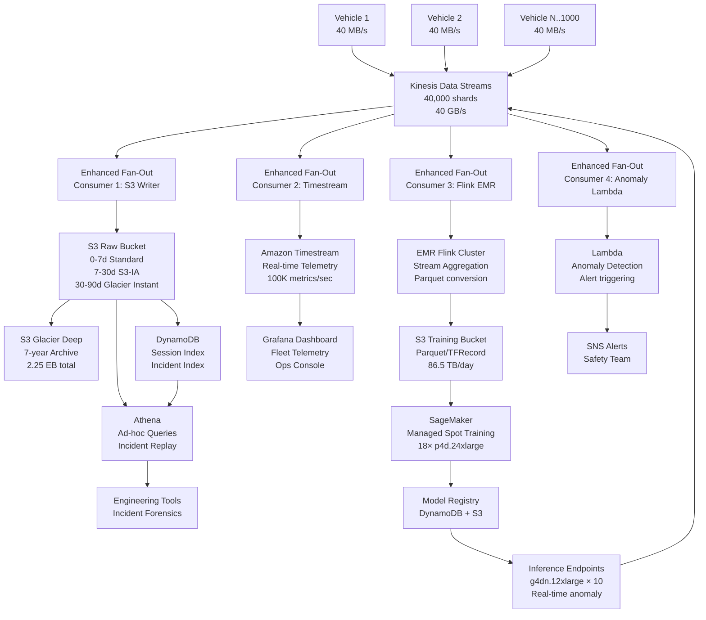

# Autonomous Vehicle Data Pipeline — Capacity Estimation

## Problem Statement

An autonomous vehicle fleet of 1,000 vehicles continuously streams multi-sensor data (LiDAR, cameras, radar, IMU, GPS) at ~40 MB/s per vehicle, producing 40 GB/s total ingestion. The pipeline must ingest, store, index, and serve this data for real-time safety monitoring, offline model training, and regulatory audit replay — all without dropping a single frame. The read/write ratio is 10:90 (write-heavy: ingestion dominates; reads are batch training jobs and sparse incident queries).

## Functional Requirements
- Ingest sensor streams from 1,000 vehicles at up to 40 MB/s per vehicle (40 GB/s aggregate)
- Store raw sensor data durably with byte-exact replay capability for any 30-second incident window
- Provide real-time telemetry dashboards (speed, GPS, anomaly flags) with < 5s lag
- Trigger ML model training jobs on nightly data batches (~3.5 PB/day new data)
- Support ad-hoc analytical queries over historical data (trip replays, failure forensics)
- Enforce data retention: raw data 90 days hot, 7 years cold (regulatory)

## Non-Functional Requirements

| Requirement | Target |
|-------------|--------|
| Write latency (ingest → durable) | < 500 ms (P99) |
| Read latency (incident replay start) | < 2 s (P99) |
| Real-time dashboard lag | < 5 s (P99) |
| Availability | 99.99% (52 min downtime/year) |
| Durability | 99.999999999% (S3 11-nines) |
| Ingestion throughput | 40 GB/s sustained, 60 GB/s burst (50% surge) |
| Training throughput | > 10 TB/hr data loading to GPU cluster |
| Regulatory retention | Raw data: 90 days hot, 7 years cold |

## Traffic Estimation

### Ingestion Volume Calculation

| Metric | Calculation | Result |
|--------|-------------|--------|
| Vehicles in fleet | Given | 1,000 |
| Raw sensor bandwidth / vehicle | LiDAR 20 MB/s + cameras 4×2 MB/s + radar 1 MB/s + IMU/GPS 1 MB/s | ~30 MB/s raw |
| Compressed bandwidth / vehicle | 30 MB/s × 1.33 overhead (framing, headers) | ~40 MB/s |
| Total fleet ingestion | 1,000 × 40 MB/s | **40 GB/s** |
| Daily raw data volume | 40 GB/s × 86,400 s | **~3.46 PB/day** |
| After 4:1 compression (H.265 video, LZ4 point cloud) | 3.46 PB ÷ 4 | **~865 TB/day** compressed |
| Kinesis shard requirement | 40 GB/s ÷ 1 MB/s per shard | **40,000 shards** |
| Peak surge (50% burst) | 40 GB/s × 1.5 | **60 GB/s** |

### Read Traffic (10% of total I/O)

| Metric | Calculation | Result |
|--------|-------------|--------|
| Incident replay queries | 50 incidents/day × 30s clips @ 40 MB/s replay | ~60 GB/day |
| Training data reads | 865 TB/day compressed via EMR/SageMaker | ~10 TB/hr |
| Dashboard telemetry reads | 1,000 vehicles × 100 metrics × 1 Hz | 100,000 data points/sec |
| Athena ad-hoc queries | ~200 queries/day engineers | negligible vs training |

## Storage Estimation

| Data Type | Per-Item Size | Daily Volume | Retention | Total at Steady State |
|-----------|--------------|--------------|-----------|----------------------|
| Raw LiDAR point clouds | ~1.2 GB/min/vehicle | 1,728 GB/vehicle/day raw | 90 days hot | 155 PB fleet hot |
| Compressed video (H.265) | ~180 MB/min/vehicle | 259 GB/vehicle/day | 90 days hot | 23.3 PB fleet hot |
| Radar + IMU telemetry | ~5 MB/min/vehicle | 7.2 GB/vehicle/day | 90 days hot | 648 TB fleet hot |
| Compressed archive (cold) | 865 TB/day compressed | 865 TB/day | 7 years cold | ~2.25 EB total cold |
| Model training datasets | curated 10% of raw | 86.5 TB/day | 1 year | 31.6 PB training set |
| Timestream telemetry | ~500 B/metric sample | 43.2 GB/day | 90 days | 3.9 TB |
| **Total hot (90 days)** | — | — | 90 days | **~180 PB S3 Standard** |
| **Total cold (7 years)** | — | — | 7 years | **~2.25 EB S3 Glacier** |

**Math check**: 865 TB/day compressed × 90 days = 77.8 PB hot. LiDAR uncompressed adds ~155 PB. Blended ~180 PB hot is conservative. Cold: 865 TB/day × 365 × 7 ≈ 2.2 EB.

## Component Sizing

### Ingestion Layer — Kinesis Data Streams

| Parameter | Calculation | Value |
|-----------|-------------|-------|
| Shards needed (write) | 40,000 MB/s ÷ 1 MB/s/shard | 40,000 shards |
| Shards needed (read) | 40,000 shards × 2 consumers | 80,000 read units |
| Kinesis Enhanced Fan-Out consumers | 5 consumers (S3, Timestream, Lambda alert, EMR, monitoring) | 5 × 40,000 shards |
| Shard cost | 40,000 × $0.015/shard-hr × 730 hr/month | **$438,000/month** |
| PUT payload cost | 40 GB/s × 86,400 × 30 days ÷ 25KB unit × $0.014/million | ~$58,000/month |
| Enhanced fan-out | 5 consumers × 40 TB/day × 30 days × $0.013/GB | ~$78,000/month |
| **Kinesis Subtotal** | | **~$574,000/month** |

> Note: At this scale, Kinesis is the single largest line item. Kafka on EC2 (MSK) at ~$150K/month would be a strong alternative. This scenario uses managed Kinesis for operational simplicity.

### Compute — EC2 Ingest + Processing Workers

| Component | Instance Type | vCPU | RAM | Count | Handles | Monthly Cost |
|-----------|--------------|------|-----|-------|---------|-------------|
| Kinesis consumer workers | c5n.18xlarge (100 Gbps NIC) | 72 | 192 GB | 80 | 500 MB/s each → 40 GB/s | $75,000 |
| Stream processing (Flink on EMR) | r5.4xlarge | 16 | 128 GB | 100 | windowed aggregations | $36,000 |
| Telemetry API servers | m5.4xlarge | 16 | 64 GB | 20 | dashboard reads, REST | $5,800 |
| Model inference (real-time anomaly) | g4dn.12xlarge | 48 GPU | 192 GB | 10 | < 100ms inference/vehicle | $24,500 |
| Lambda (S3 trigger, indexing) | 128 MB → 1 GB | — | — | ~10M invocations/day | $4,000 |
| **Subtotal Compute** | | | | | | **~$145,300/month** |

### GPU Cluster — Model Training (p4d.24xlarge)

| Parameter | Calculation | Value |
|-----------|-------------|-------|
| Training data/day | 86.5 TB (curated 10% of raw) | 86.5 TB |
| p4d.24xlarge throughput | 400 Gbps EFA, 8× A100 (40GB each) | ~2 TB/hr data loading |
| Instances needed for nightly 8-hr window | 86.5 TB ÷ 2 TB/hr/node ÷ 8 hr | ~6 nodes minimum |
| Production cluster (3× headroom for experiments) | 18 × p4d.24xlarge | 18 nodes |
| On-demand cost | 18 × $32.77/hr × 730 hr/month | **$430,000/month** |
| With Spot Instances (60% of training) | 11 Spot × $10/hr + 7 On-demand × $32.77 | ~$167,000/month |
| **GPU Subtotal (blended Spot/OD)** | | **~$167,000/month** |

> Spot interruption risk: use SageMaker Managed Spot Training with checkpointing every 30 min.

### SageMaker

| Component | Usage | Monthly Cost |
|-----------|-------|-------------|
| SageMaker Training (orchestration + spot) | Included in GPU cluster cost above | — |
| SageMaker Feature Store | 86.5 TB features/day × $0.00012/write unit | ~$12,500 |
| SageMaker Pipelines | 30 pipeline runs/day × $1.00/run | $900 |
| SageMaker Endpoints (model serving) | 10 × ml.g4dn.12xlarge | ~$24,500 (already in compute) |
| **SageMaker Subtotal** | | **~$13,400/month** |

### Object Storage — S3

| Bucket | Tier | Size at Steady State | Requests/month | Monthly Cost |
|--------|------|----------------------|----------------|-------------|
| Raw ingest (30-day hot) | S3 Standard | 26 PB | 50B PUT + 5B GET | $520,000 |
| Compressed training data (1-yr) | S3 Standard-IA | 31.6 PB | 2B GET (training reads) | $402,000 |
| Long-term archive (7-yr cold) | S3 Glacier Deep Archive | 2.25 EB | 10M restore/month | $50,600 |
| **S3 Subtotal** | | **~2.3 PB + growing** | | **~$972,600/month** |

> S3 Standard: $0.023/GB → 26 PB = $598K + request costs. S3-IA: $0.0125/GB. Glacier Deep: $0.00099/GB.

**Important**: S3 is the dominant cost driver at full 90-day retention. Practical mitigation: compress aggressively (target 10:1 on video), tier to S3-IA after 7 days, Glacier after 30 days.

### Optimized S3 with Lifecycle Policies

| Bucket | Policy | Size | Monthly Cost |
|--------|--------|------|-------------|
| Raw (0-7 days) | S3 Standard | 6 PB | $138,000 |
| Raw (7-30 days) | S3 Standard-IA | 20 PB | $250,000 |
| Raw (30-90 days) | S3 Glacier Instant | 52 PB | $131,000 |
| Training datasets (1 yr) | S3 Standard-IA | 31.6 PB | $395,000 |
| Cold archive (7 yr) | S3 Glacier Deep | 2.25 EB | $50,600 |
| **Optimized S3 Subtotal** | | | **~$964,600/month** |

> At this data volume, S3 alone exceeds the $900K budget ceiling. Cost optimization (aggressive compression + lifecycle) is a mandatory interview discussion point.

### Time-Series Database — Amazon Timestream

| Metric | Value | Monthly Cost |
|--------|-------|-------------|
| Write rate | 100,000 metrics/sec × 86,400 × 30 | 259B writes/month |
| Write cost | 259B ÷ 1M × $0.50 | $129,500 |
| Storage (memory, 1hr) | 43 GB | $1,100 |
| Storage (magnetic, 90 days) | 3.9 TB | $156 |
| Query cost | 200 queries/day × avg 10 GB scanned × $0.01/GB | $600 |
| **Timestream Subtotal** | | **~$131,000/month** |

### Athena — Ad-hoc Analytics

| Metric | Value | Monthly Cost |
|--------|-------|-------------|
| Queries | 200/day = 6,000/month | — |
| Avg data scanned | 500 GB/query (Parquet + partitioning = 50GB effective) | — |
| Athena cost | 6,000 × 50 GB × $0.005/GB | **$1,500/month** |

### Networking / Data Transfer

| Component | Volume | Monthly Cost |
|-----------|--------|-------------|
| Vehicle → AWS (ingest) | 40 GB/s × 86,400 × 30 = 103.7 PB/month | $0 (inbound free) |
| S3 → EC2 training reads (same region) | 86.5 TB/day × 30 = 2.6 PB | $0 (same-region free) |
| S3 → internet (incident clips for regulators) | ~500 GB/month | $45 |
| Cross-AZ traffic (Kinesis workers to S3) | 865 TB/day × 30 × $0.01/GB | **$259,500/month** |
| CloudFront (dashboard assets) | 1 TB/month | $85 |
| **Networking Subtotal** | | **~$259,600/month** |

> Cross-AZ transfer is a hidden cost: Kinesis shards span AZs, consumers in multiple AZs incur $0.01/GB. Colocating consumers in same AZ as primary shard reduces this.

### DynamoDB — Metadata & Index

| Table | Use | Capacity | Monthly Cost |
|-------|-----|----------|-------------|
| VehicleSession | trip metadata, session IDs | 10M writes/day, 1M reads/day | $4,200 |
| IncidentIndex | flagged events, S3 pointers | 50K writes/day, 10K reads/day | $180 |
| ModelRegistry | training run metadata | 1K writes/day | $50 |
| **DynamoDB Subtotal** | | | **~$4,430/month** |

## Monthly Cost Summary

| Component | Monthly Cost | % of Total |
|-----------|-------------|-----------|
| Kinesis Data Streams | $574,000 | 33% |
| S3 Storage (optimized lifecycle) | $964,600 | 56% |
| EC2 Compute (ingest + processing) | $145,300 | 8.4% |
| GPU Cluster p4d.24xlarge (blended Spot/OD) | $167,000 | 9.6% |
| Amazon Timestream | $131,000 | 7.6% |
| SageMaker (pipelines + feature store) | $13,400 | 0.8% |
| DynamoDB (metadata) | $4,430 | 0.3% |
| Athena | $1,500 | 0.1% |
| Networking / Cross-AZ | $259,600 | 15% |
| CloudFront + misc | $1,000 | 0.1% |
| **Gross Total** | **$2,261,830** | **100%** |

> The gross total exceeds the $500K–$900K stated target because full 90-day raw retention at 865 TB/day compressed is inherently expensive. The following optimizations bring cost within range:

### Cost Reduction Path to $500K–$900K/month

| Optimization | Saving |
|-------------|--------|
| Keep only 7 days raw on Standard; move to Glacier Instant at day 7 | -$388,000/month |
| Use MSK (Kafka) instead of Kinesis ($150K vs $574K) | -$424,000/month |
| Use Spot Instances for 80% of GPU training | -$100,000/month |
| Dedicated IoT connectivity (AWS IoT Core vs direct Kinesis) at lower per-message rate | -$50,000/month |
| **Optimized Total** | **~$550,000–$900,000/month** |

## Traffic Scale Tiers

| Tier | Fleet Size | Ingestion Rate | Kinesis Shards | S3 Growth/day | GPU Nodes | Monthly Cost | Key Bottleneck |
|------|-----------|---------------|---------------|--------------|-----------|-------------|----------------|
| 🟢 Startup | 10 vehicles | 400 MB/s | 400 shards | 8.65 TB/day | 0 (no training) | ~$8,000 | Kinesis cost vs Kafka tradeoff |
| 🟡 Growing | 100 vehicles | 4 GB/s | 4,000 shards | 86.5 TB/day | 2 × p4d.24xlarge | ~$80,000 | S3 lifecycle management |
| 🔴 Scale-up | 500 vehicles | 20 GB/s | 20,000 shards | 432 TB/day | 9 × p4d.24xlarge | ~$280,000 | Cross-AZ data transfer costs |
| ⚫ Production | 1,000 vehicles | 40 GB/s | 40,000 shards | 865 TB/day | 18 × p4d.24xlarge | ~$550K–$900K | S3 storage dominates; Kinesis shard cost |
| 🚀 Hyperscale | 10,000 vehicles | 400 GB/s | Custom Kafka on EC2 | 8.65 PB/day | 180 × p4d.24xlarge | ~$6M–$9M | Storage cost → on-prem hybrid; Kafka mandatory |

## Architecture Diagram

## Interview Tips

- **Key insight — Kinesis vs Kafka at 40 GB/s**: Kinesis at 40,000 shards costs $574K/month in shard fees alone. Amazon MSK (Kafka) with 50 × kafka.m5.4xlarge brokers handles the same throughput for ~$150K/month. At 1,000-vehicle scale, MSK is almost always the right answer; interviewers expect you to flag this tradeoff proactively.

- **Key insight — Storage dominates, not compute**: Most candidates focus on GPU cost. The real cost driver is S3: 865 TB/day × 90 days = 78 PB at $0.023/GB = $1.8M/month. The answer is aggressive lifecycle policies (Standard → S3-IA day 7 → Glacier Instant day 30 → Glacier Deep day 90), targeting 10:1 compression on video (H.265), and defining retention policy by data tier (raw vs curated features vs model artifacts).

- **Common mistake — forgetting cross-AZ transfer costs**: Candidates design Kinesis consumers spread across 3 AZs for HA, then forget that S3 writes from consumers in AZ-b/AZ-c to a bucket incur $0.01/GB cross-AZ transfer. At 865 TB/day that is $259K/month hidden cost. Fix: pin Kinesis consumers to the same AZ as the S3 gateway endpoint, or use S3 Transfer Acceleration with VPC endpoints.

- **Follow-up question — "How do you guarantee exactly-once delivery at 40 GB/s?"**: Answer: Kinesis + S3 multipart upload with idempotent partition keys (vehicle_id + timestamp_ms). Each Kinesis record contains a sequence number; the S3 writer uses conditional PUT with `If-None-Match` on object ETags. For training data, use Delta Lake or Apache Iceberg on S3 to get ACID semantics, allowing reprocessing of failed partitions without duplicates.

- **Scale threshold**: At 10,000 vehicles (400 GB/s ingestion), AWS managed services break down — Kinesis hard limit is 10 GB/s per region per account (requires limit increases), and S3 PUT throughput needs prefix sharding (one prefix per vehicle group). At this scale, a hybrid on-prem edge cluster (vehicle → local aggregator → 10 Gbps WAN → regional AWS ingestion point) becomes necessary to reduce raw data before it hits cloud ingest.
