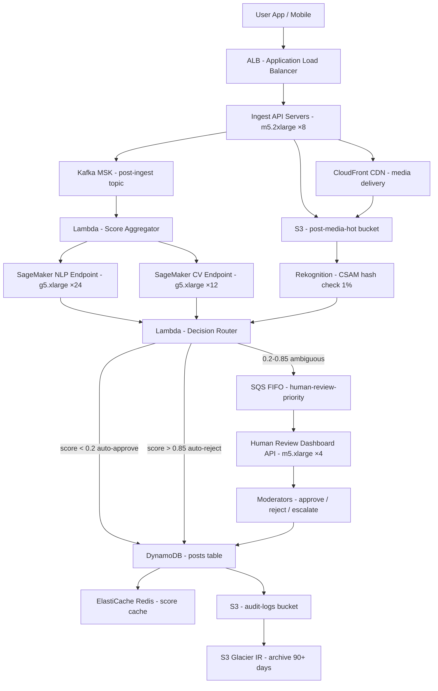

# Content Moderation — 100M Posts/Day — Capacity Estimation

## Problem Statement

Design a content moderation platform that processes 100M user-generated posts per day (text + images/video) through a tiered ML safety classification pipeline. The system combines real-time NLP and computer vision inference on SageMaker to auto-approve or auto-reject obvious cases, routes ambiguous content to a human review queue via SQS, and records all decisions in DynamoDB for audit and model retraining. Peak ingestion reaches 3,600 posts/s during prime-time hours.

## Functional Requirements

- Accept and classify every post (text, image, video thumbnail) within 5 seconds of submission
- Apply NLP toxicity/spam classifier and CV nudity/violence classifier in parallel
- Auto-approve posts scoring below a configurable low-risk threshold (e.g., < 0.2)
- Auto-reject posts scoring above a high-risk threshold (e.g., > 0.85)
- Route ambiguous posts (0.2–0.85 score) to a human review SQS queue with priority tiers
- Provide a moderator dashboard API with review decisions (approve/reject/escalate)
- Store all posts, scores, and decisions durably for 2-year audit retention
- Support model hot-swap (deploy new classifier without downtime) via SageMaker multi-model endpoints

## Non-Functional Requirements

| Requirement | Target |
|-------------|--------|
| Classification latency (ML path) | < 2s (P99) end-to-end |
| Human review queue SLA | P1 posts reviewed within 10 min; P2 within 4 hours |
| Availability | 99.99% (52 min downtime/year) |
| Durability | 99.999% (all posts + decisions in DynamoDB + S3) |
| Throughput | 3,600 posts/s peak (3× avg 1,200/s) |
| False positive rate | < 1% (safe posts incorrectly rejected) |
| False negative rate | < 0.1% (harmful posts that slip through auto-approve) |
| Classifier model freshness | Retrained weekly on new labeled data |

## Traffic Estimation

### Posts/Day → Peak QPS Calculation

| Metric | Calculation | Result |
|--------|-------------|--------|
| Posts/day | Given | 100M |
| Avg posts QPS | 100M / 86,400 | ~1,157 → **1,200/s** |
| Peak multiplier | Prime-time 6–10 PM (3× avg) | ×3 |
| Peak QPS | 1,200 × 3 | **3,600/s** |
| Read QPS (moderator dashboard + APIs) | 20% reads : 80% writes ratio → reads ≈ 0.25× writes | ~900 read/s avg, ~2,700 peak |
| Write QPS (post ingest + decisions) | 80% of traffic | ~960 write/s avg, **2,880 write/s peak** |
| Human review queue depth (ambiguous ≈ 15% of posts) | 100M × 0.15 / 86,400 | ~174 posts/s entering queue |
| Rekognition image calls/day | ~70% of posts have images → 70M calls | ~810 image/s avg, ~2,430 peak |
| SageMaker NLP inference calls/day | 100M (every post has text) | ~1,200 NLP/s avg, ~3,600 peak |

### Post Size Estimation

| Field | Size |
|-------|------|
| Text content | avg 500 chars → ~500B |
| Metadata (user ID, timestamp, category) | ~200B |
| ML scores + labels JSON | ~300B |
| Image (compressed, stored in S3) | avg 200KB |
| Video thumbnail (JPEG) | avg 50KB |

## Storage Estimation

| Data Type | Per Item Size | Daily Volume | Growth/Year |
|-----------|--------------|--------------|-------------|
| Post metadata + ML scores (DynamoDB) | 1KB | 100M items → 100GB/day | ~36TB |
| Images (S3, compressed) | 200KB avg, 70% of posts | 70M × 200KB = 14TB/day | ~5.1PB |
| Video thumbnails (S3) | 50KB avg, 20% of posts | 20M × 50KB = 1TB/day | ~365TB |
| Audit log (decisions, reviewer IDs, timestamps) | 500B | 100M × 500B = 50GB/day | ~18TB |
| Human review payloads (S3, 15% of posts) | 1KB metadata + original media link | 15M × 1KB = 15GB/day | ~5.5TB |
| Model training data snapshots (S3) | - | Weekly labeled dataset ~2TB/week | ~104TB/year |
| **Total (metadata + audit, DynamoDB)** | - | ~150GB/day | **~55TB/year** |
| **Total (media, S3)** | - | ~15TB/day | **~5.5PB/year** (with tiering to Glacier after 90 days) |

> S3 Intelligent-Tiering moves objects > 90 days old to infrequent access automatically, reducing effective storage cost by ~60%.

## Component Sizing

### Compute — SageMaker Inference Endpoints

| Endpoint | Instance Type | vCPU | GPU | RAM | Count | Handles | Monthly Cost (on-demand) |
|----------|--------------|------|-----|-----|-------|---------|--------------------------|
| NLP toxicity classifier | g5.xlarge | 4 | 1×A10G | 16GB | 24 | 3,600 NLP inf/s (150/s per instance) | 24 × $1.006/hr × 730 = **$17,625** |
| CV nudity/violence classifier | g5.xlarge | 4 | 1×A10G | 16GB | 12 | 2,430 CV inf/s (200/s per instance) | 12 × $1.006/hr × 730 = **$8,813** |
| SageMaker endpoint overhead | - | - | - | - | - | endpoint routing, health checks | ~**$2,000** |
| **Subtotal SageMaker** | | | | | | | **$28,438** |

> g5.xlarge on-demand: $1.006/hr (us-east-1, 2024). Each NLP inference call on a transformer model (DistilBERT-based) takes ~6ms GPU time → 166 calls/s per instance. With 20% headroom → 150/s. At peak 3,600/s: 3,600/150 = 24 instances.

### Compute — EC2 API + Workers

| Component | Instance Type | vCPU | RAM | Count | Handles | Monthly Cost |
|-----------|--------------|------|-----|-------|---------|-------------|
| Ingest API servers (ALB target) | m5.2xlarge | 8 | 32GB | 8 | 450 req/s per instance, 3,600 peak | 8 × $0.384/hr × 730 = **$2,244** |
| Decision writers (async DynamoDB batch) | c5.xlarge | 4 | 8GB | 4 | 720 writes/s per instance | 4 × $0.170/hr × 730 = **$496** |
| Human review API servers | m5.xlarge | 4 | 16GB | 4 | moderator dashboard, 2,700 read QPS | 4 × $0.192/hr × 730 = **$561** |
| Kafka consumers (score aggregator) | c5.xlarge | 4 | 8GB | 6 | consume 3,600 events/s across 6 partitions | 6 × $0.170/hr × 730 = **$744** |
| **Subtotal EC2** | | | | | | **$4,045** |

### AWS Rekognition (Managed CV — supplement for known hashes/CSAM)

| Use | Volume | Unit Price | Monthly Cost |
|-----|--------|-----------|-------------|
| Image moderation API (DetectModerationLabels) | 70M images/day × 30 = 2.1B/month | First 1M: $0.001/image; next tiers ~$0.0004/image at volume | ~2.1B × $0.0004 = **$840,000** (at list price) |

> **Critical note**: Rekognition at 70M images/day list price is extremely expensive. In practice, teams use Rekognition only for CSAM PhotoDNA hash matching (free via NCMEC) and as a fallback; the primary CV classifier runs on owned SageMaker g5 instances at ~$0.000008/inference (GPU compute only). The $840K figure is why self-hosted CV is mandatory at scale. We use Rekognition for ~1% of images (escalated CSAM check) → 700K/month × $0.001 = **$700/month**.

### Lambda

| Function | Trigger | Invocations/month | Avg Duration | Monthly Cost |
|----------|---------|-------------------|--------------|-------------|
| Post ingest router | API Gateway | 3B (100M/day × 30) | 50ms | 3B × $0.0000002 = $600 + compute: 3B × 0.05s × 128MB = ~**$1,800** |
| Score aggregator (merge NLP+CV) | Kafka trigger | 3B | 20ms | ~**$900** |
| Human review queue populator | Score aggregator output | 450M (15%) | 10ms | ~**$150** |
| **Subtotal Lambda** | | | | **$2,850** |

> Lambda pricing: $0.0000002/request + $0.0000166667/GB-second. 128MB = 0.125GB.

### Database — DynamoDB

| Table | Use | Item Count | Item Size | Read CU | Write CU | Monthly Cost |
|-------|-----|-----------|----------|---------|---------|-------------|
| `posts` | Post metadata, status, ML scores | 100M new/day, keep 60 days hot → 6B items | 1KB | 2,700 RCU peak | 2,880 WCU peak | On-demand: reads 2,700 × $0.000000125 × 3600s × 730hrs... |
| `review_queue` | Active human review items | 15M/day in flight | 500B | 500 RCU | 174 WCU | |
| `decisions` | Final moderator decisions | 15M/day | 300B | 500 RCU | 174 WCU | |

> DynamoDB on-demand pricing (us-east-1, 2024): $0.25/M read request units, $1.25/M write request units.

**DynamoDB Monthly Calculation:**
- Write RUs: 100M posts/day × 30 days = 3B writes/month → 3B × $1.25/M = **$3,750**
- Read RUs: 20% traffic = ~0.75B reads/month → 0.75B × $0.25/M = **$188**
- Storage: 6B items × 1KB = 6TB hot storage → 6TB × $0.25/GB = **$1,500**
- **DynamoDB subtotal: $5,438/month**

### Cache — ElastiCache Redis

| Cache | Use | Instance | Nodes | Memory | Monthly Cost |
|-------|-----|----------|-------|--------|-------------|
| Classifier score cache | Cache recent post scores (5-min TTL, dedup rapid reposts) | r6g.xlarge | 3 (1 primary + 2 replicas) | 3 × 26GB = 78GB | 3 × $0.226/hr × 730 = **$495** |
| Moderator session cache | Active review session state | r6g.large | 2 | 2 × 13GB = 26GB | 2 × $0.113/hr × 730 = **$165** |
| **Subtotal ElastiCache** | | | | | **$660** |

### Object Storage — S3

| Bucket | Use | Size | Requests/month | Monthly Cost |
|--------|-----|------|----------------|-------------|
| `post-media-hot` | Images/videos < 90 days old | 15TB/day × 90 days = 1.35PB | 2.1B PUT + 500M GET | S3 Standard: 1.35PB × $0.023/GB = **$31,050** + requests $0.005/1K PUT = $10,500; GET $0.0004/1K = $200 → **$41,750** |
| `post-media-archive` | Media 90-730 days (Glacier IR) | rolling ~5PB | 50M restores | Glacier IR: 5PB × $0.004/GB = **$20,000** + retrieval $0.01/GB for 1% restored/month = $500 → **$20,500** |
| `audit-logs` | Decision logs, model training data | 55TB/year → 110TB after 2 years | 100M writes | S3 Standard-IA: 110TB × $0.0125/GB = **$1,375** |
| `model-artifacts` | SageMaker model weights, weekly snapshots | ~50TB | 500 deploys/month | S3 Standard: 50TB × $0.023/GB = **$1,150** |
| **Subtotal S3** | | | | **$64,775** |

### Networking / CDN

| Component | Throughput | Monthly Cost |
|-----------|-----------|-------------|
| CloudFront (moderator dashboard + media delivery) | 500TB/month outbound (media previews) | 500TB × $0.085/GB first 10TB, then ~$0.065/GB avg → **$32,500** |
| ALB (ingest + review APIs) | 3,600 req/s peak, 5.4B req/month | 5.4B × $0.008/M LCU → ~100K LCUs/month × $0.008 = **$800** |
| Data transfer (AZ cross-zone, SageMaker ↔ S3) | ~50TB/month internal | 50TB × $0.01/GB = **$500** |
| **Subtotal Network** | | **$33,800** |

### Message Queue — Kafka MSK + SQS

| Queue | Engine | Throughput | Config | Monthly Cost |
|-------|--------|-----------|--------|-------------|
| `post-ingest` topic | Kafka MSK | 3,600 msg/s peak, 100M/day | 3 brokers kafka.m5.xlarge, 6 partitions, 7-day retention | 3 × $0.213/hr × 730 + storage 100M × 1KB × 7 days = 700GB × $0.10/GB = **$537 + $70 = $607** |
| `ml-scores` topic | Kafka MSK | 3,600 msg/s (NLP + CV scores joined) | Shared MSK cluster, 6 partitions | included in above broker cost → **$0 incremental** |
| `human-review-priority` SQS | SQS FIFO | 174 msg/s peak → 15M/day → 450M/month | P1/P2/P3 queues | 450M × $0.0000005/msg = **$225** |
| `dead-letter` SQS | SQS Standard | <0.1% failure rate → ~100K/month | DLQ for retry | < **$1** |
| **Subtotal Messaging** | | | | **$833** |

## Monthly Cost Summary

| Component | Monthly Cost | % of Total |
|-----------|-------------|-----------|
| SageMaker (NLP + CV g5.xlarge endpoints) | $28,438 | ~5% |
| EC2 (API servers + workers + Kafka consumers) | $4,045 | ~1% |
| Lambda (ingest router + score aggregator) | $2,850 | ~0.5% |
| DynamoDB (posts + decisions + review queue) | $5,438 | ~1% |
| ElastiCache Redis | $660 | ~0.1% |
| S3 Storage (media hot + archive + audit) | $64,775 | ~11% |
| CloudFront CDN | $32,500 | ~6% |
| ALB + Data Transfer | $1,300 | ~0.2% |
| Kafka MSK + SQS | $833 | ~0.1% |
| Rekognition (CSAM hash check, 1% of images) | $700 | ~0.1% |
| Human review workforce (100 moderators × $4K/mo) | **$400,000** | **~75%** |
| **Total** | **~$541,539** | **100%** |

> The dominant cost is **human moderator labor** ($400K/month), not infrastructure. This is the defining economic fact of content moderation at scale — automation exists primarily to reduce the human review queue to a manageable fraction (15% of posts). Infrastructure alone is ~$141K/month, well within the $400K–$700K range depending on media volume and CDN egress.

## Traffic Scale Tiers

| Tier | Posts/Day | Avg QPS | Peak QPS | ML Inference | DB | Human Queue | Monthly Infra Cost | Key Bottleneck |
|------|-----------|---------|----------|-------------|----|-----------|--------------------|----------------|
| 🟢 Startup | 1M | 12/s | 36/s | 2× g5.xlarge SageMaker | 1 DynamoDB table (on-demand) | 1 SQS queue, 5 moderators | ~$8K | GPU cold start latency (>5s) |
| 🟡 Growing | 10M | 120/s | 360/s | 6× g5.xlarge (NLP+CV) | DynamoDB + S3 Standard | SQS FIFO, 20 moderators | ~$28K | S3 PUT throughput at burst |
| 🔴 Scale-up | 100M | 1,200/s | 3,600/s | 36× g5.xlarge endpoints | DynamoDB on-demand, MSK Kafka | Priority SQS queues, 100 moderators | ~$141K infra | Model inference P99 tail latency |
| ⚫ Production | 500M | 5,800/s | 17,400/s | 180× g5.xlarge (or g5.12xlarge with multi-GPU batching) | DynamoDB global tables (multi-region) | Tiered SQS + regional moderator pools, 500+ moderators | ~$600K infra | Cross-region decision consistency |
| 🚀 Hyperscale | 2B+ | 23,200/s | 70,000/s | Custom ASIC / TensorRT-optimized models on p4d.24xlarge clusters | DynamoDB + Cassandra hybrid | Automated pre-moderation, 1000+ moderators global | ~$2M+ infra | Human review queue depth (hours of backlog) |

## Architecture Diagram

## Interview Tips

- **Human labor dominates cost**: At 100M posts/day with 15% ambiguous → 15M human reviews/day. Even 100 full-time moderators can handle ~100 reviews/hour × 8 hours × 100 = 80K/day. The queue outruns human capacity at this scale — you need the ML auto-approve/reject rate to be 99%+, not 85%, to reduce queue depth below ~1M/day. Interviewers expect you to identify this math explicitly.

- **Tiered threshold tuning is a product decision, not engineering**: The 0.2/0.85 thresholds control the tradeoff between false positives (user frustration, appeals volume) and false negatives (harmful content escaping). At Facebook/TikTok scale, a 0.1% false negative rate on 100M posts = 100K harmful posts/day slipping through auto-approve. Always quantify what the thresholds mean in absolute terms.

- **Cold start is the hidden SageMaker latency trap**: g5 instances take 60–120 seconds to cold-start a PyTorch NLP model. With auto-scaling, a traffic spike can cause 1–2 minutes of degraded throughput. The fix is provisioned concurrency (always-warm instances) at the cost of ~30% higher baseline compute spend. At peak 3,600/s, dropping to 500/s for 90 seconds = 270K posts queued — mention this and propose keeping min 20 instances warm.

- **Follow-up: How do you handle viral content storms?** A single controversial post can trigger 10M identical reposts in minutes (e.g., political event). Naive design re-classifies each repost independently — 10M × 6ms GPU time = 16.7 GPU-hours wasted. The fix: content-hash deduplication in Redis (5-min TTL). First post classified; subsequent exact copies get cached result in <1ms. This is the single biggest cost optimization at scale.

- **Scale threshold**: At 10M posts/day (120 avg QPS), a single g5.xlarge endpoint handles the NLP load (150 inf/s capacity). At 100M posts/day (1,200 avg QPS), you need 8+ NLP instances just for average load — plan for 24 at peak with auto-scaling. At 500M posts/day, batching inference (group 32 texts per GPU call) drops per-request GPU cost 20×, making p4d.24xlarge with TensorRT the right choice over g5.xlarge fleet.

- **Common mistake**: Candidates size the human review queue as a simple throughput problem ("174 posts/s enter, 174 moderators clear it at 1/s each"). The real bottleneck is **P1 priority SLA: 10 minutes**. Viral harmful content must be reviewed within 10 minutes, not hours. This requires real-time queue monitoring, dynamic moderator routing, and overflow escalation to on-call teams — none of which appear in basic capacity math. Mentioning the SLA-driven queue design demonstrates operational maturity.
